## Overview

::: {.callout-note}
## Game plan
This lecture provides an introduction to the transformer architecture with a focus on the encoder. 
:::

- [BERT: training](#bert-training) 
- [fine tuning](#fine-tuning)
- [sentence classification](#classification)
- [NER](#ner)
- [SBERT](#sbert)


## BERT {#bert-training} 

::: {.mybox}
** Bidirectional Encoder Representations from Transformers(BERT)**:
- Developed in 2018 by researchers at Google AI Language
- A swiss army knife solution to many common language tasks, such as sentiment analysis and named entity recognition.
:::

- BERT was trained on   Wikipedia (~2.5B words) and Google’s BooksCorpus (~800M words). 
- Trained at Google on 64 TPUs (Tensor Processing Units - roughly speaking, Google's version of the GPU) over 4 days
- Many other versions of BERT have been trained for various purposes

::: {tiny-credit}
Devlin J et al. (2019) [BERT: Pre-training of Deep Bidirectional Transformers for Language Understanding. arXiv 1810.04805](https://arxiv.org/abs/1810.04805)
:::


## Causal vs masked language modeling

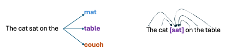

- Predecessors modelled language unidirectionally -- train on predicting the next word
- BERT is designed to extract bidirectional representations:  predict the masked word given both left and right context

::: {.tiny-credit}
- Devlin J et al. (2019) [BERT: Pre-training of Deep Bidirectional Transformers for Language Understanding. arXiv 1810.04805](https://arxiv.org/abs/1810.04805)
:::


## BERT: unidirectional vs bidirectional

- The authors argue that the unidirectionality of models such as GPT limit the choice of architectures 
that can be used during pre-training because every token can only attend to previous tokens in the self-attention layers
of the Transformer. 
- Such restrictions are sub-optimal for sentence-level tasks, and could be very harmful when applying finetuning based approaches to token-level tasks such
as question answering, where it is crucial to incorporate context from both directions

::: {.tiny-credit}
- Devlin J et al. (2019) [BERT: Pre-training of Deep Bidirectional Transformers for Language Understanding. arXiv 1810.04805](https://arxiv.org/abs/1810.04805)
:::


## BERT training

- BERT is an encoder-only transformer and the training is similar to what was described in previous lectures.

| Transformer | Layers	| Hidden Size|	Attention Heads| Parameters|	Processing|	Length of Training|
|--------------|-------------|-------------|-------------|-------------|-------------|-------------|
|BERTbase|	12|	768| 12| 110M| 4 TPUs| 4 days|
|BERTlarge| 24| 1024| 16| 340M| 16 TPUs| 4 days|


## BERT Architecture

:::: {.columns}
::: {.column width=80%}


- The dimension of the FFN is 3072
- There are 12 attention heads in the multihead attention block (BERT^base^  -- 16 for  BERT^large^).

- The transformer block is repeated Nx times (12 for BERT^base^ and 24 for BERT^large^), that is, the output of one block is used as input for the next
- The output of the final block is used as input for the linear layer

* **Differences to the original transformer**: 
  - The embedding vector is 768 (BERT^base^) or 1024 (BERT^large^) dimensional rather than 512
  - Positional embeddings are absolute and learnt during training (limited to 512 positions)^[Thus, BERT cannot handle sentences longer than 512 tokens]
  - The linear layer head changes according to the application
  - Uses WordPiece tokenizer

:::
::: {.column width=20%}

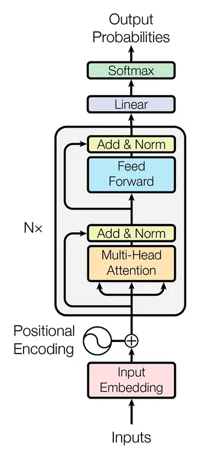{width=100%}

:::
::::


## BERT vs. GPT

::: {.mybox}
**Major differences**:

- GPT handles specific tasks using specific prompts. BERT needs to be fine tuned.
- GPT is trained using unidirectional context, BERT bidirectional
- BERT is not designed to generate text (this is a decoder task)
:::

- We will provide some examples below


## Masked Language Modeling (MLM)

::: {.callout-note appearance="simple" icon=false}
### Core Objective
**MLM**: Predict the correct word given both the left and right bidirectional context.
:::

- BERT is forced to utilize words on either side of the token simultaneously to predict the missing mask.
- Comparing bidirectional reasoning capabilities across different sentence structures:

:::: {.columns}
::: {.column width="50%"}
**Left Context Task**

> "An elephant's trunk can be used to grasp yellow [?]."
:::

::: {.column width="50%"}
**Full Context MLM Task**

> "An elephant's [?] can be used to grasp yellow bananas."
:::
::::


## Left and right context in BERT
Recall the definition of the attention output

$$
\underbrace{\mathrm{Attention}(\mathbf{Q},\mathbf{K},\mathbf{V})}_{N\times N}
= 
\mathrm{softmax}\left(
  \frac{
\underbrace{\mathbf{Q}}_{N\times d_{hidden}} \times 
\underbrace{\mathbf{K}^T}_{d_{hidden}\times N}}
{\sqrt{d_{k}}}
\right)
$$

- Recall that for the masked attention in the decoder, we mask words to "zero out" interactions of tokens with other subsequent tokens

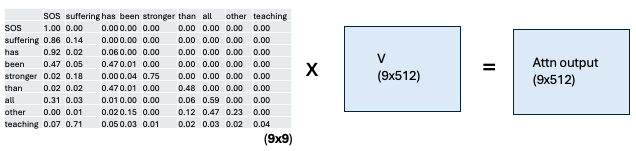{width=80% fig-align="center"}

## Left and right context in BERT

- In contrast, with BERT there is no mask
- Each token therefore attends to other tokens to the left and the right
- The pretraining procedure instead selects 15% of the tokens from the sentence to be masked
  - 80% of the time, the token is replaced by `[MASK]`: Berlin is the <span style="background-color: #e0f2fe; padding: 2px 6px; border-radius: 4px;">[MASK]</span> of Germany
  - 10% of the time, the token is replaced by a random word: Berlin is the <span style="background-color: #e0f2fe; padding: 2px 6px; border-radius: 4px;">hedgehog</span>  of Germany
  - 10% of the time, the token is not replaced: Berlin is the <span style="background-color: #e0f2fe; padding: 2px 6px; border-radius: 4px;">capital</span>  of Germany

::: {.small-text}
The motivation for not always replacing the token with `[MASK]` is that this would created a mismatch between pre-training and
fine-tuning, since the [MASK] token does not appear during fine-tuning. Using the random/unchanged tokens mitigates this mismatch.
:::


## Loss: BERT

{width=80% fig-align="center"}

- Like any encoder, the BERT model produces embeddings as output.
- We focus on the output for the masked position to calculate the loss
- Backpropation and gradient descent are as usual

## Loss: BERT

- In detail,
- The LM head takes the output of the final transformation layer $L$, multiplies it by the unemedding layer and uses softmax to transform the output into probabilities

$$
\begin{align}
\mathbf{u}_i &= \mathbf{h}_i^L \mathbf{E}^T \\ 
\mathbf{y}_i &= \mathrm{softmax}(\mathbf{u}_i)
\end{align}
$$

- In our example, the $x_i$ that corresponds to "capital", the loss is the probability of the correct word "capital" given the output
$$
L_{MLM}(x_i) = -\log P(x_i\mid \mathbf{h}_i^L)
$$
- Gradients are obtained by taking the average loss over a batch

$$
-\frac{1}{M}\sum_{m=1}^M \log P(x_i\mid \mathbf{h}_i^L)
$$

## Next-sentence prediction (NSP)

::: {.mybox}
**NSP**:

- Many downstream applications involve learning relationships between sentences rather than single words (tokens)
:::

- BERT is therefore also trained on the next-sentence prediction task
- 50% of the time, correct pairs of sentence are chosen

> Why did the chicken cross the road? To get to the other side

- 50% of the time, incorrect pairs of sentence are chosen

> Why did the chicken cross the road? The climate crisis is driven by burning fossil fuels.

## Next-sentence prediction (NSP)

::: {.mybox}
**NSP**:

- There are two problems:
  - How do we encode these two sentences as input for BERT?
  - How should BERT reply that a sentence does (`IsNext`) or does not (`NotNext`) follow another sentence?
:::

## Next-sentence prediction 

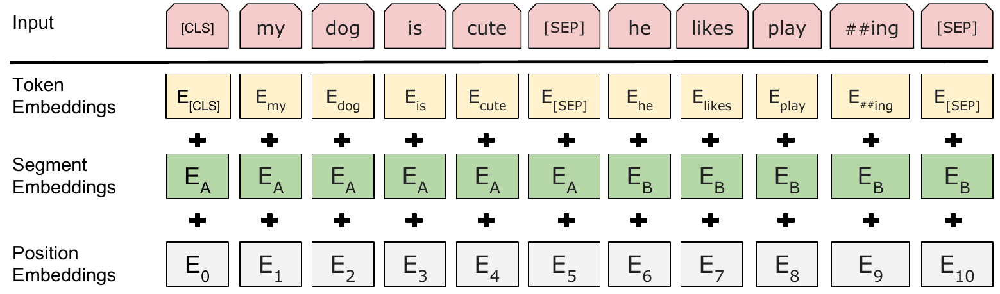{width="100%"}

- BERT introduces two special tokens: 
  * <span style="background-color: #e0f2fe; padding: 2px 6px; border-radius: 4px;">[CLS]</span>
  * <span style="background-color: #e0f2fe; padding: 2px 6px; border-radius: 4px;">[SEP]</span>
- We encode the input as follows
  $$
  \mathrm{[CLS]} \bullet \text{first sentence }\bullet \mathrm{[SEP]}\bullet \text{second  sentence }\bullet \mathrm{[SEP]}
  $$

## Next-sentence prediction 

{width="100%"}

* As discussed previously, if we only provide the tokens for $\mathrm{[CLS]} \bullet \text{first sentence }\bullet \mathrm{[SEP]}\bullet \text{second  sentence }\bullet \mathrm{[SEP]}$ as input to BERT 
  - BERT would not be able to know that `dog` is from the first and `play`  is from the second sentence
  - The segment embeddings $\mathbf{E}_A$ and $\mathbf{E}_B$ encode whether a token belongs to sentence A or B.


## NSP


```{python}
#| echo: false
#| fig-width: 5
#| fig-height: 5
#| out-width: "100%"
#| fig-align: center
import sys
sys.path.append('utils') 
from bert_plots import bert_nsp
bert_nsp()
```
- Pass output for first token (corresponding to `[CLS]`) to linear layer -- with only two output features, next and notNext, and pass through softmax.
- calculate the cross-entropy loss, perform backprop, update weights

## NSP
- The CLS token interacts with every other token (no mask) -- it "captures" information about all other tokens as needed for the classification task
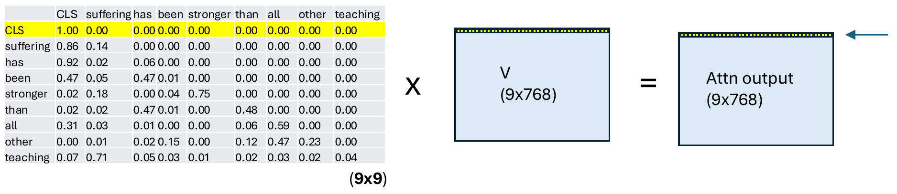{width="100%"}

:::{.small-text}
- e.g., cell (1,1) of the attn output is the dot product of the first row of the attention matrix (for CLS) with the first column of $\mathbf{V}$
- cell (1,2) of the attn output is the dot product of the first row of the attention matrix (for CLS) with the second column of $\mathbf{V}$
- $\ldots$
- cell (1,768) of the attn output is the dot product of the first row of the attention matrix (for CLS) with the $768^{th}$ column of $\mathbf{V}$
- Thus, the CLS has aggregated information from the entire $\mathbf{V}$ matrix for the purposes of classification
- For classification, we are only interested in the first row of the attention output
:::

## The `[SEP]` Token and Sentence Pairs

- Some tasks require **two** input sentences at once (e.g., "do these two sentences mean the same thing?").
- BERT handles this with a `[SEP]` token separating the two sentences, plus a learned **segment embedding** added to each token indicating which sentence it belongs to:

$$
\text{[CLS]} \ \text{Sentence A} \ \text{[SEP]} \ \text{Sentence B} \ \text{[SEP]}
$$

- Segment embeddings are added elementwise to the token + positional embeddings, the same way positional encodings were added in Part 1 — just one more term in the sum.
- This sentence-pair format is what BERT's own pretraining uses, and it's directly relevant to Section 3, where we'll see *why* comparing two full sentences this way becomes a computational bottleneck.


## MLM and NSP

- For every training example, BERT builds one input (a sentence pair with some tokens replaced by [MASK]) and runs it through a single forward pass. 
- That one pass produces both:
  - MLM predictions: output vectors at each masked position, fed into a softmax over the vocabulary to predict the original token.
  - NSP prediction: the output vector at [CLS], fed into the binary classifier to predict IsNext/NotNext.
- The two losses are then just added together
$$
\mathcal{L} = \mathcal{L}_{MLM} + \mathcal{L}_{NSP}
$$ 

- The combined loss is backpropagated through the shared BERT weights in one update step.

::: {.tiny-credit}
- Subsequently, it was found that the NSP objective could be dropped, and that training the model loger with a few other adjustments actually yielded better performance
- Liu Y et al. (2019) [RoBERTa: A Robustly Optimized BERT Pretraining Approach. arXiv 1907.11692](https://arxiv.org/abs/1907.11692) 
:::


## FFN Expansion-Contraction

::: {.columns}
::: {.column width="50%"}
```{python}
#| echo: false
#| fig-width: 10
#| fig-height: 6
#| out-width: "100%"
#| fig-align: center
import sys
sys.path.append('utils')
from llm_plots import draw_gelu_block

draw_gelu_block()
```
:::

::: {.column width="50%"}
- In BERT-Base, each encoder block's FFN is two linear transformations with a non-linear activation (GELU) in between — applied **independently, position-wise**, to every token
- An expansion–contraction (bottleneck-in-reverse) architecture
- Input $x$: $1 \times 768$
- $W_1$: $768 \times 3072$ — the **expansion** weights
- $b_1$: $1 \times 3072$ — first bias
- $W_2$: $3072 \times 768$ — the **projection** weights
- $b_2$: $1 \times 768$ — second bias
:::
:::


## BERT's FFN Block

::: {.columns}
::: {.column width="50%"}
```{python}
#| echo: false
#| out-height: "65vh"
#| fig-align: center
import sys
sys.path.append('utils')
from llm_plots import draw_gelu_block

draw_gelu_block()
```
:::

::: {.column width="50%"}
- Coming back to the FFN: BERT takes the 768-dimensional vector out of the Add & Norm layer, expands it into a 3072-dimensional space, applies GELU, then projects it back down to 768 dimensions for the next block

$$
\underbrace{1 \times 768}_{\text{Input}}
\xrightarrow{W_1, b_1}
\underbrace{1 \times 3072}_{\text{Linear Expansion}}
\xrightarrow{\text{GELU}}
\underbrace{1 \times 3072}_{\text{Non-linear Activation}}
\xrightarrow{W_2, b_2}
\underbrace{1 \times 768}_{\text{Output}}
$$
:::
:::


## BERT's FFN Block

- **Why expand 4×?** The attention sub-layer only *mixes* information that's already there — it computes weighted averages of existing token vectors, which is a linear-ish operation with no added representational capacity. The FFN is where the model gets nonlinear capacity: projecting up to a much higher-dimensional space before the GELU gives that nonlinearity more "room" to carve out complex feature combinations, and the 4× ratio ($3072 = 4 \times 768$) is the ratio Vaswani et al. (2017) fixed in the original Transformer — BERT simply inherits it.
- The FFN is applied **identically and independently at every position** (same $W_1, b_1, W_2, b_2$ for every token) — it's often described as two $1\times1$ convolutions, and it's the main place per-token nonlinear processing happens, complementing attention's role of moving information *between* positions.
- In parameter terms, the FFN dominates the model: for BERT-Base, $2 \times 768 \times 3072 \approx 4.7M$ parameters per block just for $W_1$ and $W_2$ combined — roughly two-thirds of each encoder block's parameters live in the FFN, not the attention heads.


## Causal LM vs. Masked LM (recap)


| | **Causal LM (GPT-style)** | **Masked LM (BERT-style)** |
|---|---|---|
| Direction | Left-to-right only | Bidirectional |
| Attention | Causal mask (Section 2) | No mask — full self-attention |
| Predicts | Next token, given all past tokens | Randomly masked tokens, given surrounding context (past **and** future) |
| Natural use | Text generation | Understanding/representation tasks (classification, extraction) |
| Reference | Radford et al. (2018)^[Radford A, et al. (2018) Improving Language Understanding by Generative Pre-Training. OpenAI] | Devlin et al. (2019)^[Devlin J, et al. (2019) BERT: Pre-training of Deep Bidirectional Transformers for Language Understanding. NAACL-HLT] |


## Fine-tuning BERT {#fine-tuning}

- **Fine-tuning**: Adapting the pretrained weights through additional training for a **particular** task.
- The pretraining is self-supervised but the fine-tuning is supervised, i.e., we need to have human-curated labels
- Pretraining BERT typically might involve billions of examples. Fine-tuning might involve a few thousand labeled examples (**six orders of magnitude difference!**).
- **democratization**: No individual or university research group has the resources to train a model such as BERT, but are able to develop sophisticated ML models by fine-tuning
- The same pre-trained BERT model can be used for various fine tuning tasks

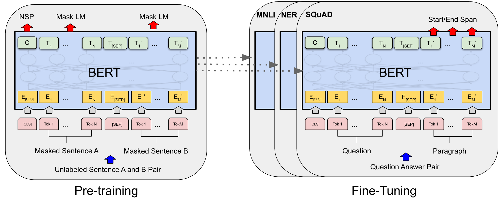{fig-align="center"}


## Fine-tuning BERT for text classification {#classification}


- Next-sentence prediction is an example of binary text classification (isNext, notNext)
- The following example corresponds to the binary classification explanation above.
- In general, we can classify text using more categories.

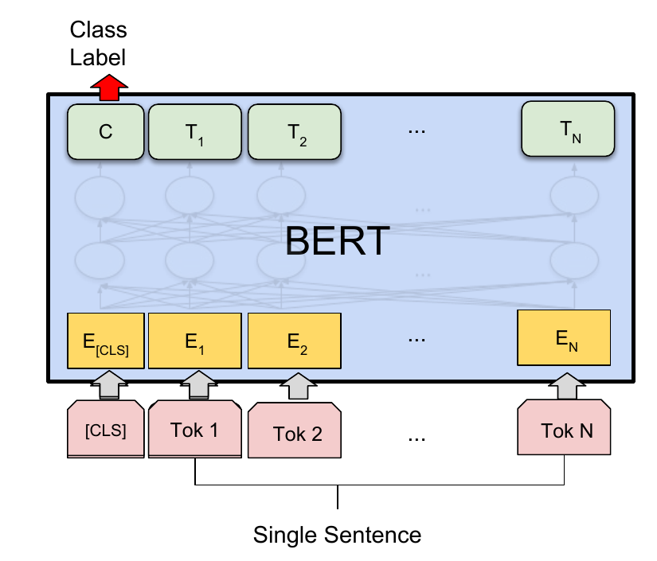{width="40%" fig-align="center"}

## Text-classification (Python)

- We will demonstrate a Python script to classify text as PHISHING or SAFE
- Setup:

```bash
python -m pip install datasets, transformers, evaluate
python -m pip install "accelerate>=1.1.0"
```

Import libraries (datasets, evaluate, and transformers are from huggingface)

```python
from datasets import DatasetDict, Dataset
from transformers import AutoTokenizer, AutoModelForSequenceClassification, TrainingArguments, Trainer
import evaluate
import numpy as np
from transformers import DataCollatorWithPadding
```
- Get datasets (3000 examples with training: 70%; 15%: testing; 15%: validation )
```python
from datasets import load_dataset
# available on huggingface dataset hub
dataset_dict = load_dataset("shawhin/phishing-site-classification") 
```

::: {.small-text}
adapted from Shaw Talebi Fine-Tuning BERT for Text Classification [YouTube](https://www.youtube.com/watch?v=4QHg8Ix8WWQ)
:::

## google-bert/bert-base-uncased

- This is the Hugging Face Hub identifier for the original BERT-base model Google released alongside the 2018 paper.
- The "base" (smaller) model with  12 transformer encoder blocks, hidden size 768, 12 attention heads, FFN inner dimension 3072
- uncased: text is lowercased and accent-stripped before tokenization 

```python
model_path = "google-bert/bert-base-uncased"
tokenizer = AutoTokenizer.from_pretrained(model_path)

id2label = { 0: "Safe", 1: "Phishing"}
label2id = { "Safe": 0, "Phishing": 1}
model = AutoModelForSequenceClassification.from_pretrained(model_path,
                                                           num_labels=2,
                                                           id2label=id2label,
                                                           label2id=label2id,
                                                           attn_implementation="eager")
```

* The `AutoModelForSequenceClassification` class adds a binary classification head to the BERT base model.
* `attn_implementation="eager"` is needed to avoid the fused SDPA kernel, which is not available from PyTorch's MPS (Apple GPU) backend^[You may not need this on other hardware].

## Parameters

- By default, all of the model's parameters (ca. 110,000,000 in this case) are trainable.
- Fine-tuning all of them is computationally expensive and, with a small dataset, risks overfitting.
- To reduce cost and (likely) improve generalization, we freeze the entire pretrained encoder (all 12 transformer blocks) and train only:
  - the **pooler** — a single dense layer + tanh applied to the `[CLS]` token, still part of `base_model`, which we explicitly unfreeze, and
  - the **classification head** added by `AutoModelForSequenceClassification` — untouched by the loop below since it lives outside `base_model`, and trainable simply because it's newly initialized.
- Net effect: only 4 parameter tensors update during training (pooler weight/bias, classifier weight/bias)

```python
for name, param in model.base_model.named_parameters():
    if "pooler" in name:
        param.requires_grad = True
    else:
        param.requires_grad = False
```

## Preprocess input data

We set up a tokenizer and tokenize the input texts.

```python
def preprocess_function(examples):
    return tokenizer(examples["text"], truncation=True)

tokenized_data = dataset_dict.map(preprocess_function, batched=True)
```

* The Data collator ensures all the examples in a batch have the same length
```python
data_collator = DataCollatorWithPadding(tokenizer=tokenizer)
```

## Evaluation

```python
accuracy = evaluate.load("accuracy")
auc_score = evaluate.load("roc_auc")

def compute_metrics(eval_pred):
    # logits and ground truth labels
    predictions, labels = eval_pred
    # softmax
    probabilities = np.exp(predictions)/np.exp(predictions).sum(-1, keepdims=True)
    positive_class_probs = probabilities[:,1]
    auc = np.round(auc_score.compute(prediction_scores=positive_class_probs, references=labels)['roc_auc'], 3)
    predicted_classes = np.argmax(predictions, axis=1)
    acc = np.round(accuracy.compute(predictions=predicted_classes, references=labels)['accuracy'], 3)
    return {"Accuracy": acc, "AUC": auc}
```

* **standard way to evaluate accuracy**

## Training parameters

```python
lr = 2e-4
batch_size = 8
num_epochs = 10

training_args = TrainingArguments(
    output_dir="bert_phishing-classifier_teacher",
    learning_rate=lr,
    per_device_eval_batch_size=batch_size,
    per_device_train_batch_size=batch_size,
    num_train_epochs=num_epochs,
    logging_strategy="epoch",
    eval_strategy="epoch",
    save_strategy="epoch",
    load_best_model_at_end=True
)
```

## Fine-tune model


```python
trainer = Trainer(
    model=model,
    args=training_args,
    train_dataset=tokenized_data["train"],
    eval_dataset=tokenized_data["test"],
    data_collator=data_collator,
    compute_metrics=compute_metrics
)

trainer.train()
```

## Results

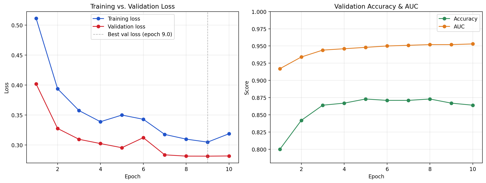{width="100%}

* The results on the independent validation set were: Accuracy: 88.7%, AUC94.6%

## Single-sentence classification, multiple categories

- [HOMEWORK]{.hw-badge} You will implement a multiple-category classifier
- Sentences are given one of multiple labels

```python
from datasets import load_dataset
from transformers import AutoTokenizer, AutoModelForSequenceClassification, TrainingArguments, Trainer
import evaluate
import numpy as np

dataset_name = "ag_news"
dataset = load_dataset(dataset_name)
# Similar code
# To get multiple classes
n_classes = dataset["train].features["label"].num_classes
model = AutoModelForSequenceClassification.from_pretrained(model_path,
                                                           num_labels=n_classes,
                                                           attn_implementation="eager")
```

* Four classes: 1-World, 2-Sports, 3-Business, 4-Sci/Tech

::: {.small-text}
See: https://www.kaggle.com/datasets/amananandrai/ag-news-classification-dataset
:::


## Named entity recognition {#ner}

- Named-entity recognition (NER)  seeks to locate and classify named entities mentioned in unstructured text into pre-defined categories such as 

:::: {.columns}
::: {.column width=50%}
  - person names (B-PER)
  - organizations (B-ORG), 
  - locations (B-LOC)
  - **ontology codes**, e.g., B-HPO 
  - etc.
  - **O**: None
:::
::: {.column width=50%}

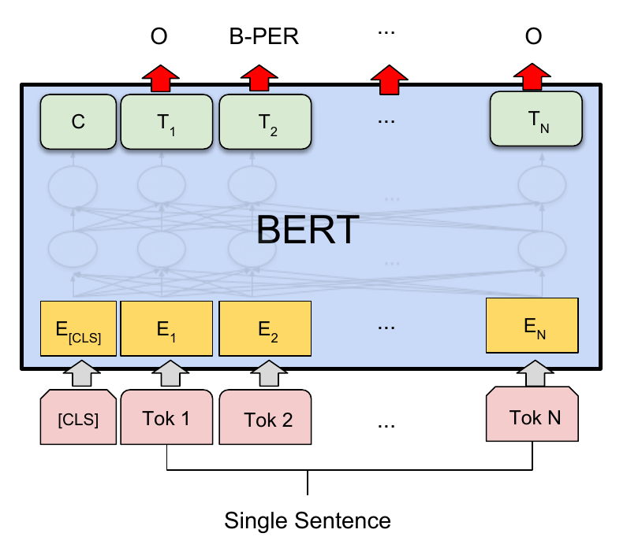{fig-align="center"}
:::
::::


## NER (Token Classification)


- **every** token position's final hidden state $\mathbf{h}_i \in \mathbb{R}^d$ gets its own prediction, using the *same* shared linear layer applied independently at each position:

$$
P(\text{label}_i) = \text{softmax}(\mathbf{h}_i W_{\text{tok}} + b_{\text{tok}}), \qquad \text{for each token } i
$$

- $W_{\text{tok}} \in \mathbb{R}^{d\times L}$, where $L$ is the number of entity label types.
- Unlike sentence classification, `[CLS]` and `[SEP]` are typically excluded from the loss — they're structural tokens, not real words with entity labels.
- Part of speech tagging is analogous
- Chunking: Find "chunks" of tokens that belong to the same entity (e.g., "Renal insufficiency")

## NER in Python

- For the most part, the Python code for NER is very similar to that for single-sentence classification

We need to tell BERT about the following classification

```bash
|   ID | Tag    | Description                |
|-----:|:-------|:---------------------------|
|    0 | O      | Outside of a named entity  |
|    1 | B-PER  | Beginning of a PER entity  |
|    2 | I-PER  | Inside of a PER entity     |
|    3 | B-ORG  | Beginning of a ORG entity  |
|    4 | I-ORG  | Inside of a ORG entity     |
|    5 | B-LOC  | Beginning of a LOC entity  |
|    6 | I-LOC  | Inside of a LOC entity     |
|    7 | B-MISC | Beginning of a MISC entity |
|    8 | I-MISC | Inside of a MISC entity    |
``` 

* We define the model to perform token classification rather than sentence classification
```python
model = AutoModelForTokenClassification.from_pretrained(model_path, num_labels=9)
```
* Most of the rest of the code is the same except for book-keeping details that we will not review here

## NER: Results

* After training the model for about 10 minutes on my laptop, it is already pretty good

```python
from transformers import pipeline

nlp = pipeline("ner", model=model_fine_tuned, tokenizer=tokenizer)
example ="Konrad Adenauer was the first Chancellor of Germany"
ner_results = nlp(example)
print(ner_results)
```

* NER predictions:

| Token | Entity | Probability |
|-------|--------|-------------|
|konrad | B-PER | 0.9857714|
| aden | I-PER | 0.9818236 |
| ##auer | I-PER | 0.979223 |
| germany | B-LOC | 0.9961558|


## Sentence-BERT: Sentence Embeddings using Siamese BERT-Networks {#sbert}

- To detemrine the similarity between sentences, BERT requires that both sentences are fed
into the network
- Finding the most similar pair in a collection of 10,000 sentences requires about 50 million inference computations (~65 hours) with BERT. 
- The construction of BERT makes it unsuitable for semantic similarity search as well as for unsupervised tasks
like clustering

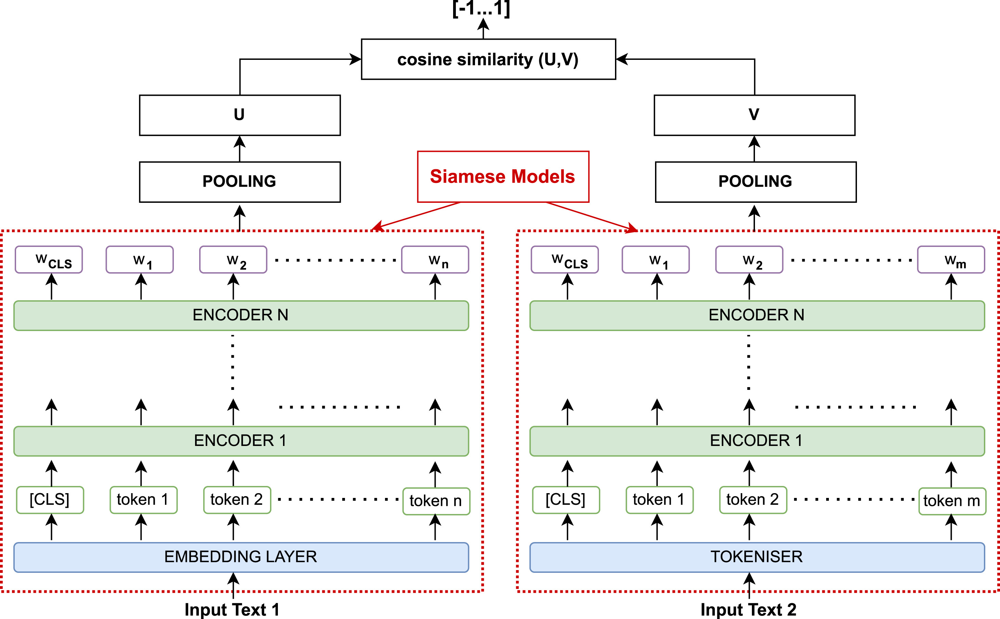{width="75%" fig-align="center"}


::: {.tiny-credit}
image from [ Ortakci (2024) Revolutionary text clustering: Investigating transfer learning capacity of SBERT models through pooling techniques](https://doi.org/10.1016/j.jestch.2024.101730)
:::

## Sentence-BERT

- With standard BERT, two sentences are passed to the transformer network
and the target value is predicted. 
-However, this setup is unsuitable for various pair regression tasks due to too many possible combinations. 
- Finding in a collection of n = 10 000 sentences the pair
with the highest similarity would require 
$n\cdot(n−1)/2 = 49 995 000$ inference computations with BERT
- A common method to address clustering and semantic search is to map each sentence to a vector space such that semantically similar sentences
are close. 

## Sentence vectors ?

- A large disadvantage of the BERT network
structure is that no independent sentence embeddings are computed, which makes it difficult to derive sentence embeddings from BERT. 
-  The most commonly used approach is to average the BERT output layer (known as BERT embeddings, i.e., before the linear classification layer)
- Alternatively, by using the output of the first token (the [CLS] token).
- However,  this common practice yields rather bad sentence embeddings

## SBERT sentence embeddings

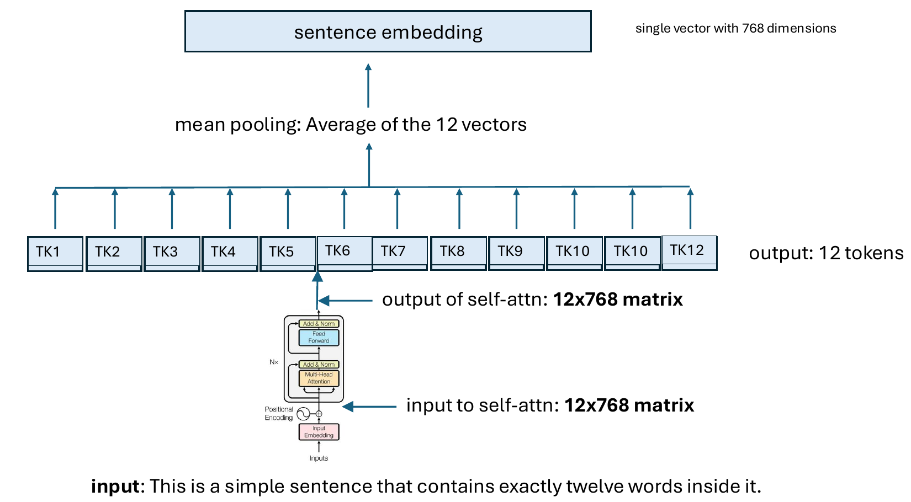{width=80% fig-align="center"}

- Creation of sentence vector: The linear classification layer of BERT is not used
- The attention outputs are pooled to derive a fixed sentence embedding

## SBERT sentence embeddings

- SBERT assesses the similarity of two sentences by the cosine similarity of their vectors

$$
\mathrm{sim}(\mathbf{x},\mathbf{y}) = 
\frac{\mathbf{x}\cdot \mathbf{y}}{\Vert \mathbf{x} \Vert 
\Vert \mathbf{y}
\Vert} =
\frac{\sum_i A_i\cdot B_i}{\sqrt{\sum_i A_i^2}\cdot \sqrt{\sum_i B_i^2}}
$$

- But nobody told BERT that the sentence embeddings it produces should be compatible with 
cosine similarity
- How do we teach BERT to do this?

## Training objective 1: Classification (NLI)

- SBERT is first trained on **natural language inference (NLI)** data: SNLI (570,000 pairs) + MultiNLI, each pair labeled `entailment`, `contradiction`, or `neutral`
- The two sentences (premise, hypothesis) are encoded independently by the siamese BERT, then mean-pooled to give sentence vectors $u$ and $v$
- These are combined into a single feature vector:

$$
(u, v, |u-v|)
$$

- $|u - v|$ is the **element-wise absolute difference** — it makes the relationship between the two embeddings explicit, rather than making the classifier re-derive it from $u$ and $v$ alone
- This concatenated vector (size $3n$, e.g. $3\times768$) is passed through a trainable linear layer $W_t$ and softmax:

$$
o = \mathrm{softmax}\big(W_t\,(u, v, |u-v|)\big)
$$

- Trained with standard **cross-entropy loss** against the gold label (entailment / contradiction / neutral)


## Classification (NLI)

- NLI pairs aren't "similar sentences" in the STS sense — they're purpose-built: crowdworkers wrote three different hypotheses (one entailed, one neutral, one contradictory) for each premise
- This forces the model to learn *fine-grained* semantic distinctions — not just "same topic," but "does this logically follow?"
- $W_t$ is a **training-time-only scaffold**: at inference, it's discarded — only the sentence encoder + pooling is kept
- After NLI training, SBERT is fine-tuned further on the STS Benchmark using the cosine-similarity + MSE objective (next slide) — NLI gives the encoder broad semantic competence, STS calibrates it for graded similarity

## Training

{width="50%" fig-align="center"}

- We have two "copies" of the same BERT model ("siamese twins")
- One copy creates a sentence vector for sentence A, the other copy for sentence B
- The cosine similarity between the two sentence embeddings u and v is computed . We use mean squared-error loss as the objective function
- The STS Benchmark: Human annotators then rated each pair's semantic similarity on a continuous 0–5 scale (5 = same meaning, 0 = unrelated topics)


## RAG 

- SBERT is often used to implement a step of retrieval augmented generation (RAG)
- todo


## Sources


- Devlin J et al. (2019) [BERT: Pre-training of Deep Bidirectional Transformers for Language Understanding. arXiv 1810.04805](https://arxiv.org/abs/1810.04805)
- Hugging Face (blog) [BERT 101 🤗 State Of The Art](https://huggingface.co/blog/bert-101)
- Rogers A et al. (2020) [A Primer in BERTology: What we know about how BERT works. arXiv 2002.12327](https://arxiv.org/abs/2002.12327)
