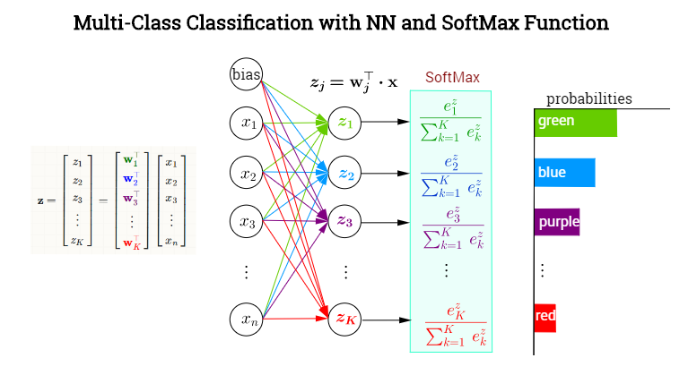
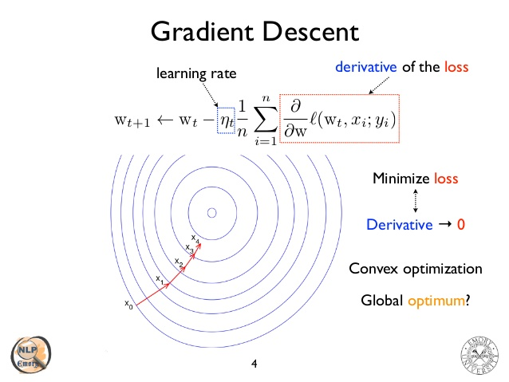
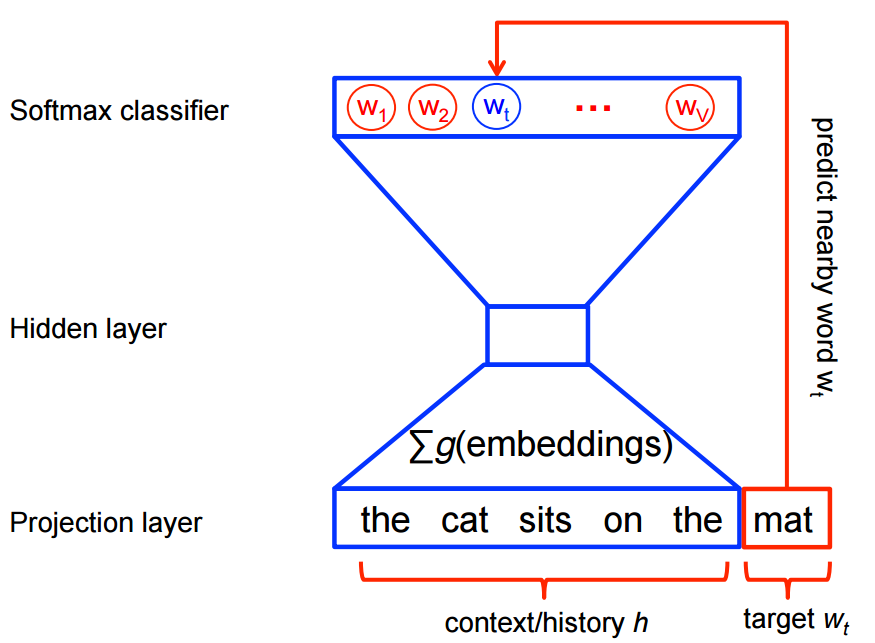
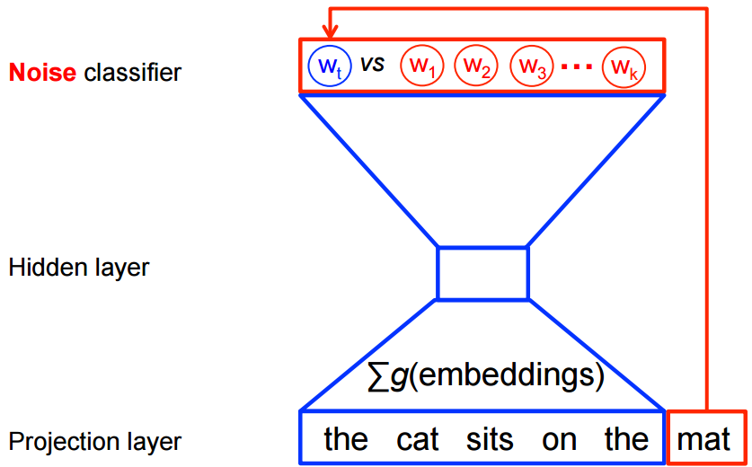
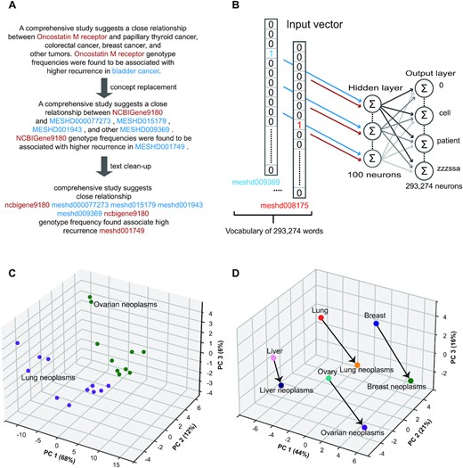
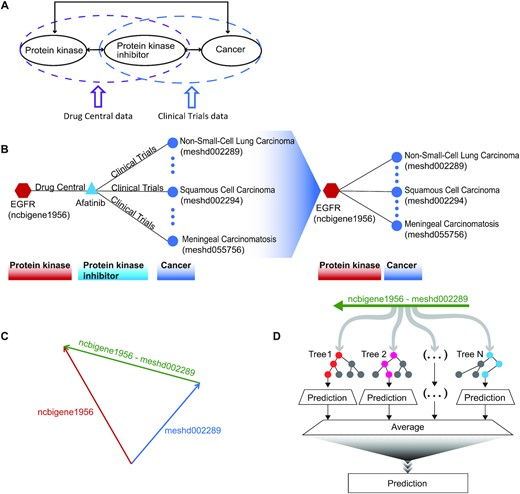
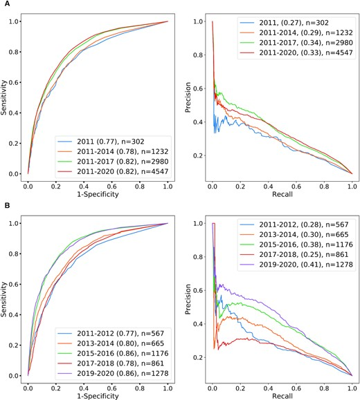
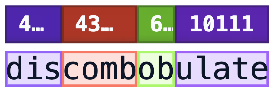
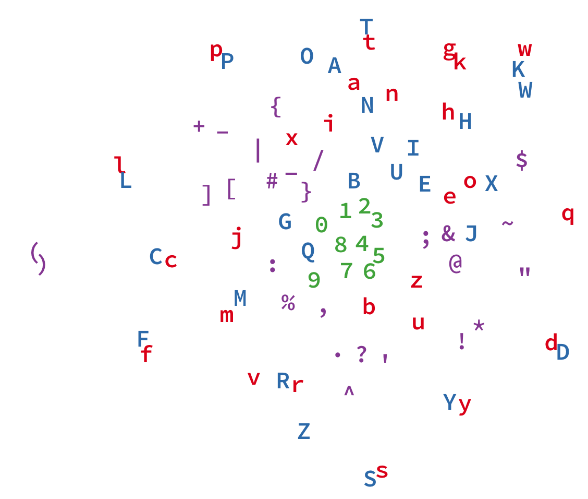

## Overview

::: {.mybox}
### Today

We will study the following topics to prepare the way to understanding transformers and large-language models

- n-grams and skip-grams
- word2vec
- tokens and tokenizing
- byte pair algorithm
:::


## Overview: Word2vec, Embeddings, and Tokenization


:::: {.columns}

::: {.column width="48%"}
### [Part 1: Skip-gram](#skipgram)
* n-gram models
* skip-gram models
:::

::: {.column width="4%"}
<br>
:::

::: {.column width="48%" .dimmed}
### [Part 2: Word2vec](#part-2)
* Onehot vectors vs. semantic vectors
* Training word2vec
:::

::::

:::: {.columns}

::: {.column width="48%" .dimmed}
### [Part 3: Tokenization](#part-3)
* Tokens
* Visualizing tokens
:::

::: {.column width="4%"}
<br>
:::

::: {.column width="48%" .dimmed}
### [Part 4: Byte pair encoding](#part-4)
* Byte pair encoding algorithm
* Python (Homework)
:::

::::


## skipgram {#skipgram}

::: {.callout-note appearance="simple" icon=false}
## n-gram model
In the fields of computational linguistics, an **n-gram** is a contiguous sequence of n words (or other items) from a given sample of text or speech.
:::

```{python}
#| echo: false
#| fig-align: center
import sys
import matplotlib.pyplot as plt

sys.path.append('utils') 
from embed_plots import plot_skipgram

plot_skipgram()
plt.plot()
```

- The skip-gram model assumes that a word can be used to generate its surrounding words in a text sequence. 
- Here, “the”, “man”, “loves”, “his”, "dog" is a text window of five words and the center word is "loves" 

## skipgram


- The skip-gram model considers the conditional probability for generating the context words: “the”, “man”, “his”, and “dog”, which are no more than 2 words away from the center word:

$$
P(the, man, his, dog \mid loves)
$$


The probability
$$
P(the, man, his, dog \mid loves) = P(the \mid loves) \cdot P(man\mid loves) \cdot P( his \mid loves) \cdot P(dog \mid loves) 
$$

- Each word in the vocabulary has two $d$-dimensional vector representations (embeddings): 
  - $\mathbf{v}_i \in \mathbb{R}^{d}$ when word $i$ is used as a _center_ word  
  - $\mathbf{u}_i \in \mathbb{R}^{d}$ when word $i$ is used as a _context_ word  


## Skip-gram model

::: {.callout-note appearance="simple" icon=false}
 skip-grams are generalizations of n-grams in which we are allowed to skip words, with the components occuring at not more than a specified distance to each other
:::

* an n-gram is a strictly consecutive subsequence of length n of some sequence of tokens $w_1,\ldots, w_n$. A $k$-skip-$n$-gram is a length-$n$ subsequence where the components occur at distance at most $k$ from each other.
* $k$-skip: A allowance to skip up to $k$ words between components.
* $n$: The total number of words in the final extracted subsequence.
* For instance, a $1$-skip $4$-gram means
  - sequence of 4 words
  - In the original text, the gap between any two adjacent chosen words can be at most 1 skipped word ($k = 1$).

## Skip-gram model (2) 

* Some $1$-skip $4$-grams of <span style="background-color: #e0f2fe; padding: 2px 6px; border-radius: 4px;">**to be or not to be**</span> are:
  - to be or not: (Valid $1$-skip $4$-gram - it's actually a standard 0-skip 4-gram, and 0 is $\le 1$).
  - to or not to: Valid (positions 1,2,4,5)
  - be or to be: Valid (positions 2,3,5,6 )
  - to be not be: Not valid (Indices: 1, 2, 4, 6)


## skip-gram model (3)
 
::: {.callout-note appearance="simple" icon=false}
  The training objective of the Skip-gram model is to find word representations that are useful for
predicting the surrounding words in a sentence or a document.
:::

- Given a sequence of training words $w_1,w_2,\ldots,w_T$, we maximize as follows
$$
\begin{equation}
  \max \dfrac{1}{T}\sum_{t=1}^{T} \sum_{\substack{ -c\leq j\leq c\\ c\neq j}} \log p(w_{t+j}|w_{t})
\end{equation}
$$

::: {.small-text}
In this formulation of the skip gram model, all forwards and backwards skips of up to $c-1$ words are considered.
Larger $c$ results in more training examples and thus can lead to a higher accuracy, at the expense of the
training time.
:::

## skip-gram model

::: {.callout-note appearance="simple" icon=false}
   The basic Skip-gram formulation defines $p(w_t+j|w_t)$ using the softmax function, which is also often used for 
multiclass predictors in neural networks
:::

{width=70% fig-align="center"}

::: {.small-text}
- softmax turns a collection of numbers into a probability distribution ($z_i\rightarrow \text{softmax}(z_i)=p_i$ implies that $p_i\geq 0$ (because of the exponentiation) and $\sum p_i=1$ (because of the normalization in the denominator)
:::


## Overview: Word2vec, Embeddings, and Tokenization


:::: {.columns}

::: {.column width="48%"}
### [Part 1: Skip-gram](#skipgram)
* n-gram models
* skip-gram models
:::

::: {.column width="4%"}
<br>
:::

::: {.column width="48%" .dimmed}
### [Part 2: Word2vec](#part-2)
* Onehot vectors vs. semantic vectors
* Training word2vec
:::

::::

:::: {.columns}

::: {.column width="48%" .dimmed}
### [Part 3: Tokenization](#part-3)
* Tokens
* Visualizing tokens
:::

::: {.column width="4%"}
<br>
:::

::: {.column width="48%" .dimmed}
### [Part 4: Byte pair encoding](#part-4)
* Byte pair encoding algorithm
* Python (Homework)
:::

::::

## word2vec {#part-2}

- word2vec  maps each word to a fixed-length vector, and these vectors can better express the similarity and analogy relationship among different words. 

::: {.small-text}
- Mikolov, T. et al. (2013) [Efficient Estimation of Word Representations in Vector Space. arXiv:1301.3781](https://arxiv.org/abs/1301.3781)
- Mikolov, T. et al. (2013) [Distributed representations of words and phrases and their compositionality. Advances in Neural Information Processing Systems. arXiv:1310.4546](https://arxiv.org/abs/1310.4546)
:::

- word2vec is a classic algorithm that was extremely influential in NLP before the advent of transformer based algorithms.
- The word2vec algorithm has several features that influenced the development of transformers and it is a good place to learn about how embeddings can be created.

::: {.mybox}
### One-hot vectors {#id10}

Before explaing the word2vec algorithm, let's study why semantic vectors are an improvement over one-hot vectors
:::


## One-hot encoding


| Word | brown | dog | fox | jumps | lazy | over | quick | the |
| :--- | :---: | :---: | :---: | :---: | :---: | :---: | :---: | :---: |
| **the** | 0 | 0 | 0 | 0 | 0 | 0 | 0 | <span style="color:blue">**1**</span> |
| **quick** | 0 | 0 | 0 | 0 | 0 | 0 | <span style="color:blue">**1**</span> | 0 |
| **brown** | <span style="color:blue">**1**</span> | 0 | 0 | 0 | 0 | 0 | 0 | 0 |
| **fox** | 0 | 0 | <span style="color:blue">**1**</span> | 0 | 0 | 0 | 0 | 0 |
| **jumps** | 0 | 0 | 0 | <span style="color:blue">**1**</span> | 0 | 0 | 0 | 0 |
| **over** | 0 | 0 | 0 | 0 | 0 | <span style="color:blue">**1**</span> | 0 | 0 |
| **the** | 0 | 0 | 0 | 0 | 0 | 0 | 0 | <span style="color:blue">**1**</span> |
| **lazy** | 0 | 0 | 0 | 0 | <span style="color:blue">**1**</span> | 0 | 0 | 0 |
| **dog** | 0 | <span style="color:blue">**1**</span> | 0 | 0 | 0 | 0 | 0 | 0 |

* A <span style="color:blue">one-hot vector</span> is a vector used to represent a categorical value in which exactly one element is 1 and all other elements are 0.

## One hot for nucleotides

{width=50% fig-align="center"}

::: {.tiny-credit}
Image adapted from https://jalammar.github.io/illustrated-word2vec/
:::


## Semantic vector space of cars

:::: {.columns}

::: {.column width="70%"}

```{python}
#| echo: false
#| fig-align: center
import sys
import matplotlib.pyplot as plt

sys.path.append('utils') 
from embed_plots import cars_pca

cars_pca(figsize=(7.5, 6))
```

:::
::: {.column width="27%"}

::: {.small-text}

- In this constructed t space, we have three dimensions representing cars: size, color, and price
- We can represent a arbitrary car in this space. 
- Cars that are semantically similar (have similar attributes) are close to each other in this space

:::


:::
::::


## Semantics of one-hot vectors

- We would like to be able to test whether, say, "Man" and "Uncle" are relatively similar, but "Tofu" and "Airplane" are not very similar.
- The usual way of comparing vectors $\mathbf{x},\mathbf{y} \in \mathbb{R}^d$ is a cosine similarity (cosine of the angle between the vectors)

$$
\text{cosine similarity}(\mathbf{x},\mathbf{y}) =
\dfrac{\mathbf{x}^T\mathbf{y}}{\Vert \mathbf{x}\Vert  \Vert \mathbf{y}\Vert }
\in {-1,1}
$$

- cosine similarity between one-hot vectors of any two different words is 0
- One-hot vectors have no natural notion of similarity, e.g., the dot product between the vector for apple and pear would be zero.


## Word embeddings
```{python}
#| echo: false
#| fig-align: center
import sys
import matplotlib.pyplot as plt

sys.path.append('utils') 
from embed_plots import w2v_analogy

w2v_analogy()
plt.plot()
```

- Word embeddings are semantically meaningful representations of words

::: {.tiny-credit}
Redrawn after Figure 2 of Mikolov T, et al. (2013) [Linguistic Regularities in Continuous Space Word Representations](https://aclanthology.org/N13-1090/)
:::

## word2vec

::: {.callout-note appearance="simple" icon=false}
Word2vec is a group of related models that are used to produce word embeddings, based on a series extensions of the original Skip-gram model.
:::

- It is mainly  based on two different models: 
  - skip-gram (SG)
  - continuous bag of words (CBOW)
* shallow, two-layer neural networks that are trained to reconstruct linguistic contexts of words. 
* Input: a large corpus of text 
* Output: a vector space, typically of several hundred dimensions, with each unique word in the corpus being assigned a corresponding vector in the space. 
* Word vectors are positioned in the vector space such that words that share common contexts in the corpus are located in close proximity to one another in the space.


## distributional similarity
::: {.callout-note appearance="simple" icon=false}

- You shall know a word by the company it keeps J.R. Firth, 1957 \newline
- Dime con quien andas, y te diré quien eres (Don Quijote de la Mancha, 1615)
:::
 
* Word2vec essentially looks at the context in which a word appears
* Find the distribution of a word's neighbors in a large corpus of text---this will represent the `meaning` of the word

{ fig-align="center"}

## Goal of word2vec
::: {.callout-note appearance="simple" icon=false}
  Choose a dense vector for each word that will be good at predicting which words it co-appears with
:::


 Define a model that predicts the context surrounding a center word $w_t$ using word vectors
$$
\begin{equation}
  p(\text{context}|w_t)=\ldots
\end{equation}
$$

 
* The following means that for each word $t$ in our training text $T$, look at the context words that surround $t$. Our objective function, $J(\Theta)$, is the product of such probabilites for all words and corresponding context words.
* Our goal is to find $\Theta$ that maximizes the probability ($\Theta$ is the embedding weight matrix)
 $$
 \begin{equation}
  \arg \max_{\Theta} J(\Theta)=\prod_{t=1}^{T} \prod_{\substack{-m\le j\le m\\ j\ne 0}} p(w_{t+j}|w_t,\Theta)
 \end{equation}
 $$
 We can simplify this equation by simply showing the product over all word and context pairs $(w,c)$ in the dataset $D$ of such pairs that is created from $T$.
 $$
 \begin{equation}
    \arg \max_{\Theta}  J(\Theta)=\prod_{(w,c)\in D} p(w_{t+j}|w_t,\Theta)
 \end{equation}
 $$

## Defining a loss function
::: {.callout-note appearance="simple" icon=false}
  The major parameters in this model are the vector representations of the words---all of which are represented here as $\Theta$. There are several hyperparameters.
:::
* Rather than maximizing the objective function  $J(\Theta)$, it is more convenient to minimize the corresponding loss function

$$
\begin{equation}
  \ell(\Theta)=-\log J(\Theta)= \dfrac{1}{|D|} \sum_{(w,c)\in D} \log p(c|w,\Theta)
\end{equation}
$$


* We now need to define the term $p(c|w,\Theta)$. We will start off with the \textbf{softmax} function mentioned above
  - $o$ means the outside word 
  - $c$ means the center word for some skipgram defined by some $t$ and some $j$, i.e., $w_{t+j}$ is shown here as $o$ and $w_t$ is shown as $c$.

$$
\begin{equation}
 p(w_{t+j}|w_t,\Theta) =  p(o|c) = \dfrac{\exp (\mathbf{u}_{o}^{T}\mathbf{v}_c) }{\sum_{w=1}^{V} \exp (\mathbf{u}_{w}^{T}\mathbf{v}_c)}
\end{equation}
$$
 
 
* Here, $V$ is the total number of vocabulary of words (different from $T$ the total number of words in a large corpus (where individual words are repeated).


 
##  word2vec
::: {.callout-note appearance="simple" icon=false}
 Each word actually has two vector representations
:::

* $\mathbf{v}_c$ is the representation for a word in the center of the window
* $\mathbf{u}_o$ is the representation for a word in the context (outside) of the center word
* Note that in this model the position of the context word in the window is not important


 
 
## word2vec: initialize from one hot
::: {.callout-note appearance="simple" icon=false}
  Initializing the model from a one-hot vector for some word $t$ gives us...
:::

 We have
 $$
\begin{equation}
  \mathbf{w}_t\mathbf{W}=\mathbf{v}_c
\end{equation}
 $$

 where $\mathbf{w}_t$ is a $V\times 1$ vector, $\mathbf{W}$ is a randomly initialized $d\times V$ matrix, and $\mathbf{v}_c$ is a $d\times 1$ vector.

$$
\begin{equation}
  \begin{bmatrix}
   0\\ 0\\ \vdots \\ 0 \\ 1 \\ 0 \\ 0
  \end{bmatrix}^{|V|\times 1}
    \begin{bmatrix}
    \ldots & \ldots & 0.2& \ldots & \ldots \\
     \ldots & \ldots & -1.4& \ldots & \ldots \\
      \ldots & \ldots & 0.3& \ldots & \ldots \\
      && \vdots && \\
       \ldots & \ldots & 0.7& \ldots & \ldots \\
        \ldots & \ldots & 0.6& \ldots & \ldots \\
    \end{bmatrix}^{d \times |V|}
    =
      \begin{bmatrix}
       0.2\\ -1.4\\ 0.3\\ \vdots \\ 0.7 \\ 0.6
  \end{bmatrix}^{d \times 1}
\end{equation}
$$

## word2vec: calculate the loss
::: {.callout-note appearance="simple" icon=false}
 Continuing the example from the previous page, and imagining that we are looking at one specific instance, where we have a vector called $u_{truth}$, we would calculate the loss as follows.
:::

:::{.text-small}
We have a second ($|V|\times d$) matrix $\mathbf{U}$  that contains the context word vector representations
(just as $\mathbf{W}$ contains the center word representations).
:::

$$
\begin{equation}
 \mathbf{v}_c\mathbf{U} = \ldots
\end{equation}
$$
as
$$
\begin{equation}
  \begin{bmatrix}
       0.2\\ -1.4\\ 0.3\\ \vdots \\ 0.7 \\ 0.6
  \end{bmatrix}^{d \times 1}
  \begin{bmatrix}
    \ldots & \ldots & 0.4& \ldots & \ldots \\
     \ldots & \ldots & 0.4& \ldots & \ldots \\
      \ldots & \ldots & 1.3& \ldots & \ldots \\
      && \vdots && \\
       \ldots & \ldots & -0.7& \ldots & \ldots \\
        \ldots & \ldots & 0.1& \ldots & \ldots \\
    \end{bmatrix}^{ |V|\times d}
    =
      \begin{bmatrix}
       0.3\\ 0.01\\ -0.2\\ \vdots \\ 0.9 \\ 0.1
  \end{bmatrix}^{|V| \times 1}
\end{equation}
$$
 
 
## word2vec: calculate the loss (2)
 
::: {.callout-note appearance="simple" icon=false}
To calculate the loss in this example, we take the softmax of the product of  $\mathbf{v}_c$ and $\mathbf{U}$ and compare it to the truth vector (which is a one-hot vector containing the ``truth'', i.e., the word that really was at the indicated position of the context).
:::

$$
\begin{equation}
 \text{softmax}( \mathbf{v}_c\mathbf{U}) = 
       \begin{bmatrix}
       p_1\\ p_2\\ p_3\\ \vdots \\ p_{V-1} \\ p_{V}
  \end{bmatrix}
\end{equation}
$$
If the truth vector has a one at position i, then we would feed $1-p_i$ to our loss function.

 
## word2vec: Train model
::: {.callout-note appearance="simple" icon=false}
 As is usual in deep learning, we will train the model using gradient descent. We first define a vector $\Theta$ with all parameters (both the center ($\mathbf{v}$)
 and the outside ($\mathbf{u}$) vectors for all words
:::

$$
\begin{equation}
 \Theta = \begin{bmatrix}
           \mathbf{v}_{aardvark} \\ \vdots \\  \mathbf{v}_{zebra} \\  \mathbf{u}_{aardvark} \\ \vdots \\  \mathbf{u}_{zebra}
          \end{bmatrix}
\in \mathbb{R}^{2dV}
\end{equation}
$$

:::{.text-small}

thus, there is a $d$ dimensional vector for each word, and we have a total of $V$ words, each of which is represented twice.
All of this gets flattened into a $2dV \times 1$ dimensional vector we call $\Theta$.
:::
 
## gradient descent
::: {.callout-note appearance="simple" icon=false}
 word2vec uses gradient descent to find ``optimum'' values of its parameters. Note that backpropagation as used in artificial neural networks/deep learning is 
 basically a form of gradient descent with some extra bells and whistles such as memoization.
:::

{width=70% fig-align="center"}

 
## gradient descent
::: {.callout-note appearance="simple" icon=false}
 We use gradient descent to obtain a collection of vectors that minimize the cost.
:::

The optimization equations for each word are as follows (using a center for for this example; it is analogous for context words).

$$
\begin{eqnarray*}
\log p(w_{t+j}|w_t) &=& \log p(o|c) \\
&=& \log \dfrac{\exp (\mathbf{u}_{o}^{T}\mathbf{v}_{c})}{\sum_{w=1}^{V} \exp (\mathbf{u}_{w}^{T}\mathbf{v}_{c})} \\
&=& \mathbf{u}_{o}^{T}\mathbf{v}_{c} - \log \sum_{w=1}^{V} \exp (\mathbf{u}_{w}^{T}\mathbf{v}_{c})
\end{eqnarray*}
$$

We will separate these into the two terms for clarity
 
## gradient descent

- For the first term we have:
$$
\begin{align*}
\nabla \mathbf{u}_{o}^{T}\mathbf{v}_{c} &=\frac{\partial}{\partial \mathbf{v}_{c}} \mathbf{u}_{o}^{T}\mathbf{v}_{c} \\
&= \mathbf{u}_{o}
\end{align*}
$$

- For the second term recall the chain rule $D\left\{ f(g(x)) \right\} = f^{\prime}(g(x))\cdot g^{\prime}(x)$. In the following we will ignore the sign of the second term for the moment.

::: {.text-small}
$$
\begin{eqnarray*}
 \frac{\partial}{\partial \mathbf{v}_{c}}  \log \sum_{w=1}^{V} \exp(\mathbf{u}_w^{T}\mathbf{v}_c) &=&
 \dfrac{1}{\sum_{w=1}^{V} \exp(\mathbf{u}_w^{T}\mathbf{v}_c)}  \frac{\partial}{\partial \mathbf{v}_{c}}  \sum_{x=1}^{V} \exp(\mathbf{u}_x^{T}\mathbf{v}_c) 
\end{eqnarray*}
$$
:::

::: {.tiny-credit}
Note that in this equation, $\log$ pays the part of the outer function $f$ and $\sum_{w=1}^{V} \exp(\mathbf{u}_w^{T}\mathbf{v}_c)$ is the inner function $g$; the first derivative of $\log x$ is $\dfrac{1}{x}$.
:::


## gradient descent
 continuing
$$
 \begin{eqnarray*}
  \frac{\partial}{\partial \mathbf{v}_{c}} \sum_{x=1}^{V} \exp(\mathbf{u}_x^{T}\mathbf{v}_c)  &=& \sum_{x=1}^{V}\frac{\partial}{\partial \mathbf{v}_{c}}   \exp(\mathbf{u}_x^{T}\mathbf{v}_c) \\
   &=& \sum_{x=1}^{V}  \exp(\mathbf{u}_x^{T}\mathbf{v}_c) \frac{\partial}{\partial \mathbf{v}_{c}}   \mathbf{u}_x^{T}\mathbf{v}_c \\
     &=& \sum_{x=1}^{V}  \exp(\mathbf{u}_x^{T}\mathbf{v}_c)   \mathbf{u}_x \\
 \end{eqnarray*}
$$

* where the second line follows from the chain rule and the fact that $\frac{d e^x}{dx}=e^x$. 
* Note we changed the summation variable of the inner sum (which does not change the value) to avoid interference.
 
 
## gradient descent

::: {.text-small}
  continuing and pulling all the parts together
  $$
 \begin{eqnarray*}
  \frac{\partial}{\partial \mathbf{v}_{c}}  \log \dfrac{\exp (\mathbf{u}_{o}^{T}\mathbf{v}_{c})}{\sum_{w=1}^{V} \exp (\mathbf{u}_{w}^{T}\mathbf{v}_{c})} 
&=& \mathbf{u}_{o}  - \dfrac{1}{\sum_{w=1}^{V} \exp(\mathbf{u}_w^{T}\mathbf{v}_c)}  \sum_{x=1}^{V}  \exp(\mathbf{u}_x^{T}\mathbf{v}_c)   \mathbf{u}_x \\
&=& \mathbf{u}_{o}  -  \sum_{x=1}^{V} \dfrac{ \exp(\mathbf{u}_x^{T}\mathbf{v}_c)}{\sum_{w=1}^{V} \exp(\mathbf{u}_w^{T}\mathbf{v}_c)}    \mathbf{u}_x \\
 \end{eqnarray*}
 $$
 where the second line follows from the fact that $\dfrac{1}{\sum_{w=1}^{V} \exp(\mathbf{u}_w^{T}\mathbf{v}_c)}$ is just a scalar number and can be pulled into the sum. We now recall that the definition of our <span style="color:blue">softmax function</span>   for the probability that word $x$ occurs as a context word of center word $c$ is defined using the softmax function as
$$
 \begin{equation}
  p(x|c)=\mathbf{u}_{o} -  \sum_{x=1}^{V} \dfrac{ \exp(\mathbf{u}_x^{T}\mathbf{v}_c)}{\sum_{w=1}^{V} \exp(\mathbf{u}_w^{T}\mathbf{v}_c)}    \mathbf{u}_x 
 \end{equation}
$$
:::

## gradient descent
::: {.callout-note appearance="simple" icon=false}
  Therefore, the gradient actually has the form of an observed value ($\mathbf{u}_o$) subtracted by the expectation across all context words 
:::

$$
\begin{equation}
\frac{\partial}{\partial \mathbf{v}_{c}} \log p(w_{t+j}|w_t)  = \mathbf{u}_{o} -  \sum_{x=1}^{V} p(x|c)   \mathbf{u}_x
\end{equation}
 $$
 Note that $p(x|c)$ is a vector with dimensions $V\times 1$. 

* The gradients  would be calculated for all $2Vd$ parameters in the model, i.e., all $\mathbf{v}_c$ and  $\mathbf{u}_o$ 

## gradient descent
::: {.callout-note appearance="simple" icon=false}
  To minimize the objective function $J(\Theta)$ over the entire batch of training data, we would perform an update step using a proper learning rate $\alpha$
:::
 
 $$
 \begin{eqnarray*}
  \Theta^{(i+1)}_j \gets  \Theta^{(i)}_j -\eta  \left[ \mathbf{u}_{o} -  \sum_{x=1}^{V} p(x|c)   \mathbf{u}_x \right]
 \end{eqnarray*}
 $$

 
- $\eta$ is the learning rate
- $\eta\mathbf{u}_o$ adds a positive multiple of $\mathbf{u}_o$ to $\mathbf{v}_c$, moving the latter vector towards the actual context vector $\mathbf{u}_o$.
- $-\eta\mathbb{E}_{w_k\sim P(\cdot\mid w_c)}[\mathbf{u}_k])$ subtracts the expected vector 
- $\mathbb{E}_{w_k\sim P(\cdot\mid w_c)}[\mathbf{u}_k])$ is an expectation taken over every word $k\in V$ in the vocabulary 
according to the models own distribution $P(w_o\mid w_c)$, i.e., the softmax output.

​- This is also why the exact skip-gram gradient is expensive: computing this expectation requires touching every word vector in the vocabulary at every single training step, which is the practical bottleneck that motivates approximations like negative sampling (which replaces the full sum with a small sample of "negative" words)


## word2vec: scaling up
{width=40% fig-align="center"}

* this is very expensive, because we need to compute and normalize each probability using the score for all $V$ other words $w^{\prime}$ in the current context $h$, at every training step.


## word2vec: scaling up
::: {.callout-note appearance="simple" icon=false}
  word2vec therefore is trained to discriminate the real target words $w_t$ from $k$ imaginary (noise) words $\tilde{w}$, in the same context.
:::

{width=40% fig-align="center"}


## Negative sampling

- Consider a pair $(w,c)$ of word and context
- The probability that this pair came from the corpus data is $p(D=1\mid w,c;\Theta)$ (i.e., this corresponded to a skip gram in the actual data)
- The probably that the pair did not come from the corpus data is $p(D=0\mid w,c;\Theta) = 1 - $p(D=1\mid w,c;\Theta)$

* **Goal**: find parameters $\Theta$ that maximize the probabilities that all of the observations indeed come from the data

$$
\begin{align}
& \arg \max_{\Theta} \prod_{(w,c)\in D} p(D=1\mid w,c;\Theta)\\
&=\arg \max_{\Theta} \log \prod_{(w,c)\in D} p(D=1\mid w,c;\Theta)\\
&=\arg \max_{\Theta}  \sum_{(w,c)\in D} \log p(D=1\mid w,c;\Theta)\\
\end{align}
$$

## Negative sampling (2)

- The quantity $p(D=1\mid w,c;\Theta)$ can be defined as a softmax probability
$$
p(D=1\mid w,c;\Theta) = \dfrac{1}{1 + e^{-\mathbf{v}_c\mathbf{v}_w}}
$$

We can now rewrite the objective function
$$
\begin{align}
&=\arg \max_{\Theta}  \sum_{(w,c)\in D} \log  \dfrac{1}{1 + e^{-\mathbf{v}_c\cdot \mathbf{v}_w}}\\
\end{align}
$$

## Negative sampling (3)

- The "vanilla" solution to the optimization would involve sampling all context words for each word, which would be prohibitively computationally expensive
- Negative sampling means that we sample a subset of random (and therefore presumed) negative examples) from a set we call $D^{\prime}$.
- The optimization objective now becomes:
$$
\begin{align}
& \arg\max_{\Theta} \prod_{(w,c)\in D}p(D=1\mid c,w;\Theta)
 \prod_{(w,c)\in D^{\prime}}p(D=0\mid c,w;\Theta) \\
 &= \arg\max_{\Theta} \prod_{(w,c)\in D}p(D=1\mid c,w;\Theta)
 \prod_{(w,c)\in D^{\prime}}(1- p(D=1\mid c,w;\Theta)) \\
 &= \arg\max_{\Theta} \sum_{(w,c)\in D}\log p(D=1\mid c,w;\Theta)
 \sum_{(w,c)\in D^{\prime}} \log (1- p(D=1\mid c,w;\Theta)) \\
  &= \arg\max_{\Theta} \sum_{(w,c)\in D}\log \frac{1}{1+e^{-v_c\cdot v_w}} +
 \sum_{(w,c)\in D^{\prime}} \log \left(1- \frac{1}{1+e^{-v_c\cdot v_w}}\right) \\
  &= \arg\max_{\Theta} \sum_{(w,c)\in D}\log \frac{1}{1+e^{-v_c\cdot v_w}} +
 \sum_{(w,c)\in D^{\prime}} \log \left(\frac{1}{1+e^{v_c\cdot v_w}}\right) \\
 \end{align}
$$

## Negative sampling (4)

- Letting $\sigma(x) = \frac{1}{1+e^{-x}}$, we obtain
$$
\arg\max_{\Theta} \sum_{(w,c)\in D}\log \sigma(v_c\cdot v_w) +
 \sum_{(w,c)\in D^{\prime}} \log \sigma(-v_c\cdot v_w) \\
$$

- As written, this equation is still over all examples
- The negative sampling as presented draws $k$ times as many negative examples as there are positive examples. 
- For each $(w,c)\in D$, we construct $k$ random (presumed negative samples) $(w,c_1), (w, c2), \ldots; (w,c_k)$ 
-  $c_j$ is drawn according to its unigram distribution
raised to the 3/4 power.
- The "unigram distribution" just means the raw frequency of each word in the training corpus 
- word2vec raises this to the 3/4 power, which downweights frequent words and upweights rare words
$$
P_{3/4}(w)=
\frac{\mathrm{count}(w)_{3/4}}
{\sum_{w^{\prime}} \mathrm{count}(w^{\prime})_{3/4}}
$$

::: {.tiny-credit}
Tomas Mikolov, Ilya Sutskever, Kai Chen, Gregory S. Corrado, and Jeffrey
Dean. Distributed representations of words and phrases and their composi-
tionality. In Advances in Neural Information Processing Systems 26: 27th
Annual Conference on Neural Information Processing Systems 2013. 
:::

## Concept replacement


The original word2vec method operates on individual words (tokens). However, many medical concepts span multiple tokens. For instance, 
<span style="background-color: #e0f2fe; padding: 2px 6px; border-radius: 4px;">non-small-cell lung carcinoma</span>
 would be treated by word2vec as three or five tokens (depending on how the hyphen is handled in preprocessing), but it represents a single medical concept. 
 
- Some approaches collapse multiword concepts into a single token prior to embedding by replacing the multiword concepts with a single concept id. 
For instance, `non-small-cell lung carcinoma` can be replaced by its MeSH id D002289.

## latent knowledge about protein kinases and cancer
::: {.callout-note appearance="simple" icon=false}
We used concept replacement as one of many steps to create concept embeddings to investigate protein kinases and cancer.
:::
{width=60% fig-align="center"}

## latent knowledge about protein kinases and cancer
::: {.callout-note appearance="simple" icon=false}
Inhibiting protein kinases (PKs) that cause cancers has been an important topic in cancer therapy for years
:::

- Our approach represents PKs and cancers as semantically meaningful concept vectors using word2vec in ca. 10 million PubMed abstracts
- We used  random forest classification to predict the relevance of inhibiting PKs for specific cancers 

{width=60% fig-align="center"}

## latent knowledge about protein kinases and cancer

::: {.callout-note appearance="simple" icon=false}
In an historical validation study, the AUROC ranged from 77% to 86%, and the average precision ranged from 28% to 41%
:::

{width=60% fig-align="center"}

::: {.tiny-credit}
Ravanmehr V, et al (2021) Supervised learning with word embeddings derived from PubMed captures latent knowledge about protein kinases and cancer. NAR Genom Bioinform **3**:lqab113.
:::


## Overview: Word2vec, Embeddings, and Tokenization


:::: {.columns}

::: {.column width="48%" .dimmed}
### [Part 1: Skip-gram](#skipgram)
* n-gram models
* skip-gram models
:::

::: {.column width="4%"}
<br>
:::

::: {.column width="48%" .dimmed}
### [Part 2: Word2vec](#part-2)
* Onehot vectors vs. semantic vectors
* Training word2vec
:::

::::

:::: {.columns}

::: {.column width="48%" }
### [Part 3: Tokenization](#part-3)
* Tokens
* Visualizing tokens
:::

::: {.column width="4%"}
<br>
:::

::: {.column width="48%" .dimmed}
### [Part 4: Byte pair encoding](#part-4)
* Byte pair encoding algorithm
* Python (Homework)
:::

::::


## Tokens {#part-3}


::: {.callout-important icon="true" appearance="default" title="The need for tokenization"}

* LLMs (and many other machine learning algorithms) process numbers rather than text
* Therefore, to process text, it first must be converted to numbers.
:::


:::: {.columns}

::: {.column width="50%"}

Tokenization by Open-AI 

{#fig-tokens width=80% fig-align="center"}

:::
::: {.column width="50%"}

* A __token__ is a piece of text that can be represented by an __integer__. 
* Here, we see an example GPT subword tokenization of the word *discombobulate*:
    - dis: 4220
    - comb: 43606
    - ob: 630
    - ulate; 10111
* The integer that is associated with the token is called __token ID__ or __token index__.^[See https://tiktokenizer.vercel.app/ for an app to visualize different tokenizing schemes.]

:::
:::


## Tokenization 

::: {.callout-note}
## Definition
 the process of converting a sequence of text into smaller parts, known as tokens. These tokens can be as small as characters or as long as words. 
:::


::: {.token-table}

| Tokenization Method | Example | Granularity | Pros | Cons |
|:---|:---|:---|:---|:---|
| **Word** | Full words | ["Machine", "learning"] | High semantic clarity | Massive vocabulary; fails on "unknown" words |
| **Subword** | Meaningful chunks | ["ma", "chine", "learn", "ing"] | Handles new words well | Slightly more complex to implement |
| **Character** | Individual letters | ["m", "a", "c", "h", "i", "n", "e", "l", "r", "g"] |  Tiny vocabulary; no "unknown" words | Loses semantic meaning; very long sequences |

:::


## Why not just use character embeddings?

Major problems with word embeddings

- There are extremely many unique words in natural language
- Words can have different lexical forms (run, runs, ran, running, ...)
- Out of vocabulary words cannot be represented


::: {.columns}

::: {.column width="40%"}
::: {.hl-container}
{width="100%"}
:::

::: {.tiny-credit}
image credit: <https://github.com/minimaxir/char-embeddings>
:::
:::


::: {.column width="10%"}
:::


::: {.column width="50%"}
* Limitations of character embeddings
  - Unicode currently has $>$150K characters (growing!)
  - character-based embeddings ignore linguistic regularities (e.g., in English, 't' is more often followed by 'h' than by 'q')
  - requires a lot of memory to cover any given text in the context (there are more character embeddings than subword embeddings and more subword embeddings than word embeddings)

:::
:::

## Tokens are then converted to embeddings

- LLMs do not use tokens directly.
- Instead, an intermediate step converts input tokens to embeddings


::: {.callout-important icon="true" appearance="default" title="Embeddings"}

* Embeddings are dense numeric representations of tokens
* Advantages over integers
 - More text can be represented using fewer numbers
 - Semantic relations across tokens can be captured
:::

- During training, an LLM learns embeddings to represent individual tokens

```{python}
#| label: fig-polar
#| fig-cap: "coding tokens as embeddings"
#| fig-height: 2
import matplotlib.pyplot as plt
import matplotlib.patches as patches

# Data Setup
input_text = ["[CLS]", "I", "love", "to", "code", ".", "[SEP]"]
token_ids = [101, 2023, 2003, 1037, 7953, 1012, 102]
# Simulated embedding vectors (first 3 dimensions)
embeddings = [
    [0.03, -0.01, -0.02], [0.05, 0.01, 0.00], [-0.04, -0.02, -0.02],
    [0.01, -0.00, -0.04], [0.00, 0.00, -0.33], [0.01, -0.42, -0.71], [-0.07, 0.02, -0.03]
]

fig, ax = plt.subplots(figsize=(12, 6))
ax.set_xlim(0, 10)
ax.set_ylim(0, 10)
ax.axis('off')

# 1. Draw Tokenization Row
ax.text(0.5, 10, "I love to code.", fontsize=16, fontweight='bold')
ax.text(0.5, 8.1, "Tokenization", fontsize=16, fontweight='bold')
for i, (txt, tid) in enumerate(zip(input_text, token_ids)):
    x_pos = 1 + i*1.2
    # Text box
    ax.add_patch(patches.FancyBboxPatch((x_pos, 7), 1, 0.8, boxstyle="round,pad=0.1", fc="#fbe5c6", ec="gray"))
    ax.text(x_pos+0.5, 7.4, txt, ha='center', fontsize=11)
    # ID box
    ax.add_patch(patches.Rectangle((x_pos, 6.2), 1, 0.8, fc="#fff2cc", ec="gray"))
    ax.text(x_pos+0.5, 6.6, str(tid), ha='center', fontsize=11)

# 2. Draw Transition Arrow
ax.annotate('', xy=(5, 4.5), xytext=(5, 6), arrowprops=dict(facecolor='black', shrink=0.05, width=2))

# 3. Draw Embeddings Row
ax.text(0.5, 3.7, "Embeddings", fontsize=16, fontweight='bold')
for i, vec in enumerate(embeddings):
    x_pos = 1 + i*1.2
    ax.add_patch(patches.Rectangle((x_pos, 1), 1, 2.5, fc="#fbe5c6", ec="gray"))
    for j, val in enumerate(vec):
        ax.text(x_pos+0.5, 3 - j*0.6, f"{val:.4f}", ha='center', fontsize=9)
    ax.text(x_pos+0.5, 1.2, "...", ha='center')

plt.tight_layout()
plt.show()

import numpy as np
import matplotlib.pyplot as plt

r = np.arange(0, 2, 0.01)
theta = 2 * np.pi * r
fig, ax = plt.subplots(
  subplot_kw = {'projection': 'polar'} 
)
ax.plot(theta, r)
ax.set_rticks([0.5, 1, 1.5, 2])
ax.grid(True)
plt.show()
```

## Overview: Word2vec, Embeddings, and Tokenization


:::: {.columns}

::: {.column width="48%" .dimmed}
### [Part 1: Skip-gram](#skipgram)
* n-gram models
* skip-gram models
:::

::: {.column width="4%"}
<br>
:::

::: {.column width="48%" .dimmed}
### [Part 2: Word2vec](#part-2)
* Onehot vectors vs. semantic vectors
* Training word2vec
:::

::::

:::: {.columns}

::: {.column width="48%" .dimmed}
### [Part 3: Tokenization](#part-3)
* Tokens
* Visualizing tokens
:::

::: {.column width="4%"}
<br>
:::

::: {.column width="48%" }
### [Part 4: Byte pair encoding](#part-4)
* Byte pair encoding algorithm
* Python (Homework)
:::

::::


##  Byte Pair Encoding {#part-4}

- Byte Pair Encoding (BPE) is a simple, greedy algorithm that builds a vocabulary by repeatedly merging the most frequent pair of tokens.
- BPE proceeds by repeatedly identifying the most frequently occurring pair of symbols
and replacing all occurrences of this pair with a new symbol, thereby shortening the text.
-  The
new symbols, together with the pairs they replace, are stored in a lookup-table, which allows the
reconstruction of the original text. 

## BPE 

- BPE is widely used in the preprocessing stage of training large language models 
- Originally introduced as a compression algorithm that repeatedly identifies the most frequently occurring pair of symbols
and replaces all occurrences of this pair with a new symbol, thereby shortening the text.

$$
\begin{alignat}{3}
\mathrm{aabaaaba} &\to \mathrm{XbXaba} &&\to \mathrm{YXaba} &&\to \mathrm{Zaba} \\
\mathrm{aabaaaba} &\to \mathrm{aXaaXa} &&\to \phantom{\mathrm{Y}}\mathrm{YaYa} &&\to \mathrm{ZZ}
\end{alignat}
$$

- Input $s= \mathrm{aabaaaba}$
- Top: BPE merge sequence ($\mathrm{aa} \to \mathrm{X}$, $\mathrm{Xb} \to \mathrm {Y}$, $\mathrm{YX}\to \mathrm{Z}$)
- Bottom: BPE merge sequence ($\mathrm{ab} \to \mathrm{X}$, $\mathrm{aX} \to \mathrm {Y}$, $\mathrm{Ya}\to \mathrm{Z}$)
- Compression utility of $\mathrm{aabaaaba} \to \mathrm{Zaba}$ is $8- 4= 4$
- Compression utility of $\mathrm{aabaaaba} \to \mathrm{ZZ}$ is $8-2=6$

## Problem definition

- Consider an input string $s$ over an alphabet $\Sigma$
- Represent the concatenation of strings $a$ and $b$ as $a\cdot b$ (somes we will show simply $ab$ when clear from context)
- The length of a string $a$: $|a|$, the $i^{th}$ character of the string is $a[i]$, and the substring $a[i]\cdot a[i+1]\cdot\cdot\cdot a[j]$ is $a[i:j]$
- A replacement rule is a function $\mathrm{replace}_{x\to y}$ that transforms a string $s$ by replacing all occurrences
of the string $x$ in $s$ with the string $y$. 
  - If $s$ does not contain $x$ then $\mathrm{replace}_{x\to y}(s) = s$
  - Otherwise $$\mathrm{replace}_{x\to y}(s) = s[1:i]\cdot y\cdot \mathrm{replace}_{x\to y}(s[i+|x| + 1:|s|)$$ where i is the smallest index for
which $s[i + 1 : i + |x|] = x$

## Probem definition (2)

- A sequence of replacement rules $\mathbb{R} = (\mathbb{R}_1,\ldots ,\mathbb{R}_k)$ with $\mathbb{R}_i = \mathrm{replace}_{a_ib_i\to c_i}$
, where $a_i, b_i$, and $c_i$ are symbols, is called a merge sequence of length $k$. 
Denoting $s^{\prime} =(\mathbb{R}_k \circ \ldots \circ \mathbb{R}_1)(s)$, where $\circ$ is function composition, we refer to $|s^{\prime}|$
 as the compressed length, and $|s| − |s^{\prime}|$ as the utility of$\mathbb{R}$ for $s$. 

- BPE starts with the input string $s$, it performs $k$ locally optimal full merge steps, always choosing a pair whose
replacement maximizes compression utility
- This leads to a vocabulary of $k$ tokens (why?)

## BPE algorithm

Choose a desired $k$ (vocabulary size) and the input text corpus $s$

- Let $s^{(0)} = s$
- Let $s^{(i)} = \mathbb{R}_i(s^{(i-1)})$ for $i\in k$
- Output $\mathbb{R} = (\mathbb{R}_1,\ldots ,\mathbb{R}_k)$ with $\mathbb{R}_i = \mathrm{replace}_{a_ib_i\to c_i}$
- Each $c_i$ is a new symbol not occuring in $s^{(j)}$ for $j<i$
- The pair $a_ib_i$ is chosen so that $|\mathbb{R}_i((s^{(i-1)})|$ is minimal

[HOMEWORK]{.hw-badge} You will implement a version of BPE

## BPE Applications

::: {.mybox}
### LLMs and BPE

Virutally every major LLM uses BPE to transform input text into number (tokens) that are processed by the model

- GPE
- Llama
- Mistral
- Claude
:::


## BPE Applications

- Balances between character-level (too slow, results in long sequences) and word-level (too many parameters for rare words, poor generalization).
- BPE handles rare words (e.g., not in training vocabulary) by falling back to smaller subwords or individual characters/bytes.
- Models learn morphological patterns (e.g., “ing”, “ed”, “tion”, “pre”, “un”) which may help with analysis of grammar
- Cross-lingual: May help with relating synonymous words in different languages (Produktion, production, producíon,...)

## BPE Applications

- Better parameter efficiency: Model spends capacity on meaningful patterns rather than memorizing every word variant.
- Consider the German word "Abwasserbehandlungsanlage"
  - If a model created a single token for this word, it would need to learn the meaning of the token from relatively rare mentions in the training data
  - If the model splits this into "Abwasser", "Behandlung(s)" and "Anlage", the meanings of these three tokens are inferred from a much richer context in the training data 
- Consider word families:
  - "happy": happy, happier, happiest, happily, happiness, unhappy, unhappier, unhappiest, unhappily, unhappiness
  - "nation": nations, national, nationally, nationalist, nationalists, nationalism, nationalistic, nationality, nationalities, nationalize, nationalized, nationalization, international, internationally, transnational, multinational.
- BPE often will extract a common root from families such as this -- the model learns one embedding for the shared root and separate embeddings for the inflectional/derivational endings

:::{.tiny-credit}
Sennrich, R, et al. (2016) [Neural Machine Translation of Rare Words with Subword Units](https://aclanthology.org/P16-1162/)
:::


## Sources

The sources used to prepare this lecture include

- Goldberg Y and Levy O (2014) [word2vec Explained: deriving Mikolov et al.'s negative-sampling word-embedding method, arXiv 1402.3722](https://arxiv.org/abs/1402.3722)
- Kozma L and Voderholzer J (2024) [Theoretical Analysis of Byte-Pair Encoding, arXiv  2411.08671](https://arxiv.org/abs/2411.08671)
- Mikolov, T. et al. (2013) [Efficient Estimation of Word Representations in Vector Space. arXiv:1301.3781](https://arxiv.org/abs/1301.3781)
- Mikolov, T. et al. (2013) [Distributed representations of words and phrases and their compositionality. Advances in Neural Information Processing Systems. arXiv:1310.4546](https://arxiv.org/abs/1310.4546)


