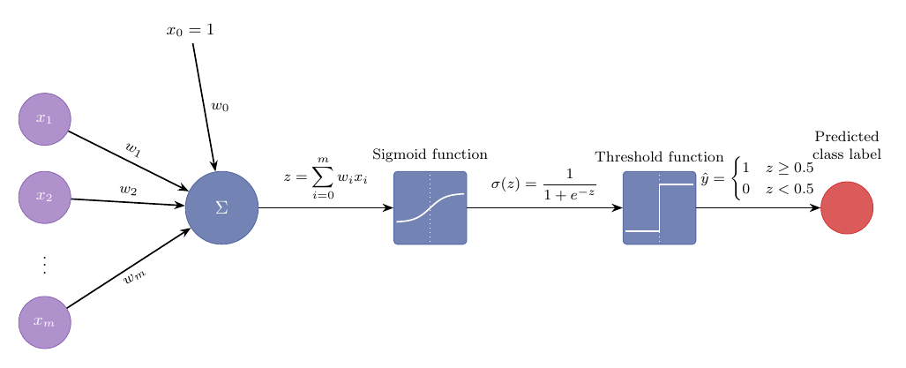
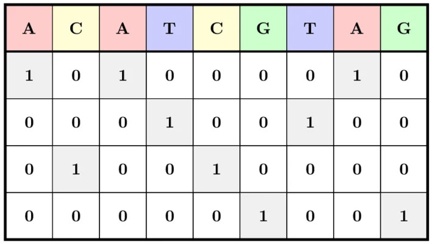

## Introduction {#part-1}

Logistic Regression (LogReg) is one of the most common machine learning algorithms. It can be used to predict the probability of an event occurring based on a given labeled data set.

- Email analysis (Is an email spam or not?)
- Sentiment analysis (is a movie review positive or negative?)
- Medical diagnostics (is a given diagnosis present or absent?)

::: {.callout-note appearance="simple"}
We will go over the algorithm in detail, because it is an excellent preparation for understanding neural networks.
:::

{fig-align="center"}

## One-hot encoding


| Word | brown | dog | fox | jumps | lazy | over | quick | the |
| :--- | :---: | :---: | :---: | :---: | :---: | :---: | :---: | :---: |
| **the** | 0 | 0 | 0 | 0 | 0 | 0 | 0 | <span style="color:blue">**1**</span> |
| **quick** | 0 | 0 | 0 | 0 | 0 | 0 | <span style="color:blue">**1**</span> | 0 |
| **brown** | <span style="color:blue">**1**</span> | 0 | 0 | 0 | 0 | 0 | 0 | 0 |
| **fox** | 0 | 0 | <span style="color:blue">**1**</span> | 0 | 0 | 0 | 0 | 0 |
| **jumps** | 0 | 0 | 0 | <span style="color:blue">**1**</span> | 0 | 0 | 0 | 0 |
| **over** | 0 | 0 | 0 | 0 | 0 | <span style="color:blue">**1**</span> | 0 | 0 |
| **the** | 0 | 0 | 0 | 0 | 0 | 0 | 0 | <span style="color:blue">**1**</span> |
| **lazy** | 0 | 0 | 0 | 0 | <span style="color:blue">**1**</span> | 0 | 0 | 0 |
| **dog** | 0 | <span style="color:blue">**1**</span> | 0 | 0 | 0 | 0 | 0 | 0 |

## One hot for nucleotides

{width=40% fig-align="center"}

::: {.tiny-credit}
Image adapted from https://jalammar.github.io/illustrated-word2vec/
:::


## Semantic vector space of cars

:::: {.columns}

::: {.column width="70%"}

```{python}
#| echo: false
#| fig-align: center
import sys
import matplotlib.pyplot as plt

sys.path.append('utils') 
from embed_plots import cars_pca

cars_pca(figsize=(7.5, 6))
plt.plot()
```

:::
::: {.column width="27%"}

::: {.small-text}

- In this constructed t space, we have three dimensions representing cars: size, color, and price
- We can represent a arbitrary car in this space. 
- Cars that are semantically similar (have similar attributes) are close to each other in this space

:::


:::
::::


## Semantics of one-hot vectors

- We would like to be able to test whether, say, "Man" and "Uncle" are relatively similar, but "Tofu" and "Airplane" are not very similar.
- The usual way of comparing vectors $\mathbf{x},\mathbf{y} \in \mathbb{R}^d$ is a cosine similarity (cosine of the angle between the vectors)

$$
\text{cosine similarity}(\mathbf{x},\mathbf{y}) =
\dfrac{\mathbf{x}^T\mathbf{y}}{\Vert \mathbf{x}\Vert  \Vert \mathbf{y}\Vert }
\in {-1,1}
$$

- cosine similarity between one-hot vectors of any two different words is 0
- Thus, one-hot vectors cannot encode similarities among words (except for identity).

## word2vec

- word2vec  maps each word to a fixed-length vector, and these vectors can better express the similarity and analogy relationship among different words. 

::: {.small-text}
- Mikolov, T. et al. (2013) [Efficient Estimation of Word Representations in Vector Space". arXiv:1301.3781](https://arxiv.org/abs/1301.3781)
- Mikolov, T. et al. (2013) [Distributed representations of words and phrases and their compositionality. Advances in Neural Information Processing Systems. arXiv:1310.4546](https://arxiv.org/abs/1310.4546)
:::

- word2vec is a classic algorithm that was extremely influential in NLP before the advent of transformer based algorithms.
- The word2vec algorithm has several features that influenced the development of transformers and it is a good place to learn about how embeddings can be created.

## Word embeddings
```{python}
#| echo: false
#| fig-align: center
import sys
import matplotlib.pyplot as plt

sys.path.append('utils') 
from embed_plots import w2v_analogy

w2v_analogy()
plt.plot()
```

- Word embeddings are semantically meaningful representations of words

::: {.tiny-credit}
Redrawn after Figure 2 of Mikolov T, et al. (2013) [Linguistic Regularities in Continuous Space Word Representations](https://aclanthology.org/N13-1090/)
:::

## word2vec

- Word2vec is based on two different models: skip-gram and continuous bag of words.

. The word2vec tool contains two models, namely skip-gram (Mikolov et al., 2013) and continuous bag of words (CBOW) (Mikolov et al., 2013). For semantically meaningful representations, their training relies on conditional probabilities that can be viewed as predicting some words using some of their surrounding words in corpora. Since supervision comes from the data without labels, both skip-gram and continuous bag of words are self-supervised models.

## skipgram

```{python}
#| echo: false
#| fig-align: center
import sys
import matplotlib.pyplot as plt

sys.path.append('utils') 
from embed_plots import plot_skipgram

plot_skipgram()
plt.plot()
```

- The skip-gram model assumes that a word can be used to generate its surrounding words in a text sequence. 
- Here, “the”, “man”, “loves”, “his”, "dog" is a text window of five words and the center word is "loves" 
- The skip-gram model considers the conditional probability for generating the context words: “the”, “man”, “his”, and “dog”, which are no more than 2 words away from the center word:

$$
P(the, man, his, dog \mid loves)
$$


## skipgram

The probability
$$
P(the, man, his, dog \mid loves) = P(the \mid loves) \cdot P(man\mid loves) \cdot P( his \mid loves) \cdot P(dog \mid loves) 
$$

- Each word in the vocabulary has two $d$-dimensional vector representations (embeddings): 
  - $\mathbf{v}_i \in \mathbb{R}^{d}$ when word $i$ is used as a _center_ word  
  - $\mathbf{u}_i \in \mathbb{R}^{d}$ when word $i$ is used as a _context_ word  
- The conditional probability of generating a context word $j$ from center word $i$ is given by the softmax operation on vector dot products
$$
p(w_j\mid w_i) = \dfrac{\exp{\mathbf{v}_i^T\mathbf{u}_j}}
{\sum_{k\in V} \exp{\mathbf{v}_k^T\mathbf{u}_j}}
$$ {#eq-skipgram-sm}


## skipgram
- If we train on a text of length $T$ where the word at step $t$ is denoted $w^{(t)}$, then the the likelihood function of the skip-gram model is the probability of generating all context words given any center word:

$$
\prod_{t=1}^{T} \prod_{\substack{-m\leq j\leq m \\ j\neq 0}} P(w^{(t+j)}\mid w^{j})
$$

## Training the skipgram

- The skip-gram model parameters are the center word vector and context word vector for each word in the vocabulary. 
- In training, we learn the model parameters by maximizing the likelihood function (i.e., maximum likelihood estimation), which is the same as minimizing the following loss function:

$$
- \sum_{t=1}^{T} \sum_{\substack{-m\leq j\leq m \\ j\neq 0}} \log P(w^{(t+j)}\mid w^{j})
$$

- Let us determine how to take the gradient of one term, say for center word $w_c$ and context word $w_o$:
- The log probability of this pair, according to @eq-skipgram-sm, is

$$
\begin{align}
\log P(w_o\mid w_c) &= \log \dfrac{\exp{\mathbf{u}_o^T\mathbf{v}_c}}
{\sum_{k\in V} \exp{\mathbf{u}_k^T\mathbf{v}_c}} \\
&= \log \exp{\mathbf{u}_o^T\mathbf{v}_c} - \log \sum_{k\in V} \exp{\mathbf{u}_k^T\mathbf{v}_c} \\
&= \mathbf{u}_o^T\mathbf{v}_c- \log \sum_{k\in V} \exp{\mathbf{u}_k^T\mathbf{v}_c} \\
\end{align}
$$

## Training the skipgram

- We  differentiate the gradient with respect to the center word vector 
$$
\begin{align}
\dfrac{\partial \log P(w_o\mid w_c)}{\partial \mathbf{v}_c} &=
\dfrac{\partial }{\partial \mathbf{v}_c} \left[ \mathbf{u}_o^T\mathbf{v}_c- \log \sum_{k\in V} \exp(\mathbf{u}_k^T\mathbf{v}_c) \right] \\
&=\mathbf{u}_o - \dfrac{\partial }{\partial \mathbf{v}_c}\log \sum_{k\in V} \exp(\mathbf{u}_k^T\mathbf{v}_c)  \\
\end{align}
$$

- Apply chain rule to second term, letting $S = \sum_{k\in V}\exp (\mathbf{u}^T\mathbf{v}_c)$
- By basic calculus we have
$$
\dfrac{\partial \log S}{\partial \mathbf{v}_c} = \dfrac{1}{S}\dfrac{\partial S}{\partial \mathbf{v}_c} 
$$

## Training the skipgram


- Differentiate S itself.
- Note: each term is $\exp(\text{linear in }\mathbf{v}_c)$, whose derivative brings down the linear coefficient 
$\mathbf{u}_k$ by the exponential chain rule.
$$
\begin{align}
\dfrac{\partial S}{\partial \mathbf{v}_c} &=
\dfrac{\partial}{\partial \mathbf{v}_c} \sum_{k\in V}\exp (\mathbf{u}_k^T\mathbf{v}_c) \\
 &= \sum_{k\in V}\dfrac{\partial}{\partial \mathbf{v}_c}  \exp (\mathbf{u}_k^T\mathbf{v}_c) \\
  &= \sum_{k\in V}  \exp (\mathbf{u}_k^T\mathbf{v}_c) \mathbf{u}_k \\
\end{align}
$$

## Training the skipgram

- Combine

$$
\begin{align}
\dfrac{\partial \log S}{\partial \mathbf{v}_c} &= \dfrac{1}{S}\dfrac{\partial S}{\partial \mathbf{v}_c} \\
&=\dfrac{1}{S}\sum_{k\in V}  \exp (\mathbf{u}_k^T\mathbf{v}_c) \mathbf{u}_k \\
\end{align}
$$

- Recall @eq-skipgram-sm
$$
p(w_j\mid w_i) = \dfrac{\exp{\mathbf{v}_i^T\mathbf{u}_j}}
{\sum_{k\in V} \exp{\mathbf{v}_k^T\mathbf{u}_j}} = \dfrac{1}{S}\exp{\mathbf{v}_i^T\mathbf{u}_j}
$$ 
- this rewrites the derivative as an expectation — it's the weighted average of every context vector $\mathbf{u}_k$ in the vocabulary, 
weighted by how likely the model currently thinks $w_k$ is given $w_c$.

## Plug back into the full gradient.

$$
\dfrac{\partial P(w_o\mid w_c)}{\partial \mathbf{v}_c} =
\mathbf{u}_o - \sum_{k\in V}P(w_k\mid w_c)\mathbf{u}_k =
\mathbf{u}_o  - \mathbb{E}_{w_k\sim P(\cdot\mid w_c)}[\mathbf{u}_k]
$$

## Understanding

- Let's understand what this is doing
- We are maximizing the probability of the true context word, meaning we are doing gradient **ascent**

$$
\mathbf{v}_c \leftarrow \mathbf{v}_c +\eta \dfrac{\partial P(w_o\mid w_c)}{\partial \mathbf{v}_c}
= \mathbf{v}_c(\mathbf{u}_o  - \mathbb{E}_{w_k\sim P(\cdot\mid w_c)}[\mathbf{u}_k])
$$

- $\eta$ is the learning rate
- $\eta\mathbf{u}_o$ adds a positive multiple of $\mathbf{u}_o$ to $\mathbf{v}_c$, moving the latter vector towards the actual context vector $\mathbf{u}_o$.
- $-\eta\mathbb{E}_{w_k\sim P(\cdot\mid w_c)}[\mathbf{u}_k])$ subtracts the expected vector 
- $\mathbb{E}_{w_k\sim P(\cdot\mid w_c)}[\mathbf{u}_k])$ is an expectation taken over every word $k\in V$ in the vocabulary 
according to the models own distribution $P(w_o\mid w_c)$, i.e., the softmax output.
	​- This is also why the exact skip-gram gradient is expensive: computing this expectation requires touching every word vector in the vocabulary at every single training step, which is the practical bottleneck that motivates approximations like negative sampling (which replaces the full sum with a small sample of "negative" words)

## TODO

- clean up above material
- add better explanations according to word2vec Explained


## Sources

The sources used to prepare this lecture include

- Goldberg Y and Levy O (2014) [word2vec Explained: deriving Mikolov et al.'s negative-sampling word-embedding method, arXiv 1402.3722](https://arxiv.org/abs/1402.3722)