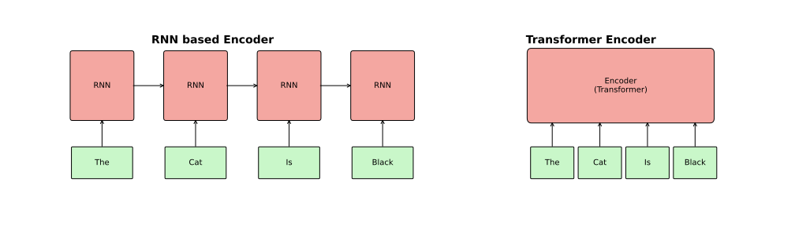
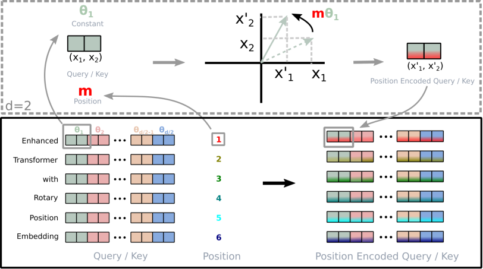
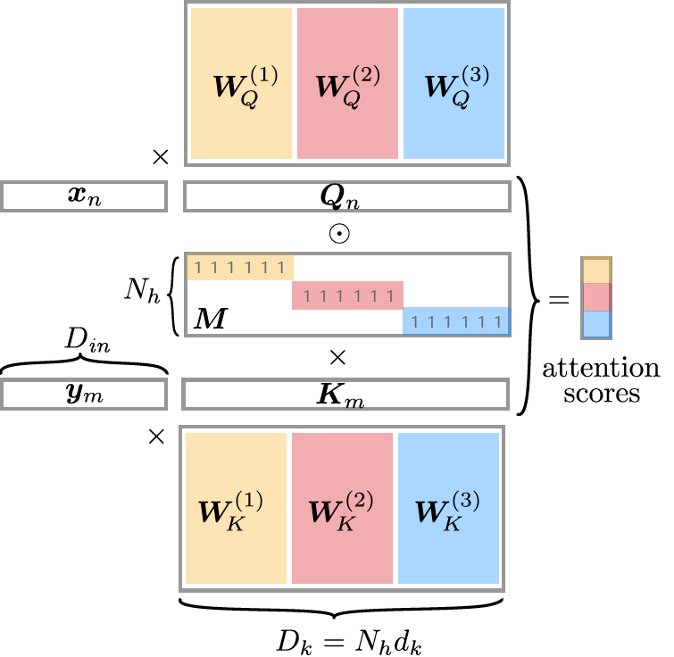
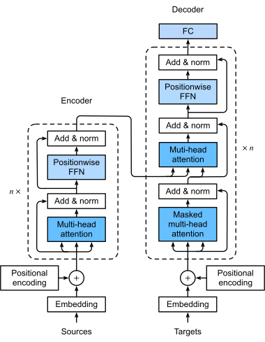

## Overview

::: {.callout-note}
## Game plan
This lecture provides an introduction to the transformer architecture with a focus on the encoder. 
:::

- [Embeddings](#embeddings) (See also [Lecture 8, Embeddings and Tokens](./embeddings.qmd))
- [Positional encodings](#positional)
- [Attention](#attention)
- [Layer Normalization](#layernorm)
- [Feed-Forward Network (FFN)](#ffn)


## Section 1: Tokenization and Embeddings 

:::: {.columns}

::: {.column width="45%"}
::: {.hl-container}
{width="100%"}

::: {.hl-box style="top: 81%; left: 10%; width: 35%; height: 4.5%;"}
:::
:::
:::

::: {.column width="55%"}
::: {.toc-list style="margin-top: 50px;"}

::: {.toc-item .toc-active}
1. Tokenization and Embeddings
:::

::: {.toc-item}
2. Positional Encodings
:::

::: {.toc-item}
3. Multi-head attention
:::

::: {.toc-item}
4. Layer Normalization
:::

:::
:::

::::

## Tokenization & Embedding

::: {.mybox}
### Tokenization
- Transforms raw text (sequence of words) into smaller parts called tokens. 
- Tokens can be characters, parts of words, or full words
- Tokens are mapped into indices (token IDs) to be used as input to the neural network
- The embedding layer ttransforms the tokens into "meaningful" vector representations
:::


## The Embedding Mapping

The embedding process transforms discrete tokens into a continuous vector space $\mathcal{V} \to \mathbb{R}^d$.

$$
\begin{equation}
\mathbf{e}_i = \text{embed}(w_i) = \mathbf{x}_i^\top \mathbf{W}_e
\end{equation}
$$
Where:

:::: {.columns}

::: {.column width="60%"}
- **One-hot vector**: $\mathbf{x}_i \in \{0,1\}^V$, where $V$ is the vocabulary size.
- **Weight Matrix**: $\mathbf{W}_e \in \mathbb{R}^{V \times d}$ contains the learnable parameters.
* **Projection**: The result $\mathbf{e}_i$ is the $i$-th row of the matrix $\mathbf{W}_e$.
:::

::: {.column width="40%"}
$$
\mathbf{W}_e = \begin{bmatrix} 
\leftarrow & \mathbf{e}_0 & \rightarrow \\
\leftarrow & \mathbf{e}_1 & \rightarrow \\
 & \vdots & \\
\leftarrow & \mathbf{e}_{V-1} & \rightarrow 
\end{bmatrix}
$$
:::

::::

::: {.small-text}
- $\mathbf{x}_i^\top \mathbf{W}_e$ just picks out the $i^{th}$ row of $\mathbf{W}_e$.
- The dimension of the embeddings is adjustable. For instance, SBERT has embeddings with a dimension of 768.
- The embedding matrix is initialized to random values and learned during training by back-propagation
- See lecture 8 for more background
:::


## Section 2: Positional Encodings {#positional}

::: {.columns}

::: {.column width="45%"}
::: {.hl-container}
{width="100%"}

::: {.hl-box style="top: 72.5%; left: -2%; width: 23%; height: 7.5%;"}
:::
:::
:::

::: {.column width="55%"}
::: {.toc-list style="margin-top: 50px;"}

::: {.toc-item }
1. Tokenization and Embeddings
:::

::: {.toc-item .toc-active}
2. Positional Encodings
:::

::: {.toc-item}
3. Multi-head attention
:::

::: {.toc-item}
4. Layer Normalization
:::


:::
:::

:::

## Positional encoding

::: {.mybox}
### Positional encoding
- The attention mechanism has no built-in concept of order 
- Transformers do not process input one token at a time (as do RNNs)
- The attention mechanis treats each data point as independent of the others. 
- Positional encodings encode position information directly into the input embeddings 
:::


## Positional Encodings: RNNs vs Encoders 


- Recurrent neural networks process one token at a time (serial), which transformer-based encoders process an entire sequence of tokens at once (parallel).
- Positional encodings are needed for the encoder to keep track of the relative and absolute positions of tokens

{#fig-rnn-vs-transform width=80% fig-align="center"}

::: {.small-text}
See [lecture 7: RNNs and LSTMs](./lstm.qmd) for background on RNNs
:::


## Positional information
- Transformers process entire sequence in parallel
- Therefore, they lack inherent information about the relative positions of tokens
- self-attention, on its own, is permutation-equivariant — it has **no built-in notion of token order**.
- Positional encodings are added to embeddings to provide position information
- Example for sentence, "I am an automaton" we have four embedding vectors: $\left[E_{\mathrm{I}}, E_{\mathrm{am}}, E_{\mathrm{an}}, E_{\mathrm{automaton}}\right]$
- We calculate four position encodings $\left[P_0,P_1,P_2,P_3\right]$
- These are then combined by elementwise addition:

$$
\left[E_{\mathrm{I}}+P_0, E_{\mathrm{am}}+P_1,E_{\mathrm{an}}+P_2, E_{\mathrm{automaton}}+P_3\right]
$$

:::{.tiny-credit}
Vaswani A et al. (2017) [Attention Is All You Need. arXiv 1706.03762](https://arxiv.org/abs/1706.03762)
:::

## Positional information

- Self-attention computes $\mathbf{QK}^T$ purely from token content (embeddings) — swapping two input tokens just swaps the corresponding outputs, with no other change. This property is called permutation equivariance.
- Consequence: without extra information, "I am an automaton" and "automaton an am I" would produce identical (permuted) attention patterns — word order carries no signal.
- Positional encodings break this symmetry by injecting position-dependent information into each token's representation before attention is computed.


## Sinusoidal Positional Encoding

- The original Transformer publication uses sinusoidal functions to encode positions. 
- For a sequence of length $n$, the positional encoding for position $i$ is a vector $\mathbf{p}_i$ defined as

$$
\mathbf{p}_i = \left[\sin\left(\frac{i}{10000^{\frac{2j}{d}}}\right), \cos\left(\frac{i}{10000^{\frac{2j}{d}}}\right) \right]_{j=0}^{\frac{d}{2}-1}
$$

- where:
    - $i$ is the position index (Position in the input text)
    - $j$ is the dimension index (Position in the positional vector)
    - $d$ is the dimensionality (Length of positional vector - which must be the same as that of the word embedding)
- Both the sine and the cosine dimensions for $j$ use the same frequency $\omega_{j} = (\frac{1}{10000})^{2j/d}$


## Understanding the PE Matrix

A positional encoding has the same dimension as an embedding, and calculates a value for each dimension using the sine and cosine formulas.

:::{.small-text}
$$
\mathbf{p}_i = \left[\sin\left(\frac{i}{10000^{\frac{2j}{d}}}\right), \cos\left(\frac{i}{10000^{\frac{2j}{d}}}\right) \right]_{j=0}^{\frac{d}{2}-1}
$$
:::

- example ("I", "am", "an", "automaton" and $d = 4$): 

:::{.small-text}
$$
\begin{align}
\mathbf{p}_0 &=  \left[\sin\left(\frac{0}{10000^{\frac{0}{4}}}\right), \cos\left(\frac{0}{10000^{\frac{0}{4}}}\right),
 \sin\left(\frac{0}{10000^{\frac{1}{2}}}\right), \cos\left(\frac{0}{10000^{\frac{1}{2}}}\right) \right] 
  =\left[0,1, 0, 1\right]  \\
  \mathbf{p}_1 &=  \left[\sin\left(\frac{1}{10000^{\frac{0}{4}}}\right), \cos\left(\frac{1}{10000^{\frac{0}{4}}}\right),
 \sin\left(\frac{1}{10000^{\frac{1}{2}}}\right), \cos\left(\frac{1}{10000^{\frac{1}{2}}}\right)\right] 
  = \left[0.8415, 0.5403, 0.0100, 0.9999\right]  \\
\mathbf{p}_2 &=  \left[\sin\left(\frac{2}{10000^{\frac{0}{4}}}\right), \cos\left(\frac{2}{10000^{\frac{0}{4}}}\right),
 \sin\left(\frac{2}{10000^{\frac{1}{2}}}\right), \cos\left(\frac{2}{10000^{\frac{1}{2}}}\right)\right] 
  = \left[0.9093, −0.4161, 0.0200, 0.9998\right]  \\
  \mathbf{p}_3 &=  \left[\sin\left(\frac{3}{10000^{\frac{0}{4}}}\right), \cos\left(\frac{3}{10000^{\frac{0}{4}}}\right),
 \sin\left(\frac{2}{10000^{\frac{1}{2}}}\right), \cos\left(\frac{2}{10000^{\frac{1}{2}}}\right)\right] 
  = \left[0.1411, −0.9900, 0.0300, 0.9996\right]  \\
\end{align}
$$
:::

- The embedding dimension $d$ is set to 4 in this example but is generally much larger (e.g., 768 for BERT)

::: {.small-text}
- At $i=0$ (smallest wavelength): the exponent $2i/d = 0$, so the denominator is $n^0 = 1$ regardless of $n$ — the wave oscillates fastest.
- At $i = d/2$ (largest wavelength): the exponent $2i/d = 1$, so the denominator is $n^1 = n=10000$. The wave oscillates slowest.
:::

## Understanding the PE Matrix

::: {.columns}
::: {.column width="60%"}

```{python}
#| echo: false
#| fig-align: center
import sys
import matplotlib.pyplot as plt

sys.path.append('utils') 
from encoder_plots import frequency_plot

frequency_plot()
plt.plot()
```


:::
::: {.column width="40%"}

- If the constant $n$ were too small (e.g., 50), the sine waves would repeat their cycles every 50 tokens. The model wouldn't be able to tell the difference between position 5 and position 55 because their encoding vectors would look identical.
- $n=10000$ ensures that for any sequence length a transformer is likely to see (e.g., 512 to 8,192 tokens), every single position has a unique combination of high-frequency and low-frequency signals.

:::
:::

## Properties of the Positional Encoding (1)

::: {.callout-note icon=false, title="The Linearity Property (Relative Positioning)"}

For any fixed offset $\Delta k$, the encoding at a shifted position can be represented as a linear transformation of the original:

$$PE_{pos + \Delta k} = \mathbf{M}_{\Delta k} \cdot PE_{pos}$$

:::

To prove this, recall the  Angle Addition Formulas that specify how to compute trig functions of sums or differences of angles.

- $sin(\alpha + \beta) = \sin(\alpha)\cos(\beta)+\cos(\alpha)\sin(\beta)$
- $cos(\alpha + \beta) = \cos(\alpha)\cos(\beta)-\sin(\alpha)\sin(\beta)$

To prove that $PE_{pos+k}$ is a linear transformation of $PE_{pos}$, we need to show that there exists a fixed matrix $M_k$ (that only depends on the offset $k$, not the position $pos$) such that:
$$PE_{pos+k} = M_k \cdot PE_{pos}$$

## Properties of the Positional Encoding (2)

::: {.small-text}
- For any dimension $i$, the positional encoding is a pair of $(\sin, \cos)$ values. Let's define $\omega_i = \frac{1}{10000^{2i/d_{model}}}$ to simplify the notation.The encoding at position $pos$ is:
- Our goal is to show that $\sin(\omega_i(pos +k))$ and $\cos(\omega_i(pos +k))$ can be rewritten purely in terms of 
$\sin(\omega_i\cdot pos))$, $\cos(\omega_i\cdot pos))$, and constants depending only on $k$, allowing us to express the operation in
terms of a matrix multiplication (in the following form
$$
\begin{bmatrix} \sin(\omega_i \cdot pos) \\ \cos(\omega_i \cdot pos) \end{bmatrix}
$$
:::
We want to find the encoding at $pos + k$:

$$\sin(\omega_i(pos + k)) = \sin(\omega_i \cdot pos + \omega_i \cdot k)$$$$\cos(\omega_i(pos + k)) = \cos(\omega_i \cdot pos + \omega_i \cdot k)$$

Plugging into the Angle Addition Formulas:

$$
\begin{align}
\sin(\omega_i \cdot pos + \omega_i \cdot k) &= \sin(\omega_i \cdot pos)\cos(\omega_i \cdot k) + \cos(\omega_i \cdot pos)\sin(\omega_i \cdot k)\\
\cos(\omega_i \cdot pos + \omega_i \cdot k) &= \cos(\omega_i \cdot pos)\cos(\omega_i \cdot k) - \sin(\omega_i \cdot pos)\sin(\omega_i \cdot k)
\end{align}
$$


## Properties of the Positional Encoding (3)

- Notice that the terms $\cos(\omega_i \cdot k)$ and $\sin(\omega_i \cdot k)$ are constants once we pick a fixed distance $k$. 
- We can rewrite the equations above as a matrix multiplication:
$$
\begin{align}
\begin{bmatrix} \sin(\omega_i(pos+k)) \\ \cos(\omega_i(pos+k)) \end{bmatrix} &= \begin{bmatrix} \cos(\omega_i k) & \sin(\omega_i k) \\ -\sin(\omega_i k) & \cos(\omega_i k) \end{bmatrix} \begin{bmatrix} \sin(\omega_i pos) \\ \cos(\omega_i pos) \end{bmatrix}\\
&= \begin{bmatrix}\cos(\omega_i k) \sin(\omega_i pos) +\sin(\omega_i k)  \cos(\omega_i pos)\\
-\sin(\omega_i k)\sin(\omega_i pos) +\cos(\omega_i k)\cos(\omega_i pos) 
\end{bmatrix}
\end{align}
$$

- Define $M_k = \begin{bmatrix} \cos(\omega_i k) & \sin(\omega_i k) \\ -\sin(\omega_i k) & \cos(\omega_i k) \end{bmatrix}$, so that $PE_{pos+k} = M_k \cdot PE_{pos}$.
- $M_k$ is a **rotation matrix**: $\det(M_k) = \cos^2(\omega_i k) + \sin^2(\omega_i k) = 1$, and $M_k M_k^\top = I$, so $M_k$ is orthogonal with determinant 1.
- Crucially, $M_k$ depends only on the offset $k$ (and frequency $\omega_i$) — and not on the absolute position $pos$.

## Distance (1)


- In the Attention mechanism, the model calculates the similarity between tokens using a __dot product__. 
- Because of the way these waves overlap, the dot product between the encodings of two tokens decays as the distance between them increases
- When we add the positional vector ($P$) to the word embedding ($E$), the resulting vector is $X = E + P$.
- When the attention mechanism calculates the dot product between a Query ($Q$) and a Key ($K$) a combination of semantics (word embeddings) and location (positional encodings) is taken into account.
- To gain intuition, let's ignore the weight matrices $W_Q$ and $W_K$ for now.

## Distance (2)

- The dot product between two tokens at positions $i$ and $j$ looks like this:

$$X_i\cdot X_j = (E_i + P_i) \cdot (E_j + P_j)$$

This results in four distinct terms

1. $E_i \cdot E_j$ (Content-Content): How much the meaning of word $i$ relates to the meaning of word $j$.
2. $E_i \cdot P_j$ (Content-Position): Does word $i$ tend to look at position $j$? (e.g., "The" looking for a noun in the next slot).
3. $P_i \cdot E_j$ (Position-Content): Does position $i$ look for specific types of words?
4. $P_i \cdot P_j$ (Position-Position): Pure distance component.

- The cross-terms are often small in practice
- To gain intuition, we will focus on the content-content and position-position terms in the next slide

## How the Model Separates "Meaning" from "Distance"?

- __High Dimensionality__: In a 512 or 1024-dimensional space, there is a lot of "room." 
- The model the model has room to partially separate certain dimensions primarily for semantic meaning and other dimensions primarily for positional signal.


- __Learned Projections__: The weight matrices ($W_Q, W_K, W_V$) act as filters.^[We will look closely at these matrices later on] Through training, the model learns to project the "summed" vector into a subspace where the positional information is amplified when it needs to know distance, and the semantic information is amplified when it needs to know meaning. 

- The cross-terms (like $E_{v} \cdot P_v$) tend to be very close to zero because "meaning" vectors and "position" vectors are nearly orthogonal in high-dimensional space

- Let $v$ be the token at position $P_v$ and $w$ be the token at position $P_w$. Then in most cases we have

$$(E_{v} + P_v) \cdot (E_{w} + P_w) \approx \underbrace{(E_{v} \cdot E_{w})}_{\text{Do these words relate?}} + \underbrace{(P_v \cdot P_w)}_{\text{Are they close together?}}$$

## Rotary Position Embedding

:::: {.columns}
::: {.column width="40%"}
- Rotary Positional Embeddings (RoPE)
- Instead of adding a "position vector" to it, RoPE applies a rotation matrix.    
  - Token at Position 0: No rotation.
  - Token at Position 1: Rotate by $1\theta$.
  - Token at Position 2: Rotate by $2\theta$.
  - $\ldots$
- We will not discuss this further here.
- Approach adopted by many major LLMs including Llama (Meta), PaLM (Google), and Mistral.^[Su (2024) RoFormer: : Enhanced transformer with Rotary Position Embedding. Neurocomput]
:::
::: {.column width="60%"}
{#fig-rnn-vs-transform width=80% fig-align="center"}
:::
::::


# Section 3: Attention {#attention}

:::: {.columns}

::: {.column width="45%"}
::: {.hl-container}
{width="100%"}

::: {.hl-box style="top: 60%; left: 15%; width: 23%; height: 8%;"}
:::
:::
:::

::: {.column width="55%"}
::: {.toc-list style="margin-top: 50px;"}

::: {.toc-item}
1. Embeddings
:::

::: {.toc-item}
2. Positional Encodings
:::

::: {.toc-item .toc-active}
3. Multi-head attention
:::

::: {.toc-item}
4. Layer Normalization
:::

:::
:::

::::


## Attention


::: {.mybox}
**Attention**:
- The transformer purely relies on the attention mechanism to capture the dependency among input tokens
- Multihead attention applies multiple heads in parallels
- By splitting queries, keys, and values into smaller subspaces, different heads focus on distinct relationships, grammar rules, or word meanings simultaneously before combining the results
:::

## The Encoder: Attention

:::: {.columns}
::: {.column width="50%"}
```{python}
#| echo: false
#| fig-width: 10
#| fig-height: 6
#| out-width: "100%"
#| fig-align: center
import sys
sys.path.append('utils')
from llm_plots import draw_encoder_compact
draw_encoder_compact(highlight='ffn')
```
:::

::: {.column width="50%"}
### Core encoder block
The transformer architecture is built around a core encoder block that processes sequential data three three principle components

- A self-attention mechanism
- Layer normalization
- A feed-forward network
:::

::::

# Self-attention: Key ideas

* The input to the encoder layer can be represented by a matrix $\mathbf{X}$ with $n$ tokens and $d$ features ($n \times d$):
$$
\mathbf{X} = \begin{bmatrix} 
x_{1,1} & x_{1,2} & \cdots & x_{1,d} \\
x_{2,1} & x_{2,2} & \cdots & x_{2,d} \\
\vdots & & \ddots & \vdots  \\
x_{n,1} & x_{n,2} & \cdots & x_{n,d} \\
\end{bmatrix}
$$

* Each row corresponds to the embedded representation of one token: $\mathbf{x}_{i} \in \mathbb{R}^d$
* The self-attention mechanism transforms $\mathbf{X}$ through learned weight matrices $\mathbf{W}^{Q}$, $\mathbf{W}^{K}$, and $\mathbf{W}^{V} \in \mathbb{R}^{d \times d}$ to obtain the query, key, and value matrices:


# Self-attention: Dimensionality Check

- An input sequence $\mathbf{X}$ is an $n \times d$ matrix ($n$ tokens, $d$ features).
- Each row is a token (sum of embedding and positional matrix)
- For each token $x_i$ (a $1 \times d$ row vector):
$$
\underbrace{q_i}_{1 \times d} = \underbrace{x_i}_{1 \times d} \times \underbrace{W^Q}_{d \times d}
$$

- Equivalently, we can represent the operations in matrix form

$$
\mathbf{Q} = \mathbf{X}\mathbf{W}^{Q}, \quad \mathbf{K} = \mathbf{X}\mathbf{W}^{K}, \quad \mathbf{V} = \mathbf{X}\mathbf{W}^{V}
$$

$$
\underset{(n \times d)}{\mathbf{Q}} = \underset{(n \times d)}{\mathbf{X}} \times \underset{(d \times d)}{\mathbf{W}^{Q}}
\quad\quad \text{(etc.)}
$$

## Big picture: Attention

::: {.mybox}
**At a high level**

- The token currently being predicted is mapped to a *query* vector $\mathbf{q} \in \mathbb{R}^{d_k}$
- The tokens in the context are mapped to *key* vectors $\mathbf{k}_t \in \mathbb{R}^{d_k}$ and to *value* vectors $\mathbf{v}_t \in \mathbb{R}^{d_k}$
- $d_v$ is the dimensionality of the query and key vectors
- $d_v$ can differ from $d_k$; it sets the dimensionality of the attention output.
- In practice, $d_k = d_v$ is a common simplifying choice
:::

- The inner products 
$$
\mathbf{q}^T\mathbf{k}_t
$$
are interpreted as <span style="background-color: #e0f2fe; padding: 2px 6px; border-radius: 4px;">The degree
to which token $t\in V$ is important for predicting the current token $q$</span>.
- $\mathbf{q}^T\mathbf{k}_t$ is a scalar number. Taken over all $t$, we obtain a distribution over the context tokens that is used to combine the value vectors


## Attention function


- The attention function $A(Q,K,V)$ is typically caculated in steps. First, we calculate the
attention scores as a similarity measure between the query vectors and the key vectors.
$$
S_{i,j} =  \dfrac{\langle \mathbf{q}_i, \mathbf{k}_j\rangle}{\sqrt{d_k}} = \dfrac{\mathbf{q}_i^T\mathbf{k}_j}{\sqrt{d_k}} 
$$

- $ \mathbf{q}_i$: the $i^{th}$ query vector and $\mathbf{k}_j$: $j^{th}$ key vector
- $d_k$ is the dimensionality of the key vectors
- $\langle \mathbf{q}_i, \mathbf{k}_j\rangle$ denotes the dot product.
- The scaling factor $\frac{1}{\sqrt{d_k}}$ is introduced to mitigate the effect of increasing dimensionality (See below)
- The attention scores $S_{i,j}$ are then normalized using the softmax function to produce
the attention weights:
$$
a_{ij} = \dfrac{e^{S_{i,j}}}{\sum_{k=1}^n e^{S_{i,k}}}
$$
- The $a_{ij}$ indicate the relative importance of the $j^{th}$ key vector to the $i^{th}$ query vector.

## Attention function

- The  output of the attention mechanism is computed as a weighted sum of the value vectors:
$$
\mathbf{z}_{i} = \sum_{j=1}^n a_{ij}\mathbf{v}_j
$$

- $\mathbf{v}_j$ is the $j^{th}$ value vector
- $\mathbf{z}_{i}$ is the output vector corresponding to the  $i^{th}$ query vector. 
- We can express this in matrix form as

$$
A(\mathbf{Q},\mathbf{K},\mathbf{V})= \mathrm{softmax}\left(\dfrac{\mathbf{QK}^T}{\sqrt{d_k}}\right)
$$

The attention mapping is

- linear, allowing it to combine different sets
of value vectors in a controlled manner
- Invariant Under Permutations: The order of the tokens does not effect the result of the calculations (which is why the positional encodings are needed)
- Commutative: If multiple heads are applied, the order of application does not matter (see below)


## $W^K$ versus $W^Q$

The Functional Roles: a useful intuition is that they act as two different "filters" applied to the same input data:

- $W^K$ (The Key Matrix): intuitively, learns to describe a token so it can be "found" by relevant queries.
- $W^Q$ (The Query Matrix): intuitively, learns to encode what the current token needs from its context.

- This is a simplifying explanation — $W^Q$ and $W^K$ are trained jointly and don't have separately interpretable roles in general. 
- Empirically, it has been shown that different attention heads may specialize to recognizable syntactic/semantic relations, e.g. heads that reliably attend from verbs to their direct objects, or from determiners to nouns.^[Clark et al. (2019), "What Does BERT Look at? An Analysis of BERT's Attention," Proceedings of the 2019 ACL Workshop BlackboxNLP]


## The scaling factor

- The scaling factor $\frac{1}{\sqrt{d_k}}$ is needed to keep the gradients in a good range
- We will derive a simplified/intuitive explanation of why this tends to work
- Assume  $q_1, q_2, \ldots, q_{d_k}, k_1,k_2,\ldots, k_{d_k}$ are mutually independent random variables, each with mean 0 and variance 1. with dimension $d_k=64$ 
* Thus, $\mathbf{q}_i \perp \mathbf{k}_j$ (query and key are independent of each other): this implies that $\mathbb{E}[\mathbf{q}_i \mathbf{k}_j]=0$ and that $\mathbb{E}[\mathbf{q}_i^2 \mathbf{k}_j^2]=\mathbb{E}[\mathbf{q}_i^2]\mathbb{E}[\mathbf{k}_j^2]$


::: {.tiny-credit}
Derivation from [Vaswani A et al. (2017) Attention Is All You Need. arXiv 1706.03762](https://arxiv.org/abs/1706.03762)
:::


## Proof

The dot product $q \cdot k$ for $d_k$ dimensions is defined as:

$$
S = \sum_{i=1}^{d_k} q_i k_i
$$

::: {tiny-credit}
This is the same computation as a single entry  $\mathrm{score}_{i,j}$ 
of the  $QK^T$ matrix — here we drop the token indices $i,j$
since the variance argument holds for any single query–key pair.
:::

To find the variance of $S$, we first look at the variance of a single term $q_i k_i$:$$Var(q_i k_i) = E[(q_i k_i)^2] - (E[q_i k_i])^2$$Mean of the product: Since $q_i$ and $k_i$ are independent, $E[q_i k_i] = E[q_i]E[k_i] = 0 \cdot 0 = 0$.

- Expected value of the square: $E[q_i^2 k_i^2] = E[q_i^2]E[k_i^2]$. Since $Var(X) = E[X^2] - (E[X])^2$, and $E[X]=0$, then $E[X^2] = Var(X) = 1$. 
- Thus, $E[q_i^2 k_i^2] = 1 \cdot 1 = 1$.
- Variance of one term: $Var(q_i k_i) = 1 - 0 = 1$.

## Proof (2)

**Why variance adds under independence.** For any two random variables $X, Y$:
$$
\text{Var}(X+Y) = \text{Var}(X) + \text{Var}(Y) + 2\,\text{Cov}(X,Y)
$$
The covariance term vanishes when $X$ and $Y$ are independent, since $\text{Cov}(X,Y) = \mathbb{E}[XY]-\mathbb{E}[X]\mathbb{E}[Y] = 0$ whenever $X \perp Y$. This extends to a sum of $d_k$ mutually independent terms: all cross-covariance terms vanish, leaving only the individual variances.

- Because $q_1,\ldots,q_{d_k}$ and $k_1,\ldots,k_{d_k}$ are mutually independent (by assumption ), the products $q_m k_m$ for different $m$ are independent, and their covariances are all 0.
- So the variance of the sum collapses to the sum of the variances:

$$
\text{Var}(S) = \text{Var}\left(\sum_{m=1}^{d_k} q_m k_m\right) = \sum_{m=1}^{d_k} \text{Var}(q_m k_m) = \sum_{m=1}^{d_k} 1 = d_k
$$

## Proof (3): Dividing by $\sqrt{d_k}$

Recall the scaling rule for variance: for a constant $c$, $\text{Var}(cX) = c^2\,\text{Var}(X)$.

- Applying this with $c = \dfrac{1}{\sqrt{d_k}}$ and $X = S$:

$$
\text{Var}\left(\frac{S}{\sqrt{d_k}}\right) = \left(\frac{1}{\sqrt{d_k}}\right)^2 \text{Var}(S) = \frac{1}{d_k}\cdot d_k = 1
$$

- So dividing the raw dot product by $\sqrt{d_k}$ (not $d_k$ itself) exactly restores unit variance, regardless of $d_k$.
- This keeps the inputs to softmax in a stable range: without scaling, large-magnitude scores push softmax into extremely peaked (near one-hot) distributions, where gradients with respect to the inputs vanish almost everywhere — the "exploding/vanishing gradients" problem.


## Softmax and attention

Recall the definition of softmax:

$$
\begin{bmatrix} 
1.3 \\
5.1\\
2.2 \\
0.7 \\
1.1
\end{bmatrix}
\rightarrow
\dfrac{e^{z_i}}{\sum_{j=1}^K e^{z_j}}
\rightarrow
\begin{bmatrix} 
0.02 \\
0.90\\
0.05 \\
0.01 \\
0.02
\end{bmatrix}
$$

- Each row in the $QK^\top$ matrix represents a single word's "view" of the entire sentence.
- Row 1: How much Word 1 cares about [Word 1, Word 2, ..., Word $n$].
- Row 2: How much Word 2 cares about [Word 1, Word 2, ..., Word $n$].
- etc.
- Since we want each word to "distribute" its attention across the sentence, the scores in each row must sum to 1.0.

$$
\text{softmax}\left(\frac{QK^\top}{\sqrt{d_k}}\right)
$$

## Softmax and attention (2)

- In detail, the operation looks like this:

$$
\text{Softmax} \left( 
\frac{1}{\sqrt{d_k}} \times 
\underbrace{
\begin{bmatrix} 
q_1 \cdot k_1 & q_1 \cdot k_2 & \dots & q_1 \cdot k_n \\
q_2 \cdot k_1 & q_2 \cdot k_2 & \dots & q_2 \cdot k_n \\
\vdots & \vdots & \ddots & \vdots \\
q_n \cdot k_1 & q_n \cdot k_2 & \dots & q_n \cdot k_n
\end{bmatrix}
}_{\text{Raw Scores } (n \times n)}
\right) = 
\underbrace{
\begin{bmatrix} 
\alpha_{1,1} & \alpha_{1,2} & \dots & \alpha_{1,n} \\
\alpha_{2,1} & \alpha_{2,2} & \dots & \alpha_{2,n} \\
\vdots & \vdots & \ddots & \vdots \\
\alpha_{n,1} & \alpha_{n,2} & \dots & \alpha_{n,n}
\end{bmatrix}
}_{\text{Attention Weights } (n \times n)}
$$

In this resulting matrix:

- $\sum_{j=1}^{n} \alpha_{i,j} = 1$ (Each row sums to 1).
- $\alpha_{1,2}$ is the percentage of attention Word 1 pays to Word 2.

## Value Vectors

- Value vectors contain detailed information about each token
- They are transformed embeddings that are weighted and summed based on the attention scores
- Intuitively, the value vector contains the potential meanings of a word, and the attention scores determine which meanings are most relevant within a given context
- We get the value vectors analogously from a learned $W^V$

$$
V = XW^V = 
\begin{bmatrix}
v_{11} & v_{12} & \dots  & v_{1d_v} \\
v_{21} & v_{22} & \dots  & v_{2d_v} \\
\vdots & \vdots & \ddots & \vdots    \\
v_{n1} & v_{n2} & \dots  & v_{nd_v}
\end{bmatrix}_{n \times d_v}
$$

## Calculating Values
Now that we have a matrix of Attention Weights ($\alpha$), we use them to take a weighted average of the information stored in the Value matrix ($V$).

* **The Value Matrix ($V$)**: Just like $Q$ and $K$, the Value matrix is created by projecting the input $X$ through a learnable weight matrix $W^V$:
$$\underbrace{V}_{n \times d_v} = \underbrace{X}_{n \times d} \times \underbrace{W^V}_{d \times d_v}$$

- $d$ is the dimension of the input embeddings (typically, $d>d_k$)
- The output dimension of attention is $d_v$, i.e., attention's output width is set entirely by the Value projection
- The Value represents the actual "content" of the word. 

## The Weighted Sum

We take our $n \times n$ attention weights and multiply them by our $n \times d_v$ Values.

$$\text{Output} = \underbrace{\text{Softmax}\left(\frac{QK^\top}{\sqrt{d_k}}\right)}_{n \times n} \times \underbrace{V}_{n \times d_v}$$

To see what happens to Word 1, look at the first row of the multiplication:

$$\text{Output}_1 = \alpha_{1,1}v_1 + \alpha_{1,2}v_2 + \dots + \alpha_{1,n}v_n$$   

- The Final Output is a $n \times d_v$ matrix representing the context-aware version of each token.

## Attention: Example

{width="40%" fig-align="center"}

- Many of the attention heads attend to a distant dependency of
the verb ‘making’, completing the phrase ‘making...more difficult’. Attentions here shown only for
the word ‘making’.

::: {.tiny-credit}
[Vaswani A et al. (2017) Attention Is All You Need. arXiv 1706.03762](https://arxiv.org/abs/1706.03762)
:::

## Multi-Head Assembly

{width="40%" fig-align="center"}


- We will cover multihead attention in the section lecture on transformers


# Section 4: Layer Normalization {#layernorm}

:::: {.columns}

::: {.column width="45%"}
::: {.hl-container}
{width="100%"}

::: {.hl-box style="top: 54%; left: 15%; width: 23%; height: 4.75%;"}
:::
:::
:::

::: {.column width="55%"}
::: {.toc-list style="margin-top: 50px;"}

::: {.toc-item}
1. Embeddings
:::

::: {.toc-item}
2. Positional Encodings
:::

::: {.toc-item }
3. Multi-head attention
:::

::: {.toc-item .toc-active}
4. Layer Normalization
:::

:::
:::

::::

## Layer Normalization

::: {.mybox}
**Layer normalization**:

- a technique that normalizes the activations within each layer
of the network, ensuring that they have a consistent distribution.
:::


- For an input to a layer $\mathbf{x} = \left[x_1, x_2, \ldots, x_d \right]$ where $d$ is the dimensionality
- The mean is $\mu_x = \frac{1}{d}\sum_{i=1}^d x_i$
- The variance is $\sigma^2 = \frac{1}{d}\sum_{i=1}^d (x_i-\mu_x)^2$
- $\hat{x}_i = \frac{x_i-\mu_x}{\sqrt{\sigma^2+\epsilon}}$ ($\epsilon$ is a small constant for numerical stability)
- $\mathrm{LayerNorm}(\mathbf{x}) = \gamma \odot \hat{x}_i + \beta$
- $\gamma$ and $\beta$ are learnable parameters that scale and shift the normalized output

::: {.tiny-credit}
Ba JL et al. (2016) [Layer Normalization. arXiv 1607.06450](https://arxiv.org/abs/1607.06450)
:::

## Layer Normalization (LN)

- LN greatly contributes to stabilizing training and optimizing performance in deep learning models, especially in transformers. It works by normalizing the activations at each layer, ensuring a more consistent gradient flow during training. 


__Two flavors__:

- Post-LN transformer applies normalization after the addition of the layer’s output with the residual connection’s output.^[Vaswani et al. (2017) 31st Conference on Neural Information Processing Systems (NIPS)]
- Pre-LN transformers apply normalization before self-attention and feed-forward layers. This configuration is used in modern architectures such as GPT, Llama, and Vision Transformers.^[Xiong R, et al., On layer normalization in the transformer architecture. In International Conference on Machine Learning, PMLR, 2020.]


## LN step 1: Add

The layer performs an Add and Norm operation:

* **Add** is a Residual Connection (also called a Skip Connection). 
* **Output**: $$\text{Output} = X + Sublayer(X)$$


- strictly element-wise addition, e.g., for token $i$ and feature $j$:

$$\text{Output}_{i,j} = x_{i,j} + \text{Sublayer}(X)_{i,j}$$

- **Intuition**: This operation can be regarded as $X + f(X)$. During backpropagation, we calculate the first derivative as

$$\frac{\partial(X + f(X))}{\partial X} = 1 + f'(X)$$

- Even if the sublayer's gradient $f'(X)$ is near zero (the "vanishing gradient" problem), the total gradient is still at least $1$.^[He K, et al., Deep Residual Learning for Image Recognition, 2016 IEEE Conference on Computer Vision and Pattern Recognition (CVPR)]

## LN step 2: Norm

::: {.callout-note icon=false, title="Norm"}

The normalization step ensures that values do no not explode^[The $\odot$ symbol represents element-wise multiplication.]

$$ \text{LayerNorm}(Z) = \gamma \odot \left( \frac{Z - \mu}{\sqrt{\sigma^2 + \epsilon}} \right) + \beta$$

:::

- Mean ($\mu$): Average of the $d$ values for a specific token.
- Variance ($\sigma^2$): Corresponding variance.
- Standardization: mean of 0 and a variance of 1. Before this step, values can be highly divergent which would lead to softmax saturation problems
- $\gamma$  and $\beta$ are learnable parameters. They are vectors of size $d$ (same dimension as the input embedding):

$$\text{Output}_j = (\gamma_j \cdot \hat{x}_j) + \beta_j$$

- Before training, all $\gamma$ values are initialized to 1 and all $\beta$ values are initialized to 0.

## LN: Effects

- In a transformer model, layer normalization is applied after the multi-head atten-
tion mechanism and after the feedforward network. 
- This ensures that the outputs of these components have a stable distribution, which is crucial for the model’s ability
to learn effectively.


::: {.tiny-credit}
Singh P and Raman B (2025) The Geometry of Intelligence: Foundations of Transformer Networks in Deep Learning. January 2025.  ISBN: 978-981-96-4705-7.
:::

# Section 5: Feed-Forward Network (FFN) {#ffn}

::: {.columns}

::: {.column width="45%"}
::: {.hl-container}
{width="100%"}

::: {.hl-box style="top: 44%; left: 15%; width: 23%; height: 7%;"}
:::
:::
:::

::: {.column width="55%"}
::: {.toc-list style="margin-top: 50px;"}

::: {.toc-item}
1. Embeddings
:::

::: {.toc-item}
2. Positional Encodings
:::

::: {.toc-item }
3. Multi-head attention
:::

::: {.toc-item }
4. Layer Normalization
:::

::: {.toc-item .toc-active}
5. FFN
:::

:::
:::

:::


## FFN Expansion-Contraction

::: {.columns}
::: {.column width="50%"}
```{python}
#| echo: false
#| fig-width: 10
#| fig-height: 6
#| out-width: "100%"
#| fig-align: center
import sys
sys.path.append('utils') 
from llm_plots import draw_gelu_block

draw_gelu_block()
```

:::

::: {.column width="50%"}

- In BERT-Base, the FFN consists of two linear transformations with a non-linear activation (GELU) in between. 
- Expansion-Contraction architecture
- Input $x$: $1 \times 768$
- $W_1$: $768 \times 3072$ (The "Expansion" weights)
- $b_1$: $1 \times 3072$ (The first bias)
- $W_2$: $3072 \times 768$ (The "Projection" weights)
- $b_2$: $1 \times 768$ (The second bias)

:::
:::

## FFN layer

$$FFN(x) = \text{GELU}(xW_1 + b_1)W_2 + b_2$$


---

## ReLU vs GeLU

::: {.callout-note icon=false}

## activation functions

After matrix multiplication (linear), a non-linear activation function is applied, which makes the neural network a non-linear function, allowing it to achieve complex behavior. ReLu is the most widely use activation function (simple, fast to compute)

:::

---

## Rectified Linear Unit (ReLU) 

- The Rectified Linear Unit (ReLU)  outputs the input if positive; otherwise, it outputs zero.

::: {.columns}
::: {.column width="70%"}
$$
\mathrm{ReLU}(x) = \max(0,x)
$$

The first derivative of ReLU is

$$
\dfrac{d}{dx}\mathrm{ReLU}(x) =
\begin{cases}
x > 0 & 1 \\
x < 0 & 0 \\
x = 0 & \text{undefined but usually set to zero in code}\\
\end{cases}
$$


- the ReLU function may suffer from the dying ReLU problem, where a large fraction of the neurons can become inactive and unresponsive, hindering the learning process^[Lu, L, et al. (2019). Dying ReLU and Initialization: Theory and Numerical Examples.. https://doi.org/10.48550/arxiv.1903.06733]
- Leaky ReLU:  $f(x) = max(\alpha \cdot x, x)$, where $\alpha$ is a small value such as 0.01. Leaky ReLU enables a small, non-zero gradient for negative values.


:::
::: {.column width="30%"}

```{python}
#| echo: false
#| fig-width: 5
#| fig-height: 5
#| out-width: "100%"
#| fig-align: center
import sys
sys.path.append('utils') 
from llm_plots import plot_activations
plot_activations(show_gelu=False)
```

:::
:::


## Gaussian Error Linear Unit (GELU)

::: {.columns}
::: {.column width="70%"}

- GELU has several desirable attributes: smoothness, differentiability, and ability to approximate the widely used ReLU function.
- GELU is used in many tools including BERT   and GPT
- GELU weights the input by its magnitude

$$\text{GELU}(x) = x \Phi(x) \approx 0.5x \left( 1 + \tanh \left( \sqrt{\frac{2}{\pi}} (x + 0.044715x^3) \right) \right)$$

- $\Phi(x)$ is the Cumulative Distribution Function (CDF) of the standard normal distribution. The BERT paper uses a fast approximation (shown on right)^[Lee, M, Mathematical Analysis and Performance Evaluation of the GELU Activation Function in Deep Learning, Journal of Mathematics, 2023]


:::
::: {.column width="30%"}

```{python}
#| echo: false
#| fig-width: 5
#| fig-height: 5
#| out-width: "100%"
#| fig-align: center
import sys
sys.path.append('utils') # Tell Python to look in the utils folder
from llm_plots import plot_activations
plot_activations(show_gelu=True)
```

:::
:::


## BERT's FFN Block


::: {.columns}
::: {.column width="50%"}

```{python}
#| echo: false
#| out-height: "65vh"
#| fig-align: center
import sys
sys.path.append('utils') 
from llm_plots import plot_activations

draw_gelu_block()
```

:::

::: {.column width="50%"}
- Coming back to the FFN architexture, BERT takes the  $768$-dimensional vector from the Add & Norm layer and expands to  into a $3072$-dimensional space before applying the GELU activation function, following which it projects it back to  $768$-dimensional for further processing

$$
\underbrace{1 \times 768}_{\text{Input}} 
\xrightarrow{W_1, b_1} 
\underbrace{1 \times 3072}_{\text{Linear Expansion}} 
\xrightarrow{\text{GELU}} 
\underbrace{1 \times 3072}_{\text{Non-linear Activation}} 
\xrightarrow{W_2, b_2} 
\underbrace{1 \times 768}_{\text{Output}}
$$

:::

- [Todo: explain FFN architexture based on BERT paper - what advantage is there for expanding etc?)]{.neon-todo}

:::


# Section 6: Layer Normalization

::: {.columns}

::: {.column width="45%"}
::: {.hl-container}
{width="100%"}

::: {.hl-box style="top: 37.75%; left: 15%; width: 23%; height: 4.75%;"}
:::
:::
:::

::: {.column width="55%"}
::: {.toc-list style="margin-top: 50px;"}

::: {.toc-item}
1. Embeddings
:::

::: {.toc-item}
2. Positional Encodings
:::

::: {.toc-item }
3. Multi-head attention
:::

::: {.toc-item}
4. Layer Normalization
:::

::: {.toc-item}
5. FFN
:::


::: {.toc-item .toc-active}
6. Layer Normalization
:::

:::
:::
:::


## Layer Normalization (2)

- The First Add & Norm stabilized the Communication (Attention).
- This Second Add & Norm stabilizes the Computation (FFN).

$$\text{Layer Output} = \text{LayerNorm} \left( \underbrace{X_{\text{post-attn}}}_{\text{The "Base" Knowledge}} + \underbrace{\text{FFN}(X_{\text{post-attn}})}_{\text{The "New" Insights}} \right)$$

Similar to the previous add & norm layer, this one has two purposes
- The "Add" (Residual): This ensures that even if the FFN didn't learn anything useful for a particular word (like a common "the" or "a"), the original context from the attention layer is preserved perfectly.
- The "Norm" (LayerNorm): This resets the "electrical signals" of the 768 features. It ensures that the numbers don't get progressively larger as they move from Layer 1 to Layer 12.
- The output of this final Norm is exactly the same shape as the input at the very beginning of the layer ($n \times 768$)

- [Todo: explain what is BERT specific here]{.neon-todo}


## Conclusion

::: {.callout-note icon=false title="Take home"}

This lecture introduced the Encoder architecture as it is implemented in BERT. In the next lecture, we will introduce the decoder architecture and discuss how these models are trained.

:::

- [Todo: Talk about some of the BERT use cases]{.neon-todo}
- [Todo: Homework, using BERT to do something]{.neon-todo}
- [Todo: Talk about some of the variations of BERT]{.neon-todo}

## Sources

Sources for this lecture include

- [Vaswani A et al. (2017) Attention Is All You Need. arXiv 1706.03762](https://arxiv.org/abs/1706.03762)
- [Wang et al. (2018), On the Dimensionality of Word Embeddings, (NeurIPS 2018)](https://arxiv.org/abs/1812.04224)
- Singh P and Raman B (2025) The Geometry of Intelligence: Foundations of Transformer Networks in Deep Learning. January 2025.  ISBN: 978-981-96-4705-7.