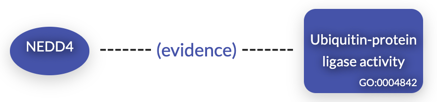
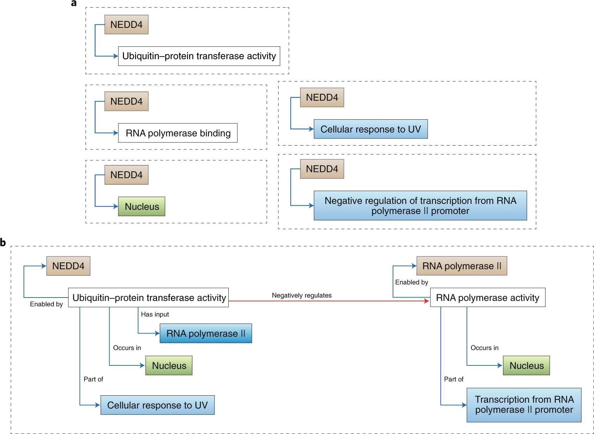
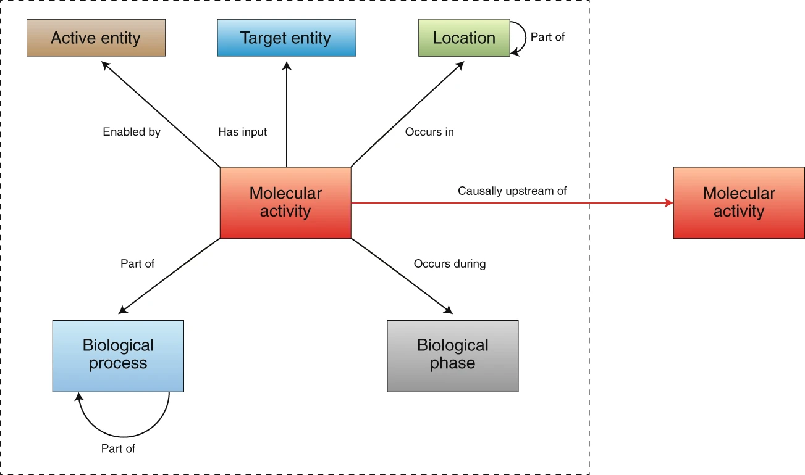
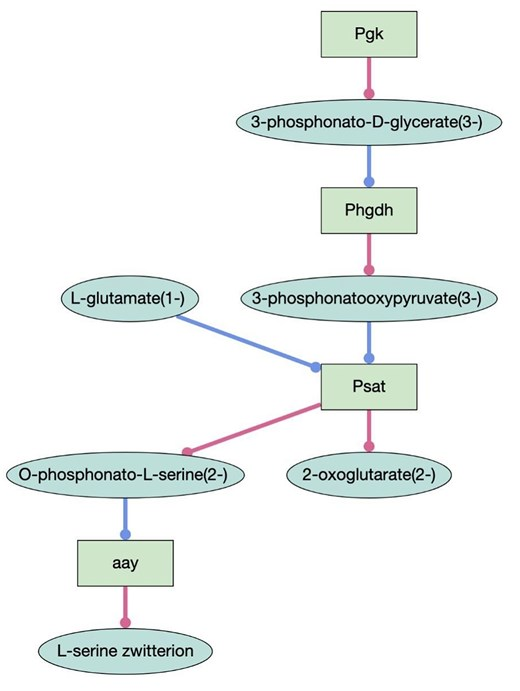
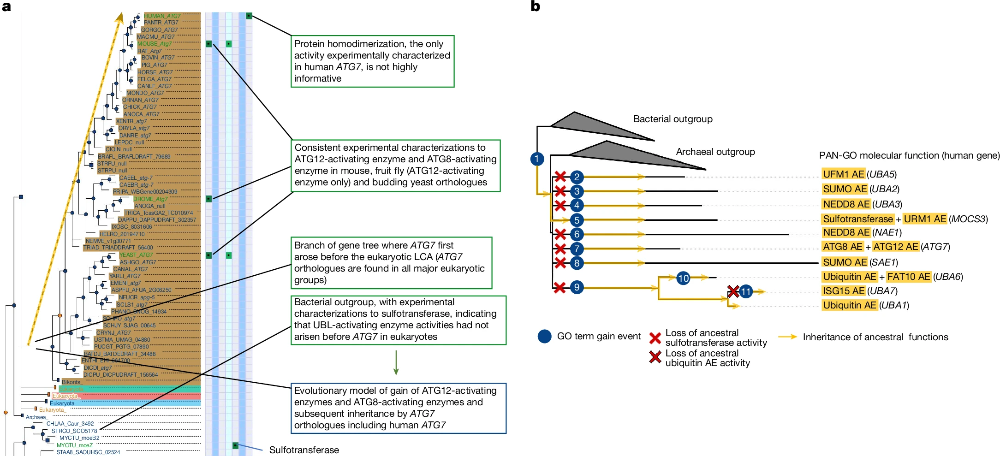

## Overview

* [Gene Ontology (GO)](#go)
* [GO Overrepresentation Analysis](#gora)
* [Gene-Set Enrichment Analysis](#gsea)
* [GO Causal Activity Modeling](#gocam) 


## Gene Ontology {#go}

::: {.callout-note appearance="simple"}
The Gene Ontology (GO) is being developed with the goal of providing a set of 
structured vocabularies for the annotation of genes and their products. 
Since the publication of the original paper in *Nature Genetics* in 2000[^1], 
GO has become one of the most widely used and mature bio-ontologies, although it is still very much a work in progress.
:::

{fig-align="center" width="25%"}


[^1]: Ashburner M, et al (2000) Gene ontology: tool for the unification of biology. The Gene Ontology Consortium. Nat Genet. 25(1):25-9

## Why do we need GO?

* **Exponential increase in biological data** $\longmapsto$ need for databases with appropriate representation techniques.
* **Lag in functional description** $\longmapsto$ progress in how biologists describe functions has not kept pace with large-scale sequencing. Need for efficient procedures for preliminary annotation.
* **Divergent Nomenclature** $\longmapsto$ names for genes and functions vary widely between databases, making cross-species comparison difficult.
* **Primary Uses:**
    * Overrepresentation analysis/Pathway analysis of high-throughput data
    * Data mining from PubMed etc.
    * Database integration

## GO: A Structured Hierarchy

{fig-align="center" width="30%"}


## DNA Ligation: GO:0006266

The following represents the lineage of the term **DNA ligase (ATP) activity** (GO:0003910):

{fig-align="center" width="30%"}


## DAG: Directed Acyclic Graph

{fig-align="center" height="300px"}

* Gene Ontology is a directed acyclic graph (DAG)
    (A) Tree
    (B) A graph with directed edges and no cycles
    (C) A graph with directed edges and a cycle

## QuickGO: DAG

::: {layout-ncol=1}
{fig-align="center" height="300px"}
:::

::: {.aside}
Source: [https://www.ebi.ac.uk/QuickGO/term/GO:0003678](https://www.ebi.ac.uk/QuickGO/term/GO:0003678)
:::

## Tree

* Simpler data structure without multiple parentage
* e.g. EC: Enzyme commision definitions of enzyme classes, subclasses and sub-subclasses

::: {layout-ncol=1}
{fig-align="center" height="300px"}
:::

# Function?
The term function is sometimes used in a rather vague way..

* biochemical activity
* biological goals
* subcellular localization
 

::: {layout-ncol=1}
{fig-align="center" height="300px"}
:::

## GO: Biological Process

* **Definition:** The biological objective to which the gene or gene product contributes.
* **Composition:** A process is accomplished by one or more assemblies of molecular functions.
* **Characteristics:** These processes often involve chemical or physical transformations.
* **Examples:**
    * **High Level:** "Signal Transduction", "Cell Growth and Maintenance"
    * **Lower Level:** "Pyrimidine Metabolism", "cAMP Biosynthesis"

::: {.notes}
A biological process is a series of events accomplished by one or more ordered assemblies of molecular functions. It is not equivalent to a pathway, though it is often used to describe them.
:::

::: {layout-ncol=1}
{fig-align="center" width="300px"}

figure credit: EMBL-EBI
:::

## GO: Molecular Function

* **Definition:** The biochemical activity of a gene product (the specific "job").
* **The "What":** Describes **what** is done, rather than why, where, or when.
* **Examples:**
    * **High Level:** "Enzyme", "Transporter"
    * **Lower Level:** "Adenylate Cyclase", "Toll Receptor Ligand"

::: {.callout-tip title="GO Molecular function"}
Molecular functions generally correspond to the individual steps in a biological process (like the activity of a single protein within a metabolic pathway).
:::


::: {layout-ncol=1}
{fig-align="center" width="300px"}

figure credit: EMBL-EBI
:::

## GO: Cellular Component

* **Definition:** The place in the cell where a gene product is active.
* **Specific Locations:**
    * Example: "Nuclear membrane"
* **Multi-protein Complexes:** Can also refer to stable entities made up of multiple gene products.
    * Examples: "Ribosome", "Proteasome"

::: {.callout-note}
A cellular component is not just a "where"—it can be a functional structure like a protein complex that acts as a unit.
:::

::: {layout-ncol=1}
{fig-align="center" width="300px"}

figure credit: EMBL-EBI
:::

## GO Terms: The Anatomy of an Entry

::: {.callout-important appearance="minimal"}
Each entry (*term*) in the Gene Ontology contains these standardized metadata fields to ensure consistency across different databases.
:::

<div style="font-size: 1.8em;">
```text
[Term]
id: GO:0003678
name: DNA helicase activity
namespace: molecular_function
alt_id: GO:0003679
alt_id: GO:0004003
def: "Unwinding of a DNA helix, driven by ATP hydrolysis." [GOC:jl]
synonym: "ATP-dependent DNA helicase activity" EXACT []
xref: EC:3.6.4.12
xref: Reactome:R-HSA-5693589 "D-loop dissociation and strand annealing"
is_a: GO:0004386 ! helicase activity
is_a: GO:0008094 ! ATP-dependent activity, acting on DNA
property_value: skos:exactMatch EC:3.6.4.12
```
</div>

## GO Annotations

::: {layout-ncol=1}
{fig-align="center" height="550px"}
:::

::: {.aside}
Source: [https://current.geneontology.org/products/pages/downloads.html](https://current.geneontology.org/products/pages/downloads.html)
:::

## GO Annotations

* **Gene Association Files (GAFs):** Collaborating databases (like FlyBase, MGI, or UniProt) prepare and maintain these files.
* **Cardinality ($0$ to $n$):**
    * A gene product may have **zero** entries if its function is entirely unknown.
    * A single gene product often has **multiple entries** across the three domains (Cellular Component, Molecular Function, and Biological Process).
* **Granularity:** One protein can be localized to the nucleus *and* the cytoplasm, while acting as both a transcription factor *and* a dimerizing agent.

::: {.callout-note}
### The "Annotation" vs. "Term"
Remember: A **Term** is a definition in the ontology. An **Annotation** is the link between a specific gene and that term.
:::

## GO Annotations

* **Gene Association Files (GAFs):** Collaborating databases prepare and maintain these files to link genes to terms.
* **Cardinality ($0$ to $n$):**
    * A gene product may have **zero** entries if nothing is known about it.
    * One gene product often has **multiple entries** covering its Cellular Component, Molecular Function, and Biological Process.

## Example: Deoxyribonuclease II

An annotation record typically includes:

| Field | Value | Description |
| :--- | :--- | :--- |
| **Accession** | `O00115` | Unique protein identifier |
| **DB Name** | `DRN2_HUMAN` | Standardized database symbol |
| **GO ID** | `GO:0003677` | The GO term assigned (DNA binding) |
| **Evidence** | `TAS` | **Traceable Author Statement** |

::: {.callout-note}
### Metadata
Records also include synonyms, PubMed IDs, Taxon (species), and the date the annotation was last updated (biocuration date).
:::

## GO Evidence Codes

How do we know that a gene product has a certain function?

<div style="font-size: 0.8em;">
### 1. Manually Curated (Experimental)
* **IDA:** Inferred from Direct Assay ("Gold Standard")
* **IMP:** Inferred from Mutant Phenotype
* **IGI:** Inferred from Genetic Interaction

### 2. Manually Curated (Non-Experimental)
* **TAS:** Traceable Author Statement (Found in a peer-reviewed paper)
* **NAS:** Non-traceable Author Statement

### 3. Automated (Computational)
* **IEA:** Inferred from Electronic Annotation (The most common type)
* **ISO:** Inferred from Sequence Orthology
</div>

::: {.callout-warning}
### Caution
Many high-throughput analyses filter out **IEA** codes because they are automated and tend to have a higher false-positive rate as compared to experimental data.
:::


## GO: Overrepresentation Analysis {#gora}

:::: {.columns}
::: {.column width=60%}

::: {.callout-tip icon=false}
### The Situation
We have performed a high-throughput experiment (e.g., RNA-seq) and identified a list of differentially expressed genes. What are the **salient characteristics** of the genes in this list?
:::

- RNA-seq experiments can be processed to yield a list of genes that are differentially expressed between two conditions (e.g., disease and control)
- The goal of GO analysis is to get a global picture of the biological attributes of these genes

::: {.small-text}
For background on RNA-seq analysis, see 
- Conesa A, et al. (2016) [A survey of best practices for RNA-seq data analysis. *Genome Biol* **17**:13](https://pubmed.ncbi.nlm.nih.gov/26813401/)
:::


:::
::: {.column width=30%}
```{python}
#| echo: false
#| fig-align: center
import sys
import matplotlib.pyplot as plt
sys.path.append('utils') 
from ontology_plots import analysis_path
analysis_path(figsize=(2.5, 6))
plt.show()
``` 

:::
::::


## Counting


::: {.callout-tip icon=false}
### Keep it simple stupid?
- Why not just rank the GO terms according to counts?
:::

- Common things are common
- For instance, *extracellular exosome* is annotated to 1801 genes in the human genome
- On the other hand, *lipoxin B4 metabolic process* is annotated to only 2 genes

::: {.callout-tip icon=false}
### Basic assumption
- The basic assumption of GO analysis is that if **more genes annotated to some GO term are differentially expressed than expected by chance**, then the GO term is somehow related to the biology of the RNA-seq experiment.
:::


* But what does **more often than we would expect by random chance?** mean in this context?


## The Binomial Coefficient (review)

:::: {.columns}
:::{.column width=70%}
```{python}
#| echo: false
#| fig-align: center
import sys
import matplotlib.pyplot as plt
sys.path.append('utils') 
from ontology_plots import binomial_explanation
binomial_explanation(figsize=(8, 6.5))
plt.show()
``` 
:::
::: {.column width=30%}
::: {.small-text}

::: {.callout-note}
$\binom{n}{k}$: read "N choose k" ("N über k")
:::

- To calculate the number of unique ways to arrange $k$ "heads" and $n-k$ "tails," we must account for redundant rearrangements:

* **Total Permutations:** There are $n!$ ways to rearrange $n$ distinct objects.
* **Redundancy Correction:** Exchanging the positions of two "heads" does not change the observable sequence. 
    - There are $k!$ ways to reorder the "heads" without chainging the overall sequence.
    - Similarly, there are $(n-k)!$ ways to reorder the "tails" without changing the sequence.
* **The Formula:** To find the number of *distinct* orderings, we divide the total by the redundancies:
$$
\binom{n}{k} = \dfrac{n!}{(n-k)! k!}
$$ {#eq-binomial-coefficient}

::: {.callout-note}
This value $\binom{n}{k}$, represents the number of different ways of choosing $k$ items from a set of $n$ items where the order of selection does not matter.
:::

:::
:::
::::


## Binomial Distribution (review)

* The binomial distribution models the probability of exactly $k$ successes (e.g., "heads") in $n$ trials of a boolean experiment, with the probability of success in a single trial being $p$.
* The probability of a particular order of trials with $k$ successes and $n-k$ failures is obtained by multiplying the probabilities of the individual trials;
$$
p^k(1-p)^{n-k}
$$
* We have seen in the previous slide that there are ${N\choose k}$ orderings of outcomes (heads and tails) that yield exactly $k$ successes
* The probability mass function of the binomial is therefore
$$
P(X=k) = \underbrace{{N\choose k}}_{\# \text{ways of choosing } k \text{ successes from } n \text{ trials}}\times\underbrace{p^k(1-p)^{n-k}}_{\text{probability of one such trial}}
$$ {#eq-binomial-pmf}


# Binomial Distribution (review)

For instance:

A) the probability of $k=1,\ldots,10$ "heads" in ten coin tosses using a fair coin ($p=0.5$). 
B) Probability of $k=1,\ldots,10$ "heads" in ten coin tosses using a biased coin ($p=0.1$).

```{python}
#| echo: false
#| fig-align: center
import numpy as np
import matplotlib.pyplot as plt
from scipy.stats import binom

# Parameters
n = 10
k_values = np.arange(0, 11)  # Including 0 to 10 for completeness

# Probabilities for fair coin (p=0.5) and biased coin (p=0.1)
probs_fair = binom.pmf(k_values, n, 0.5)
probs_biased = binom.pmf(k_values, n, 0.1)

# Create Plot
fig, (ax1, ax2) = plt.subplots(1, 2, figsize=(12, 5))

# Plot A: Fair Coin
ax1.bar(k_values, probs_fair, color='skyblue', edgecolor='black', alpha=0.7)
ax1.set_title('A) Fair Coin (p=0.5)')
ax1.set_xlabel('Number of successes (k)')
ax1.set_ylabel('Probability')
ax1.set_xticks(k_values)
ax1.grid(axis='y', linestyle='--', alpha=0.7)

# Plot B: Biased Coin
ax2.bar(k_values, probs_biased, color='salmon', edgecolor='black', alpha=0.7)
ax2.set_title('B) Biased Coin (p=0.1)')
ax2.set_xlabel('Number of successes (k)')
ax2.set_ylabel('Probability')
ax2.set_xticks(k_values)
ax2.grid(axis='y', linestyle='--', alpha=0.7)

plt.tight_layout()
plt.show()
```


## Binomial Test (review)

::: {.callout-note icon=false}
**How do we go from the binomial distribution to a statistical test?**

- The key idea is to regard the binomial as the null distribution and to ask if an observed distribution is unusual given this null.
:::

- If we are interested in testing whether the number of heads is more than we would expect by chance, we can formulate the null and alternative hypetheses as follows
- Let $p$ be the expected probability of an outcome such as heads
- The null hypothesis ($H_0$) is that the true likelihood of heads is not more than $p$, and the **alternative hypothesis** is that the true likelihood of heads *is* more than $p$
$$
\begin{align}
H_0: \pi_{s} &\leq p \\
H_a :\pi_s &> p
\end{align}
$$


 
# Binomial Test (review)

- So assume we have flipped a coin 30 times and we observe 25 heads
- We suspect the coin may not be fair and decide to do a test
- We collect all outcomes that are as extreme or more so than
the observed one to be part of the rejection class. 

$$
\begin{align}
p(k \geq k^{'},n,p) &= \sum_{k=k^{'}}^{N}\binom{n}{k} 
p^k\left(1-p\right)^{n-k} \\
\end{align}
$$ {#eq-dbinomial}

- In our example, we have $p(k\geq 25,n=30, p=0.5) = \sum_{k=25}^{30}\binom{n}{k}\tfrac{1}{2}^n$
- In R, this is 
```R
> dbinom(25,30,0.5)
[1] 0.0001327191
```


 
# Binomial Test

- It is also common to represent the region of probability graphically
- In this example, we have  $n = 250$, $p = 0.06$, and $k = 30$


```{python}
#| echo: false
#| fig-align: center
import sys
import matplotlib.pyplot as plt
sys.path.append('utils') 
from ontology_plots import plot_binom
plot_binom()
plt.show()
``` 

- The observed value for $k$ of 30 lies outside of the range containing 95% of the probability mass, and we reject the null hypothesis that the true probability of success is not more than $p=0.06$. 
- The $p$-value for this observation can be calculated by @eq-dbinomial to be $1.68\times 10^{-8}$.

## Question {.center background-color="#ffe1f5"}

{width=60%}

**Before we continue:** If we apply the binomial test to Gene Ontology overrepresentation analysis, what are $n$, $k$, and $p$?

## $n$, $k$, and $p$

:::: {.columns}
::: {.column width=60%}

```{python}
#| echo: false
#| fig-align: center
import sys
import matplotlib.pyplot as plt
sys.path.append('utils') 
from ontology_plots import gora_shapes
gora_shapes()
plt.show()
``` 
:::
::: {.column width=40%}
::: {.text-small}
-  $N$: "all" genes, for instance
    - All genes in the genome
    - All protein-coding genes in the genome
    - All measured genes
- $K$: All genes annotation to the GO term being evaluated
- $n$: Differentially expressed genes
- $k$: Differentially expressed genes that are also annotated to the GO term
- If the GO term has nothing to do with the differential expression, than our null hypothesis is that the proportion of genes in the differentially expressed set if $\tfrac{K}{N}$
- So we are asking if $k$ is more than we would expect by chance given the number of genes $n$ (our sample) and the probability $p=\tfrac{K}{N}$
- $\mathrm{dbinom}(k,n,\tfrac{K}{N})$
:::
:::
::::


## Question {.center background-color="#ffe1f5"}

{width=60%}

**Before we continue:** Why is the binomial test not quite correct to perform GO overrepresentation analysis?


## Binomial vs hypergeometric distribution

:::: {.columns}
::: {.column width=70%}

```{python}
#| echo: false
#| fig-align: center
import sys
import matplotlib.pyplot as plt
sys.path.append('utils') 
from ontology_plots import hyperg_vs_binom
hyperg_vs_binom(figsize=(7, 6))
plt.show()
``` 
:::
::: {.column width=30%}
::: {.text-small}
-  the binomial distribution
is based on the assumption that the individual trials are independent
of one another ($p$ never changes)
- If the initial probability of removing a black ball from an urn is $\tfrac{6}{12}$, the probability changes after we remove the first ball
- If a coin has a probability of heads of $\tfrac{1}{2}$, this probability is unchanged with each flip
- This corresponds to sampling **without replacement** and sampling **with replacement**
:::
:::
::::


# GO Overrepresentation with the hypergeometric distribution


- GO annotations can be naturally modeled as an urn with $m$ balls, where $m$ is the total count of genes
- $n$ of these genes are differentially expressed
- $m_t$ of the $m$ genes are annotated to GO term $t$, so the probability that any given gene is annotated to $t$ is $\tfrac{m_t}{m}$
- Thus, by chance we expect $n \times \tfrac{m_t}{m}$ genes to be annotated to $t$
- We model this by removing genes from an urn: annotated genes are black, unannotated genes are white. After each ball is removed, the probability of drawing a black ball on the next draw changes — so the binomial distribution is not appropriate; we need the **hypergeometric distribution** instead


## GO Overrepresentation with the Hypergeometric Distribution

The statistical analysis counts up all the ways of getting $k$ genes annotated to $t$ and $n-k$ remaining genes not annotated to $t$, and compares this number to the number of all possible outcomes.


- Let $m$ be the number of genes on the microarray chip.
  - $m_t$ be the number of these genes that are annotated to GO term $t$.
  - $n$ be the number of DE genes (the study set).
  - $k$ be the number of DE genes that are annotated to $t$.
- We have:
$$
P(k\mid n,m,m_t) = \dfrac{\binom{m_t}{k}\binom{m-m_t}{n-k}}{\binom{m}{n}}
$$ {#eq-hypergeometric}

- Numerator: $\binom{m_t}{k}\binom{m-m_t}{n-k}$: The number of ways to choose exactly $k$ annotated genes AND $n-k$ non-annotated genes.
- Denominator: $\binom{m}{n}$: The total number of ways to choose any $n$ genes from the population $m$.

# Hypergeometric Distribution: intuition

- We can understand @eq-hypergeometric as follows

$$
\begin{align}
P(k\mid n,m,m_t) &= \dfrac{\binom{m_t}{k}\binom{m-m_t}{n-k}}{\binom{m}{n}} \\
&=\dfrac{\text{\# ways to choose } k \text{ annotated and } (n-k)\text{ non-annotated genes }}{\text{\# ways to choose } n \text{ genes }} \\
\end{align}
$$ 

- This is the probability of seeing *exactly* $k$ annotated genes in the differentially expressed set.


# GORA with the Hypergeometric Distribution: Recap
$$
p(k,n,m,m_t) = \dfrac{\binom{m_t}{k}\binom{m-m_t}{n-k}}{\binom{m}{n}}
$$ 

- Ways to choose annotated genes: There are $\binom{m_t}{k}$ ways of choosing $k$ genes annotated to $t$.
- Ways to choose non-annotated genes: There are $\binom{m-m_t}{n-k}$ ways of choosing the remaining $n-k$ genes that are not annotated to $t$.
- Combined combinations: In total, there are $\binom{m_t}{k}\binom{m-m_t}{n-k}$ ways of choosing the genes in the study set such that $k$ are annotated to $t$ and $n-k$ are not.
- Total possible outcomes: There are $\binom{m}{n}$ total ways of choosing a study set with $n$ genes from the population of $m$ genes with arbitrary annotations.


## GO Overrepresentation with the Fisher's Exact Test

@eq-hypergeometric is known as the `hypergeometric distribution`.

- Analogously to the situation with the binomial distribution, we need to calculate the probability of observing some number $k$ or more genes annotated to $t$ in order to have a statistical test
- The sum over the tail of the hypergeometric distribution is known as the `Fisher Exact Test`:

$$
P(X \geq k) = \sum_{i=k}^{\min(n,\, m_t)} \dfrac{\binom{m_t}{i}\binom{m-m_t}{n-i}}{\binom{m}{n}}
$$ {#eq-fet}

- Here, $X$ is the (random) number of study-set genes annotated to $t$; $n$ is the total count of differentially expressed genes; $m_t$ is the count of genes in the population annotated to GO term $t$

## Question {.center background-color="#ffe1f5"}

{width=30%}

$$
P(X \geq k) = \sum_{i=k}^{\min(n,\, m_t)} \dfrac{\binom{m_t}{i}\binom{m-m_t}{n-i}}{\binom{m}{n}}
$$

- With the binomial test, we summed up to $n$ (the total number of trials)
- Here, we sum up to $\min(n, m_t)$ — why?

## Answer

$$
P(X \geq k) = \sum_{i=k}^{\min(n,\, m_t)} \dfrac{\binom{m_t}{i}\binom{m-m_t}{n-i}}{\binom{m}{n}}
$$

- It is impossible to draw more annotated genes than the size of the study set itself ($n$)
- It is impossible to draw more annotated genes than exist in the population annotated to term $t$ ($m_t$)
- So the maximum possible value of $k$ is whichever of these two is *smaller* — hence $\min(n, m_t)$.


## Term-for-Term
::: {.callout-note icon=false}
The actual testing procedure for the most basic kind of GO analysis involves performing one statistical test for each GO term that is represented in the dataset of interest (usually this means we are performing thousands of tests)
:::

For each tested GO term, we have:

- Null Hypothesis ($H_0$): there is no positive association between genes annotated to the term $t$ and the study set; that is, there is no overrepresentation of term $t$.
- Alternative Hypothesis ($H_1$): There is overrepresentation of the term.
- The null hypothesis
corresponds to the probability of observing a test statistic that is at least as
extreme as the one that was observed given that the null hypothesis is true.
- Therefore, the null hypothesis corresponding to a one-sided test is rejected if the probability of observing $n_t$ \textit{or more} genes annotated to term $t$ in the study set by chance is less than $\alpha$ 
- By convention, $\alpha$ is usually set to 0.05


  This is given by:

$$
  P(X_t\geq n_t|H_0) = \sum_{k=n_t}^{\min(m_t,n)} 
 \frac{\displaystyle{m_t \choose k}\displaystyle{{m - m_t} 
 \choose {n - k}}}{\displaystyle{m \choose n}}.
$$

##  Interpretation of [significant]{style="color: green; font-weight: bold;"} GO terms

* if $P(X_t\geq n_t|H_0) < \alpha$, the null hypothesis is rejected, and we declare the term $t$ to be \textit{significantly overrepresented} in the study set.
* The biological interpretation of significant overrepresentation is usually taken to be that the term
$t$ represents an important biological characteristic of the study
set.

## Example
* Suppose that there is a population set of $m=18$ genes, of which $m_t=4$ genes are annotated to the term $t$.
* The outcome of an experiment conducted on all 18 genes of the population yields a set  of 5 genes. This means that the study set consists of $n=5$  genes.
* Moreover, we observe that a total of $n_t=3$ genes from the  genes of the study set are annotated to term  $t$ 


  We would now like to analyze whether term $t$ is significantly
  overrepresented in the study set and thus can be interpreted to
  represent an important result of the experiment:
  
$$
P(X_t\geq 3|H_0) = \frac{\displaystyle{5 \choose 3}\displaystyle{{13} \choose {2}}}{\displaystyle{18 
\choose 5}} + \frac{\displaystyle{5 \choose 4}\displaystyle{{13} \choose {1}}}{\displaystyle{18 
\choose 5}}
   = 0.044.
$$
- Since $P(X_t\geq 3|H_0)=0.044<0.05=\alpha$, the null-hypotheses is
rejected and the term may be interpreted as being characteristic of
the experiment.

## Multiple testing correction

{fig-align="center" width="100%"}

## Multiple testing correction

:::: {.columns}
::: {.column width="30%"}

{fig-align="center" width="100%"}

:::

::: {.column width="5%"}
:::
::: {.column width="60%"}

- multiple testing problem occurs when many statistical tests are performed on the same dataset. 
- Each test has its own chance of a Type I error (false positive)
- The overall probability of making at least one false positive increases as the number of tests grows.
- If m independent comparisons are performed, the family-wise error rate (FWER), is given by
$$
\bar {\alpha }=1-\left(1-\alpha _{\{{\text{per comparison}}\}}\right)^{m}
$$
- The Bonferroni correction sets $\alpha _{\mathrm {\{per\ comparison\}} }=\frac{\alpha }{m}$
- We will not go into detail in this course; there are many other MTC procedures

::: {.small-text}
More background: Noble WS (2009) [How does multiple testing correction work? *Nat Biotechnol* **27**:1135-7](https://pubmed.ncbi.nlm.nih.gov/20010596/)
:::

:::
::::

## Ontologizer

{fig-align="center" width="85%"}

- [HOMEWORK]{.hw-badge} You will process a dataset with the Ontologizer to gain intuition about GO TfT analysis.

## Gene set enrichment analysis {#gsea}

- Drawbacks of GO Overrepresentation Analysis (GOOA)
    - After correcting for multiple hypotheses testing, no individual gene may meet the threshold for statistical significance, because the relevant biological differences are modest relative to the noise inherent to the microarray technology.
    - The threshold for signicance is arbitrary. What about genes with p=0.051? Maybe they would become significant if we did more repetitions in our RNA-seq experiment

-  Gene Set Enrichment Analysis (GSEA):
    - Do not divide genes into study (differentially expressed) and population (all genes)
    - Instead, rank genes according to degree of expression or differential expression
    - Determine whether members of a gene set *S* tend to occur toward the top (or bottom) of the list **L**
    - In this case the gene set is correlated with the phenotypic class distinction.

::: {.tiny-credit}
Subramanian A, et al. (2005) [Gene set enrichment analysis: a knowledge-based approach for interpreting genome-wide expression profiles. 
Proc Natl Acad Sci U S A. **102**:15545-50](https://pubmed.ncbi.nlm.nih.gov/16199517/)
:::


## GSEA: concepts

* GSEA considers experiments with genomewide expression profiles from samples belonging to two classes, labeled 1 or 2. 
* Genes are ranked based on the correlation between their expression and the class distinction by using any suitable metric
* Concretely, class 1 can be _Annotated to GO term_ **t** and class 2 _Not annotated to_ **t**

{fig-align="center" width="100%"}

## GSEA: Enrichment Score

- The enrichment score (ES) that reflects the degree to which a set *S* is overrepresented at the extremes (top or bottom) of the entire ranked list **L**. 
- The score is calculated by walking down the list L, increasing a running-sum statistic when we encounter a gene in S and decreasing it when we encounter genes not in S. 
- The magnitude of the increment depends on the correlation of the gene with the phenotype. 
- The enrichment score is the maximum deviation from zero encountered in the random walk; it corresponds to a weighted Kolmogorov–Smirnov-like statistic

{fig-align="center" width="50%"}

## GSEA: Enrichment score setup


- `Input`: A ranked list of *N* genes, ordered by some gene-level statistic 

  - correlation with phenotype
  - differential expression
  - a t statistic
- The most differentially expressed genes are placed at the top of the list, the least differential at the bottom.

The original GSEA implementation had a type of signal to noise ratio (Difference of class means divided by sum of class standard deviations. This is essentially a variance-stabilized fold-change)

$$
r_j = \frac{\mu_{j,A} - \mu_{j,B}}{\sigma_{j,A} + \sigma_{j,B}}
$$

- Favors genes with a large, *consistent* (low-variance) difference between groups over genes with a large but noisy difference.
- Similar in intent to a t-test, which most implementations use now


## GSEA: Running Sum

The running-sum construction
- Walk down the ranked list from position $j=1,\ldots,N$
- At each step, maintain two running sums:

$$
P_{hit}(S,i) = \sum_{\substack{j \le i \\ g_j \in S}} \dfrac{|r_j|^p}{N_R}
\quad\quad \bullet N_R = \sum_{g_j\in S}|r_j|^p
$$ {#eq-gsea-hit}

- The `hit` term of @eq-gsea-hit increases whenever it encounters a gene that belongs to 
$S$, weighted by the magnitude of its ranking statistic $r_j$

and

$$
P_{miss}(S,i) = \sum_{\substack{j \le i \\ g_j \notin S}}\dfrac{1}{N-N_R}
$$

- The `miss` term increases whenever it encounters a gene not in *S*, with a uniform step size.

- Both are normalized so each is a proper empirical CDF: they start at 0, and $P_{hit}(S,N) = P_{miss}(S,N) = 1$.

## GSEA: Running Sum

```{python}
#| echo: false
#| fig-align: center
import sys
import matplotlib.pyplot as plt

sys.path.append('utils') 
from ontology_plots import plot_gsea

plot_gsea(figsize=(6,4))
plt.plot()
```

- The enrichment score is the maximum deviation from zero encountered in the random walk
- $D = ES(S) = 0.699$ at rank 64
- Leading-edge subset size: 16 of 20 gene-set members


# The enrichment score

The enrichment score is the maximum deviation between these two running sums as you sweep across the whole list:

$$
ES(S) = \max_i [P_{hit}(S,i) - P_{miss}(S,i)]
$$ {#eq-enrichment-score}

- If we are intested in negative deviations (bottom of the list), then we would track the signed max 
(whichever of the maximum positive or maximum negative deviation is larger in absolute value).

## Kolmogorov–Smirnov

- [HOMEWORK]{.hw-badge} We will review the Kolmogorov–Smirnov (KS) test in the homework.
- GSEA is "KS-like" but not exactly a KS-test
- The classical two-sample KS test statistic is

$$
D = \sup_x |CDF_1(x) - CDF_2(x)|
$$ {#eq-kstest}

- The is, the KS statistic is the largest vertical gap between two empirical cumulative distribution functions.
- GSEA is also the largest gap between two step functions, but there are three key differences
  1. GSEA takes weighted  (not uniform) steps. The hit function's step size at gene $j$ is proportional to 
$∣𝑟_j|^p$ (genes that are more correlated with the phenotype contribute larger jumps when they appear.)
    2. Signed max (GSEA), not absolute max (KS).
    3.  Discrete, rank-based domain. The distribution being compared isn't over a continuous variable (as with KS),
     it's over discrete positions in a fixed permutation (the gene rank order), so $P_{hit}$ and $P_{miss}$ are step functions over ${1,\ldots, N}$ rather
     than continuous functions over $\mathbb{R}$


## Estimation of Significance Level of ES

- The calculation of the p-value in the KS test is .is computed from a known asymptotic distribution (the Kolmogorov distribution), either via an exact formula for small n or asymptotically for large n.
- GSEA has no such closed-form null
- In GSEA, the p-value is estimated empirically using permutations
- permuting phenotype labels changes the ranked gene list itself
- If the actual GSEA statistic is higher than all but 2 of 10,000 permutations, then the p value is calculated as 
$$
p=\frac{b+1}{m+1} = \frac{2+1}{10000+1} \approx 3\times 10^{-4} 
$$

- Specifically, we permute the phenotype labels and recompute the ES of the gene set for the permuted data, which generates a null distribution for the ES. 
- The empirical, nominal P value of the observed ES is then calculated relative to this null distribution.
- The adjustment for multiple testing is essentially the same as with GO Overrepresentation Analysis

::: {.small-text}
Skipping some details in the original publication
:::

## GSEA: Examples

{fig-align="center" width="100%"}

- S1 is significantly enriched and scores highly
- S2 is randomly distributed and scores poorly
- S3 is not enriched at the top of the list but is nonrandom, so it scores well (but somewhat difficult to interpret biologically)

::: {.tiny-credit}
Sources:

- Subramanian A, et al. (2005) Gene set enrichment analysis: a knowledge-based approach for interpreting genome-wide expression profiles. Proc Natl Acad Sci U S A. **102**:15545-50 PMID: 16199517.
- Mootha VK, et al. (2003) PGC-1alpha-responsive genes involved in oxidative phosphorylation are coordinately downregulated in human diabetes. Nat Genet. **34**:267-73.  PMID:12808457.
:::


## Gene Ontology Causal Activity Modeling (GO-CAM) {#gocam}
::: {.mybox}
**GO-CAM**:

- GO-CAM, a structured framework for linking multiple GO annotations into an integrated model of a biological system.
:::

- The development of the GO has always been tightly coupled to its use in describing the functions of genes across a wide variety of organisms.
- However, biology is better understood as a collection of coupled pathways rather than a set of individual annotations

## GO: Traditional Annotation Modeling



- A standard GO annotation is a gene product associated to a GO term, using an evidence code and a supporting reference (a primary research article, for example). 
- These are the annotations we were examining in the previous sections
- each GO annotation is necessarily a partial functional description, and there is no representation of how different annotations for the same gene fit together into a more complete description.

::: {.tiny-credit}
Image: https://geneontology.org/docs/gocam-overview/
:::

## GO-CAM models

:::: {.columns}
::: {.column width=70%}

{fig-align="center" width="100%"}

:::
::: {.column width=30%}

A GO-CAM model is a combination of standard GO annotations to produce a network of annotations (“model”) that is a more complete model of biological function than the separate annotations.

    - **a)**: set of disconnected GO annotations
- **b)**: GO-CAM model links together GO annotations into a structured model of NEDD4 functions
:::
::::

## Specification of the GO-CAM model
:::: {.columns}
::: {.column width=70%}

{fig-align="center" width="100%"} 

:::
::: {.column width=30%}

- a **molecular activity** (GO molecular function annotation) of a gene product occurs 
- in a **location** (GO cellular component annotation) 
- is part of a larger **biological program** (GO biological process annotation). 

- In GO-CAM, relations to terms from other ontologies can provide additional specificity: 
    - for location, a cellular component can be part of a specified cell type, 
    - which in turn can be part of a specified anatomical structure; 
    - an activity can occur during a specified temporal period (biological phase)
:::
::::


## GO-CAMs leverage other ontologies to specify biological activities

- The ontologies used to specificy entities shown in the above Figure include


::: {.small-text}

| GO-CAM element  | Ontology or identifier source(s) | Example |
|---|---|---|
| Molecular activity | GO molecular function | ubiquitin-protein transferase activity (GO:0004842) |
| Biological process | GO biological process | cellular response to UV (GO:0034644) |
| Location | GO cellular component | nucleus (GO:0005634) |
| | Cell Type Ontology (CL) | retinal cell (CL:0009004) |
| | anatomy ontologies, e.g. UBERON, *C. elegans* gross anatomy, EMAPA | eye (UBERON:0000970) |
| Active entity | Gene, protein, RNA or complex identifier from a standard source, e.g. HGNC for a human gene | NEDD4 (HGNC:7727) |
| Target entity | Same as active entity, or chemical from ChEBI | MAP2K1 (HGNC:6840) |
| Biological phase | GO biological phase (GO:0044848) | mitotic G1 phase (GO:0000080) |
| | Developmental phase ontology, e.g. Mouse Developmental Stage | Theiler stage 02 (MmusDv:0000005) |
| Relations | Relations Ontology | occurs in (BFO:0000066) |

:::

* For instance, to browse the UBERON ontology, use the [OLS site](https://www.ebi.ac.uk/ols4/ontologies/uberon)

## GO-CAM browser

* negative regulation of canonical Wnt signaling pathway

{fig-align="center" width="100%"} 

::: {.small-text}
[GOCAM Browser](https://go-cam-browser.geneontology.org/)
:::

::: {.tiny-credit}
Thomas PD, et al. (2019) [Gene Ontology Causal Activity Modeling (GO-CAM) moves beyond GO annotations to structured descriptions of biological functions and systems. *Nat Genet* **51**:1429-1433](https://pubmed.ncbi.nlm.nih.gov/31548717/)
:::

## PAN-GO

- Another fascinating resource is PAN-GO
- explicit evolutionary modelling was applied  to all human protein-coding genes
- into models that reconstruct the gain and loss of functional characteristics over evolutionary time
- This allowed additional GO annotations to be inferred, with the resulting set of 68,667 integrated gene functions cover approximately 82% of human protein-coding genes

{fig-align="center" width="70%"} 

::: {.tiny-credit}
Feuermann M, et al. (2025) [A compendium of human gene functions derived from evolutionary modelling. *Nature* **640**:146-154](https://pubmed.ncbi.nlm.nih.gov/40011791/)
:::

## Conclusion

- A major use case for bioontologies such as GO that are used to annotate biological domains (genes and gene products) is to visualize terms (biological concepts) that are overrepresented in experimental results
- We have examined two major algorithmic approaches:
    - GO Overrepresentation Analysis (Fisher Exact Test)
    - Gene-set Enrichment Analysis
- Both approaches typically require multiple testing correction because they perform hundreds or even thousands of individual tests
- New approaches such as GOCAM and PAN-GO are making GO modelling more sophisticated and providing more comprehensive functional annotations
- A foundation for understanding biology and developing bioinformatics algorithms and analysis pipelines.


## Sources

::: {.callout-important title="Suggested Reading" icon=false}
Gene Ontology Consortium (2026) [The Gene Ontology knowledgebase in 2026. *Nucleic Acids Res* **54**:D1779-D1792](https://pubmed.ncbi.nlm.nih.gov/41413728/)
:::
- Bauer S, et al. (2008) [Ontologizer 2.0--a multifunctional tool for GO term enrichment analysis and data exploration. *Bioinformatics* **24**:1650-1](https://pubmed.ncbi.nlm.nih.gov/18511468/) 
- Subramanian A, et al. (2005) [Gene set enrichment analysis: a knowledge-based approach for interpreting genome-wide expression profiles. Proc Natl Acad Sci U S A. **102**:15545-50](https://pubmed.ncbi.nlm.nih.gov/16199517/) 
- Mootha VK, et al. (2003) [PGC-1alpha-responsive genes involved in oxidative phosphorylation are coordinately downregulated in human diabetes. Nat Genet. **34**:267-73](https://pubmed.ncbi.nlm.nih.gov/12808457/)
- Thomas PD, et al. (2019) [Gene Ontology Causal Activity Modeling (GO-CAM) moves beyond GO annotations to structured descriptions of biological functions and systems. *Nat Genet* **51**:1429-1433](https://pubmed.ncbi.nlm.nih.gov/31548717/)
- Feuermann M, et al. (2025) [A compendium of human gene functions derived from evolutionary modelling. *Nature* **640**:146-154](https://pubmed.ncbi.nlm.nih.gov/40011791/)
