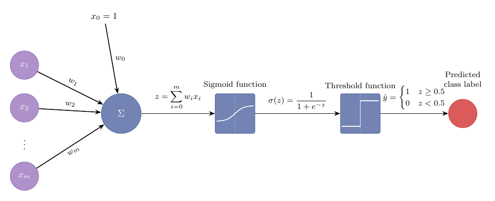
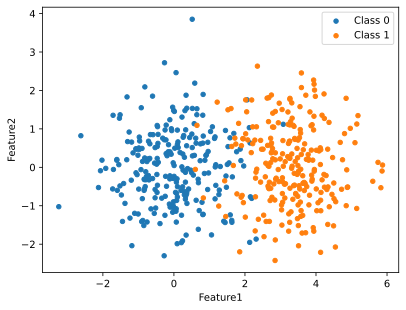

## Overview: Logistic regression 

::: {.callout-note title="Game plan"}
Logistic regression shares some characteristics with neural networks including 
the weighted sum and activation function (for single neurons) and gradient-descent 
training loop. Studying logistic regression therefore serves as 
a [good preparation for understanding neural networks]{style="color: green; font-weight: bold;"}. 
:::

:::: {.columns}

::: {.column width="48%"}
### [Part 1: Introduction](#part-1)
* Components of logistic regression
* Sentiment analysis
:::

::: {.column width="4%"}
:::

::: {.column width="48%" .dimmed}
### [Part 2: Sigmoid function](#part-2)
* Definition
* First derivative
:::

::::

:::: {.columns}

::: {.column width="48%" .dimmed}
### [Part 3: Gradient descent](#part-3)
* Learning
* Momentum & Adam
* Learning rates
:::

::: {.column width="4%"}
:::

::: {.column width="48%" .dimmed}
### [Part 4: Python](#part-4)
* Full implementation of ANN
* Classify handwritten digits
:::

::::

## Logistic Regression {#part-1}

Logistic Regression (LogReg) is one of the most common machine learning algorithms. It can be used to predict the probability of an event occurring based on a given labeled data set.

- Email analysis (Is an email spam or not?)
- Sentiment analysis (is a movie review positive or negative?)
- Medical diagnostics (is a given diagnosis present or absent?)

::: {.callout-note appearance="simple"}
We will go over the algorithm in detail, because it is an excellent preparation for understanding neural networks.
:::

{fig-align="center"}

## The five components of Logistic Regression

::: {.callout-note appearance="simple"}
### 1. Feature Representation
For each input $x$, we have a vector: $\mathbf{x} = [x_1, x_2, \ldots, x_n]$
:::

::: {.callout-tip appearance="simple"}
### 2. Classification Function
Computes the estimated class using the **Sigmoid function**: $\sigma(z) = \frac{1}{1 + e^{-z}}$
:::

::: {.callout-important appearance="simple"}
### 3. Objective Function
A **Loss function** (Cross-Entropy) to measure how well the model is performing ( cross-entropy loss function).
:::

::: {.callout-warning appearance="simple"}
### 4. Optimization
**Gradient Descent**: The method used to minimize the loss and find the best weights.
:::

::: {.callout-warning appearance="simple"}
### 5. Prediction
The **learned model** can be used to classify new data points.
:::

## LogReg: Features

For each input $x$, we create a vector of features: $\mathbf{x} = [x_1, x_2, \ldots, x_n]$.

#### There are many different ways of generating a feature vector


- Raw numerical data: If the input data is numerical with $n$ dimensions, each of the dimensions can act as a feature
- Polynomial & interaction features: We can add interaction terms ($x_ix_j$) or polynomial features (e.g., $x_i^7$) if this makes sense for the classification task
- Images: Flatten pixel values (e.g., an $8\times 8$ image would have 64 features)
- Text to vector: e.g.,  count word occurrences across a vocabulary
- Domain-specific feature engineering

::: {.callout-note appearance="simple" title="Example"}
In the Python exercise for this lecture, we will 
generate two dimensional points with overlapping Gaussian distributions, but in general, the 
features can also be created (e.g., by counting positive and negative words for sentiment analysis).
:::


## Weights and bias

::: {.callout-note appearance="simple" title="Weights"}
LogReg learns a vector of a vector of
weights and a bias term to solve the classification task
:::

- [Linear combination of input features]{style="color: green; font-weight: bold;"}
- Each data point is multiplied by weights and a bias is added
- Here, $x_{i,j}$ refers to the $j^{th}$ component of the $i^{th}$ data point.
$$
z_i = \sum_{j=1}^n w_ix_{i,j} + b
$${#eq-lrweights}

@eq-lrweights can be represented identically using dot product notation (where the bold font indicates a vector of weights ($\mathbf{w}$) and inputs ($\mathbf{x}$))


$$
z_i = \mathbf{w}\cdot \mathbf{x}_i + b
$$

This is identical to the sums we will see at individual neurons in neural networks

## Sigmoid {#part-2}

::: {.callout-note appearance="simple" title="Sigmoid function"}
To create a probability, we transform z through the sigmoid function, $\sigma(z)$
:::

- The sigmoid $\sigma(z)$ takes a real-valued number $z\in [-\infty, \infty]$ and effectively [squashes]{style="color: green; font-weight: bold;"} 
it to lie in the range $[0,1]$: $0<\sigma(z) < 1$.

$$
\sigma(z) = \frac{1}{1+e^{-z}} = \frac{1}{1+\exp(-z)}
$$

:::: {.columns}

::: {.column width="50%"}

- **Interpretation:** $P(y=1 | x, w, b)$, i.e., a probability for classification
- $\sigma(z) > 0.5 \Leftrightarrow z > 0$ 
- i.e., whenever $z = \mathrm{w}\cdot \mathrm{x} + b$ is over zero, the model predicts the positive class ($\hat{y}=1$).


:::
::: {.column width="50%"}
```{python}
#| echo: false
#| fig-width: 2
#| fig-height: 1.5
#| fig-align: center
import sys
import matplotlib.pyplot as plt

sys.path.append('utils') 
from logreg import sigmoid_plot
sigmoid_plot(figsize=(3,2))
plt.show()
``` 
:::
::::

## Sigmoid: A convenient identity

- $1−\sigma(x) = \sigma(−x)$

$$
\begin{eqnarray*}
1−\sigma(x) &=& 1- \frac{1}{1+e^{-x}}\\
&=& \frac{1+e^{-x} - 1}{1+e^{-x}} \\
&=& \frac{e^{-x}}{1+e^{-x}} \cdot \frac{e^{x}}{e^{x}}\\
&=& \frac{1}{1+e^{x}} \\
&=& \sigma(-x) \\
\end{eqnarray*}
$$


## Logit

- [Odds]{style="color: green; font-weight: bold;"}: The ratio of success to failure: $p / (1-p)$.
- [Logit]{style="color: green; font-weight: bold;"}: The natural logarithm of those odds (log odds): $\ln (\frac{p}{1-p})$.
- The logit is the inverse of the sigmoid function:
- $z=\sigma(\mathbf{w}\cdot\mathbf{x}+b)$ can be any real number $(-\infty, \infty)$
- $p\in [0, 1]$ represents a probability
- These functions are inverses of each other because $\sigma(\text{logit}(p)) = p$

## Proof

$$
$$\begin{eqnarray*}
\sigma(\text{logit}(p)) &=& \frac{1}{1 + e^{-\left[ \ln \left( \frac{p}{1-p} \right) \right]}} && \text{Substitute Logit into Sigmoid } z \\
&=&\frac{1}{1 + e^{\left[ \ln \left( \frac{1-p}{p} \right) \right]}} && \text{Apply } -\ln(A) = \ln(1/A) \\
&=&\frac{1}{1 + \frac{1-p}{p}} && \text{Identity: } e^{\ln(x)} = x \\
&=&\frac{1}{\frac{p + 1 - p}{p}}  \\
&=&\frac{1}{1/p} && \text{Simplify} \\
&=& p 
\end{eqnarray*}$$
$$

- [Therefore]{style="color: green; font-weight: bold;"} :The logit is the inverse of the sigmoid function.


## Learning a classification rule 

-  We need to learn the parameters of the model $\mathbf{w}$ and $b$:

$$
\begin{array}{c c c c c}
\mathbf{x}& \longrightarrow & \sigma(z)=\sigma(\mathbf{w}\cdot\mathbf{x}+b) & \longrightarrow & \hat{y}\\
\text{\small Input features} & & \text{\small Output probability} & & \text{\small Prediction of class label}
\end{array}
$$
- Prediction rule:
$$
\mathrm{classification}(x) = 
\begin{cases}
1 & \text{if }P(y = 1|x) > 0.5 \\
0 & \text{otherwise}
\end{cases}
$$


## Loss function
- A good model will minimize the difference between our prediction $\hat{y}$ and the ground truth $y$
- this distance is defined by the **loss function** (also known as the **cost function**).
- The same loss function is commonly used for logistic regression and  for neural networks, the **cross-entropy loss**.
- Recall that our classifier output is $\hat{y} = \sigma(\mathbf{w}\cdot\mathbf{x} + b)$

- For logistic regression with binary classification, $y$ can be either 0 or 1, but $\hat{y}$ is a probability that ranges from 0 to 1.
- We measure the difference with the loss function $\mathcal{L}(\hat{y}, y)$

## Loss function
- Consider the following piecewise loss function
$$
mathcal{L}(\sigma(z), y) = \begin{cases}
-\log \sigma(z) & \text{if } y_i = 1 \\
-\log 1- \sigma(z) & \text{if } y_i = 0 \\
\end{cases}
$$

As $log \sigma(z) \rightarrow 1$, the loss approaches zero

```{python}
#| echo: false
#| fig-width: 6
#| fig-height: 5
#| fig-align: center
import sys
import matplotlib.pyplot as plt

sys.path.append('utils') 
from logreg import plot_loss
plot_loss(figsize=(4,3))
plt.show()
``` 


## Loss function


- conditional maximum likelihood estimation: we choose the parameters w,b that maximize the log probability of the true y labels in the training data given the observations x. 
- The resulting loss function is the negative log likelihood loss, which is known as the **cross-entropy loss**

- The weights should maximize the probability of the correct label $p(y|x)$.
- It is convenient to write this as
$$
\log p(y|x) = \log[\hat{y}^y(1-\hat{y})^{1-y}] = y\log\hat{y} + (1-y)\log(1-\hat{y})
$$

- Note this simplifies to either $\log\hat{y}$ or $\log(1-\hat{y})$ depending on whether $y$ is 0 or 1.
- Since it is convenient to minimize the function, we multiply it by -1: The result is known as the cross-entropy loss

$$
\mathcal{L}_{CE}(\hat{y}, y)
= - y\log\hat{y} - (1-y)\log(1-\hat{y})
$$

- Since we have $\mathbf{\hat{y}} = \sigma(\mathbf{w}\cdot \mathbf{x} + b)$, this is equivalent to

$$
\mathcal{L}_{CE}(\hat{y}, y)
= - y\log\sigma(\mathbf{w}\cdot \mathbf{x} + b) - (1-y)\log(1-\sigma(\mathbf{w}\cdot \mathbf{x} + b))
$$


## Loss function (sanity check)

$$
\mathcal{L}_{CE}(\hat{y}, y)
= - y\log\sigma(\mathbf{Xw} + b) - (1-y)\log(1-\sigma(\mathbf{Xw} + b))
$$

- Note that if we predict (correctly) for a true example that $\hat{y}=1$, then the second term drops out and we have

$$
\mathcal{L}_{CE}(\hat{y}, y)
= - 1\log 1  = 0
$$

- Similar things apply for a correct prediction of a negative example as  $\hat{y}=0$
- The loss for one example ranges from 0 to infinity ($-\log 0$)

## Optimizing the loss

::: {.callout-note appearance="simple" title="Optimization Goal"}
To create a high-performing classifier, we minimize the **Cost Function** $J(\theta)$, which is the average loss over the entire training set of $m$ examples.
:::

- If we symbolize the parameters (weights, bias) of the logistic regression as $\theta$, our objective function is:

$$
J(\theta) = \frac{1}{m} \sum_{i=1}^{m} \mathcal{L}(\hat{y}^{(i)}, y^{(i)})
$$

- We seek $\hat{\theta}$, the parameters that minimize the loss

$$
\hat{\theta} = \arg\min_{\theta} J(\theta)
$$

- We can show that the logistic regression loss function is convex (which enables us to reliably find its minimum)
- Neural networks are not convex and gradient descent may not find the global minimum

##  Gradient descent {#part-3}

 
::: {.callout-note appearance="simple" title="Gradient"}
The gradient descent algorithm finds the gradient
of the loss function at the current point and moving in the opposite direction.
:::


Another commonly encountered notation is the __gradient__, which by convention is represented as a column vector

$$
\nabla f(\mathbf{x}) = 
\begin{bmatrix} \dfrac{\partial f}{\partial \mathbf{x}} \end{bmatrix}^T
=
\begin{bmatrix} \dfrac{\partial f}{\partial x_1}\\ \dfrac{\partial f}{\partial x_2} \\ \cdots \\ \dfrac{\partial f}{\partial x_n} \end{bmatrix}  
$$ {#eq-gradient}


## Gradient descent

```{python}
#| echo: false
#| fig-width: 6
#| fig-height: 5
#| fig-align: center
import sys
import matplotlib.pyplot as plt

sys.path.append('utils') 
from logreg import gdexample
gdexample(figsize=(8,6))
plt.show()
``` 

- We iteratively take steps towards the minimum
- But how do we calculate the slope?

## Calculating derivatives

To calculate the gradient of the loss function, $\nabla (\Theta; \mathbf{x};y)$, we need all the partial derivatives -- for all weights and biases. Let's do this step by step

- derivative of the sigmoid activation function
$$
\begin{eqnarray*}
\dfrac{d\sigma(x)}{dx} =\dfrac{d}{dx} \dfrac{1}{1+e^{-x}} &=& \hspace{1cm} \dfrac{-1}{(1+e^{-x})^2}\cdot (-e^{-x})&& \text{chain rule} \\
&=&\dfrac{e^{-x}}{(1+e^{-x})^2} && \hspace{1cm} \text{simplify}\\
&=&\dfrac{1}{1+e^{-x}} \cdot \dfrac{e^{-x}}{1+e^{-x}}&& \hspace{1cm} \text{rearrange}\\
&=&\sigma(x) \cdot \dfrac{e^{-x}}{1+e^{-x}}&& \hspace{1cm} \text{definition of $\sigma(x)$}\\
&=&\sigma(x) \cdot \dfrac{1 + e^{-x} - 1}{1+e^{-x}}&& \hspace{1cm} \text{add and substract 1}\\
&=&\sigma(x) \cdot \left( \dfrac{1 + e^{-x} }{1+e^{-x}} -\dfrac{1}{1+e^{-x}} \right)&& \hspace{1cm} \text{rearrange}\\
&=&\sigma(x) \cdot \left( 1 -\sigma(x) \right)&& \hspace{1cm} \text{simplify using definition of $\sigma(x)$}\\
\end{eqnarray*}
$$


## Calculating the first derivative of the sigmoid activation function

- Thus we get the fascinating result that

$$
\frac{d\sigma(x)}{dx} = \sigma(x)(1-\sigma(x))
$$

- This means that if we have $\sigma(x)$ it is trivial to calculate $\frac{d\sigma(x)}{dx}$.


## The Gradient Vector

- Assuming we are performing a gradient descent with two weights and one bias, the Gradient Vector is:

$$
\nabla J(\theta) = \begin{bmatrix}
\frac{\partial J}{\partial w_1} \\
\frac{\partial J}{\partial w_2} \\
\frac{\partial J}{\partial b}
\end{bmatrix}
$$

For Logistic Regression, the partial derivative for any specific weight $w_j$ over $m$ examples is:

$$
\frac{\partial J}{\partial w_j} = \frac{1}{m} \sum_{i=1}^{m} (\hat{y}^{(i)} - y^{(i)}) x_j^{(i)}
$$
- Remember that $\hat{y}$ is the prediction, and that  $\hat{y}=\sigma(x)$, and thus $\sigma(x)(1-\sigma(x)) = \hat{y}(1-\hat{y})$


## Derivation and chain rule


-  [HOMEWORK]{.hw-badge}  To derive the above expression (and to understand backprop in the next lecture!), it is essential to be familiar with the chain rule

:::: {.columns}

::: {.column width="50%"}
- If $f$ and $g$ are differentiable functions, then
$$
\left(f(g(x))\right)^{\prime} = f^{\prime}(g(x))\cdot g^{\prime}(x)
$$

- The chain rule can also be written as follows. If $y=f(u)$ and $u=g(x)$, then 
$$
\dfrac{dy}{dx} =\dfrac{dy}{du}\dfrac{du}{dx}
$$

:::
::: {.column width="50%"}
Examples

- **Power Rule**: $y = (5+3x)^5$
  - Let $u = 5+3x$, so $y = u^5$
  - $\frac{dy}{du} = 5u^4$ and $\frac{du}{dx} = 3$
  $$\frac{dy}{dx} = 5(5+3x)^4 \cdot 3 = 15(5+3x)^4$$

- **Trig**: $y = \sin(4x+3)$
  - Let $u = 4x+3$, so $y = \sin(u)$
  - $\frac{dy}{du} = \cos(u)$ and $\frac{du}{dx} = 4$
  $$\frac{dy}{dx} = \cos(4x+3) \cdot 4 = 4\cos(4x+3)$$
 

:::
::::

## Chain rule and logistic regression

We are differentiating the loss with respect to a weight $w_j$. 

::: {.callout-note appearance="simple" title="The chain"}
Loss ($\mathcal{L}$) depends on Prediction ($\hat{y}$), which depends on Logit ($z$), which depends on Weight ($w_j$).
:::

$$
\frac{\partial \mathcal{L}}{\partial w_j} = \frac{\partial \mathcal{L}}{\partial \hat{y}} \cdot \frac{\partial \hat{y}}{\partial z} \cdot \frac{\partial z}{\partial w_j}
$$

- So we will calculate this in three steps
- [HOMEWORK]{.hw-badge} We will review the chain rule in the practical 

## cross-entropy loss

- The loss: $\mathcal{L} = -(y \ln \hat{y} + (1-y) \ln(1-\hat{y}))$
- This is the **cross-entropy loss function** for logistic regression


## $\frac{\partial \mathcal{L}}{\partial \hat{y}}$: Gradient of the Loss with respect to Prediction

$$
\begin{align*}
\frac{\partial \mathcal{L}}{\partial \hat{y}} &= -\frac{\partial }{\partial \hat{y}} [y \ln \hat{y} + (1-y) \ln(1-\hat{y})] \\
&= -y \frac{\partial }{\partial \hat{y}}\ln \hat{y} - (1-y)\frac{\partial }{\partial \hat{y}}\ln(1-\hat{y}) \\
&= -\frac{y}{ \hat{y}} - (1-y) \frac{-1}{1-\hat{y}} && \text{recall } \frac{d \ln x}{dx} = \frac{1}{x} \\
&= -\frac{y}{\hat{y}} + \frac{1-y}{1-\hat{y}} &&  \\
&= \frac{-y(1-\hat{y}) + \hat{y}(1-y)}{\hat{y}(1-\hat{y})} && \text{common denominator} \\
&= \frac{-y + y\hat{y} + \hat{y} - y\hat{y}}{\hat{y}(1-\hat{y})} &&  \\
&= \frac{\hat{y} - y}{\hat{y}(1-\hat{y})} && \text{final result}
\end{align*}
$$


## $\frac{\partial \hat{y}}{\partial z}$: gradient of the Sigmoid ($\hat{y}$) with respect to the Logit ($z$)

- Recalling this result
$$
\frac{d\sigma(x)}{dx} = \sigma(x)(1-\sigma(x))
$$

- and remembering that we define
$$
\hat{y} = \sigma(\mathbf{w}\cdot\mathbf{x} + b)
$$

- We have that

$$
\frac{\partial \hat{y}}{\partial z} = \hat{y}(1-\hat{y}) 
$$ 


## $\frac{\partial z}{\partial w_j}$: Gradient of the $z$ with respect to the Weight $w_j$
 The Since $z = w_1x_1 + w_2x_2 + \dots + b$, the derivative with respect to $w_j$ is simply the feature it is multiplied by:
 $$
 \frac{\partial z}{\partial w_j} = x_j
 $$


## Putting it all together


 $$
 \frac{\partial \mathcal{L}}{\partial w_j} = \underbrace{\left[ \frac{\hat{y} - y}{\hat{y}(1-\hat{y})} \right]}_{\text{Part A}} \cdot \underbrace{\left[ \hat{y}(1-\hat{y}) \right]}_{\text{Part B}} \cdot \underbrace{x_j}_{\text{Part C}}
 $$
 
 - Thanks to cancelations, we are left with
 
$$
\frac{\partial \mathcal{L}}{\partial w_j} = (\hat{y} - y)x_j
$$


::: {.callout-note appearance="simple" title="Intuition"}
The gradient is a product of the error and the magnitude of the input.

- The Error ($\hat{y} - y$): How wrong were we?
- The Input ($x_j$): How much did this specific feature contribute to that wrong prediction?
:::

## Bias term

- The term for the partial derivative of the bias can be determined analogously to be

$$
\frac{\partial \mathcal{L}}{\partial b} = (\hat{y} - y)
$$


# Gradient descent

```{python}
#| echo: false
#| fig-align: center
import sys
import matplotlib.pyplot as plt

sys.path.append('utils') 
from ann_plots import plot_gd
plot_gd()
plt.show()
``` 

## Basic idea of gradient descent

* Update the weights and biases of each layer
$$
\begin{eqnarray*}
\mathbf{W} &\leftarrow &\mathbf{W} - \eta\Delta \mathbf{W} \\
\mathbf{b} &\leftarrow &\mathbf{b} - \eta\Delta \mathbf{b}
\end{eqnarray*}
$$

* Gradient descent is used in a variety of settings outside of back prop. Let's do one simple example -- finding the minimum of a function

$$
f(x) = 7x^2 + 3x-9
$$

* It is straightforward to find the minimum analytically by setting the derivative to zero

$$
\begin{eqnarray*}
\dfrac{df}{dx} (7x^2 + 3x-9) &=& 14x +3 &=& 0 \\
x &=& - \dfrac{3}{14}
\end{eqnarray*}
$$

* To use gradient descent to solve this equation, we need to define the update equation based on the first derivative and a step size $\eta$ ("eta").

$$
x \leftarrow x-\eta (14x +3 )
$$

## Gradient descent example

```{python}
#| echo: true
#| fig-align: center
#| fig-width: 3
#| fig-height: 3
#| out-width: "25%"
import numpy as np
import matplotlib.pylab as plt

def f(x):
  return 7*x**2 + 3*x - 9

def d(x):
  return 14*x + 3

# first guess

eta = 0.03
# plot
x = np.linspace(-1, 1.5, 1000)
plt.figure(figsize=(3, 3))
plt.plot(x, f(x))
t = 1
for i in range(15):
  plt.plot(t, f(t), marker='o', color='r')
  t = t - eta*d(t)
print(f"Solution: {t:.4f} (-3/14={-3/14:.4f})")
plt.axvline(x=t, color='blue', linestyle='--', linewidth=0.8)
```


## Gradient descent: Overshoot

```{python}
#| echo: false
#| fig-align: center
#| fig-width: 3
#| fig-height: 3
#| out-width: "25%"
import numpy as np
import matplotlib.pylab as plt

def f(x): 
    return 7*x**2 + 3*x - 9

def d(x): 
    return 14*x + 3

# High learning rate to cause overshooting
eta = 0.13  

# Plotting the parabola
x = np.linspace(-1.5, 1.5, 1000)
plt.figure(figsize=(5, 5))
plt.plot(x, f(x), 'k', alpha=0.3, label='f(x)')

t = 1.2 # Starting point
history_x = [t]
history_y = [f(t)]

for i in range(10):
    # Calculate gradient descent step
    t = t - eta * d(t)
    
    # Store history for dotted lines
    history_x.append(t)
    history_y.append(f(t))

# Plot the path with dotted lines and markers
plt.plot(history_x, history_y, linestyle='--', color='r', marker='o', label=f'Path ($\eta$={eta})')

plt.axvline(-3/14, color='g', linestyle=':', label='Minimum')
plt.legend()
plt.show()

print(f"Final Solution: {t:.4f} (Target: {-3/14:.4f})")
```

* Same code as in the previous example, but learning rate increased from $\eta = 0.03$ to $\eta=0.13$

## Stochastic gradient descent

* If we write the loss as

$$
\mathcal{L} = L(\Theta; \mathbf{x},y)
$$

* This means that we are including __all__ training data ($\mathbf{x},y$)
* Gradient descent needs $\frac{\partial L}{\partial \Theta}$, which is obtained by backprop
* __batch training__ refers to averaging over all training data
* As the volume of training data increased, it became less sensible to pass all data to the model for each gradient descent step.
* __minibatch training__ refers to using a subset of all data for each gradient descent step.
* Because this procedure is noisy compared to full batch training, we refer to it as __stochastic gradient descent__ (SGD).
* The noisiness may even be an advantage because it may help avoid falling into local minima
* minibatch size is a hyperparameter, but typically the order of examples is randomized and chunks of data are chosen until all samples have been used.


## Stochastic gradient descent

- We will usually possess multiple labeled examples to train the logistic regression
- **Stochastic** gradient descent means that we calculate the gradient after each training example and adjust the parameters ($\theta$) by adjusting $\theta$ in the direction opposite the gradient


$$
\begin{array}{ll}
\hline
\mathbf{Algorithm:} & \text{Gradient Descent Update} \\
\hline
1: & \text{Initialize } \mathbf{w} \in \mathbb{R}^d, b \in \mathbb{R} \\
2: & \textbf{for } i \leftarrow 1 \text{ to } \text{iterations } \textbf{do} \\
3: & \quad \hat{\mathbf{y}} \leftarrow \sigma(\mathbf{Xw} + b) \\
4: & \quad \mathbf{w} \leftarrow \mathbf{w} - \eta \frac{1}{m} \mathbf{X}^T(\hat{\mathbf{y}} - \mathbf{y}) \\
5: & \textbf{end for} \\
\hline
\end{array}
$$

## Batch and Mini-batch training

- Stochastic gradient descent is called stochastic because it chooses a single random
example at a time
- Batch training trains over all examples before adjusting parenters
- Since the total Cost $J$ is the average of all individual losses ($\frac{1}{m} \sum \mathcal{L}$), the derivative of the total cost is simply the average of the individual derivatives:$$\frac{\partial J}{\partial w_j} = \frac{1}{m} \sum_{i=1}^{m} (\hat{y}^{(i)} - y^{(i)}) x_j^{(i)}$$
- In **Mini-batch** training, we train on a group of examples at a time, and take the average loss of these examples.
- Modern hardware lets mini-batch training be vectorized for efficiency 


## Vectorized representation


::: {.callout-note appearance="simple" title="Sigmoid function"}
It is convenient to stack many examples into a matrix
:::


$$
\mathbf{\hat{y}} = \sigma(\mathbf{Xw} + b)
$$


- Dimensions

$$
\underbrace{\hat{\mathbf{y}}}_{m \times 1} = \sigma \left( 
\underbrace{\mathbf{X}}_{m \times n} \cdot 
\underbrace{\mathbf{w}}_{n \times 1} + b 
\right)
$$


:::: {.columns}

::: {.column width="40%"}

- Rows of $X$ = Observations (e.g., $m$ Patients)
- Columns of $X$: Features ($n$ items in this example)

:::
::: {.column width="60%"}

$$
\mathbf{X} = 
\begin{pmatrix}
x_{1,1} & x_{1,2} & \cdots & x_{1,n} \\
x_{2,1} & x_{2,2} & \cdots & x_{2,n} \\
\vdots  & \vdots  & \ddots & \vdots  \\
x_{m,1} & x_{m,2} & \cdots & x_{m,n}
\end{pmatrix}
$$

:::
::::


## Softmax

- The softmax is a generalization of the sigmoid


:::: {.columns}

::: {.column width="48%"}

$$
\sigma(z) = \frac{1}{1+e^{-z}}
$$


:::
::: {.column width="48%"}

$$
\mathrm{softmax}(z_i) = \frac{e^{z_i}}{\sum_{j=1}^K e^{-z_j}} \quad\quad 1\leq  i \leq K
$$


:::

::::

- The softmax function takes a vector $z = [z_1, z_2,\ldots, z_K]$ of $K$ arbitrary values and maps them to a probability distribution, with each value in the range [0,1], and all the values summing to 1.
- $z$, the vector of scores that is the input to the softmax are called **logits** (as with sigmoid)
- This allows us to perform logistic regression for $>2$ outcomes


## Python example

:::: {.columns}
:::{.column width="48%"}

- We will show how to perform LR "from scratch" to promote understanding
- Usually, it is recommendable to use library code (scikit-learn etc.) for actual analysis
-  [HOMEWORK]{.hw-badge}  You will adapt this example 
- Here we have created points two classes and want to learn LR parameters for classification

:::
:::{.column width="48%"}



:::
::::


## Need for non-linearity: XOR