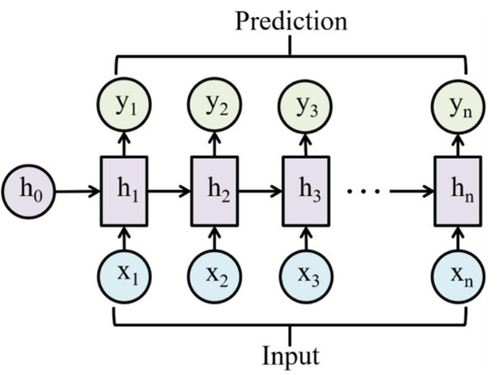
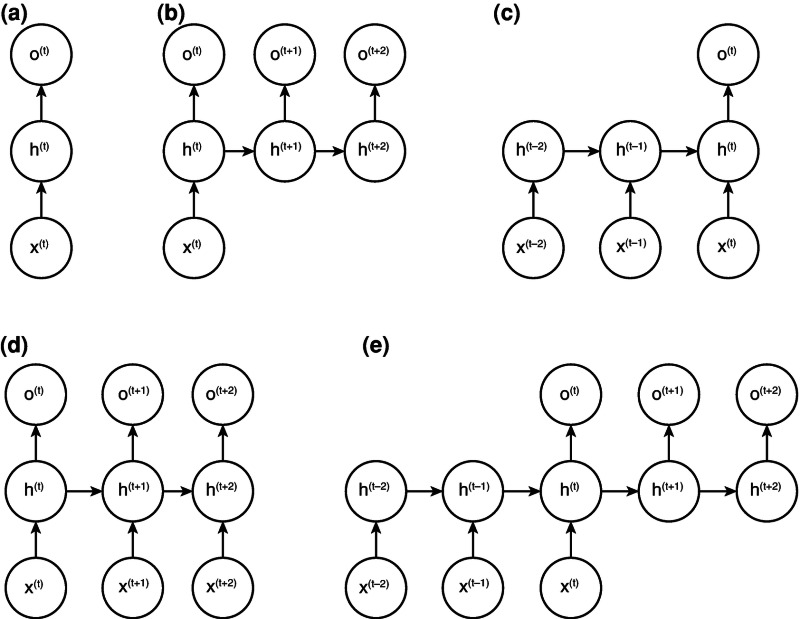
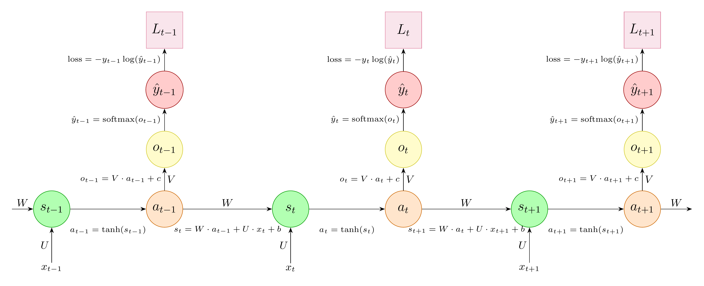
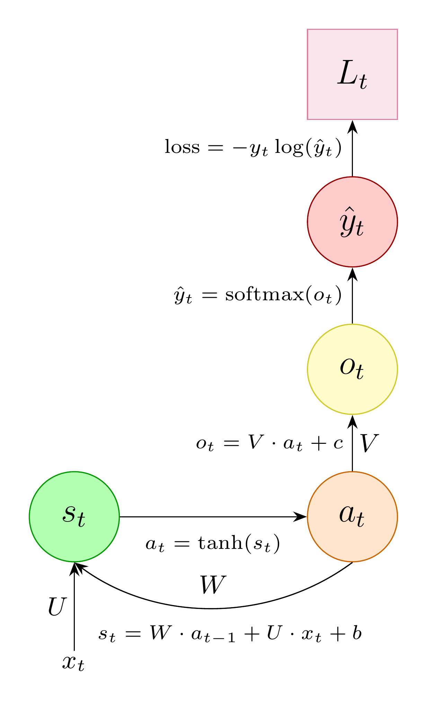

## Overview: RNNs and LSTMs

::: {.callout-note title="Game plan"}
Recurrent Neural Networks (RNNs) and extensions such as LSTMs introduced the concept of processing sequential data 
(like clinical notes, time-series measurements, or genetic sequences).
:::

:::: {.columns}

::: {.column width="48%"}
### [Part 1: Review](#part-1)
* What is an RNN?
* Forward vs. Reverse pass
* Biomed applications
:::

::: {.column width="4%"}
<br>
:::

::: {.column width="48%" .dimmed}
### [Part 2: Architecture and Backprop](#part-2)
* Chain rule & Jacobians
* Vectorized derivatives
:::

::::

:::: {.columns}

::: {.column width="48%" .dimmed}
### [Part 3: LSTMs](#part-3)
* Loss functions (MSE)
* Momentum & Adam
* Learning rates
:::

::: {.column width="4%"}
<br>
:::

::: {.column width="48%" .dimmed}
### [Part 4: Python](#part-4)
* Full implementation of ANN
* Classify handwritten digits
:::

::::


## RNNs: Overview {#part-1}

::: {.callout-important  icon=false, title="Recurrent Neural Networks"}

Unlike standard feed-forward networks, Recurrent Neural Networks (RNNs) introduce a hidden state ($\mathbf{h}_t$) 
that acts as a "memory," carrying information from time step $t-1$ to time step $t$.

- possess both current and past features of the temporal sequences
- adapt to the long-term historical changes in the data
- store the past information to solve context-dependent tasks
- make predictions simultaneously with existing observations.

:::

{width=40% fig-align="center"}


> * Mienye ID et al (2024) [Recurrent Neural Networks: A Comprehensive Review of Architectures, Variants, and Applications Information, Information 15(9), 517](https://www.mdpi.com/2078-2489/15/9/517).


## RNN Architecture: hidden layer

> RNNs are designed to process sequential data by maintaining a hidden state that captures information about previous inputs. 


The basic architecture consists of an input layer, a hidden layer, and an output layer. 

- Unlike feedforward neural networks, RNNs have recurrent connections, allowing information to cycle within the networks. 
At each time step, $t$, the RNN takes an input vector, $x_t$
, and updates its hidden state, $h_t$ using the following equation:

$$
\mathbf{h}_i = \sigma_h(\mathbf{W}_{xh}\mathbf{x}_t + \mathbf{W}_{hh}\mathbf{h}_{t-1} + \mathbf{b}_h)
$$ {#eq-rnn-hidden}

where

- $\mathbf{x}_t$: Input at time $t$
- $\mathbf{W}_{xh}$:  is the weight matrix between the input and hidden layer
- $\mathbf{W}_{hh}$ the weight matrix for the recurrent connection
- $\mathbf{b}_h$: the bias vector
- $\sigma_h$: the activation function, typically the hyperbolic tangent function (tanh) or the rectified linear unit 

{width=20% fig-align="center"}


## RNN Architecture: output

The output at each time step, $t$, is given by the following:
$$
\mathbf{y}_i = \sigma_y(\mathbf{W}_{hy}\mathbf{h}_t +  \mathbf{b}_y)
$$ {#eq-rnn-output}


where 

- $\mathbf{W}_{hy}$: the weight matrix between the hidden and output layers, 
- $\mathbf{b}_y$: the bias vector, 
- $\sigma_y$ the activation function for the output layer.

{width=20% fig-align="center"}

## Recursivity

- RNNs can be portrayed as (equivalent) folded or unfolded networks


```{python}
#| echo: false
#| fig-align: center
import sys
import matplotlib.pyplot as plt
sys.path.append('utils') 
from rnn_plots import basic_rnn

basic_rnn(figsize=(6,4))
plt.show()
```

::: {style="font-size: 0.75em;"}

- The hidden layer from the previous time step provides a form of memory, or context, that encodes earlier processing and informs the decisions to be made at
later points in time. 
- This approach does not impose a fixed-length limit on this prior context; the context embodied in the previous hidden layer can include
information extending back to the beginning of the sequence.
:::

::: {style="font-size: 0.5em;"}
Adapted from Jurafsky D and Martin JH (2026) Speech and Language Processing (3rd ed. draft)
:::

:::
::::

## Activation Functions

- As we discussed in previous lectures, the activation function plays a crucial role by introducing non-linearity that enables the network to learn and represent complex patterns. 
- One commonly used activation function in RNNs is the [hyperbolic tangent (tanh)]{style="color: green; font-weight: bold;"}. 

:::: {.columns}

::: {.column width="45%"}
### tanh
The tanh function squashes any real-valued input down to a symmetric, zero-centered range of **$[-1, 1]$**.

$$
\tanh(z) = \frac{e^z - e^{-z}}{e^z + e^{-z}}
$$ {#eq-tanh}

<br>
:::

::: {.column width="55%"}

```{python}
#| echo: false
#| fig-align: center
import sys
import matplotlib.pyplot as plt
sys.path.append('utils') 
from rnn_plots import plot_tanh

plot_tanh()
plt.show()
```

:::
::::

## RNN Architecture

- Compared to ANNs, the significant change for RNNs is the new set of weights that connect the hidden layer from the previous time step
to the current hidden layer ($\mathbf{W}_{hh}$ the weight matrix for the recurrent connection ).
- $\mathbf{W}_{hh}$ determines how the network makes use of past context in calculating the output for the current input. 
- These weights are also trained by backpropagation
- The activation function for the output layer can be a sigmoid function (for binary classification) or a soft-max function for categorical classfication).


## **RNN Forward Pass Algorithm**

**Inputs:** 

- A sequence of input vectors $\mathbf{X} = \langle\mathbf{x}_1, \mathbf{x}_2, \dots, \mathbf{x}_T\rangle$
- Network parameter matrices ($U, W, V$) and bias vectors ($\mathbf{b}_h, \mathbf{b}_y$)
- Activation functions $g$ (hidden layer, e.g., $\tanh$) and $f$ (output, e.g. softmax)

**Output:** A sequence of predicted output vectors $\mathbf{Y} = \langle\mathbf{y}_1, \mathbf{y}_2, \dots, \mathbf{y}_T\rangle$

### **Algorithm:**

$$
\begin{aligned}
&\text{1. } \mathbf{h}_0 \leftarrow \mathbf{0} && \bullet \text{Initialize the baseline context vector with zeros} \\
&\text{2. } \mathbf{Y} \leftarrow \langle \rangle && \bullet \text{Initialize an empty sequence to store outputs} \\
&\text{3. } \textbf{for } t \leftarrow 1 \textbf{ to } T \textbf{ do} && \\
&\text{4. } \quad \mathbf{z}_t \leftarrow U\mathbf{h}_{t-1} + W\mathbf{x}_t + \mathbf{b}_h && \bullet \text{Linear combination of past memory and new input} \\
&\text{5. } \quad \mathbf{h}_t \leftarrow g(\mathbf{z}_t) &&\bullet \text{Compute the updated hidden state} \\
&\text{6. } \quad \mathbf{y}_t \leftarrow f(V\mathbf{h}_t + \mathbf{b}_y) && \bullet \text{Generate the prediction for the current time step} \\
&\text{7. } \quad \mathbf{Y} \leftarrow \mathbf{Y} \parallel \langle\mathbf{y}_t\rangle && \bullet \text{Append the current step output vector to the sequence} \\
&\text{8. } \textbf{end for} && \\
&\text{9. } \textbf{return } \mathbf{Y} &&
\end{aligned}
$$


## Training RNNs

::: {.callout-tip appearance="minimal" icon=false style="background-color: #fafbfc; border-left: 4px solid #34495e; font-size: 0.85em;" title="Training"}
As previously with ANNs networks, we use a training set, a loss function, and backpropagation to
train the RNN.
:::

- There are now three sets of weights to update: 
- $\mathbf{W}_{xh}$:  is the weight matrix between the input and hidden layer
- $\mathbf{W}_{hh}$ the weight matrix for the recurrent connection
- $\mathbf{W}_{hy}$: the weight matrix between the hidden and output layers, 


## Types of RNNs

{width=75% fig-align="center"}

:::: {.columns}

::: {.column width="48%"}

- (a) One-to-one RNN. 
- (b) One-to-many RNN. 
- (c) Many-to-one RNN. 
:::
::: {.column width="48%"}
- (d) Many-to-many RNN. 
- (e) Many-to-many RNN.
:::
::::

::: {style="font-size: 0.75em;"}
Das S, et al (2023) Recurrent Neural Networks (RNNs): Architectures, Training Tricks, and Introduction to Influential Research. PMID:37988518.
:::

## Training of RNNs


{width=75% fig-align="center"}

<div style="font-size: 11px; line-height: 1.2;">

| Column 1 | Column 2 | Column 3 |
|:---|:---|:---|
| **$W$**: Recurrent weight matrix | **$a$**: Hidden state activation | **$L$**: Loss value |
| **$U$**: Input weight matrix | **$o$**: Weighted output value | **$x$**: Input vector  |
| **$V$**: Output weight matrix | **$\hat{y}$**: Predicted value ($\text{y hat}$) | **$b$**: Bias matrix (hidden) |
| **$s$**: Weighted sum ($s_{t}$) | **$y$**: True target value | **$c$**: Bias matrix (output) |


</div>

## Training of RNNs: Forward pass

:::: {.columns}

::: {.column width="30%"}

{width=75% fig-align="center"}

:::
::: {.column width="70%"}

$$
\begin{align*}
s_t &= \mathbf{W}a_{t+1} + \mathbf{U}x_{t} + b & \bullet \text{current input and previous hidden and bias} \\
a_t &= \tanh(s_t)  & \bullet \text{non-linear activation function} \\
o_t &= \mathbf{V}a_t + c & \bullet \text{calculate output} \\
\hat{y}_t &= \mathrm{softmax}(o_t)& \bullet \text{normalised probability distribution of the output} \\
\mathcal{L} &= -y_t\log(\hat{y}_t) & \bullet \text{loss} \\
\end{align*}
$$
:::
::::

## Backpropagation Through Time (BTT)

- The gradients are calculated layer by layer  from the last time step towards the initial time step.


## Why tanh?

- Why do we tend not to use the sigmoid activation function in RNNs?
- This has to do with the vanishing gradient problem
- The maximum value of the sigmoid derivative is exactly $0.25$
- Recall that the sigmoid is $\sigma(z) = \frac{1}{1+e^{-z}}$ and the first derivative is $\sigma^{\prime}(z) = \sigma(z)(1-\sigma(z))$
- Using the chain rule on $\sigma(z) - \sigma(z)^2$ to calculate the second derivative, we get 
$$
\begin{align*}
\sigma^{\prime\prime}(z) &= \sigma^{\prime}(z) - 2\sigma(z)\sigma^{\prime}(z) \\
&= \sigma^{\prime}(z)(1-2\sigma(z)) \\
\end{align*}
$$
- set $\sigma^{\prime\prime}(z) = 0$ to find crtical points: $\sigma^{\prime}(z)(1-2\sigma(z)) = 0$. We note that the slope of the sigmoid function ($\sigma^{\prime}$) is never zero for finite values, and so we solve the other term.
- $1-2\sigma(z) = 0$ implies $\sigma(z) = \frac{1}{2}$ (Maximum slope of the sigmoid function occurs when $\sigma(z) = \frac{1}{2}$ )
- It is easy to show that if $\frac{1}{1+e^z} = \frac{1}{2}$, then $z=0$. The slope of the sigmoid has its max at the center point, $z=0$
- We can now calculate the maximum value of the slope: $\sigma^{\prime}(z)(0) = \sigma(z)(0)(1-\sigma(z)(0)) = 0.5(1-0.5)=0.25$

## What tanh? (2)

- We can also show that $\tanh$'s derivative has its maximum at 1.0 (when the input is 0). 
- Therefore, the sigmoid will tend to reduce gradients substantially more than the tanh during backpropagation in time

Additionally

- Sigmoid restricts outputs strictly between $0$ and $1$. Because the outputs are always positive, the gradients for the weights in the next layer will all carry the same sign 
(either all positive or all negative). This forces the gradient descent updates to violently "zig-zag" during optimization, slowing down convergence.
- $\tanh$ outputs range from $-1$ to $1$. Because it is zero-centered, the average output is close to zero. 
This allows the weights to be updated in both positive and negative directions smoothly, which acts as a natural regularizer and helps the model converge much faster.

TODO update above text.