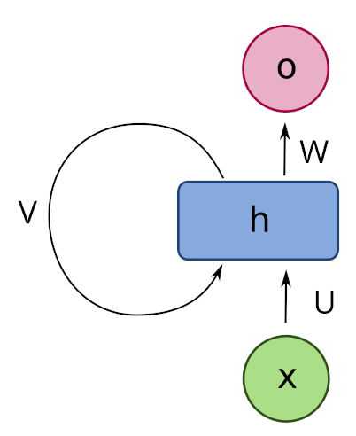
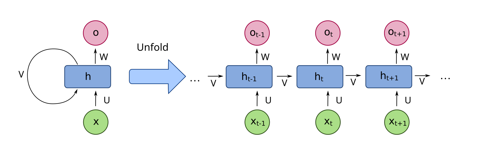
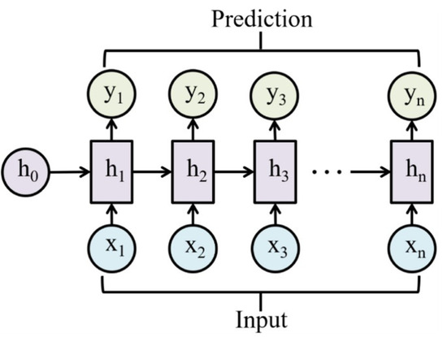
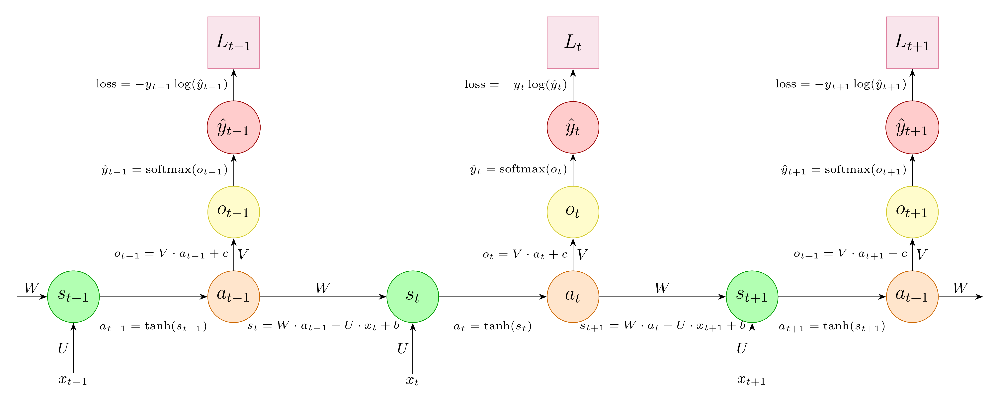
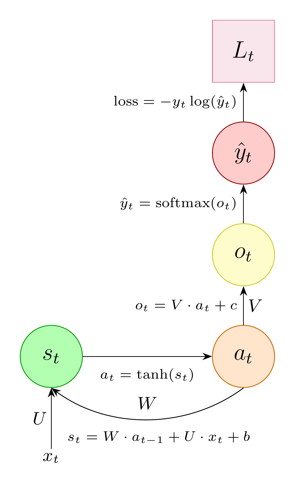
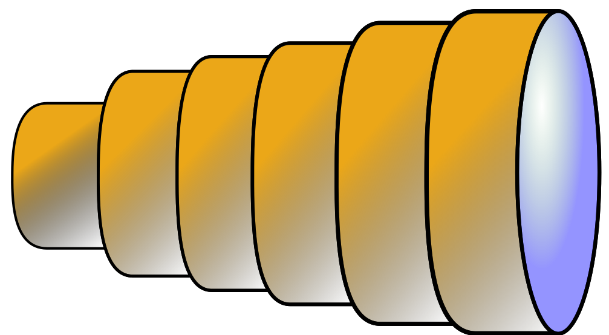
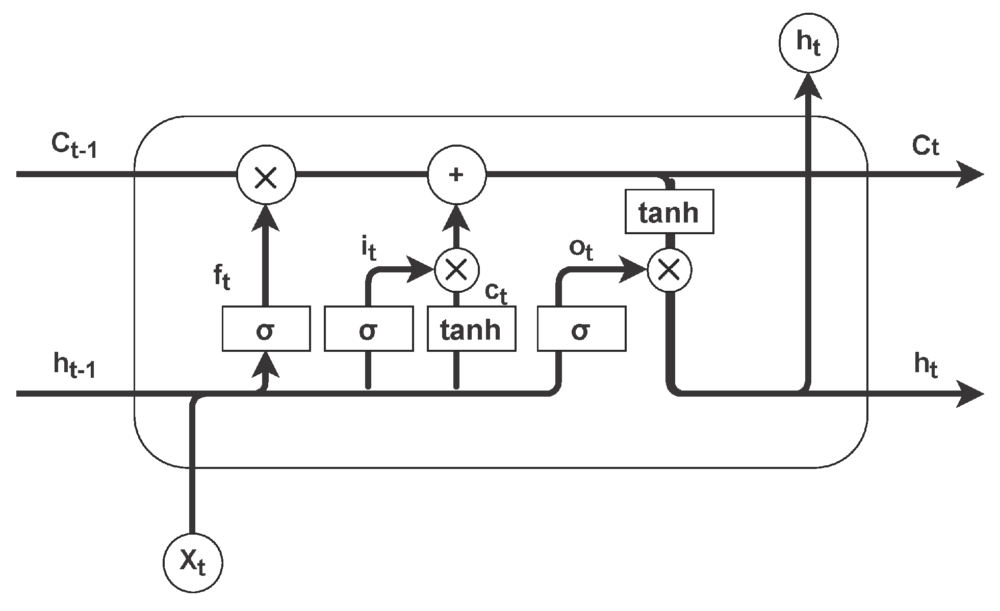

## Overview: RNNs and LSTMs

::: {.callout-note title="Game plan"}
Recurrent Neural Networks (RNNs) and extensions such as LSTMs introduced the concept of processing sequential data 
(like clinical notes, time-series measurements, or genetic sequences).
:::

:::: {.columns}

::: {.column width="48%"}
### [Part 1: RNNs](#part-1)
* What is an RNN?
* Forward vs. Reverse pass
* Biomed applications
:::

::: {.column width="4%"}
<br>
:::

::: {.column width="48%" .dimmed}
### [Part 2: Python](#part-2)
* Sentiment analysis
:::

::::

:::: {.columns}

::: {.column width="48%" .dimmed}
### [Part 3: LSTMs](#part-3)
* Loss functions (MSE)
* Momentum & Adam
* Learning rates
:::

::: {.column width="4%"}
<br>
:::

::: {.column width="48%" .dimmed}
### [Part 4: RNNs as Language Models](#part-4)
* Attention mechanism
* Encoder-decoder RNNs
:::

::::

## RNNs: Modelling sequences {#part-1}

::: {.callout-important  icon=false, title="Sequences"}

- a sentence (sequences of works)
- a time series (sequence of numbers)
- a patient's visit history (Sequence of observations and measures at different times) 

:::

- Sequences can have wildly different lengths from one example to the next.
- It is not straightforward to model sequences with standard ANNs, which take a fixed-dimensional input vector


## RNN: Basic idea

:::: {.columns}

::: {.column width="48%"}


{width=100% fig-align="center"}

:::
::: {.column width="10%"}
:::
::: {.column width="38%"}

- `Key idea`: RNNs have an internal (hidden) state that is updates as a sequence is processed
$$
\mathbf{h}_t = f_W(\mathbf{h}_{t-1}, \mathbf{x}_t)
$$
- $\mathbf{h}_t$: New state
- $f_W$: function with learnable parameters W
- $\mathbf{h}_{t-1}$: Prior state
- $\mathbf{x}_{t}$: Input at time $t$
- U, V, and W are learnable matrices

::: {.tiny-credit}
Image credit: Wikipedia
:::

:::
::::


## RNN: Output

- There is a separate function for the output of an RNN


:::: {.columns}

::: {.column width="48%"}


{width=100% fig-align="center"}

:::
::: {.column width="10%"}
:::
::: {.column width="38%"}

- `Key idea`: RNNs have an internal (hidden) state that is updates as a sequence is processed
$$
\mathbf{y}_t = f_W_{hy}(\mathbf{h}_{t})
$$

- The output at time $t$, $\mathbf{y}_t $, is calculated from the hidden state

- $f_W_{hy}$: function with learnable parameters W_{hy}
- $\mathbf{h}_{t}$: hidden state at time $t$
- Convert the dimension of the hidden state to the dimension of the output

::: {.tiny-credit}
Image credit: Wikipedia
:::

:::
::::


## Unfolding the RNN


{width=100% fig-align="center"}

- This unfolded view is equivalent
- The parameters $\mathbf{U}$, $\mathbf{V}$, and $\mathbf{W}$ are learnable weight matrices that are the same for each time step


## RNN types

:::: {.columns}

::: {.column width="65%"}

```{python}
#| echo: false
#| fig-align: center
import sys
import matplotlib.pyplot as plt
sys.path.append('utils') 
from rnn_plots import plot_sequence_models

plot_sequence_models(figsize=(10,6))
plt.show()
```

:::
::: {.column width="34%"}


- **Many-to-one**: e.g., sequence of words, predict whether text is positive or negative (sentiment analysis
- **One-to-many**: e.g., image captioning. From one image, create a sequence of words to describe the image
- **Many-to-many (synched)**: one output for each input, e.g. part-of-speech prediction
- **Many-to-many (encoder-decoder)**: e.g., translation

::: {.tiny-credit}
See: Das S, et al (2023) Recurrent Neural Networks (RNNs): Architectures, Training Tricks, and Introduction to Influential Research. PMID:37988518.
:::

:::
::::


## RNNs: Overview 

::: {.callout-important  icon=false, title="Recurrent Neural Networks"}

Unlike standard feed-forward networks, Recurrent Neural Networks (RNNs) introduce a hidden state ($\mathbf{h}_t$) 
that acts as a "memory," carrying information from time step $t-1$ to time step $t$.

- possess both current and past features of the temporal sequences
- adapt to the long-term historical changes in the data
- store the past information to solve context-dependent tasks
- make predictions simultaneously with existing observations.

:::

{width=40% fig-align="center"}


> * Mienye ID et al (2024) [Recurrent Neural Networks: A Comprehensive Review of Architectures, Variants, and Applications Information, Information 15(9), 517](https://www.mdpi.com/2078-2489/15/9/517).


## RNN Architecture: hidden layer

> RNNs are designed to process sequential data by maintaining a hidden state that captures information about previous inputs. 


The basic architecture consists of an input layer, a hidden layer, and an output layer. 

- RNNs have recurrent connections, allowing information to cycle within the networks. 
At each time step, $t$, the RNN takes an input vector, $x_t$
, and updates its hidden state, $h_t$ using the following equation:

$$
\mathbf{h}_t = \sigma_h(\mathbf{W}_{xh}\mathbf{x}_t + \mathbf{W}_{hh}\mathbf{h}_{t-1} + \mathbf{b}_h)
$$ {#eq-rnn-hidden}

where
<div style="fontsize=0.8rem">
- $\mathbf{x}_t$: Input at time $t$
- $\mathbf{W}_{xh}$:  is the weight matrix between the input and hidden layer
- $\mathbf{W}_{hh}$ the weight matrix for the recurrent connection
- $\mathbf{b}_h$: the bias vector
- $\sigma_h$: the activation function, typically the hyperbolic tangent function (tanh) or the rectified linear unit 
</div>
{width=20% fig-align="center"}


## RNN Architecture: output

The output at each time step, $t$, is given by the following:
$$
\mathbf{y}_i = \sigma_y(\mathbf{W}_{hy}\mathbf{h}_t +  \mathbf{b}_y)
$$ {#eq-rnn-output}


where 

- $\mathbf{W}_{hy}$: the weight matrix between the hidden and output layers, 
- $\mathbf{b}_y$: the bias vector, 
- $\sigma_y$ the activation function for the output layer.

{width=20% fig-align="center"}

## Recursivity

- RNNs can be portrayed as (equivalent) folded or unfolded networks


```{python}
#| echo: false
#| fig-align: center
import sys
import matplotlib.pyplot as plt
sys.path.append('utils') 
from rnn_plots import basic_rnn

basic_rnn(figsize=(6,4))
plt.show()
```

::: {style="font-size: 0.75em;"}

- The hidden layer from the previous time step provides a form of memory, or context, that encodes earlier processing and informs the decisions to be made at
later points in time. 
- This approach does not impose a fixed-length limit on this prior context; the context embodied in the previous hidden layer can include
information extending back to the beginning of the sequence.
:::

::: {style="font-size: 0.5em;"}
Adapted from Jurafsky D and Martin JH (2026) Speech and Language Processing (3rd ed. draft)
:::


## Activation Functions

- As we discussed in previous lectures, the activation function plays a crucial role by introducing non-linearity that enables the network to learn and represent complex patterns. 
- One commonly used activation function in RNNs is the [hyperbolic tangent (tanh)]{style="color: green; font-weight: bold;"}. 

:::: {.columns}

::: {.column width="45%"}
### tanh
The tanh function squashes any real-valued input down to a symmetric, zero-centered range of **$[-1, 1]$**.

$$
\tanh(z) = \frac{e^z - e^{-z}}{e^z + e^{-z}}
$$ {#eq-tanh}

<br>
:::

::: {.column width="55%"}

```{python}
#| echo: false
#| fig-align: center
import sys
import matplotlib.pyplot as plt
sys.path.append('utils') 
from rnn_plots import plot_tanh

plot_tanh()
plt.show()
```

:::
::::

## RNN Architecture

- Compared to ANNs, the significant change for RNNs is the new set of weights that connect the hidden layer from the previous time step
to the current hidden layer ($\mathbf{W}_{hh}$ the weight matrix for the recurrent connection ).
- $\mathbf{W}_{hh}$ determines how the network makes use of past context in calculating the output for the current input. 
- These weights are also trained by backpropagation
- The activation function for the output layer can be a sigmoid function (for binary classification) or a soft-max function (for categorical classfication).


## Understanding the hidden state

- To demonstrate that a hidden state can actually "remember" previous steps, let us construct _by hand_ an RNN that outputs 
$x_t$ if $x_t > x_{t-1}$, otherwise it outputs zero.^[Adapted from an example to output 1 if both $x_t$ and $x_{t-1}$ are 1, zero otherwise, from Stanford CS231N online lecture on RNNs]
- The general equation for the hidden state pre-activation is:
$$
z_t = w_{hh} h_{t-1} + w_{xh} x_t
$$
- In this toy example, we define the hidden state to be a $2\times 1$ column vector that memorizes both the current input and the immediate history.
$$
\begin{align*}
z_t^{(2\times 1)} &= w_{hh}^{(2\times 2)} h_{t-1}^{(2\times 1)} + w_{xh}^{(2\times 1)} x_t^{(1\times 1)} \\
h_t^{(2\times 1)} &= \mathrm{relu}(z_t^{(2\times 1)})
\end{align*}
$$

## Understanding the hidden state (2)

- We define these two matrices as follows

```python
w_xh = np.array([[1], [0]])
w_hh = np.array([[0, 0],  [1, 0]])
```

- This corresponds to 
$$
\begin{align*}
z_t^{(2\times 1)} &= w_{hh}^{(2\times 2)} h_{t-1}^{(2\times 1)} + w_{xh}^{(2\times 1)} x_t^{(1\times 1)} \\
 &= \begin{bmatrix} 0 & 0 \\ 1 & 0 \end{bmatrix} \begin{bmatrix} h_{1, t-1} \\ h_{2, t-1} \end{bmatrix}+ \begin{bmatrix} 1\\0\end{bmatrix} \begin{bmatrix}x_t\end{bmatrix} \\
&= \begin{bmatrix} 0  \\ 1\cdot h_{1, t-1} + 0\cdot h_{2, t-1}  \end{bmatrix}  + \begin{bmatrix} 1 \cdot x_t \\ 0 \cdot x_t \end{bmatrix} \\
&= \begin{bmatrix} 0  \\  h_{1, t-1}  \end{bmatrix} + \begin{bmatrix} x_t \\ 0  \end{bmatrix} \\
&= \begin{bmatrix} x_t \\  h_{1, t-1}  \end{bmatrix}  \\
\end{align*} 
$$

- That is, Combined State Pre-Activation ($z_t$) consists of two numbers: the current input ($x_t$) and the first element of the previous hidden state ($h_{1, t-1}$)

## Understanding the hidden state (3)
Assuming positive inputs $x_t \ge 0$, applying the $\text{ReLU}$ function produces:
$$
h_t = \text{ReLU}(z_t) = \text{ReLU} \left( \begin{bmatrix} x_t \\ h_{1, t-1} \end{bmatrix} \right) = \begin{bmatrix} x_t \\ h_{1, t-1} \end{bmatrix} = \begin{bmatrix} \text{Current Input } (x_t) \\ \text{Previous Input } (x_{t-1}) \end{bmatrix}$$
$$

Thus

- Row 1 of $h_t$ always receives $x_t$ via $w_{xh}$.
- Row 2 of $h_t$ receives the previous value $x_{t-1}$ copied from row 1 via $w_{hh}$.

\begin{aligned}
h_t &= \text{ReLU}\left( w_{hh} h_{t-1} + w_{xh} x_t \right) \\
    &= \text{ReLU}\left( 
        \begin{bmatrix} 0 & 0 \\ 1 & 0 \end{bmatrix} \begin{bmatrix} h_{1, t-1} \\ h_{2, t-1} \end{bmatrix} 
        + 
        \begin{bmatrix} 1 \\ 0 \end{bmatrix} x_t 
       \right) \\
    &= \text{ReLU}\left( 
        \begin{bmatrix} 0 \\ h_{1, t-1} \end{bmatrix} 
        + 
        \begin{bmatrix} x_t \\ 0 \end{bmatrix} 
       \right) \\
    &= \text{ReLU}\left( 
        \begin{bmatrix} x_t \\ h_{1, t-1} \end{bmatrix} 
       \right)
\end{aligned}
$$

## Understanding the hidden state (4)

- Our next step is to produce the output
```python
y_t = relu(w_yh @ h_t.flatten())
```
This corresponds to
$$
y_t = \text{ReLU}\left( w_{yh} h_t \right)
$$
- $w_{yh}$ is a 1D row weight vector (or 1D array of shape $(2,)$).
- $h_t$ is a column vector of shape $(2, 1)$:$$h_t = \begin{bmatrix} h_{1, t} \\ h_{2, t} \end{bmatrix} = \begin{bmatrix} x_t \\ x_{t-1} \end{bmatrix}$$
- Expanding the dot product using the weights $w_{yh} = \begin{bmatrix} 1 & -1 \end{bmatrix}$:$$\begin{align*}    w_{yh} h_t &= \begin{bmatrix} 1 & -1 \end{bmatrix} \begin{bmatrix} h_{1, t} \\ h_{2, t} \end{bmatrix} \\    &= (1 \cdot h_{1, t}) + (-1 \cdot h_{2, t}) \\    &= h_{1, t} - h_{2, t} \\    &= x_t - x_{t-1}    \end{align*}$$


## Understanding the hidden state (5)

Applying the Activation Function ($\text{ReLU}$):
- Finally, the scalar result passes through the element-wise $\text{ReLU}$ function to ensure the output is non-negative:
$$y_t = \text{ReLU}(x_t - x_{t-1}) = \max(0, x_t - x_{t-1})$$
- If $x_t > x_{t-1}$, the output is positive ($x_t - x_{t-1}$). 
- If $x_t \le x_{t-1}$, the output floors at $0$.


> * Of course, real RNNs are trained to learn the parameters of the network, but we have shown in this simple example that the architecture of an RNN can be made to `remember` past information
> * In the following slides, we will show how RNNs are trained.


## RNN Forward Pass Algorithm

<div style="font-size: 0.8em;">
**Inputs:** 

- A sequence of input vectors $\mathbf{X} = \langle\mathbf{x}_1, \mathbf{x}_2, \dots, \mathbf{x}_T\rangle$
- Network parameter matrices ($U, W, V$) and bias vectors ($\mathbf{b}_h, \mathbf{b}_y$)
- Activation functions $g$ (hidden layer, e.g., $\tanh$) and $f$ (output, e.g. softmax)

**Output:** A sequence of predicted output vectors $\mathbf{Y} = \langle\mathbf{y}_1, \mathbf{y}_2, \dots, \mathbf{y}_T\rangle$
</div>

### **Algorithm:**

$$
\begin{aligned}
&\text{1. } \mathbf{h}_0 \leftarrow \mathbf{0} && \bullet \text{Initialize the baseline context vector with zeros} \\
&\text{2. } \mathbf{Y} \leftarrow \langle \rangle && \bullet \text{Initialize an empty sequence to store outputs} \\
&\text{3. } \textbf{for } t \leftarrow 1 \textbf{ to } T \textbf{ do} && \\
&\text{4. } \quad \mathbf{z}_t \leftarrow U\mathbf{h}_{t-1} + W\mathbf{x}_t + \mathbf{b}_h && \bullet \text{Linear combination of past memory and new input} \\
&\text{5. } \quad \mathbf{h}_t \leftarrow g(\mathbf{z}_t) &&\bullet \text{Compute the updated hidden state} \\
&\text{6. } \quad \mathbf{y}_t \leftarrow f(V\mathbf{h}_t + \mathbf{b}_y) && \bullet \text{Generate the prediction for the current time step} \\
&\text{7. } \quad \mathbf{Y} \leftarrow \mathbf{Y} \parallel \langle\mathbf{y}_t\rangle && \bullet \text{Append the current step output vector to the sequence} \\
&\text{8. } \textbf{end for} && \\
&\text{9. } \textbf{return } \mathbf{Y} &&
\end{aligned}
$$


## Training RNNs

::: {.callout-tip appearance="minimal" icon=false style="background-color: #fafbfc; border-left: 4px solid #34495e; font-size: 0.85em;" title="Training"}
As previously with ANN networks, we use a training set, a loss function, and backpropagation to
train the RNN.
:::

- There are now three sets of weights to update: 
- $\mathbf{W}_{xh}$:  is the weight matrix between the input and hidden layer
- $\mathbf{W}_{hh}$ the weight matrix for the recurrent connection
- $\mathbf{W}_{hy}$: the weight matrix between the hidden and output layers, 


## Training of RNNs


{width=75% fig-align="center"}

<div style="font-size: 11px; line-height: 1.2;">

| Column 1 | Column 2 | Column 3 |
|:---|:---|:---|
| **$W$**: Recurrent weight matrix | **$a$**: Hidden state activation | **$L$**: Loss value |
| **$U$**: Input weight matrix | **$o$**: Weighted output value | **$x$**: Input vector  |
| **$V$**: Output weight matrix | **$\hat{y}$**: Predicted value ($\text{y hat}$) | **$b$**: Bias matrix (hidden) |
| **$s$**: Weighted sum ($s_{t}$) | **$y$**: True target value | **$c$**: Bias matrix (output) |


</div>

## Training of RNNs: Forward pass

:::: {.columns}

::: {.column width="30%"}

{width=75% fig-align="center"}

:::
::: {.column width="70%"}

$$
\begin{align*}
s_t &= \mathbf{W}a_{t+1} + \mathbf{U}x_{t} + b & \bullet \text{current input and previous hidden and bias} \\
a_t &= \tanh(s_t)  & \bullet \text{non-linear activation function} \\
o_t &= \mathbf{V}a_t + c & \bullet \text{calculate output} \\
\hat{y}_t &= \mathrm{softmax}(o_t)& \bullet \text{normalised probability distribution of the output} \\
\mathcal{L} &= -y_t\log(\hat{y}_t) & \bullet \text{loss} \\
\end{align*}
$$
:::
::::

## Backpropagation Through Time (BTT)

- The gradients are calculated layer by layer  from the last time step towards the initial time step.
- We will not present a derivation of the gradients, which is mainly analogous to the derivation we presented for ANNs 
- The one exception is the fact that the gradients for the hidden state weights depend on previous time points

$$
\begin{align*}
\mathbf{h}_i &= \sigma_h(\mathbf{W}_{xh}\mathbf{x}_t + \mathbf{W}_{hh}\mathbf{h}_{t-1} + \mathbf{b}_h) \\
&=\sigma_h(\mathbf{W}_{xh}\mathbf{x}_t + \mathbf{W}_{hh}\sigma_h(\mathbf{W}_{xh}\mathbf{x}_{t-1} + \mathbf{W}_{hh}\mathbf{h}_{t-2} + \mathbf{b}_h)  + \mathbf{b}_h) \\
&=\sigma_h(\mathbf{W}_{xh}\mathbf{x}_t + \mathbf{W}_{hh}\sigma_h(\mathbf{W}_{xh}\mathbf{x}_{t-1} + \mathbf{W}_{hh}\sigma_h(\mathbf{W}_{xh}\mathbf{x}_{t-2} + \mathbf{W}_{hh}\mathbf{h}_{t-3} + \mathbf{b}_h) + \mathbf{b}_h)  + \mathbf{b}_h) \\
&=\ldots
\end{align*}  
$$

{width=40% fig-align="center"}


## The Vanishing and Exploding Gradient Problems

- It can be shown that when calculating the gradients of such "telescoped" terms, we encounter the product of many Jacobian matrices:
$$
\frac{\partial \mathbf{h}_t}{\partial \mathbf{h}_{t-n}} = \prod_{k=t-n}^{t-1} \mathbf{J}_k
$$


where $\mathbf{J}_k$ is the Jacobian matrix of the hidden state at time step $k$. If the eigenvalues of $\mathbf{J}_k$
 are less than 1, the product of these matrices will tend to zero as $n$ increases, leading to vanishing gradients. If they are greater than one, the 
 gradients will explode.[^2]

 - The vanishing gradient problem prevents the network from effectively learning long-term dependencies, as the gradient signal becomes too weak to update the weights meaningfully for earlier layers. 
 - The exploding gradient problem can cause the model to converge too quickly to a poor local minimum or make the training process fail entirely due to excessively large updates.

[^2]: Mienye ID et al (2024) [Recurrent Neural Networks: A Comprehensive Review of Architectures, Variants, and Applications Information, Information 15(9), 517](https://www.mdpi.com/2078-2489/15/9/517).


## The Vanishing and Exploding Gradient Problem: Intuition

- Let us examine an example to understand why the vanishing gradient problem occurs. 
- For simplicity, Let's consider the following symmetric matrix $A$:
$$A = \begin{bmatrix}  0.65 & 0.15 \\  0.15 & 0.65  \end{bmatrix}$$
- To diagonalize $A$, we first find its eigenvalues $\lambda$ by solving $\det(A - \lambda I) = 0$:
- Eigenvalues ($\lambda$):Solving the characteristic polynomial gives:$$\lambda_1 = 0.8, \quad \lambda_2 = 0.5$$
- Eigenvectors ($P$):The corresponding eigenvectors form the columns of matrix $P$:$$P = \begin{bmatrix}     1 & 1 \\     1 & -1     \end{bmatrix}, \quad     P^{-1} = \begin{bmatrix}     0.5 & 0.5 \\     0.5 & -0.5     \end{bmatrix}$$

## The Vanishing and Exploding Gradient Problem: Intuition (2)
- Any diagonalizable matrix can be factored as:$$A = P D P^{-1}$$
- where $D$ is a diagonal matrix containing the eigenvalues -- in our example we have:
$$D = \begin{bmatrix}  0.8 & 0 \\  0 & 0.5  \end{bmatrix}$$
- When we multiple the matrix by itself many times, the intermediate terms cancel out
$$\begin{align*} A^n &= (P D P^{-1}) (P D P^{-1}) \dots (P D P^{-1}) \\ &= P D (P^{-1} P) D (P^{-1} P) \dots D P^{-1} \\ &= P D^n P^{-1} \end{align*}$$
- Because $D$ is a diagonal matrix, raising it to the power $n$ simply means raising each individual eigenvalue to the power $n$:$$D^n = \begin{bmatrix}  0.8^n & 0 \\  0 & 0.5^n  \end{bmatrix}$$


## The Vanishing and Exploding Gradient Problem: Intuition (3)

For $n = 1$:$$D^1 =  \begin{bmatrix} 0.8^1 & 0 \\ 0 & 0.5^1 \end{bmatrix}  = \begin{bmatrix} 0.8 & 0 \\ 0 & 0.5 \end{bmatrix} $$
For $n = 5$:$$D^5 = \begin{bmatrix} 0.8^5 & 0 \\ 0 & 0.5^5 \end{bmatrix} = \begin{bmatrix} 0.32768 & 0 \\ 0 & 0.03125 \end{bmatrix}$$
For $n = 20$:$$D^{20} = \begin{bmatrix} 0.8^{20} & 0 \\ 0 & 0.5^{20} \end{bmatrix} \approx \begin{bmatrix} 0.0115 & 0 \\ 0 & 0.00000095 \end{bmatrix}$$

- Because both eigenvalues ($\lambda_1 = 0.8$ and $\lambda_2 = 0.5$) are less than $1$, raising them to a large power $n$ forces them to decay exponentially toward zero.

## The Vanishing and Exploding Gradient Problem: Intuition (4)

- This is the algebraic root of the vanishing gradient problem in RNNs: if the eigenvalues of the hidden-to-hidden Jacobian matrices are less than 1, long-term gradient signals shrink to zero before they can reach earlier time steps. 
- Conversely, if eigenvalues are greater than 1, $D^n$ explodes toward infinity, causing exploding gradients.

## Why tanh?

- Why do we tend not to use the sigmoid activation function in RNNs?
- This has to do with the vanishing gradient problem
- The maximum value of the sigmoid derivative is exactly $0.25$
- Recall that the sigmoid is $\sigma(z) = \frac{1}{1+e^{-z}}$ and the first derivative is $\sigma^{\prime}(z) = \sigma(z)(1-\sigma(z))$
- Using the chain rule on $\sigma(z) - \sigma(z)^2$ to calculate the second derivative, we get 
$$
\begin{align*}
\sigma^{\prime\prime}(z) &= \sigma^{\prime}(z) - 2\sigma(z)\sigma^{\prime}(z) \\
&= \sigma^{\prime}(z)(1-2\sigma(z)) \\
\end{align*}
$$
- set $\sigma^{\prime\prime}(z) = 0$ to find crtical points: $\sigma^{\prime}(z)(1-2\sigma(z)) = 0$. We note that the slope of the sigmoid function ($\sigma^{\prime}$) is never zero for finite values, and so we solve the other term.
- $1-2\sigma(z) = 0$ implies $\sigma(z) = \frac{1}{2}$ (Maximum slope of the sigmoid function occurs when $\sigma(z) = \frac{1}{2}$ )
- It is easy to show that if $\frac{1}{1+e^z} = \frac{1}{2}$, then $z=0$. The slope of the sigmoid has its max at the center point, $z=0$
- We can now calculate the maximum value of the slope: $\sigma^{\prime}(z)(0) = \sigma(z)(0)(1-\sigma(z)(0)) = 0.5(1-0.5)=0.25$

## What tanh? (2)

- We can also show that $\tanh$'s derivative has its maximum at 1.0 (when the input is 0). 
- Therefore, the sigmoid will tend to reduce gradients substantially more than the tanh during backpropagation in time

Additionally

- Sigmoid restricts outputs strictly between $0$ and $1$. Because the outputs are always positive, the gradients for the weights in the next layer will all carry the same sign 
(either all positive or all negative). This forces the gradient descent updates to violently "zig-zag" during optimization, slowing down convergence.
- $\tanh$ outputs range from $-1$ to $1$. Because it is zero-centered, the average output is close to zero. 
This allows the weights to be updated in both positive and negative directions smoothly, which acts as a natural regularizer and helps the model converge much faster.
- A number of techniques have been developed to mitigate the unstable gradient problem including gradient clipping and LSTMs


## Overview: RNNs and LSTMs

::: {.callout-note title="Game plan"}
Recurrent Neural Networks (RNNs) and extensions such as LSTMs introduced the concept of processing sequential data 
(like clinical notes, time-series measurements, or genetic sequences).
:::

:::: {.columns}

::: {.column width="48%" .dimmed}
### [Part 1: RNNs](#part-1)
* What is an RNN?
* Forward vs. Reverse pass
* Biomed applications
:::

::: {.column width="4%"}
<br>
:::

::: {.column width="48%" }
### [Part 2: Python](#part-2)
* Sentiment analysis
:::

::::

:::: {.columns}

::: {.column width="48%" .dimmed}
### [Part 3: LSTMs](#part-3)
* Loss functions (MSE)
* Momentum & Adam
* Learning rates
:::

::: {.column width="4%"}
<br>
:::

::: {.column width="48%" .dimmed}
### [Part 4: RNNs as Language Models](#part-4)
* Attention mechanism
* Encoder-decoder RNNs
:::


::::


## Python: RNN-based sentiment analysis {#part-2}

- The point of sentiment analysis is to perform binary classification about the opinion expressed by a certain text
- The classic example is to predict whether a movie review is positive or negative

```{python}
#| echo: false
#| fig-align: center
import sys
import matplotlib.pyplot as plt

sys.path.append('utils') 
from rnn_plots import sentiment_analysis_basic_idea

sentiment_analysis_basic_idea()
plt.plot()
```

## Sentiment analysis: embedding

```{python}
#| echo: false
#| fig-align: center
import sys
import matplotlib.pyplot as plt

sys.path.append('utils') 
from rnn_plots import sentiment_embedding

sentiment_embedding()
plt.plot()
```


## Sentiment analysis: Unrolling the RNN

```{python}
#| echo: false
#| fig-align: center
import sys
import matplotlib.pyplot as plt

sys.path.append('utils') 
from rnn_plots import unrolled_rnn_sentiment

unrolled_rnn_sentiment()
plt.plot()
```


## Sentiment analysis

- We will present a bare-bones implementaton of an RNN trained to perform sentiment analysis using the IMDB movie review dataset.
- The full script is available in the course material, we will briefly review some of the salient blocks of code
- We make use of the pytorch framework for most of the heavy lifting

## Data Preparation & Tokenization

* **Loading:** Fetching the IMDb movie review corpus directly via Hugging Face (`stanfordnlp/imdb`).
* **Normalization:** Lowercasing and tokenizing reviews into word lists.

```python
from datasets import load_dataset
import pandas as pd
from sklearn.model_selection import train_test_split

# 1. Load and merge train/test splits
hf_dataset = load_dataset("stanfordnlp/imdb")
df = pd.concat([pd.DataFrame(hf_dataset["train"]), 
                pd.DataFrame(hf_dataset["test"])], ignore_index=True)

# 2. Lowercase and split text into tokens
df["text"] = df["text"].str.lower().str.split()
train_data, test_data = train_test_split(df, test_size=0.2, random_state=42)
```

## Data Preparation & Tokenization (2) 
* **Vocabulary Mapping**: Assign a unique integer index to every distinct word.
* **Truncation & Padding**: Fixing sequences to a uniform length ($\text{max\_length} = 250$) for batching tensors.

```python 
Build vocabulary index (starting at 1, reserving 0 for padding)
vocab = {word for phrase in df["text"] for word in phrase}
word_to_idx = {word: idx for idx, word in enumerate(vocab, start=1)}

max_length = 250
def encode_and_pad(text):
    truncated = text[:max_length]  
    encoded = [word_to_idx[word] for word in truncated]
    length = len(encoded)
    padded = encoded + [0] * (max_length - length)
    return padded, length

# Apply transformation
train_data[["text", "length"]] = train_data["text"].apply(lambda t: pd.Series(encode_and_pad(t)))
test_data[["text", "length"]] = test_data["text"].apply(lambda t: pd.Series(encode_and_pad(t)))
```

## Custom PyTorch Datasets & DataLoaders

* **Dataset Class**: Wraps pandas dataframes to serve pre-padded sequences, labels, and true lengths item-by-item as PyTorch tensors.
* **DataLoader**: Automatically batches samples, shuffles training data, and handles parallel iteration.

```python 
import torch
from torch.utils.data import Dataset, DataLoader

class SentimentDataset(Dataset):
    def __init__(self, data):
        self.texts = data['text'].values. ## The movie reviews
        self.labels = data['label'].values ## Positive (1) or negative (0) reviews?
        self.lengths = data['length'].values ## How long (how many chars is the text)
    
    def __len__(self):
        return len(self.texts)
    
    def __getitem__(self, idx):
        return (torch.tensor(self.texts[idx], dtype=torch.long), 
                torch.tensor(self.labels[idx], dtype=torch.long), 
                torch.tensor(self.lengths[idx], dtype=torch.long))

train_dataset = SentimentDataset(train_data)
test_dataset = SentimentDataset(test_data)

train_loader = DataLoader(train_dataset, batch_size=32, shuffle=True)
test_loader = DataLoader(test_dataset, batch_size=32, shuffle=False)
```

## Building the RNN Sentiment Classifier

* **Architecture**: Combines an embedding layer, a recurrent layer (nn.RNN), dropout regularization, and a final linear classification layer.
* **Sequence Packing**: Uses pack_padded_sequence to bypass zero-padding during recurrent updates, extracting the final hidden state ($h_n$).

```python
import torch.nn as nn

class SentimentRNN(nn.Module):
    def __init__(self, vocab_size, embed_size, hidden_size, output_size):
        super().__init__()
        self.embedding = nn.Embedding(vocab_size, embed_size, padding_idx=0)
        self.rnn = nn.RNN(embed_size, hidden_size, batch_first=True)
        self.fc = nn.Linear(hidden_size, output_size)
        self.dropout = nn.Dropout(0.2)
    
    def forward(self, x, lengths):
        x = self.embedding(x)
        # Skip padding processing for efficiency
        packed = nn.utils.rnn.pack_padded_sequence(x, lengths.cpu(), batch_first=True, enforce_sorted=False)
        _, h_n = self.rnn(packed)
        return self.fc(self.dropout(h_n[-1]))

# Instantiate model on the device (e.g., Mac MPS or CPU)
model = SentimentRNN(len(vocab) + 1, embed_size=128, hidden_size=128, output_size=2).to(device)
```

## Training Loop & Optimization
* **Loss & Optimizer**: Cross-Entropy Loss for multi-class classification and the Adam optimizer.
* **Device Management & Gradient Clipping**: Pushes batches to the target device (device) and applies gradient clipping (clip_grad_norm_) to prevent exploding gradients.

```python
import torch.optim as optim

criterion = nn.CrossEntropyLoss()
optimizer = optim.Adam(model.parameters(), lr=0.001)

num_epochs = 10
for epoch in range(num_epochs):
    model.train()
    epoch_loss = 0
    for texts, labels, lengths in train_loader:
        texts, labels = texts.to(device), labels.to(device)
        
        optimizer.zero_grad()
        outputs = model(texts, lengths)
        loss = criterion(outputs, labels)
        
        loss.backward()
        torch.nn.utils.clip_grad_norm_(model.parameters(), max_norm=5.0)
        optimizer.step()
        
        epoch_loss += loss.item()
    print(f'Epoch [{epoch+1}/{num_epochs}], Loss: {epoch_loss / len(train_loader):.4f}')
```


## Loss

```{python}
import matplotlib.pyplot as plt

# Recorded training loss per epoch from the training loop
losses = [0.6880, 0.6158, 0.5277, 0.4361, 0.3764, 0.2970, 0.2239, 0.1730, 0.1387, 0.1020]
epochs = list(range(1, len(losses) + 1))

# Create the plot
plt.figure(figsize=(8, 5))
plt.plot(epochs, losses, marker='o', linestyle='-', color='b', linewidth=2, label='Training Loss')

plt.title('RNN Sentiment Classifier Training Loss', fontsize=14)
plt.xlabel('Epoch', fontsize=12)
plt.ylabel('Loss (Cross-Entropy)', fontsize=12)
plt.xticks(epochs)
plt.grid(True, linestyle='--', alpha=0.6)
plt.legend()

plt.tight_layout()
plt.show()
```


## Model Evaluation & Accuracy

* **Evaluation Mode (model.eval())**: Disables layers like Dropout during testing so evaluation is deterministic.
* **No-Gradient Context (torch.no_grad())**: Saves memory and speeds up computation by disabling gradient tracking since we aren't updating weights.
* **Batch Accuracy Calculation**: Compares predicted classes against ground-truth labels to compute overall test set accuracy.

```python
model.eval()
correct = 0
total = 0
with torch.no_grad():
    for texts, labels, lengths in test_loader:
        texts = texts.to(device)
        labels = labels.to(device)
        outputs = model(texts, lengths)
        _, predicted = torch.max(outputs.data, 1)
        total += labels.size(0)
        correct += (predicted == labels).sum().item()

accuracy = 100 * correct / total
print(f'Accuracy: {accuracy:.2f}%')
```

- Accuracy: 73.94% (as compared to the 50% we would have expected by chance, but much worse than the training accuracy of 97.85% - thus, we are overfitting! In the practical, we will discuss some methods for reducing overfitting)


## Overview: RNNs and LSTMs

::: {.callout-note title="Game plan"}
Recurrent Neural Networks (RNNs) and extensions such as LSTMs introduced the concept of processing sequential data 
(like clinical notes, time-series measurements, or genetic sequences).
:::

:::: {.columns}

::: {.column width="48%" .dimmed}
### [Part 1: RNNs](#part-1)
* What is an RNN?
* Forward vs. Reverse pass
* Biomed applications
:::

::: {.column width="4%"}
<br>
:::

::: {.column width="48%" .dimmed}
### [Part 2: Python](#part-2)
* Sentiment analysis
:::

::::

:::: {.columns}

::: {.column width="48%" }
### [Part 3: LSTMs](#part-3)
* Loss functions (MSE)
* Momentum & Adam
* Learning rates
:::

::: {.column width="4%"}
<br>
:::

::: {.column width="48%" .dimmed}
### [Part 4: RNNs as Language Models](#part-4)
* Attention mechanism
* Encoder-decoder RNNs
:::


::::


## Long Short-Term Memory Networks (LSTMs) {#part-3}

- The key innovation in LSTM is the use of gating mechanisms to control the flow of information through the network. 
- A challenge for RNNs is to keep track of information from distant parts of the sentence:

> The rates the phone company was increasing were already expensive

- It is easy to relate "was" to "company" because "was" comes immediately after "company"
- It is harder to relate "were" to "rates" because there are five other intervening words
- The hidden state of the RNN is being asked to perform two things: inform the current output and to update and carry forward the information needed for future outputs
- LSTMS attempt to address the challenge by adding a context layer to the existing hidden layer and by introducing **gates** to control flow of information

::: { .tiny-credit}
Hochreiter, S. and J. Schmidhuber. 1997. Long short-term
memory. Neural Computation, 9(8):1735–1780.
:::

## LSTMS vs RNNs


```{python}
#| echo: false
#| fig-align: center
import sys
import matplotlib.pyplot as plt

sys.path.append('utils') 
from rnn_plots import rnn_vs_lstm_1

rnn_vs_lstm_1()
plt.plot()
```

- All recurrent neural networks have the form of a chain of repeating modules. 
- In standard RNNs, this  module has a simple structure with a single tanh layer and passes on the hidden state


## LSTMS vs RNNs

- TODO similar graphic for LSTM

- In contrast, LSTM modules have four intacting structures and are connected by the cell state in addition to the hidden state


## LSTMS 

- Let's review the main ideas of the LSTM step by step

{width=40% fig-align="center"}


## LSTM Gates

LSTMs have [three gates]{style="color: green; font-weight: bold;"}:

- forget gate 
- add gate
- output gate

Each gate consists of 

  1. feedforward layer
  2. followed by a sigmoid activation function
  3. followed by a pointwise multiplication with the layer being gated. 

- The sigmoid activation function tends to push its outputs to either 0 or 1. 
- Combining this with a pointwise multiplication has an effect similar to that of a **binary mask**. 
- Values in the layer being gated that align with values near 1 in the mask are **passed through**
nearly unchanged; values corresponding to lower values are essentially **erased**.


## Forget gate

::: {.r-stack}
<div style="position: relative; width: 50%; margin: auto;">
  <!-- The Base Image fills the container width -->
  

  <!-- Highlight Box (Adjust top, left, width, height as needed) -->
  <div style="position: absolute; 4px solid #1a73e8; 
       background-color: rgba(26, 115, 232, 0.25); border-radius: 8px; z-index: 999;
       top: 24%; left: 20%; width: 10%; height: 35%;">
  </div>
</div>
:::

::: { .small-text}
- The forget fate deletes information from the context that is no longer relevant 
- It computes a weighted sum of the previous state’s hidden layer and the current input and passes that through a sigmoid. 
- This mask is then multiplied element-wise
by the context vector to remove the information from context that is no longer required. 
- Element-wise multiplication of two vectors, represented by the $\odot$ 
operator,^[called the Hadamard product] results in a vector where  element $i$ is the product of element $i$ in the two
input vectors:
:::

$$
\begin{align*}
\mathbf{f}_t &= \sigma(\mathbf{U}_t\mathbf{h}_{t-1} + \mathbf{W}_f\mathbf{x}_t) \\
\mathbf{k}_t &= \mathbf{c}_{t-1} \odot\mathbf{f}_t 
\end{align*}
$$ {#eq-forget-gate}

## Cell input


::: {.r-stack}
<div style="position: relative; width: 50%; margin: auto;">
  <!-- The Base Image fills the container width -->
  

  <!-- Highlight Box (Adjust top, left, width, height as needed) -->
  <div style="position: absolute; 4px solid #1a73e8; 
       background-color: rgba(26, 115, 232, 0.25); border-radius: 8px; z-index: 999;
       top: 34%; left: 30%; width: 10%; height: 25%;">
  </div>
</div>
:::


- Then we compute the actual information we need to extract from the previous hidden state and 
current inputs

$$
\mathbf{g}_t = \tanh(\mathbf{U}_g\mathbf{h}_{t-1} + \mathbf{W}_g\mathbf{x}_t)
$$ {#eq-lstm-info-to-extract}
- This is the same as with the vanilla RNN

## Add gate 
Next, we generate the mask for the add gate to select the information to add to the
current context.

::: {.r-stack}
<div style="position: relative; width: 50%; margin: auto;">
  <!-- The Base Image fills the container width -->
  

  <!-- Highlight Box (Adjust top, left, width, height as needed) -->
  <div style="position: absolute; 4px solid #1a73e8; 
       background-color: rgba(26, 115, 232, 0.25); border-radius: 8px; z-index: 999;
       top: 24%; left: 40%; width: 10%; height: 35%;">
  </div>
</div>
:::

$$
\begin{align*}
\mathbf{i}_t &= \sigma(\mathbf{U}\mathbf{h}_{t-1} + \mathbf{W}_i\mathbf{x}_{t}) &\quad  \\
\mathbf{j}_t &= \mathbf{g}_t \odot \mathbf{i}_t &\quad \text{See previous slide} \\
\mathbf{c}_t &= \mathbf{j}_t + \mathbf{k}_t &\quad \text{add to context vector} \\
\end{align*}
$$ {#eq-add-gate}


## Output gate 
Next, we generate the mask for the add gate to select the information to add to the
current context.

::: {.r-stack}
<div style="position: relative; width: 50%; margin: auto;">
  <!-- The Base Image fills the container width -->
  

  <!-- Highlight Box (Adjust top, left, width, height as needed) -->
  <div style="position: absolute; 4px solid #1a73e8; 
       background-color: rgba(26, 115, 232, 0.25); border-radius: 8px; z-index: 999;
       top: 24%; left: 50%; width: 20%; height: 35%;">
  </div>
</div>
:::

- The output gate  decides what information is required for the current hidden state

$$
\begin{align*}
\mathbf{o}_t &= \sigma(\mathbf{U}\mathbf{o}_{t-1} + \mathbf{W}_o\mathbf{x}_{t})   \\
\mathbf{h}_t &= \mathbf{o}_t \odot \tanh(\mathbf{c}_t)
\end{align*}
$$ {#eq-output-gate}


## LSTM

  

In Summary

- an LSTM accepts as input the context layer ($\mathbf{c}_{t-1}$)
 and hidden layer ($\mathbf{h}_{t-1}$) from the previous time step, along with the current input
vector ($\mathbf{x}_{t}$). 
- It generates $\mathbf{c}_{t}$ and $\mathbf{h}_{t}$ as output that is passed to the next step
- The hidden state $\mathbf{h}_{t}$ is used to generate the output of the network similar to an RNN
- LSTMs can be used as drop-in replacements for RNNs in many contexts and often perform better

## Overview: RNNs and LSTMs

::: {.callout-note title="Game plan"}
Recurrent Neural Networks (RNNs) and extensions such as LSTMs introduced the concept of processing sequential data 
(like clinical notes, time-series measurements, or genetic sequences).
:::

:::: {.columns}

::: {.column width="48%" .dimmed}
### [Part 1: RNNs](#part-1)
* What is an RNN?
* Forward vs. Reverse pass
* Biomed applications
:::

::: {.column width="4%"}
<br>
:::

::: {.column width="48%" .dimmed}
### [Part 2: Python](#part-2)
* Sentiment analysis
:::

::::

:::: {.columns}

::: {.column width="48%" .dimmed}
### [Part 3: LSTMs](#part-3)
* Loss functions (MSE)
* Momentum & Adam
* Learning rates
:::

::: {.column width="4%"}
<br>
:::

::: {.column width="48%" }
### [Part 4: RNNs as Language Models](#part-4)
* Attention mechanism
* Encoder-decoder RNNs
:::


::::


## RNNs as Language Models {#part-4}

that language models predict the next word in a sequence given some preceding
context. For example, if the preceding context is “Something is rotten in the state of” and we want
to know how likely the next word is "Denmark"^[In Hamlet, the palace guard Marcellus, says this right after Hamlet has just seen his father's ghost for the first time.] we would compute:

$$
P(\mathrm{Denmark}\mid \text{Something is rotten in the state of})
$$

- That is, we are computing the probability of the word "Denmark" given the previous 7 words.
- RNN language models process the input sequence one word at a time, attempting to predict the next word from the current word ($x_t$) and the previous hidden state ($h_{t-1}$).

## Forward inference in an RNN language model

- The input is a sequence of words  $\mathbf{X} = \left[x_1;\ldots;x_t\right]$
- Let the Vocabulary be a collection of words of size $|V|$
- Then each word is represented by a one-hot column vector of size $|V|\times 1$.
- The output prediction $\hat{\mathbf{y}}$ is a vector representing a probabilites distribution over the vocabulary. 
- For each step the model uses an embedding matrix $\mathbf{E}$ to retrieve the embedding for the current word^[We will study embeddings in a later lecture. For now, suffice it to say that embeddings are lower dimensional vectorial represesntations of words or tokens that in some way reflect the semantics of the words.]
- The model then multiplies the embedding vector for each word by the  weight matrix $\mathbf{W}$, and then adds it to the hidden layer from the previous step (weighted by weight matrix $\mathbf{U}$ to compute a new
hidden layer. This hidden layer is then used to generate an output layer which is
passed through a softmax layer to generate the final prediction.


## RNN Language model equations

:::: {.columns}

::: {.column width="45%"}


```{python}
#| echo: false
#| fig-align: center
import sys
import matplotlib.pyplot as plt

sys.path.append('utils') 
from rnn_plots import rnn_language_model

rnn_language_model()
plt.plot()
```

:::
::: {.column width="45%"}

$$
\begin{align}
\mathbf{e}_t &= \mathbf{E}\mathbf{x}_t & \quad \text{Retrieve embedding} \\
\mathbf{h}_t &= g(\mathbf{U}\mathbf{h}_{t-1} + \mathbf{E}\mathbf{e}_t)  & \quad \text{new hidden layer } \\
\hat{\mathbf{y}_t} &= \mathrm{softmax}(\mathbf{EV}\mathbf{h}_t) & \quad \text{generate  output} \\
\end{align}
$$

- $g$ is an activation function such as tanh.
- The softmax operation creates a probability distribution oover the entire vocabulary
- The probability that a particular word $k$ is the next word is then
$$
P(w_{t+1}| w_1,\ldots, w_t ) = \hat{\mathbf{y}_t}[k]
$$

- $\hat{\mathbf{y}}$ is a vector with one field for every word in the vocabulary
- The output is then the highest-probability word 

:::
::::


##  CE Loss: Review

- For a multi-class classification problem,  each true label vector $\mathbf{y}$ is one-hot encoded (meaning $y_i = 1$ for the correct class and $y_i = 0$ otherwise), 
- The model predicts a set of probabilities $\hat{y}_{i}$ for each class
- For a multi-class classification problem with $K$ classes, the cross-entropy loss is 
$$
\log L(\theta) = -\sum _{i=1}^{C} y_{i}\log \hat{y}_{i}\\
$$ {#eq-ce-loss}

- For the correct class ($y_k = 1$), the loss term $-\log(p_k)$ decreases as $p_k$ increases. 
- Weight updates that increase the probability of an incorrect class must decrease the probability of the correct class, thereby increasing the loss

## Training RNN language Models

- **self-supervision**: We use a corpus of text as training. The model is trained to predict the next word.
- No need for gold-standard labelling.
- We minimize therror in predicting the next word with a **cross-entropy** loss function

$$
L_{CE}(\hat{\mathbf{y}_t}, \mathbf{y}_t) = - \sum_{w\in V} \mathbf{y}_t[w]\log \hat{\mathbf{y}_t}[w]
$$

- In language modelling, the correct prediction is the next word, which is represented by a one-hot vector (so $\mathbf{y}_t[w]=1$).
- Thus our loss is
$$
L_{CE}(\hat{\mathbf{y}_t}, \mathbf{y}_t) = - \sum_{w\in V} \log \hat{\mathbf{y}_t}[w]
$$

## Training 

:::: {.columns}

::: {.column width="70%"}


```{python}
#| echo: false
#| fig-align: center
import sys
import matplotlib.pyplot as plt

sys.path.append('utils') 
from rnn_plots import rnn_next_word

rnn_next_word(figsize=(10,6))
plt.plot()
```
::: {.tiny-credit}
figure adapted from Jurafsky and Martin (2026) Speech and Language Processing
:::

:::
::: {.column width="25%"}

::: {.small-text}
- At each position $t$, take correct word $w_t$ and hidden state $h_t$, which encodes information from $w_1,\ldots,w_{t-1}$
- Compute probability distribution over possible next words
- Compute loss for the next token 
- Use the next correct word (not the predicted word - called **teacher forcing**) for next position
- Calculate total loss as average
- Perform backpropagation through time
:::


:::
::::


## Generative RNNs

:::: {.columns}

::: {.column width="70%"}

```{python}
#| echo: false
#| fig-align: center
import sys
import matplotlib.pyplot as plt

sys.path.append('utils') 
from rnn_plots import rnn_autoregression

rnn_autoregression()
plt.plot()
```

::: {.tiny-credit}
figure adapted from Jurafsky and Martin (2026) Speech and Language Processing
:::

:::
::: {.column width="25%"}


::: {.small-text}
- RNN-based language models can also be used to generate text (Generative AI)
- **Autoregressive generation**: Iteratively sample the next work based on previous words
- *This was one of the inspirations for the autoregressive approach used by LLMs*
- Algorithm:
  * Sample a word from the softmax distribution. 
  * Use the start of sentence marker **`<s>`** as the first input 
  * The word embedding for the current word is used as input to the network to choose the word for the next time step 
  * The output word is used as input for the next step 
  * Continue until end of sentence marker **`</s>`** is sampled
:::

:::
::::


# The Encoder-Decoder Model 

- RNNs were among early examples of the **encoder-decoder model**
  - encode an input sequence of length $n$
  - aim to output a sequence of length $m$, where $n$ and $m$ may be distinct
  - input and output sequences do not necessarily align word-to-word
- A kind of sequence-to-sequence network
- Applications:
  - summarization
  - question answering
  - machine translation


```{python}
#| echo: false
#| fig-align: center
import sys
import matplotlib.pyplot as plt

sys.path.append('utils') 
from rnn_plots import encode_decode

encode_decode()
plt.plot()
```

# The Encoder-Decoder Model 

- Encoder decoder models have three major components

::: {.small-text}
  - Encoder: transform an input sequence, $x_{1:n}$ into a corresponding sequence of contextualized representations, $h_{1:n}$.
    - RNNs, LSTMs, transformers, etc., can be used as encoders
  - Context: A vector $c$ that is a function of $h_{1:n}$ and represents the "meaning" of the input to the decoder 
  - Decoder: takes the context $c$ and generates a sequence of hidden states $h_{1:m}$ that can be used to generate a sequence of output states $y_{1:m}$
:::
- We can adapt the autoregressive RNN
- Recall that the hidden state is calculated as $\mathbf{h}_t = g(\mathbf{h}_{t-1},\mathbf{x}_t)$ and the output is calculated as $\mathbf{y}_t = \mathrm{softmax}(\mathbf{h}_{t})$
- For training we add a sentence separation marker after the source text (language 1), and then add the target text (language 2)

> Ich bin ein Berliner `<s>` I am a doughnut


# The Encoder-Decoder Model 

```{python}
#| echo: false
#| fig-align: center
import sys
import matplotlib.pyplot as plt

sys.path.append('utils') 
from rnn_plots import doughnut

doughnut()
plt.plot()
```

# The Encoder-Decoder Model 

- Note that the order of the words does not have to be the same

> Ich habe ein tolles Buch zu Ende gelesen! `<s>` I finished a great book!

- Simplest version of the decoder
- Take the context vector (the last hidden state of the encoder): $c$
- Use the context vector as its own first hidden state: $\mathbf{h}_{0}^d = \mathbf{c} = \mathbf{h}_n^{e}$
- Generate outputs autoregressively until end of sentence marker is reached
- There are many more sophisticated architectures. For insance, we can make the context vector available at each decoding timestep

$$
\begin{align}
\mathbf{c} &= \mathbf{h}_n^{e} \\
 \mathbf{h}_0^{d} &= \mathbf{c}\\
\mathbf{h}_{0}^d &= g(\mathbf{h}_{t-1}^d,\hat{\mathbf{y}}_{t-1}, \mathbf{c})\\
\hat{\mathbf{y}}_{t} &= \mathrm{softmax}(\mathbf{h}_{t}^d)
\end{align}
$$


## Attention

- In the encoder decoder model as described above, the context $\mathbf{c}$ must represent **everything** about the input sequence
- Information present at the beginning of the input text may not be well represented in the context vector
- The **attention mechanism** was designed as a way to extract information from **all hidden states** of the input  
- With attention, the context vector is no longer equal to the final hidden state of the input, instead it is dynamically calculated as a function of the hidden states of the encoder. 

$$
\mathbf{c}_i = f(\mathbf{h}_1^{e},\mathbf{h}_2^{e}, \ldots, \mathbf{h}_n^{e})
$$

- The goal is for the  weights to focus on (‘attend to’) a particular part of
the source text that is relevant for the token $i$ that the decoder is currently producing.
- Note that the context vector is now generated anew for each decoding step $i$, i.e., we have $\mathbf{c}_i$ instead of the same $\mathbf{c}$ for all steps.


## Attention: Relevance?

- In order to compute $\mathbf{c}_i$, our goal is to determine how *relevant* each encoder hidden state is for the current decoder step.
- That is, we want to have a function for the relevance of encoder state $j$ for decoding step $i$
$$
\mathbf{relevance}(i, j) = f(\mathbf{h}_{i-1}^d, \mathbf{h}_{j}^e)
$$
- The simplest function is the **dot product**, which equates relevance with vector similarity
$$
f(\mathbf{h}_{i-1}^d, \mathbf{h}_{j}^de) = \mathbf{h}_{i-1}^d \cdot \mathbf{h}_{j}^e
$$
- We calculate one such score for each of the encoder states and use softmax to convert into a probability distribution
$$
\begin{align}
\alpha_{ij} &= \mathrm{softmax}(\mathbf{h}_{i-1}^d \cdot \mathbf{h}_{j}^e)\\
&= \dfrac{\exp(\mathrm{softmax}(\mathbf{h}_{i-1}^d \cdot \mathbf{h}_{j}^e))}
{\sum_k \exp(\mathrm{softmax}(\mathbf{h}_{i-1}^d \cdot \mathbf{h}_{k}^e))}
\end{align}
$$
- $\mathbf{c}_i$ is then calculated as the weighted average over these scores
$$
\mathbf{c}_i = \sum_j \alpha_{ij}\mathbf{h}_{j}^e
$$

## Attention: 

- $\mathbf{c}_i$ thus takes information from the entire encoder into account and is dynamically updated at each step of decoding

```{python}
#| echo: false
#| fig-align: center
import sys
import matplotlib.pyplot as plt

sys.path.append('utils') 
from rnn_plots import attention

attention(figsize=(12,6))
plt.plot()
```

## Attention

- The dot product is a relatively simple way of calculating an attention score
- We will return to this topic in the lectures about transformers

## Sources


Sources for this lecture include

- Dan Jurafsky and James H. Martin (2026) Speech and Language Processing (3rd ed. draft) https://web.stanford.edu/~jurafsky/
- Alex Sherstinsky (2020) Fundamentals of Recurrent Neural Network (RNN) and Long Short-Term Memory (LSTM) network,
Physica D: Nonlinear Phenomena, Volume 404,132306
- Andrej Karpathy and Justin Johnson and Li Fei-Fei (2015) Visualizing and Understanding Recurrent Networks, arXiv, https://arxiv.org/abs/1506.02078
- Aurélien Géron (2025) Hands-On Machine Learning with Scikit-Learn and PyTorch, O'Reilly 
