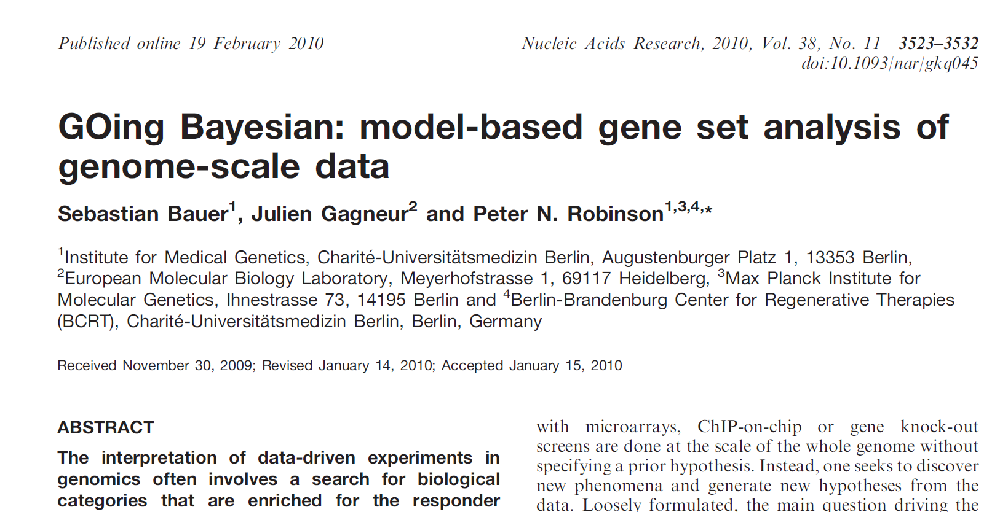
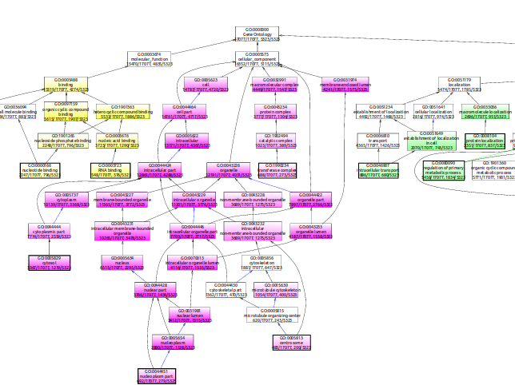
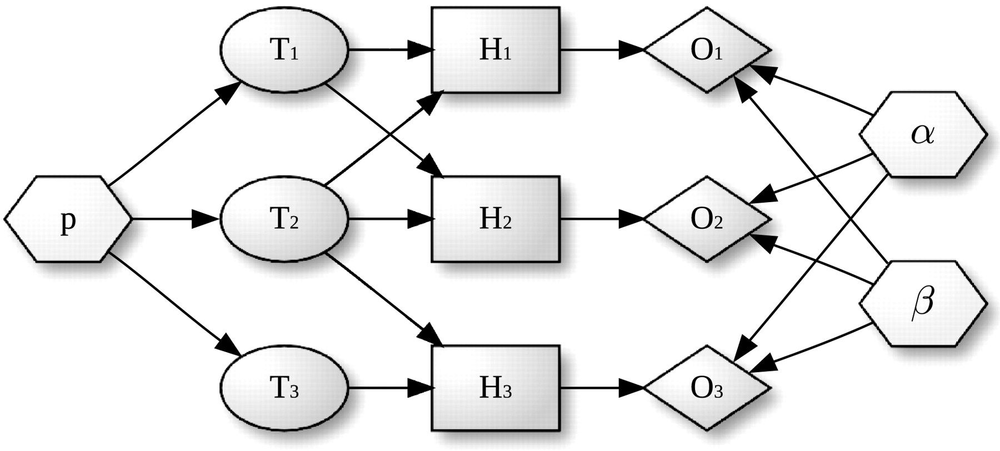
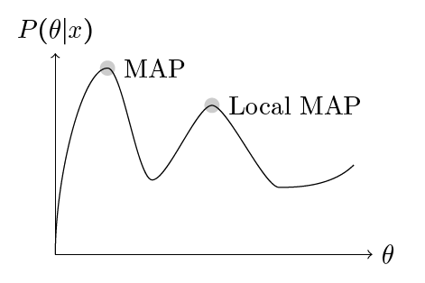
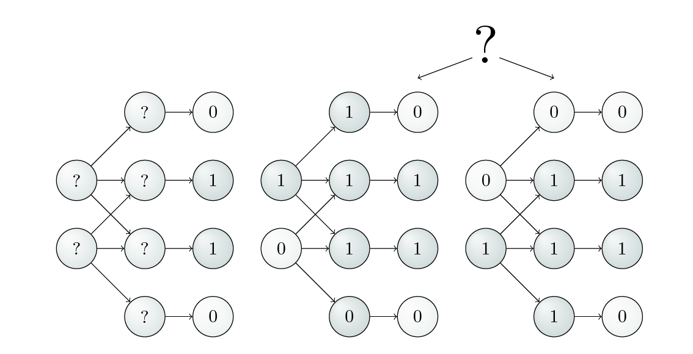
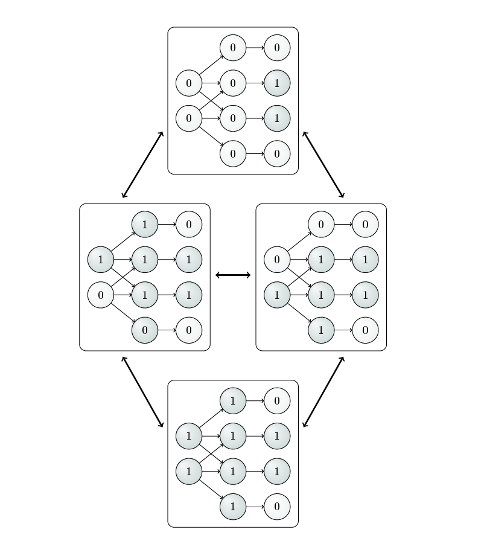
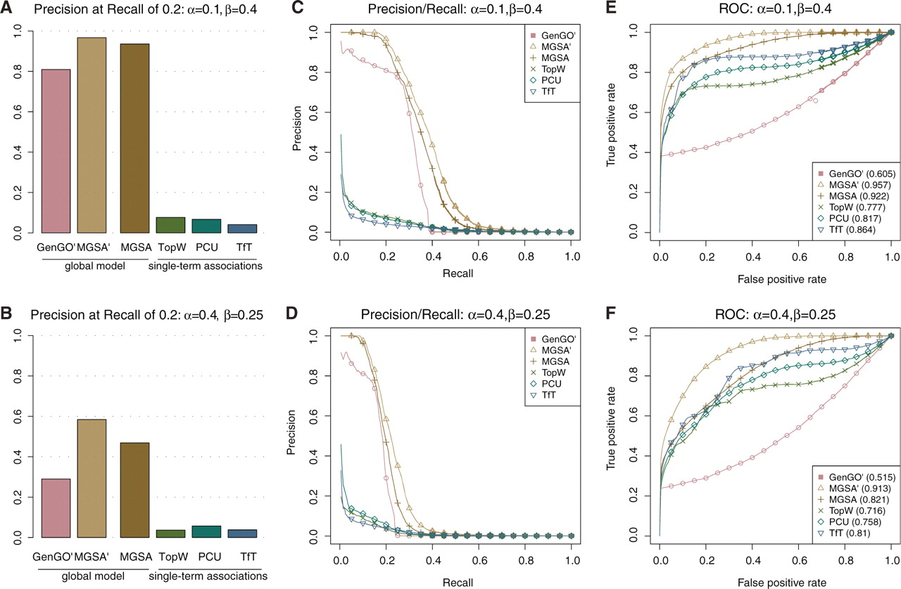

## Overview

- [Problems with term-for-term approach](#tftprob)
- [Markov chains](#markovchain)
- [MCMC](#mcmc)
- [Metropolis-Hastings](#mh)
- [MGSA](#mgsa)

## Problems with the term-for-term approach {#tftprob}

::: {.hidden}
$$
\newcommand{\argmax}{\mathop{\mathrm{arg\,max}\;}\limits}
$$
:::

:::: {.columns}

::: {.column width="50%"}

::: {.callout-important appearance="simple"}
We have seen in the previous chapter that a major difficulty of the standard approach to GO overrepresentation analysis is that each term is analyzed in isolation.
:::

* Because of the statistical dependencies between terms that are close to one another in the ontology graph, if one term is called significant then commonly one or more related terms are also called significant.
* Today, we will discuss a Bayesian algorithm for GO analysis that improves upon the "term-for-term" approach we saw last week.

:::
::: {.column width="50%"}

{fig-align="center" width="100%"}
:::
::::


## Problems with the term-for-term approach

{fig-align="center" width="60%"}

* Note how there seems to be a dependency between parent and child terms.
* The distribution of significant terms is not uniform across all 44,797 GO terms.

---

## Model based gene-set analysis (MGSA)

::: {.callout-tip appearance="simple"}
MGSA is a completely different approach to GO analysis that seeks to find the best combination of terms that correspond to an experimental result.
:::

* To understand MGSA, we will first need to review several topics
  - Markov chains
  - MCMC algorithms
  - Metropolis Hastings


## Markov Chain Monte Carlo (MCMC) 

- A Monte Carlo method approximates a quantity using random sampling instead of exact calculation

{width=50% fig-align="center"}

- A Markov chain is a sequence of random variables where the next value depends only on the current value, not on the full history that came before it. 


## Markov Chain {#markovchain}


```{python}
#| echo: false
#| fig-width: 5
#| fig-height: 3
#| out-width: "100%"
#| fig-align: center
import sys
sys.path.append('utils') 
from mcmc_plots import mcmc_sunny_cloudy
mcmc_sunny_cloudy(figsize=(5,3))
```

A Markov chain has a 

- **state space**: Sunny, Cloudy 
- **Transition probabilities**: for instance, $p(\mathrm{sunny}|\mathrm{cloudy})=0.5$
- **Markov assumption**: The next state depends only on the current state, not on what came before:
$$
p(w_{t+1}|w_{t}, w_{t-1}, \ldots, w_{t}) = p(w_{t+1}|w_{t})
$$


## Markov Chain

```{python}
#| echo: false
#| fig-width: 5
#| fig-height: 3
#| out-width: "100%"
#| fig-align: center
import sys
sys.path.append('utils') 
from mcmc_plots import mcmc_sunny_cloudy
mcmc_sunny_cloudy(figsize=(5,3))
```

We can represent the transition probabilities in matrix form

$$
\mathbf{P}=
\begin{array}{c|cc}
w_{t-1}\backslash w_t & s & c \\
\hline
s & 0.3 & 0.7 \\
c & 0.5 & 0.5 \\
\end{array}
$$


## Markov Chain

::: {.mybox}
**Key question**:

- Will the chain achieve steady state if it runs for a long enough time?
:::

$$
\begin{array}{c|cccc}
  & w_0 & w_1 &  w_2& \ldots & \\
\hline
p(\mathrm{sunny})& 1 & 0.3 & 0.44 & \ldots & \pi_1 \\
p(\mathrm{cloudy})& 0 & 0.7 & 0.56 & \ldots & \pi_2 \\
\end{array}
$$

- In this example, we start the chain at time zero as a sunny day -- so $p(\mathrm{sunny})= 1$ and $p(\mathrm{cloudy})= 0$
- We can calculate the probabilities at each iteration using the transition probabilities for each state
- The question is whether these probabilities converge to steady state probabilities $\pi_1$ and $\pi_2$?

## Markov Chain

- Under certain assumptions they do
- With our example, we have

$$
\begin{align}
\mathbf{\pi}\begin{bmatrix}0.3 & 0.7\\0.5 & 0.5\end{bmatrix} &= \mathbf{\pi} \\
\begin{bmatrix}\pi_1 & \pi_2\end{bmatrix}\begin{bmatrix}0.3 & 0.7\\0.5 & 0.5\end{bmatrix} &= \begin{bmatrix}\pi_1 & \pi_2\end{bmatrix} \\
\begin{bmatrix}(0.3\pi_1 + 0.5\pi_2) & (0.7\pi_1 + 0.5\pi_2)\end{bmatrix} &= \begin{bmatrix}\pi_1 & \pi_2\end{bmatrix} \\
\end{align}
$$

- Given that $\pi_1 + \pi_2=1$, we have
$$
\begin{align}
0.3\pi_1 + 0.5\pi_2 &= \pi_1 \\
0.3\pi_1 + 0.5(1-\pi_1) &= \pi_1 \\
1.2\pi_1 &= 0.5 \\
\pi_1 &=\frac{5}{12} \quad \text{ and similarly, } \pi_2 =\frac{7}{12}
\end{align} 
$$


## MCMC

- With MCMC, our samples are drawn from a Markov chain of states
- We simulate draws (i.e., Monte Carlo) from this chain
- The chain will reflect our target distribution
- MCMC is usually used in Bayesian settings:

$$
\begin{equation}
p(\theta \mid \text{data}) =
\frac{\overbrace{p(\text{data}\mid\theta)}^{\text{likelihood}} \cdot \overbrace{p(\theta)}^{\text{prior}}}
{\underbrace{p(\text{data})}_{\text{evidence } = NC}}
\end{equation}
$$

- $\theta$ is our model (e.g., Normal distribution with specified $\mu, \sigma^2$)
- By assumption, we are able to calculate the prior and we can calculate the likelihood for a given data point 
- With complicated models, we are not able to calculate the normalizing constant $NC=p(\text{data})$
- Thus, Obtaining independent samples from a given distribution $P(x)$ is often not easy.

## Why is sampling from some distributions hard?

If $P(x)$ can be evaluated, at least to within a multiplicative constant; that is, we can
evaluate a function $g(x)$ such that

$$
P(x) = \frac{g(x)}{NC}
$$

-  the problem of drawing samples from P(x) is  a challenging one, especially in high-dimensional spaces,
because there is no obvious way to sample from $P$ without enumerating most
or all of the possible states.
- Correct samples from P will by definition tend
to come from places in x-space where P(x) is big; how can we identify those
places where P(x) is big, without evaluating P(x) everywhere? 
- It is easy to draw samples from a high-dimensional Gaussian, but this is not true in general
- In Bayesian setting, $g(x)=p(x\mid\theta)p(\theta)$ and can be easily evaluated

## MCMC

- For instance, there are roughly 35,000 GO terms. If we want to model the distrivution of terms, each one of which can be on or off, 
then roughly speaking there are the following number of combinations^[The true number is less because some combinations are not valid because of the true path rule]
$$
2^{35000} \approx 1.12\times 10^{10536}
$$
- This is an insanely large number, more than the number of atoms in the universe (ca.$10^{80}$)
- A useful analogy: Imagine the tasks of drawing random water samples from a lake and finding
the average plankton concentration. 
  - We can use a boat and sample the plankton concentration $g(x)$ at any location $x$
  - We need to draw 1 cm3 water samples at random from the lake, in
such a way that each sample is equally likely to come from any point within
the lake
  - We do not know if the lake is largely of the same depth or if there are several narrow, deep underwater canyons
  - Thus it is very difficult to sample uniformly from the lake

::: {.tiny-credit}
David J. C. MacKay (2003) Information Theory, Inference and Learning Algorithms. Cambridge University Press
:::

## MCMC

- MCMC methods construct the sequence of samples as a **Markov chain** — each sample depends only on the previous one 

```{python}
#| echo: false
#| fig-width: 5
#| fig-height: 3
#| out-width: "100%"
#| fig-align: center
import sys
sys.path.append('utils') 
from mcmc_plots import burn_in
burn_in()
```

- The chain starts at an arbitrary state and wanders before settling into the target distribution's high-density region — this initial stretch is the **burn-in period**
- After burn-in, the chain's samples $x_i$ are (approximately) drawn from $p(x)$ 
- Discarding the burn-in samples, we estimate the mean of $p(x)$ from the remaining $N$ chain samples:


$$
\hat{\mu} = \frac{1}{N}\sum_{1}^{N}x \qquad x_i \sim p(x) \text{ (approximately, post burn-in)}
$$

## MCMC

::: {.mybox}
- But how do we cause the chain to sample from the target distribution?
:::

- Design the transition probabilities $T(y\mid x)$ to satisfy the **detailed balance condition**:
$$
p(x)\,T(y\mid x) = p(y)\,T(x\mid y)
$$
- Sum both sides over all values of $x$:
$$
\begin{align}
\sum_x p(x)\,T(y\mid x) &= \sum_x p(y)\,T(x\mid y) \\
&= p(y) \underbrace{\sum_x T(x\mid y)}_{=1 \text{, since } T(\cdot\mid y) \text{ is a valid distribution}} \\
&= p(y)
\end{align}
$$

- Here, $x$ and $y$ are the discrete states (e.g., sunny and rainy)


## Verifying detailed balance condition for the weather

- Detailed balance requires, for **every pair** of states $x,y$:
$$
p(x)\,T(y\mid x) = p(y)\,T(x\mid y)
$$
- Assume we are in the stationary distribution sunny: $S =\frac{5}{12}$ and cloudy: $C =\frac{7}{12}$
$$
\underbrace{p(S)\,T(C\mid S)}_{\frac{5}{12}\times 0.7 \,=\, \frac{7}{24}} \;=\; \underbrace{p(C)\,T(S\mid C)}_{\frac{7}{12}\times 0.5 \,=\, \frac{7}{24}} \quad\checkmark
$$
- Thus, $p$ is a stationary distribution — we can also check directly:
$$
\sum_x p(x)\,T(S\mid x) = \underbrace{\tfrac{5}{12}\times 0.3}_{\text{stay Sunny}} + \underbrace{\tfrac{7}{12}\times 0.5}_{\text{Cloudy}\to\text{Sunny}} = \tfrac{15}{120} +  \tfrac{35}{120}= \tfrac{5}{12} = p(S) \quad\checkmark
$$
- So: if the chain is currently 5/12 Sunny, 7/12 Rainy, thus, **$p$ is unchanged by a step of the chain** — i.e., $p$ to be a **stationary distribution**

## Metropolis-Hastings {#mh}

- The Metropolis-Hastings (MH) algorithm is a general method for constructing a transition kernel $T$ that samples from an arbitrary target distribution $p$, using a **proposal** and an **acceptance** step
- $q(y\mid x)$ is the proposal — a candidate generator that **proposes** which state *might* come next
- $ a(x,y)$ is the acceptance - what is the probability we accepted the proposed next term?
- The transition kernel combines proposal and acceptance:
$$
T(y\mid x) = q(y\mid x)\cdot a(x,y) \qquad (y \neq x)
$$
- Rejected proposals mean the chain **stays put** — this adds a self-transition term:
$$
T(x\mid x) = q(x\mid x) + \sum_{y\neq x} q(y\mid x)\big(1-a(x,y)\big)
$$

## Metropolis-Hastings 

- $a(x,y)$ is defined as:
$$
a(x,y) = \min\!\left(1,\ \frac{p(y)\,q(x\mid y)}{p(x)\,q(y\mid x)}\right)
$$
- It's $T$ — not $q$ — that needs to satisfy the detailed balance condition
- $a$ is *designed* so that $T = q\cdot a$ satisfies detailed balance for **any** valid proposal $q$

## MH — Proof (continued)

- Let us first examine the case where the proposal distribution is symmetric, i.e., $q(y\mid x)=q(x\mid y)$.
- This class of algorithms are known as Metropolis algorithms and are a special case of MH algorithms

- Let $x, y$ be two states with $p(y) < p(x)$. Then we get
$$
\begin{align}
a(x,y) &= \min\!\left(1,\ \frac{p(y)\,q(x\mid y)}{p(x)\,q(y\mid x)}\right) \\
&= \min\!\left(1,\ \frac{p(y)}{p(x)}\right) \\
&=  \frac{p(y)}{p(x)} \quad \bullet \text{ because } p(y) < p(x)\\
\end{align}
$$

- The Metroplis algorithm (and the MH algorithm) draw a uniformly distributed random number $r\in [0,1]$ and choose to transition to state $y$ if $r<a(x,y)$
- Thus in this case, it will not always choose to do so because $\tfrac{p(y)}{p(x)} < 1$,


## MH — Proof (continued)

- What about the reverse move, $y \to x$? Since $p(x) > p(y)$, moving to $x$ only *increases* probability, so we always accept:
$$
a(y,x) = \min\!\left(1,\ \frac{p(x)}{p(y)}\right) = 1 \qquad \bullet \text{since } \tfrac{p(x)}{p(y)} > 1
$$
- Now check detailed balance, $p(x)T(y\mid x) \overset{?}{=} p(y)T(x\mid y)$, using $T(y\mid x) = q(y\mid x)\,a(x,y)$:
$$
p(x)\,T(y\mid x) = p(x)\,q(y\mid x)\,a(x,y) = p(x)\,q(y\mid x)\cdot\frac{p(y)}{p(x)} = q(y\mid x)\,p(y)
$$
$$
p(y)\,T(x\mid y) = p(y)\,q(x\mid y)\,a(y,x) = p(y)\,q(x\mid y)\cdot 1 = q(x\mid y)\,p(y)
$$

## MH — Proof (continued)

- These are equal **provided $q$ is symmetric**, i.e. $q(y\mid x) = q(x\mid y)$:
$$
p(x)\,T(y\mid x) = q(y\mid x)\,p(y) = q(x\mid y)\,p(y) = p(y)\,T(x\mid y) \qquad\checkmark
$$
- So for a symmetric proposal, this simplified acceptance rule — accept automatically if $p(y)\geq p(x)$, otherwise accept with probability $p(y)/p(x)$ — guarantees detailed balance
- This is **Metropolis**, i.e., the proposal distribution is symmetric
- In the general case (**Metropolis-Hastings**),  if $q$ isn't symmetric, the $q(y\mid x)$ and $q(x\mid y)$ terms above don't cancel


## MH — Proof (continued): the general case

- Drop the assumption $p(y) < p(x)$ — the general proof works for **any** two states, no case split needed
- Write out $a(x,y)$ and $a(y,x)$ using the full MH formula:
$$
a(x,y) = \min\!\left(1,\ \frac{p(y)\,q(x\mid y)}{p(x)\,q(y\mid x)}\right), \qquad
a(y,x) = \min\!\left(1,\ \frac{p(x)\,q(y\mid x)}{p(y)\,q(x\mid y)}\right)
$$
- Now compute $p(x)\,T(y\mid x) = p(x)\,q(y\mid x)\,a(x,y)$:
$$
p(x)\,q(y\mid x)\,a(x,y) = p(x)\,q(y\mid x)\cdot\min\!\left(1,\ \frac{p(y)\,q(x\mid y)}{p(x)\,q(y\mid x)}\right)
$$
- Pull $p(x)\,q(y\mid x)$ **inside** the $\min(\cdot)$ (valid since it's a positive constant):
$$
= \min\!\Big(p(x)\,q(y\mid x),\ \ p(y)\,q(x\mid y)\Big)
$$
- By the same steps, $p(y)\,T(x\mid y) = p(y)\,q(x\mid y)\,a(y,x)$ simplifies to:
$$
p(y)\,q(x\mid y)\,a(y,x) = \min\!\Big(p(y)\,q(x\mid y),\ \ p(x)\,q(y\mid x)\Big)
$$

## MH — Proof (continued): the general case

- Thus
$$
p(x)\,T(y\mid x) = \min\big(p(x)q(y\mid x),\ p(y)q(x\mid y)\big) = \min\big(p(y)q(x\mid y),\ p(y)q(y\mid x)\big) = p(y)\,T(x\mid y) \qquad\checkmark
$$
- **Detailed balance holds exactly**, for *any* proposal $q$ — symmetric or not, and regardless of which of $p(a), p(b)$ is larger
- Recall from earlier: **detailed balance $\Rightarrow$ stationarity** — summing both sides over $a$ recovers $\sum_x p(x)\,T(y\mid x) = p(y)$
- So **$p$ is guaranteed to be a stationary distribution of the MH chain**, regardless of how the proposal $q$ is designed
- What's *not* guaranteed by this proof alone: that the chain actually **converges** to $p$ from an arbitrary starting point — that requires $q$ to make the chain irreducible and aperiodic (ergodicity), a separate condition on your choice of $q$


# MH Algorithm - Example

- Up to now, we have been discussing application of the MH to discrete state spaces
- However, it is applicable also to continuous state spaces

|    | Discrete | Continuous |
|----|----------|------------|
| state space | finte or countable set | Interval of $\mathbb{R}$ or $\mathbb{R}^{n}$ |
| $p(x)$   | a probability mass function | a density |
| normalization | $\sum_x p(x) = 1$ | $\int p(x) dx = 1$ |
| Detailed balance | $\sum_x p(x) T(y\mid x) = p(y)$ | $\int p(x) T(y\mid x) dx = p(y)$ | 


::: {.mybox}
**Example**

- In the following, we will use the MH algorithm to generate samples from a normal distribution with mean 0 and standard deviation 1
:::

## Example 

- i.e., we want to generate samples $x_1, x_2, \ldots, x_n$ with 
$$
x_t \sim \mathcal{N}(\mu=0, \sigma^2=1)
$$

* Start the MCMC at $x_0=0$
* Propose moves from current value $x_t \rightarrow x_{t+1}$ with a uniform transition kernel:
$$
q(x_t, x_{t+1})\sim \mathcal{U}\left(x_t - \frac{1}{2}, x_t + \frac{1}{2}\right)
$$
* That is, given the chain's current position $x_t$, the proposed next value $x_{t+1}$ is drawn uniformly at random from the interval centered on 
$x_t$, with width 1. Every point in that interval is equally likely.

$$
q(x_t, x_{t+1}) = \begin{cases}
1 & x_{t+1} \in (x_t - \frac{1}{2},x_t + \frac{1}{2}) \\
0 & \text{otherwise}
\end{cases}
$$

## Hastings ratio

- We accept moves according to the Hastings ratio, $h=\min\left(1, \frac{p(x)q(y\mid x)}{p(y)q(x\mid y)}\right)$
- Since we are using an uniform transition kernel, $q(y\mid x) = q(x\mid y)$ and thus $h=\min\left(1, \frac{p(x)}{p(y)}\right)$
- In implementations, we generally transform to log space to avoid numerical problems
- Recalling that our target disttribution is a normal distribution, we obtain

$$
\begin{align}
\log h &= \log \frac{p(a)}{p(b)}\\
&= \log \frac{\frac{1}{\sqrt{2\pi}\sigma}e^{-\frac{(x-\mu)^2}{2\sigma^2}}}{\frac{1}{\sqrt{2\pi}\sigma}e^{-\frac{(y-\mu)^2}{2\sigma^2}}}\\
&= \log \frac{e^{-\frac{(x-\mu)^2}{2\sigma^2}}}{e^{-\frac{(y-\mu)^2}{2\sigma^2}}}\\
&= \frac{1}{2\sigma^2}\left[ (x-\mu)^2 - (y-\mu)^2\right]
\end{align}
$$

- We sample a random number $r$ uniformly from the interval $[0,1]$. If $h < r$, then we accept the proposal and advance the chain from $x$ to $y$. If not, we remain at $x$.


## MCMC: Run with start position $x_0=0$, $d=10$


```{python}
#| echo: false
#| fig-width: 5
#| fig-height: 3
#| out-width: "100%"
#| fig-align: center
import sys
sys.path.append('utils') 
from mcmc_plots import run_metropolis_mcmc
run_metropolis_mcmc(start_val=0.0, n_steps=5000, proposal_width=10.0)
```

::: {.small-text}
- Top panel ("trace"): The value $x_t$ at each iteration
- Acceptance rate of about 33% is considered optimal
:::

## MCMC: Run with start position $x_0=0$, $d=0.1$


```{python}
#| echo: false
#| fig-width: 5
#| fig-height: 3
#| out-width: "100%"
#| fig-align: center
import sys
sys.path.append('utils') 
from mcmc_plots import run_metropolis_mcmc
run_metropolis_mcmc(start_val=0.0, n_steps=5000, proposal_width=0.1)
```

::: {.small-text}
- Very small proposal width, so that we have not reached true distribution for much of the run
- Very high acceptance rate 
- The chain has not (yet) explored the entire space
:::

## MCMC: Run with start position $x_0=0$, $d=100$


```{python}
#| echo: false
#| fig-width: 5
#| fig-height: 3
#| out-width: "100%"
#| fig-align: center
import sys
sys.path.append('utils') 
from mcmc_plots import run_metropolis_mcmc
run_metropolis_mcmc(start_val=0.0, n_steps=5000, proposal_width=100)
```

::: {.small-text}
- Very large proposal width
- The chain often proposes values very far away from the true value, so there is a Very low acceptance rate
:::


## MCMC: Run with start position $x_0=-1000$, $d=10$


```{python}
#| echo: false
#| fig-width: 5
#| fig-height: 3
#| out-width: "100%"
#| fig-align: center
import sys
sys.path.append('utils') 
from mcmc_plots import run_metropolis_mcmc
run_metropolis_mcmc(start_val=-1000.0, n_steps=5000, proposal_width=10)
```

::: {.small-text}
- We start very far away from the true distribution
- It takes the chain about 1000 iterations, but it does seem to reach the true distribution
- The chain has a dependency on the starting distribution
:::

## MCMC: Wrap-Up

- We have provided a very first introduction to MCMC
- Our examples have shown the need for a burn-in phase to allow the chain to reach the true distribution 
- The MGSA algorithm applies the Metropolis Hastings algorithm to the task of finding an optimal combination of GO terms to "explain" a set of differentially expressed genes.


## MGSA

* MGSA assumes that the experiment attempts to detect genes that have a particular `state` (such as differential expression),
which can be `ON` or `OFF`. The true state of any gene is hidden. 
* The experiment and its associated analysis provide observations of the gene states
that are associated with unknown  false positive ($\alpha$) and  false negative rates
($\beta$), which we will assume to be identical and independent for all genes.
* For instance, in the setting of a microarray experiment, the `ON` state
would correspond to differential expression, and the `OFF` state would
correspond to a lack of differential expression of a gene. Our model hence
assumes that differential expression is the consequence of the
annotation to some terms that are `active`.

::: {.callout-note appearance="simple"}

 An additional parameter $p$ represents the prior probability of a term being
in the `active` state. The probability $p$ is typically low (less
than 0.5), which has the effect of introducing a penalization for
increasing the number of active terms. This favors results that
identify a relatively low number of `active` terms.

:::


## Structure of the MGSA Network

Gene categories, or terms ($T_i$) that constitute the first layer can be either
`active` or `inactive`. 

* Terms that are `active` activate the hidden state
($H_j$) of all genes annotated to them, with the other genes remaining `OFF`. 
* The
observed states ($O_j$) of the genes are noisy observations of
their true hidden state. 
* The parameters of the model (dashed nodes) are the
prior probability of each term to be `active`, $p$, the false positive rate, $\alpha$,
and the false negative rate, $\beta$.

{fig-align="center" width="100%"}


## Structure of the MGSA Network}

::: {.callout-note appearance="simple"}
  More formally, the model can be described using a Bayesian network with three
layers that is augmented with a set of parameters.

:::

* A *term layer* $T=\{T_1,\ldots,T_m\}$ that consists of Boolean nodes
 corresponding to $m$ terms of the ontology. 
* There is a Boolean variable
 associated with each node that can have the state values `active` (1) or `inactive` 
(0). 

## Structure of the MGSA Network


::: {.callout-note appearance="simple"}
  More formally, the model can be described using a Bayesian network with three
layers that is augmented with a set of parameters.
:::


* A *hidden layer* $H=\{H_1,\ldots,H_n\}$ that contains Boolean nodes
 representing the $n$ annotated genes. There are edges
 from the terms to the genes they annotate.
* For instance, if gene $H_1$ is annotated to terms $T_1$ and $T_2$ then there is an edge between 
$T_1$ and $H_1$
 and another edge between $T_2$ and $H_1$. The state of the nodes reflects the
 true activation pattern of the genes. Each node can have the state
values `ON` (1), or `OFF` (0). 
* An **observed layer**: $O=\{O_1,\ldots,O_n\}$ that contains Boolean
 nodes reflecting the state of all observed genes. The observed gene state nodes are
 directly connected to the corresponding hidden gene state nodes in a
 one-to-one fashion.
* A *parameter set* that contains continuous nodes with values in
 $[0,1]$ corresponding to the parameters of the model $\alpha$, $\beta$ and
 $p$. These parameterize the distributions of the observed and the term layer
 as detailed below.
 
##  The MGSA model


::: {.callout-note appearance="simple"}
   For didactic purposes, we will initially explain a simplified version
of MGSA in which the parameters $\alpha$, $\beta$ and $p$ are considered to
have known, fixed values.
:::


The state propagation of the nodes can be modeled using various __local
probability distributions__ (LPDs), denoted by $P$. The joint probability
distribution for this Bayesian network can be written as

$$
  P(T,H,O) \; = \; P(T)P(H|T)P(O|H)\;  = P(T)\prod_{i=1}^n
  P(H_i|T) P(O_i|H_i).
$$ {#eq-joint-general}

## T: The Term layer

* The state of each term $T_j\in T$ is modeled according to a Bernoulli
distribution with hyperparameter $p$, i.e, $P(T_j=1)=p$. 
* Denoting by
$m_{x|T}$ the number of terms that have state $x$ for a given $T$,
i.e., $m_{x|T}=|\{j|T_j=x\}|$. 

then

$$
 P(T) = p^{m_{1|T}}(1-p)^{m_{0|T}}.
$$ {#eq-prior}

* Thus, $p$ is the probability that a given term is `on`.

## H: The hidden layer
 In the following, $T(H_i) \subseteq T$ is used to denote the set of
terms to which gene $H_i$ is annotated, i.e., the parents of $H_i$ in
the Bayesian network. For
the $T \rightarrow H$ links, any node $H_i \in H$ is `ON`
($H_i=1$) if at least one of its parents is `active`. Otherwise it
is `OFF`:

$$
P(H_i=1|T) = \begin{cases}1, & \text{if } \exists \; T_j \in T(H_i): T_j=1 \\ 0, &
\text{otherwise.} \end{cases}
%P(H_i|\emph{Pa}(H_i)) = \bigvee_{T\in\emph{Pa}(H_i)}T
\label{eqn:lpd.hidden.given.t}
$$ {#eq-lpd-hidden-given-t}

Note that this transition is deterministic.

*  The hidden nodes correspond to genes that are annotated by GO terms. If a GO term is `ON`, 
then in the MGSA model any annotated gene is (truly) `ON`.

## O: The observed layer

 For the $H \rightarrow O$
connection, the following two Bernoulli distributions are used:

$$
P(O_i=1|H_i=0) = \alpha
\label{eq:mgsa-bernoulli-alpha}
$$

and

$$
P(O_i=0|H_i=1) = \beta.
\label{eq:mgsa-bernoulli-beta}
$$

* The observed nodes correspond to the genes whose expression is observed by microarray 
analysis of RNA-seq etc. According to our model, they may be `OFF`, although the hidden node is 
`ON` (false negative) etc. 
* Note that this model is not intended to provide an accurate view of 
biology, but seems to work well for the task at hand

## Fully specified MGSA Network

{fig-align="center" width="100%"}


## MGSA

* Denote by $n_{xy|T} = |\left\{ i|O_{i}=x \wedge
  H_{i}=y\right\} |$ the number of genes having observed activation
$x$ and true activation $y$ according to the states of $T$. 
* For
instance, $n_{01|T}$ corresponds to the number of genes
observed to be not differentially expressed but whose true activation
state is `ON`. 
* Then, by considering the LPDs of nodes, one gets
the following product of Bernoulli distributions for $P(O|T)=
\prod_{i=1}^n P(H_i|T) P(O_i|H_i)$:

  
$$
P(O|T) = \alpha^{n_{10|T}} (1 - \alpha)^{n_{00|T}}
(1-\beta)^{n_{11|T}} \beta^{n_{01|T}}.
$$

## MGSA

$$
P(O|T) = \alpha^{n_{10|T}} (1 - \alpha)^{n_{00|T}}
(1-\beta)^{n_{11|T}} \beta^{n_{01|T}}.
$$ {#eq-alpha-beta-score}


* Hence, @eq-alpha-beta-score calculates the product
over $i=0,1$ of the probability of the observed states of the genes
given the hidden states of the terms. 
* For instance, for $i=1$, we need
only consider hidden nodes whose parents include `active`
terms, because otherwise their probability is zero according to @eq-lpd-hidden-given-t.
* Using @eq-prior
with $p=\beta$, we obtain that $P(H_1|T) P(O_1|H_1)=1\times P(O_1|H_1) =
(1-\beta)^{n_{11|T}}
\beta^{n_{01|T}}$. 
* Similar considerations for $i=0$ lead
to the final expression for @eq-alpha-beta-score.


## MAP: Maximum a postgeriori

::: {.callout-note appearance="simple"}
   In Bayesian statistics, maximum a posteriori (MAP) estimation is often
used to generate an estimate of the maximum value of a probability
distribution. 
:::

That is, if $x$ is used to refer to the data ($x$ can be
an arbitrary expression), and $\theta$ is used to refer to the
parameters of a model, then Bayes' law states that:

$$
P(\theta | x) = \dfrac{P(x|\theta )P(\theta )}{P(x)}
\label{eq:bayes-law-for-map}
$$

## MAP: Maximum a posteriori

* The term $P(\theta | x)$ is referred to as the posterior probability,
and specifies the probability of the parameters $\theta$ given the
observed data $x$. 
* The denominator on the right-hand side can be
regarded as a normalizing constant that does not depend on $\theta$,
and so it can be disregarded for the maximization of $\theta$. 
* The MAP
estimate of $\theta$ is defined as:
 
$$
 \argmax_{\theta} P(\theta | x) = \argmax_{\theta} P(x|\theta )(P(\theta )
\label{eq:map}
$$

## MAP: Maximum a posteriori

*  In the case of MGSA, the parameters comprised by $\theta$ would
include the set of `active` terms as well as values for
$\alpha,\beta$, and $p$. 
* Although MAP estimation procedures are often relatively simple to
implement, they tend to have the disadvantage that they ``get stuck'' in
local maxima  without being
able to offer a guarantee of finding the global maximum.
 
{fig-align="center" width="50%"}
 
## MAP: Shortcomings?
 
*  In
complicated networks such as that of MGSA, it is \textbf{rare to have a single
solution} that is substantially better than all alternative
solutions. 
* Rather, the posterior probability is usually spread over a
number of alternative network configurations. This implies that the
posterior probability is not adequately represented by a single
configuration $\theta^{MAP}$
* It is more appropriate to
sample networks from the posterior probability, leading to a
__collection of networks with high posterior probability__, each of
which offers a good explanation of the data. 


::: {.callout-note appearance="simple"}
These considerations motivate the
use of the MCMC algorithm to sample from the posterior distribution.
:::


## MAP: Shortcomings?

 {fig-align="center" width="80%"}


*  the optimization problem addressed by
  genGO and MGSA is known to be NP-complete. 
*  We observe that
  gene 2 and 3 are in the `ON` state (e.g., differentially
  expressed).
*  If $T_1$ were the only `active` term, then the observation
  could be explained by risking an error of one false-negative. The
  same can be noticed if $T_2$ is the only `active` term.
* thus there is no
  single optimum solution. A single MAP solution does not account for
  this.

## Monte Carlo Markov Chain Algorithm

* A different approach is to calculate the marginal probabilities for
each term being in the `active` state. 
* In general, if a joint
probability is defined over two random variables $X$ and $Y$ as
$P(X,Y)=P(X|Y)P(Y)$, then the marginal
probability for $X=x'$ is calculated by summing or integrating over all
possible values of $Y$:

$$
 P(X=x')=\sum_{i} P(X=x',Y=y_i)
$$

  or

$$
P(X=x')=\int_Y P(X=x',Y) \mathrm{d}Y
$$ 

## MCMC

* It is often difficult or
impossible to derive marginal probabilities for complicated
probability distributions because there are simply too many possible
configurations of the variables to be able to calculate each one, as
would be required for an analytical solution. 
* For this reason, a
number of estimation algorithms have been developed that in essence
sample from the distribution of the posterior probability and take the
proportion of samples in which $X$ takes on some specific value
$x'$ as an estimate of the posterior probability of $x'$  

::: {.callout-note icon=false, title="MCMC"}

 One of the best known and most effective algorithms for this purpose
is the Metropolis-Hasting algorithm, which is a Markov chain Monte
Carlo (MCMC) method. The
MCMC algorithm performs a random walk over the term and parameter
configurations, which asymptotically provides a random sampler
according to the target distribution $P(T|O)$.

:::

## MCMC

 Given the current configuration of the terms denoted by $T^t$, the algorithm
proposes a neighbor state $T^p$ in accordance to a proposal density function
$Q_T(\cdot|T^t)$. A value $r$ is sampled uniformly from the range (0,1). Then,
if

$$
 r < P_{\text{accept}}(T^t,T^p) = 
 \frac{P(T^{p}|O)Q_T(T^{t}|T^{p})}{P(T^{t}|O)Q_T(T^{p}|T^t)}
 \label{eqn:acceptance}
$$

the proposal is accepted, i.e., $T^{t+1} = T^p$, otherwise it is rejected,
i.e., $T^{t+1} = T^t$.


## MCMC
 
 Using Bayes' law, we have

$$
 P(T^{p}|O) = \dfrac{P(O|T^{p})P(T^{p})}{P(O)}
 \label{eqn:cond.prob}
$$

and similarly for $T^{t}$. Substituting these expressions for $P(T^{p}|O)$ and
$P(T^{t}|O)$ cancels out the normalization constant $P(O)$. The acceptance
probability is then:

$$
 P_{\text{accept}}(T^t,T^p) = 
 \frac{P(O|T^{p})P(T^{p})Q_T(T^{t}|T^{p})}{P(O|T^{t})P(T^{t})Q_T(T^{p}|T^t)}.
\label{eqn:accept.prop.2}
$$ {#eq-accept-prop-b}


*  We have $P(O|T)$ and $P(T)$ from the statement of the MGSA network

## MCMC
@eq-accept-prop-b is used iteratively to define a
random walk through the space of configurations.  A __burn-in
  period__ consisting of a certain number of iterations is used to
initialize the MCMC chain (in our implementation of the MGSA algorithm
in the Ontologizer, the default is 20,000
iterations). 

* Following this, $l$ further iterations (by default,
$10^6$) are performed.  Let $C(T_i)$ be the number of samples in which
term $T_i$ was `active`. Then

$$
P(T_i|O)\approx \frac{C(T_i)}{l}.
\label{eqn:mgsa-marginal}
$$

## MCMC

::: {.callout-note appearance="simple"}
 In order to finish the description of the algorithm, one needs to define
classes of operations of which a proposal is chosen, that is, we need to
specify $Q_T(T^p|T^t)$.
:::


  Denote by $T^p \leftrightarrow_T T^t$ the binary
relation that  states  that $T^p$   be constructed from $T^t$ by either

* toggling the `active`/`inactive` state of a single term, or by
* exchanging the state of a pair of terms that contains a single
    `active` term and a single `inactive` term.

## MCMC

 Denote by $N(T)$ the __neighborhood__ of a given configuration for
$T$, that is, the number of different operations that can be applied
once to $T$ in order to get a new configuration. At first, there are
$m$ terms in total, each of which can be toggled. In addition, there
are $m_{0|T}m_{1|T}$ possibilities to combine
terms that are `active` with terms that are `inactive`.
Thus, there are a total of $N(T)=m+m_{0|T}m_{1|T}$
valid state transitions. We would like to sample the valid proposals
with equal probability; therefore, the proposal distribution $Q_T$ is
determined by


$$
 Q_T(T^p|T^t)=\begin{cases}
                  \frac{1}{N(T^t)}, & \text{if } T^p \leftrightarrow_T
                  T^t\\ 0, & \text{otherwise.}
               \end{cases},
$$

which we can use to rewrite @eq-accept-prop-b to:

\newcommand{\acceptratio}{\frac{P(O|T^{p})P(T^{p})N(T^t)}{P(O|T^{t})P(T^{t})N(T^p)}}

$$
 P_{\text{accept}}(T^t,T^p) = 
 \acceptratio.
\label{eqn:accept.prop.3}
$$

## MCMC State transitions for MGSA

{fig-align="center" width="80%"}


## MGSA

::: {.pseudocode}
**Require:** $O$, $l$ (number of steps)

1. $T^t \gets (0,\ldots,0)$
2. **for** $t \gets 1$ **to** $l$ **do**
   - $T^p \sim Q_T(\cdot\,|\,T^t)$, i.e., choose a neighbor by:
     - toggling a term
     - exchanging an active term with an inactive one
   - $a \gets \text{AcceptanceRatio}$
   - $r \sim U(0,1)$
   - **if** $r < a$ **then**
     - $T^t \gets T^p$
   - **end if**
3. **end for**
4. **return** $P(T_1=1\,|\,O),\ldots,P(T_m=1\,|\,O)$
:::


## MGSA benchmarking

{width=40% fig-align="center"}


## MGSA Wrap-Up

- [HOMEWORK]{.hw-badge} You will process several datasets with the Ontologizer using the MGSA algorithm.
- How do the results differ from those of TfT? How might this affect the interpretation and use of the results by an experimentalist?

## Sources


- Bauer S, et al. (2010) [GOing Bayesian: model-based gene set analysis of genome-scale data. *Nucleic Acids Res* **38**:3523-32](https://pubmed.ncbi.nlm.nih.gov/20172960/) 
- van Ravenzwaaij D, et al. (2018) [A simple introduction to Markov Chain Monte-Carlo sampling. *Psychon Bull Rev* **25**:143-154](https://pubmed.ncbi.nlm.nih.gov/26968853/)
- Chandra, R and Simmons J (2024) [Bayesian Neural Networks via MCMC: A Python-Based Tutorial. *IEEE Access* **12**:70519–70549](http://dx.doi.org/10.1109/ACCESS.2024.3401234)
