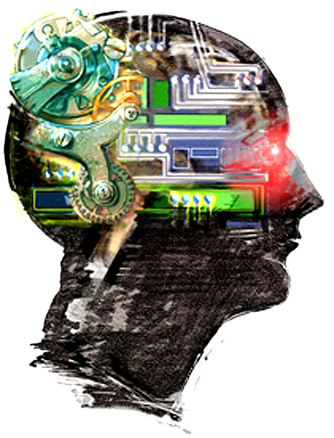
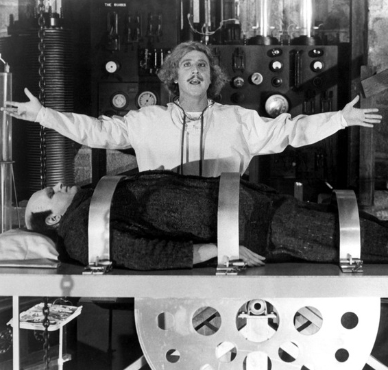
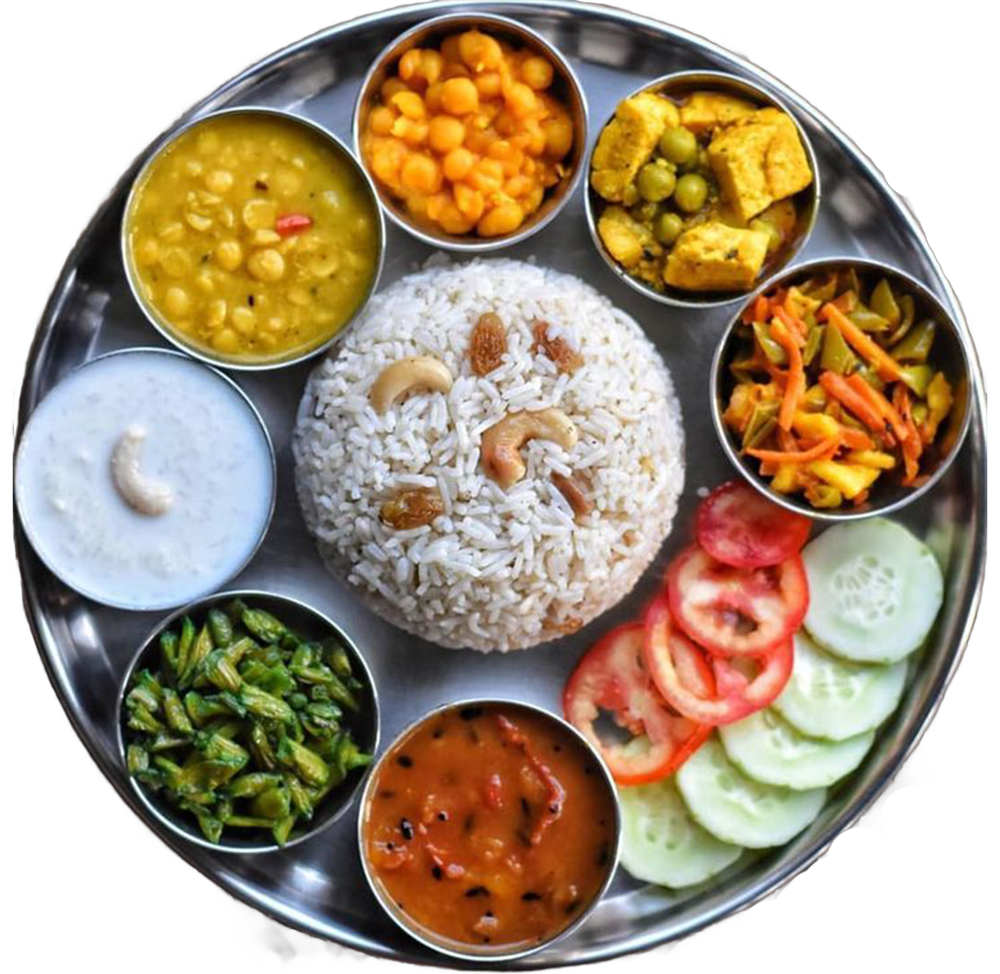

## Bio-Ontologies

::: {.callout-note appearance="simple"}
In this part of the course we will review ontologies and algorithms and we will present the Human Phenotype Ontology (HPO), which has been developed by our group since 2007.
:::

:::: {.columns}

::: {.column width="60%"}
::: {.smaller}
* You will not need a book for this course
* But if you would like to learn more:

> **Introduction to Bio-Ontologies** > (Chapman & Hall/CRC Mathematical & Computational Biology)  
> Peter N. Robinson and Sebastian Bauer  
> 2011
:::
:::

::: {.column width="40%"}
{width="80%"}
:::

::::

---

## Bio-Ontologies

::: {.callout-note appearance="simple" title="Gameplan"}
* What ontologies are, and what they are good for (today)
* Gene Ontology and Overrepresentation Analysis (lecture #2)
* Model-based Gene Set Analysis (lecture #3)
* Human Phenotype Ontology (HPO), semantic similarity, and Phenomizer (lecture #4)
:::

---

## Overview

* [Why do we need ontologies?](#why)
* [What is an ontology?](#what)
* [What are ontologies good for?](#usecases)
* [How are ontologies built?](#structure)

---

## A tale of two footballs {#why}
$$
\begin{equation*}
\mbox{American Football} = \mbox{Football} \neq
\mbox{Football} = \mbox{European Football} = \mbox{Soccer}
\end{equation*}
$$

::: {.columns}
::: {.column width="50%"}

{width="30%"}

A football $\ldots$^[When you see ``football'', your computer sees: 
0100011001101111011011110111010001100010011000010110110001101100]

::: 
::: {.column width="50%"}

{width="30%"}

A football $\ldots$
::: 
::: 

## A tale of two fibrillations
$$
\begin{equation*}
\mbox{muscle fibrillation} = \mbox{fibrillation} \neq
\mbox{fibrillation} = \mbox{ventricular fibrillation}
\end{equation*}
$$

::: {.columns}
::: {.column width="50%"}

{width="50%" fig-align="center"}

fibrillation $\ldots$

::: 
::: {.column width="50%"}

{width="100%" fig-align="center"}

fibrillation $\ldots$
:::
:::

When you see  ``fibrillation'', your computer sees: 
011001100110100101100010011100100110100101101100011011000110000101110100011010010110111101101110

## What is an Ontology? {#what}

:::: {layout="[30, 5, 30, 5, 30]"}

### Philosophy
{width="2.8cm"}

# $\rightarrow$
 

### Artificial Intelligence
{width="3.5cm"}

# $\rightarrow$
 

### Biomedical Research
{width="4cm"}

::::

## What is an Ontology?

::: {style="text-align: right;"}

::: {style="display: inline-block;
background-color: #f8f9fa;
border-left: 5px solid #2C7FB8;
padding: 0.8em 1em;
border-radius: 6px;
font-size: 0.75em;
text-align: left;"}

*"An ontology is a specification of a conceptualization."*

**Tom Gruber, 1993**

:::

:::

Ontologies are on the right of a scale of increasing semantic complexity:

| **Catalog** | → | **Thesaurus** | → | **Instances** | → | **Restrictions** | → | **Ontology** |
|:-----------:|:-:|:-------------:|:-:|:-------------:|:-:|:----------------:|:-:|:------------:|
| Glossary | | Subclassing | | Properties | | Logical Constraints | | Formal Relations |

::: {.callout-tip}
## Evolution of Complexity
As we move from left to right, we move from simple **lists of terms** (Catalog/Glossary) to **hierarchical relationships** (Thesaurus/Subclassing) and finally to **formal logic** (Restrictions/Constraints).
:::

## Ontologies for Medicine and Translational Research {#usecases}

::: {.callout-note appearance="simple"}
### Core Purpose
 Ontologies have two major (interrelated) __use cases__
:::

- Interoperability between databases
- Foundation for algorithms and computational tools

{fig-align="center" width="75%"}

## Ontologies: Interoperability
 
::: {.columns}
::: {.column width="50%"}

                

:::
::: {.column width="50%"}

{width="50%"}

:::
:::

* Human genetics is becoming a data-driven science
* Global Alliance for Genomics and Health (GA4GH) and other groups are
defining standards to exchange and integrate information between databases
across the globe
* This is particularly difficult for __clinical data__!

::: {.tiny-credit}
Brookes and Robinson (2015) [Human genotype-phenotype databases: aims,challenges and
opportunities, *Nature Reviews Genetics* **16**:702-15](https://pubmed.ncbi.nlm.nih.gov/26553330/)
:::

## Interoperability: What's the problem?

* Phenotypic descriptions that are very evocative for
humans^[Unfortunately computers, being significantly dumber than humans, don't quite ``get'' it...]:
    * myopathic electromyography
    * still walking 25 years after onset
* The following descriptions mean the same thing to you: `generalized amyotrophy`, 
`generalized muscle atrophy`, `muscular atrophy, generalized`,
(etc)
* Many publications have little^[or none at all] information about the actual phenotypic features seen in patients with particular diseases and variants
* Databases cannot talk to one another about phenotypes

{width="50%" fig-align="center"}

## Interoperability: The ontology solution

::: {.callout-note appearance="simple"}
An ontology provides a **standardised "Term"** for each entity in its domain that can be used for data exchange.
:::

| Field | Description |
|:---|:---|
| **ID** | HP:0000256 |
| **Name** | Macrocephaly |
| **Definition** | Occipitofrontal (head) circumference greater than 97th centile compared to appropriate, age matched, sex-matched normal standards. Alternatively, an apparently increased size of the cranium. |
| **Synonyms** | Large head, big head, large cranium, large calvaria, Increased head circumference, ... |
| **Xrefs** | MeSH:D058627, UMLS:C0221355, SNOMED CT:19410003, ICHPT:T0028, EoM:1d53660e657259f0, ... |
| **Translations** | {width="60%"} |

## Ontologies as Computational Tools

::: {.callout-note appearance="simple"}
Ontologies are used for myriad applications in biomedical research and translational applications. The greatest common denominator is: **Compute over human knowledge!**
:::

:::: {.columns}

::: {.column width="60%"}
### Applications
::: {.small}
* Functional profiling in high-throughput experiments
* Network biology
* Model, reason and manage complex data systems (e.g., IBM Watson)
* Natural Language Processing
* *et cetera*
:::
:::

::: {.column width="40%"}
{fig-align="center" width="80%"}
:::

::::

::: {style="font-size: 0.4em; line-height: 0.9; margin-top: 20px;"}
Haendel, Chute, Robinson (2018) Classification, Ontology, and Precision Medicine.  
*N Eng J Med* **379**:1452-1462
:::

## OBO: Open Bio-Ontologies {#structure}

:::: {.columns}

::: {.column width="75%"}
* Open Bio-Ontology (OBO)
* The OBO Foundry is a collective of ontology developers committed to collaboration and adherence to shared principles.
* Develop a family of interoperable ontologies that are both logically well-formed and scientifically accurate.
* Open use, collaborative development, non-overlapping content, and common syntax based on models like the Gene Ontology (GO).
:::

::: {.column width="25%"}
{width="100%"}
:::

::::

[http://www.obofoundry.org/](http://www.obofoundry.org/){.tiny}

## *is a* ain't always *is a*

::: {.callout-note appearance="simple"}
The most important concept in an ontology is that of the **class**. Classes provide an abstraction mechanism for grouping entities with similar characteristics.
:::

It is important to distinguish between two different usages of the phrase "is a" in the English language:

* **Mickey is a mouse**: This means a particular individual called *Mickey* is an **instance of** the class Mouse.
* **A mouse is a rodent**: This means the class "mouse" **is a subclass of** the class "rodent," implying that every being that is a mouse is also a rodent.

Ontologies keep the two apart, and write them differently: $x$ `instance_of` $A$
for the first, $A$ `is_a` $B$ for the second. Essentially every term in the Gene
Ontology and in the HPO is a **class**; the genes and patients we annotate with
them are the individuals.

## Inheritance and transitivity

::: {.callout-note appearance="simple"}
This is the one structural property of ontologies that the rest of the course rests on.
:::

* An individual inherits the parents of its class:
$$x \;\texttt{instance\_of}\; A \;\text{ AND }\; A \;\texttt{is\_a}\; B \implies x \;\texttt{instance\_of}\; B$$

* `is_a` links chain: if *mouse* `is_a` *rodent* and *rodent* `is_a` *mammal*,
we can infer that mice are mammals.

* `part_of` chains in the same way: if $A$ `part_of` $B$ and $B$ `part_of` $C$,
then $A$ `part_of` $C$.

::: {.callout-tip appearance="simple"}
### Why this matters
A gene annotated to a specific term is implicitly annotated to **all ancestors**
of that term. Annotations propagate up the graph, and that is what makes
overrepresentation analysis (lecture #2), MGSA (lecture #3), and semantic
similarity (lecture #4) possible in the first place.
:::

## Ontology formats: further reading

::: {.callout-note appearance="simple"}
Ontologies are exchanged in a handful of standard formats. We will not cover
them in this lecture, because the later lectures build on the *structure* of
ontologies rather than on their syntax.
:::

* **OBO** --- flat-file format of the Gene Ontology and the OBO Foundry
* **RDF / RDFS** --- the Semantic Web data model and its schema language
* **OWL** --- the Web Ontology Language

[→ Appendix: Ontology formats (OBO, RDF, RDFS, and OWL)](./appendix-ontology-formats.qmd)

## Homework {.inactive-slide}

::: {.slide-note}
This exercise builds on the OWL material that has moved to the appendix. New
exercises on the rules for building ontologies will replace it as soon as that
material is part of the lecture.
:::

[HOMEWORK]{.hw-badge} You will create an Indian food ontology and infer whether certain dishes are vegetarian or non-veg.

{fig-align="center" width="80%"}
