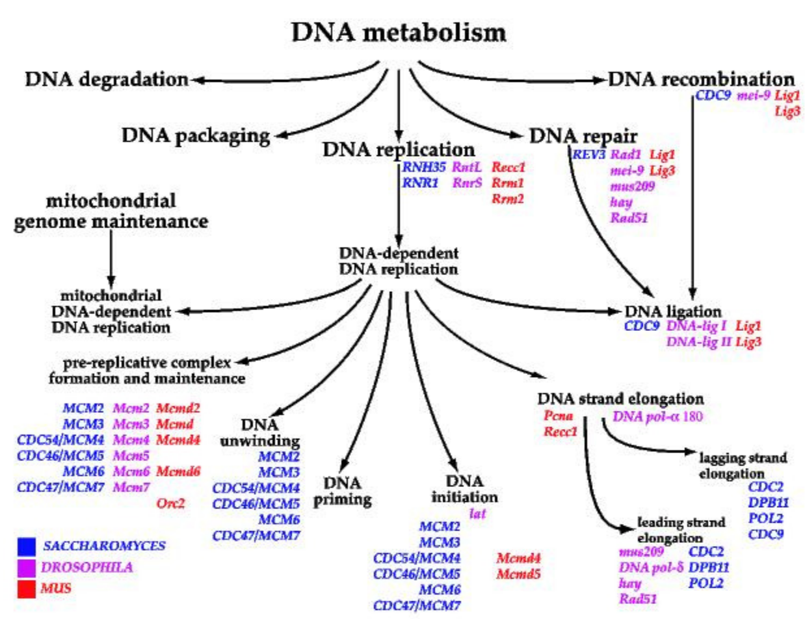
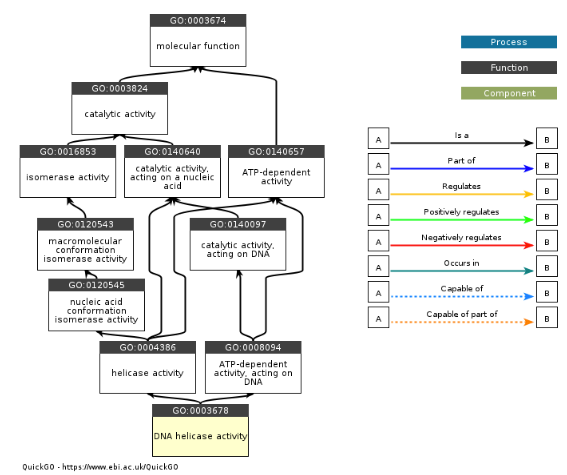
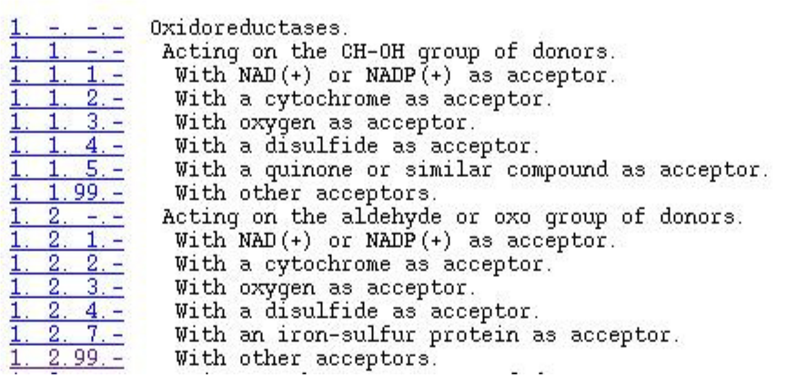
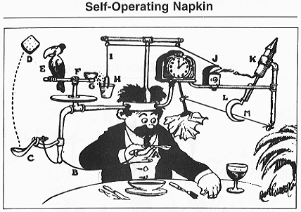
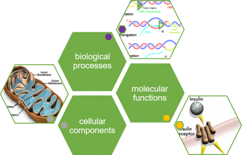
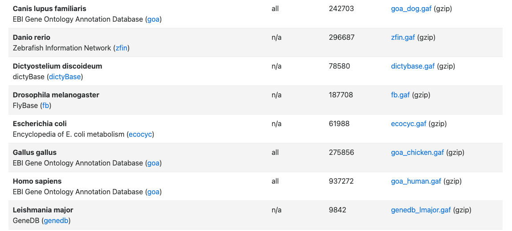

## Gene Ontology

::: {.callout-note appearance="simple"}
The Gene Ontology (GO) is being developed with the goal of providing a set of structured vocabularies for the annotation of genes and their products. Since the publication of the original paper in *Nature Genetics* in 2000, GO has become one of the most widely used and mature bio-ontologies, although it is still very much a work in progress.
:::

{fig-align="center" width="25%"}

## Why do we need GO?

* **Exponential increase in biological data** $\longmapsto$ need for databases with appropriate representation techniques.
* **Lag in functional description** $\longmapsto$ progress in how biologists describe functions has not kept pace with large-scale sequencing. Need for efficient procedures for preliminary annotation.
* **Divergent Nomenclature** $\longmapsto$ names for genes and functions vary widely between databases, making cross-species comparison difficult.
* **Primary Uses:**
    * Information extraction
    * Data mining
    * Database integration

## GO: A Structured Hierarchy

{fig-align="center" height="50%"}


## DNA Ligation: GO:0006266

The following represents the lineage of the term **DNA Ligation** (number of children in parentheses):

* **GO:0003673** : Gene_Ontology (79026)
    * **GO:0008150** : biological_process (56409)
        * **GO:0009987** : cellular process (20228)
            * **GO:0008151** : cell growth and/or maintenance (14057)
                * **GO:0008283** : cell proliferation (4030)
                    * **GO:0007049** : cell cycle (3207)
                        * **GO:0000067** : DNA replication and chromosome cycle (1301)
                            * **GO:0006260** : DNA replication (880)
                                * **GO:0006261** : DNA dependent DNA replication (366)
                                    * [**GO:0006266 : DNA ligation (7)**]{style="color: red;"}

- Parent terms of __DNA Ligation__: A `second` path through the 
graph


## DAG: Directed Acyclic Graph

```{python}
#| echo: false
#| fig-align: center
import sys
import matplotlib.pyplot as plt
sys.path.append('utils') 
from ontology_plots import dag

dag()
plt.show()
```
* A graph with directed edges
* No cycles (closed loops whereby a path leads back to the starting node)

## QuickGO: DAG

::: {layout-ncol=1}
{fig-align="center" height="300px"}
:::

::: {.aside}
Source: [https://www.ebi.ac.uk/QuickGO/term/GO:0003678](https://www.ebi.ac.uk/QuickGO/term/GO:0003678)
:::

## Tree

* Simpler data structure without multiple parentage
* e.g. EC: Enzyme commision definitions of enzyme classes, subclasses and sub-subclasses

::: {layout-ncol=1}
{fig-align="center" height="300px"}
:::

# Function?
The term function is sometimes used in a rather vague way..

* biochemical activity
* biological goals
* subcellular localization
 

::: {layout-ncol=1}
{fig-align="center" height="300px"}
:::

## GO: Biological Process

* **Definition:** The biological objective to which the gene or gene product contributes.
* **Composition:** A process is accomplished by one or more assemblies of molecular functions.
* **Characteristics:** These processes often involve chemical or physical transformations.
* **Examples:**
    * **High Level:** "Signal Transduction", "Cell Growth and Maintenance"
    * **Lower Level:** "Pyrimidine Metabolism", "cAMP Biosynthesis"

::: {.notes}
A biological process is a series of events accomplished by one or more ordered assemblies of molecular functions. It is not equivalent to a pathway, though it is often used to describe them.
:::

::: {layout-ncol=1}
{fig-align="center" height="300px"}

figure credit: EMBL-EBI
:::

## GO: Molecular Function

* **Definition:** The biochemical activity of a gene product (the specific "job").
* **The "What":** Describes **what** is done, rather than why, where, or when.
* **Examples:**
    * **High Level:** "Enzyme", "Transporter"
    * **Lower Level:** "Adenylate Cyclase", "Toll Receptor Ligand"

::: {.callout-tip title="GO Molecular function"}
Molecular functions generally correspond to the individual steps in a biological process (like the activity of a single protein within a metabolic pathway).
:::


::: {layout-ncol=1}
{fig-align="center" height="200px"}

figure credit: EMBL-EBI
:::

## GO: Cellular Component

* **Definition:** The place in the cell where a gene product is active.
* **Specific Locations:**
    * Example: "Nuclear membrane"
* **Multi-protein Complexes:** Can also refer to stable entities made up of multiple gene products.
    * Examples: "Ribosome", "Proteasome"

::: {.callout-note}
A cellular component is not just a "where"—it can be a functional structure like a protein complex that acts as a unit.
:::

::: {layout-ncol=1}
{fig-align="center" height="200px"}

figure credit: EMBL-EBI
:::

## GO Terms: The Anatomy of an Entry

* **Accession:** `GO:0003678`
* **Name:** DNA helicase activity
* **Definition:** Catalysis of the hydrolysis of ATP to unwind the DNA helix at the replication fork, allowing the resulting single strands to be copied.
* **Lineage:** Information about parent terms (this handles the "bookkeeping" of the DAG structure).

::: {.callout-important appearance="minimal"}
Each entry (*term*) in the Gene Ontology contains these standardized metadata fields to ensure consistency across different databases.
:::


## GO Annotations

::: {layout-ncol=1}
{fig-align="center" height="550px"}
:::

::: {.aside}
Source: [https://current.geneontology.org/products/pages/downloads.html](https://current.geneontology.org/products/pages/downloads.html)
:::

## GO Annotations: The Mapping Logic

* **Gene Association Files (GAFs):** Collaborating databases (like FlyBase, MGI, or UniProt) prepare and maintain these files.
* **Cardinality ($0$ to $n$):**
    * A gene product may have **zero** entries if its function is entirely unknown.
    * A single gene product often has **multiple entries** across the three domains (Cellular Component, Molecular Function, and Biological Process).
* **Granularity:** One protein can be localized to the nucleus *and* the cytoplasm, while acting as both a transcription factor *and* a dimerizing agent.

::: {.callout-note}
### The "Annotation" vs. "Term"
Remember: A **Term** is a definition in the ontology (the "dictionary"). An **Annotation** is the link between a specific gene and that term (the "usage").
:::

## GO Annotations: The Mapping Logic

* **Gene Association Files (GAFs):** Collaborating databases prepare and maintain these files to link genes to terms.
* **Cardinality ($0$ to $n$):**
    * A gene product may have **zero** entries if nothing is known about it.
    * One gene product often has **multiple entries** covering its Cellular Component, Molecular Function, and Biological Process.

## Example: Deoxyribonuclease II

An annotation record typically includes:

| Field | Value | Description |
| :--- | :--- | :--- |
| **Accession** | `O00115` | Unique protein identifier |
| **DB Name** | `DRN2_HUMAN` | Standardized database symbol |
| **GO ID** | `GO:0003677` | The GO term assigned (DNA binding) |
| **Evidence** | `TAS` | **Traceable Author Statement** |

::: {.callout-note}
### Metadata
Records also include synonyms, PubMed IDs (for literature support), Taxon (species), and the date the annotation was last updated.
:::

## GO Evidence Codes

Not all annotations are created equal. Evidence codes tell us **how** we know what we know.

### 1. Manually Curated (Experimental)
* **IDA:** Inferred from Direct Assay (The "Gold Standard")
* **IMP:** Inferred from Mutant Phenotype
* **IGI:** Inferred from Genetic Interaction

### 2. Manually Curated (Non-Experimental)
* **TAS:** Traceable Author Statement (Found in a peer-reviewed paper)
* **NAS:** Non-traceable Author Statement

### 3. Automated (Computational)
* **IEA:** Inferred from Electronic Annotation (The most common type)
* **ISO:** Inferred from Sequence Orthology

::: {.callout-warning}
### Caution
Many high-throughput analyses filter out **IEA** codes because they are automated and may have a higher false-positive rate compared to experimental data.
:::


## GO: Overrepresentation Analysis

::: {.callout-tip icon=false}
### The Situation
We have performed a high-throughput experiment (e.g., RNA-seq) and identified a list of differentially expressed genes. What are the **salient characteristics** of the genes in this list?
:::

* **Beyond Counting:** We cannot simply count genes annotated to a term. Why? Because common biological processes are naturally common in the genome.
* **The Core Question:** Is a specific GO term annotated to our gene list **more often than we would expect by random chance?**
* **The Method:** * We use the **Fisher's Exact Test** (standard procedure).
    * Today's demonstration will use the **Ontologizer** software.

## The Binomial Coefficient

To calculate the number of unique ways to arrange $k$ "heads" and $n-k$ "tails," we must account for redundant rearrangements:

* **Total Permutations:** There are $n!$ ways to rearrange $n$ distinct objects.
* **Redundancy Correction:** * Exchanging the positions of two "heads" does not change the observable sequence. There are $k!$ such internal reorderings.
    * Similarly, there are $(n-k)!$ ways to reorder the "tails" without changing the sequence.
* **The Formula:** To find the number of *distinct* orderings, we divide the total by the redundancies:

$$
\binom{n}{k} = \dfrac{n!}{(n-k)! k!}
$$ {eq-binomial-coefficient}

::: {.callout-note}
This value, $\binom{n}{k}$, represents the number of different ways of choosing $k$ items from a set of $n$ items where the order of selection does not matter.
:::


## Binomial Coefficient

This quantity (read "$n$ choose $k$") is known as the binomial coefficient. We can now use this to calculate the probability of obtaining $k$ *successes* in $n$ trials, whereby the probability of *success* in one trial is $p$, and the probability of *failure* is $q=1-p$. 

To obtain the probability of any one particular order of trials with $k$ successes and $n-k$ failures, we multiply the probabilities of the individual trials to obtain $p^k(1-p)^{n-k}$. 

In order to find the total probability of obtaining $k$ successes, we simply multiply the probability of one particular trial order with $k$ successes by the number of trial orders resulting in $k$ successes, which is given by the binomial coefficient. This probability distribution is called the **binomial distribution**:

$$
P(k,n,p) = \binom{n}{k} p^k(1-p)^{n-k}
$$ {eq-binomial-distribution}


# Binomial Coefficient

For instance, the figure shows A) the probability of $k=1,\ldots,10$ "heads" in ten coin tosses using a fair coin ($p=0.5$). B) Probability of $k=1,\ldots,10$ "heads" in ten coin tosses using a biased coin ($p=0.1$).{fig-align="center" width="80%"}

```{python}
#| echo: false
#| fig-align: center
import numpy as np
import matplotlib.pyplot as plt
from scipy.stats import binom

# Parameters
n = 10
k_values = np.arange(0, 11)  # Including 0 to 10 for completeness

# Probabilities for fair coin (p=0.5) and biased coin (p=0.1)
probs_fair = binom.pmf(k_values, n, 0.5)
probs_biased = binom.pmf(k_values, n, 0.1)

# Create Plot
fig, (ax1, ax2) = plt.subplots(1, 2, figsize=(12, 5))

# Plot A: Fair Coin
ax1.bar(k_values, probs_fair, color='skyblue', edgecolor='black', alpha=0.7)
ax1.set_title('A) Fair Coin (p=0.5)')
ax1.set_xlabel('Number of successes (k)')
ax1.set_ylabel('Probability')
ax1.set_xticks(k_values)
ax1.grid(axis='y', linestyle='--', alpha=0.7)

# Plot B: Biased Coin
ax2.bar(k_values, probs_biased, color='salmon', edgecolor='black', alpha=0.7)
ax2.set_title('B) Biased Coin (p=0.1)')
ax2.set_xlabel('Number of successes (k)')
ax2.set_ylabel('Probability')
ax2.set_xticks(k_values)
ax2.grid(axis='y', linestyle='--', alpha=0.7)

plt.tight_layout()
plt.show()
```

## GO Overrepresentation with the Binomial Distribution

GO overrepresentation analysis can be modeled as a binomial distribution in which each gene in the study set is considered to be a "trial," and "success" occurs if the gene is annotated to a GO term of interest.^[We will see shortly that the binomial distribution only approximates the true probability in this setting.]

- The probability of "success" is simply the frequency of the annotation to the GO term among all genes. 
- For instance, if there are 10,000 genes on a microarray chip, 600 of which are annotated to some GO term $t$, then the probability of $t$ is $p=600/10,000=0.06$.
- If we perform an experiment using microarray hybridizations and identify 250 differentially expressed genes (the "DE set"), 30 of which are annotated to $t$, we can use the binomial distribution to find the probability of observing exactly 30 genes in the DE set annotated to $t$ as:

$$
P(30, 250, 0.06) = \binom{250}{30} 0.06^{30} (1-0.06)^{250-30} = 1.44 \times 10^{-4}
$$

## GO Overrepresentation with the Binomial Distribution

In order to use this for a statistical test, we now define a null hypothesis ($H_0$) to be that the biological function described by GO term $t$ is not overrepresented among the differentially expressed genes.

- According to this null hypothesis, we would expect the same proportion of genes (or less) in the DE set to be annotated to $t$ as in the population.
- If we symbolize the proportion of genes in the population and study set that are annotated to the term as $\pi_p$ and $\pi_s$, then:
$$
H_0: \pi_{s} \leq \pi_p
$$

## GO Overrepresentation with the binomial distribution
 
 In GO overrepresentation analysis, we are looking
for terms that annotate a higher than expected proportion of the genes
in the study set. 

- Therefore, the alternative hypothesis is $H_a :\pi_s
> \pi_p$.  
- If the probability of the observed result of our experiment
(the observation of 30 genes in the DE set being annotated to $t$) is
less than $\alpha$, we reject the null hypothesis in favor of the
alternative hypothesis, which would imply that the GO term $t$ has
something to do with the observed differential expression. 
- Since we
have divided the set of all possible results into two classes, it is
necessary to collect all outcomes that are as extreme or more so than
the observed one to be part of the rejection class. 
- In our example,
this means that we need to sum up the probability of observing 30
*or more* genes annotated to GO term $t$ in the DE set of 250
genes.
 
# GO Overrepresentation with the binomial distribution
 Note that if there were only 100 genes annotated to a term $t$
in the entire population of genes on the microarray chip, the
probability of observing 101 or more genes annotated to $t$ is
zero. 

- Therefore, in general we can take the sum to the maximum of the
number of genes annotated to a GO term $t$ (denoted $p_t$) or to the
size of the DE set (denoted $|\textit{DE}|$).  We thus obtain:

$$
p(k \geq k^{'},n,p) = \sum_{k=k^{'}}^{\max(p_t,|\textit{DE}|)}\binom{n}{k} 
k^p\left(n-k\right)^{1-p}.
$$
 
# GO Overrepresentation with the Binomial Distribution

::: {.columns}
::: {.column width="50%"}

An approximation of the probability mass function for $k=0,1,\ldots,40$, in which the discrete points are depicted as a smoothed line. The gray region indicates the values of $k$ which encompass 95% of the probability mass under the null hypothesis.

- Statistical Decision: Since the observed value lies outside of this region, we reject the null hypothesis that genes annotated to $t$ are not enriched in the DE set.
- P-value Calculation: In order to calculate a $p$-value, we add up the probabilities for observing $k=30, 31, \ldots, 250$ genes annotated to $t$ in the DE set.

::: 
::: {.column width="50%"}

```{python}
#| echo: false
#| fig-align: center
import sys
import matplotlib.pyplot as plt
sys.path.append('utils') 
from ontology_plots import plot_binom
plot_binom()
plt.show()
``` 
::: 
::: 

## Details

```{python}
#| echo: false
#| fig-align: center
import sys
import matplotlib.pyplot as plt
sys.path.append('utils') 
from ontology_plots import plot_binom
plot_binom()
plt.show()
``` 

- The smoothed variant of the probability mass function for the binomial distribution, with $p=0.06$ and   $n=250$. 
- Values for $k=0,1,\ldots,40$ are shown (the values for  $k>40$ are nearly zero and are not shown). 
- The observed value for    $k$ of 30 lies outside of the range containing 95% of the    probability mass, and we reject the null hypothesis that the genes
   in the study set are not enriched in genes annotated by $t$. 
- The    $p$-value for this observation can be calculated by    Equation~(\ref{eq:dbinomial}) to be $1.68\times 10^{-8}$.

# binomial vs hypergeometric distribution

Although this approach provides a nearly correct answer for terms with
many annotations in the population and large DE sets, it is actually
only an approximation. 

- The problem is that the binomial distribution
is based on the assumption that the individual trials are independent
of one another. 
- While this is clearly true for coin tosses, it is not
for GO overrepresentation analysis, which is rather comparable to a
lotto game in which labelled balls are taken from an urn and not
replaced.

-  For instance, if there are 60 balls numbered 1 to 60, the
chance of getting a 7 on the first draw is 1/60. 
- If a 7 was drawn the
first time, the chance of getting it the second time is zero. 
- If
another number was drawn the first time, the chance of getting a 7 the
second time is 1/59, because some other ball has been removed.


# GO Overrepresentation with the hypergeometric distribution
  In our
microarray experiment, we imagine that the set of all 10,000 genes on
the chip is represented by an urn with 10,000 balls. 

- A total of 100 genes are annotated to some GO term $t$, and thus 600 balls in the urn are colored blue. 
- We then model the observation of 250 differentially expressed genes as the process of randomly removing 250 balls in turn from the urn without replacement. 
- Clearly there are many possible outcomes to this experiment. 


## GO Overrepresentation with the Hypergeometric Distribution

The statistical analysis basically just counts up all the ways of getting $k$ genes annotated to $t$ and $n-k$ remaining genes not annotated to $t$, and compares this number to the number of all possible outcomes.

- If we let:$m$ be the number of genes on the microarray chip.
  - $m_t$ be the number of these genes that are annotated to GO term $t$.
  - $n$ be the number of DE genes (the study set).
  - $k$ be the number of DE genes that are annotated to $t$.
- We have:
$$
P(k,n,m,m_t) = \dfrac{\binom{m_t}{k}\binom{m-m_t}{n-k}}{\binom{m}{n}}
$$

- Numerator: $\binom{m_t}{k}\binom{m-m_t}{n-k}$: The number of ways to choose exactly $k$ annotated genes AND $n-k$ non-annotated genes.
- Denominator: $\binom{m}{n}$: The total number of ways to choose any $n$ genes from the population $m$.

# GO Overrepresentation with the Hypergeometric Distribution
$$p(k,n,m,m_t) = \dfrac{\binom{m_t}{k}\binom{m-m_t}{n-k}}{\binom{m}{n}}$$

- Ways to choose annotated genes: There are $\binom{m_t}{k}$ ways of choosing $k$ genes annotated to $t$.
- Ways to choose non-annotated genes: There are $\binom{m-m_t}{n-k}$ ways of choosing the remaining $n-k$ genes that are not annotated to $t$.
- Combined combinations: In total, there are $\binom{m_t}{k}\binom{m-m_t}{n-k}$ ways of choosing the genes in the study set such that $k$ are annotated to $t$ and $n-k$ are not.
- Total possible outcomes: There are $\binom{m}{n}$ total ways of choosing a study set with $n$ genes from the population of $m$ genes with arbitrary annotations.
- The hypergeometric equation reflects the proportion of all possible study sets that can be chosen from the population such that exactly $k$ of the genes are annotated to $t$. If this proportion is very small, it is unlikely that such a study set will be chosen at random.


# GO Overrepresentation with the Hypergeometric Distribution
 Equation~(\ref{eq:hypergeometric}) is known as the `hypergeometric
distribution`. 

- Analogously to the situation with the binomial distribution, we need to calculate the probability of observing some
number $k$ or more genes annotated to $t$ in order to have a
statistical test. 
- In this case, the sum over the tail of the
hypergeometric distribution is known as the `Exact Fisher Test`:

$$
p(K\geq k^{'},n,p) = 
\sum_{k=k^{'}}^{\max(K,|DE|)}\dfrac{\binom{m_t}{k}\binom{m-m_t}{n-k}}{\binom{m}{n}}
$$
 
## GO Overrepresentation with Fisher's exact test

 we refer to the set of genes which are investigated in an experiment as the
__population set__. 

- Note that we use the term `gene` only for simplicity. The items annotated to the ontology terms may also be proteins or other biological entities. 
- We denote this set by the uppercase letter $M$, while the cardinality of the population set is denoted by $m$.
- If, for example, a microarray experiment is conducted, the population set will comprise all genes
that the microarray chip can detect. The outcome of the experiment is referred
to as the `study set`. It is denoted by $N$ and has the cardinality $n$.
-  In the microarray or RNA-seq scenario the study set could consist of all genes that were
detected to be differentially expressed.

## Term-for-Term

 The standard approach to identify the most interesting terms is to
perform Fisher's exact test for each term separately. For this reason,
we refer to this procedure as the term-for-term (TfT)
approach

* For each GO term $t$, the genes in the population set $M$ are either
annotated to term $t$ or not.
* This divides the population set into two classes of items, comparable to an urn with white and
black marbles. 
* We denote the set of all genes in the population that are annotated to GO term $t$ as  $M_t$ and the cardinality of the set as $m_t$.


## Term-for-Term
 
 The study set is assumed to be a random sample that is
obtained by drawing $n$ genes without replacement from the 
population. 

- The random variable that describes the number of genes of
the study set that are annotated to $t$ in this random sample, denoted
by $X_t$, therefore follows the \index{hypergeometric distribution}
hypergeometric distribution, i.e.,

$$
X_t \sim h(k|m;m_t;n) := P(X_t=k) = \frac{\binom{m-m_t}{n-k}}{\binom{m}{n}}
$$ {#eq-hypergeometric-term-for-term}

* That is, $P(X_t=k)$ gives the probability of observing exactly $k$ annotated genes in a study set of size $n$ if the population set of size $m$ contains $m_t$ genes that are annotated to term $t$.

## Term-for-Term
::: {.callout-note icon=false}
Null and Alternative Hypothesis
:::

The number of genes in the study set that are annotated to $t$ represents the observation. This number is denoted by $n_t$. 

- Now we want to assess whether the study set is enriched for term $t$, i.e., whether the observed $n_t$ is higher than one would expect. 
- In order to formulate a statistical test, we need to formulate a null hypothesis ($H_0$) and an alternative hypothesis ($H_1$).
- Null Hypothesis ($H_0$): In this case, it simply states that there is no positive association between genes annotated to the term $t$ and the study set; that is, there is no overrepresentation of term $t$.
- Alternative Hypothesis ($H_1$): There is overrepresentation of the term.

## Term-for-Term
 
The null hypothesis
corresponds to the probability of observing a test statistic that is at least as
extreme as the one that was observed given that the null hypothesis is true.

- Therefore, the null hypothesis corresponding to a one-sided test is rejected if the probability of observing $n_t$ \textit{or more} genes annotated to term $t$ in the study set by chance is less than $\alpha$ 
- By convention, $\alpha$ is usually set to 0.05


  This is given by:

$$
  P(X_t\geq n_t|H_0) = \sum_{k=n_t}^{\min(m_t,n)} 
 \frac{\displaystyle{m_t \choose k}\displaystyle{{m - m_t} 
 \choose {n - k}}}{\displaystyle{m \choose n}}.
$$

##  Interpretation of ``significant'' GO terms

* if $P(X_t\geq n_t|H_0) < \alpha$, the null hypothesis is rejected, and we declare the term $t$ to be \textit{significantly overrepresented} in the study set.
* The biological interpretation of significant overrepresentation is usually taken to be that the term
$t$ represents an important biological characteristic of the study
set.

## Example
* Suppose that there is a population set of $m=18$ genes, of which $m_t=4$ genes are annotated to the term $t$.
* The outcome of an experiment conducted on all 18 genes of the population yields a set  of 5 genes. This means that the study set consists of $n=5$  genes.
* Moreover, we observe that a total of $n_t=3$ genes from the  genes of the study set are annotated to term  $t$ 


  We would now like to analyze whether term $t$ is significantly
  overrepresented in the study set and thus can be interpreted to
  represent an important result of the experiment:
$$
P(X_t\geq 3|H_0) = \frac{\displaystyle{5 \choose 3}\displaystyle{{13} \choose {2}}}{\displaystyle{18 
\choose 5}} + \frac{\displaystyle{5 \choose 4}\displaystyle{{13} \choose {1}}}{\displaystyle{18 
\choose 5}}
   = 0.044.
$$
- Since $P(X_t\geq 3|H_0)=0.044<0.05=\alpha$, the null-hypotheses is
rejected and the term may be interpreted as being characteristic of
the experiment.