## Overview: Semantic similarity

* [Information content/Entropy](#ic)
* [Semantic similarity](#semsim)
* [Human Phenotype Ontology](#hpo)
* [Phenomizer](#phenomizer)
* [LIRICAL](#lirical)


## Semantic Similarity: The Resnik Method {#ic}

In 1995, Resnik introduced a method for evaluating the semantic similarity between two concepts in an ontology with `is_a` relations.^[Resnik P (1995) Using Information Content to Evaluate Semantic Similarity in a Taxonomy. arXiv cmp-lg/9511007]

* **Core Idea:** Associate probabilities with the concepts of an ontology.
* **Definitions:**
    * Let $\mathcal{C}=\left\{c_1,c_2,\ldots,c_n\right\}$ be the set of concepts in the ontology (permits multiple inheritance).
    * Define a function $p:\mathcal{C}\longrightarrow \left[ 0,1\right]$.
    * $p(c_i)$ is the probability of encountering an instance of class $c_i \in \mathcal{C}$.

---

## Ontology Probabilities & Information Content

:::: {.columns}

::: {.column width="40%"}
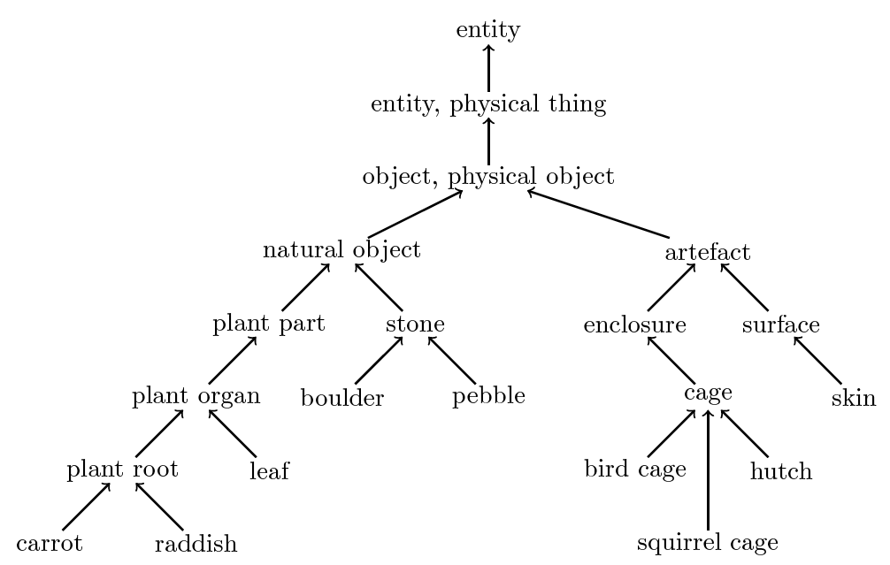{fig-align="center"}
:::

::: {.column width="60%"}
### Example: WordNet Excerpt

* **Hierarchy:** Every `pebble` is a `stone`, and every `stone` is a `natural object`.
* **The Root:** Every concept is a descendent of `entity`.
    * $p(\text{entity}) = 1$
    * Information Content: $\log 1 = 0$
:::

::::

::: {.callout-note appearance="simple"}
Knowing a random term is a descendent of **entity** provides no added information. Conversely, the probability of a specific term like **pebble** is much lower, meaning its **Information Content** is correspondingly higher.
:::

## Information Content (IC)

::: {.callout-important}
## Logic of Inheritance
Recall that:  
$x$ `instance_of` $A$  AND $A$ `is_a` $B$ $\implies$ $x$ `instance_of` $B$.
:::

* **Monotonicity**: $p$ is a monotonically increasing function as we move up the hierarchy. 
    * If $c_i$ `is_a` $c_j$, then $p(c_i) \leq p(c_j)$.
* **Root Probability**: If the ontology has a unique root node $r$, then $p(r)=1$.

### Resnik's Definition
The **Information Content (IC)** of a concept is the negative log of its probability:

$$
\text{IC}(t) = -\log p(t)
$${#eq-IC-def}

---

## Information Content (IC) {#ic-part-2}

The base $b$ of the logarithm $log_b$ determines the unit of the IC:

| base | IC unit   |
|------|-----------|
| 2    | *bit*     |
| 3    | *trit*    |
| $e$  | *nat*     |
| 10   | *hartley* |


The unit selection has no impact on the output as long as the same unit is used consistently.

::: {.callout-note}
When writing $log$ without base, we mean the natural logarithm.
:::

---

## Intuition Behind IC

As the probability of a concept increases, its information content decreases. This mirrors information theory:

* **Common vs. Rare**: We gain less new information from an observation of a common event than from a rare one.
* **The Root Term**: Since the root subsumes all concepts:
    * $p(\text{root}) = 1$
    * $\text{IC}(\text{root}) = -\log(1) = 0$
    


::: {.callout-tip}
## Summary
The more specific a term is (lower probability), the higher its Information Content. The more general it is (higher probability), the lower its Information Content.
:::

## Basic Properties of Information Content (IC)

::: {.callout-note}
## Mathematical Foundation
Information Content relies heavily on the properties of logarithms. These identities are essential for calculating IC across different branches of an ontology.
:::

The following logarithmic identities are fundamental to the behavior of $IC(t) = -\log p(t)$:

$$
\begin{aligned}
\log 1 &= 0 \\
\log xy &= \log x + \log y \\
\log x^r &= r \log x \\
\log \frac{1}{x} &= - \log x \\
\log_a x &= \frac{\log x}{\log a}
\end{aligned}
$$


## Entropy

::: {.callout-note title="Game plan"}
This lecture covers a review of artificial neural networks and backpropagation as a prerequisite for understanding transformers and LLMs.
:::

:::: {.columns}

::: {.column width="48%" .dimmed}
### [Part 1: Information content](#part-1)
* Information content
* Entropy
:::

::: {.column width="4%"}
:::

::: {.column width="48%" }
### [Part 2: Semantic similarity](#part-2)
* Definition of ontologies (review)
* Ontologies and biomedical research
:::

::::

:::: {.columns}

::: {.column width="48%" .dimmed}
### [Part 3: Human Phenotype Ontology](#part-3)
* Phenotype and phenotypic feature
* HPO
:::

::: {.column width="4%"}
:::

::: {.column width="48%" .dimmed}
### [Part 4: Phenomizer](#part-4)
* Phenomizer algorithm
:::

::::

## Entropy {#part-2}

* Let us assume we are
analyzing a random variable $X$, which can take on one of a finite
number of specific values
$\left\{x_1,x_2,\ldots,x_n\right\}$ with a probability
$\left\{p_1,p_2,\ldots,p_n\right\}$, where the probability of the
outcome $x_i$ is $p_i$ with $0\leq p_i\leq 1$ and $\sum_{i=1}^n p_i=1$. 
* We will use the
notation $p(X=x)$ or simply $p(x)$ to denote the probability that the
random variable $X$ takes on some specific value $x$, where $x\in
\left\{x_1,x_2,\ldots,x_n\right\}$. 
* We will refer to each of the
specific values that $X$ can take on as *outcomes*.

Shannon defined the information content of an outcome $x$ as

$$
h(x) = \log_2 \dfrac{1}{p(x)}
$$ {#eq-appdx-IC}


## Entropy (2)
 
Note that because of the properties of logarithms, 
$\log_2 \frac{1}{p(x)} = -\log_2 p(x)$, which is the definition of
information content. The
*entropy* of the random variable $X$, written as $H(X)$, was defined by Shannon as
the average information content of all of the possible outcomes of
$X$.

$$
H(X) = \sum_{i=1}^n p(x_i)\log_2\dfrac{1}{p(x_i)}
$$ {#eq-appdx-entropy}


## Entropy (3)

* The *unit* of entropy and information content depends on the logarithm base (*bit*, *nat*, ...). 

* The entropy of a random variable $X$
can be interpreted as the *uncertainty* of the random
variable. For instance, if $X$ has only one outcome (i.e., $p(x')=1$
for some $x'$), then the entropy of $X$ is zero.

$$
H(X) = p(x')\log_2\dfrac{1}{p(x')} = 1\times (-1)\times\log_2 1 = 0
$$


## Entropy (4)

On the other hand the entropy of $X$ is maximized if there
is maximal uncertainty about the outcome -- this is the case if no
outcome is more likely than the others, or stated differently, if
$X$ follows a uniform distribution.


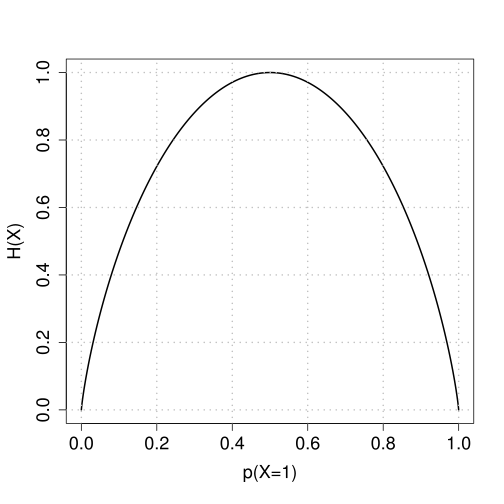{fig-align="center" width="10%"}

- Entropy of a random variable $X=\left\{\mathtt{0, 1}\right\}$ representing  Bernoulli process such as a coin toss for different values of $p(X=1)$. 
- Maximum entropy is achieved if $p(\mathtt{0}) = p(\mathtt{1}) = 0.5$, i.e., for a uniform distribution. 

## Proof

We want to show: among all probability distributions on $n$ outcomes, entropy

$$
H(p) = -\sum_{i=1}^n p_i \log p_i
$$

is maximized by the **uniform** distribution $p_i = 1/n$.


* **Constraint:** $\sum_{i=1}^n p_i = 1$, with $p_i \geq 0$.
* The method of Lagrange multipliers allows us to find maximums/minimums subject to a constraint


## The Lagrangian

Introduce a multiplier $\lambda$ for the normalization constraint:

$$
\mathcal{L}(p, \lambda) = -\sum_{i=1}^n p_i \log p_i \;-\; \lambda\left(\sum_{i=1}^n p_i - 1\right)
$$


- At a stationary point, the gradient with respect to every $p_i$ must vanish, i.e., $\tfrac{\partial \mathcal{L}(p, \lambda)}{\partial p_i}=0$
- We have 


$$
\begin{align}
\frac{\partial \mathcal{L}}{\partial p_i} &= -\log p_i - 1 - \lambda = 0 \quad \Longrightarrow \quad p_i = e^{-1-\lambda}
\end{align}
$$

* the right-hand side doesn't depend on $i$, so every  $p_i$ must be equal; denoting the the common value $c$:
$$
\sum_{i=1}^n p_i = \sum_{i=1}^n c  = nc = 1 \quad \Longrightarrow \quad p_i = \frac{1}{n}\quad \text{for all } i
$$


## The Hessian Matrix

$$
\nabla^2 \mathcal{L} = \begin{bmatrix} -\dfrac{1}{p_1} & 0 & \cdots & 0 \\
0 & -\dfrac{1}{p_2} & \cdots & 0 \\
0 & 0 & \ddots & 0 \\
0 & 0 & \cdots & -\dfrac{1}{p_n}
\end{bmatrix}
$$

::: {.fragment}
Since $p_i > 0$, every diagonal entry is **negative**, and off-diagonal entries vanish.
:::

::: {.fragment}
$H(p)$ is therefore **strictly concave** — the unique critical point is a **global maximum**, not a saddle or minimum.
:::


$$
H(p) \leq H\left(\tfrac{1}{n}, \dots, \tfrac{1}{n}\right) = \log n
$$

for every probability distribution $p$ on $n$ outcomes, with equality **iff** $p$ is uniform.


**Interpretation:** maximal uncertainty about the outcome corresponds exactly to maximal entropy — any deviation from uniformity introduces predictability and strictly lowers $H$.


## Entropy (5)
 The function $IC(x) = -\log p(x)$ is a natural one for measuring information
content, for several reasons. 

*  If there is no uncertainty, i.e., if
$p(x=1)$, then $IC(x)= \log 1 = 0$. 
* On the other hand, the information
content can be arbitrarily large as the probability of an outcome goes
to arbitrary small quantities: $\lim_{x\rightarrow 0}\log x = \infty$.
* Say we have two random variables,
$X$ and $Y$, that are independent from one another. It is reasonable
to assume that the information content of the outcomes $x$ and $y$
must be additive. This is a natural consequence of the logarithm,
because


$$
IC(x,y) = -\log_2 (xy) = -\log_2 x - \log_2 y = IC(x) + IC(y)
$$


 

## Shannon's Entropy: The Uniqueness Theorem

Claude Shannon's definition of entropy is not arbitrary; it is the **only** function that satisfies three fundamental postulates.

::: {.callout-note icon=false}
## Theorem: Uniqueness of Entropy
Let $P = \{p_1, p_2, \dots, p_n\}$ be the probabilities of outcomes $\{x_1, x_2, \dots, x_n\}$, where $p_i \geq 0$ and $\sum p_i = 1$. 

A continuous function $H(P)$ satisfies the following:

1.  **Maximality**: $H$ is maximized when $p_i = \frac{1}{n}$ for all $i$ (uncertainty is highest when all outcomes are equally likely).
2.  **Additivity**: $H(AB) = H(A) + H_A(B)$. If $A$ and $B$ are independent, $H(AB) = H(A) + H(B)$.
3.  **Expandability**: $H(p_1, \dots, p_n) = H(p_1, \dots, p_n, 0)$ (adding an impossible event does not change entropy).

**Then $H$ must take the form:**
$$H(p_1, p_2, \dots, p_n) = \lambda \sum_{i=1}^n - p_i \log p_i$$
where $\lambda$ is a positive constant (usually $\lambda=1$).
:::


## Information Content in Gene Ontology (GO)

In the setting of GO, the probability of a term $t$ is the probability that a **randomly chosen** gene product (usually: protein) is annotated to that term.

* **The Root Term**: Assuming all genes are annotated to the root (the most general term):
    * $p(\text{root}) = 1$
    * $\text{IC}(\text{root}) = -\log_2(1) = 0$
* **General vs. Specific**: 
    * Terms used for many genes have **low** IC.
    * Terms used for very few genes have **high** IC.

::: {.callout-note}
This reflects "surprise": discovering a gene is annotated to the root is expected, while discovering a rare, specific annotation provides significant information.
:::


## IC: Numerical Examples

Assume we have a set of **256 annotated genes**:

| Genes Annotated to Term | Probability $p(t)$ | IC calculation ($-\log_2 p(t)$) | IC Value (bits) |
|:---|:---|:---|:---|
| 256 (All) | $256/256 = 1$ | $-\log_2(1)$ | **0** |
| 4 | $4/256$ | $-\log_2(4/256) = 8 - 2$ | **6** |
| 2 | $2/256$ | $-\log_2(2/256) = 8 - 1$ | **7** |
| 1 (Unique) | $1/256$ | $-\log_2(1/256)$ | **8** |


## Semantic Similarity ($t_1 \leftrightarrow t_2$){#semsim}


Resnik defined similarity between two terms based on the **Information Content of their Most Specific Ancestor (MSA)**.

$$\text{IC}(t) = -\log p(t)$$

::: {.columns}

::: {.column width="50%"}
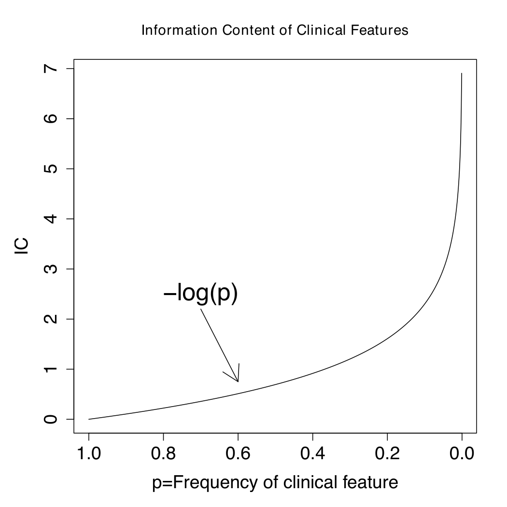{fig-align="center" width="90%"}
:::

::: {.column width="50%"}
### Resnik Similarity
The similarity is the IC of the most specific ancestor $a$ in the set of common ancestors $\mathcal{A}(t_1, t_2)$:

$$
\mathrm{sim}(t_1, t_2) = \max_{a \in \mathcal{A}(t_1, t_2)} [-\log p(a)]
$$ {#eq-mica}

We refer to this as the **IC of the Most Specific Ancestor**: $\text{IC}(a')$, or **MICA**
:::

::::


## Semantic similarity: An example

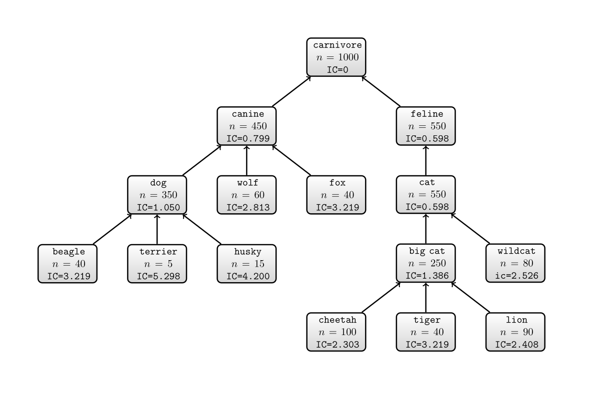{fig-align="center" width="90%"}


# Semantic similarity

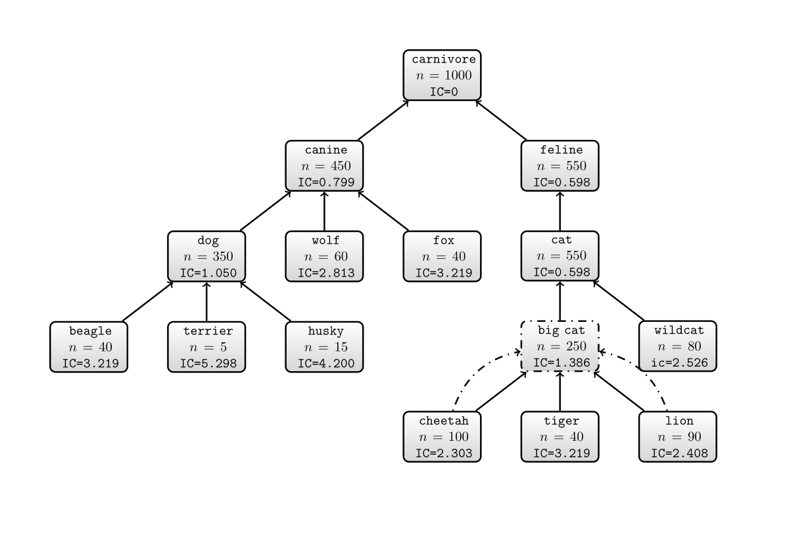{fig-align="center" width="90%"}


`lion` and `cheetah` are similar

# Semantic similarity

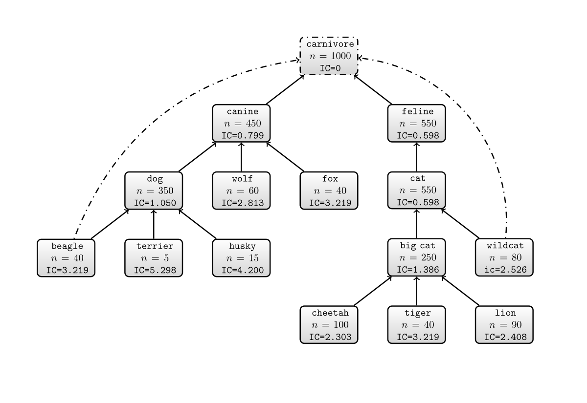{fig-align="center" width="90%"}


`beagle` and `wildcat`  are not $\ldots$


## HPO {#hpo}


::: {.callout-note title="Game plan"}
This lecture covers a review of artificial neural networks and backpropagation as a prerequisite for understanding transformers and LLMs.
:::

:::: {.columns}

::: {.column width="48%" .dimmed}
### [Part 1: Information content](#part-1)
* Information content
* Entropy
:::

::: {.column width="4%"}
:::

::: {.column width="48%" .dimmed}
### [Part 2: Semantic similarity](#part-2)
* Definition of ontologies (review)
* Ontologies and biomedical research
:::

::::

:::: {.columns}

::: {.column width="48%" }
### [Part 3: Human Phenotype Ontology](#part-3)
* Phenotype and phenotypic feature
* HPO
:::

::: {.column width="4%"}
:::

::: {.column width="48%" .dimmed}
### [Part 4: Phenomizer](#part-4)
* Phenomizer algorithm
:::

::::

## Bioinformatics for Medicine? {#part-3}

* How exactly do we calculate the similarity between diseases, symptoms, patients, and more?

::: {layout="[[1,1], [1,1]]"}
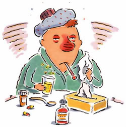{width="50%"}

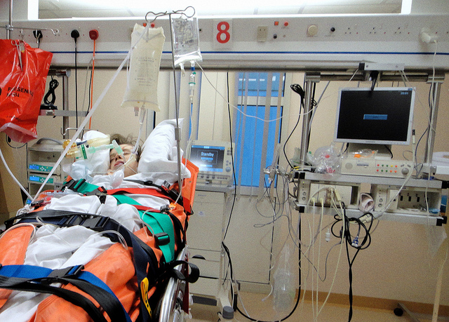{width="50%"}

{width="50%"}

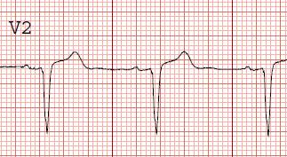{width="50%"}
:::

## A tale of two footballs
$$
\begin{equation*}
\mbox{American Football} = \mbox{Football} \neq
\mbox{Football} = \mbox{European Football} = \mbox{Soccer}
\end{equation*}
$$

::: {.columns}
::: {.column width="50%"}

{width="30%"}

A football $\ldots$

::: 
::: {.column width="50%"}

{width="30%"}

A football $\ldots$
::: 
::: 

When you see `football`, your computer sees: 
0100011001101111011011110111010001100010011000010110110001101100

## A tale of two fibrillations
$$
\begin{equation*}
\mbox{muscle fibrillation} = \mbox{fibrillation} \neq
\mbox{fibrillation} = \mbox{ventricular fibrillation}
\end{equation*}
$$

::: {.columns}
::: {.column width="50%"}

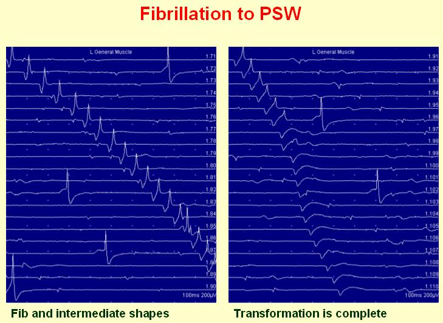{width="50%" fig-align="center"}

fibrillation $\ldots$

::: 
::: {.column width="50%"}

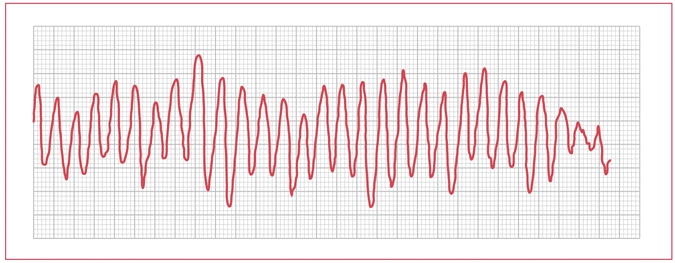{width="100%" fig-align="center"}

fibrillation $\ldots$
:::
:::


When you see  `fibrillation`, your computer sees: 
011001100110100101100010011100100110100101101100011011000110000101110100011010010110111101101110


## What is a phenotype ontology?

::: {.callout-note appearance="simple"}
### Core Purpose
Precise language (and thinking), interoperability, and improved database models to reliably capture and interpret phenotype information.
:::

* A **medical** phenotype ontology describes the individual manifestations of diseases:

    1. Signs
    2. Symptoms
    3. Laboratory findings
    4. Imaging studies
    5. *etc.*


::: {style="font-size: 0.45em; margin-top: 50px;"}
Robinson PN, Webber C (2014) [Phenotype ontologies and cross-species analysis for translational research. *PLoS Genet* **10**:e1004268](https://pubmed.ncbi.nlm.nih.gov/24699242/).
:::

## Deep Phenotyping
The precise and comprehensive analysis of phenotypic abnormalities.

- Individual components of the phenotype are observed and described using a controlled vocabulary.
- Deep phenotyping information is critical for:
  - Computational differential diagnostic tools.
  - Genotype-phenotype correlation.
  - Scientific examination of human disease.

::: {style="font-size: 0.45em; margin-top: 50px;"}
PN Robinson (2012) [Deep phenotyping for precision medicine. *Hum Mutat* **33**:777–780](https://pubmed.ncbi.nlm.nih.gov/22504886/). Special Issue of Human Mutation on Deep Phenotyping
:::


## Ontologies for Medicine and Translational Research

::: {.callout-note appearance="simple"}
### Core Purpose
 Ontologies have two major (interrelated) __use cases__
:::

- Interoperability between databases
- Foundation for algorithms and computational tools


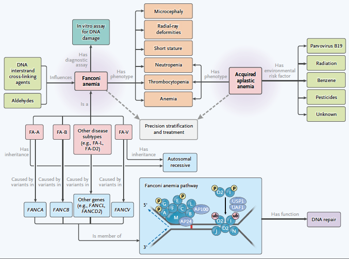{fig-align="center" width="75%"}


## Ontologies: Interoperability
 
::: {.columns}
::: {.column width="50%"}

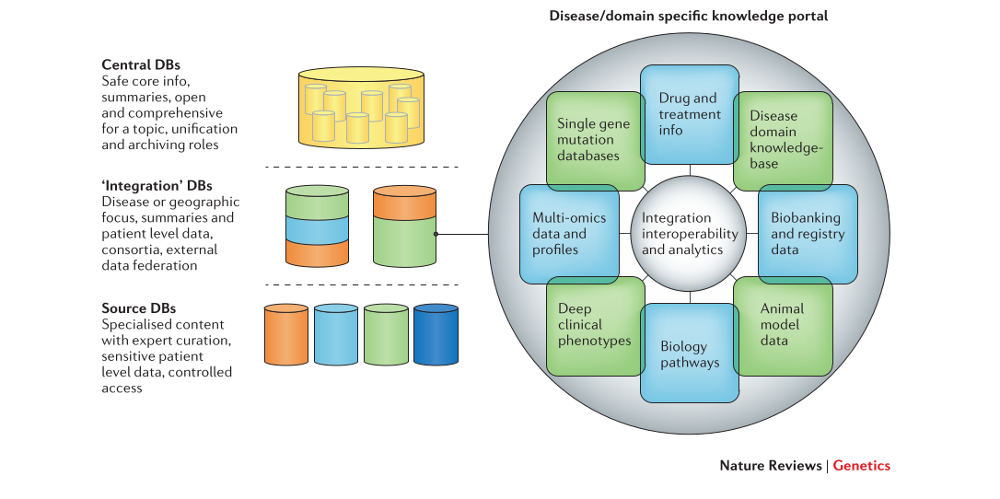
                

:::
::: {.column width="50%"}

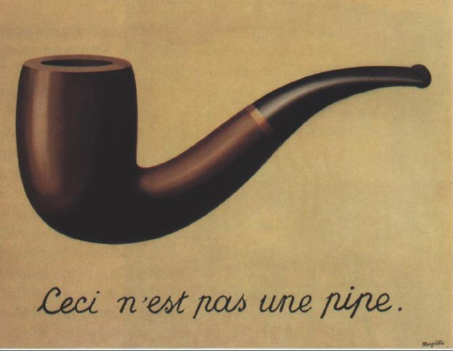{width="50%"}

:::
:::

* Human genetics is becoming a data-driven science
* Global Alliance for Genomics and Health (GA4GH) and other groups are
defining standards to exchange and integrate information between databases
across the globe
* This is particularly difficult for __clinical data__!

::: {.tiny-credit}
Brookes and Robinson (2015) [Human genotype-phenotype databases: aims,challenges and
opportunities, *Nature Reviews Genetics* **16**:702-15](https://pubmed.ncbi.nlm.nih.gov/26553330/)
:::

## Interoperability: What's the problem?

- Phenotypic descriptions that are very evocative for
humans^[Unfortunately computers, being significantly dumber than humans, don't quite "get" it...]:
    - myopathic electromyography
    - still walking 25 years after onset

* The following descriptions mean the same thing to you: `generalized amyotrophy`, 
`generalized muscle atrophy`, `muscular atrophy, generalized`,
(etc)
* Many publications have little^[or none at all] information about the actual phenotypic features seen in patients with particular diseases and variants
* Databases cannot talk to one another about phenotypes


{width="50%" fig-align="center"}


## Ontologies: Interoperability

::: {.callout-note appearance="simple"}
An ontology provides a **standardised "Term"** for each entity in its domain that can be used for data exchange.
:::

| Field | Description |
|:---|:---|
| **ID** | HP:0000256 |
| **Name** | Macrocephaly |
| **Definition** | Occipitofrontal (head) circumference greater than 97th centile compared to appropriate, age matched, sex-matched normal standards. Alternatively, an apparently increased size of the cranium. |
| **Synonyms** | Large head, big head, large cranium, large calvaria, Increased head circumference, ... |
| **Xrefs** | MeSH:D058627, UMLS:C0221355, SNOMED CT:19410003, ICHPT:T0028, EoM:1d53660e657259f0, ... |
| **Translations** | 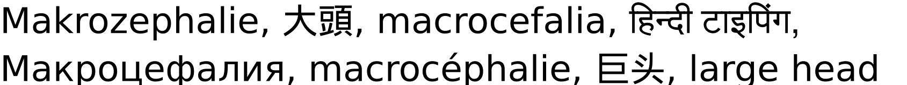{width="60%"} |

## Ontologies as Computational Tools

::: {.callout-note appearance="simple"}
Ontologies are used for myriad applications in biomedical research and translational applications. The greatest common denominator is: **Compute over human knowledge!**
:::

:::: {.columns}

::: {.column width="60%"}
### Applications
::: {.small}
* Functional profiling in high-throughput experiments
* Network biology
* Model, reason and manage complex data systems (e.g., IBM Watson)
* Natural Language Processing
* *et cetera*
:::
:::

::: {.column width="40%"}
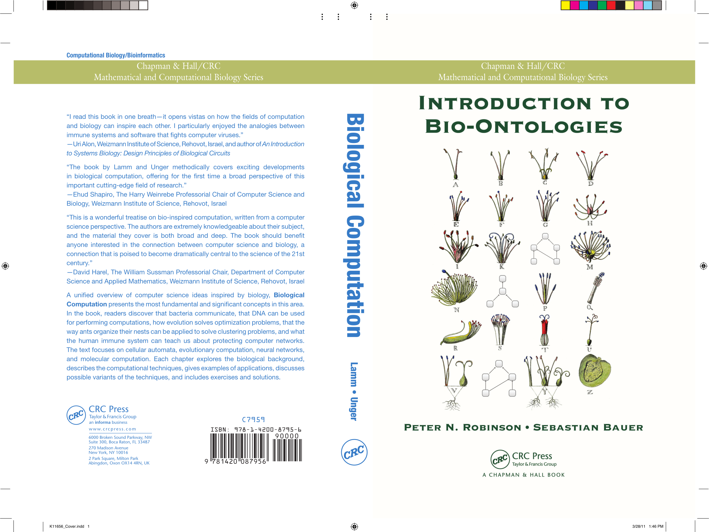{fig-align="center" width="80%"}
:::

::::


::: {style="font-size: 0.4em; line-height: 0.9; margin-top: 20px;"}
Haendel, Chute, Robinson (2018) Classification, Ontology, and Precision Medicine.  
*N Eng J Med* **379**:1452-1462
:::

## The Human Phenotype Ontology

:::: {.columns}

::: {.column width="60%"}
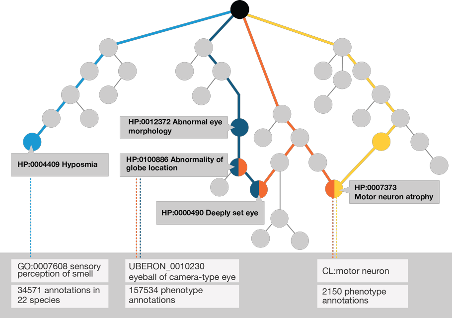{fig-align="center" width="100%" style="background-color: white; border: 1px solid #ddd;"}
:::

::: {.column width="40%"}
::: {style="font-size: 0.35em; line-height: 0.9;"}
Robinson Am J Hum Genet 2008  
Köhler Am J Hum Genet 2009  
Robinson Clin Genet. 2010  
Schulz BMC Bioinformatics. 2011  
Köhler Hum Mutat. 2012  
Bauer Bioinformatics 2012  
Köhler Nucleic Acids Res 2014  
Köhler J Med Genet 2014  
Zemojtel Sci Transl Med. 2014  
Robinson PLoS Genet. 2014  
Robinson Genome Res. 2014  
Groza Am J Hum Genet 2015  
Groza Database (Oxford). 2015  
Smedley Nat Protoc 2015  
Smedley Genome Med. 2015  
Smedley Am J Hum Genet. 2016  
Köhler Nucleic Acids Res 2017  
Vasilevsky Nat Genet 2018  
Köhler Nucleic Acids Res 2019  
Köhler Curr Protoc Hum Genet. 2019  
Carmody Orphanet J Rare Dis. 2020  
Köhler Nucleic Acids Res 2021  
Dhombres Am J Med Genet C 2022  
Gargano Nucleic Acids Res 2024
:::
:::

::::

::: {.small style="margin-top: -10px;"}
* **>19,000 terms**
* 244,440 annotations for **8,223 monogenic or chromosomal diseases**
* [http://www.human-phenotype-ontology.org](https://hpo.jax.org/app/)
:::


## HPO

::: {.callout-note title="Game plan"}
This lecture covers a review of artificial neural networks and backpropagation as a prerequisite for understanding transformers and LLMs.
:::

:::: {.columns}

::: {.column width="48%" .dimmed}
### [Part 1: Information content](#part-1)
* Information content
* Entropy
:::

::: {.column width="4%"}
:::

::: {.column width="48%" .dimmed}
### [Part 2: Semantic similarity](#part-2)
* Definition of ontologies (review)
* Ontologies and biomedical research
:::

::::

:::: {.columns}

::: {.column width="48%" .dimmed}
### [Part 3: Human Phenotype Ontology](#part-3)
* Phenotype and phenotypic feature
* HPO
:::

::: {.column width="4%"}
:::

::: {.column width="48%" }
### [Part 4: Phenomizer](#part-4)
* Phenomizer algorithm
:::

::::

## Phenotypic Similarity Algorithms {#phenomizer}

::: {.callout-note appearance="simple"}
**Goal**: Calculate a similarity between a set of query terms and computational disease models.
:::

::::: {.columns}

:::: {.column width="33%"}

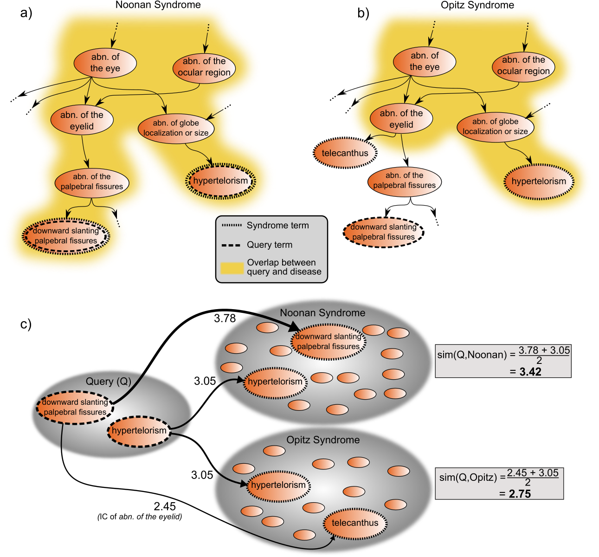{width="100%"}

::::


:::: {.column width="33%"}

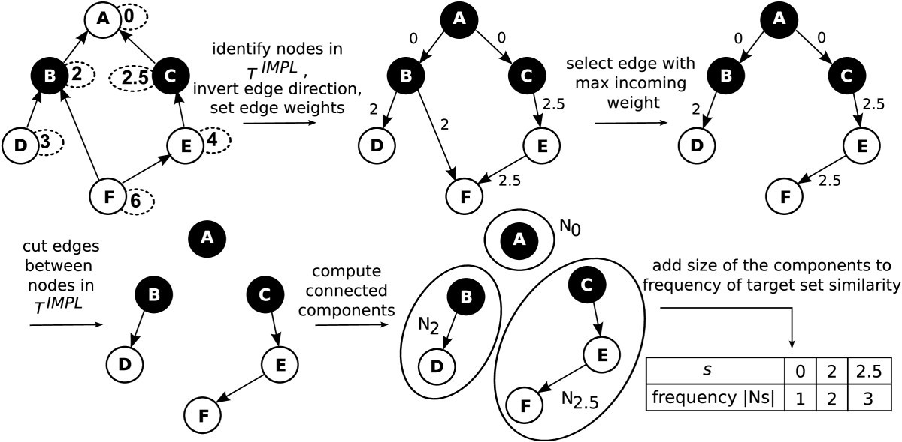{width="100%"}

::::


:::: {.column width="33%"}

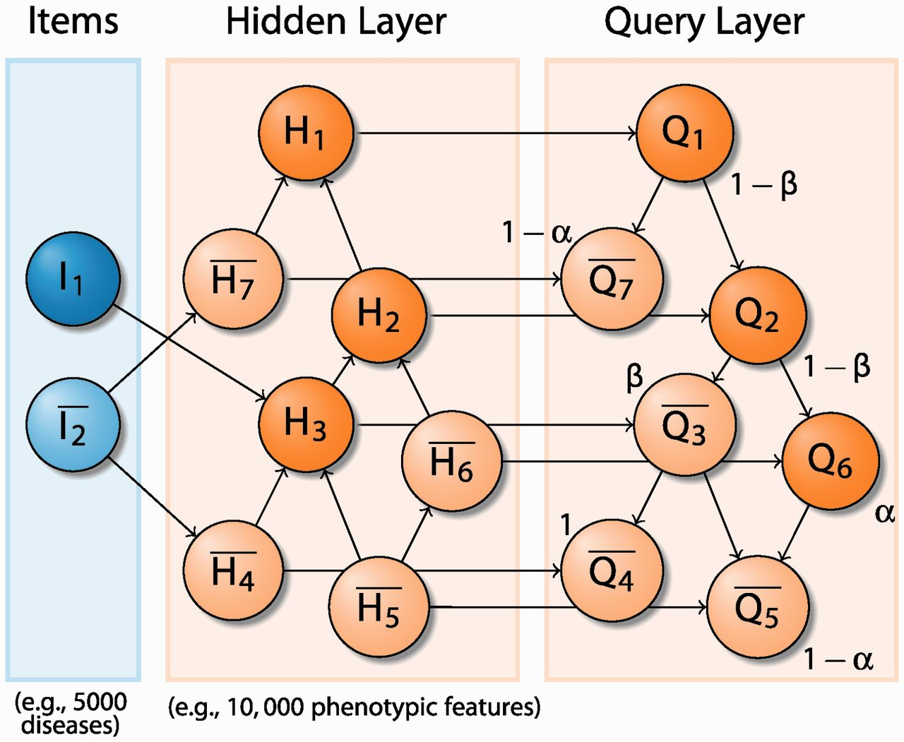{width="100%"}

::::
:::::

::::: {.columns}

:::: {.column width="33%"}

::: {style="font-size: 0.8em;"}

**Phenomizer**  
Köhler et al. (2009)  *Am J Hum Genet* **85**:457-64

:::
::::

:::: {.column width="33%"}
::: {style="font-size: 0.8em;"}

**Exact Score Distribution** 

Schulz MH et al (2011)  *BMC Bioinformatics* **12**:441

:::
::::

:::: {.column width="33%"}
::: {style="font-size: 0.8em;"}

**BOQA** 

Bauer et al. (2012) *Bioinformatics* **28**:2502-8

:::
::::

:::::

::: {.small}
* Today, we will go into detail about two phenotype matching algoriths, Phenomizer and LIRICAL.
:::


## Ontological Diagnostics

{fig-align="center" width="50%"}

$$\text{sim}(\color{orange}{Q} \rightarrow \color{blue}{d}) = \text{avg} \left[ \sum_{s \in \color{orange}{Q}} \max_{t \in \color{blue}{d}} \text{sim}(s,t) \right]$$

::: {layout-ncol=2}
::: {.card}
[$\color{orange}{Q}$: Query terms]{style="border: 1px solid #ccc; padding: 10px;"}
:::

::: {.card}
[$\color{blue}{d}$: Disease terms]{style="border: 1px solid #ccc; padding: 10px;"}
:::
:::


## The Phenomizer

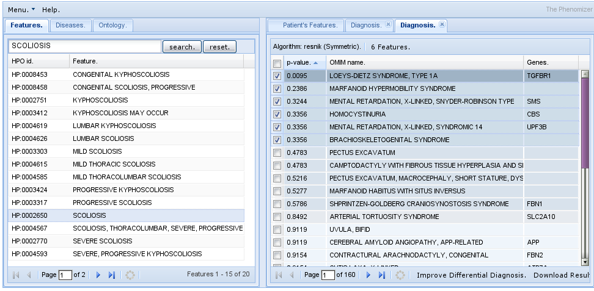{fig-align="center" width="60%"}

::: {.small-text}
* The **Phenomizer**: The first algorithm/software tool for supporting differential diagnostics with semantic similarity analysis
* Sebastian Köhler et al. (2009) Clinical Diagnostics with Semantic Similarity Searches in Ontologies. *Am J Hum Genet*, **85**:457--64.
* Online version supported 2009-2022...no longer available.
:::


## The query

::: {.mybox}
**Query terms**:
 The HPO is frequently used to create a set of terms that accurately describe the observed clinical abnormalities of an individual being evaluated for suspected rare genetic disease. 
:::

:::: {.columns}
::: {.column width="50%"}
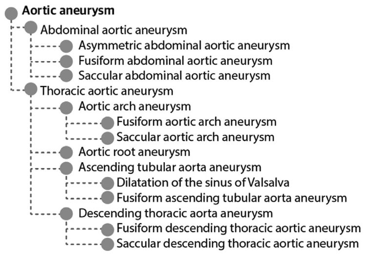{width="75%" fig-align="center"}
:::
::: {.column width="50%"}

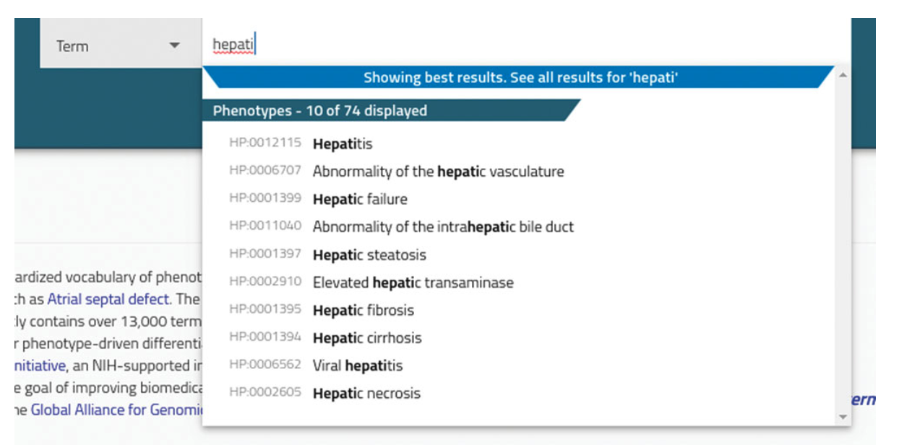{fig-align="center"}


:::
::::

- Physicians choose terms to represent the clinical anomalies seen in a patient^[The word "patient" is a role played by an individual who presents for medical treatment or diagnostics, but does not describe the individual him- or herself. In many contexts, the word "individual" is preferred.]
- Many tools are available. Some tools enable users to choose HPO terms by navigating the HPO hierarchy or by using autocomplete functions.


## The query
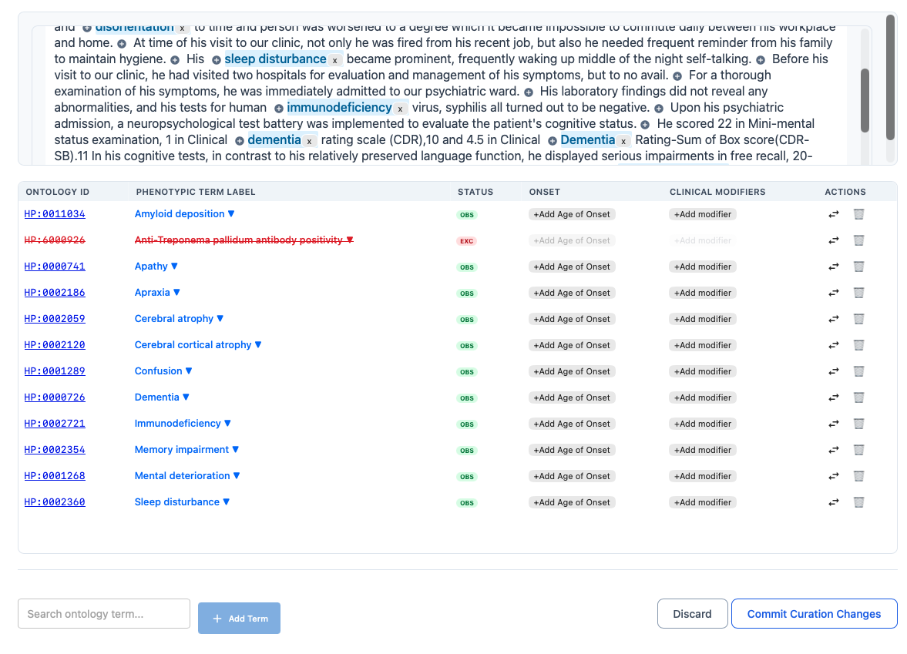{fig-align="center"}

- Various text mining (named entity recognition) tools are available

::: {.small-text}
- For more information on how to choose HPO terms to represent clinical data, see 
[Köhler S, et al., (2019) Encoding Clinical Data with the Human Phenotype Ontology for Computational Differential Diagnostics. Curr Protoc Hum Genet](https://pubmed.ncbi.nlm.nih.gov/31479590/)
- [phenoboard](https://github.com/P2GX/phenoboard)
:::

## Disease model(s)

::: {.mybox}
**Disease model**:
 The HPO is frequently used to create a set of terms that accurately describe the observed clinical abnormalities of an individualbeing evaluated for suspected rare genetic disease. 
:::

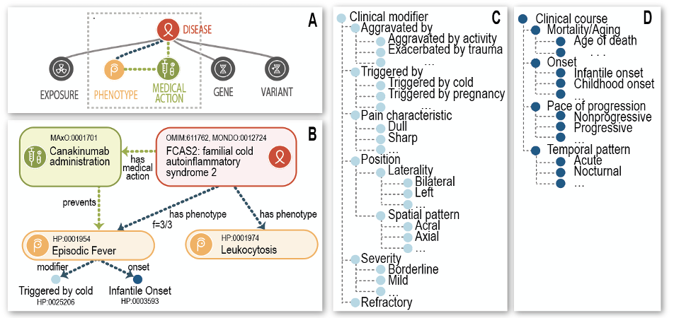{fig-align="center"}

- The HPO project has $>8000$ disease models 
- Algorithms such as Phenomizer compare the query with each model to determine a ranked list of models that best match the query
- Algorithms differ in how they calculate the strength of the **match**


## Fuzzy, specificity weighted matching


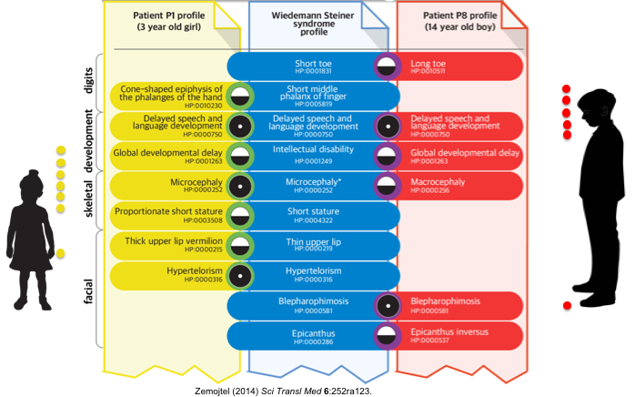{fig-align="center"}

## Example

**query**:

- Pulmonic stenosis [HP:0001642](https://hpo.jax.org/browse/term/HP:0001642)
- Upslanted palpebral fissure [HP:0000582](https://hpo.jax.org/browse/term/HP:0000582)
- Proportionate short stature [HP:0003508](https://hpo.jax.org/browse/term/HP:0003508)
- Headache [HP:0002315](https://hpo.jax.org/browse/term/HP:0002315)

For demo purposes, let's create two simplified disease models

:::: {.columns}
::: {.column width=50%}
**Noonan syndrome type 1 (NS1)**

- Pulmonic stenosis [HP:0001642](https://hpo.jax.org/browse/term/HP:0001642)
- Short stature [HP:0004322](https://hpo.jax.org/browse/term/HP:0004322)
- Downslanted palpebral fissures [HP:0000494](https://hpo.jax.org/browse/term/HP:0000494)
:::
::: {.column width=50%}
**Neurodevelopmental disorder 1 (NDD1)**

- Short stature [HP:0004322](https://hpo.jax.org/browse/term/HP:0004322)
- Primary microcephaly [HP:0011451](https://hpo.jax.org/browse/term/HP:0011451)
- Gray matter heterotopia [HP:0002282](https://hpo.jax.org/browse/term/HP:0002282)
:::
::::

## Example


| Query term                   | Noonan syndrome 1              | NS1 score | Neurodevelopmental disorder 1     | NDD1 score |
|:------------------------------|:--------------------------------|----------:|:-----------------------------------|-----------:|
| Pulmonic stenosis              | Pulmonic stenosis               |      4.19 | Phenotypic abnormality             |       0.00* |
| Upslanted palpebral fissure     | Downslanted palpebral fissure    |     2.59* | Phenotypic abnormality             |       0.00* |
| Proportionate short stature     | Short stature                   |      1.91* | Short stature                      |       1.91* |
| Headache                       | Phenotypic abnormality          |      0.00* | Abnormality of the nervous system |       0.51* |
| **Sum**                        |                                  |  **8.60** |                                    |   **2.42** |

* Information content of *Upslanted palpebral fissure* is 3.46, that of *Downslanted palpebral fissure* is 3.01. To calculate the most informative common ancestor, we go to their common parent *Slanting of the palpebral fissure* 
[HP:0200006](https://hpo.jax.org/browse/term/HP:0200006), which has an IC of 2.59
* *Short stature* is the direct parent of *Proportionate short stature*, and so the MICA is the IC of *Short stature*
* Noonan syndrome 1 receives a higher score than Neurodevelopmental disorder 1, and so NS1 would be ranked before NDD1
* The same process is performed for all 8500 candidate diseases to generate the final ranking (**prioritization**)

## Example

The table in the previous slide demonstrates how to calculate the phenomizer score
$$
\mathrm{sim}(Q\rightarrow D) = \mathrm{avg} \sum_{s\in Q}\max_{t\in D}\mathrm{sim}(s,t)
$$
- $\mathrm{sim}(s,t)$ is calculated as the IC of the maximally informative common ancestor (MICA), see @eq-mica.


::: {.mybox}
**From raw score to *p*-value**:

Raw similarity scores aren't directly comparable across diseases:

- A disease with **many annotated terms** has more chances for a lucky match
- A **small, specific** query profile behaves differently than a large, vague one
:::

- To make the Phgenomizer score comparable across 8500 diseases, we want to know:
    *How much does a score actually support a disease, given the query's and the disease's HPO term count and specificity?*

## Empirical *p*-value via simulation

For each candidate disease $D$:

1. Generate $N$ **random query profiles** of the same size as the observed query (terms sampled from the HPO term/annotation universe)
2. Compute the fuzzy similarity score between each random query and $D$, exactly as for the real query
3. This builds a **null distribution** of scores specific to $D$'s phenotype profile and the query size
4. Empirical *p*-value:

$$
p = \frac{\#\{\text{random scores} \geq \text{observed score}\}}{N}
$$

- Diseases are then ranked by $p$-value rather than raw score, making rankings comparable across diseases with very different profile sizes
- This was the basis of the original Phenomizer algorithm


## Empirical *p*-value via simulation

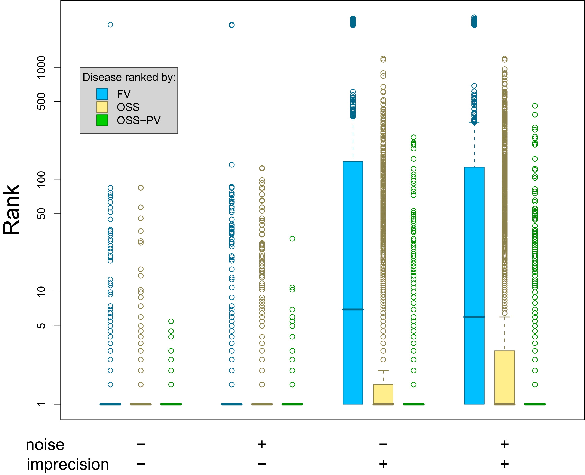

- Feature vector (FV) method, ontological similarity search (OSS), and p value (OSS-PV)

::: {.small-text}
Köhler S, et al. (2009) [Clinical diagnostics in human genetics with semantic similarity searches in ontologies. 
*Am J Hum Genet* **85**:457-64](https://pubmed.ncbi.nlm.nih.gov/19800049/)
:::

## LIRICAL{#lirical}

- LIRICAL is a newer phenotypic-driven prioritization algorithm that leverages the likelihood ratio test

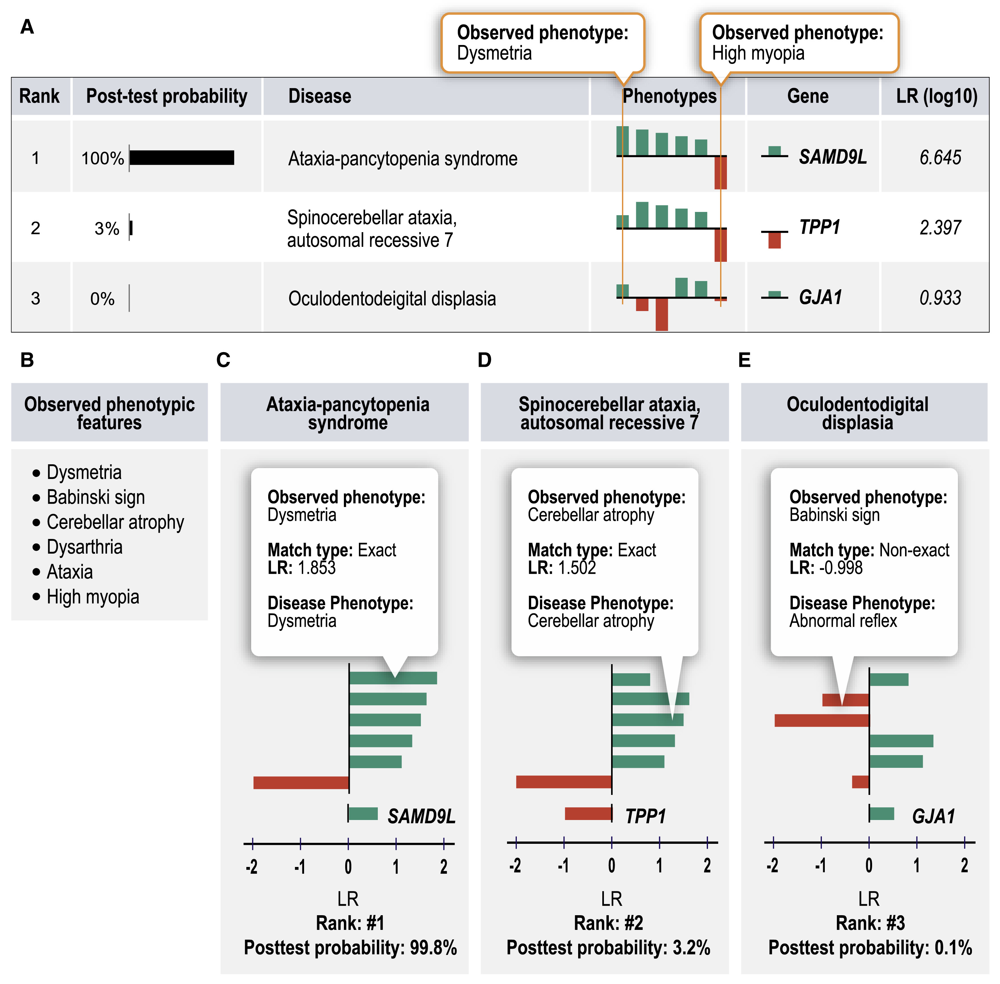{ width="50%" fig-align="center"}

- We will first explain the basic concepts of the likelihood ratio test (LRT) and then present LIRICAL in more detail.


## Likelihood Ratio Test: Intuition

Recall Bayes' law:
$$
P(A\mid B) = \frac{P(B\mid A)\cdot P(A)}{P(B)}
$$ {#eq-bayes}

- Suppose that Suppose that A is the presence (D+) or absence (D–) of a disease 
- Suppose B represents the result of a diagnostic test (x) fulfils, say the test result being abnormal. 
- Then

$$
P(D^{+}\mid x=\mathrm{abn}) = \frac{P(x=\mathrm{abn}\mid D^{+})\cdot P(D^{+})}{P(x=\mathrm{abn})}
$$ {#eq-bayes-present}

## Likelihood Ratio Test: Intuition

- Similarly, the probability of the absence of the disease (D–) given the test result is
$$
\begin{align}
P(D^{-}\mid x=\mathrm{abn}) &= 1 - P(D^{+}\mid x=\mathrm{abn}) \\
&= \frac{P(x=\mathrm{abn}\mid D^{-})\cdot P(D^{-})}{P(x=\mathrm{abn})} \\
\end{align}
$$ {#eq-bayes-absent}

- Dividing @eq-bayes-present by @eq-bayes-absent  and replacing P(D–) with 1 – P(D+) gives:
$$
\frac{P(D^{+}\mid x=\mathrm{abn}) }{1-P(D^{+}\mid x=\mathrm{abn}) } =
\frac{P(x=\mathrm{abn}\mid D^{+})}{P(x=\mathrm{abn}\mid D^{-})}
\times
\frac{P(D^{+})}{1 - P(D^{+})}
$$
- This is
$$
\text{Post-test odds of }D^{+} =
\frac{P(x=\mathrm{abn}\mid D^{+})}{P(x=\mathrm{abn}\mid D^{-})}
\times
\text{Pre-test odds of }D^{+}
$$

- This is the equation used in the Bayesian approach to interpret test results. 
- The factor $\tfrac{P(x=\mathrm{abn}\mid D^{+})}{P(x=\mathrm{abn}\mid D^{-})}$ is termed the likelihood ratio (LR)
- When the test result equals to $r$, we write $LR(r)$. 
- Generally speaking, the likelihood ratio indicates **how many times more (or less) likely a certain condition for a test result is expected to be observed in diseased, compared with non-diseased, people**

::: {.tiny-credit}
Habibzadeh F, Habibzadeh P (2019) [The likelihood ratio and its graphical representation. Biochem Med (Zagreb)](https://pubmed.ncbi.nlm.nih.gov/31015780/)
:::

## Review: odds vs. probabilities

Odds and probability both describe uncertainty, and are related by the following equation

$$
\text{odds} = \frac{P(\text{event})}{P(\text{not event})} = \frac{p}{1-p}
$$ {#eq-odds}

- @eq-odds implies $p = \tfrac{\text{odds}}{1+\text{odds}}$
- **Probability**
    - Ranges from 0 to 1
- **Odds**
    - Ranges from 0 to $\infty$


| Probability | Odds        | Reads as    |
|------------:|------------:|:------------|
|         50% |        1.00 | 1 : 1       |
|         90% |        9.00 | 9 : 1       |
|          2% |      0.0204 | ~1 : 49     |

- $p = 2\%$ → odds $= \dfrac{0.02}{1-0.02} \approx 0.0204$
- Small probabilities and their odds are nearly identical numerically; they diverge as $p \to 1$


## LIRICAL: motivation

::: {.columns}
::: {.column width="50%"}
::: {.tiny}
- Current WES/WGS detection rate: $\sim 40-50\%$
- But prevailing algorithms don't help us realize that there are no good candidates. #1 may still be poor.
:::
:::
::: {.column width="50%"}
::: {.tiny}
- Some phenotypic features may support a diagnosis while others do not
- Prevailing algorithms don't help users interpret the relative contribution of individual HPO terms to the computational ranking
:::
:::
:::

::: {.columns}
::: {.column width="50%"}
{width="90%" fig-align="center"}
:::
::: {.column width="50%"}
{width="90%" fig-align="center"}
:::
:::

## LIRICAL: Calculating the likelihood ratio

$$
\rm{LR}=\dfrac{P(x|\mathcal{D})}{P(x|\neg \mathcal{D})}
$$ {#eq-LR-def}

The definition of the LR can be extended to multiple tests. Suppose $X=(x_1,x_2,\cdots,x_n)$ is an array of $n$ test results. Under the assumption that the tests are independent, $\rm{LR}(X)$ is defined as:

$$
\frac{{\rm{{Pr}}}(X|\mathcal{D})}{{\rm{Pr}}(X|\neg \mathcal{D})} = \frac{{\rm{Pr}}(x_1,x_2,\cdots,x_n|\mathcal{D})}{{\rm{{Pr}}}(x_1,x_2,\cdots,x_n|\neg \mathcal{D})}
 = \prod_{i=1}^{n} \dfrac{{\rm{{Pr}}}(x_i|\mathcal{D})}{{\rm{Pr}}(x_i|\neg \mathcal{D})}
$$ {#eq-lrprod}

- With this equation, one can calculate a likelihood ratio for a set of query HPO terms
- But how exactly do we calculate $\dfrac{P(x|\mathcal{D})}{P(x|\neg \mathcal{D})}$?

## $\dfrac{P(h_i|\mathcal{D})}{P(h_i|\neg \mathcal{D})}$

- Calculating $P(h_i|\mathcal{D})$, the probability of an individual with disease $D$ to have HPO term $h_i$, is easy
- If the HPO annotations for $D$ include the HPO term $h_i$, then $P(h_i|\mathcal{D})$ is equal to the frequency of that term in the HPO annotations for the disease

```bash 
OMIM:614669	Auriculocondylar syndrome 2		HP:0000347	PMID:16114046	PCS		22/31		PHPO:skoehler[2012-10-17];HPO:probinson[2023-01-30]
```
- The above line is one of 285603 lines in the `phenotype.hpoa` file 
- It specifies the frequency of Micrognathia [HP:0000347](https://hpo.jax.org/browse/term/HP:0000347) in individuals with *Auriculocondylar syndrome 2*
- It is less obvious how to specify $P(h_i|\neg \mathcal{D})$ - the frquency of $h_i$ in individuals without disease $D$.
- In principle, we could collect data on the general population, omitting individuals with $D$, and estimate the population prevalence of $h_i$
- This is both impossible and also not a good model of the diagnostic situation in medical genetics (individuals who present for diagnosis are not an unbiased selection from the general population)

## $P(h_i|\neg \mathcal{D})$

- LIRICAL therefore makes the assumption that every individual in the population has some Mendelian disease. 
- Then we can estimate $P(h_i|\neg \mathcal{D})$ as follows (with a total of $N$ Mendelian diseases)
$$
P(h_i\mid D_j) = \frac{1}{N-1}\sum_{k\neq j} P(h_i\mid D_k) \approx \frac{1}{N}\sum_{k} f_{i}^{D_k}
$$

- Here, $f_{i}^{D_k}$ is the frequency of HPO term $i$ in individuals with disease $k$
- This is the key assumption ("trick") that allows us to apply the likelihood ratio framework to HPO-based differential diagnostic support
- There are many details about how to calculate $f_{i}^{D_k}$ in different situations and how to true-path rule is applied
- The next slide gives an impression of the algorithms.^[These details will not be covered in the exams]
- LIRICAL also introduces an approach to estimate likelihood ratios for genotypes that we will not cover here.

## LIRICAL: Calculating the likelihood ratio

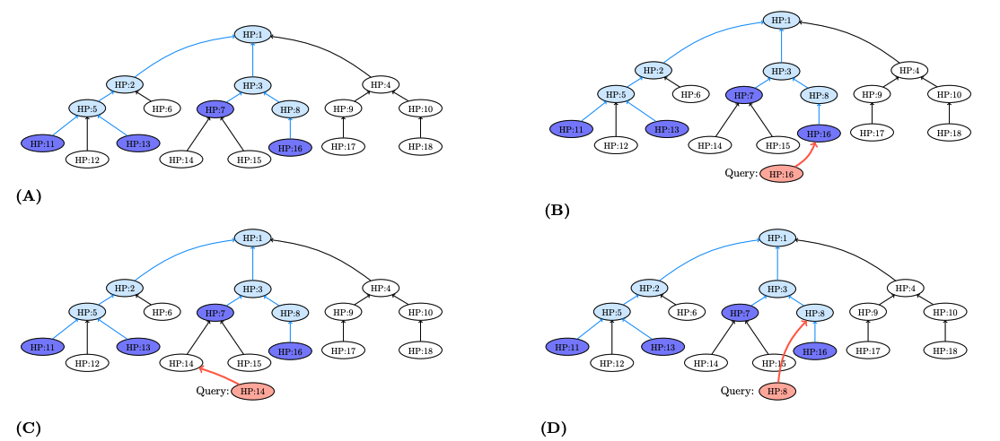{ width="60%" fig-align="center"}

::: {.tiny}
HPO annotations and frequency data: used to calculate $\dfrac{P(x|\mathcal{D})}{P(x|\neg \mathcal{D})}$, with heuristics for non-exact matches.

- Disease model annotated with four HPO terms (dark blue), annotated are "inherited" by ancestors (light blue)
- Exact match to query term: $P(h_{16}|\mathcal{D})=f_{16}^{\mathcal{D}}$
- Query matches descendent of annotated term: $P(h_{14}|\mathcal{D})=\frac{f_{7}^{\mathcal{D}}}{2}=0.5$
- Query matches ancestor of annotated term: $P(h_{8}|\mathcal{D})=f_{16}^{\mathcal{D}}$
:::


## LIRICAL: Posterior probabilities improve interpretation of rankings

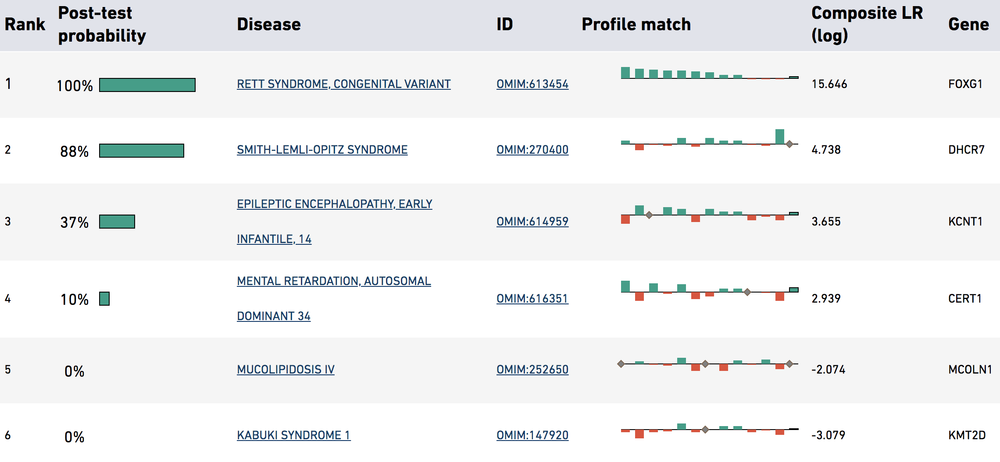{width="100%" fig-align="center"}

- LIRICAL provides estimates of posttest probabilities

## LIRICAL: Performance on 384 published case reports

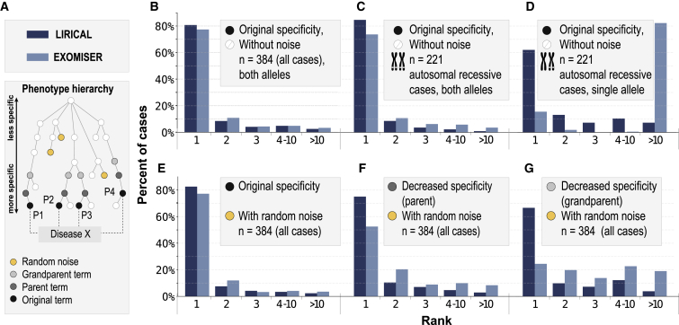{width="100%" fig-align="center"}

## LIRICAL: Detailed disease output page

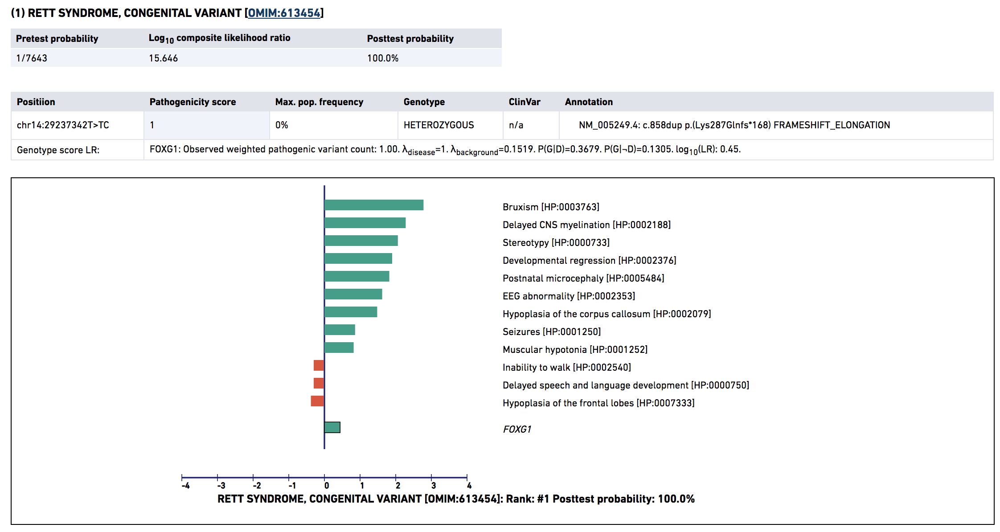{width="90%" fig-align="center"}


::: {.tiny-credit}
Robinson PN et al., Interpretable Clinical Genomics with a Likelihood Ratio Paradigm  
*Am J Hum Genet* 2020;**107**:403-417  
free for academic use
:::


## Sources

- [Albert A (1982) On the use and computation of likelihood ratios in clinical chemistry. *Clin Chem*  **28**:1113-9](https://pubmed.ncbi.nlm.nih.gov/7074890/): Excellent introduction to the mathemastics of LRs
- [Khinchin - Mathematical Foundations of Information Theory-Dover Publications (1957)](https://www.amazon.de/Mathematical-Foundations-Information-Advanced-Mathematics/dp/0486604349) Another excellent introduction to the mathemastics of LRs
- [Robinson PN et al. (2020) Interpretable Clinical Genomics with a Likelihood Ratio Paradigm. *Am J Hum Genet* **107**:403-417](https://pubmed.ncbi.nlm.nih.gov/32755546/)
- [Köhler S, et al. (2009) Clinical diagnostics in human genetics with semantic similarity searches in ontologies. *Am J Hum Genet* **85**:457-64](https://pubmed.ncbi.nlm.nih.gov/19800049/)
