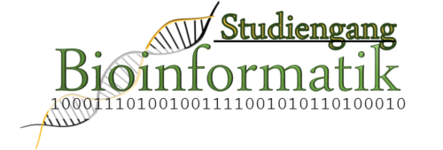

## Course Overview

This course is held as a part of the [Master Curriculum](https://www.mi.fu-berlin.de/bioinf/stud/master/index.html) in Bioinformatics of the Free University Berlin.

::: {.callout-note appearance="simple"}
Will LLMs replace computer scientists, software developers, and bioinformaticians?
:::

- Currently, the best appears appears to be: "Some of them"
- This course enables students to master two essential frameworks for managing human knowledge in bioinformatics: **Ontologies** and **Language Models**
- We will go into detail and implement simplfiied versions of some of the algorithms in Python
- Prerequisites: Some knowledge of probability, calculate, algorithms (We will explain everything as we go along)

## Course Overview

::: {.columns}

::: {.column width="60%"}
This course is part of the [Master Curriculum](https://link-to-fu.de) in Bioinformatics.

* **Target:** Graduate Students
* **Focus:** Knowledge representation
* **University:** Free University Berlin
:::

::: {.column width="40%"}

:::

:::

---

## Topics

The course explores the synergy between two paradigms:

::: {.grid}

::: {.g-col-6}
### 🕸️ Ontologies
*Structured Knowledge*
- Formal Semantics (OWL/RDF)
- Logical Consistency
- Interoperability (OBO)
:::

::: {.g-col-6}
### 🧠 LLMs
*Probabilistic Knowledge*
- Pattern Recognition
- Natural Language Interface
- Reasoning via Inference
:::

:::