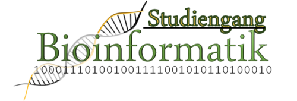

## Course Overview

This course is held as a part of the [Master Curriculum](https://www.mi.fu-berlin.de/bioinf/stud/master/index.html) in Bioinformatics of the Free University Berlin.

::: {.columns}

::: {.column width="60%"}
This course is part of the [Master Curriculum](https://link-to-fu.de) in Bioinformatics.

* **Target:** Graduate Students
* **Focus:** Knowledge representation
* **University:** Free University Berlin
:::

::: {.column width="40%"}

:::

:::

## Topics

::: {.callout-note appearance="simple"}
This course enables students to master two essential frameworks for managing human 
knowledge in bioinformatics: **Ontologies** and **Language Models**. We will provide an in-depth introduction to 
both topics as well as several sessions in which we show how ontologies and LLMs can be used together.
:::

The course explores two paradigms for representing human knowledge computationally:

::: {.columns}

::: {.column width="50%"}
### 🕸️ Ontologies
*Structured Knowledge*

- Formal Semantics (OWL/RDF)
- Logical Consistency
- Interoperability (OBO)
- Algorithms for GO and HPO
:::

::: {.column width="50%"}
### 🧠 LLMs
*Probabilistic Knowledge*

- Pattern Recognition
- Natural Language Interface
- Reasoning via Inference
:::

:::

## Prerequisites

- There will be a lot of math in this course
- Our goal is to use a mathematical perspective to deepen understanding of algorithms
- You should have some background in the following Topics:
  - calculus
    * differentiation
    * optimization
  - linear algebra
    * vectors, matrices
    * matrix multiplication
  - machine learning:
    * training, testing, overfitting
    * basic neural networks
- We will provide additional background and explanations in the practicals
- Peruse the slides for lectures in the ontology and LLM sections of the course to see if your preparation is sufficient

## Is AI ruining our skills?

::: {.callout-note appearance="simple"}
There is an increasing amount of evidence that
reliance on artificial-intelligence tools degrades the abilities of software engineers
:::

### Non-skilling

- Studies are showing that trainees who rely on AI during the early formative years of clinical education may fail to develop the foundational reasoning skills that they will need in work environments

::: {.tiny-credit}
see for instance: Ke Y, et al. (2026) [AI-induced never-skilling in medical education. *Nat Med* **32**:1997-2006](https://pubmed.ncbi.nlm.nih.gov/42174254/)
:::

### Will AI/LLMs replace computer scientists, software developers, and bioinformaticians?

- Currently, the best answer appears to be: ["AI will replace some of them, but it will make others more productive"]{style="color: green; font-weight: bold;"}. 

## Advice on the appropriate use of AI
- Do not use LLMs to do homework assignments!
- It is OK to ask specific questions with well crafted prompts, but be sure to study the answer and ideally the original source rather than merely copy and pasting.
- Vibe coding is not to be recommended but LLMs can be quite helpful with targeted questions (e.g., what CSS class makes a rounded box that looks like an orange parakeet?) or to get advice on how to optimize code (e.g., using iterators instead of traditional forloops in Languages such as Rust and Java).

> **Further Reading:**
> 
> * Pearson, H. (2025). [Are the Internet and AI affecting our memory? What the science says](https://www.nature.com/articles/d41586-025-00292-z). *Nature*.
> * Lenharo, M. (2026). [Is AI ruining our skills? Early results are in — and they’re not good](https://www.nature.com/articles/d41586-026-01947-1). *Nature*.