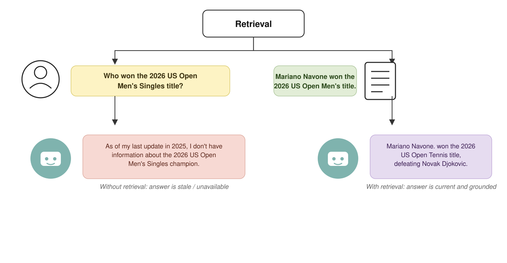
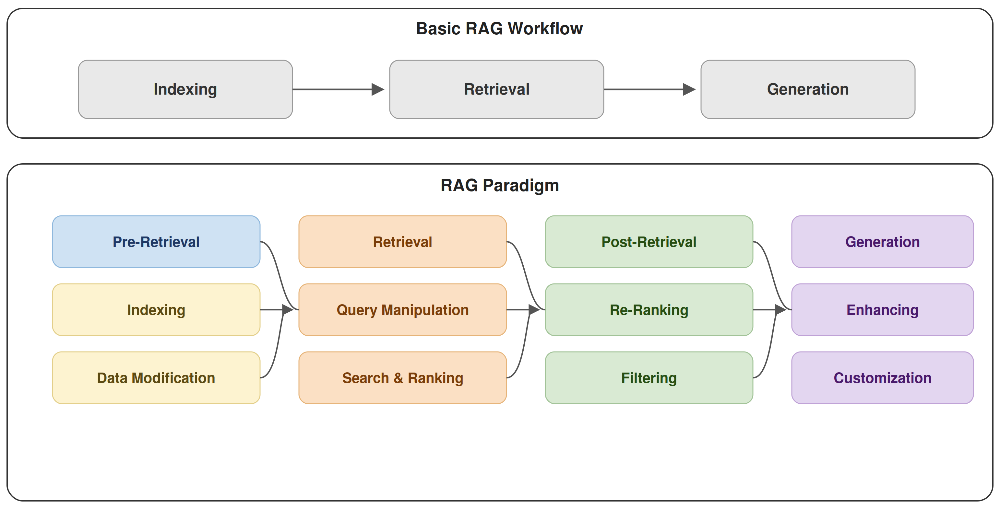

## Overview

::: {.callout-note}
## Game plan
This lecture will cover several algorithmic aproaches that have been used to improve the performance of LLMs in various settings.

- In the homework we will develop Python code to apply RAG and other approaches to support LLM-based named entity recognition (detection of ontology terms in texts)
:::

- [Retrieval augmented generation (RAG)](#rag)
- [Fine Tuning](#lora)
- [LLM Settings and structured output](#settings)
- [LLM-based NER](#ner)

## Retrieval augmented generation (RAG) {#rag}

- RAG was primarily designed to address three potential issues of LLMs
- LLMs are trained on massive amounts of broad, general data.
    - This restricts their ability to incorporate new data after training
        1. The focus of LLMs on huge data corpora may lead to inferior performance in specialized tasks
        2. The cost and effort involved in training an LLM means they cannot be updated frequently, and may therefore struggle with very recent data/information
        3. LLMs may generate convincing yet inaccurate responses ("hallucination")
    - We will see later on that LLMs may also struggle with named entity recognition (NER) of ontology terms. RAG-like approaches can be helpful here as well 

## RAG: Basic idea

{width=40% fig-align="center"}

- RAG can enable an LLM to provide precise answers beyond its initial training data
- Look up information in external data source

## RAG: Basic idea

::: {.mybox}
We will examine the RAG workflow as well as some typical applications in detail. For now, consider the basics

1. Indexing. The data source of interest (specific literature, company archive, ontology files, etc.) is indexed to enable quick and accurate identification of relevant items
2. Retrieval. Relevant items in the data source are indentified and retrieved
3. Generation. The retrieved items are used to interact with an LLM (e.g., creating a prompt by concatenating a query with the retrieved information) to obtain a desired result
:::

{width=40% fig-align="center"}

::: {.tiny-credit}
image adapted from: Huang, Y. et al. (2026) [A Survey on Retrieval-Augmented Text Generation for Large Language Models. *ACM Comput. Surv* **12**:1-38](https://dl.acm.org/doi/10.1145/3805774)
:::
