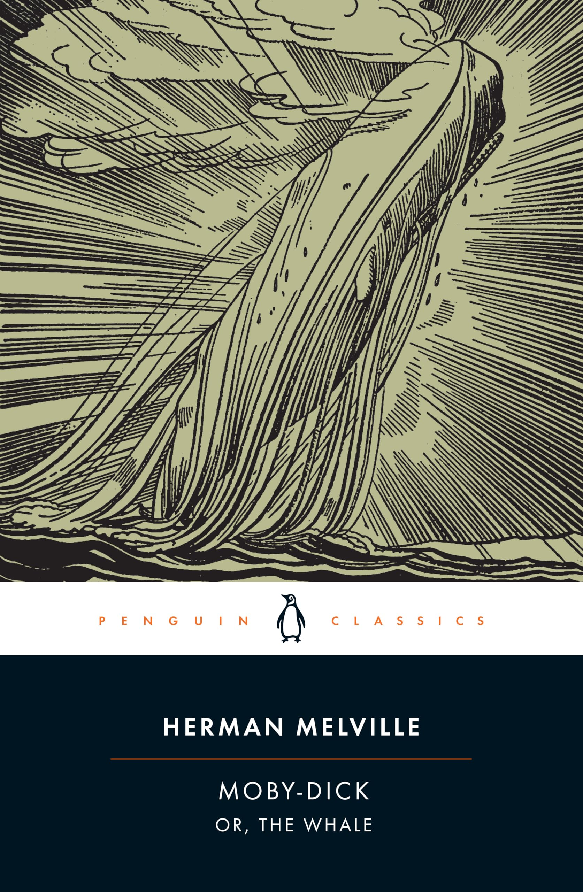
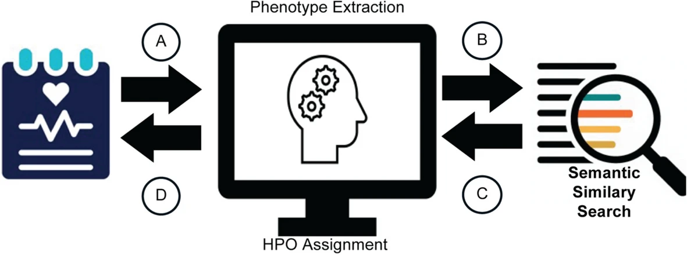
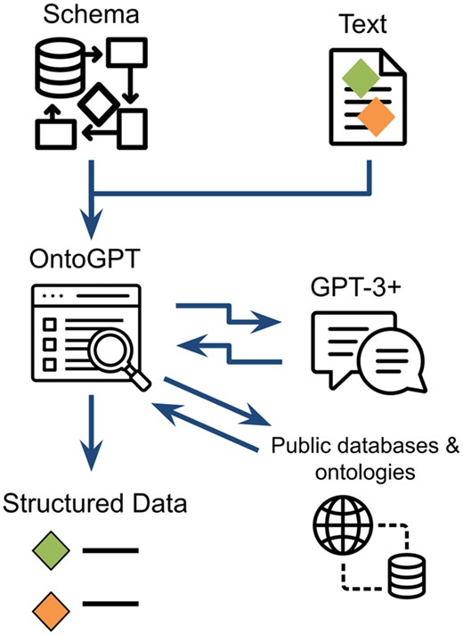
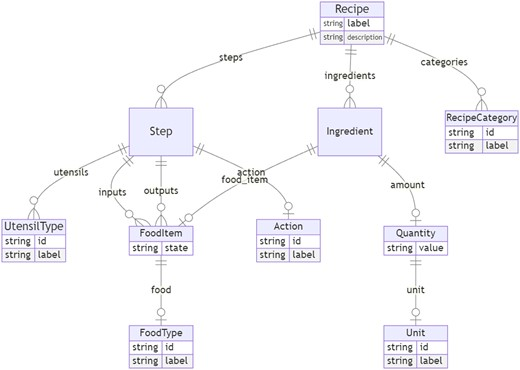

## Overview

::: {.callout-note}
## Game plan
This lecture will cover several algorithmic aproaches that have been used to improve the performance of LLMs in various settings.

- In the homework we will develop Python code to apply RAG and other approaches to support LLM-based named entity recognition (detection of ontology terms in texts)
:::

- [Retrieval augmented generation (RAG)](#rag)
- [RAG example](#moby)
- [RAG-HPO](#rag-hpo)
- [SPIRES](#spires)


## Retrieval augmented generation (RAG) {#rag}

- RAG was primarily designed to address three potential issues of LLMs
- LLMs are trained on massive amounts of broad, general data.
    - This restricts their ability to incorporate new data after training
        1. The focus of LLMs on huge data corpora may lead to inferior performance in specialized tasks
        2. The cost and effort involved in training an LLM means they cannot be updated frequently, and may therefore struggle with very recent data/information
        3. LLMs may generate convincing yet inaccurate responses ("hallucination")
    - We will see later on that LLMs may also struggle with named entity recognition (NER) of ontology terms. RAG-like approaches can be helpful here as well 

## RAG: Basic idea

{width=40% fig-align="center"}

- RAG can enable an LLM to provide precise answers beyond its initial training data
- Look up information in external data source


## RAG: Basic idea

::: {.mybox}
We will examine the RAG workflow as well as some typical applications in detail. For now, consider the basics

1. Indexing. The data source of interest (specific literature, company archive, ontology files, etc.) is indexed to enable quick and accurate identification of relevant items
2. Retrieval. Relevant items in the data source are indentified and retrieved
3. Generation. The retrieved items are used to interact with an LLM (e.g., creating a prompt by concatenating a query with the retrieved information) to obtain a desired result
:::

{width=40% fig-align="center"}

::: {.tiny-credit}
image adapted from: Huang, Y. et al. (2026) [A Survey on Retrieval-Augmented Text Generation for Large Language Models. *ACM Comput. Surv* **12**:1-38](https://dl.acm.org/doi/10.1145/3805774)
:::

## RAG: Example

- The basic algorithm of RAg is heuristic and can be most easily explained by an example.
- [HOMEWORK]{.hw-badge}  We will construct a somewhat artificial example that can be run on a laptop and ask you to extend the example.
- Moby Dick, by Herman Melville, is one of the classics of American Literature.
- The story gets started on the island of Nantucket. A classic soup dish from the time that is still popular is called Clam Chowder

{width=50% fig-align="center"}

## RAG: Example {#moby}
- We will use RAG to show how to answer the question 

::: {.mybox}
 What is a good place to eat chowder in early nineteenth century Nantucket?
:::

- If we ask this question of a small local LLM (gemma3:12b, which is available via olamma or on hugging face), we do not get a satisfactory answer 
- Imagine we have a database of books about Nantucket. Each book has a certain number of chapters
- We suspect that the answer can be found in on or other of the chapters. 
- RAG uses vector similarity to retrieve chapters that display semantic similarity with a query
- RAG then presents the chapters to the LLM and asks the LLM to craft a responce based on the information in the chapter

:::{.small-text}
- Although our example is rather artificial, you can imagine that this approach could be useful for
    * Archives of private files
    * Information about current events (from newspapers etc.) that took place after the LLM was trained
    * Specialised information in biomedical databases or ontologies
:::

## RAG: Moby Dick

- We download the text from [Project Gutenberg](https://www.gutenberg.org/cache/epub/2701/pg2701-images.html) and split the text into the 135 chapters

```text
This text is a comb...
CHAPTER 1. Loomings.: Call me Ishmael. Some years ago—never mind how long precisel...
CHAPTER 2. The Carpet-Bag.: I stuffed a shirt or two into my old carpet-bag, tucked it u...
CHAPTER 3. The Spouter-Inn.: Entering that gable-ended Spouter-Inn, you found yourself in...
CHAPTER 4. The Counterpane.: Upon waking next morning about daylight, I found Queequeg’s ...
CHAPTER 5. Breakfast.: I quickly followed suit, and descending into the bar-room ac...
CHAPTER 6. The Street.: If I had been astonished at first catching a glimpse of so o...
CHAPTER 7. The Chapel.: In this same New Bedford there stands a Whaleman’s Chapel, a...
CHAPTER 8. The Pulpit.: I had not been seated very long ere a man of a certain vener...
CHAPTER 9. The Sermon.: Father Mapple rose, and in a mild voice of unassuming author...
(...)
```

- See homework for the corresponding Python code

## Langchain: Document


- [LangChain](https://www.langchain.com/) is a Python library that accelerates LLM application development
    - modular abstractions for chaining prompts, memory, and external tools together.
    - foundation for building agents, retrieval-augmented generation (RAG) systems, and complex workflows.
- We encourage students to explore LangChain in the homework.
- `Document`: LangChain's standard container for a piece of text plus its associated metadata 

```{python}
#| echo: true
#| eval: false
from langchain_core.documents import Document

chapter_docs = [
    Document(page_content=body, metadata={"chapter": header})
    for header, body in real_chapters
]
```


## Langchain: Vector DB

- `Chroma`: an open-source vector database that runs locally
- Initializing Chroma embeds the chapters using the `nomic-embed-text` model
- `vector_store.add_documents(chapter_docs)`: Creates one vector for each of the documents
- Chroma stores the triple — the original text, its vector, and its metadata (the chapter tag) — all together in `moby_dick_chapters`.
- `vector_store` (line 12) now contains a searchable index of all chapters

```{python}
#| echo: true
#| eval: false
from langchain_chroma import Chroma
from langchain_ollama import OllamaEmbeddings

# Get Embeddings Model
embeddings = OllamaEmbeddings(model="nomic-embed-text")

# Initialize ChromaDB as Vector Store
vector_store = Chroma(
    collection_name="moby_dick_chapters",
    embedding_function=embeddings
)
vector_store.add_documents(chapter_docs) 
```

## Naive query

::: {.mybox}
Let's first try the query without RAG

- `gemma3:12b` is a small (quantized) version of a Gemini model (about 7Gb)
:::

```{python}
#| echo: true
#| eval: false
llm = ChatOllama(model="gemma3:12b", temperature=0)
chowder_question = "What is a good place to eat chowder in early nineteenth century Nantucket?"
no_rag_response = llm.invoke(chowder_question)
print(no_rag_response.content)
```

- The response is amusing (and hallucinated)
```{text}
Okay, let's dive into finding some chowder for a hungry traveler on Nantucket in the early 19th century (roughly 1800-1830). It's trickier than just looking up a restaurant review site! Here's what we can deduce and where you might have found good chowder, along with considerations about the dining experience.

**Understanding Early 19th Century Nantucket Dining:**

*   **No Restaurants as We Know Them:** The concept of a dedicated "restaurant" serving a menu to anyone who walks in wasn’t really established yet.  Dining was primarily done at:
(...)
Here's a breakdown of places you might find chowder, ranked roughly by probability and with what to expect:

1.  **The Main Taverns in Nantucket Town:** **(Most Likely - High Probability)**
    *   **The Globe Tavern:** This was one of the most prominent taverns on the island. It would have been a central gathering place for locals, sailors, and visitors. They *certainly* served chowder. Expect it to be hearty, rustic, and likely made with whatever fish was available that day (cod, hake, or even clams if they were plentiful).
    *   **The Union Hotel/Tavern:** Another significant establishment in Nantucket Town. Similar to the Globe, it would have been a reliable source for meals, including chowder.
    *   **Other Taverns:** There were several other smaller taverns scattered around Nantucket Town and even in some of the outlying areas (like Madaket).  These would also likely offer chowder. Look for signs advertising "Meals & Lodging."
    *   **Expectations at a Tavern:** The dining room would be communal, with tables shared by different groups. Service was basic – you'd order from a chalkboard or ask the proprietor what was available. Cleanliness might not have been up to modern standards.

(...)
```

## LangChain: RAG

```{python}
#| echo: true
#| eval: false
from langchain_ollama import ChatOllama
from langchain_core.prompts import PromptTemplate

retriever = vector_store.as_retriever()

prompt_template = """Use the context provided to answer 
the user's question below. If you do not know the answer 
based on the context provided, tell the user that you do 
not know the answer to their question based on the context
provided and that you are sorry.

context: {context}

question: {query}

answer: """

# Create Prompt Instance from template
custom_rag_prompt = PromptTemplate.from_template(prompt_template)
```

- `retriever`: wraps `vector_store` so it can be used to fetch semantically similar objects
- `custom_rag_prompt` is a PromptTemplate object — a structured representation of a prompt with named variable slots

## LangChain: RAG - create the chain of commands

```{python}
#| echo: true
#| eval: false
from langchain_core.output_parsers import StrOutputParser
from langchain_core.runnables import RunnablePassthrough

def format_docs(docs):
    return "\n\n".join(doc.page_content for doc in docs)

rag_chain = (
    {"context": retriever | format_docs, "query": RunnablePassthrough()}
    | custom_rag_prompt
    | llm
    | StrOutputParser()
)
```

- `rag_chain` is written in LangChain Expression Language (LCEL) — chains built with the | operator
- Works like Unix pipes, where each stage's output becomes the next stage's input.
- `retriever | format_docs` — the raw input (i.e., the chowder question) is fed into `retriever`, producing a list of `Documents``
- The `Document` obejcts are piped into `format_docs`, producing one joined string. This becomes the value at key "context".
- `custom_rag_prompt`: Takes the result of the query and formats it into a prompt text according to the template
- `llm`: Sends the prompt to our LLM (gemma)
- `StrOutputParser()`: formats output of the LLM


## LangChain: RAG - run the query

- The following code invokes the chain of commands from the previous slide using our chowder question.

```{python}
#| echo: true
#| eval: false
rag_chain.invoke(
  chowder_question
)
```
Now we receive a much more useful answer

```{text}
According to the text, a good place to eat chowder in early nineteenth-century Nantucket is at the Try Pots, 
which is run by Hosea Hussey. 
The narrator and Queequeg were recommended to it by the landlord of the Spouter-Inn and 
found it to be an excellent establishment known for its chowders.
```

# RAG-HPO {#rag-hpo}

- We will now present RAG-HPO, which brings together ontologies, LLMs, and RAG in a novel combination.



::: {.small-text}
Garcia BT, et al. (2025) [Improving automated deep phenotyping through large language models using retrieval-augmented generation. *Genome Med* **17**:91](https://pubmed.ncbi.nlm.nih.gov/40826123/)
:::

# RAG-HPO: Goals

- Human Phenotype Ontology (HPO) providing a standardized language for capturing clinical phenotypes (See [lecture 4](./hpo.qmd))
- To use HPO analysis, users need to generate a list of HPO terms representing the clinical manifestations of a patient
- Various text-mining approaches have been used in the past, but their performance is limited by many factors and manual review is often needed
- LLMs have also been used, but are prone to "hallucinations" that also necessitate manual review

:::{.mybox}
RAG-HPO is a Python-based tool that leverages retrieval-augmented generation (RAG) to elevate accuracy of HPO term assignment by LLM. 
:::

## RAG-HPO: Motivation

- LLMs are resource-intensive and slow in their reasoning compared to other machine learning methods 
- LLMs are prone to hallucinations, in which the model generates incorrect information and confidently asserts it as fact
- LLMs can be fine-tuned, but this is computationally expensive and requires substantial expertise

:::{.tiny-credit}
e.g., [Yang J, et al. (2023) Enhancing phenotype recognition in clinical notes using large language models: PhenoBCBERT and PhenoGPT. *Patterns (N Y)* **5**:100887](https://pubmed.ncbi.nlm.nih.gov/38264716/)
:::

- RAG on the other hand is more cost-effective and adaptable and is relatively easy to keep up to date, which is important for a resource such as HPO that is updated many times a year


## RAG-HPO workflow

- To set the stage for RAG-HPO, some amount of coding is needed that we will not cover in detail in this lecture.
- We will provide a bird's eye view of the preparation and focus on the final query stages
- Main stages:
    - Ingest the HPO file (hp.json)
    - Extract the main components of each HPO term (label, definition, synonyms, organ category, ancestry)
    - Create a vector database with one vector for each HPO term
    - Initialize a large language model (locally, for this example)
    - Encode the query using the same embedding model
    - Have the LLM extract phrases from the input text that it thinks are clinical descriptions
    - For each clinical description
        - Find the $k$ most similar HPO vectors using cosine similarity
        - Ask the LLM to decide if the clinical description can be represented by one of the $k$ HPO terms
        - If yes, return the HPO term together with metadata including the HPO id


## RAG-HPO: Structuring HPO data prior to vectorization

:::{.mybox}
**Intuition**: Vector similarity is implemented using SBERT (c.f., [lecture 11](./bert.qmd)). 

- Similarity will depend on the text chosen to represent each HPO term.
- Do we use the term label? Do we include other texts?
- The authors of RAG-HPO chose to represent the label, definition, synonyms, major organ system, and ancestry lineage: This provides more information to find potentially matching HPO terms based on similarity with clinical texts.
:::

```text
------------------------------------------------------------
HP ID:       HP:0004227
Info:        brachytelophalangism v
Direction:   0
Organ system:Limbs
Lineage:     All (HP:0000001) -> Phenotypic abnormality (HP:0000118) -> \
    Abnormality of limbs (HP:0040064) -> Abnormality of the upper limb (HP:0002817) -> \
    Abnormality of the hand (HP:0001155) -> Abnormal finger morphology (HP:0001167) -> \
    Aplasia/Hypoplasia of fingers (HP:0006265) -> Aplasia/Hypoplasia of the 5th finger (HP:0006262) -> \
    Short 5th finger (HP:0009237) -> Short distal phalanx of the 5th finger (HP:0004227)
Definition:  Hypoplastic/small distal phalanx of the fifth finger.
------------------------------------------------------------
```

* Information is extracted from each HPO term as shown above. This is the _sentence_ that is used for vectorization
* See [hpo vectorization (Jupyter notebook)](../notebooks/hpo_vectorization.ipynb){target="_blank"} for implementation details.

## RAG-HPO: Set up

```{python}
#| echo: true
#| eval: false
from langchain_ollama import ChatOllama
llm_client = ChatOllama(model="gemma3:12b", temperature=0)
emd_model = get_embedding_model()
docs, emb_matrix = load_vector_db(meta_path="hpo_meta.json", vec_path="hpo_embedded.npz")
index = create_faiss_index(emb_matrix, metric='cosine')
```

- We initialize a gemma model as our LLM. This is a relatively small (less than 8GB) but surprisingly powerful LLM that can be run on a decent laptop with Ollama 
- We load the embedding vectors and metadata as created above 
- We index the vectors using the FAISS library for quicker searching 

## RAG-HPO: Build the prompt

```{python}
#| echo: true
#| eval: false
from langchain_core.messages import SystemMessage, HumanMessage

messages = [
    SystemMessage(content=system_message_I),
    HumanMessage(content=clinical_note),
]

response = llm_client.invoke(messages)
```

- This `langchain` code initializes a prompt message from a System and a Human component. 
- Here, we would exchange the human message for eaach diagnostic query

## RAG-HPO Prompt (System message)


You are a highly specialized clinical information extraction system. Your 
task is to identify *all* phenotypic mentions in a clinical note and 
categorize them into exactly one of: Abnormal, Normal, Family History, 
Other, or Suspected.


**Instructions:**

1. **Scan Every Sentence**: Extract every phrase that describes a phenotype—signs, symptoms, abnormal findings, test results, anatomical observations—or any diagnostic conjecture or history statement.\n'
2. **Assign One Category**:
    - **Abnormal**: Any *observed* finding deviating from healthy (disease signs, lab abnormalities, pathological conditions). *These will be sent on for HPO mapping.
    - **Normal**: Explicit statements of normalcy.
    - **Family History**: Phenotypes in relatives.'
    - **Other**: Personal medical history, risk factors, demographics, or any non‐finding statement (e.g., “history of HIV,” “smoker,” “height 5′10″”).
    - **Suspected**: Any mention of a possible or rule‐out diagnosis (e.g., “possible sciatica,” “rule out PE”).
 3. **Preserve Specificity**: Extract the phrasing exactly as written.\n'
 4. **Output JSON Only**: Return `{ "phenotypes": [ { "phrase": ..., category": ... }, ... ] }`

 **Post‐processing:** Immediately drop anything not labeled Abnormal before HPO mapping.


## RAG-HPO Prompt (Human Message)

- The following is a clinical description of an individual who has presented for diagnostic evaluation
- The goal of analysis is to extract [Human Phenotype Ontology (HPO)]() terms from the text so that the terms can be entered into an analysis tool (c.f. [lecture 4](hpo.qmd))

::: {.small-text}
A 43-year-old Caucasian female experienced MCAS symptoms at age 18: specific foods and odours caused flushing, rashes, itching, wheezing, dizziness and nausea.
 At age 20, she noted problems with postprandial bloating/pain, constipation, evacuating stool and flatus with rotten egg odour. Restless legs syndrome (RLS) 
 gradually developed. At age 23, she developed orthostatic lightheadedness and tachycardia, body pain, generalised weakness and painful dependent leg oedema. 
 Ultimately, she suffered from 45 individual clinically significant symptoms (table 1). For 6 years, she became disabled owing to orthostatic symptoms, 
 fatigue and body pain. Faecal evacuation resulted in syncope with efforts >3 min. Early satiety led to a liquid diet. Pressure-induced hives and angioedema, 
 paraesthesia and nocturnal urination (seven times nightly) interfered with sleep. Over 16 years, 19 physicians failed to diagnose POTS and MCAS which were 
 established at a second location of the Mayo Clinic. Supine pulse of 80 beats/min increased to 160 after standing 10 min. Facial rash and oedema, cold.
:::


## RAG-HPO: First response

- The first step in RAG-HPO is to get the LLM to find pieces of text that could potentially represent phenotypic features.
- The point of RAG-HPO is that we can use these **candidates** to scan the HPO ontology for potential matches using a vector database
- We can then ask the LLM in a second step which of the HPO terms returned by the vector database are actually good matches.

Here is an excerpt of the LLM response:

```{text}
{
  "phenotypes": [
    {
      "phrase": "MCAS symptoms",
      "category": "Suspected"
    },
    {
      "phrase": "flushing",
      "category": "Abnormal"
    },
    {
      "phrase": "rashes",
      "category": "Abnormal"
    },
    {
      "phrase": "itching",
      "category": "Abnormal"
    },
    {
      "phrase": "disabled owing to orthostatic symptoms",
      "category": "Other"
    },
    (...)
}
```

## RAG-HPO

- For each of the `phrase` entries, RAG-HPO then asks for the best $k$ matches from the vector database

```{python}
#| echo: true
#| eval: false
qv = embed_query(phrase, embeddings_model, metric=metric)
```

```text
prepare md
[{'hp_id': 'HP:0031284', 'phrase': 'flushing', 'definition': None, 'organ_system': 'Integument', 'similarity': 0.9999998807907104}, 
{'hp_id': 'HP:0001033', 'phrase': 'facial flushing after alcohol intake', 'definition': None, 'organ_system': 'Integument', 'similarity': 0.6326053142547607}, 
{'hp_id': 'HP:0033349', 'phrase': 'seizure flurries', 'definition': None, 'organ_system': 'Other', 'similarity': 0.5522459149360657}, 
{'hp_id': 'HP:0032762', 'phrase': 'focal autonomic seizure with pallor/flushing', 'definition': None, 'organ_system': 'Nervous System', 'similarity': 0.5467579364776611}, 
{'hp_id': 'HP:4000054', 'phrase': 'exanthem', 'definition': None, 'organ_system': 'Integument', 'similarity': 0.5450245141983032}, 
{'hp_id': 'HP:0001041', 'phrase': 'blushing', 'definition': None, 'organ_system': 'Cardiovascular System', 'similarity': 0.5421429872512817}, 
{'hp_id': 'HP:0032761', 'phrase': 'focal aware autonomic seizure with pallor/flushing', 'definition': None, 'organ_system': 'Nervous System', 'similarity': 0.5294724106788635}, 
{'hp_id': 'HP:0002105', 'phrase': 'hemoptysis', 'definition': None, 'organ_system': 'Respiratory System', 'similarity': 0.5229952931404114}, 
{'hp_id': 'HP:0002380', 'phrase': 'fasciculation', 'definition': None, 'organ_system': 'Nervous System', 'similarity': 0.5166743993759155}, 
{'hp_id': 'HP:0034249', 'phrase': 'severe influenza', 'definition': None, 'organ_system': 'Other', 'similarity': 0.5164532661437988}, 
(...)
```

* Not surprisingly in this example, the HPO vector with the highest similarity to "flushing" is the vector for flushing (HP:0031284), at 99.99%
* The second-best hit has a simialrity of 63.2% etc.

## Understanding thre vector DB searchable

```{python}
#| echo: true
#| eval: false
#| code-line-numbers: "11"
def _collect_metadata_best(
    phrase: str,
    query_vec: np.ndarray,
    index: faiss.Index,
    docs: List[Dict[str, Any]],
    top_k: int = 500,
    similarity_threshold: float = 0.35,
    min_unique: int = 15,
    max_unique: int = 20
) -> List[Dict[str, Any]]:
    clean_tokens = set(re.findall(r'\w+', phrase.lower()))
    dists, idxs = index.search(query_vec, top_k)
    sims, indices = dists[0], idxs[0]

    seen_hp = set()
    results = []

    for sim, idx in sorted(zip(sims, indices), key=lambda x: x[0], reverse=True):
        if len(results) >= max_unique:
            break
        doc = docs[idx]
        hp = doc.get('hp_id')
        if not hp or hp in seen_hp:
            continue

        info = doc.get('info', '') or ''
        token_overlap = bool(clean_tokens & set(re.findall(r'\w+', info.lower())))

        #see next slide
```

* line 11 Tokenizes the input phrase into a lowercase set of word-tokens — e.g. "facial rash" → {"facial", "rash"}


## Understanding thre vector DB search (2)

```{python}
#| echo: true
#| eval: false
#| code-line-numbers: "12-13"
def _collect_metadata_best(
    phrase: str,
    query_vec: np.ndarray,
    index: faiss.Index,
    docs: List[Dict[str, Any]],
    top_k: int = 500,
    similarity_threshold: float = 0.35,
    min_unique: int = 15,
    max_unique: int = 20
) -> List[Dict[str, Any]]:
    clean_tokens = set(re.findall(r'\w+', phrase.lower()))
    dists, idxs = index.search(query_vec, top_k)
    sims, indices = dists[0], idxs[0]

    seen_hp = set()
    results = []

    for sim, idx in sorted(zip(sims, indices), key=lambda x: x[0], reverse=True):
        if len(results) >= max_unique:
            break
        doc = docs[idx]
        hp = doc.get('hp_id')
        if not hp or hp in seen_hp:
            continue

        info = doc.get('info', '') or ''
        token_overlap = bool(clean_tokens & set(re.findall(r'\w+', info.lower())))

        #see next slide
```

* **line 12**: Runs the actual FAISS similarity search: for query_vec (the phrase's embedding), find the top_k (default 500) nearest neighbors in the index. index.search returns 2D arrays because FAISS supports batched queries (searching many query vectors at once) 
* **line 13**: so `dists[0]`  (for the first, and in this case, only query) unwraps the single row of results. 
* `sims` is an array of 500 similarity scores (cosine similarities)
* `indices` is the corresponding array of 500 row-indices into docs.


## Understanding the vector DB search (3)

```{python}
#| echo: true
#| eval: false
#| code-line-numbers: "18,21,26-27"
def _collect_metadata_best(
    phrase: str,
    query_vec: np.ndarray,
    index: faiss.Index,
    docs: List[Dict[str, Any]],
    top_k: int = 500,
    similarity_threshold: float = 0.35,
    min_unique: int = 15,
    max_unique: int = 20
) -> List[Dict[str, Any]]:
    clean_tokens = set(re.findall(r'\w+', phrase.lower()))
    dists, idxs = index.search(query_vec, top_k)
    sims, indices = dists[0], idxs[0]

    seen_hp = set()
    results = []

    for sim, idx in sorted(zip(sims, indices), key=lambda x: x[0], reverse=True):
        if len(results) >= max_unique:
            break
        doc = docs[idx]
        hp = doc.get('hp_id')
        if not hp or hp in seen_hp:
            continue

        info = doc.get('info', '') or ''
        token_overlap = bool(clean_tokens & set(re.findall(r'\w+', info.lower())))

        #see next slide
```

* **line 18**: Pairs up each similarity score with its doc index, and sorts descending by similarity.
* **line 21**: `docs[idx]`gives us the metadata at index `idx`. We skip if it is malformed or if we have already `seen` this entry
* **line 26**: `info` holds the cleaned text of a single HPO label or synonym, e.g., "flushing", "arachnodactyly"
* **line 27**: `token_overlap` is `True` iff `info` shares any word with the input phrase's tokens.


## Understanding the vector DB search (4)

```{python}
#| echo: true
#| eval: false
#| code-line-numbers: "12"
def _collect_metadata_best(
    phrase: str,
    query_vec: np.ndarray,
    index: faiss.Index,
    docs: List[Dict[str, Any]],
    top_k: int = 500,
    similarity_threshold: float = 0.35,
    min_unique: int = 15,
    max_unique: int = 20
) -> List[Dict[str, Any]]:
        #see previous slide
        if token_overlap or sim >= similarity_threshold or len(results) < min_unique:
            seen_hp.add(hp)
            results.append({
                'hp_id': hp,
                'phrase': info,
                'definition': doc.get('definition'),
                'organ_system': doc.get('organ_system'),
                'similarity': float(sim)
            })
    return results
```

* **line 12**: A candidate is accepted if any of three things is true:
    - it shares a word with the query phrase, or
    - its cosine similarity is ≥ 0.35, or
    - `min_unique` accepted results has not been achieved yet (a fallback that accepts anything, regardless of quality, purely to guarantee a minimum count)


## Understanding the vector DB search (5)

```{python}
#| echo: true
#| eval: false
#| code-line-numbers: "21"
def _collect_metadata_best(
    phrase: str,
    query_vec: np.ndarray,
    index: faiss.Index,
    docs: List[Dict[str, Any]],
    top_k: int = 500,
    similarity_threshold: float = 0.35,
    min_unique: int = 15,
    max_unique: int = 20
) -> List[Dict[str, Any]]:
        #see previous slide
        if token_overlap or sim >= similarity_threshold or len(results) < min_unique:
            seen_hp.add(hp)
            results.append({
                'hp_id': hp,
                'phrase': info,
                'definition': doc.get('definition'),
                'organ_system': doc.get('organ_system'),
                'similarity': float(sim)
            })
    return results
```

* **line 21**: Following the for loop, we return a list of candidates


:::{.small-text}
| hp_id       | phrase                                        | organ_system   | similarity |
|-------------|------------------------------------------------|----------------|-----------:|
| HP:0031284  | flushing                                        | Integument     | 1.000      |
| HP:0001033  | facial flushing after alcohol intake            | Integument     | 0.633      |
| HP:0033349  | seizure flurries                                | Other          | 0.552      |
| HP:0032762  | focal autonomic seizure with pallor/flushing    | Nervous System | 0.547      |
| HP:4000054  | exanthem                                        | Integument     | 0.545      |
:::

# SPIRES

{width=40% fig-align="center"}


::: {.tiny-credit}

Caufield JH, et al. (2024) [Structured Prompt Interrogation and Recursive Extraction of Semantics (SPIRES): a method for populating knowledge bases using zero-shot learning. *Bioinformatics* **40**:btae104](https://pubmed.ncbi.nlm.nih.gov/38383067/)
:::

## SPIRES: Motivation

- Knowledge Bases and ontologies (KBs) encode domain knowledge in a structure that is amenable to precise querying and reasoning.
- However, the vast majority of human knowledge is communicated via natural language
- Large Language Models (LLMs) have shown great promise in interpreting biomedical texts, but often fail to identify ontology term identifiers and relations that are need to extract computable knowledge for KBs
- SPIRES aims to we use LLMs to build KBs using NLP at the time of KB construction
- This can assist manual knowledge curation and acquisition while validating facts prior to insertion into KBs such as HPO and many others.

## SPIRES: Main steps

- **Literature triage**: aids selection of relevant texts to curate
- **Named Entity Recognition (NER)**: identify textual spans mentioning relevant things or concepts such as genes or ingredients
- **grounding maps** these spans to persistent identifiers in databases or ontologies (e.g., the HPO term label `Arachnodactly` is mapped to its identifier `HP:0001166`)
- **Relation Extraction (RE)** connects named entities via predicates such as ‘causes’ into simple triple statements. 


## Knowledge Bases: Challenges

Most KBs are built upon detailed knowledge schemas which prove challenging to populate. 

- Schemas describe the forms in which data should be structured within a domain. 
- For example, a food recipe KB may break a recipe down into a sequence of dependent steps
    - each step is a complex knowledge structure involving an action, utensils, and quantified inputs and outputs. 

- Inputs and outputs might be a tuple of a food type plus a state (e.g. cooked)


{width=50% fig-align="center"}

## Sources


- Background: Huang, Y. et al. (2026) [A Survey on Retrieval-Augmented Text Generation for Large Language Models. *ACM Comput. Surv* **12**:1-38](https://dl.acm.org/doi/10.1145/3805774)
- SPIRES: Caufield JH, et al. (2024) [Structured Prompt Interrogation and Recursive Extraction of Semantics (SPIRES): a method for populating knowledge bases using zero-shot learning. *Bioinformatics* **40**:btae104](https://pubmed.ncbi.nlm.nih.gov/38383067/)
- RAG-HPO: Garcia BT, et al. (2025) [Improving automated deep phenotyping through large language models using retrieval-augmented generation. *Genome Med* **17**:91](https://pubmed.ncbi.nlm.nih.gov/40826123/)

