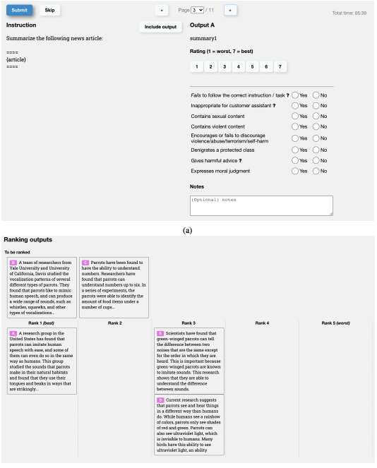
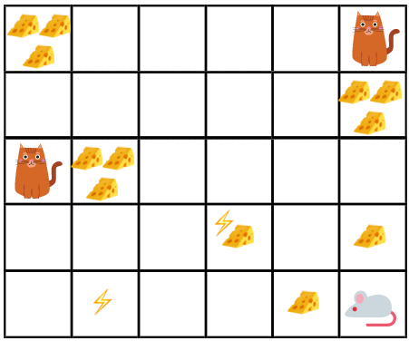
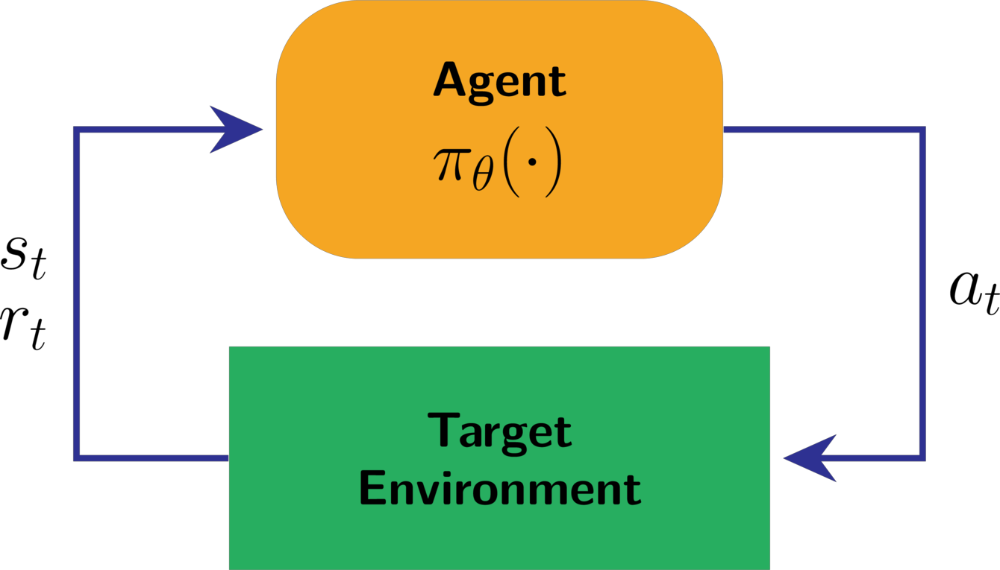
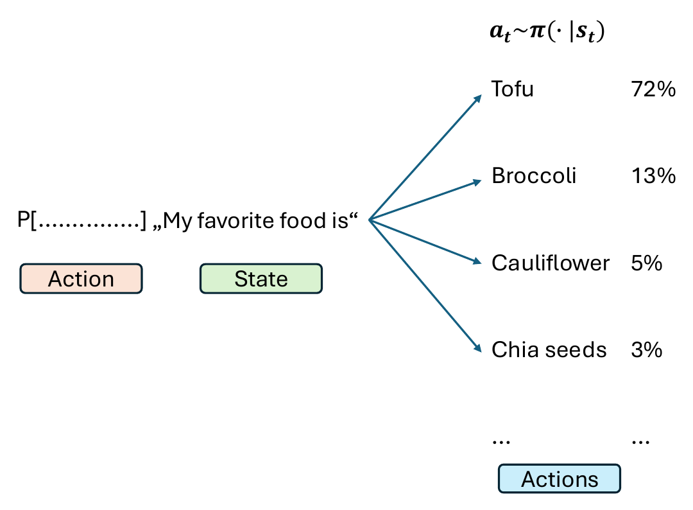
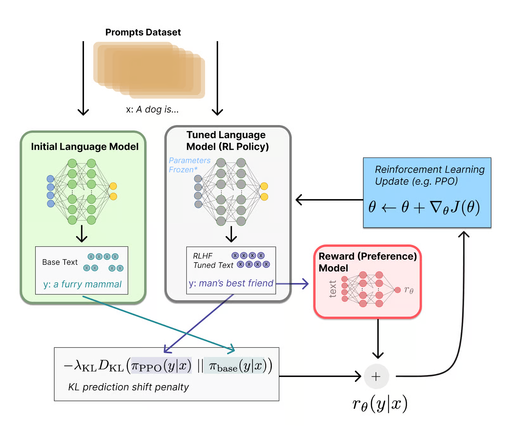
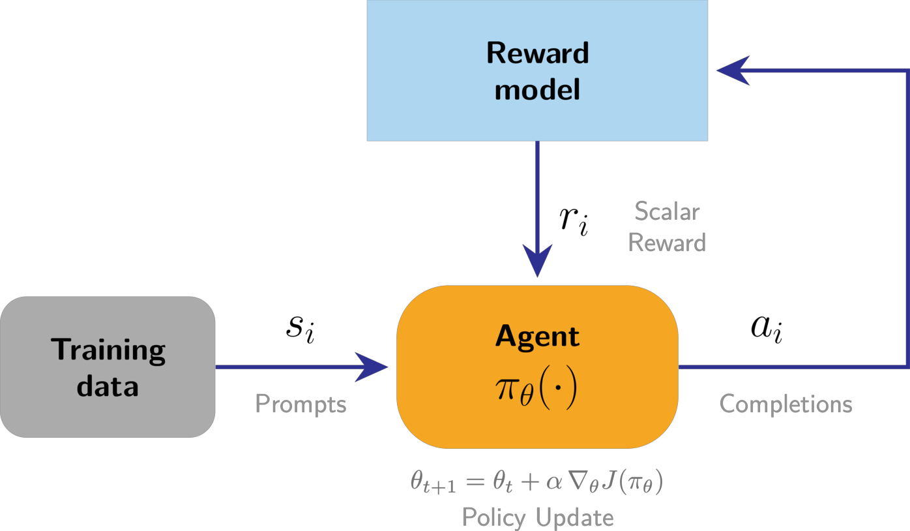
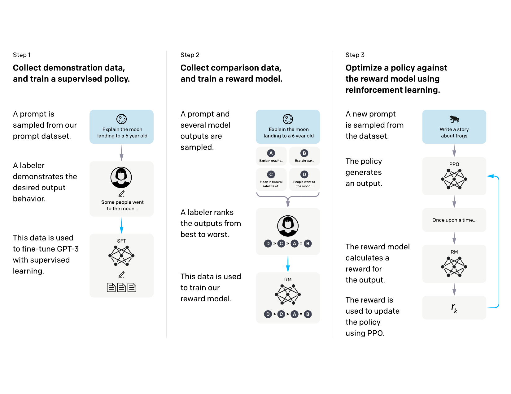
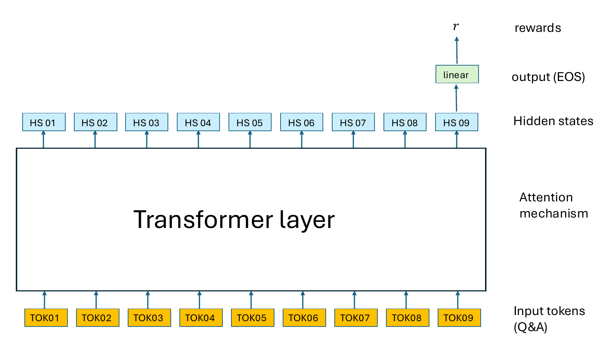
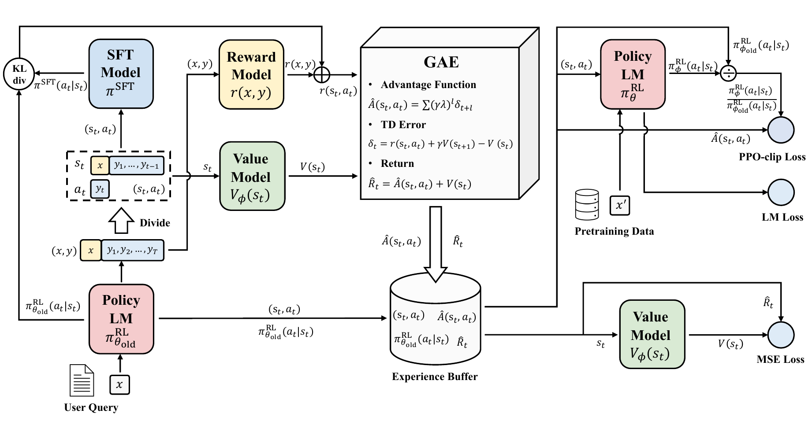

## Overview

::: {.callout-note}
## Game plan
Predicting the next token is great, but it does not a chatbot make.

- Various additional training stages are performed to extend and refine the capabilities of models
- The most important steps are  instruction fine tuning and reinforcement learning

:::

- [Pretraining vs posttraining](#pre-vs-post)
- [Instruction Fine Tuning (IFT)](#ift)
- [Reinforcment learning: Basic ideas and relationship to RLHF](#basic-rl)
- [Reward models](#reward)
- [Policy gradient optimization](#policy-gradient)
- [Reward to go](#reward-to-go)
- [Subtracting baselines](#baselines)

## AI-human Alignment

- An LLM is typically pretrained on massive amounts of data
- With this, the LLM can complete the prompt in a reasonable way
- What if we want to cause the model to have certain behaviors?
    - Do not use offensive language
    - Do not follow sexist or racist stereotypes
    - Answer questions at an easy or sophisticated level


:::{.mybox}
### AI-human Alignment

- The overall goal of AI alignment is to align a models output with some desired behavior
- This is the point of post-training (IFT and RLHF)
:::

## Posttraining with RLHF: Performance

{width=90% fig-align="center"}

- Current models have shown very substantial boosts in performance that are attributable to RLHF
- This example shows how the performance of openAI's o1 model scales with more RLHF train time
- AIME = American Invitational Mathematics Examination benchmark

:::{.tiny-credit}
- [OpenAI (2024) Learning to reason with LLMs](https://openai.com/index/learning-to-reason-with-llms/)
:::

## Posttraining with RLHF: Performance

- Most of the LLM innovation in recent years has been in the realm of posttraining
- Reinforcement learning with human feedback is the key technology
- This lecture will provide an introduction to the main components of posttraining


## Pretraining vs. Posttraining {#pre-vs-post}

```{python}
#| echo: false
#| fig-align: center
import sys
import matplotlib.pyplot as plt
sys.path.append('utils') 
import matplotlib.pyplot as plt
from reinforce_plots import training_stages
fig = training_stages(include=["Stage 0", "Stage 1"])
plt.show()
```

- Pretraining teaches the model to predict the next token

## Pretraining vs. Posttraining

```{python}
#| echo: false
#| fig-align: center
import sys
import matplotlib.pyplot as plt
sys.path.append('utils') 
import matplotlib.pyplot as plt
from reinforce_plots import training_stages
fig = training_stages(include=["Stage 2"])
plt.show()
```

- Instruction fine tuning teaches the model to answer questions (to be a chatbot)

## Pretraining vs. Posttraining

```{python}
#| echo: false
#| fig-align: center
import sys
import matplotlib.pyplot as plt
sys.path.append('utils') 
import matplotlib.pyplot as plt
from reinforce_plots import training_stages
fig = training_stages(include=["Stage 3"])
plt.show()
```

- Preference fine tuning (Reinforcement learning) teaches the model to respond in ways that correspond to human preferences (to be a _useful_ chatbot)

## Pretraining vs. Posttraining

```{python}
#| echo: false
#| fig-align: center
import sys
import matplotlib.pyplot as plt
sys.path.append('utils') 
import matplotlib.pyplot as plt
from reinforce_plots import training_stages
fig = training_stages(include=["Stage 4"])
plt.show()
```

- Reasoning fine-tuning intends to improve multi-step logical deduction, problem-solving, mathematical capability, and coding performance of LLMs
- We will not cover RFT in this course

::: {.small-text}
More information

- Chen X et al. (2026) [Putting on the Thinking Hats: A Survey on Chain of Thought Fine-tuning from the Perspective of Human Reasoning Mechanism. arxiv 2510.13170](https://arxiv.org/abs/2510.13170)
:::


## IFT (Instruction Fine-Tuning) and SFT (Supervised Fine-Tuning){#ift}


- **SFT**: fine-tuning a pretrained model on labeled input-output pairs using standard supervised learning (cross-entropy loss on target tokens, conditioned on some input).
- **IFT**: A specific kind of SFT where the training data is specifically instruction/response pairs, for instance:
    - **prompt**: "Summarize this text: ..." → **completion**: An actual summary of the text
    - **prompt**: "Write a poem about X" → **completion**: A poem about X. 

The goal of IFT is therefore to get the model to behave like a chatbot, i.e., to follow natural language instructions and conduct a conversation, rather than just continuing the input text


## Intuition: Before IFT

::: {style="background-color:#FEF2F2; border-left: 5px solid #DC2626; padding: 12px 16px; border-radius: 6px; margin-bottom: 10px;"}
**Prompt:** What is the most delicious Spanish appetizer?

**Response:** What is the most delicious Spanish appetizer? What is the most delicious Mexican appetizer? What is the most delicious Portuguese appetizer? 
These are the kinds of questions that get asked all the time, so we decided to put together a definitive ranking...
:::

- The raw model isn't "answering" so much as continuing the statistical pattern (predicting the next token)
- The text might resemble some blog text about appetizers, but it is not answering the user's question directly

## Intuition: After IFT

::: {style="background-color:#F0FDF4; border-left: 5px solid #16A34A; padding: 12px 16px; border-radius: 6px; margin-bottom: 10px;"}
**Prompt:** What is the most delicious Spanish appetizer?

**Response:** A top pick is patatas bravas (fried potatoes with a spicy tomato sauce and aioli).
:::

- After instruction tuning, the model recognizes the input as a request directed at it
- The model produces a direct answer instead of continuing a hypothetical document


## Data source

- OpenAI hired a team of about 40 freelance labelers

- Our prompt dataset consists primarily of text prompts submitted to the OpenAI API
- Customers using the Playground were
informed that their data could be used to train further models v
-  We heuristically deduplicate prompts by checking for prompts that share a long common
prefix, and we limit the number of prompts to 200 per user ID.

## labelling methods

::::{.columns}
:::{.column width=50%}

- Open AI's labelling interface for InstructGPT
- For each output, labelers give a Likert score for overall quality on a 1-7 scale, and also provide various metadata labels. 
-  After evaluating each output individually, labelers rank all the outputs for a given prompt. 
- The team generated
    - $\sim$ 13,000 training prompts for SFT/IFT
    - $\sim$ 33,000 training prompts for the reward model training
    - $\sim$ 31,000 training prompts for reinforcement learning (PPO)

:::
:::{.column width=50%}

{ width=80% fig-align="center}

:::
::::

:::{.tiny-credit}
Image source: Ouyang L, et al. (2022) [Training language models to follow instructions with human feedback. arXiv 2203.02155](https://arxiv.org/abs/2203.02155)
:::


## Chat Templates {#chat_templates}

Each major LLM has a template structure that organizes the main components of the chat so the model can recognize them.


- Unambiguous structure
- Allow multiturn conversations
- Enables use of APIs 

::: {.mybox}

- chat templates are required to format data for training so the models recognize the components of the message (system, user, assistent, in some cases tools)

:::


## Example

```text
messages = [
    {"role": "system", "content": "You are a helpful assistant."},
    {"role": "user", "content": "Hello!"},
    {"role": "assistant", "content": "Hi! How can I help you today?"},
    {"role": "user", "content": "What's the weather?"},
]
```

:::{.small-text}
This example is taken from the Hugging Face LLM course
:::


- The format and keywords vary for some models
- This is the style for OpenAI style and Qwen
- `im` stands for *instruction message* (e.g., `im_start` refers to the start of the instruction message)

```text
<|im_start|>system
You are a helpful assistant.<|im_end|>
<|im_start|>user
Hello!<|im_end|>
<|im_start|>assistant
Hi! How can I help you today?<|im_end|>
<|im_start|>user
What's the weather?<|im_start|>assistant
```

## IFT Best Practices

- High quality completions needed 
- Generally, modern LLMs train with on the order of 1 million prompts


<table style="border-collapse: collapse; width: 100%;" border="1">
<thead>
<tr><td><b>Item</b></td><td><b>Pretraining</b></td><td><b>IFT</b></td></tr>
</thead>
<tbody>
<tr><td>Data</td><td>enormous</td><td>ca. 1 million prompt completions</td></tr>
<tr><td>Batch size</td><td>256</td><td>1024-2048</td></tr>
<tr><td>Learning rate</td><td>$1\times 10^{-5}$</td><td>$3\times 10^{-4}$</td></tr>
<tr><td>Loss function</td><td>CE</td><td>CE</td></tr>
</tbody>
</table>

## Question {.center background-color="#ffe1f5"}

{width=60%}

- The learning rate is typically $3\times 10^{-4}$ in pretraining but only $1\times 10^{-5}$ for IFT. _Why is this_?

## Answer

- A lower learning rate is used during instruction fine-tuning (IFT) than during pretraining
- IFT uses a much smaller amoutn of training data and therefore has a narrower data distribution.
- The lower learning rate is thought to help prevent overfitting on the IFT prompts

## Question {.center background-color="#ffe1f5"}

{width=60%}

- During pretraining, the model learns to predict the next token. The entire input texts are used
- Both pretraining and IFT use the same kind of cross-entropy (CE) loss
- During IFT, the model is training on prompt-completion pairs. What part of this data is used for training?


## Answer

- **Loss Masking**: In IFT,  cross-entropy (CE) loss is applied exclusively on the assistant tokens (i.e., the completions, not the prompts)
- **Prompt tokens**: The prompt tokens are masked (removed) from the loss calculation
- We want the model's objective to be focussed on  generating accurate, context-aware completions
- The foundational language model has already learned grammar, syntax, and general world knowledge during pretraining, and so the IFT phase can focus just on generation of completions

::: {.small-text}
More information:
- Huerta-Enochian M and Ko SY (2024) [Instruction Fine-Tuning: Does Prompt Loss Matter? arXiv 2401.13586](https://arxiv.org/abs/2401.13586)
:::


## IFT pipeline

<table class="no-border">
<thead>
<tr><td><b>Step</b></td><td><b>Key resource</b></td><td><b>Purpose</b></td></tr>
</thead>
<tbody>
<tr class="fragment"><td>Dataset formatting</td><td>chat templates</td><td>architecture learns to distinguish between user inputs and assistant outputs.</td></tr>
<tr class="fragment"><td>Tokenization and sequence packing</td><td>Raw text is tokenized into IDs and concatenated</td><td>maximize GPU memory utilization and minimize wasted padding compute</td></tr>
<tr class="fragment"><td>Loss masking </td><td>CE loss computed only on the assistant completion tokens; prompt tokens assigned a loss weight of zero</td><td>gradients focus exclusively on generation quality</td></tr>
<tr class="fragment"><td>Optimizer and learning rate configuration</td><td>AdamW optimizer with reduced peak learning rate</td><td>Do not erase pre-trained representations</td></tr>
<tr class="fragment"><td>Parameter strategy selection</td><td>Full-parameter updates or Parameter-Efficient Fine-Tuning (PEFT) methods like LoRA or QLoRA</td><td>Target attention projections to adapt weights efficiently</td></tr>
</tbody>
</table>


## RLHF, GPT, and ChatGPT {#basic-rl}

:::{.mybox}
- Reinforcement learning was a key idea to take early versions of GPT to the current versions of chat agents such as ChatGPT
:::

In the following slides, we will present

- A brief introduction to (traditional) reinforcement learning (RL)
- An explanation of the differences between RL and RL with human feedback (RLHF), which is used for LLMs
- Reward models


## Reinforcement Learning (RL): Basics

- An **agent** iteratively takes **actions** within an **environment** according to a **policy**.
- The state at time (step) $t$ is denote $s_t$, and the action that is proposed at this step is denote $a_t$
- The policy $\pi_\theta$ can either be deterministic or stochastic

{width=90% fig-align="center"}

- When using reinforcement learning for LLMs, the policy is stochastic.
- The policy $\pi_\theta$ outputs a distribution over the set of possible actions, and the probability of a specific action is $\pi_\theta(a_t\mid s_t)$
- After an action is taken, the environment emits a **reward** representing the desirability of the resulting state. The reward $r_t$ may be negative, zero, or positive

::: {.tiny-credit}
image source: Reinforcement Learning: An Introduction, Richard Sutton and Andrew G. Barto
:::


## Actions and Transitions


- The policy outputs an action based on the current state. The probability of action $a_t$ given that we are currently in state $s_t$ is
$$
\pi_\theta(a_t\mid s_t)
$$ {#eq-policy-definition}

- After the policy outputs an action, the state of the environment will be updated according to the **transition function**^[Note: the transition function is generally deterministic for LLM-RLHF]

$$
P(s_{t+1} |  s_t, a_t) 
$$ {#eq-transition-fxn}


## Reinforcement learning: Example

:::: {.columns}
::: {.column width=50%}
- **Agent**: the mouse
- **State**: (x,y)-position of the mouse
- **Action**: move to another valid (x,y) position
- **Reward model**:
    - Move to an empty cell: reward of 0
    - Move to a cell with cheese: Reward of 2
    - Move to cell with cheese and electric shock: Reward of -1
    - Move to cell with cat: Reward of -5
- **Policy**: rules how the agent selects the action to perform given current state; $a_t\sim \pi(\cdot\mid s_t)$
- Goal of RL is to select a policy that maximizes the expected reward when an agent acts according to the policy
:::
::: {.column width=50%}


::: {.tiny-credit}
image source: https://www.freecodecamp.org/
:::
:::
::::

## RL: Trajectories {#sec-trajectory}


Intuitively, we can conceptualize RL as a trial and error process. As our agent acts in its environment, the training process reinforces—either positively or negatively—observed behavior via the reward. Hence, the name “reinforcement” learning.

- A trajectory is a sequence of states
- We begin from an initial state $s_0$
- The agent iteratively
    - Samples action $a_t$ based on the current state $s_t$
    - Transitions to the next state $s_{t+1}$
    - Receives reward $r_t$
- The trajectory continues until the final state $s_T$ is reached (terminal state or because a maximum number of states was reached)
- The trajectory $\tau$^[$\tau$=tau] is represented as follows:
$$
\tau = \left(\underbrace{s_0,a_0,r_0}_{t=0},  
\underbrace{s_1,a_1,r_1}_{t=1}, \ldots,
\underbrace{s_{T-1},a_{T-1},r_{T-1}}_{t=T-1},
\underbrace{s_T}_{t=T}\right)
$$


## RL: Recap

::: {.mybox}
**Reinforcement learning: in sum**:

- RL training repeatedly samples different trajectories
- The agent thereby explores the space of possible states and actions 
:::

- The goal of RL learning is to discover parameters $\theta$ that maximize reward of the most probable trajectories.

{width=50% fig-align="center"}


:::{.tiny-credit}
- Image source: [RLHF Book](https://rlhfbook.com/), lecture 2.
:::


## RL and LLMs

::: {.mybox}
- Reinforcement Learning from Human Feedback (RLHF) is increasingly treated as a crucial ingredient for high performance large language models.
:::

- **Agent**: The LLM
- **State**: the prompt (i.e., the input tokens)
- **Action**: which token is selected as the next token
- **Reward model**: We reward the LLM for generating *good responses* and do not reward *bad responses*
- **Policy**: The policy is the LLM itself, because the the next token function can easily be modelled as an action
    - $a_t$ is the next token
    - $a_t$ is distribution according to the policy with parameters $\theta$ (i.e., the LLM): $a_t\sim \pi_\theta(\cdot\mid s_t)$
    - state $s_t$ is the original prompt plus the completion up to step $t-1$.


## RL and LLMs



- Prompt is the state (_My favorite food is_), and the action is the choice of the next token
- But how do we implement the reward model?

## RL/LLM - rewards

| Question (Prompt) | Answer 1 | Answer 2 |  Chosen |
|:-----------------:|:--------:|:--------:|:--------:|
| Where is Jena?    | Niedersachsen | Thüringen |  2|
| What is 2+3?      | 5 | 42 |  1|
| Explain quantum mechanics | It's about cats |  Quantum mechanics is the rulebook for super tiny things that act like magic.| 2 |
<hr>

- We ask humans to indicate which answer they prefer and rank the answers
- Answers that are chosen get a high reward, those that are not get a low reward


## RLHF: Big picture {#sec-rlhf-bigpic}

:::: {.columns}
::: {.column width=60%}



::: {.tiny-credit}
Image source: Lambert, Illustrating Reinforcement Learning from Human Feedback (RLHF), [Hugging face blog](https://huggingface.co/blog/rlhf?utm_campaign=token-1-16-what-is-rlhf-reinforcement-learning-from-human-feedback&utm_medium=referral&utm_source=www.turingpost.com)
:::

:::
::: {.column width=40%}

- **Initial language model**: (from pretraining)
- **Tuned language model**: iteratively adjusted by RLHF
- **Reward model**: quantifies human preference between alternative completions
- **KL prediction shift penalty**: keeps RLHF model from drifting too far from original model
- **Update**: Method to update RLHF model
- **Today**: We will explain these components

::: {.small-text}
- **Note**: There are many new developments that we will not touch upon
:::

:::
::::

## Classical RL vs RLHF 

:::: {.columns}
::: {.column width=50%}
**Classical RL**

- Agent takes actions $a_t$ in an environment that has states $s_t$
- Reward is a **known** function $r(s_t, a_t)$ from the environment that is evaluated once per step
- We optimize a cumulative return over a trajectoy with $T$ total steps

$$
J(\pi) =
\mathbf{E}_{\tau\sim\pi}\left[ \sum_{t=0}^T \gamma^t r(s_t,a_t)\right]
$$
:::
::: {.column width=50%}
**RLHF**

- No environment - prompts are sampled from a dataset 
- Reward is **learned** from human preferences
- Response-level reward (for entire completion, not per-token)
- Regularized with KL penalty (to stay close to base model)
$$
J(\pi) =
\mathbf{E}\left[ r_\theta (x,y) - \beta D_{KL}(\pi\Vert \pi_{ref})\right]
$$

:::
::::

* Today, we will focus on ways to calculate $r_\theta (x,y)$, the reward for a `(prompt,completion)` pair
* In the second lecture on RLHF, we will explain the remaining pipeline with a focus on InstructGPT and a brief presentation of some newer approaches

:::{.tiny-credit}
- See [RLHF Book](https://rlhfbook.com/), lecture 2.
:::

 ## Language Models and RL

 | MDP Concept | LLM |
 |------------|-------|
 | state $s_t$ | Prompt + tokens so far: $(x,y_{<t})$|
 | action $a_t$ | next token $y_t$ |
 | transiotion $P$ | deterministic: append next token|
 | Policy $\pi_\theta(a_t\mid s_t)$ | LLM next token distribution |
 | reward $r$ | Usuaully terminal: RM score or verifier output |
 | Discount $\gamma$ | typically $\gamma=1$ (no discounting) |

 The policy is the LM; factored over tokens
 $\pi_\theta(y\mid x) = \prod_t $\pi_\theta(y_t\mid x, y_{<t}})$


## Classical RL vs RLHF 

:::: {.columns}
::: {.column width=40%}
**Classical RL**

{width=90%}

:::
::: {.column width=60%}

**RLHF**

{width=90%}
:::
::::

:::{.tiny-credit}
- Image source: [RLHF Book](https://rlhfbook.com/), lecture 2.
:::


## Training the reward model {#reward}

{width=100% fig-align="center"}

* In InstructGPT, there are three main stages
* We reviewed IFT/SFT above
* We will now go over the second major step, **training the reward model**

:::{.tiny-credit}
Image source: Ouyang L, et al. (2022) [Training language models to follow instructions with human feedback. arXiv 2203.02155](https://arxiv.org/abs/2203.02155)
:::

## Reward Models: completions

- A human annotator sees two responses to a prompt and picks the better one - this preference pair is the training data for the reward model

:::: {.columns}
::: {.column width=50%}

**Prompt**: *Explain why bananas are curvy in one sentence*

**Completion (Response A)**: Bananas grow upwards toward the sun against gravity through a process called negative geotropism, which causes their shape to bend into a distinctive curve.

:::
::: {.column width=50%}

**Prompt**: *Explain why bananas are curvy in one sentence*

**Completion (Response B)**: Bananas start out growing toward the ground, but then they turn and stretch upward toward the sun, which makes them bend into a funny curve.

:::
::::

## Bradley-Terry Model of preferences

- Given two responses, $i$ and $j$, the probability that a judge prefers *i* over *j*, is modelled as

$$
P(i>j) = \frac{p_i}{p_i+p_j}
$$

According to this model, each item has a latent strength $p_i>0$ with $\sum_i p_i = 1$.

Reparameterizing with $p_i=e^(r_j)$ allows us to work with unbounded scores $r_j\in \mathcal{R}$ (ranging from $-\infty$ to $+\infty$), such as the output of a neural network:
$$
P(i>j) = \frac{e^{r_i}}{e^r_i + e^r_j} = \sigma(r_i-r_j)
$$

- Thus, only score differences matter
- [HOMEWORK]{.hw-badge} Prove that $\tfrac{e^{r_i}}{e^r_i + e^r_j} = \sigma(r_i-r_j)$

## Bradley-Terry Model for RLHF

:::{.mybox}
- We are given a prompt $x$, a chosen completion $y_c$, and a rejected completion $y_r$.
- We score both with a reward model $r_\theta$
:::

- A **reward model** in RLHF is a neural network trained to act as a computational proxy for human judgment.
- The **reward model** prompt and a model-generated response (or pair of responses) as input and outputs a scalar score (or logit) representing how well the output aligns with human preferences, values, helpfulness, and safety criteria.
- They are initialized from a pretrained or instruction-tuned language model, modified to output a single scalar value, and trained on preference datasets using ranking objectives (like the Bradley-Terry pairwise loss) where the model learns to assign higher scores to responses preferred by humans over rejected offensive
- The **reward model** will be used in the actual reinforcement learning step (e.g. PPO), where we need to score millions of iterations - thus, it will act as a proxy for human judgement


## Bradley-Terry Model for RLHF

- This is the reward model $r_\theta$

$$
P(y_c > y_r \mid x) = \dfrac{e^{r_\theta(y_c\mid x)}}{e^{r_\theta(y_c\mid x)} + e^{r_\theta(y_r\mid x)}}
$$ {#eq-reward-model}

- The goal of reward model training is to find the $\theta$ that maximiizes this probability (the probability that the model assigns a higher score to the preferrend answer)
- Make @eq-reward-model into a loss function

$$
\theta^{*} = \arg\max_\theta  \dfrac{e^{r_\theta(y_c\mid x)}}{e^{r_\theta(y_c\mid x)} + e^{r_\theta(y_r\mid x)}}
$$


## Bradley-Terry Model for RLHF: Derive loss function
- starting from 

$$
\theta^{*} = \arg\max_\theta  \dfrac{e^{r_\theta(y_c\mid x)}}{e^{r_\theta(y_c\mid x)} + e^{r_\theta(y_r\mid x)}}
$$
- divide numerator and denominator by $e^{r_\theta(y_c\mid x)}$ and using the $\exp$ notation to unclutter

$$
\theta^{*} = \arg\max_\theta  
\dfrac{\frac{\exp(r_\theta(y_c\mid x))}{\exp(r_\theta(y_c\mid x))}}{\frac{\exp(r_\theta(y_c\mid x)) + \exp(r_\theta(y_r\mid x))}{\exp(r_\theta(y_c\mid x))}}
=  \arg\max_\theta  
\dfrac{1}{1 + \frac{\exp(r_\theta(y_r\mid x))}{\exp(r_\theta(y_c\mid x))}}
$$
- This simplifies to
$$
\theta^{*} = \arg\max_\theta  
\dfrac{1}{1 + \exp(r_\theta(y_r\mid x) - r_\theta(y_c\mid x))}
$$

## Bradley-Terry Model for RLHF: Derive loss function

- Recalling that $\sigma(z)=\tfrac{1}{1+e^{-z}}$, we obtain finally
$$
\theta^{*} = \arg\max_\theta  \sigma(r_\theta(y_c\mid x) - r_\theta(y_r\mid x) )
$$
- It is easier to work in log space, and so recalling that log is monotonic we have that
$$
\arg\max_\theta  \sigma(r_\theta(y_c\mid x) - r_\theta(y_r\mid x) ) = \arg\max_\theta  \log \sigma(r_\theta(y_c\mid x) - r_\theta(y_r\mid x) )
$$
- Finally, multiply by minus 1 to transform into a loss function to be minimized
$$
\mathcal{L}(\theta) =   - \log \sigma(r_\theta(y_c\mid x) - r_\theta(y_r\mid x) )
$$ {#eq-logsigmoid-loss}

- This will be the loss that we can minimize by gradient descent
- This is a binary cross-entropy loss

## Preferences and RL training 

```{python}
#| echo: false
#| fig-align: center
import sys
import matplotlib.pyplot as plt
sys.path.append('utils') 
import matplotlib.pyplot as plt
from reinforce_plots import preference_plot
fig = preference_plot()
plt.show()
```

* Training a preference reward model requires pairs of chosen and rejected completions.
* We take the predicted reward at the end of each sequence (only one reward for each sequence)


## Preferences and RL training 



* Loss derived from predicted difference in reward for each sequence (the models predict the reward at the **EOS** token)
* At inference (RL), we can pass in only one completion to the model!

## Training with RLHF: InstructGPT

- The authors start with the IFT model as described
- The final unembedding layer is removed
    * Using the Supervised Fine-Tuned (SFT) model as the starting point for the reward model ensures that both the policy and the reward model share identical tokenizer vocabularies and low-level feature representations.
    * The unembedding layer is used to project hidden states back to the output vocabulary
    * This layer is removed and replaced by a linear project layer that yields a  single scalar value 
    * Open AI used a smaller model (6.7 Billion parameters: the 6B model) for the reward model (trained separately from the largest policy model - the 175B Davinci model)
    * Intuitively, Using a 6B reward model provides the necessary linguistic comprehension to evaluate complex prompts while  cutting down GPU memory and compute overhead required during the PPO reinforcement learning phase.
- Each prompt had between $K=4$ to $K=9$ completions. Therefore, for each prompt, up to ${K\choose 2}$ comparisons can be made
- See Appendix C.2 of Ouyang et al. (2022) for Details of RM training

:::{.tiny-credit}
Ouyang L, et al. (2022) [Training language models to follow instructions with human feedback. arXiv 2203.02155](https://arxiv.org/abs/2203.02155)
:::

## Python: Sketch of Reward Modelling

- Recall that our implementation replaces the previous **unembedding head** (which projects each position's final hidden state to a distribution over the vocabulary) with a **reward head**: a linear layer that projects the hidden state at the EOS token position to a single scalar — the model's learned rating of the completion.
```python 
import torch.nn as nn
class BradleyTerryRewardModel(nn.Module):
    
    def __init__(self, base_lm):
        super().__init__()
        self.lm = base_lm
        self.head = nn.Linear(self.lm.config.hidden_size, 1)
    def forward(self, input_ids, attention_mask, eos_positions):
        # see next slide
```

* The argument `base_lm` refers to a pretrained, instruction-tuned model — its transformer body is reused, just with the unembedding head swapped out.
* The head maps a hidden state of dimension $h$ h to a scalar: `nn.Linear(h, 1)` stores its weight as a $(1,h)$ matrix internally and (by default) also learns a bias term, computing the reward as
$r=\mathbf{w}^T\mathbf{x}+b$.

## Python: Sketch of Reward Modelling (2)

```{python} 
#| fig-align: center
#| echo: true
#| eval: false
#| code-line-numbers: "7-10"
import torch.nn as nn
import torch
class BradleyTerryRewardModel(nn.Module):
    def __init__(self, base_lm):
        # see previous slide
    def forward(self, input_ids, attention_mask):
        hidden = self.lm(input_ids=input_ids, 
                        attention_mask=attention_mask, 
                        output_hidden_states=True, 
                        return_dict=True).hidden_states[-1]
        lengths = attention_mask.sum(dim=1) -1
        batch_idx = torch.arange(hidden.size(0), device=hidden.device)
        seq_repr = hidden[batch_idx, lengths]
        return self.head(seq_repr).squeeze(-1)
```

* forward pass over base model
* `output_hidden_states=True`: return the hidden states from every transformer layer (normally it only returns the final one).
* `.hidden_states` is a tuple of tensors, one per layer, each of shape `(batch, seq_len, hidden_size)`
* `[-1]` selects the last layer's output — i.e. the final contextualized representation of every token in every sequence.


:::{.small-text}
- `hidden` has shape `(batch, seq_len, hidden_size)`
- `batch`:  number of sequences processed in parallel (e.g., 32)
- `seq_len`: the number of token positions in the (padded) sequence
- `hidden_size`: model's hidden dimension ($h$)
:::

## Python: Sketch of Reward Modelling (3)

```{python} 
#| fig-align: center
#| echo: true
#| eval: false
#| code-line-numbers: "11"
import torch.nn as nn
import torch
class BradleyTerryRewardModel(nn.Module):
    def __init__(self, base_lm):
        # see previous slide
    def forward(self, input_ids, attention_mask):
        hidden = self.lm(input_ids=input_ids, 
                        attention_mask=attention_mask, 
                        output_hidden_states=True, 
                        return_dict=True).hidden_states[-1]
        lengths = attention_mask.sum(dim=1) -1
        batch_idx = torch.arange(hidden.size(0), device=hidden.device)
        seq_repr = hidden[batch_idx, lengths]
        return self.head(seq_repr).squeeze(-1)
```

* `attention_mask` is 1 for real tokens and 0 for padding. 
* Summing along the sequence dimension gives each sequence's true (unpadded) length
* subtracting 1 converts that count into a zero-based index pointing at the last real token — which, in this pipeline, is the `EOS` token.


:::{.small-text}
- Recall that we only calculate the reward for the `EOS` token
:::


## Python: Sketch of Reward Modelling (4)

```{python} 
#| fig-align: center
#| echo: true
#| eval: false
#| code-line-numbers: "12-13"
import torch.nn as nn
import torch
class BradleyTerryRewardModel(nn.Module):
    def __init__(self, base_lm):
        # see previous slide
    def forward(self, input_ids, attention_mask):
        hidden = self.lm(input_ids=input_ids, 
                        attention_mask=attention_mask, 
                        output_hidden_states=True, 
                        return_dict=True).hidden_states[-1]
        lengths = attention_mask.sum(dim=1) -1
        batch_idx = torch.arange(hidden.size(0), device=hidden.device)
        seq_repr = hidden[batch_idx, lengths]
        return self.head(seq_repr).squeeze(-1)
```

* `hidden.size(0)`: pulls out the first dimension, which is the batch size (e.g. 32)
* `torch.arange(hidden.size(0), device=hidden.device)`: give the range $0,1,\ldots,31$ (the data lives on the device, e.g. cuda:0)

::: {.small-text}
- `hidden` has shape `(batch, seq_len, hidden_size)``
- `batch_idx` has shape `(batch,)` — the values `[0, 1, 2, ..., batch-1]`
- `lengths` has shape `(batch,)` — the values `[len_0, len_1, len_2, ..., len_{batch-1}]``
- Then, `hidden[i, lengths[i], :]` → sequence `i`'s hidden vector at its own last-token position
:::

:::{.small-text}
- Recall that we only calculate the reward for the `EOS` token
:::


## Python: Sketch of Reward Modelling (5)

```{python} 
#| fig-align: center
#| echo: true
#| eval: false
#| code-line-numbers: "14"
import torch.nn as nn
import torch
class BradleyTerryRewardModel(nn.Module):
    def __init__(self, base_lm):
        # see previous slide
    def forward(self, input_ids, attention_mask):
        hidden = self.lm(input_ids=input_ids, 
                        attention_mask=attention_mask, 
                        output_hidden_states=True, 
                        return_dict=True).hidden_states[-1]
        lengths = attention_mask.sum(dim=1) -1
        batch_idx = torch.arange(hidden.size(0), device=hidden.device)
        seq_repr = hidden[batch_idx, lengths]
        return self.head(seq_repr).squeeze(-1)
```

* Feeds each sequence's EOS hidden vector through the linear reward head from the init method
* This yields the shape `(batch, 1)`. 
* `squeeze(-1)` drops the trailing size-1 dimension so the output is a flat (batch,) tensor of scalar rewards — one number per sequence
* Each entry will be either a chosen or a reject completion.


## Python: Sketch of Reward Modelling (6)


```{python} 
#| fig-align: center
#| echo: true
#| eval: false
def bradley_terry_loss(model, chosen_batch, rejected_batch):
    r_chosen = model(chosen_batch["input_ids"], chosen_batch["attention_mask"])   # shape (batch,)
    r_rejected = model(rejected_batch["input_ids"], rejected_batch["attention_mask"])  # shape (batch,)

    loss = -torch.nn.functional.logsigmoid(r_chosen - r_rejected)
    return loss.mean()
```

* To calculate the loss, we need to run the model separately for the chosen completions and the rejected completions (batch)
* `-logsigmoid(r_chosen - r_rejected)` implements @eq-logsigmoid-loss, which we show again here:
$$\mathcal{L}(\theta) =   - \log \sigma(r_\theta(y_c\mid x) - r_\theta(y_r\mid x) )$$
* `mean()` averages the per-example loss down to a single scalar 
* Backpropagation will start with this average loss for the batch


## Outcome of reward Modelling

* For the reward model training stage specifically: all parameters are trainable
* Thus, weights of both the copied transformer body and the newly-initialized linear head get updated by the Bradley-Terry loss.
* The result is an LLM that has been trained to reward completions.
* Once RM training finishes, the weights of the reward model are fixed and the model is only used to score the policy's outputs, producing the reward signal for PPO. 


## RLHF: Big picture

:::: {.columns}
::: {.column width=60%}


::: {.tiny-credit}
Image source: Lambert, Illustrating Reinforcement Learning from Human Feedback (RLHF), [Hugging face blog](https://huggingface.co/blog/rlhf?utm_campaign=token-1-16-what-is-rlhf-reinforcement-learning-from-human-feedback&utm_medium=referral&utm_source=www.turingpost.com)
:::

:::
::: {.column width=40%}

- We will now start to explain the RLHF
- See also [slide @sec-rlhf-bigpic]
- Today, we will explain policy gradients
- The second lecture on RL will present the KL divergence shift policy, various strategies for RLHF learning, and some new developments


:::
::::

## Policy gradient optimization {#policy-gradient}

- To train an GPT-style LLM, our initial policy $\pi_{\theta}$ is simply the decoder model
- Our goal with RL is to modify the parameters $\theta$ of the policy to maximize the expected return (@eq-expected-return).
- For a deep neural network, we  change the parameters of the network to mimimize a loss function using **stochastic gradient descent**. 
- In the context of RLHF, the gradient $\nabla_\theta  J(\pi)$ is known as the **policy gradient** and the algorithms that optimize it are known as the **policy gradient algorithms**.
- **Problem**: To optimize $J(\pi) = \int_{\tau} P(\tau\mid\pi)\cdot R(\tau) = \mathbb{E}_{\tau\sim \pi}\left[R(\tau)\right]$, we would need to evaluate it over all possible trajectories, which is computationally intractable.

::: {.mybox}
We will present Policy gradient optimization, showing how to modify the gradient to simplify the expression and reduce variance (which tends to improve convergence of training)
:::

## Terminology

::: {.mybox}
It is important to keep the distinction between these three concepts clear!
:::

- **Reward** (denoted $r_t$): a scalar signal emitted by the environment at a single timestep, in response to one action taken from one state. 
- **Return** (denoted $R(\tau)$ or ):  the (typically discounted) sum of rewards over one specific trajectory
    - $R(\tau)=\sum_{t=0}^T \gamma^t r_t$: rewards over the entire trajectory
    -  $G_t = \sum_{t=t'}^T \gamma^t r_{t'}$: reward-to-go, the rewards from a certain step onwards
- **Expected return**: the expectation of return over the distribution of trajectories induced by a policy:
 $$
 J(\pi)= \mathbb{E}_{\tau\sim\pi_\theta}\left[R(\tau)\right]
 $$ {#eq-expected-return}
    - The expected return is an average return over (in principle) infinitely many rollouts.
    - In reinforcement learning, we are trying to **maximize** the expected return
    - We will introduce $V^\pi$ and $Q^\pi$ below - these are expected returns conditioned on a certain current state ($V^\pi$) or current state-action pair ($Q^\pi$).


## Understanding policy gradients

- We want to choose parameters $\theta$ to maximize the expected reward
$$
J(\theta) = \mathbb{E}_{\tau\sim\pi_\theta}\left[\sum_t R(\tau) \right]
$$
- In practice we cannot calculate the expectation directly because it would mean integrating over all possible trajectories
- Therefore, we estimate the expectation with a sample over rollouts (trajectories)
$$
J(\theta) \approx \frac{1}{N}\sum_{i=1}^N R(\tau_i) \qquad \text{ with } \tau_i\sim \pi_\theta
$$

::: {.small-text}
The meaning of $\mathbb{E}_{\tau\sim\pi_\theta}\left[\sum_t \gamma^t r(s_t,a_t)\right]$ is
$$
\int_\tau p_\theta(\tau)R(\tau)\mathrm{d}\tau
$$
:::


## Understanding policy gradients

We define the policy gradient $\Delta \theta$ as

$$
\Delta \theta \propto \Psi_t\nabla_\theta \log \pi_\theta(a_t\mid s_t)
$$

The two parts of this statement:

- $\nabla_\theta \log \pi_\theta(a_t\mid s_t)$: how do parameters of $\theta$ influence which action is chosen for a state $s_t$?
- $\Psi_t$: How good was the action? (scalar value)
- $\Psi_t$ is a placeholder that can stand for one of several options
- The choice of $\Psi_t$ determines the algorithm bias and variance and computational complexity

:::{.small-text}

| $\Psi_t$ | Name |
|---|---|
| $\sum_t r_t$ | Total trajectory reward (vanilla REINFORCE) |
| $\sum_{t' \geq t} r_{t'}$ | Reward-to-go |
| $\sum_{t' \geq t} r_{t'} - b(s_t)$ | Baselined reward-to-go |
| $Q^\pi(s_t, a_t)$ | Action-value function |
| $A^\pi(s_t, a_t) = Q^\pi(s_t,a_t) - V^\pi(s_t)$ | Advantage function |
| $r_t + V^\pi(s_{t+1}) - V^\pi(s_t)$ | TD residual (1-step advantage estimate) |

: Common choices of $\Psi_t$ in the generalized policy gradient {#tbl-psi-choices}
:::


## Value, Action, and Advantage 

**Value function** $V_\pi(s)$: expected return starting in state $s$, following $\pi$ thereafter.

$$V_\pi(s) = \mathbb{E}_{\tau\sim\pi}\left[\sum_{t'=t}^{T}\gamma^{t'-t} r_{t'} \,\Big|\, s_t=s\right]$$

**Action-value** $Q_\pi(s,a)$: expected return starting in state $s$, taking action $a$, *then* following $\pi$.

$$Q_\pi(s,a) = \mathbb{E}_{\tau\sim\pi}\left[\sum_{t'=t}^{T}\gamma^{t'-t} r_{t'} \,\Big|\, s_t=s,\, a_t=a\right]$$

**Advantage Function**: How much better or worse than the policy's own average behavior is this specific action?

$$
A_\pi(s_t,a_t) \;=\; Q_\pi(s_t,a_t) - V_\pi(s_t)
$$ {#eq-advantage-fxn}

- $A_\pi(s,a) > 0$: better than average at $s$ 
- $A_\pi(s,a) < 0$: worse than average 
- $A_\pi(s,a) = 0$: exactly average

::: {.small-text}
In RLHF $\gamma=1$, because we optimize entire completions rather than individual steps
:::

## Policy gradient optimization: Deriving the gradient

Written as an integral, the objective is
$$
J(\theta) = \mathbb{E}_{\tau\sim\pi_\theta}\left[R(\tau\right]
= \int_\tau P_\theta(\tau)R(\tau)\mathrm{d}\tau\qquad \bullet\text{ by definition of expectation}
$$
Take the gradient of the reward (scalar) with respect to the parameters (vector)
$$
\nabla_\theta J(\theta) = \nabla_\theta \int_\tau P_\theta(\tau)R(\tau)\mathrm{d}\tau =  \int_\tau \nabla_\theta P_\theta(\tau)R(\tau)\mathrm{d}\tau
$$

- Although we can sample trajectories from $P_\theta(\tau)$ we cannot from $\nabla_\theta P_\theta(\tau)$
- This is why the log derivative trick is needed


## Policy gradient optimization: Deriving the gradient

- To understand the log derivative trick, consider that $\tfrac{d}{dx}\log f(x) = \tfrac{1}{f(x)}\tfrac{d}{dx}f(x)$
- This implies
$$
f(x)\tfrac{d}{dx}\log f(x) = \tfrac{d}{dx}f(x)
$$

$$
\begin{align}
\nabla_{\theta}J(\pi) &=\int_{\tau}\nabla_{\theta} P(\tau\mid\theta) R(\tau)\mathrm{d}\tau & \bullet \text{from previous slide}\\
&=\int_{\tau} P(\tau\mid\theta) \nabla_{\theta} \log P(\tau\mid\theta) R(\tau) & \bullet \text{log derivative trick}\\
&= \mathbb{E}_{\tau\sim\pi_\theta}\left[\log P(\tau\mid\theta)\cdot R(\tau)\right] & \bullet \text{equivalent expectation form}\\
\end{align}
$$

- This can be sampled (Monte Carlo sampling)
- In Python code, the rollout generation (creation of prompts/completions) handles the sampling
- the loss code handles the calculation of $\log P(\tau\mid\theta)\cdot R(\tau)$


## Policy gradient optimization: Deriving the gradient
- Here, we focus on simplifying the term $\nabla_{\theta} \log P(\tau\mid\theta)$
- Recalling the probability of a trajectory: $P(\tau) = \rho(s_0)\prod_{t=o}^{T-1}P(s_{t+1}\mid s_t,a_t)\pi_{\theta}(a_t\mid s_t)$ (because it is a gradient of a probability and does not satisfy requirements for being a probability)

$$
\begin{align}
\nabla_{\theta}\log P(\tau) &= \nabla_{\theta} \log \left[ \rho(s_0)\prod_{t=0}^{T-1}P(s_{t+1}\mid s_t,a_t)\pi_{\theta}(a_t\mid s_t)\right]&\\
&= \underbrace{\nabla_{\theta} \log\rho(s_0)}_{=0} + \sum_{t=0}^{T-1}\left[\underbrace{\nabla_{\theta} \log P(s_{t+1}\mid s_t,a_t)}_{=0} + \nabla_{\theta} \log\pi_{\theta}(a_t\mid s_t)\right]&
\dagger\dagger\\
&= \sum_{t=0}^{T-1} \nabla_{\theta} \log\pi_{\theta}(a_t\mid s_t)\\
\end{align}
$$

- $\theta$ denotes the full set of trainable parameters of the LLM. 
- In the line marked with $\dagger\dagger$, only the third term depends on $\theta$


## Python {#python-rlhf-loss}

In Python, the lines that correspond to this:
$$
\nabla_{\theta}\log P(\tau)= \sum_{t=0}^{T-1} \nabla_{\theta} \log\pi_{\theta}(a_t\mid s_t)
$$

are something like this
```{python} 
#| fig-align: center
#| echo: true
#| eval: false
seq_log_probs = (token_log_probs * completion_mask).sum(dim=1)
loss = -(seq_log_probs * advantages).mean()
loss.backward()
```

* `seq_log_probs` implements $\sum_{t=0}^T \log \pi_\theta (a_t\mid s_t)$
* `completion_mask`: 1 for tokens that are part of the completion, 0 for tokens that were part of the prompt
* `.sum(dim=1)`leaves `seq_log_probs` with dimension $(\mathrm{batch},)$, one scalar per sequence, equal to $\sum_{t=0}^T \log \pi_\theta (a_t\mid s_t)$ but restricted to the completion tokens
* `advantages` represent $\Psi_t$
* `loss.backward()`: autograd calculation of the gradients

## Policy gradient optimization: Deriving the gradient

- We can now put everything together

$$
\begin{align}
\nabla_{\theta}J(\pi_{\theta}) &=\int_{\tau} P(\tau\mid\theta) \nabla_{\theta} \log P(\tau\mid\theta) R(\tau) &\\
&=\mathbb{E}_{\tau\sim \pi_{\theta}}\left[  \nabla_{\theta} \log P(\tau\mid\theta)R(\tau)\right] & \bullet\text{by definition of the expectation} \\
&=\mathbb{E}_{\tau\sim \pi_{\theta}}\left[ \sum_{t=0}^{T-1}  \nabla_{\theta}\log\pi_{\theta}(a_t\mid s_t)\,R(\tau)\right]  & \bullet\text{substituting from previous slide} \\
\end{align}
$$
- So, we have an expression to calculate the gradient, **but**, we are still taking the expectation over all possible trajectories: $\tau\sim \pi_{\theta}$
- If we have a trajectory of 100 tokens and a vocabulary of 100,000 tokens, there are
$$
100^{100000}\quad\text{possible trajectories}
$$


## Policy gradient optimization: Deriving the gradient 

- It is clearly not tractable to calculate all $100^{100000}$ trajectories...

- Instead, we generate a sample $\mathcal{D}$ of trajectories and calculate the sample mean 
$$
\hat{g} = \frac{1}{|\mathcal{D}|} \sum_{\tau\in\mathcal{D}}\sum_{t=0}^{T-1} \nabla_{\theta} \log \pi_{\theta}(a_t\mid s_t)R(\tau)
$$ {#eq-reinforce}
- and then use this to update the parameters 
$$
\theta_{k+1} = \theta_k + \eta\hat{g} 
$$
- This is known as **stochastic gradient ascent**.
- The gradient typically would be calculated using automatic differentiation by pytorch (autograd)
- The so-called **reinforce** algorithm repeatedly performs rounds of stochastic gradient ascent, updates parameters, runs $|\mathcal{D}|$ trajectories, etc.


## REINFORCE

- One of the original RL algorithms was entitled

**RE**ward **IN**crement = Nonnegative **F**actor times **O**ffset **R**einforcement times **C**haracteristic **E**ligibility

::: {.small-text}
- Williams R J (1992) [Simple statistical gradient-following algorithms for connectionist reinforcement learning. *Machine Learning*: **8**:229-256](https://link.springer.com/article/10.1007/BF00992696)
:::

- REINFORCE provides the update rule to maximize a reward

$$
\mathbb{E}_{x\sim \mathcal{D}, y\sim\pi_\theta(\cdot\mid x)}
\left[R(x,y) \nabla_\theta \log \pi_\theta (y\mid x)\right]
$$

- Typically this approach has a high variance because the reward $R(x,y)$ reflects "how good is the next step"
- One can reduce the variance of the solution by subtracting an appropriate baseline.

## REINFORCE (2)

- For instance, "how much better or worse is the solution than average"?
- We can calculate the moving average of rewards throughout training:

$$
b_{MA} = \frac{1}{S}\sum_s R(x^s,y^s)
$$

- Subtracting this from the reward lowers variance but does not add bias
- Provides the model with a better sense of which rewards to favor

$$
\mathbb{E}_{x\sim \mathcal{D}, y\sim\pi_\theta(\cdot\mid x)}
\left[\left(R(x,y)-b_{MA}\right) \nabla_\theta \log \pi_\theta (y\mid x)\right]
$$


## REINFORCE Leave-one-out: RLOO

* Idea: Use additional samples to create a baseline
* unbiased
* stronger than REINFORCE at the price of extra inference

$$
\frac{1}{k}\sum_{i=1}^k[R(y_{(i)}, x) - \frac{1}{k-1}\sum_{j\neq i}R(y_{(j)}, x)]\nabla_\theta \log \pi_\theta(y_{(i)}\mid x)
\qquad \text{ for } \quad
y_{(1)},\ldots,y_{(k)} \sim \pi_\theta(\cdot \ x)
$$

- REINFORCE uses as a baseline the average across entire dataset
- RLOO instead creates (on the fly) a baseline of $k-1$ completitions for each prompt $k$


## REINFORCE/RLOO 

Returning now to the Python code from [slide @python-rlhf-loss]:

```{python} 
#| fig-align: center
#| echo: true
#| eval: false
seq_log_probs = (token_log_probs * completion_mask).sum(dim=1)
loss = -(seq_log_probs * advantages).mean()
loss.backward()
```
* advantages would be the reward calculated by REINFORCE of RLOO
* This is broadcast to multiply the probabilities of each token of a given completion (`seg_log_probs`)
* This is then used in a standard backpropagation approach to modify the weights of the model


## Proximal Policy Optimization (PPO)

::: {.mybox}
- REINFORCE and RLOO are relatively simple
- RLHF is a very active area of research 
- PPO was derived from the RL toolkit and uses many of the same concepts, but is harder to describe in a single lecture
- Used by many of leading commercial LLM, e.g., OpenAI, Gemini,...
:::

{width=50% fig-align="center"}

::: {.tiny-credit}
image source: Zheng R et al (2023) [Secrets of RLHF in Large Language Models Part I: PPO. arXiv 2307.04964](https://arxiv.org/abs/2307.04964)
:::

## DeepSeek: Reinforcement Learning with Verifiable Rewards (RLVR)

- Reward signals are derived not from human preference but from objective, programmatically verifiable criteria
- Math for RLVR is similar to that for RLHF


{width=80% fig-align="center"}

:::{.tiny-credit}
Image source: [RLHF Book](https://rlhfbook.com/) T
:::


## DeepSeek: Group Relative Policy Optimization (GRPO)

- GRPO is similar to RLOO in that both generate multiple completions from a single prompt and compute relative advantage via intra-group comparisons
- GRPO
$$
\hat{A}_i = \frac{R_i - \mathrm{mean}(A_1,A_2,\ldots,A_k)}{\mathrm{std}(A_1,A_2,\ldots,A_k)}
$$

::: {.small-text}
Wen X et al. (2025) [Reinforcement Learning with Verifiable Rewards Implicitly Incentivizes Correct Reasoning in Base LLMs. arXiv 2506.14245](https://arxiv.org/abs/2506.14245); The DeepSeek R1 paper
:::

## KL divergence

- We have not touched on the topic of KL divergence
- The Kullback-Leibler (KL) divergence from a distribution q(x) to a reference p(x) is defined as
$$
D_{KL}(q\Vert p) = \mathbb{E}_{x\sim q}\left[\frac{q(x)}{p(x)}\right]
$$
- RLHF fine-tunes a policy $\pi_\theta$ to produce responses $y$ to prompts $x$ that maximize a reward $r(x, y)$ derived from human preferences. 
- Pure reward maximization may cause reward hacking and **distribution drift** from a trusted SFT policy. 
- To counteract this, RLHF adds a KL penalty loss that **regularizes** the policy toward a fixed reference $\pi_{ref}$
$$
J(\pi) =
\mathbf{E}\left[ r_\theta (x,y) - \beta D_{KL}(\pi\Vert \pi_{ref})\right]
$$
- A KL divergence term is used in the practical implementations of the algorithms discussed above.


## Sources

### Lectures and blogs
- [RLHF Book](https://rlhfbook.com/) Together with accompanying online lectures, this is a truly excellent resource for learning about RL, RLHF, and many of the developments in the field
- [Julia Turc](https://www.youtube.com/@juliaturc1) Excellent "AI explainer" videos including an [intuitive explanation of PPO](https://www.youtube.com/watch?v=8jtAzxUwDj0)
- [Reinforcement Learning from Human Feedback explained with math derivations and the PyTorch code](https://www.youtube.com/watch?v=qGyFrqc34yc&t=3872s): Excellent explanation of RL leading up to RLHF with Python code
- [Wolfe CR, Reinforcement Learning for LLMs: The Complete Guide, blog](https://cameronrwolfe.substack.com/p/llm-rl)

### Further Reading
:::{.small-text}
- [Ahmadian A et al., Back to Basics: Revisiting REINFORCE Style Optimization for Learning from Human Feedback in LLMs(2024) arXiv 2402.14740](https://arxiv.org/abs/2402.14740): REINFORCE, RLOO
- [Stiennon N et al. (2022) Learning to summarize from human feedback arXiv 2009.01325](https://arxiv.org/abs/2009.01325): PPO
- [Ouyang et al. (2022) Training language models to follow instructions with human feedback](https://arxiv.org/abs/2203.02155): InstructGPT (OpenAI API)
- [Rafailov R et al (2023) Direct preference optimization: your language model is secretly a reward model. NIPS '23](https://arxiv.org/abs/2305.18290): DPO
- [Pang RY et al (2024) Iterative Reasoning Preference Optimization](https://arxiv.org/abs/2404.19733)
:::