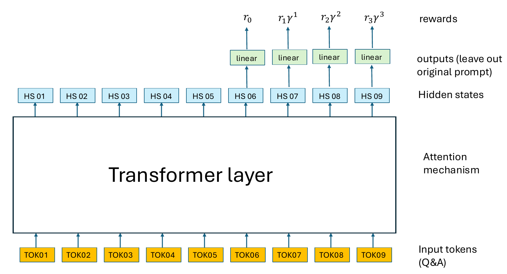
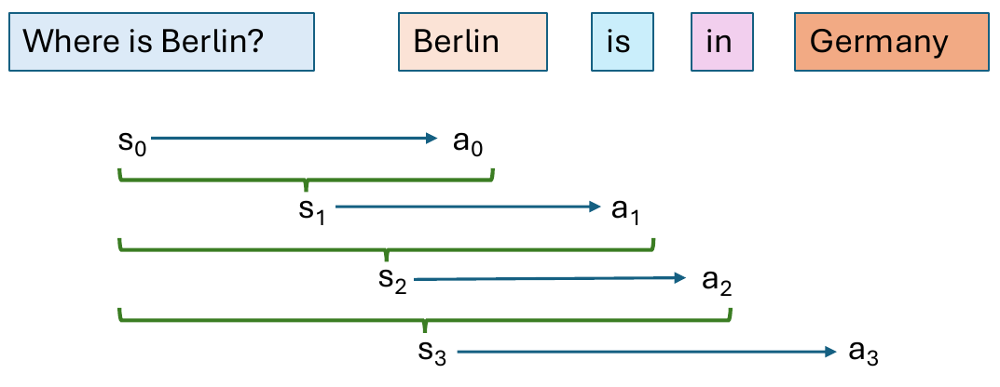
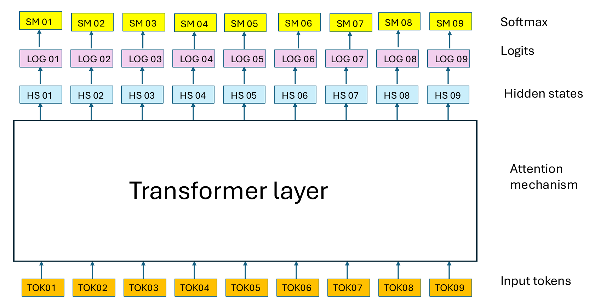
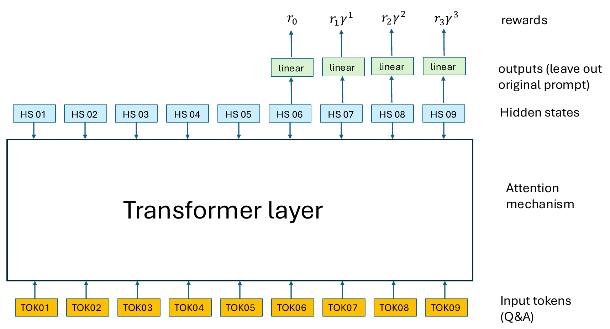
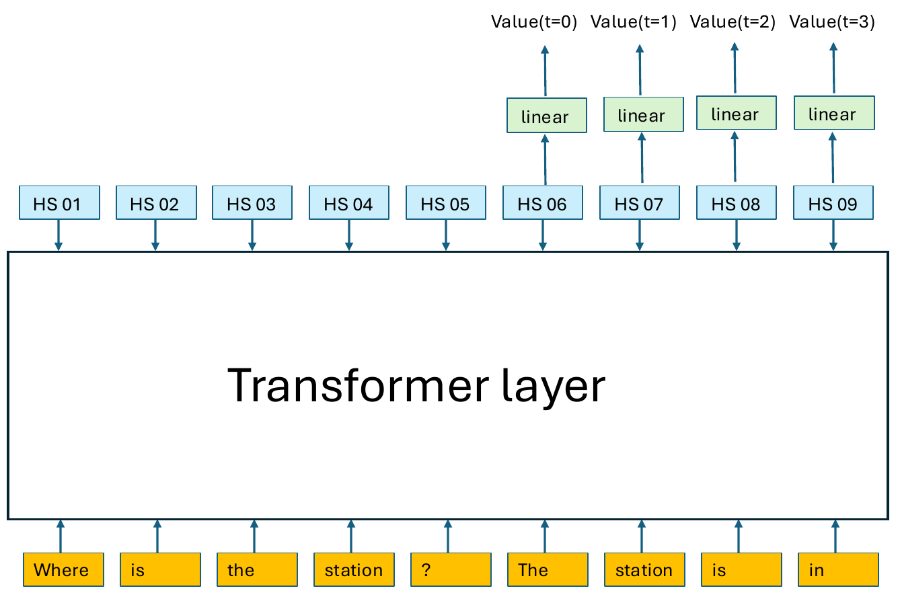

## Overview

::: {.callout-note}
## Game plan
Predicting the next token is great, but it does not a chatbot make.

- Various additional training stages are performed to extend and refine the capabilities of models
- The most important steps are  instruction fine tuning and reinforcement learning

:::

- [Pretraining vs posttraining](#pre-vs-post)
- [Instruction Fine Tuning (IFT)](#ift)
- [Reinforcment learning: Basic ideas and relationship to RLHF](#basic-rl)
- [Policy gradient optimization](#policy-gradient)
- [Reward to go](#reward-to-go)
- [Subtracting baselines](#baselines)

## AI-human Alignment

- An LLM is typically pretrained on massive amounts of data
- With this, the LLM can complete the prompt in a reasonable way
- What if we want to cause the model to have certain behaviors?
    - Do not use offensive language
    - Do not follow sexist or racist stereotypes
    - Answer questions at an easy or sophisticated level


:::{.mybox}
### AI-human Alignment

- The overall goal of AI alignment is to align a models output with some desired behavior
- This is the point of post-training (IFT and RLHF)
:::


## Pretraining vs. Posttraining {#pre-vs-post}

```{python}
#| echo: false
#| fig-align: center
import sys
import matplotlib.pyplot as plt
sys.path.append('utils') 
import matplotlib.pyplot as plt
from reinforce_plots import training_stages
fig = training_stages(include=["Stage 0", "Stage 1"])
plt.show()
```

- Pretraining teaches the model to predict the next token

## Pretraining vs. Posttraining

```{python}
#| echo: false
#| fig-align: center
import sys
import matplotlib.pyplot as plt
sys.path.append('utils') 
import matplotlib.pyplot as plt
from reinforce_plots import training_stages
fig = training_stages(include=["Stage 2"])
plt.show()
```

- Instruction fine tuning teaches the model to answer questions (to be a chatbot)

## Pretraining vs. Posttraining

```{python}
#| echo: false
#| fig-align: center
import sys
import matplotlib.pyplot as plt
sys.path.append('utils') 
import matplotlib.pyplot as plt
from reinforce_plots import training_stages
fig = training_stages(include=["Stage 3"])
plt.show()
```

- Preference fine tuning (Reinforcement learning) teaches the model to respond in ways that correspond to human preferences (to be a _useful_ chatbot)

## Pretraining vs. Posttraining

```{python}
#| echo: false
#| fig-align: center
import sys
import matplotlib.pyplot as plt
sys.path.append('utils') 
import matplotlib.pyplot as plt
from reinforce_plots import training_stages
fig = training_stages(include=["Stage 4"])
plt.show()
```

- Reasoning fine-tuning intends to improve multi-step logical deduction, problem-solving, mathematical capability, and coding performance of LLMs
- We will not cover RFT in this course

::: {.small-text}
More information

- Chen X et al. (2026) [Putting on the Thinking Hats: A Survey on Chain of Thought Fine-tuning from the Perspective of Human Reasoning Mechanism. arxiv 2510.13170](https://arxiv.org/abs/2510.13170)
:::


## IFT (Instruction Fine-Tuning) and SFT (Supervised Fine-Tuning){#ift}


- **SFT**: fine-tuning a pretrained model on labeled input-output pairs using standard supervised learning (cross-entropy loss on target tokens, conditioned on some input).
- **IFT**: A specific kind of SFT where the training data is specifically instruction/response pairs, for instance:
    - **prompt**: "Summarize this text: ..." → **completion**: An actual summary of the text
    - **prompt**: "Write a poem about X" → **completion**: A poem about X. 

The goal of IFT is therefore to get the model to behave like a chatbot, i.e., to follow natural language instructions and conduct a conversation, rather than just continuing the input text


## Intuition: Before IFT

::: {style="background-color:#FEF2F2; border-left: 5px solid #DC2626; padding: 12px 16px; border-radius: 6px; margin-bottom: 10px;"}
**Prompt:** What is the most delicious Spanish appetizer?

**Response:** What is the most delicious Spanish appetizer? What is the most delicious Mexican appetizer? What is the most delicious Portuguese appetizer? 
These are the kinds of questions that get asked all the time, so we decided to put together a definitive ranking...
:::

- The raw model isn't "answering" so much as continuing the statistical pattern (predicting the next token)
- The text might resemble some blog text about appetizers, but it is not answering the user's question directly

## Intuition: After IFT

::: {style="background-color:#F0FDF4; border-left: 5px solid #16A34A; padding: 12px 16px; border-radius: 6px; margin-bottom: 10px;"}
**Prompt:** What is the most delicious Spanish appetizer?

**Response:** A top pick is patatas bravas (fried potatoes with a spicy tomato sauce and aioli).
:::

- After instruction tuning, the model recognizes the input as a request directed at it
- The model produces a direct answer instead of continuing a hypothetical document

## Chat Templates

Each major LLM has a template structure that organizes the main components of the chat so the model can recognize them.


- Unambiguous structure
- Allow multiturn conversations
- Enables use of APIs 

::: {.mybox}

- chat templates are required to format data for training so the models recognize the components of the message (system, user, assistent, in some cases tools)

:::


## Example

```text
messages = [
    {"role": "system", "content": "You are a helpful assistant."},
    {"role": "user", "content": "Hello!"},
    {"role": "assistant", "content": "Hi! How can I help you today?"},
    {"role": "user", "content": "What's the weather?"},
]
```

:::{.small-text}
This example is taken from the Hugging Face LLM course
:::


- The format and keywords vary for some models
- This is the style for OpenAI style and Qwen
- `im` stands for *instruction message* (e.g., `im_start` refers to the start of the instruction message)

```text
<|im_start|>system
You are a helpful assistant.<|im_end|>
<|im_start|>user
Hello!<|im_end|>
<|im_start|>assistant
Hi! How can I help you today?<|im_end|>
<|im_start|>user
What's the weather?<|im_start|>assistant
```

## IFT Best Practices

- High quality completions needed 
- Generally, modern LLMs train with on the order of 1 million prompts


<table style="border-collapse: collapse; width: 100%;" border="1">
<thead>
<tr><td><b>Item</b></td><td><b>Pretraining</b></td><td><b>IFT</b></td></tr>
</thead>
<tbody>
<tr><td>Data</td><td>enormous</td><td>ca. 1 million prompt completions</td></tr>
<tr><td>Batch size</td><td>256</td><td>1024-2048</td></tr>
<tr><td>Learning rate</td><td>$1\times 10^{-5}$</td><td>$3\times 10^{-4}$</td></tr>
<tr><td>Loss function</td><td>CE</td><td>CE</td></tr>
</tbody>
</table>

## Question {.center background-color="#ffe1f5"}

{width=60%}

- The learning rate is typically $3\times 10^{-4}$ in pretraining but only $1\times 10^{-5}$ for IFT. _Why is this_?

## Answer

- A lower learning rate is used during instruction fine-tuning (IFT) than during pretraining
- IFT uses a much smaller amoutn of training data and therefore has a narrower data distribution.
- The lower learning rate is thought to help prevent overfitting on the IFT prompts

## Question {.center background-color="#ffe1f5"}

{width=60%}

- During pretraining, the model learns to predict the next token. The entire input texts are used
- Both pretraining and IFT use the same kind of cross-entropy (CE) loss
- During IFT, the model is training on prompt-completion pairs. What part of this data is used for training?


## Answer

- **Loss Masking**: In IFT,  cross-entropy (CE) loss is applied exclusively on the assistant tokens (i.e., the completions, not the prompts)
- **Prompt tokens**: The prompt tokens are masked (removed) from the loss calculation
- We want the model's objective to be focussed on  generating accurate, context-aware completions
- The foundational language model has already learned grammar, syntax, and general world knowledge during pretraining, and so the IFT phase can focus just on generation of completions

::: {.small-text}
More information:
- Huerta-Enochian M and Ko SY (2024) [Instruction Fine-Tuning: Does Prompt Loss Matter? arXiv 2401.13586](https://arxiv.org/abs/2401.13586)
:::


## IFT pipeline

<table class="no-border">
<thead>
<tr><td><b>Step</b></td><td><b>Key resource</b></td><td><b>Purpose</b></td></tr>
</thead>
<tbody>
<tr class="fragment"><td>Dataset formatting</td><td>chat templates</td><td>architecture learns to distinguish between user inputs and assistant outputs.</td></tr>
<tr class="fragment"><td>Tokenization and sequence packing</td><td>Raw text is tokenized into IDs and concatenated</td><td>maximize GPU memory utilization and minimize wasted padding compute</td></tr>
<tr class="fragment"><td>Loss masking </td><td>CE loss computed only on the assistant completion tokens; prompt tokens assigned a loss weight of zero</td><td>gradients focus exclusively on generation quality</td></tr>
<tr class="fragment"><td>Optimizer and learning rate configuration</td><td>AdamW optimizer with reduced peak learning rate</td><td>Do not erase pre-trained representations</td></tr>
<tr class="fragment"><td>Parameter strategy selection</td><td>Full-parameter updates or Parameter-Efficient Fine-Tuning (PEFT) methods like LoRA or QLoRA</td><td>Target attention projections to adapt weights efficiently</td></tr>
</tbody>
</table>


## RLHF, GPT, and ChatGPT {#basic-rl}

:::{.mybox}
- Reinforcement learning was a key idea to take early versions of GPT to the current versions of chat agents such as ChatGPT
- We will present a somewhat simplified version of **InstructGPT**
- This is a rapidly moving and important field with several major advances in recent years, such as those of DeepView
:::


## Reinforcement Learning (RL): Basics

- An **agent** iteratively takes **actions** within an **environment** according to a **policy**.
- The state at time (step) $t$ is denote $s_t$, and the action that is proposed at this step is denote $a_t$
- The policy $\pi_\theta$ can either be deterministic or stochastic

{width=90% fig-align="center"}

- When using reinforcement learning for LLMs, the policy is stochastic.
- The policy $\pi_\theta$ outputs a distribution over the set of possible actions, and the probability of a specific action is $\pi_\theta(a_t\mid s_t)$
- After an action is taken, the environment emits a **reward** representing the desirability of the resulting state. The reward $r_t$ may be negative, zero, or positive

::: {.tiny-credit}
image source: Reinforcement Learning: An Introduction, Richard Sutton and Andrew G. Barto
:::


## Actions and Transitions


- The policy outputs an action based on the current state. The probability of action $a_t$ given that we are currently in state $s_t$ is
$$
\pi_\theta(a_t\mid s_t)
$$ {#eq-policy-definition}

- After the policy outputs an action, the state of the environment will be updated according to the **transition function**^[Note: the transition function is generally deterministic for LLM-RLHF]

$$
P(s_{t+1} |  s_t, a_t) 
$$ {#eq-transition-fxn}


## Reinforcement learning: Example

:::: {.columns}
::: {.column width=50%}
- **Agent**: the mouse
- **State**: (x,y)-position of the mouse
- **Action**: move to another valid (x,y) position
- **Reward model**:
    - Move to an empty cell: reward of 0
    - Move to a cell with cheese: Reward of 2
    - Move to cell with cheese and electric shock: Reward of -1
    - Move to cell with cat: Reward of -5
- **Policy**: rules how the agent selects the action to perform given current state; $a_t\sim \pi(\cdot\mid s_t)$
- Goal of RL is to select a policy that maximizes the expected reward when an agent acts according to the policy
:::
::: {.column width=50%}


::: {.tiny-credit}
image source: https://www.freecodecamp.org/
:::
:::
::::

## RL: Trajectories {#sec-trajectory}


Intuitively, we can conceptualize RL as a trial and error process. As our agent acts in its environment, the training process reinforces—either positively or negatively—observed behavior via the reward. Hence, the name “reinforcement” learning.

- A trajectory is a sequence of states
- We begin from an initial state $s_0$
- The agent iteratively
    - Samples action $a_t$ based on the current state $s_t$
    - Transitions to the next state $s_{t+1}$
    - Receives reward $r_t$
- The trajectory continues until the final state $s_T$ is reached (terminal state or because a maximum number of states was reached)
- The trajectory $\tau$^[$\tau$=tau] is represented as follows:
$$
\tau = \left(\underbrace{s_0,a_0,r_0}_{t=0},  
\underbrace{s_1,a_1,r_1}_{t=1}, \ldots,
\underbrace{s_{T-1},a_{T-1},r_{T-1}}_{t=T-1},
\underbrace{s_T}_{t=T}\right)
$$


## RL: Recap

::: {.mybox}
**Reinforcement learning: in sum**:

- RL training repeatedly samples different trajectories
- The agent thereby explores the space of possible states and actions 
:::

- The goal of RL learning is to discover parameters $\theta$ that maximize reward of the most probable trajectories.

{width=50% fig-align="center"}


:::{.tiny-credit}
- Image source: [RLHF Book](https://rlhfbook.com/), lecture 2.
:::


## RL and LLMs

::: {.mybox}
- Reinforcement Learning from Human Feedback (RLHF) is increasingly treated as a crucial ingredient for high performance large language models.
:::

- **Agent**: The LLM
- **State**: the prompt (i.e., the input tokens)
- **Action**: which token is selected as the next token
- **Reward model**: We reward the LLM for generating *good responses* and do not reward *bad responses*
- **Policy**: The policy is the LLM itself, because the the next token function can easily be modelled as $a_t\sim \pi(\cdot\mid s_t)$


## RL and LLMs


- Prompt is the state (``My favorite food is''), and the action is the choice of the next token
- But how do we implement the reward model?

## RL/LLM - rewards

| Question (Prompt) | Answer 1 | Answer 2 |  Chosen |
|:-----------------:|:--------:|:--------:|:--------:|
| Where is Jena?    | Niedersachsen | Thüringen |  2|
| What is 2+3?      | 5 | 42 |  1|
| Explain quantum mechanics | It's about cats |  Quantum mechanics is the rulebook for super tiny things that act like magic.| 2 |
<hr>

- We ask humans to indicate which answer they prefer and rank the answers
- Answers that are chosen get a high reward, those that are not get a low reward


## RLHF: Big picture

:::: {.columns}
::: {.column width=60%}


::: {.tiny-credit}
Image source: Lambert, Illustrating Reinforcement Learning from Human Feedback (RLHF), [Hugging face blog](https://huggingface.co/blog/rlhf?utm_campaign=token-1-16-what-is-rlhf-reinforcement-learning-from-human-feedback&utm_medium=referral&utm_source=www.turingpost.com)
:::

:::
::: {.column width=40%}

- **Initial language model**: (from pretraining)
- **Tuned language model**: iteratively adjusted by RLHF
- **Reward model**: quantifies human preference between alternative completions
- **KL prediction shift penalty**: keeps RLHF model from drifting too far from original model
- **Update**: Method to update RLHF model
- **Today**: We will explain these components

::: {.small-text}
- **Note**: There are many new developments that we will not touch upon
:::

:::
::::

## Classical RL vs RLHF 

:::: {.columns}
::: {.column width=50%}
**Classical RL**

- Agent takes actions $a_t$ in an environment that has states $s_t$
- Reward is a **known** function $r(s_t, a_t)$ from the environment that is evaluated once per step
- We optimize a cumulative return over a trajectoy with $T$ total steps

$$
J(\pi) =
\mathbf{E}_{\tau\sim\pi}\left[ \sum_{t=0}^T \gamma^t r(s_t,a_t)\right]
$$
:::
::: {.column width=50%}
**RLHF**

- No environment - prompts are sampled from a dataset 
- Reward is **learned** from human preferences
- Response-level reward (for entire completion, not per-token)
- Regularized with KL penalty (to stay close to base model)
$$
J(\pi) =
\mathbf{E}\left[ r_\theta (x,y) - \beta D_{KL}(\pi\Vert \pi_{ref})\right]
$$

:::
::::

:::{.tiny-credit}
- See [RLHF Book](https://rlhfbook.com/), lecture 2.
:::

## Classical RL vs RLHF 

:::: {.columns}
::: {.column width=40%}
**Classical RL**

{width=90%}

:::
::: {.column width=60%}

**RLHF**

{width=90%}
:::
::::

:::{.tiny-credit}
- Image source: [RLHF Book](https://rlhfbook.com/), lecture 2.
:::


## Training with RLHF

{width=100% fig-align="center"}

* In InstructGPT, there are three main stages
* We reviewed IFT/SFT above
* We will now go over the second major step, **training the reward model**

:::{.tiny-credit}
Image source: Ouyang L, et al. (2022) [Training language models to follow instructions with human feedback. arXiv 2203.02155](https://arxiv.org/abs/2203.02155)
:::


## Training with RLHF: InstructGPT

- The authors start with the IFT model as described
- The final unembedding layer is removed
    * Using the Supervised Fine-Tuned (SFT) model as the starting point for the reward model ensures that both the policy and the reward model share identical tokenizer vocabularies and low-level feature representations.
    * The unembedding layer is used to project hidden states back to the output vocabulary
    * This layer is removed and replaced by a linear project layer that yields a  single scalar value 
    * Open AI used a smaller model (6.7 Billion parameters: the 6B model) for the reward model (trained separately from the largest policy model - the 175B Davinci model)
    * Intuitively, Using a 6B reward model provides the necessary linguistic comprehension to evaluate complex prompts while  cutting down GPU memory and compute overhead required during the PPO reinforcement learning phase.

:::{.tiny-credit}
Ouyang L, et al. (2022) [Training language models to follow instructions with human feedback. arXiv 2203.02155](https://arxiv.org/abs/2203.02155)
:::

## Architecture of the RL/LLM reward model  {#sec-reward-1}



- The LLM is pretrained on a large corpus
- Input to the LLM is the entire prompt plus the response
- To generate a reward for the response, we add a linear output layer to the last hidden state of the response

## Reward model loss

- For training, we need to define a loss 
- Imagine we have two answers to each question, that a human has classified as good ($y_w$) or bad ($y_l$)
- Then we define the loss as
$$
\mathrm{Loss} = - \log \sigma(r(x,y_w) - r(x,y_l))
$$
- $r(x,y_w)$ is calculated as in the previous slide by concatenating the prompt $x$ with the good answer $y_w$, i.e., with the answer a human rater prefered
- $r(x,y_l)$ is for the answer to the prompt that a human did not prefer
- If $r(x,y_w) > r(x,y_l)$, then the value is positive and $\sigma$ will return a value greater than 0.5. $\log(0.5)=-0.69$, and so the loss will always be less than 0.69
- If $r(x,y_w) < r(x,y_l)$, then the value is negative and $\sigma$ will return a value less than 0.5, and the loss is a larger positive number 
- This forces the model to give high rewards to good answers and low rewards to bad answers!^[See lecture 4 to review the sigma function]

## Modelling trajectories

- A **trajectory**, represented by tau ($\tau$), is a series of (state, action, reward) -- see [slide @sec-trajectory].


- The **probability** of a trajectory $\tau$ given a policy $\pi$ is thus modeled as the probability of the initial state multiplied by the product of the transition probability and the policy for each step:
$$
P(\tau) = \rho(s_0)\prod_{t=o}^{T-1}P(s_{t+1}\mid s_t,a_t)\pi(a_t\mid s_t)
$$ {#eq-trajectory-prob}

:::{.small-text}
- Where
    - $\rho(s_0)$ is the probability of starting at $s_0$
    - $P(s_{t+1}\mid s_t,a_t)$: The transition function (See @eq-transition-fxn)
    - $\pi(a_t\mid s_t)$ is the probability of choosing action $a_t$ given we are in state $s_t$
- Note the trajectory is a Markov process - the next state is dependent only on the previous state, not on the entire history^[See lecture 4 for background on Markov chains]
:::

## Rewards

- Rewards as **discounted** (immediate rewards are worth more than future rewards), using a factor $0<\gamma<1$
$$
R(\tau) = \sum_{t=0}^{\infty} \gamma^t r_t
$$
- The **expected return** of a policy is the expected reward over all possible Trajectories
$$
J(\pi) = \int_{\tau} P(\tau\mid\pi)\cdot R(\tau) = \mathbb{E}_{\tau\sim \pi}\left[R(\tau)\right]
$$ {#eq-expected-return}

## LLM Trajectories

- A trajectory in an LLM is a series of prompts (see slide @sec-trajectory)
- In this example, our original prompt is "Where is Berlin?" ($s_0$)
- The first action is the choice of the token "Berlin" ($a_0$)
- decoders are autoregressive, so our second prompt is "Where is Berlin? Berlin" ($s_1$)



## Policy gradient optimization {#policy-gradient}

- To train an GPT-style LLM, our initial policy $\pi_{\theta}$ is simply the decoder model
- Our goal with RL is to modify the parameters $\theta$ of the policy to maximize the expected return (@eq-expected-return).
- For a deep neural network, we  change the parameters of the network to mimimize a loss function using **stochastic gradient descent**. 
- Here, we want to maximize $J(\pi)$ so we use **stochastic gradient ascent**
$$
\theta_{k+1} = \theta_k + \eta\nabla_{\theta}J(\pi_{\theta})\mid_{\theta_k}
$$
- In the context of RL, the gradient is known as the **policy gradient** and the algorithms that optimize it are known as the **policy gradient algorithms**.
- **Problem**: To optimize $J(\pi) = \int_{\tau} P(\tau\mid\pi)\cdot R(\tau) = \mathbb{E}_{\tau\sim \pi}\left[R(\tau)\right]$, we would need to evaluate it over all possible trajectories, which is computationally intractable.

::: {.mybox}
We will present Policy gradient optimization, showing how to modify the gradient to simplify the expression and reduce variance (which tends to improve convergence of training)
:::

## Terminology

::: {.mybox}
It is important to keep the distinction between these three concepts clear!
:::

- **Reward** (denoted $r_t$): a scalar signal emitted by the environment at a single timestep, in response to one action taken from one state. 
- **Return** (denoted $R(\tau)$ or ):  the (typically discounted) sum of rewards over one specific trajectory
    - $R(\tau)=\sum_{t=0}^T \gamma^t r_t$: rewards over the entire trajectory
    -  $G_t = \sum_{t=t'}^T \gamma^t r_{t'}$: reward-to-go, the rewards from a certain step onwards
- **Expected return**: the expectation of return over the distribution of trajectories induced by a policy:
 $J(\pi)= \mathbb{E}_{\tau\sim\pi_\theta}\left[R(\tau)\right]$
    - The expected return is an average return over (in principle) infinitely many rollouts.
    - In reinforcement learning, we are trying to **maximize** the expected return
    - We will introduce $V^\pi$ and $Q^\pi$ below - these are expected returns conditioned on a certain current state ($V^\pi$) or current state-action pair ($Q^\pi$).


## Policy gradient optimization: Deriving the gradient

- To maximize the expected retrun

$$
\begin{align}
\nabla_{\theta}J(\pi) &=\nabla_{\theta}\mathbb{E}_{\tau\sim \pi}\left[R(\tau)\right] & \bullet \text{take gradient of expected return}\\
&=\nabla_{\theta}\int_{\tau}P(\tau\mid\theta) R(\tau) &\bullet \text{definition of expected return}\\
&=\int_{\tau}\nabla_{\theta} P(\tau\mid\theta) R(\tau) & \bullet \text{linearity of gradient operator}\\
&=\int_{\tau} P(\tau\mid\theta) \nabla_{\theta} \log P(\tau\mid\theta) R(\tau) & \bullet \text{log derivative trick}\\
\end{align}
$$
- To understand the log derivative trick, consider that $\tfrac{d}{dx}\log f(x) = \tfrac{1}{f(x)}\tfrac{d}{dx}f(x)$


## Policy gradient optimization: Deriving the gradient

- continuing, recalling @eq-trajectory-prob for the probability of a trajectory: $P(\tau) = \rho(s_0)\prod_{t=o}^{T-1}P(s_{t+1}\mid s_t,a_t)\pi_{\theta}(a_t\mid s_t)$

$$
\begin{align}
\nabla_{\theta}J(\pi_{\theta}) &=\int_{\tau} P(\tau\mid\theta) \nabla_{\theta} \log P(\tau\mid\theta) R(\tau)&\\
&=\mathbb{E}_{\tau\sim \pi}\left[ \underbrace{\nabla_{\theta} \log P(\tau\mid\theta)}_{\text{let's focus on this}} R(\tau)\right] &\bullet \text{equivalent representation as an expectation}\\
\end{align}
$$


## Policy gradient optimization: Deriving the gradient
- Here, we focus on simplifying the term $\nabla_{\theta} \log P(\tau\mid\theta)$

$$
\begin{align}
\nabla_{\theta}\log P(\tau) &= \nabla_{\theta} \log \left[ \rho(s_0)\prod_{t=0}^{T-1}P(s_{t+1}\mid s_t,a_t)\pi_{\theta}(a_t\mid s_t)\right]&\\
&= \underbrace{\nabla_{\theta} \log\rho(s_0)}_{=0} + \sum_{t=0}^{T-1}\left[\underbrace{\nabla_{\theta} \log P(s_{t+1}\mid s_t,a_t)}_{=0} + \nabla_{\theta} \log\pi_{\theta}(a_t\mid s_t)\right]&
\dagger\dagger\\
&= \sum_{t=0}^{T-1} \nabla_{\theta} \log\pi_{\theta}(a_t\mid s_t)\\
\end{align}
$$

- $\theta$ denotes the full set of trainable parameters of the LLM. 
- In the line marked with $\dagger\dagger$, only the third term depends on $\theta$
- Neither the distribution over the first state $\rho(s_0)$ nor the transition probability $P(s_{t+1}\mid s_t,a_t)$ depend on these weights
- Recall that for LLMs, the transition is a trivial deterministic function

## Policy gradient optimization: Deriving the gradient

- We can now put everything together

$$
\begin{align}
\nabla_{\theta}J(\pi_{\theta}) &=\int_{\tau} P(\tau\mid\theta) \nabla_{\theta} \log P(\tau\mid\theta) R(\tau) &\\
&=\mathbb{E}_{\tau\sim \pi_{\theta}}\left[  \nabla_{\theta} \log P(\tau\mid\theta)R(\tau)\right] & \bullet\text{by definition of the expectation} \\
&=\mathbb{E}_{\tau\sim \pi_{\theta}}\left[ \sum_{t=0}^{T-1}  \nabla_{\theta}\log\pi_{\theta}(a_t\mid s_t)\,R(\tau)\right]  & \bullet\text{substituting from previous slide} \\
\end{align}
$$
- So, we have an expression to calculate the gradient, **but**, we are still taking the expectation over all possible trajectories: $\tau\sim \pi_{\theta}$
- If we have a trajectory of 100 tokens and a vocabulary of 100,000 tokens, there are
$$
100^{100000}\quad\text{possible trajectories}
$$


## Policy gradient optimization: Deriving the gradient 

- It is clearly not tractable to calculate all $100^{100000}$ trajectories...

- Instead, we generate a sample $\mathcal{D}$ of trajectories and calculate the sample mean 
$$
\hat{g} = \frac{1}{|\mathcal{D}|} \sum_{\tau\in\mathcal{D}}\sum_{t=0}^{T-1} \nabla_{\theta} \log \pi_{\theta}(a_t\mid s_t)R(\tau)
$$ {#eq-reinforce}
- and then use this to update the parameters 
$$
\theta_{k+1} = \theta_k + \eta\hat{g} 
$$
- This is known as **stochastic gradient ascent**.
- The gradient typically would be calculated using automatic differentiation by pytorch (autograd)
- The so-called **reinforce** algorithm repeatedly performs rounds of stochastic gradient ascent, updates parameters, runs $|\mathcal{D}|$ trajectories, etc.


## Calculating gradients

- When we evaluate a trajectory, each hidden state encodes information only about previous states thanks to the causal mask applied during self-attention
- We apply a linear projection to the hidden states to obtain scores for each token in the vocabulary
- Then we apply softmax to generate probabilities, so that $\log \pi_{\theta}(a_t\mid s_t) = \log\mathrm{softmax}(y_t)$
- At each timestep $t$, we select the log-probability assigned to the token that was actually generated ($y_t$ has scores for every token in the vocabulary, so this lookup is easy)
- Because of the causal mask, a single forward pass yields $\log\pi_{\theta}(a_t\mid s_t)$ for every $t$ simultaneously
- This gives us the term needed inside the REINFORCE gradient estimator $\hat{g}$ from @eq-reinforce.

{fig-align="center"}

## Calculating rewards
- Apply the linear layer to all positions that correspond to actions (i.e., tokens following the original prompt)
- See slide @sec-reward-1.
- This allows us to generate the reward for each time step/trajectory
$$
\sum_{t=0}^{T} \nabla_{\theta} \log \pi_{\theta}(a_t\mid s_t)\underbrace{R(\tau)}_{\mathrm{reward}}
$$



## reward to go {#reward-to-go}

::: {.mybox}
**Reward to go**

A "trick" to reduce the variance of policy gradient. 
:::

- The problem is that the policy gradients as discussed above have a high variance (are noisy)
- For clarity, we will demonstrate the "trick" omitting the $\gamma$ factor that is used to down-weight noisy future estimates
- Goal:
$$J(\theta) = \mathbb{E}_{\tau \sim \pi_\theta}\left[R(\tau)\right], \qquad R(\tau) = \sum_{t=0}^{T} r_t$$

The **policy gradient theorem**:

$$\nabla_\theta J(\theta) = \mathbb{E}_{\tau \sim \pi_\theta}\left[\nabla_\theta \log \pi_\theta(\tau) \, R(\tau)\right]$$


## Factoring the Trajectory Probability (recap without $\gamma$)

Trajectory probability factors as:

$$p(\tau) = p(s_0)\prod_{t=0}^T \pi_\theta(a_t|s_t)\,p(s_{t+1}|s_t,a_t)$$

Only the policy terms depend on $\theta$, so:

$$
\nabla_\theta \log \pi_\theta(\tau) = \sum_{t=0}^T \nabla_\theta \log \pi_\theta(a_t|s_t)
$$ 

This gives the **REINFORCE** estimator:

$$
\nabla_\theta J(\theta) = \mathbb{E}_\tau\left[\left(\sum_{t=0}^T \nabla_\theta \log \pi_\theta(a_t|s_t)\right)\left(\sum_{t'=0}^T r_{t'}\right)\right]
$$ {#eq-REINFORCE}


## Rewarding past and future steps...

Every log-probability term $\nabla_\theta \log\pi_\theta(a_t|s_t)$ in @eq-REINFORCE gets multiplied by the **entire** trajectory return — including rewards $r_{t'}$ that occurred **before** $a_t$ was taken.

::: {.callout-note}
Action $a_t$ cannot have caused a reward that already happened.
:::

- These "past-reward" terms add variance to the gradient estimate without adding any real signal.
- The reward to go approach splits the inner sum at $t$:

$$
\nabla_\theta J(\theta) = \sum_{t=0}^T \mathbb{E}_\tau\left[\nabla_\theta \log\pi_\theta(a_t|s_t)\left(\underbrace{\sum_{t'<t} r_{t'}}_{\text{past}} + \underbrace{\sum_{t'\geq t} r_{t'}}_{\text{future}}\right)\right]
$$

- If we can show the past term vanishes in expectation, dropping it doesn't change the value of the gradient (i.e., it does not add bias) 
- Instead, the approach reduces variance. 


## Proof: Past Rewards Don't Depend on $a_t$

For $t' < t$, $r_{t'}$ is fixed once we condition on the trajectory prefix up to $s_t$ (i.e., $s_{0:t},a_{0:t-1}$). 
::: {.small-text}
**Tower rule**
- The overall average of something can be obtained by first averaging within groups, then averaging those group-averages together.
$$
\mathbf{E}\left[ X \right] = \mathbf{E}\left[ \mathbf{E}\left[X\mid Y\right] \right]
$$
- We'll use this with $Y$ = "the trajectory prefix up to $s_t$" and $X$ = the term we're taking expectation of — averaging over $a_t$ first, then over everything before it.
:::

-By the tower rule:

$$\mathbb{E}_\tau\left[\nabla_\theta\log\pi_\theta(a_t|s_t)\, r_{t'}\right]$$
$$= \mathbb{E}_{s_{0:t},a_{0:t-1}}\Big[ \underbrace{\mathbb{E}_{a_t\sim\pi_\theta(\cdot|s_t)}\big[\nabla_\theta\log\pi_\theta(a_t|s_t)\, r_{t'} \mid s_{0:t},a_{0:t-1}\big]}_{\text{average over } a_t \text{ only}}\Big]$$

Since $r_{t'}$ is already fixed given the prefix, it pulls out of the inner average:

$$= \mathbb{E}_{s_{0:t},a_{0:t-1}}\Big[ r_{t'} \cdot \mathbb{E}_{a_t\sim\pi_\theta(\cdot|s_t)}\big[\nabla_\theta\log\pi_\theta(a_t|s_t)\mid s_t\big]\Big]$$

The inner expectation is the **score-function identity**.


## The Score-Function Identity

The Proof slide showed that each past term reduces (via the tower rule) to $r_{t'} \cdot \mathbb{E}_{a_t\sim\pi_\theta(\cdot|s_t)}\big[\nabla_\theta\log\pi_\theta(a_t|s_t)\mid s_t\big]$. We now show that factor is exactly zero.

By definition of expectation for a discrete random variable:

$$
\begin{align}
\mathbb{E}_{a\sim\pi_\theta(\cdot|s)}\left[\nabla_\theta \log\pi_\theta(a|s)\right] &= \sum_a \pi_\theta(a|s)\, \nabla_\theta \log\pi_\theta(a|s) &\bullet \text{by definition} \\
& = \sum_a \pi_\theta(a|s)\,\frac{\nabla_\theta \pi_\theta(a|s)}{\pi_\theta(a|s)}&\bullet \tfrac{d}{dx}\log f(x) = \frac{1}{f(x)} \tfrac{d}{dx}f(x)\\
&= \sum_a  \nabla_\theta \pi_\theta(a|s) &\bullet \text{canceling} \\
 &=\nabla_\theta \sum_a  \pi_\theta(a|s)    &\bullet \text{linearity of gradient operator} \\
  &=\nabla_\theta 1 &\bullet \text{definition of probability} \\
  &= 0
\end{align}
$$

- Thus, every past-reward term contributes **exactly zero** to the expectation.

## Result: The Reward-to-Go Estimator

$$
\nabla_\theta J(\theta) = \mathbb{E}_{\tau\sim\pi_\theta}\left[\sum_{t=0}^T \left( \nabla_\theta\log\pi_\theta(a_t|s_t)\right) \cdot \underbrace{\sum_{t'=t}^{T} r_{t'}}_{G_t \;=\; \text{reward-to-go}}\right]
$$ {#eq-reward-to-go}

$G_t$ is the return accumulated **from time $t$ onward**, not the full trajectory return.
- Rewards to go means that at each step, we only focus on rewards that are not in the past!
- This makes sense, because a reward cannot alter the rewards we received in the past!


## Subtracting Baselines {#baselines}

- Subtracting a baseline from the rewards to go still results in an unbiased estimator and may further reduce variance
- replacing $G_t$ with $A_t = G_t - b(s_t)$ leaves the gradient's expectation completely unchanged because $b(s_t)$ depends on the state $s_t$ but not on the action $a_t$.
- The derivation is similar to the above

$$A_t = G_t - b(s_t)$$

::: {.mybox}
**$G_t$**:
Intuitively, $G_t$ has some baseline level that represents the goodness of the state as well as a component that is specific to the component taken.
:::

## Subtracting Baselines 

::: {.mybox}
**How do we capture the idea of a baseline: good  vs. bad state?**

As a baseline, we will choose the **value function** $V^{\pi}(s_t)$
- If we start from state $s_t$, what is the future expected reward of trajectories starting from state $s_t$ and following policy $\pi_{\theta}$?
:::

- For instance, if our prompt is **What is the capital of Niedersachsen?** and our current state is 

**What is the capital of Niedersachsen? The capital is**

- then overall the LLM state has high $V^{\pi}(s_t)$ (i.e., value or expected reward). 

In contrast, if for some reason our current state is

**What is the capital of Niedersachsen? Cats are selfish because**

- then it is very unlikely we will generate the correct answer *Hannover*. This state has a low $V^{\pi}(s_t)$ (expected reward)


## How do we calculate the value function $V^{\pi}(s_t)$?

- Add an additional linear layer on top of the LLM (which is our policy $\pi_\theta$) that estimates the value of a state at each time step
- Note we are not referring to the logit layer, but to a linear layer that estimates reward


{width="70%" fig-align="center"}

## Q and V

- The rewards to go function is $G_t= \sum_{t'=t}^{T} r_{t'} = \sum_{t'=t}^{T}r(s_{t'}, a_{t'})$. This is for one specific trajectory
- In RL, this is known as the $Q$ function, which is the expected return if the agent starts at state $s$, takes action $a$, and then acts according to policy for all steps of the trajectory after the current step $t'$.
- But $Q^{\pi}(s,a)$ is defined as the expectation of that sum over all trajectories starting from $(s,a)$:


$$
Q^{\pi}(s,a) = \mathbb{E}_{\tau\sim\pi}\left[ \sum_{t'}^T r(s_{t'},a_{t'}) \big\mid s_t=s,a_t=a \right]
$$


## State-Value and Action-Value Functions

**State-value** $V^\pi(s)$: expected return starting in state $s$, following $\pi$ thereafter.

$$V^\pi(s) = \mathbb{E}_{\tau\sim\pi}\left[\sum_{t'=t}^{T}\gamma^{t'-t} r_{t'} \,\Big|\, s_t=s\right]$$

**Action-value** $Q^\pi(s,a)$: expected return starting in state $s$, taking action $a$, *then* following $\pi$.

$$Q^\pi(s,a) = \mathbb{E}_{\tau\sim\pi}\left[\sum_{t'=t}^{T}\gamma^{t'-t} r_{t'} \,\Big|\, s_t=s,\, a_t=a\right]$$

::: {.callout-note}
$Q$ conditions on the action too; $V$ averages it out over the policy's own action distribution.
:::


## Relating $V$ to $Q$

$V$ is $Q$ with the action integrated out, weighted by the policy — this is the tower rule again, conditioning on $a_t$ instead of the trajectory prefix:

$$V^\pi(s) = \mathbb{E}_{a\sim\pi(\cdot|s)}\left[Q^\pi(s,a)\right] = \sum_a \pi(a|s)\,Q^\pi(s,a)$$

**Where $G_t$ fits in:** $G_t$ is a single Monte Carlo *sample* of the return from one rollout; $Q^\pi(s_t,a_t)$ is its **expectation** over all rollouts from $(s_t,a_t)$:

$$Q^\pi(s_t,a_t) = \mathbb{E}_{\tau\sim\pi}[G_t \mid s_t,a_t]$$

$G_t$ is a noisy, unbiased estimator of $Q^\pi(s_t,a_t)$ — replacing $G_t$ with a learned $\hat Q_\phi(s,a)$ trades a little bias for much lower variance.

---

## $Q$ Recursively: Peeling Off One Step

$G_t$ is a sum over an entire trajectory. Split off just the first term:

$$Q^\pi(s,a) = \mathbb{E}_{\tau\sim\pi}\left[r(s_t,a_t) + \gamma\sum_{t'=t+1}^{T}\gamma^{t'-t-1} r(s_{t'},a_{t'}) \,\Big|\, s_t=s,\, a_t=a\right]$$

- The first term, $r(s_t,a_t) = r(s,a)$, is fixed given $(s,a)$
- The remaining sum is *exactly* $G_{t+1}$ — a reward-to-go starting one step later, from whatever state $s_{t+1}$ the trajectory happens to reach

---

## $Q$ Recursively: Applying the Tower Rule

Condition the remaining sum on the next state $s_{t+1}=s'\sim p(\cdot|s,a)$ (environment dynamics), then the next action $a_{t+1}=a'\sim\pi(\cdot|s')$:

$$Q^\pi(s,a) = r(s,a) + \gamma\,\mathbb{E}_{s'\sim p(\cdot|s,a)}\Big[\,\mathbb{E}_{a'\sim\pi(\cdot|s')}\big[\underbrace{\mathbb{E}_\tau[\cdots \mid s_{t+1}=s',a_{t+1}=a']}_{=\,Q^\pi(s',a')\text{ by definition, shifted one step}}\big]\Big]$$

::: {.callout-note}
Same trick as the Proof slide: average in stages — first over what happens after $(s',a')$, then over $a'$, then over $s'$.
:::

---

## The Bellman Equation for $Q^\pi$

Collapsing the nested expectations gives the recursive (Bellman) form:

$$Q^\pi(s,a) = r(s,a) + \gamma\,\mathbb{E}_{s'\sim p(\cdot|s,a)}\left[\mathbb{E}_{a'\sim\pi(\cdot|s')}\big[Q^\pi(s',a')\big]\right]$$

- Equivalent to the sum-of-rewards definition — just expressed **one step at a time** instead of over the whole trajectory
- This is what makes $Q$ useful for **bootstrapped / incremental** estimation (actor-critic methods): update $\hat Q_\phi(s,a)$ using only $r(s,a)$ and $\hat Q_\phi(s',a')$, without waiting for a full rollout

::: {.callout-note}
Note: $r(s,a)$ sits *outside* the $s'$-expectation here since it depends only on $(s,a)$. If your reward convention is $r(s,a,s')$ instead, it moves inside.
:::

---

## The Advantage Function

Put $Q^\pi(s_t,a_t)$ in place of $G_t$, and $V^\pi(s_t)$ in place of the baseline $b(s_t)$:

$$A^\pi(s_t,a_t) \;=\; Q^\pi(s_t,a_t) - V^\pi(s_t)$$

"How much better or worse than the policy's own average behavior is this specific action?"

- $A^\pi(s,a) > 0$: better than average at $s$ — increase its probability
- $A^\pi(s,a) < 0$: worse than average — decrease its probability
- $A^\pi(s,a) = 0$: exactly average — no gradient signal

::: {.callout-note}
A state that's great regardless of the action taken (all actions have high $Q$) contributes **no** gradient signal for any particular action — correctly, since the policy doesn't need to change anything there.
:::

---

## Tying Back: $A_t$ Estimates $A^\pi$

From the deck: $A_t = G_t - b(s_t)$, with $b(s_t) = V^\pi(s_t)$.

Since $\mathbb{E}[G_t\mid s_t,a_t] = Q^\pi(s_t,a_t)$:

$$A_t = G_t - V^\pi(s_t) \quad\text{is a (noisy) unbiased estimator of}\quad A^\pi(s_t,a_t) = Q^\pi(s_t,a_t) - V^\pi(s_t)$$

Same object — sample vs. expectation. This is exactly what appears in A2C / PPO's objective.

---

## Baselines Come From the Same Argument

The same zero-mean identity justifies subtracting a **baseline** $b(s_t)$ (commonly $V^\pi(s_t)$):

$$A_t = G_t - b(s_t)$$

$$\mathbb{E}\left[\nabla_\theta\log\pi_\theta(a_t|s_t)\,b(s_t)\right] = 0$$

This is the standard justification for **A2C / PPO**-style advantage estimators.

---

## Subtracting Baselines

::: {.mybox}
**How do we capture the idea of a baseline: good vs. bad state?**
As a baseline, we will choose the **value function** $V^{\pi}(s_t)$

- If we start from state $s_t$, what is the future expected reward of trajectories starting from state $s_t$ and following policy $\pi_{\theta}$?
:::

- For instance, if our prompt is **What is the capital of Niedersachsen?** and our current state is

**What is the capital of Niedersachsen? The capital is**

- then overall the LLM state has high $V^{\pi}(s_t)$ (i.e., value or expected reward).

In contrast, if for some reason our current state is

**What is the capital of Niedersachsen? Cats are selfish because**

- then it is very unlikely we will generate the correct answer *Hannover*. This state has a low $V^{\pi}(s_t)$ (expected reward)

## Relating $V$ to $Q$

$V$ is $Q$ with the action integrated out, weighted by the policy — this is the tower rule again, conditioning on $a_t$ instead of the trajectory prefix:

$$V^\pi(s) = \mathbb{E}_{a\sim\pi(\cdot|s)}\left[Q^\pi(s,a)\right] = \sum_a \pi(a|s)\,Q^\pi(s,a)$$

**Where $G_t$ fits in:** $G_t$ is a single Monte Carlo *sample* of the return from one rollout; $Q^\pi(s_t,a_t)$ is its **expectation** over all rollouts from $(s_t,a_t)$:

$$Q^\pi(s_t,a_t) = \mathbb{E}_{\tau\sim\pi}[G_t \mid s_t,a_t]$$

$G_t$ is a noisy, unbiased estimator of $Q^\pi(s_t,a_t)$ — replacing $G_t$ with a learned $\hat Q_\phi(s,a)$ trades a little bias for much lower variance.

---

## The Advantage Function

Put $Q^\pi(s_t,a_t)$ in place of $G_t$, and $V^\pi(s_t)$ in place of the baseline $b(s_t)$:

$$A^\pi(s_t,a_t) \;=\; Q^\pi(s_t,a_t) - V^\pi(s_t)$$

"How much better or worse than the policy's own average behavior is this specific action?"

- $A^\pi(s,a) > 0$: better than average at $s$ — increase its probability
- $A^\pi(s,a) < 0$: worse than average — decrease its probability
- $A^\pi(s,a) = 0$: exactly average — no gradient signal

::: {.callout-note}
A state that's great regardless of the action taken (all actions have high $Q$) contributes **no** gradient signal for any particular action — correctly, since the policy doesn't need to change anything there.
:::

---

## Tying Back: $A_t$ Estimates $A^\pi$

From the deck: $A_t = G_t - b(s_t)$, with $b(s_t) = V^\pi(s_t)$.

Since $\mathbb{E}[G_t\mid s_t,a_t] = Q^\pi(s_t,a_t)$:

$$A_t = G_t - V^\pi(s_t) \quad\text{is a (noisy) unbiased estimator of}\quad A^\pi(s_t,a_t) = Q^\pi(s_t,a_t) - V^\pi(s_t)$$

Same object — sample vs. expectation. This is exactly what appears in A2C / PPO's objective.

---

## Baselines Come From the Same Argument

The same zero-mean identity justifies subtracting a **baseline** $b(s_t)$ (commonly $V^\pi(s_t)$):

$$A_t = G_t - b(s_t)$$

$$\mathbb{E}\left[\nabla_\theta\log\pi_\theta(a_t|s_t)\,b(s_t)\right] = 0$$

This is the standard justification for **A2C / PPO**-style advantage estimators.

---


## In PyTorch

```python
# G_t (or A_t) is treated as a fixed scalar coefficient —
# NOT something we backprop through
returns = compute_reward_to_go(rewards, gamma)   # tensor
returns = returns.detach()

log_probs = policy_dist.log_prob(actions)        # differentiable
loss = -(log_probs * returns).mean()

loss.backward()   # autograd differentiates only log pi_theta
optimizer.step()
```

Autograd differentiates only $\log\pi_\theta(a_t|s_t)$ through the policy network — $G_t$ is `.detach()`-ed.


## Sources

- [Ahmadian A et al., Back to Basics: Revisiting REINFORCE Style Optimization for Learning from Human Feedback in LLMs(2024) arXiv 2402.14740](https://arxiv.org/abs/2402.14740)
- [Wolfe CR, Reinforcement Learning for LLMs: The Complete Guide, blog](https://cameronrwolfe.substack.com/p/llm-rl)