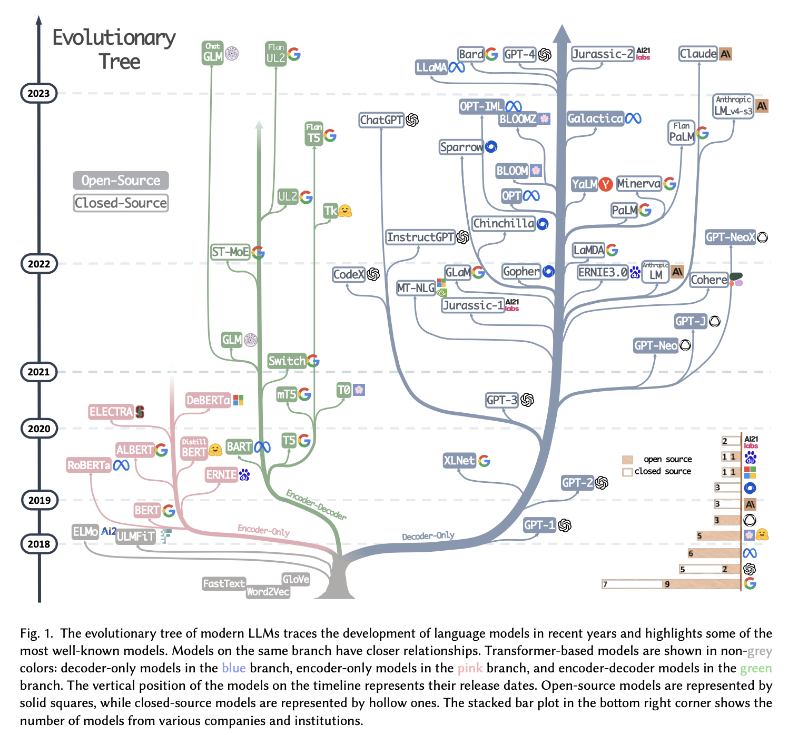
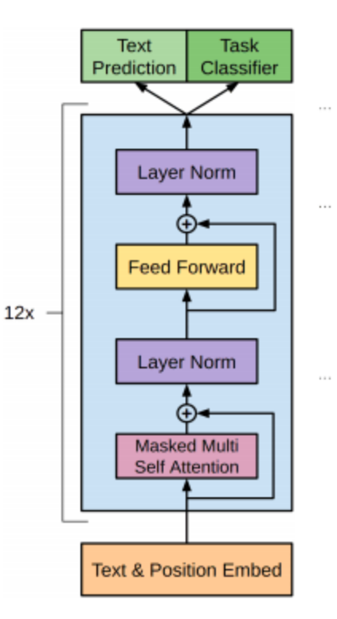
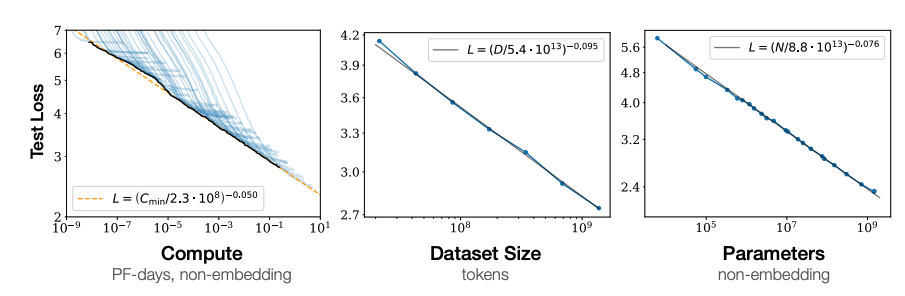
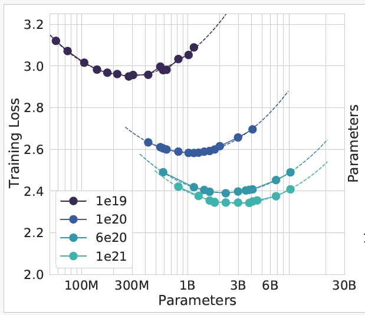
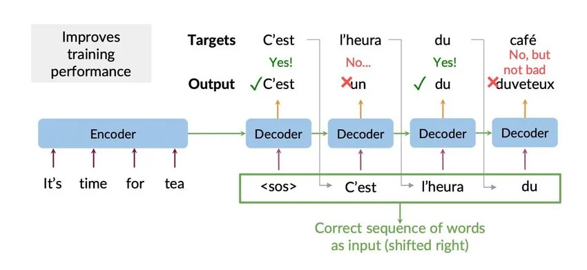

## Overview

::: {.callout-note}
## Game plan
This lecture provides an introduction to the transformer architecture with a focus on the decoder. 
:::

Important:
- https://arxiv.org/pdf/2305.17026

- [Transformer models (recap)](#recap)
- [Decoder models](#decoders)
- [Multihead attention](#multihead)
- [Output generation](#outputgen)
- [Training LLMs](#training)

## Transformer models {#recap}


{width="40%" fig-align="center"}

::: {.tiny-credit}
Amatriain X et al. (2024) [Transformer models: an introduction and catalog. arXiv 2302.07730](https://arxiv.org/abs/2302.07730)
:::

## Transformer models

::: {.mybox}
**An embarassment of riches**

- As can be seen in the previous slide, a large number of different transformer models have been developed
- They can be grouped largerly in encoder-decoder, encoder-only, and decoder-only
:::

- The original paper, "Attention is all you need...", described an encoder-decoder transformer 
- This architecture is well suited for sequence-to-sequence tasks such as machine translation 
- Last week, we focused on an introduction to the encoder model
- This week, we will provide additional detail and focus mainly on decoder-only models and on training

## Decoder models {#decoders}

::: {.mybox}
A **decoder-only transformer** is an autoregressive neural network architecture that uses masked causal 
self-attention to predict the next token in a sequence.
:::


:::: {.columms}
::: { .column width=70%}

* **Input processing**:
  - GPT-like models are decoder-only models
  - Inputs (i.e., tokenized prompt) are embedded and encoded
  - Positional encodings are added to the input embeddings
  - Attention calculation, similar to previously described
  - Large matrix multiplications, heavy usage of GPU hardward accelerator
  - Parallel process
:::

::: { .column width=30%}
{width=80%}


:::
::::

::: {.tiny-credit}
image: Perez L et al. (2021)[Automatic Code Generation using Pre-Trained Language Models. arXiv 2102.10535](https://arxiv.org/abs/2102.10535)
:::


## Recap

* Recall encoder algorithm from the previous lecture:


<table class="reveal-table small-table">
  <thead>
    <tr><th>Tensor</th><th>Dimension</th><th>Example</th><th>Explanation</th></tr>
  </thead>
  <tbody>
    <tr class="fragment"><td>Input sequence <br/>[BOS] The quick brown fox jumps over the lazy dog [EOS]</td><td></td><td></td><td>Input tokens with additional beginning/end of sequence tokens</td></tr>
    <tr class="fragment"><td>Tokenized Input sequence <br/>[50256, 791, 4062, 14198, 39935, 35308, 927, 279, 16053, 5679, 50256]</td><td>$N$</td><td>$11$</td><td>Number of tokens, including [BOS]/[EOS]</td></tr>
    <tr class="fragment"><td>$\mathbf{X}$: Input embeddings</td><td>$N\times d_{hidden}$</td><td>$11\times 512$</td><td>$d_{hidden}$ is the embedding dimension</td></tr>
    <tr class="fragment">
    <td>$\mathbf{W}^Q$: query weights<br/>
    $\mathbf{W}^K$: key weights<br/>
    $\mathbf{W}^V$: value weights</td><td>$d_{hidden}\times d_{hidden}$</td><td>$512\times 512$</td><td>Learnable model weights (single-head attention, so $d_k=d_{hidden}$)</td></tr>
    <tr class="fragment"><td>$\mathbf{Q}=\mathbf{XW}^Q$: query matrix<br/>
    $\mathbf{K}=\mathbf{XW}^K$: key matrix<br/>
    $\mathbf{V}=\mathbf{XW}^V$: value matrix</td><td>$N\times d_{hidden}$</td><td>$11\times 512$</td><td>
    $\mathbf{Q}$: What each token needs to know from others<br/>
    $\mathbf{K}$: What information each token provides<br/>
    $\mathbf{V}$: Content each token shares when attended to</td></tr>
    <tr class="fragment"><td>$\mathbf{QK}^T$: attention scores</td><td>$N\times N$</td><td>$11\times 11$</td><td>How well each token's query matches the keys of the other tokens</td></tr>
    <tr class="fragment"><td>$\mathrm{softmax}\left(\dfrac{\mathbf{QK}^T}{\sqrt{d_k}}\right)\mathbf{V}$</td><td>$N\times d_{hidden}$</td><td>$11\times 512$</td><td>Attention weights applied to Values — context-aware token representations</td></tr>
    <tr class="fragment"><td>$\times\ \mathbf{W}^O$: output projection <em>(optional here)</em></td><td>$N\times d_{hidden}$</td><td>$11\times 512$</td><td>Required to combine multiple heads back to $d_{hidden}$; with a single head the shape already matches, so $W^O$ is optional (often kept anyway for extra learnable capacity)</td></tr>
    <tr class="fragment"><td>Add &amp; Norm</td><td>$N\times d_{hidden}$</td><td>$11\times 512$</td><td>Residual connection + LayerNorm (see Part 1)</td></tr>
    <tr class="fragment"><td>FFN: $\text{GELU}(\mathbf{X}W_1+b_1)W_2+b_2$</td><td>$N\times d_{hidden}$</td><td>$11\times 512$</td><td>Position-wise, applied independently per token; expands to $d_{ff}$ (e.g. $2048$) and projects back (see Part 1)</td></tr>
</tbody>
</table>

::: {.small-text}
This recap shows single-head attention, so $d_k=d_{hidden}$
:::


::: {.tiny-credit}
Adapted from: Simon J Decoder-only inference: A step-by-step dive ([video](https://www.youtube.com/watch?v=cl3MAhAr9-M))
:::


## Multihead attention {#multihead}

:::: {.columns}
::: {.column width=50%}
{width=40%}

:::{.small-text}
* Scaled dot-product attention
:::
:::
::: {.column width=50%}
{width=60%}

:::{.small-text}
* Multihead attention -- several attention layers running in parallel
:::
:::
::::

::: {.tiny-credit}
[Vaswani A et al. (2017) Attention Is All You Need. arXiv 1706.03762](https://arxiv.org/abs/1706.03762)
:::

## Multihead attention

- Instead of performing a single attention function with $d_{hidden}$-dimensional keys, queries, and values 
- It is beneficial to linearly project the queries, keys, and values $h$ times with different linear Projections
- The results are concatenated and once again projected resulting in the final values

$$
\mathrm{MultiHead}(Q,K,V) = \mathrm{Concat}(\mathrm{head}_1, \ldots,\mathrm{head}_h)\mathrm{W}^{O}
$$
where
$$
\mathrm{head}_i = \mathrm{Attention}(QW_i^Q, KW_i^K, VW_i^V)
$$

* In the original paper, the authors use $h=8$ (8 heads)
* Then, $d_k=d_v=d_{hidden}/h = 64$ because $d_{hidden} =512$ (In the paper $d_{hidden}$ is called $d_{model}$)
* dimension check: $W_i^Q$ and $W_i^K$ are $d_{hidden}\times d_k$, $W_i^V$ is $d_{hidden}\times d_v$, and $\mathrm{W}^{O}$ is $hd_v \times d_{hidden}$

## Multihead attention


:::: {.columns}
::: {.column width=35%}
{width=60%}


:::
::: {.column width=60%}

- All heads get the full input sequence, but only see a subset of the embedding dimensions
- Each head has its own Q,K,V matrices
- All heads compute attention scores in parallel 
- Main benefit: Multihead attention allows the model to jointly attend to information from different representation subspaces at different positions. With a single attention head, averaging inhibits this.
- i.e., MHA yields better models!

:::
::::

::: {.tiny-credit}
[Vaswani A et al. (2017) Attention Is All You Need. arXiv 1706.03762](https://arxiv.org/abs/1706.03762)
:::

## MHA step by step

<table class="reveal-table small-table">
  <thead>
    <tr><th>Tensor</th><th>Dimension</th><th>Example</th><th>Explanation</th></tr>
  </thead>
  <tbody>
    <tr class="fragment greyrow"><td class="greycell">Input sequence <br/>[BOS] The quick brown fox jumps over the lazy dog [EOS]</td><td></td><td></td><td>Input tokens with additional beginning/end of sequence tokens</td></tr>
    <tr class="fragment greyrow"><td class="greycell">Tokenized Input sequence <br/>[50256, 791, 4062, 14198, 39935, 35308, 927, 279, 16053, 5679, 50256]</td><td>$N$</td><td>$11$</td><td>Number of tokens, including [BOS]/[EOS]</td></tr>
    <tr class="fragment greyrow"><td class="greycell">$\mathbf{X}$: Input embeddings</td><td>$N\times d_{hidden}$</td><td>$11\times 512$</td><td>$d_{hidden}$ is the embedding dimension</td></tr>
    <tr class="fragment">
    <td>$\mathbf{W}^{Q_i}$: query weights<br/>
    $\mathbf{W}^{K_i}$: key weights<br/>
    $\mathbf{W}^{V_i}$: value weights</td><td>$d_{hidden}\times d_{mha}$</td><td>$512\times 64$</td><td>$d_{mha}=d_{hidden}/h$, where $h$ is the number of heads<br/>
    each head has its own weight matrices</td></tr>
    <tr class="fragment"><td>$\mathbf{Q}_i=\mathbf{XW}^{Q_i}$: query matrix<br/>
    $\mathbf{K}_i=\mathbf{XW}^{K_i}$: key matrix<br/>
    $\mathbf{V}_i=\mathbf{XW}^{V_i}$: value matrix</td><td>$N\times d_{mha}$</td><td>$11\times 64$</td><td>
    all heads run in parallel</td></tr>
    <tr class="fragment"><td>$\mathbf{Q}_i\mathbf{K}_i^T$: attention scores</td><td>$N\times N$</td><td>$11\times 11$</td><td>How well each token's query matches the keys of the other tokens</td></tr>
    <tr class="fragment"><td>$\mathrm{softmax}\left(\dfrac{\mathbf{Q}_i\mathbf{K}^T}{\sqrt{d_k}}\right)\mathbf{V}_i$</td><td>$N\times d_{mha}$</td><td>$11\times 64$</td><td>Attention weights applied to Values — context-aware token representations</td></tr>
    <tr class="fragment"><td>Concatenate head outputs</td><td>$N\times d_{hidden}$</td><td>$11\times 512$</td><td>Attention weights applied to Values — context-aware token representations</td></tr>
    <tr class="fragment greyrow"><td class="greycell">$\times\ \mathbf{W}^O$: output projection <em>(optional here)</em></td><td>$N\times d_{hidden}$</td><td>$11\times 512$</td><td>Required to combine multiple heads back to $d_{hidden}$; with a single head the shape already matches, so $W^O$ is optional (often kept anyway for extra learnable capacity)</td></tr>
    <tr class="fragment greyrow"><td class="greycell">Add &amp; Norm</td><td>$N\times d_{hidden}$</td><td>$11\times 512$</td><td>Residual connection + LayerNorm (see Part 1)</td></tr>
    <tr class="fragment greyrow"><td class="greycell">FFN: $\text{GELU}(\mathbf{X}W_1+b_1)W_2+b_2$</td><td>$N\times d_{hidden}$</td><td>$11\times 512$</td><td>Position-wise, applied independently per token; expands to $d_{ff}$ (e.g. $2048$) and projects back (see Part 1)</td></tr>
</tbody>
</table>

- Gray background: Identical to single-head attention case


::: {.tiny-credit}
Adapted from: Simon J Decoder-only inference: A step-by-step dive ([video](https://www.youtube.com/watch?v=cl3MAhAr9-M))
:::

## Output generation {#outputgen}

- Unlike input generation, output generation is a sequential process
  - The answer is generated one token at a time
  - Each generated token is appended to the previous input
  - Process repeated until we get an $\langle \mathrm{EOS}\rangle$ token^[EOS=end of sequence] or the maximum length is reached


## Autoregressive text generation

```{python}
#| echo: false
#| fig-width: 5
#| fig-height: 5
#| out-width: "100%"
#| fig-align: center
import sys
sys.path.append('utils') 
from llm_plots import decoder_loop
decoder_loop()
```
:::{.small-text}
- Output is generated one token at a time
:::


## Text generation: step by step


<table class="reveal-table small-table">
  <thead>
    <tr><th>Tensor</th><th>Dimension</th><th>Example</th><th>Explanation</th></tr>
  </thead>
  <tbody>
    <tr class="fragment"><td>Attention output for the input sequence <br/>(aka prefill)</td><td>$N\times d_{hidden}$</td><td>$11\times 512$</td><td>This matrix represets the input embeddings that have been **updated** to consider the context of other tokens</td></tr>
    <tr class="fragment"><td>Attention output for the **last** token</td><td>$1\times d_{hidden}$ </td><td>$11\times 512$</td><td> </td></tr>
    <tr class="fragment"><td>$\mathbf{W}_{out}$: linear layer<br/>(aka project layer)</td><td>$V\times d_{hidden}$ </td><td>$100,000\times 512$ </td><td>$V$ is the vocabulary size, i.e., number of tokens </td></tr>
    <tr class="fragment"><td>$\text{Logits} = \text{attention output}\times \mathbf{W}_{out}^T$</td><td>$1\times V$</td><td>$1\times 100,000$ </td><td>Raw scores for all tokens </td></tr>
     <tr class="fragment"><td>$\text{softmax}(\text{Logits})$</td><td>$1\times V$</td><td>$1\times 100,000$ </td><td> token probabilities</td></tr>
     <tr class="fragment"><td>Decode the token</td><td>1 token</td><td>1</td><td>outside the model; see next page</td></tr>
</tbody>
</table>


## Token decoding: Deterministic Methods

::: {.mybox}

**Deterministic methods**:

- generate text by selecting the continuation with the highest probability determined by the LM.
:::

- Deterministic methods may lead to model degeneration
  - output becomes "unnatural"
  - output is marked repetitive and overly predictable language. 
  - text lacks variety and fails to reflect natural human expression.

## Token decoding: greedy search

*  Greedy search selects the word with the highest probability as its next word at each timestep

$$
\arg \max_w P(w\mid w_1:w_{t-1})
$$

* Greedy search continues in this way until reaching either an end-of-sequence (EOS) token or
a maximum timestep $T$.
* Greedy search may overlook high-probability words that are accessible only after a lower-probability word. 
* As a result, greedy decoding does not formally guarantee a global optimum of the decoding objective, as its choices are only locally optimal. 

::: {.small-text}
- Other deterministic methods include beam search and contrastive search
:::

::: {.tiny-credit}
Wang, Haoran et al. (2026) [Beyond Tokens: A Survey on Decoding Methods for Large Language and Vision-Language Models. SIGKDD Explor. Newsl. 28:1931-0145](https://doi.org/10.1145/3820356.3820357)
:::

## Token decoding: Stochastic methods

::: {.mybox}
**Stochastic methods**:

Human-generated text exhibits greater variance in token probabilities, reflecting a diverse range of word choices, often unexpected. 

In contrast, the output from deterministic methods shows minimal variance, resulting in more predictable and potentially repetitive text. 
:::

- Stochastic approaches introduce randomness during the decoding process, leading to more diverse and natural text generation.

## Token decoding: Top-$k$ sampling

- The $k$ most probable next words are selected^[$k$ is typically to chosen to be a number such as 10, i.e., much less than the full token count]
- The probability of the $k$ top words is redistributed to form a new distribution, i.e., the probabilities of these k tokens are
then normalized to sum to 1, resulting in a truncated distribution. 
- A token is then randomly sampled from this distribution and appended to the current sequence. 
- This process is repeated iteratively until a termination condition is satisfied. 


::: {.tiny-credit}
Fan A (2018) [Hierarchical Neural Story Generation. arXiv 1805.04833]https://arxiv.org/abs/1805.04833)
:::

## Token decoding: Top-$p$ (Nucleus) Sampling

- Selects the smallest set of words whose cumulative probability meets or exceeds a predefined threshold $p$.
- Rather than sampling exclusively from the top $k$ most probable words, Top-$p$ redistributes the probability mass across
this dynamic set. 
- This adaptive approach allows the size of the word set (i.e., the number of included words) to increase
or decrease based on the shape of the next-token probability distribution.
- Rest of approach is identical

::: {.tiny-credit}
Holtzman A (2020) [The Curious Case of Neural Text Degeneration. arXiv 1904.09751]https://arxiv.org/abs/1904.09751)
:::

## Token decoding: Temperature Sampling

- The core idea of temperature sampling is to control the “sharpness” of the probability distribution by introducing a temperature parameter $t$. 
- This parameter is applied in the softmax function after the transformer’s final layer to compute token probabilities. 
- The temperature t directly influences the level of randomness in the sampling process, with higher values increasing randomness and lower values reducing it.

## Token decoding: Temperature Sampling

- The core idea of temperature sampling is to control the "sharpness" of the probability distribution by introducing a temperature parameter $t$.
- This parameter is applied in the softmax function after the transformer's final layer to compute token probabilities.
- The temperature $t$ directly influences the level of randomness in the sampling process, with higher values increasing randomness and lower values reducing it.^[Hinton G, Vinyals O, Dean J (2015) Distilling the Knowledge in a Neural Network. arXiv:1503.02531]

$$
P(x_i) = \frac{\exp(z_i / t)}{\sum_j \exp(z_j / t)}
$$

- $t=1$: standard softmax (no change)
- $t<1$: sharper distribution — closer to greedy/argmax as $t\to 0$
- $t>1$: flatter distribution — closer to uniform as $t\to\infty$

## Temperature: worked example

- Let the following be the logits for the next token after "The cat sat on the":

| token | logit $z_i$ |
|---|---|
| mat | 2.0 |
| floor | 1.0 |
| bed | 0.1 |
| couch | -1.0 |

::: {.small-table}
```{python}
#| echo: false
import numpy as np
import pandas as pd

tokens = ["mat", "floor", "bed", "couch"]
logits = np.array([2.0, 1.0, 0.1, -1.0])

def softmax_temp(z, t):
    scaled = z / t
    exp_z = np.exp(scaled - scaled.max())  # for numerical stability
    return exp_z / exp_z.sum()

temps = [0.5, 1.0, 2.0]
rows = []
for t in temps:
    probs = softmax_temp(logits, t)
    rows.append([f"t={t}"] + [f"{p:.3f}" for p in probs])

df = pd.DataFrame(rows, columns=["Temperature"] + tokens)
df
```
:::

- At $t=0.5$: "mat" dominates (≈0.86) — the model behaves almost deterministically
- At $t=1.0$: the raw model distribution (≈0.64 for "mat")
- At $t=2.0$: much flatter (≈0.45 for "mat") — "couch" and "floor" become far more likely than under the original distribution

## Combining temperature with top-$k$ / top-$p$

- Temperature and truncation (top-$k$, top-$p$) are typically applied together, in sequence:
    1. Scale logits by $1/t$
    2. Apply softmax to get the temperature-adjusted distribution
    3. Truncate: keep only the top-$k$ tokens, or the smallest set whose cumulative probability exceeds $p$ (nucleus sampling)^[Holtzman A, et al. (2020) The Curious Case of Neural Text Degeneration. ICLR 2020]
    4. Renormalize the remaining probabilities to sum to 1
    5. Sample from the renormalized distribution
- Example: applying top-$k=2$ after $t=0.5$ scaling keeps only {mat: 0.862, floor: 0.117}, renormalized to {mat: 0.880, floor: 0.120} — "bed" and "couch" are excluded entirely
- Intuition: 
  - temperature reshapes *how peaked* the whole distribution is
  - top-$k$/top-$p$ decide *how much of the tail* is eligible for sampling at all.
- Many chat APIs expose both `temperature` and `top_p` as independent parameters.


## x
- Decoder-only vs. encoder-decoder: two architectural families — the original Transformer's encoder-decoder (translation-style, with cross-attention) vs. the decoder-only GPT family. Worth being explicit that most modern LLMs are decoder-only, so that's where you'll spend most of the lecture.^[Vaswani et al. (2017); Radford et al. (2018) Improving Language Understanding by Generative Pre-Training. OpenAI]
- Why a decoder needs masking: motivate the core mechanical difference before showing the math — a decoder must not "see the future" when predicting the next token, or training becomes trivial/cheats.


## Training LLMs {#training}

- The next sections will cover several aspects of how to train LLMs
- For the most part, LLMs are synonymous with decoder-only transformers; from now on we will say LLM for conciseness.


## Training LLMs: Causal (Masked) Self-Attention

::: {.mybox}
**The problem**

- Encoder self-attention lets every token attend to every other token — including tokens that come *later* in the sequence.
- A decoder predicts tokens one at a time, left to right. If some token $i$ can attend to a token $j$ during training with $j>i$, the model can simply "read the answer" instead of learning to predict it.
:::

- This would make the training loss trivially low — the model learns nothing about actually predicting the future, since the future is already visible.
- We need a mechanism that lets us train on the full sequence in parallel (for efficiency), while still preventing this kind of "leakage."


## Masked Self-Attention

- Recall: $\text{Attention}(Q,K,V) = \text{softmax}\left(\dfrac{QK^\top}{\sqrt{d_k}}\right)V$
- We modify this by adding a **mask matrix** $M$ to the scores, *before* the softmax step:

$$
\text{MaskedAttention}(Q,K,V) = \text{softmax}\left(\frac{QK^\top}{\sqrt{d_k}} + M\right)V
$$

- $M$ is an $n\times n$ matrix, defined entrywise as:

$$
M_{i,j} = \begin{cases} 0 & j \le i \quad \text{(allowed: current or past token)} \\ -\infty & j > i \quad \text{(disallowed: future token)} \end{cases}
$$

- Adding $-\infty$ to a score, then applying softmax, transforms the entry tp exactly $0$.

::: {.tiny-credit}
- In practice, implementations use a large negative finite number (e.g. $-10^9$) instead of literal $-\infty$, for numerical stability — the same spirit as the $\epsilon$ we added inside LayerNorm in Part 1.^[Phuong M, Hutter M (2022) Formal Algorithms for Transformers. arXiv:2207.09238]
:::

## Worked Example: The Mask Matrix

- For our 4-token sentence "I am an automaton" ($n=4$), the mask matrix is:

$$
M = \begin{bmatrix}
0 & -\infty & -\infty & -\infty \\
0 & 0 & -\infty & -\infty \\
0 & 0 & 0 & -\infty \\
0 & 0 & 0 & 0
\end{bmatrix}
$$

- Row $i$ corresponds to the query token; column $j$ to the key token.
- Row 0 ("I"): only column 0 is unmasked — the first token can only attend to itself.
- Row 3 ("automaton"): all four columns are unmasked — the last token can attend to the entire sequence, since nothing comes after it.
- Causal masking is often just called "triangular masking."


## Worked Example: From Raw Scores to Masked Attention Weights

Suppose the raw attention scores $S =\frac{QK^\top}{\sqrt{d_k}}$ for our sentence.
- The masking procedure is as follows

::: {.small-text}
$$
\mathbf{S} + \mathbf{M} = \begin{bmatrix}
0.9 & 0.2 & -0.1 & 0.4 \\
0.3 & 1.1 & 0.5 & -0.2 \\
0.1 & 0.4 & 1.3 & 0.6 \\
-0.2 & 0.3 & 0.7 & 1.5
\end{bmatrix} + \begin{bmatrix}
0 & -\infty & -\infty & -\infty \\
0 & 0 & -\infty & -\infty \\
0 & 0 & 0 & -\infty \\
0 & 0 & 0 & 0
\end{bmatrix}
=
 \begin{bmatrix}
0.9 & -\infty & -\infty & -\infty \\
0.3 & 1.1 & -\infty & -\infty \\
0.1 & 0.4 & 1.3 &-\infty \\
-0.2 & 0.3 & 0.7 & 1.5
\end{bmatrix} 
$$

- Applying softmax row-by-row yields

$$
\mathrm{softmax}(\mathbf{S} + \mathbf{M}) =
 \begin{bmatrix}
1.0 & 0 & 0 & 0 \\
0.31 & 0,690 & 0 & 0 \\
0.176 & 0.238 & 0.586 &0 \\
0.094 & 0.156 & 0.232 & 0.517
\end{bmatrix} 
$$
:::

- Row "I": weight $[1.000, 0, 0, 0]$ — with only itself unmasked, softmax trivially assigns it all the probability mass.
- Row "am": weight $\approx[0.310, 0.690, 0, 0]$ — splits attention only between "I" and "am".
- Row "automaton": weight $\approx[0.095, 0.156, 0.233, 0.517]$ — the only row using the **full** softmax, since nothing is masked.
- Notice the upper triangle is exactly $0$ in every row 

## Pretraining

::: {.mybox}
**Traditional ML**:

- train a separate model for each task from scratch
:::

- Some ML tasks are similar. For instance
  - Spam detection
  - sentiment Analysis
  - machine translation
- All three tasks require the model to understand natural language
- The `transfer learning` approach reused a trained model for a new task by "tuning" the previously trained model
- LLMs take this approach to an extreme: Pretraining

## Pretraining

- Pre-training is the foundation for the power of Large Language Models (LLMs)
- Train by predicting the next work (token) on large collections of text data
- Most LLMs are trained on general data ("all" web pages, "all" books, etc.)
- Conversation text may help LLMs get better at chatting (train on social media data, e.g., Reddit)
- Books: May help LLMs "understand" complicated topics better than webpages/social media
- Stack exchange/GitHub: Help LLMs "understand" code

## Pretraining

- Size of training data

| LLM    | Param count  | Size    |
| ------ | -----        | ------- |
| GPT-3 (2020) | 175 billion | $\sim$ 350 GB |
| LLaMA-2 (2023) | 7B, 13B, 70B|$\sim$ 14 GB--140 GB |
| Llama 3 |  15 trillion tokens | $\sim$ 60 TB | 
| GPT-4 | (Estimated)~1.8 trillion | Proprietary |

## Pretraining: Size matters

{width=80%}

- Language modeling performance improves smoothly as we increase the model size, datasetset
size, and amount of compute2 used for training.
- Coversely, the authors found very weak dependence on many architectural and optimization hyperparameters. 

:::{.tiny-credit}
Kaplan J et al. (2020) [Scaling Laws for Neural Language Models. arXiv 2001.08361](https://arxiv.org/abs/2001.08361)
:::

## Optimal model size

- On the other hand, what if we have a fixed compute budget and cannot increase the number of parameters or the amount of data without limit?
- The authors investigatef the optimal model size and number of tokens for training a transformer language model under a given compute budget. 
- They found that current large language models are significantly undertrained, a consequence of the recent focus on scaling language models whilst keeping the amount of training data constant.

{width=80%}

::: {.tiny-credit}
Hoffmann J et al. (2022) [Training Compute-Optimal Large Language Models. arXiv 2203.15556](https://arxiv.org/abs/2203.15556)
:::

## Pretraining: Learning parameters

- The basic back-propagation from previous lectures is used to train LLM parameters as well
- An Adam optimizer is most frequently used to implement gradient descent


## Section 4: The Training Objective

::: {.mybox}
**Causal language modeling**

- A decoder is trained to predict each token given only the tokens that came before it.
- This is an **autoregressive** factorization of the joint probability of a sequence:

$$
P(x_1,\ldots,x_n) = \prod_{t=1}^n P(x_t \mid x_1,\ldots,x_{t-1})
$$
:::

- The model doesn't predict the whole sentence at once — it predicts one conditional distribution per position, and the chain rule of probability guarantees these conditionals multiply out to the joint probability of the full sequence.
- This factorization is exactly *why* causal masking (Section 2) is needed: each factor $P(x_t \mid x_1,\ldots,x_{t-1})$ must only depend on the past, or the factorization isn't valid.


## The Loss Function

- Training uses **cross-entropy loss** between the predicted next-token distribution and the true next token.
- For a single position $t$, with true token $x_t$ and predicted probability $\hat{P}(x_t \mid x_{<t})$:

$$
\mathcal{L}_t = -\log \hat{P}(x_t \mid x_1,\ldots,x_{t-1})
$$

- The total loss for a sequence is the sum (or mean) over all positions:

$$
\mathcal{L} = -\sum_{t=1}^n \log \hat{P}(x_t \mid x_1,\ldots,x_{t-1})
$$

## Teacher forcing

- **Teacher forcing**: during training, the *true* previous tokens are fed as input at every position — not the model's own (possibly wrong) predictions.
-  This is what makes it possible to compute the loss for all $n$ positions in a single parallel forward pass, using the causal mask from Section 2 to prevent each position from seeing its own answer.
- At inference time there is no ground truth to feed back in — this is exactly the "Append and reprocess" loop from our decoding-steps diagram, where each new token is the model's own prediction, fed back as input for the next step.

{width=100%}

:::{.tiny-credit}
Image: https://www.deeplearning.ai/
:::

## Worked Example: Cross-Entropy Loss

Continuing "I am an automaton" — suppose after "I am an" the model's predicted distribution over the next token is:

| token    | P(token)   |
| ------ | -----        |
|automaton| 0.55|
|apple | 0.05|
|idea| 0.15|
|the| 0.25|


- The true next token is "automaton," with predicted probability $0.55$.
- The loss at this position is $-\log(0.55) \approx 0.598$.
- If the model had instead assigned "automaton" a probability of, say, $0.01$, the loss would jump to $-\log(0.01)\approx 4.6$ — cross-entropy penalizes confident wrong predictions much more heavily than uncertain ones.


## Section 5: Decoding — Generating Text at Inference Time
- The problem: a trained model gives a distribution over next tokens — how do you actually pick one?
- Greedy decoding: always take argmax — simple, deterministic, often degenerate/repetitive.
- Beam search: track top-k partial sequences — better than greedy, still prone to blandness/repetition for open-ended generation.
- Sampling strategies: temperature scaling, top-k, and nucleus (top-p) sampling — motivate with the "degeneration" problem.^[Holtzman et al. (2020) The Curious Case of Neural Text Degeneration. ICLR 2020]
-Live/visual comparison (optional): show the same prompt under greedy vs. nucleus sampling, if you want a demo-style slide — good candidate for a {python} code cell like your existing plotting slides.

## Section 6: Scale — Why Bigger Models, More Data
- Scaling laws: loss as a smooth function of parameters/data/compute.^[Kaplan et al. (2020) Scaling Laws for Neural Language Models. arXiv:2001.08361 — verify citation details before use]
- Compute-optimal training ("Chinchilla"): revised guidance on the parameter/data trade-off — good "science evolves" moment, paired directly against the Kaplan slide.^[Hoffmann et al. (2022) Training Compute-Optimal Large Language Models. arXiv:2203.15556]
- Takeaway slide: what this means practically (data quality/quantity matters as much as parameter count).

## Conclusion
Recap: decoder = causal self-attention + (optional cross-attention) + autoregressive training objective + inference-time decoding choices.
