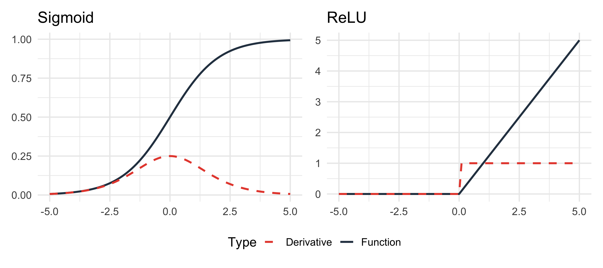
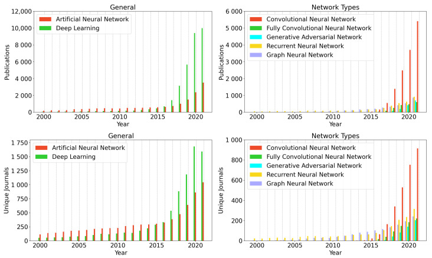
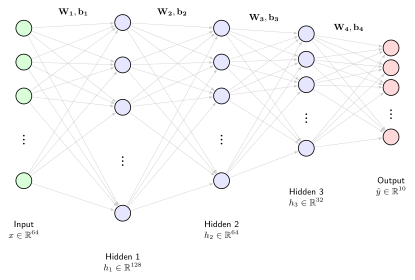
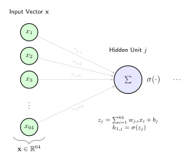

## Overview: Neural networks

::: {.callout-note title="Game plan"}
This lecture covers a review of artificial neural networks and backpropagation as a prerequisite for understanding transformers and LLMs.
:::

:::: {.columns}

::: {.column width="48%"}
### [Part 1: Review](#part-1)
* What is an ANN?
* Forward vs. Reverse pass
* Biomed applications
:::

::: {.column width="4%"}
:::

::: {.column width="48%" .dimmed}
### [Part 2: Architecture and Backprop](#part-2)
* Chain rule & Jacobians
* Vectorized derivatives
:::

::::

:::: {.columns}

::: {.column width="48%" .dimmed}
### [Part 3: Gradients](#part-3)
* Loss functions (MSE)
* Momentum & Adam
* Learning rates
:::

::: {.column width="4%"}
:::

::: {.column width="48%" .dimmed}
### [Part 4: Python](#part-4)
* Full implementation of ANN
* Classify handwritten digits
:::

::::


## ANNs: Overview {#part-1}

::: {.columns}
::: {.column width="50%"}

```{python}
#| echo: false
#| fig-align: center
import sys
import matplotlib.pyplot as plt
sys.path.append('utils') 
from ann_plots import plot_neural_net

plot_neural_net()
plt.show()
```

:::

::: {.column width="50%"}

- An artificial neural network (ANN) is a function comprised of neurons, weights, and activation functions
- Neurons are grouped into three main categories of layers:
    - Input layer
    - Hidden layers
    - Output layers
- Naming convention for an N-layer ANN
    - N-1 layers of hidden units
    - 1 output layer
    - In our example, we have a 3-layer ANN

:::
:::

## Neuron


:::: {.columns}
::: {.column width="50%"}

```{python}
#| echo: false
#| fig-align: center
import sys
import matplotlib.pyplot as plt
sys.path.append('utils') 
import matplotlib.pyplot as plt
from ann_plots import plot_neuron

fig = plot_neuron(figsize=(6, 6))
plt.show()
```

::: {#fig-ann layout-align="center"}
{width=40% fig-align="center"}
:::
::: {.tiny-credit}
image credit: <https://en.wikipedia.org/wiki/Biological_neuron_model>
:::

:::
::: {.column width="50%"}

::: {.callout-important  icon=false, title="Neuron"}

    Each neuron receives the weight sum of activations from the previous layer (or the input values) and applies a non-linear activation function

:::

- Fully connected layer^[In a Feed-Forward Network (FFN), a __Fully Connected layer__—also known as a __Dense layer__ or __Linear layer__—is a layer where every input neuron is connected to every output neuron.]: $$z = \sum_{i=1}^{4} (w_i x_i) + b$$
- A common activation function is the Sigmoid function 

$$f(z) = \frac{1}{1 + e^{-z}}$$


:::
::::

## Activation functions


* Activation functions decide whether a neuron should be "fired" (activated) by calculating the weighted sum and adding bias.

:::: {.columns}

::: {.column width="50%"}
### **Sigmoid**


$$ 
\sigma(x) = \frac{1}{1 + e^{-x}} 
$$ {#eq-sigmoid}

:::

::: {.column width="50%"}
### **ReLU** (Rectified Linear Unit)


$$ 
f(x) = \max(0, x) 
$$ {#eq-relu}

:::

::::

{fig-align="center" width="90%"}


## Representation power


::: {.columns}
::: {.column width="50%"}
```{python}
#| echo: false
#| fig-align: center
import sys
import matplotlib.pyplot as plt
sys.path.append('utils') 
from ann_plots import plot_maximum_chaos

plot_maximum_chaos()
plt.show()
```

:::

::: {.column width="50%"}

::: {.callout-note icon=false, title="Approximation"}

    A neural network with at least one hidden layer is a universal approximator in that it can represent any function

:::

* The capacity of the ANN increases with more hidden units and more hidden layers^[Cybenko G (1989) Approximation by superpositions of a sigmoidal function. Mathematics of Control, Signals, and Systems (MCSS)]

:::
:::

## Forward pass

```{python}
#| echo: false
#| fig-align: center
import sys
import matplotlib.pyplot as plt

sys.path.append('utils') 
from ann_plots import draw_nn_forward_pass

draw_nn_forward_pass()
plt.plot()
```

## Backward pass

```{python}
#| echo: false
#| fig-align: center
import sys
import matplotlib.pyplot as plt

sys.path.append('utils') 
from ann_plots import draw_nn_backpropagation

draw_nn_backpropagation()
plt.plot()
```


## Applications in bio-medicine

::: {#fig-ann layout-align="center"}
{width=75% fig-align="center"}

Weiss R, et al (2022) Applications of Neural Networks in Biomedical Data Analysis. Biomedicines. 10(7):1469.
:::

- There is hardly any topic in biomedicine that has not been modeled with ANNs of one type of another
- Deep understanding of the basics of (simple) feed-forward networks is a prerequisite for understanding more sophisticated models in use today


## Overview: Neural networks

::: {.callout-note title="Game plan"}
This lecture covers a review of artificial neural networks and backpropagation as a prerequisite for understanding transformers and LLMs.
:::

:::: {.columns}

::: {.column width="48%" .dimmed}
### [Part 1: Review](#part-1)
* What is an ANN?
* Forward vs. Reverse pass
* Biomed applications
:::

::: {.column width="4%"}
:::

::: {.column width="48%" }
### [Part 2: Architecture and Backprop](#part-2)
* Chain rule & Jacobians
* Vectorized derivatives
:::

::::

:::: {.columns}

::: {.column width="48%" .dimmed}
### [Part 3: Gradients](#part-3)
* Loss functions (MSE)
* Momentum & Adam
* Learning rates
:::

::: {.column width="4%"}
:::

::: {.column width="48%" .dimmed}
### [Part 4: Python](#part-4)
* Full implementation of ANN
* Classify handwritten digits
:::

::::


## Review: ANN Architecture and Matrix Representation {#part-2}


::: {.callout-note icon=false, title="Example ANN"}

- We will review the architecture of simple ANNs using the classic digit recognition dataset available in `skikit-learn`.
- [HOMEWORK]{.hw-badge} We will code a simple ANN to work with this.
- Input: 8x8 grey-scale images of handwritten digits
- Classification goal: Determine which of the digits $0,\ldots, 9$ is represented by the image ($10\times 1$ output vector)

:::

```{python}
#| echo: false
#| fig-width: 4
#| fig-height: 4
#| out-width: "50%"
#| fig-align: center
from matplotlib import pyplot as plt
from sklearn.datasets import load_digits

digits = load_digits()

fig = plt.figure(figsize=(4, 4))  # figure size in inches
fig.subplots_adjust(left=0, right=1, bottom=0, top=1, hspace=0.05, wspace=0.05)

for i in range(64):
    ax = fig.add_subplot(8, 8, i + 1, xticks=[], yticks=[])
    ax.imshow(digits.images[i], cmap=plt.cm.binary, interpolation='nearest')
    # label the image with the target value
    ax.text(0, 7, str(digits.target[i]))
```


## ANN Architecture

- Input: 8x8 grey-scale images of handwritten digits
- Goal: Determine which digit the image represents ($0,\ldots, 9$)
- Input layer: $X^{64\times 1}$
- Output layer: $Y^{10\times 1}$
- Hidden layer(s): three hidden layers (128, 64, 32 neurons)

::: {#fig-ann layout-align="center"}
{width=100% fig-align="center"}

ANN Architecture: $64 \to 128 \to 64 \to 32 \to 10$
:::
---

## Representing the network using matrices

::: {.columns}
::: {.column width="50%"}

::: {#fig-ann layout-align="center"}
{width=100% fig-align="center"}

The activation for the first neuron of the first hidden layer is determined by the weighted sum of each of the values in the input; this weighted sum is passed to the sigmoid activation function
:::

:::
::: {.column width="50%"}

$$
\begin{bmatrix}
w_{1,1} & w_{1,2} & \cdots & w_{1,64} \\
 w_{2,1} & w_{2,2} & \cdots & w_{2,64} \\
 & & & \\
 \vdots & \vdots & \ddots & \vdots \\
  & & & \\
 w_{128,1} & w_{128,2} & \cdots &   w_{128,64} \\
\end{bmatrix}^{128\times 64}
\begin{bmatrix}
x_1\\
x_2\\
\vdots \\
x_{64}
\end{bmatrix}^{64\times 1}
+
\begin{bmatrix}
b_1\\
b_2\\
\; \\
\vdots \\
\; \\
b_{128}
\end{bmatrix}^{128\times 1}
=
\begin{bmatrix}
z_1\\
z_2\\
\; \\
\vdots \\
\; \\
z_{128}
\end{bmatrix}^{128\times 1}
$$
followed by activation
$$
\begin{bmatrix}
\sigma(z_1)\\
\sigma(z_2)\\
\; \\
\vdots \\
\; \\
\sigma(z_{128})
\end{bmatrix}^{128\times 1}
=
\begin{bmatrix}
a_1\\
a_2\\
\; \\
\vdots \\
\; \\
a_{128}
\end{bmatrix}^{128\times 1}
$$

::: {style="font-size: 0.65em;"}
- The $w_{j,i}$ values are called the __weights__. They are __learnable__ parameters
- The $z_j$ values are called the __weighted sums__ or the __pre-activations__.
- The $a_j$ values are called the __activations__ and these are passed on as the input to the next layer
:::

:::

:::

## The Forward Pass: Step-by-Step

A single "layer" of computation follows a predictable three-step cycle:

::: {.columns}

::: {.column width="45%"}
### 1. Weighted Sum ($z$)
The input vector $\mathbf{x}$ (or activations from the previous layer $\mathbf{a}_{i-1}$) is multiplied by the weight matrix $W$ and the bias $b$ is added.
$$\mathbf{z} = W \mathbf{x} + \mathbf{b}$$

### 2. Activation ($a$)
A non-linear function $\sigma$ (like Sigmoid or ReLU) is applied element-wise to the pre-activations.
$$\mathbf{a} = \sigma(\mathbf{z})$$
:::

::: {.column width="55%"}
::: {.callout-tip icon=false title="Summary/Nomenclature"}

1. **Input Layer**: Receives raw features $x$ (e.g., pixel values).
2. **Hidden Layer(s)**: 
    - Compute weighted sums of inputs.
    - Apply activation functions to introduce non-linearity.
3. **Output Layer**: Produces the final prediction $\hat{y}$.
4. **Loss**: The predicted value $\hat{y}$ is compared against the actual target $y$ to determine the error.
:::

> **Note**: This process is repeated for every layer in the network until the data reaches the final output node.
:::

:::

## Neurons as functions

Each neuron in the hidden layers can be thought of as a function that takes the results of all neurons in the previous layer as input and returns a number between 0 and 1.

The entire network can be thought of as a function that takes 64 numbers as input and returns 10 numbers as output.


## Backpropagation

::: {.callout-note icon=false, title="Backpropagation"}

Backprop is __the__ core algorithm behind deep learning.

A key idea of neural nets is to decompose computation into a series of layers, which form modular blocks that can be chained together into a computation graph to perform backprop.

:::

```{python}
#| echo: false
#| fig-align: center
import sys
import matplotlib.pyplot as plt

sys.path.append('utils') 
from ann_plots import draw_forward_block_diagram

draw_forward_block_diagram(fig_size = (8, 3))
plt.plot()
```

- The forward operation of each layer computes an output based on its input and the current values of the parameters ($\theta$)
- The learning problem is to find the parameters that achieve a desired mapping. 
- We do this via gradient descent. 
- But how are the gradients computed?


## Backprop: Toy example

- An algorithm that efficiently calculates the gradient of the loss with respect to each  parameter in a computation graph.

```{python}
#| echo: false
#| fig-align: center
import sys
import matplotlib.pyplot as plt

sys.path.append('utils') 
from ann_plots import draw_toy_network

draw_toy_network()
plt.plot()
```

- In backpropagation, we need to know how the Loss ($L$) changes with respect to the weights.
- We will start off by calculating the backprop by hand with this toy network

## Backprop by hand

- Our network will have a sigmoid activation function in the hidden layer, no activation in the output layer:

$$
\sigma(x) = \dfrac{1}{1+e^{-x}}
$$

- We will use a squared-error loss function (where $y$ is the label, zero or one) and $a_2$ is the output of the ANN for inputs $x_1$ and $a_3$:
$$
\mathcal{L} = \dfrac{1}{2}(y-a_3)^2
$$

## Backprop by hand

::: {.columns}

::: {.column width="50%"}

### Forward pass equations


* $z_1 = w_1x_1 + w_3x_2 + b_1$
* $a_1 = \sigma(z_1)$
* $z_2 = w_2x_1 + w_4x_2 + b_2$
* $a_2 = \sigma(z_2)$
* $a_3 = w_5a_1 +  w_6a_2 + b_3$
* $z_1$ and $z_2$ are intermediate values that form the argument to the activation function
* $x_1$, $x_2$, and $y$ are constants as far as the loss function is concerned. However, the loss will change as a function of the parameters 
$$
\mathcal{L} = L(w_1,  w_2,w_3, w_4, w_5, w_6, b_1, b_2, b_3; x_1, x_2, y)
$$

* Equivalently: $\mathcal{L} = L(\Theta; \mathbf{x};y)$


:::

::: {.column width="50%"}

```{python}
#| echo: false
#| fig-align: center
import sys
import matplotlib.pyplot as plt

sys.path.append('utils') 
from ann_plots import draw_toy_network

draw_toy_network()
plt.plot()
``` 


:::
:::

## Chain rule (review)

- To understand backprop, it is essential to be familiar with the chain rule

:::: {.columns}

::: {.column width="50%"}
- If $f$ and $g$ are differentiable functions, then
$$
\left(f(g(x))\right)^{\prime} = f^{\prime}(g(x))\cdot g^{\prime}(x)
$$

- The chain rule can also be written as follows. If $y=f(u)$ and $u=g(x)$, then 
$$
\dfrac{dy}{dx} =\dfrac{dy}{du}\dfrac{du}{dx}
$$

:::
::: {.column width="50%"}
Examples

- **Power Rule**: $y = (5+3x)^5$
  - Let $u = 5+3x$, so $y = u^5$
  - $\frac{dy}{du} = 5u^4$ and $\frac{du}{dx} = 3$
  $$\frac{dy}{dx} = 5(5+3x)^4 \cdot 3 = 15(5+3x)^4$$

- **Trig**: $y = \sin(4x+3)$
  - Let $u = 4x+3$, so $y = \sin(u)$
  - $\frac{dy}{du} = \cos(u)$ and $\frac{du}{dx} = 4$
  $$\frac{dy}{dx} = \cos(4x+3) \cdot 4 = 4\cos(4x+3)$$
 

:::
::::

## Calculating partial derivatives

To calculate the gradient of the loss function, $\nabla (\Theta; \mathbf{x};y)$, we need all the partial derivatives -- for all weights and biases. Let's do this step by step

- derivative of the sigmoid activation function
$$
\begin{eqnarray*}
\dfrac{d\sigma(x)}{dx} =\dfrac{d}{dx} \dfrac{1}{1+e^{-x}} &=& \hspace{1cm} \dfrac{-1}{(1+e^{-x})^2}\cdot (-e^{-x})&& \text{chain rule} \\
&=&\dfrac{e^{-x}}{(1+e^{-x})^2} && \hspace{1cm} \text{simplify}\\
&=&\dfrac{1}{1+e^{-x}} \cdot \dfrac{e^{-x}}{1+e^{-x}}&& \hspace{1cm} \text{rearrange}\\
&=&\sigma(x) \cdot \dfrac{e^{-x}}{1+e^{-x}}&& \hspace{1cm} \text{definition of $\sigma(x)$}\\
&=&\sigma(x) \cdot \dfrac{1 + e^{-x} - 1}{1+e^{-x}}&& \hspace{1cm} \text{add and substract 1}\\
&=&\sigma(x) \cdot \left( \dfrac{1 + e^{-x} }{1+e^{-x}} -\dfrac{1}{1+e^{-x}} \right)&& \hspace{1cm} \text{rearrange}\\
&=&\sigma(x) \cdot \left( 1 -\sigma(x) \right)&& \hspace{1cm} \text{simplify using definition of $\sigma(x)$}\\
\end{eqnarray*}
$$

- The forward pass calculates $\sigma(x)$. Using this derivation, the backward pass can calculate the partial derivate easily using the value of $\sigma(x)$.

## Derivative of the loss function

- In our toy network, $a_3$ was the output of the network (i.e., the *prediction*).
- $y$ is the true value
- The squared error loss function is thus 

$$
\mathcal{L}=\dfrac{1}{2}(y-a_3)^2
$$

- The first derivative of the loss function with respect to the output is then
$$
\dfrac{\partial \mathcal{L}}{\partial a_3} = 2\cdot \dfrac{1}{2}(y-a_3)\cdot(-1)
= a_3 - y
$$


## How does the loss change as $w_6$ changes?

::: {.columns}

::: {.column width="50%"}

- We have by the chain rule

$$
\dfrac{\partial \mathcal{L}}{\partial w_6} = 
\dfrac{\partial \mathcal{L}}{\partial a_3} \cdot \dfrac{\partial a_3}{\partial w_6}
$$

- from the above, we had that $\dfrac{\partial \mathcal{L}}{\partial a_3} = a_3 - y$
- we can reuse this value and now just need $\dfrac{\partial a_3}{\partial w_6}$

$$
\dfrac{\partial a_3}{\partial w_6}
=
\dfrac{\partial (w_5a_1 + w_6a_2+b_3)}{\partial w_6} = a_2
$$


* We have calculate the value of $a_2$ in the forward pass, so this is easy
$$
\dfrac{\partial \mathcal{L}}{\partial w_6} =  ( a_3 - y)a_2
$$


:::

::: {.column width="50%"}
```{python}
#| echo: false
#| fig-width: 6
#| fig-height: 5
#| fig-align: center
import sys
import matplotlib.pyplot as plt

sys.path.append('utils') 
from ann_plots import draw_toy_network
draw_toy_network(figsize=(6,5))
plt.show()
``` 

* Similar logic gets us $\dfrac{\partial \mathcal{L}}{\partial w_5} =  ( a_3 - y)a_1$

:::
:::


## How does the loss change as $b_3$ changes?

::: {.columns}

::: {.column width="50%"}


We have by the chain rule

$$
\dfrac{\partial \mathcal{L}}{\partial b_3} = \dfrac{\partial \mathcal{L}}{\partial a_3} \cdot \dfrac{\partial \mathcal{a_3}}{\partial b_3}
$$

- Recall that $\dfrac{\partial \mathcal{L}}{\partial a_3} = a_3 - y$
- we can reuse this value and now just need $\dfrac{\partial \mathcal{a_3}}{\partial b_3}$

$$
\dfrac{\partial a_3}{\partial b_3}
=
\dfrac{\partial (w_5a_1 + w_6a_2+b_3)}{\partial b_3} = 1
$$


* this is easy
$$
\dfrac{\partial \mathcal{L}}{\partial b_3} =  ( a_3 - y)\cdot 1 =  a_3 - y
$$


:::

::: {.column width="50%"}
```{python}
#| echo: false
#| fig-width: 12
#| fig-height: 5
#| out-width: "100%"
#| fig-align: center
import sys
import matplotlib.pyplot as plt

sys.path.append('utils') 
from ann_plots import draw_toy_network
draw_toy_network()
``` 

:::
:::


## How does the loss change as $b_2$ changes?

::: {.columns}

::: {.column width="50%"}


We have by the chain rule

$$
\dfrac{\partial \mathcal{L}}{\partial b_2} = \dfrac{\partial \mathcal{L}}{\partial a_3} \cdot \dfrac{\partial \mathcal{a_3}}{\partial a_2}
\cdot \dfrac{\partial \mathcal{a_2}}{\partial z_2}
\cdot \dfrac{\partial \mathcal{z_2}}{\partial b_2}
$$

* We had that $\frac{\partial \mathcal{L}}{\partial a_3} =  a_3 - y$
* $a_3 = w_5a_1 +  w_6a_2 + b_3$ and thus $\frac{\partial \mathcal{a_3}}{\partial a_2} = w_6$
* $a_2 = \sigma(z_2)$, and so
$$
\dfrac{\partial \mathcal{a_2}}{\partial z_2} = \sigma^{\prime}(z_2) = \sigma(z_2)(1-\sigma(z_2)) = a_2(1-a_2)
$$

*  $z_2 = w_2x_1 + w_4x_2 + b_2$ and so $\frac{\partial \mathcal{z_2}}{\partial b_2} = 1$
* Putting everything together^[Easy! We have the values for $a_3$, $y$, $w_6$, and $a_2$ from the forward pass ], we have
$$
\dfrac{\partial \mathcal{L}}{\partial b_2} =
( a_3 - y)\cdot w_6 \cdot a_2(1-a_2) \cdot 1
$$


:::

::: {.column width="50%"}
```{python}
#| echo: false
#| fig-align: center
import sys
import matplotlib.pyplot as plt

sys.path.append('utils') 
from ann_plots import draw_toy_network
draw_toy_network()
plt.show()
``` 

:::
:::

## How does the loss change as the other parameters change?

- [HOMEWORK]{.hw-badge}  You will be asked to derive expressions for $w_1, w_2, w_3, w_4, w_5, b_1, b_2$.
- If we change the network architecture, the activation function, or the loss function, we would need to recalculate these expressions
- This manual procedure is __tedious__ and would not scale to exploring various network structures for realistic network sizes. 
- We will see it is possible to automate this procedure, but to understand that, we will show how it is possible to use __matrix calculus__ to abstract away some of the fidgety work with the indices


## Matrix calculus: Vector function with scalar argument


::: {.columns}
::: {.column width="50%"}
* We will briefly review matrix calculus before proceeding.
- Consider the function
$$
\mathbf{f}(t) = \begin{bmatrix} t \cos(t) \\ t \sin (t) \\ t \end{bmatrix}
$$

* In general, we write such functions as 

$$
\mathbf{f}(x) = \begin{bmatrix} f_1(x) \\ f_2(x) \\ \vdots \\ f_n(x) \end{bmatrix}
$$

:::
::: {.column width="50%"}

```{python}
#| echo: false
#| fig-align: center
import sys
import matplotlib.pyplot as plt

sys.path.append('utils') 
from ann_plots import plot_3d_spiral

plot_3d_spiral()
``` 

:::
:::

## Tangent vector

::: {.callout-note title="Tangent vector" }

The derivative of $\mathbf{f}(t)$ is callled the __tangent vector__. The derivative is defined as the derivative of each of the components of $\mathbf{f}(t)$

:::

::: {.columns}
::: {.column width="50%"}
::: {style="font-size: 0.90em;"}
$$
\dfrac{\partial \mathbf{f}}{\partial x}
=
\begin{bmatrix} \dfrac{\partial f_1}{\partial x} \\ \dfrac{\partial f_2}{\partial x} \\ \vdots \\ \dfrac{\partial f_n}{\partial x} \end{bmatrix}^{1\times n}
$$ {#eq-vec-by-scalar}

* We will use the conventions:
  - lower case normal font: scalar
  - lower-case bold font: vector
  - Uppercase bold font: matrix

:::
:::

::: {.column width="10%"}
:::
::: {.column width="40%"}
::: {style="font-size: 0.90em;"}
* Example

$$
\mathbf{f} = \begin{bmatrix} 4x^2-7x +42\\ x^9 -21\end{bmatrix}
$$
then
$$
\dfrac{\partial \mathbf{f}}{\partial x}
=
\begin{bmatrix} 8x-7 \\9x^8 \end{bmatrix}
$$

:::
:::
:::

* Here, $\mathbf{f}$ is bold - the function returns a vector, and $x$ is normal font - the function takes a scalar.

## Matrix calculus: Scalar function with vector argument


::: {.callout-note title="Scalar field" }

A function taking a vector argument and returning a scalar is called a __scalar field__: 
$f: \mathbb{R}^m \rightarrow \mathbb{R}$

:::

::: {.columns}
::: {.column width="50%"}

In matrix calculus notation^[We are using the numerator layout, where $\frac{\partial f}{\partial x}$ is written as a __row__ vector. The __denominator__ layout is also commonly used in machine learning, and  $\frac{\partial f}{\partial x}$ would be written as a __column__ vector. Obviously it is important to be consistent!], we write
$$
\dfrac{\partial f}{\partial \mathbf{x}} = 
\begin{bmatrix} \dfrac{\partial f}{\partial x_1} & \dfrac{\partial f}{\partial x_2} & \cdots & \dfrac{\partial f}{\partial x_n} \end{bmatrix}  
$$ {#eq-scalar-by-vec}


::: 
::: {.column width="50%"}


Another commonly encountered notation is the __gradient__, which by convention is represented as a column vector

$$
\nabla f(\mathbf{x}) = 
\begin{bmatrix} \dfrac{\partial f}{\partial \mathbf{x}} \end{bmatrix}^T
=
\begin{bmatrix} \dfrac{\partial f}{\partial x_1}\\ \dfrac{\partial f}{\partial x_2} \\ \cdots \\ \dfrac{\partial f}{\partial x_n} \end{bmatrix}  
$$ {#eq-gradient}

:::
:::

## Matrix calculus: Vector function with vector argument

::: {.callout-note }

We are calculating $\frac{\partial \mathbf{f}}{\partial \mathbf{x}}$, a function that takes a vector input and returns a vector (the two vectors may or may not have the same dimensions).

:::

The numerator layout convention yields a column vector for the derivative of $\mathbf{f}(x)$ (a function that takes a scalar argument and returns a vector). Correspondingly, if $\mathbf{f}$ is a vector and $\mathbf{x}$ is a vector, the derivative is a matrix where each row corresponds to an element of $\mathbf{f}$ and each column to an element of $\mathbf{x}$.

* For $\mathbf{f}: \mathbb{R}^m \rightarrow \mathbb{R}^n$, the first derivative is called the __Jacobian__:

$$
\dfrac{\partial \mathbf{f}}{\partial \mathbf{x}}
=
\begin{bmatrix}
\dfrac{\partial f_1}{\partial x_1} & \dfrac{\partial f_1}{\partial x_2} & \cdots & \dfrac{\partial f_1}{\partial x_m} \\
\dfrac{\partial f_2}{\partial x_1} & \dfrac{\partial f_2}{\partial x_2} & \cdots & \dfrac{\partial f_2}{\partial x_m} \\
\vdots & \vdots & \ddots & \vdots \\
\dfrac{\partial f_n}{\partial x_1} & \dfrac{\partial f_n}{\partial x_2} & \cdots & \dfrac{\partial f_n}{\partial x_m} \\
\end{bmatrix}^{n\times m}
$$ {#eq-vec-by-vec}


## Matrix calculus: Vector function with vector argument

:::: {.columns}
::: {.column width="45%"}
::: {style="font-size: 0.85em;"}
$$
\frac{\partial \mathbf{f}}{\partial \mathbf{x}}
=
\begin{bmatrix}
\dfrac{\partial f_1}{\partial x_1} & \dfrac{\partial f_1}{\partial x_2} & \cdots & \dfrac{\partial f_1}{\partial x_m} \\
\dfrac{\partial f_2}{\partial x_1} & \dfrac{\partial f_2}{\partial x_2} &  \cdots & \dfrac{\partial f_2}{\partial x_m} \\
\vdots & \vdots &  \ddots & \vdots \\
\dfrac{\partial f_n}{\partial x_1} & \dfrac{\partial f_n}{\partial x_2} &  \cdots & \dfrac{\partial f_n}{\partial x_m}
\end{bmatrix}^{n\times m}
$$ {#eq-vec-by-vec}


:::
:::

::: {.column width="5%"}
:::


::: {.column width="50%"}
::: {style="font-size: 0.85em;"}

$$
\frac{\partial \mathbf{f}}{\partial \mathbf{x}}
=
\begin{bmatrix}
\dfrac{\partial f_1}{\partial x_1} & \dfrac{\partial f_1}{\partial x_2} & \cdots & \dfrac{\partial f_1}{\partial x_m} \\
\dfrac{\partial f_2}{\partial x_1} & \dfrac{\partial f_2}{\partial x_2} &  \cdots & \dfrac{\partial f_2}{\partial x_m} \\
\vdots & \vdots &  \ddots & \vdots \\
\dfrac{\partial f_n}{\partial x_1} & \dfrac{\partial f_n}{\partial x_2} &  \cdots & \dfrac{\partial f_n}{\partial x_m}
\end{bmatrix}^{n\times m}
=
\begin{bmatrix} 
- \nabla f_1(\mathbf{x})^T - \\ 
- \nabla f_2(\mathbf{x})^T - \\ 
\\
\vdots \\
\\ 
- \nabla f_n(\mathbf{x})^T - 
\end{bmatrix}^{n\times m}
$$ 

:::
:::
::::

* We can think of @eq-vec-by-vec as a stack of transposed gradient vectors (c.f., @eq-gradient)


## Matrix calculus: Scalar function with matrix argument

* let $f$ be a function that takes an $n\times m$ matrix as input and produces a scalar value
* $f: \mathbb{R}^{n\times m}\rightarrow \mathbb{R}$
* In the Numerator Layout, the rule is that the derivative $\frac{\partial f}{\partial \mathbf{X}}$ should have the shape of the transpose of $\mathbf{X}$.
* If $\mathbf{X}$ is $n \times m$ then $\frac{\partial f}{\partial \mathbf{X}}$ must be $m \times n$

$$
\dfrac{\partial f}{\partial \mathbf{X}}
=
\begin{bmatrix}
\frac{\partial f}{\partial x_{11}} & \frac{\partial f}{\partial x_{21}} & \cdots \frac{\partial f}{\partial x_{n1}} \\
\frac{\partial f}{\partial x_{12}} & \frac{\partial f}{\partial x_{22}} & \cdots \frac{\partial f}{\partial x_{n2}} \\
\vdots & \vdots &  \ddots & \vdots \\
\frac{\partial f}{\partial x_{1m}} & \frac{\partial f}{\partial x_{2m}} & \cdots \frac{\partial f}{\partial x_{nm}} \\
\end{bmatrix}^{m\times n}
$$ {#eq-scalar-by-matrix}


## Matrix calculus: Scalar function with matrix argument

* Similar to our motivation for the dimensions of the derivative of a vector function with vector arguments, we can intuit that the transpose is necessary by comparing to the definition of $\frac{\partial d}{\partial \mathbf{x}}$
* We defined $\frac{\partial d}{\partial \mathbf{x}}$ as a __row__ vector, using $\mathbf{x}^T$ as the ordering
* Therefore, consistency demands that the $\dfrac{\partial f}{\partial \mathbf{X}}$ be ordered as $\mathbf{X}^T$

::: {.columns}
::: {.column style="width: 50%; vertical-align: top;"}

$$
\dfrac{\partial f}{\partial \mathbf{x}} = 
\begin{bmatrix} \dfrac{\partial f}{\partial x_1} & \dfrac{\partial f}{\partial x_2} & \cdots & \dfrac{\partial f}{\partial x_n} \end{bmatrix}^{1\times n} 
$$

$f: \mathbb{R}^n \rightarrow \mathbb{R}$ (function takes a vector  as input and produces a scalar)

::: 

::: {.column style="width: 50%; vertical-align: top;"}

$$
\dfrac{\partial f}{\partial \mathbf{X}}
=
\begin{bmatrix}
\frac{\partial f}{\partial x_{11}} & \frac{\partial f}{\partial x_{11}} & \cdots \frac{\partial f}{\partial x_{n1}} \\
\frac{\partial f}{\partial x_{12}} & \frac{\partial f}{\partial x_{22}} & \cdots \frac{\partial f}{\partial x_{n2}} \\
\vdots & \vdots &  \ddots & \vdots \\
\frac{\partial f}{\partial x_{1m}} & \frac{\partial f}{\partial x_{2m}} & \cdots \frac{\partial f}{\partial x_{nm}} \\
\end{bmatrix}^{m\times n}
$$

* Compare the first row of the matrix with the row vector on the left

::: 
:::


## Backpropagation with matrix notation

* Each layer of a fully connected feed forward network (FFN) can be thought of as a vector function $f: \mathbb{R}^n \rightarrow \mathbb{R}^m$:

$$
\mathbf{y}^{m\times 1} = \mathbf{f}(\mathbf{x}^{n\times 1})
$$

* The input to the layer is an $n$-dimensional vector $\mathbf{x}^{n\times 1}$. This vector is either the actual input to the FFN or (if we are working with a hidden layer), the output of the previous layer.
* The forward pass runs through each layer of the FFN. $\mathbf{y}^{(i)}$ becomes $\mathbf{x}^{(i+1)}$ (output of layer $i$ becomes the input to layer $i+1$)
* The output of the final layer is used to calculate the loss. Letting this layer be called $\mathbf{h}$, we have
$$
\mathcal{L} = L(\mathbf{h}, \mathbf{y}_{true})
$$

* The loss $\mathcal{L}$ is a scalar value.
* We need to move this error __back__ through the network to perform back propagation

## FFN forward pass in matrix notation

* For layers with an input vector coming from the previous layer, we have
$$
\mathbf{y}^{m\times 1} = \mathbf{W}^{m\times n}\mathbf{x}^{n\times 1} + \mathbf{b}^{m\times 1}
$$

* For activation layers, we have
$$
\mathbf{y}^{m\times 1} = \mathbf{\sigma}(\mathbf{x}^{m\times 1} )
$$

* In this notation, $\mathbf{\sigma}$ is a vector-valued function (and is shown in bold)

$$
\mathbf{\sigma}(\mathbf{x}^{m\times 1} ) =
\begin{bmatrix}
\sigma(x_1) \\
\sigma(x_2) \\
\vdots \\
\sigma(x_m) \\
\end{bmatrix}
$$

## Backprop derivatives

* The derivative of the loss function with respect to the network output is the first error term
* To pass this back through the network, we must determine how the error term changes with a change to the input of a layer with respect to how the error changes with respect to the lyers output.

:::: {.columns}
::: {.column width="45%"}
::: {style="font-size: 0.85em;"}

* The following equation is the change in the error given the __output__ of the layer

$$
\dfrac{\partial E}{\partial \mathbf{y}}
$$

* The following equation is the change in the error given the __input__ of the layer

$$
\dfrac{\partial E}{\partial \mathbf{x}}
$$

* We can calculate this using the chain rule

$$
\dfrac{\partial E}{\partial \mathbf{x}} = \dfrac{\partial E}{\partial \mathbf{y}} \odot \dfrac{\partial \mathbf{y}}{\partial \mathbf{x}}
$$

:::
:::

::: {.column width="5%"}
:::

::: {.column width="50%"}
::: {style="font-size: 0.85em;"}

- But where does the Hadamard product ($\odot$) come from?
- $\odot$ refers to element wise-multiplication
- Let's review the derivation in the next few slides

:::
:::
::::

## Backprop algorithms

* $\dfrac{\partial E}{\partial \mathbf{x}}$ for layer $i$ becomes $\dfrac{\partial E}{\partial \mathbf{y}}$ for layer $i-1$ as we move back through the FFN

The entire backprop algorithm can be summarized as follows

1. Run a forward pass to map  $\mathbf{x}\rightarrow \mathbf{y}$ layer for layer, and get the final output $\mathbf{h}$
2. Calculate the value of the derivative of the loss function using  $\mathbf{h}$ and  $\mathbf{y}_{true}$. This becomes $\frac{\partial E}{\partial \mathbf{y}}$ for the output layer
3. Repeat for all layers: calculate $\frac{\partial E}{\partial \mathbf{x}}$ from $\frac{\partial E}{\partial \mathbf{y}}$ with $\frac{\partial E}{\partial \mathbf{x}}$ of layer $i$ becoming $\frac{\partial E}{\partial \mathbf{y}}$  for layer $i-1$


## Backprop algorithms: Derivative of activation layer

::: {.callout-note icon=false, title="Backprop with activation layers"}

In general, we can compute this by getting $\frac{\partial E}{\partial \mathbf{y}}$ from the previous layer in our backprop.
If the final activation layer produces the output layer, then we need to calculate $\frac{\partial E}{\partial \mathbf{y}}$ 
based on the specific loss function. 

:::


* $\frac{\partial E}{\partial \mathbf{y}}$ is the derivative of the error with respect to the output. This term will depend on the specific loss function. We will see an example in the final section of this lecture.
* In our toy network, we are using the mean squared error (MSE) loss function:
* The cost function for a batch of $n$ samples is the average of individual errors:
$$
E_{batch} = \frac{1}{n} \sum_{i=1}^{n} E_i = \frac{1}{2n} \sum_{i=1}^{n} (y_i - t_i)^2
$$ {#eq-mse}

The derivative is:
$$
\frac{\partial E_{batch}}{\partial \mathbf{y}} = \frac{1}{n} (\mathbf{y} - \mathbf{t})
$$ {#eq-mse-prime}


## The Jacobian of the Activation

- In our example, the final hidden layer is connected to the output via a sigmoid activation function
- Given $\mathbf{y} = \sigma(\mathbf{x})$, the derivative $\frac{\partial \mathbf{y}}{\partial \mathbf{x}}$ is a **Jacobian Matrix**. Since $y_i$ only depends on $x_i$ (and no other $x_j$), the matrix is diagonal:

$$
\frac{\partial \mathbf{y}}{\partial \mathbf{x}} = 
\begin{bmatrix} 
\frac{\partial y_1}{\partial x_1} & 0 & \dots \\ 
0 & \frac{\partial y_2}{\partial x_2} & \dots \\ 
\vdots & \vdots & \ddots 
\end{bmatrix} = 
\begin{bmatrix} 
\sigma'(x_1) & 0 & \dots \\ 
0 & \sigma'(x_2) & \dots \\ 
\vdots & \vdots & \ddots 
\end{bmatrix}
$$


## Applying the Chain Rule
The gradient of the error $E$ with respect to the input $\mathbf{x}$ is defined by the matrix product of the upstream gradient and the Jacobian:

$$
\begin{aligned}
\frac{\partial E}{\partial \mathbf{x}} &= \frac{\partial E}{\partial \mathbf{y}} \cdot \frac{\partial \mathbf{y}}{\partial \mathbf{x}} \\
&= \begin{bmatrix} \frac{\partial E}{\partial y_1} & \dots & \frac{\partial E}{\partial y_m} \end{bmatrix} 
\begin{bmatrix} \sigma'(x_1) & \dots & 0 \\ \vdots & \ddots & \vdots \\ 0 & \dots & \sigma'(x_m) \end{bmatrix} \\
&= \begin{bmatrix} \frac{\partial E}{\partial y_1}\sigma'(x_1) & \dots & \frac{\partial E}{\partial y_m}\sigma'(x_m) \end{bmatrix}
\end{aligned}
$$ 

- This matrix multiplication is computationally equivalent to the **Hadamard Product** ($\odot$):

$$
\frac{\partial E}{\partial \mathbf{x}} = \frac{\partial E}{\partial \mathbf{y}} \odot \sigma'(\mathbf{x})
$${#eq-sigmoid-p}

::: {.callout-note}
This identity allows us to skip expensive $O(m^2)$ matrix multiplications in favor of $O(m)$ element-wise operations.
:::

## Backprop algorithms: Derivative of fully connected layer
::: {style="font-size: 0.85em;"}
$$
\begin{eqnarray*}
\dfrac{\partial E}{\partial \mathbf{x}} &=& 
\dfrac{\partial E}{\partial \mathbf{y}} \dfrac{\partial \mathbf{y}}{\partial \mathbf{x}} \\
&=& \dfrac{\partial E}{\partial \mathbf{y}} \dfrac{\partial  \mathbf{Wx+b}}{\partial \mathbf{x}}\\
&=& \dfrac{\partial E}{\partial \mathbf{y}} \dfrac{\partial  \mathbf{Wx}}{\partial \mathbf{x}}\\
&=& \mathbf{W}^T\dfrac{\partial E}{\partial \mathbf{y}} 
\end{eqnarray*}
$$ {#eq-bp-fully-conn}

* $\mathbf{x}$ is $n\times 1$ (input vector) and $\mathbf{y}$ is $m \times 1$ (output)
* $\frac{\partial E}{\partial \mathbf{y}}$ is a column vector $(m \times 1)$.
* While the Jacobian $\frac{\partial \mathbf{y}}{\partial \mathbf{x}}$ is $\mathbf{W}$ $(m \times n)$, to maintain column-vector notation for the gradient, we must use the transpose $\mathbf{W}^T$ $(n \times m)$^{because of the rules of numerator layout notation.].
* $\frac{\partial E}{\partial \mathbf{x}}$ must be a column vector $(n \times 1)$ to match $\mathbf{x}$.

$$
\underbrace{\mathbf{W}^T}_{(n \times m)} \cdot \underbrace{\frac{\partial E}{\partial \mathbf{y}}}_{(m \times 1)} = \underbrace{\frac{\partial E}{\partial \mathbf{x}}}_{(n \times 1)}
$$

:::

## Derivative of fully connected layer - derivation

If $\mathbf{y} = \mathbf{Wx} + \mathbf{b}$, then:
$$
y_1 = w_{11}x_1 + w_{12}x_2 + \dots + w_{1n}x_n + b_1
$$

Taking the derivative of the first output ($y_1$) with respect to the first input ($x_1$):
$$
\frac{\partial y_1}{\partial x_1} = w_{11}
$$

- Therefore, if we take  the derivative of  output $i$ ($y_i$) with respect to  input $j$ ($x_j$) we get $\frac{\partial y_i}{\partial x_j} = w_{ij}$
- When we fill out the entire matrix, therefore, we get the original weight matrix $\mathbf{W}^{m\times n}$

## Partial derivatives of the bias

* The previous slides told us how to pass the error term backward through the network from layer to layer. 
* The goal of backprop is to get first derivatives for tthe bias and weight terms (how would a change in the bias/weight affect the error?) to enable __gradient descent__.
* We need to be able to calculate $\frac{\partial E}{\partial \mathbf{b}}$ and $\frac{\partial E}{\partial \mathbf{W}}$ __given__ that we have $\frac{\partial E}{\partial \mathbf{y}}$ and $\frac{\partial E}{\partial \mathbf{x}}$ from previous calculations

$$
\begin{eqnarray*}
\dfrac{\partial E}{\partial \mathbf{b}} &=& 
\dfrac{\partial E}{\partial \mathbf{y}} \dfrac{\partial \mathbf{y}}{\partial \mathbf{b}} \\
&=& \dfrac{\partial E}{\partial \mathbf{y}} \dfrac{\partial  \mathbf{Wx+b}}{\partial \mathbf{b}}\\
&=& \dfrac{\partial E}{\partial \mathbf{y}} (\mathbf{0} + \mathbf{I} )\\
&=& \dfrac{\partial E}{\partial \mathbf{y}}
\end{eqnarray*}
$$ {#eq-partial-deriv-bias}

## Partial derivatives of the weights

::: {.columns}
::: {.column width="50%"}

Following the **numerator layout** (where gradients are column vectors):
$$
\begin{eqnarray*}
\dfrac{\partial E}{\partial \mathbf{W}} &=& 
\dfrac{\partial E}{\partial \mathbf{y}} \dfrac{\partial \mathbf{y}}{\partial \mathbf{W}} \\
&=& \dfrac{\partial E}{\partial \mathbf{y}} \dfrac{\partial  \mathbf{Wx+b}}{\partial \mathbf{W}}\\
&=& \dfrac{\partial E}{\partial \mathbf{y}} (\mathbf{x}^T + \mathbf{0})\\
&=& \underbrace{\dfrac{\partial E}{\partial \mathbf{y}}}_{(m \times 1)} \underbrace{ \mathbf{x}^T }_{1\times n}
\end{eqnarray*}
$$ {#eq-partial-deriv-weights}

:::
::: {.column width="5%"}
:::

::: {.column width="45%"}
* $\mathbf{x}^{n\times 1}$:  the __input__ to the layer
* $\mathbf{W}^{m\times n}$: the __weights__ of the layer
* $\mathbf{y}^{m \times 1}$:  the __output__ of the layer
* $E$ is a scalar ($1 \times 1$): the __error__ of the entire network
* The derivative of a scalar $E$ with respect to a vector $\mathbf{y}$ is $\dfrac{\partial E}{\partial \mathbf{y}}$, which is an $m \times 1$ column vector.
* The final result $\frac{\partial E}{\partial \mathbf{W}}$ must be $m \times n$ (to match the shape of the weights for the update rule)
* Derivation of $\frac{\partial \mathbf{Wx+b}}{\partial \mathbf{W}} = \mathbf{x}^T$ is  a bit tricky^[the result is a rank-3 tensor. However, when combined with the incoming gradient $\frac{\partial E}{\partial \mathbf{y}}$ via the chain rule, it collapses neatly into the outer product $\frac{\partial E}{\partial \mathbf{y}}\mathbf{x}^T$.]


:::
:::


## Gradient descent

::: {.callout-note title="Game plan"}
This lecture covers a review of artificial neural networks and backpropagation as a prerequisite for understanding transformers and LLMs.
:::

:::: {.columns}

::: {.column width="48%" .dimmed}
### [Part 1: Review](#part-1)
* What is an ANN?
* Forward vs. Reverse pass
* Biomed applications
:::

::: {.column width="4%"}
:::

::: {.column width="48%" .dimmed}
### [Part 2: Architecture and Backprop](#part-2)
* Chain rule & Jacobians
* Vectorized derivatives
:::

::::

:::: {.columns}

::: {.column width="48%" }
### [Part 3: Gradients](#part-3)
* Loss functions (MSE)
* Momentum & Adam
* Learning rates
:::

::: {.column width="4%"}
:::

::: {.column width="48%" .dimmed}
### [Part 4: Python](#part-4)
* Full implementation of ANN
* Classify handwritten digits
:::

::::


# Gradient descent {#part-3}

```{python}
#| echo: false
#| fig-align: center
import sys
import matplotlib.pyplot as plt

sys.path.append('utils') 
from ann_plots import plot_gd
plot_gd()
plt.show()
``` 

## Basic idea of gradient descent

* Update the weights and biases of each layer
$$
\begin{eqnarray*}
\mathbf{W} &\leftarrow &\mathbf{W} - \eta\Delta \mathbf{W} \\
\mathbf{b} &\leftarrow &\mathbf{b} - \eta\Delta \mathbf{b}
\end{eqnarray*}
$$

* Gradient descent is used in a variety of settings outside of back prop. Let's do one simple example -- finding the minimum of a function

$$
f(x) = 7x^2 + 3x-9
$$

* It is straightforward to find the minimum analytically by setting the derivative to zero

$$
\begin{eqnarray*}
\dfrac{df}{dx} (7x^2 + 3x-9) &=& 14x +3 &=& 0 \\
x &=& - \dfrac{3}{14}
\end{eqnarray*}
$$

* To use gradient descent to solve this equation, we need to define the update equation based on the first derivative and a step size $\eta$ ("eta").

$$
x \leftarrow x-\eta (14x +3 )
$$

## Gradient descent example

```{python}
#| echo: true
#| fig-align: center
#| fig-width: 3
#| fig-height: 3
#| out-width: "25%"
import numpy as np
import matplotlib.pylab as plt

def f(x):
  return 7*x**2 + 3*x - 9

def d(x):
  return 14*x + 3

# first guess

eta = 0.03
# plot
x = np.linspace(-1, 1.5, 1000)
plt.figure(figsize=(3, 3))
plt.plot(x, f(x))
t = 1
for i in range(15):
  plt.plot(t, f(t), marker='o', color='r')
  t = t - eta*d(t)
print(f"Solution: {t:.4f} (-3/14={-3/14:.4f})")
plt.axvline(x=t, color='blue', linestyle='--', linewidth=0.8)
```


## Gradient descent: Overshoot

```{python}
#| echo: false
#| fig-align: center
#| fig-width: 3
#| fig-height: 3
#| out-width: "25%"
import numpy as np
import matplotlib.pylab as plt

def f(x): 
    return 7*x**2 + 3*x - 9

def d(x): 
    return 14*x + 3

# High learning rate to cause overshooting
eta = 0.13  

# Plotting the parabola
x = np.linspace(-1.5, 1.5, 1000)
plt.figure(figsize=(5, 5))
plt.plot(x, f(x), 'k', alpha=0.3, label='f(x)')

t = 1.2 # Starting point
history_x = [t]
history_y = [f(t)]

for i in range(10):
    # Calculate gradient descent step
    t = t - eta * d(t)
    
    # Store history for dotted lines
    history_x.append(t)
    history_y.append(f(t))

# Plot the path with dotted lines and markers
plt.plot(history_x, history_y, linestyle='--', color='r', marker='o', label=f'Path ($\eta$={eta})')

plt.axvline(-3/14, color='g', linestyle=':', label='Minimum')
plt.legend()
plt.show()

print(f"Final Solution: {t:.4f} (Target: {-3/14:.4f})")
```

* Same code as in the previous example, but learning rate increased from $\eta = 0.03$ to $\eta=0.13$

## Stochastic gradient descent

* If we write the loss as

$$
\mathcal{L} = L(\Theta; \mathbf{x},y)
$$

* This means that we are including __all__ training data ($\mathbf{x},y$)
* Gradient descent needs $\frac{\partial L}{\partial \Theta}$, which is obtained by backprop
* __batch training__ refers to averaging over all training data
* As the volume of training data increased, it became less sensible to pass all data to the model for each gradient descent step.
* __minibatch training__ refers to using a subset of all data for each gradient descent step.
* Because this procedure is noisy compared to full batch training, we refer to it as __stochastic gradient descent__ (SGD).
* The noisiness may even be an advantage because it may help avoid falling into local minima
* minibatch size is a hyperparameter, but typically the order of examples is randomized and chunks of data are chosen until all samples have been used.

## Momentum

* If the local landscape includes many local minima, vanilla GD may "get stuck" in a local minimum
* Several procedures have been developed that add a form of __momentum__ to the standard GD update rule - this adds inertia to the GD and potentially allows GD to move past local minima.

* Recall that the standard update step is
$$
x \leftarrow x - \eta\dfrac{\partial f}{\partial x}
$$

* With momentum, this becomes

$$
\begin{eqnarray*}
v &\leftarrow & \mu v- \eta\dfrac{\partial f}{\partial x}\\
x &\leftarrow & x + v
\end{eqnarray*}
$$

* for some initial velocity $v$ (usually initialized to zero) and mass $\mu\in \left[0,1\right]$.
* Effectively, this adds back a fraction of the previous step size, which tends to keep things going in the same direction


## Python implementation

::: {.callout-note title="Game plan"}
This lecture covers a review of artificial neural networks and backpropagation as a prerequisite for understanding transformers and LLMs.
:::

:::: {.columns}

::: {.column width="48%" .dimmed}
### [Part 1: Review](#part-1)
* What is an ANN?
* Forward vs. Reverse pass
* Biomed applications
:::

::: {.column width="4%"}
:::

::: {.column width="48%" .dimmed}
### [Part 2: Architecture and Backprop](#part-2)
* Chain rule & Jacobians
* Vectorized derivatives
:::

::::

:::: {.columns}

::: {.column width="48%" .dimmed}
### [Part 3: Gradients](#part-3)
* Loss functions (MSE)
* Momentum & Adam
* Learning rates
:::

::: {.column width="4%"}
:::

::: {.column width="48%" }
### [Part 4: Python](#part-4)
* Full implementation of ANN
* Classify handwritten digits
:::

::::


## FFN in Python: Dimensions and orientations {#part-4}

- Most FFN software frameworks arrange data in the transposed form.
- In theoretical notation (as in the previous slides of this lecture), we generally use column vectors:
$$
\underbrace{\mathbf{y}}_{m \times 1} = \underbrace{\mathbf{W}}_{m \times n} \underbrace{\mathbf{x}}_{n \times 1} + \underbrace{\mathbf{b}}_{m \times 1}
$$

- Frameworks such as **scikit-learn** and **PyTorch** use the transpose (row-major) form:

$$
\begin{aligned}
(\mathbf{y})^T &= (\mathbf{W}\mathbf{x} + \mathbf{b})^T \\
\mathbf{y}^T &= (\mathbf{W}\mathbf{x})^T + \mathbf{b}^T \\
\underbrace{\mathbf{y}^T}_{1 \times m} &= \underbrace{\mathbf{x}^T}_{1 \times n} \underbrace{\mathbf{W}^T}_{n \times m} + \underbrace{\mathbf{b}^T}_{1 \times m}
\end{aligned}
$$

- This will be relevant for our implementation.

## The Rules of Transposition

To transition between column-vector theory and row-major implementation (like in PyTorch or scikit-learn), we rely on these fundamental properties:

::: {style="font-size: 0.6em;"}

| Rule Name | Mathematical Definition | Logic / Description |
|:---|:---:|:---|
| **Sum/Difference** | $(A \pm B)^T = A^T \pm B^T$ | The transpose of a sum is the sum of the transposes. |
| **Product Rule** | $(AB)^T = B^T A^T$ | The order of multiplication **reverses**. This is why $Wx$ becomes $x^T W^T$. |
| **Scalar Rule** | $(\alpha A)^T = \alpha A^T$ | A scalar $\alpha$ is unaffected by the transpose operation. |
| **Involution** | $(A^T)^T = A$ | Transposing a matrix twice returns it to its original form. |
| **Dimensions** | $(m \times n)^T = (n \times m)$ | Rows become columns; columns become rows. |

:::

## From Vectors to Batches in Python

In practice, we rarely compute one sample at a time. We use **batches** to leverage GPU parallelism.

### 1. The "Flat" Array Notation `(n,)`
In NumPy/scikit-learn, a 1D array has the shape `(n,)`.

* It is neither a row nor a column matrix.
* **However**, when you use `dot()` or `@`, Python treats it as a **row vector** by default:
  * $\text{Shape } (n,) \times \text{Shape } (n, m) \rightarrow \text{Shape } (m,)$ is like $\mathbf{x}^{1\times n}\mathbf{W}^{n\times m} \rightarrow \mathbf{y}^{1\times m}$

### 2. Batch Representation (The Design Matrix)
When we move to a batch of $k$ samples, we stack our row vectors $\mathbf{x}^T$ into a **Design Matrix** $\mathbf{X}$.

$$
\underbrace{\mathbf{Y}}_{k \times m} = \underbrace{\mathbf{X}}_{k \times n} \underbrace{\mathbf{W}^T}_{n \times m} + \underbrace{\mathbf{b}^T}_{1 \times m}
$$


::: {.callout-tip}
## Broadcasting the Bias
Note that $\mathbf{b}^T$ is $1 \times m$, but $\mathbf{Y}$ is $k \times m$. Python uses **broadcasting** to automatically "stretch" the bias vector so it is added to every single row in the batch.
:::


## FFN in Python

::: {.callout-note icon=false, title="Toy FFN"}

To help illustrate the concepts in this lecture, we close with the demonstration of a toy Python implementation we will use to predict 
the identity of hand-written digits

:::

- Let's begin with the encoding of our activation function (sigmoid; See @eq-sigmoid). We want the function to accept an $n\times 1$ vector as input and to return a vector of the same size

```{python}
#| fig-align: center
#| echo: true
#| eval: false
def sigmoid(x: npt.NDArray[np.float64]) -> npt.NDArray[np.float64]:
    """Computes the sigmoid of x (our activation function)."""
    return 1.0 / (1.0 + np.exp(-x))
```


- The datatype of the argument is NumPy (`np.float64`). Therefore, the function is __vectorized__. If the argument is a scalar (single number), it returns a single number; if the argument is a vector, it returns a vector of the same dimension and applies the same function to each element of the vector.

- [HOMEWORK]{.hw-badge} Write similar functions for `sigmoid_prime` (the first derivative), `mse` (mean-squared error), and `mse_prime`(first derivative of the mse)


## FFN in Python (2)

- We use a class called `Network` to keep track of everything

```{python}
#| fig-align: center
#| echo: true
#| eval: false
Layer = typing.Union[FullyConnectedLayer, ActivationLayer]
ArrayOfFloats = npt.NDArray[np.float64]

class Network:
    def __init__(self, verbose=True):
        self.verbose = verbose
        self.layers = []

    def add(self, layer: Layer) -> None:
        self.layers.append(layer)

    def predict(self, input_data: ArrayOfFloats) -> typing.List[ArrayOfFloats]:
        result = []
        for i in range(input_data.shape[0]):
            output = input_data[i]
            for layer in self.layers:
                output = layer.forward(output)
            result.append(output)
        return result
        
    def fit(self,  x_train,  y_train, minibatches, learning_rate, batch_size) -> None:
        # see following slides!

```

- Let's start by examining the `predict` method. It takes an array of floats (in our case, this is a vector with dimension $64\times 1$ that represents one image), and it returns an array of float (this is a vector with dimension $10\times 1$ that represents the predicted probabilities for the class of the image)

## The classification task

- Let's understand what we are trying to predict
- We are using the sklearn digits dataset
- Images of handwritten digits $0,\ldots, 9$
- Our task is to predict which digit is represented by an image


```{python}
#| fig-align: center
#| echo: true
#| eval: true
import numpy as np
import numpy.typing as npt
from sklearn import datasets
import typing
import matplotlib.pyplot as plt
import numpy as np
from sklearn import datasets
from sklearn.model_selection import train_test_split
import matplotlib.pyplot as plt

digits = datasets.load_digits()
first_digit = digits.data[0] # type: ignore
first_digit
```

## Digits dataset

- The first original image is a zero and looks like this:

```{python}
#| fig-align: center
#| echo: false
#| eval: true
plt.imshow(first_digit.reshape(8,8), cmap='gray')
plt.axis('off')
plt.show()
```

```{python}
#| fig-align: center
#| echo: true
#| eval: true
target0 = digits.target[0] # type: ignore
print(f"Class of the first image: '{target0}'")
```


## Preparing the dataset

- We need to reshape the input data to conform to Python conventions.
- Let us first examine the shape of the original data from sklearn

```{python}
#| fig-align: center
#| echo: true
#| eval: true

print(f"Shape of digits: '{digits.data.shape}'")
print(f"Shape of an element: '{digits.data[0].shape}'")
```


- We have 1797 examples of input data points that have a dimension of 64
- 

```{python}
#| fig-align: center
#| echo: true
#| eval: true
X = digits.data.reshape(-1, 1, 64)
print(f"Shape of X: '{X.shape}'")
print(f"Shape of an element: '{X[0].shape}'")
```

- We have transformed the elements of `X` from `(64,)` into `(1, 64)`, i.e., a row vector with 64 columns, to work with numpy


## Preparing the dataset


```{python}
#| fig-align: center
#| echo: true
#| eval: true

y = digits.target # type: ignore
print(f"Shape of y: '{y.shape}'")
print("First ten values of y:")
print(y[:10])
```

- Currently, the vector y contains the actual digit we are trying to predict.
- The output of our network will be a ten-element vector with probabilities for $0,\ldots, 9$
- It is convenient to code the predicted values using one-hot encode to simplify the calculation of loss
-  One-Hot Encoded (e.g., 3 becomes [0,0,0,1,0,0,0,0,0,0] and 0 becomes [1,0,0,0,0,0,0,0,0,0])

```{python}
#| fig-align: center
#| echo: true
#| eval: true
from sklearn.preprocessing import OneHotEncoder
enc = OneHotEncoder()
y_reshaped = enc.fit_transform(y.reshape(-1, 1)).toarray()
print("first element of y_reshaped")
print(y_reshaped[0])
```

## Test/Training split {#network-setup}

```{python}
#| fig-align: center
#| echo: true
#| eval: true
X_train, X_test, y_train, y_test = train_test_split(X, y_reshaped, test_size=0.2, random_state=42)

print(f"Training set size: {X_train.shape[0]}")
print(f"Testing set size: {X_test.shape[0]}")
```

- Setting up the network. [HOMEWORK]{.hw-badge} Examine the code, explore effects of different network configurations.
- We will return to the fit method subsequently, but we will start by examine the predict method (which runs the trained network on a new example)

```{python}
#| fig-align: center
#| echo: true
#| eval: false
network = Network()
network.add(FullyConnectedLayer(64, 128))
network.add(ActivationLayer())
network.add(FullyConnectedLayer(128, 64))
network.add(ActivationLayer())
network.add(FullyConnectedLayer(64, 10))
network.add(ActivationLayer())

network.fit(X_train, y_train, minibatches=40000, learning_rate=0.5)
```

## Predict

If we run the following code to predict the class of a single example

```{python}
#| fig-align: center
#| echo: true
#| eval: false
xt = X_test[0]
out = network.predict(xt)
print(out)
print(y_test[0])
```

We obtain
```text
[array([[1.07617827e-03, 9.50165598e-04, 6.77312110e-04, 2.18282629e-04,
        3.00226634e-03, 5.60243267e-04, 9.97963158e-01, 9.64276212e-05,
        1.48108902e-03, 6.76962776e-07]])]
[0. 0. 0. 0. 0. 0. 1. 0. 0. 0.]
```
- The output is thus a list of ten numbers, the highest of which is at index 7 ($9.98\times 10^{-1}$), i.e., over 99%.
- Thus, we predict the number 7, which is  (according to `y_test`)


## Predict (Fully connected layer)

- Let's carefully examine the predict method

```{python}
#| fig-align: center
#| echo: true
#| eval: false
 def predict(self, input_data: ArrayOfFloats) -> typing.List[ArrayOfFloats]:
    result = []
    for i in range(input_data.shape[0]):
        output = input_data[i]
        for layer in self.layers:
            output = layer.forward(output)
        result.append(output)
    return result
```

- `input_data` is an np.ndarray with shape `(1, 64)`, i.e., a row vector
- `output = input_data[i]`  means that `output` has shape `(64,)` (also a row vector)
- We iterate through the layers.
- For instance, the first layer was created by `FullyConnectedLayer(64, 128)`

```{python}
#| fig-align: center
#| echo: true
#| eval: false
def forward(self, input_data: npt.NDArray[np.float64]) -> npt.NDArray[np.float64]:
    self.input = input_data
    return np.dot(self.input, self.weights) + self.bias
```

- `self.weights` is a matrix with shape `(64, 128)` and  and `self.bias` has shape `(1,128)` (and the `input_data` argument to this function was the output from the calling code, i.e., `(64,)`, a row vector)
- The call to `np.dot` returns a vector with shape `(1,128)`.

$$
\mathbf{z}^{1\times 128} = \mathbf{x}^{1,64} W^{64, 128}  + \mathbf{b}^{1\times 128}
$$

## Predict (Activation layer)

- The predict method now iterates to the next layer, which we initiated as `ActivationLayer()` 

```{python}
#| fig-align: center
#| echo: true
#| eval: false
 def predict(self, input_data: ArrayOfFloats) -> typing.List[ArrayOfFloats]:
    result = []
    for i in range(input_data.shape[0]):
        output = input_data[i]
        for layer in self.layers:
            output = layer.forward(output)
        result.append(output)
    return result
```

The `forward`method of this class is as follows:

```{python}
#| fig-align: center
#| echo: true
#| eval: false
def forward(self, input_data: npt.NDArray[np.float64]) -> npt.NDArray[np.float64]:
    self.input = input_data
    return sigmoid(input_data)
```

- Our `input_data` (which is the output of the previous fully connected layer) has shape `(1,128)`.
- As mentioned, the `sigmoid` function is vectorized and returns an array of the same shape `(1,128)`.

## Making the actual prediction

- In the above, we sent just a single example to the predict function. Therefore, the function returned a single `(10,1)`row vector representing the probabilities of the digits $0,\ldots, 9$.
- In the following code block, we evaluate all test examples together

```{python}
#| fig-align: center
#| echo: true
#| eval: false
out = network.predict(X_test)
cm = np.zeros((10,10), dtype="uint32")
for i in range(len(y_test)):
    # Convert the One-Hot ground truth back to an integer (0-9)
    true_label = np.argmax(y_test[i])
    # Convert the network output (probabilities) to an integer (0-9)
    predicted_label = np.argmax(out[i])
    cm[true_label, predicted_label] += 1
print()
print(np.array2string(cm))
print()
print("Accuracy = %0.7f" % (np.diag(cm).sum() / cm.sum()))

[[33  0  0  0  0  0  0  0  0  0]
 [ 0 28  0  0  0  0  0  0  0  0]
 [ 0  0 33  0  0  0  0  0  0  0]
 [ 0  0  0 33  0  1  0  0  0  0]
 [ 0  0  0  0 46  0  0  0  0  0]
 [ 0  0  0  0  0 45  1  0  0  1]
 [ 0  0  0  0  0  1 34  0  0  0]
 [ 0  0  0  0  0  0  0 33  0  1]
 [ 0  0  0  0  0  1  0  0 29  0]
 [ 0  0  0  0  0  0  0  0  1 39]]

Accuracy = 0.9805556
```


## Making the actual prediction

```{python}
#| fig-align: center
#| echo: true
#| eval: false
out = network.predict(X_test)
```

- In this case, `X_test`has shape `(360,1,64)`, i.e., there are 360 examples


```{python}
#| fig-align: center
#| echo: true
#| eval: false
ArrayOfFloats = npt.NDArray[np.float64]
def predict(self, input_data: ArrayOfFloats) -> typing.List[ArrayOfFloats]:
    result = []
    for i in range(input_data.shape[0]):
        output = input_data[i]
        for layer in self.layers:
            output = layer.forward(output)
        result.append(output)
    return result
```

In our first example, `input_data.shape[0]` was 1. For the combined data, it is 360. 
- The remaining steps are performed 360 times (basically the same as before)
- `out` now becomes a list of 360 elements, each of with is a `(1,10)` vector as before.

## Backprop

- Now let us examine the `fit` method, which trains the network using back propagation


```{python}
#| fig-align: center
#| echo: true
#| eval: false
Layer = typing.Union[FullyConnectedLayer, ActivationLayer]
ArrayOfFloats = npt.NDArray[np.float64]
def fit(self,  x_train: ArrayOfFloats, y_train: npt.NDArray[np.float64], 
        minibatches: int,  learning_rate: float, batch_size: int=64) -> None:
    for i in range(minibatches):
        idx = np.argsort(np.random.random(x_train.shape[0]))[:batch_size]
        x_batch = x_train[idx]
        y_batch = y_train[idx]
        for j in range(batch_size):
            output = x_batch[j]
            for layer in self.layers:
                output = layer.forward(output)
            error = mse_prime(y_batch[j], output)
            for layer in reversed(self.layers):
                error = layer.backward(error)
        for layer in self.layers:
            layer.step(learning_rate)
```

- We will examine this step by step

## Minibatches

```{python}
#| fig-align: center
#| echo: true
#| eval: false
#| code-line-numbers: "6-9"
Layer = typing.Union[FullyConnectedLayer, ActivationLayer]
ArrayOfFloats = npt.NDArray[np.float64]
def fit(self,  x_train: ArrayOfFloats, y_train: npt.NDArray[np.float64], 
        minibatches: int,  learning_rate: float, batch_size: int=64) -> None:
    for i in range(minibatches):
        idx = np.argsort(np.random.random(x_train.shape[0]))[:batch_size]
        x_batch = x_train[idx]
        y_batch = y_train[idx]
        for j in range(batch_size):
            output = x_batch[j]
            for layer in self.layers:
                output = layer.forward(output)
            error = mse_prime(y_batch[j], output)
            for layer in reversed(self.layers):
                error = layer.backward(error)
        for layer in self.layers:
            layer.step(learning_rate)
```

- `X_train` has shape `(1437, 1, 64)`, i.e., 1437 examples. Correspondingly, `y_train` has the same number of expected outcomes coding unsing one-hot vectors : `(1437, 10)`
- __line 6__: `idx` is a row vector, i.e., `(64,)` of randomly chosen indices for the current minibatch
- __line 7__:  `x_batch` has shape `(64, 1, 64)`, 
- __line 8__: `y_batch` has share `(64,10)`
- __line 9__: We now iterate through each of the examples of the minibatch 


## Forward pass

```{python}
#| fig-align: center
#| echo: true
#| eval: false
#| code-line-numbers: "10-12"
Layer = typing.Union[FullyConnectedLayer, ActivationLayer]
ArrayOfFloats = npt.NDArray[np.float64]
def fit(self,  x_train: ArrayOfFloats, y_train: npt.NDArray[np.float64], 
        minibatches: int,  learning_rate: float, batch_size: int=64) -> None:
    for i in range(minibatches):
        idx = np.argsort(np.random.random(x_train.shape[0]))[:batch_size]
        x_batch = x_train[idx]
        y_batch = y_train[idx]
        for j in range(batch_size):
            output = x_batch[j]
            for layer in self.layers:
                output = layer.forward(output)
            error = mse_prime(y_batch[j], output)
            for layer in reversed(self.layers):
                error = layer.backward(error)
        for layer in self.layers:
            layer.step(learning_rate)
```

- __lines 10-12__: This snippet of code performs the forward just like with `predict`


## Gradient of error with respect to output

```{python}
#| fig-align: center
#| echo: true
#| eval: false
#| code-line-numbers: "13"
Layer = typing.Union[FullyConnectedLayer, ActivationLayer]
ArrayOfFloats = npt.NDArray[np.float64]
def fit(self,  x_train: ArrayOfFloats, y_train: npt.NDArray[np.float64], 
        minibatches: int,  learning_rate: float, batch_size: int=64) -> None:
    for i in range(minibatches):
        idx = np.argsort(np.random.random(x_train.shape[0]))[:batch_size]
        x_batch = x_train[idx]
        y_batch = y_train[idx]
        for j in range(batch_size):
            output = x_batch[j]
            for layer in self.layers:
                output = layer.forward(output)
            error = mse_prime(y_batch[j], output)
            for layer in reversed(self.layers):
                error = layer.backward(error)
        for layer in self.layers:
            layer.step(learning_rate)
```

- __lines 13__: This function calculates the first derivative of the squared error.
- See @eq-mse-prime
- In our toy implementation, we are doing one example at a time and accumulate the error within the `FullyConnectedLayer` class to be able to perform gradient descent
- - [HOMEWORK]{.hw-badge} You will code `mse_prime` function.


## Backprop

```{python}
#| fig-align: center
#| echo: true
#| eval: false
#| code-line-numbers: "14-15"
Layer = typing.Union[FullyConnectedLayer, ActivationLayer]
ArrayOfFloats = npt.NDArray[np.float64]
def fit(self,  x_train: ArrayOfFloats, y_train: npt.NDArray[np.float64], 
        minibatches: int,  learning_rate: float, batch_size: int=64) -> None:
    for i in range(minibatches):
        idx = np.argsort(np.random.random(x_train.shape[0]))[:batch_size]
        x_batch = x_train[idx]
        y_batch = y_train[idx]
        for j in range(batch_size):
            output = x_batch[j]
            for layer in self.layers:
                output = layer.forward(output)
            error = mse_prime(y_batch[j], output)
            for layer in reversed(self.layers):
                error = layer.backward(error)
        for layer in self.layers:
            layer.step(learning_rate)
```

- __line 14__: Iterate backwards through each of the layers that we defined (See [Network Setup slide](#network-setup))
- __line 15__: Calls the backward method on each of the layers
- We will explain the implementation of the backward method for activation and fully-connected layers in the following slides

## Back: Activation

This is the full class for the Activation Layer
```{python}
#| fig-align: center
#| echo: true
#| eval: false
#| code-line-numbers: "1|4-6|8-9|11-12"
class ActivationLayer:
    input: typing.Optional[npt.NDArray[np.float64]]

    def forward(self, input_data: npt.NDArray[np.float64]) -> npt.NDArray[np.float64]:
        self.input = input_data
        return sigmoid(input_data)

    def backward(self, output_error: npt.NDArray[np.float64]) -> npt.NDArray[np.float64]:
        return sigmoid_prime(self.input) * output_error # type: ignore (We know self.input will be npt.NDArray[np.float64]
    
    def step(self, eta: float) -> None:
        return
```


- Class definition of an `Activation` layer
- The `forward` pass stores the input data vector and returns the sigmoid activation of that vector 
- The `backward pass returns the first derivative of the sigmoid function on the stored `input_data` and multiplies it by the `output_error` that it receives as an argument
- This is an implementation of @eq-sigmoid-p, where the `output_error` is $\frac{\partial E}{\partial \mathbf{y}}$ 
$$
\frac{\partial E}{\partial \mathbf{x}} = \frac{\partial E}{\partial \mathbf{y}} \odot \sigma'(\mathbf{x})
$$

- Does nothing, as there are no weights in the sigmoid function that could be updated by backprop. {.fragment}

## Back: Fully connected

```{python}
#| fig-align: center
#| echo: true
#| eval: false
for layer in reversed(self.layers):
    error = layer.backward(error)
``` 

* $\frac{\partial E}{\partial \mathbf{x}}$ from the activation layer becomes $\frac{\partial E}{\partial \mathbf{y}}$ for the Fully Connected Layer that is called on the next (reversed) iteration
* The `error` that was returned from activation layer had a dimension of $1\times 10$; this is passed to the `layer.backward` method in the next iteration.

```{python}
#| fig-align: center
#| echo: true
#| eval: false
class FullyConnectedLayer:
    weights: npt.NDArray[np.float64]
    bias: npt.NDArray[np.float64]
    delta_w: npt.NDArray[np.float64]
    delta_b: npt.NDArray[np.float64]
    passes: int
    input: typing.Optional[npt.NDArray[np.float64]]

    def __init__(self, input_size: int, output_size: int):
        (... omitted ...)

    def forward(self, input_data: npt.NDArray[np.float64]) -> npt.NDArray[np.float64]:
        (... omitted ...)

    def backward(self, output_error: npt.NDArray[np.float64]) -> npt.NDArray[np.float64]:
        input_error = np.dot(output_error, self.weights.T)
        weights_error = np.dot(self.input.T, output_error) # type: ignore (We know self.input will be npt.NDArray[np.float64]

        #  accumulate the error over the minibatch
        self.delta_w += weights_error
        self.delta_b += output_error
        self.passes += 1
        return input_error

    def step(self, eta: float) -> None:
       (... omitted ...)
```


## backward method of `FullyConnectedLayer`


```{python}
#| fig-align: center
#| echo: true
#| eval: false
#| code-line-numbers: "2-3"
def backward(self, output_error: npt.NDArray[np.float64]) -> npt.NDArray[np.float64]:
    input_error = np.dot(output_error, self.weights.T)
    weights_error = np.dot(self.input.T, output_error)
    self.delta_w += weights_error
    self.delta_b += output_error
    self.passes += 1
    return input_error
```


::: {style="font-size: 0.85em;"}
- The first backward step corresponds to the last layer we added to the network, an `ActivationLayer()`
- __line 2__: `np.dot(output_error, self.weights.T)` corresponds to  $\underbrace{\mathbf{W}^T}_{(n \times m)} \cdot \underbrace{\frac{\partial E}{\partial \mathbf{y}}}_{(m \times 1)}$:  See @eq-bp-fully-conn,
- `output_error` has shape `(1,10)`
- `self.weights` has shape `(64, 10)` and `self.weights.T` has shape `(10, 64)` 
- `input_error` has shape `(1, 64)` 
- __line 3__: `weights_error = np.dot(self.input.T, output_error)` corresponds to $\dfrac{\partial E}{\partial \mathbf{W}} = \underbrace{\frac{\partial E}{\partial \mathbf{y}}}_{(m \times 1)} \underbrace{ \mathbf{x}^T }_{1\times n}$, see @eq-partial-deriv-weights
- Here, $\mathbf{x}^T$ corresponds to `self.input.T` and $\dfrac{\partial E}{\partial \mathbf{y}}$ corresponds to `output_error`.
- `weights_error` therefore has the shape of `(64, 10)`, which is exactly the size of `self.weights` - this allows us to use it for the update!
- Recall from @eq-partial-deriv-bias that $\frac{\partial E}{\partial \mathbf{b}} =\frac{\partial E}{\partial \mathbf{y}}$. Therefore, the is nothing we need to calculate, because $\frac{\partial E}{\partial \mathbf{y}}$ is equal to `output_error`


:::


## backward method of `FullyConnectedLayer`


```{python}
#| fig-align: center
#| echo: true
#| eval: false
#| code-line-numbers: "4-6"
def backward(self, output_error: npt.NDArray[np.float64]) -> npt.NDArray[np.float64]:
    input_error = np.dot(output_error, self.weights.T)
    weights_error = np.dot(self.input.T, output_error)
    self.delta_w += weights_error
    self.delta_b += output_error
    self.passes += 1
    return input_error
```


- __lines 4-5__: we  store the error for the weights (`self.delta_w`) and the bias (`self.delta_b`) in each iteration.
- __line 6__: we increment the number of passes

## Gradient descent


```{python}
#| fig-align: center
#| echo: true
#| eval: false
#| code-line-numbers: "16-17"
Layer = typing.Union[FullyConnectedLayer, ActivationLayer]
ArrayOfFloats = npt.NDArray[np.float64]
def fit(self,  x_train: ArrayOfFloats, y_train: npt.NDArray[np.float64], 
        minibatches: int,  learning_rate: float, batch_size: int=64) -> None:
    for i in range(minibatches):
        idx = np.argsort(np.random.random(x_train.shape[0]))[:batch_size]
        x_batch = x_train[idx]
        y_batch = y_train[idx]
        for j in range(batch_size):
            output = x_batch[j]
            for layer in self.layers:
                output = layer.forward(output)
            error = mse_prime(y_batch[j], output)
            for layer in reversed(self.layers):
                error = layer.backward(error)
        for layer in self.layers:
            layer.step(learning_rate)
```

- We perform the steps in __lines 6-15__ for each example in the minibatch. At the end of this loop, we have accumulated changes for each iteration with the `self.delta_w += weights_error` command in the previous slide
- __lines 16-17__ implement gradient descent.
- As mentioned, there is nothing to change in the activation layers, so we only need to look at the `layer.step` method for the fully connected layer


## Gradient descent


```{python}
#| fig-align: center
#| echo: true
#| eval: false
#| code-line-numbers: "5-8"
class FullyConnectedLayer:

    (..omitted...)

    def step(self, eta: float) -> None:
        self.weights -= eta * self.delta_w / self.passes
        self.bias -= eta * self.delta_b / self.passes
        #  reset for the next minibatch
        self.delta_w = np.zeros(self.weights.shape)
        self.delta_b = np.zeros(self.bias.shape)
        self.passes = 0
```

- eta ($\eta$) is the learning rate
- The `self.delta_w += weights_error`, `self.delta_b += output_error` and `self.passes += 1` were called once for each example in the minibatch
- Therefore, __line 6__ implements the following gradient descent step $\mathbf{W} \leftarrow \mathbf{W} - \eta\Delta \mathbf{W}$, where $\Delta$ is the __average__ loss for each example
- Similarly, __line 7__ implements $\mathbf{b} \leftarrow \mathbf{b} - \eta\Delta \mathbf{b}$.
- __lines 8-10__ reset the variables for the next iteration of backprop


## Wrap-up

::: {.callout-note title="Game plan"}
This lecture provided a review of artificial neural networks and the matrix math behind forward and backwards propagation.
:::

- [HOMEWORK]{.hw-badge} You will be asked to study and extend the code for this simple ANN


::: {.column-body}
| Further reading                                                         |
|:--------------------------------------------------------------------|
| Kneusel RT (2021) Math for Deep Learning, 	No Starch Press, 2021 |
| Parr T and Howard J The Matrix Calculus You Need For Deep Learning: [Web resource](https://explained.ai/matrix-calculus/) |
| Baydin AG et al (2018)  Automatic differentiation in machine learning: a survey [arXiv](https://arxiv.org/abs/1502.05767) |

:::