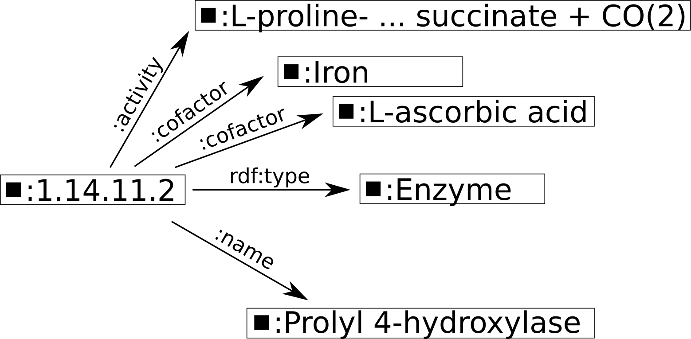
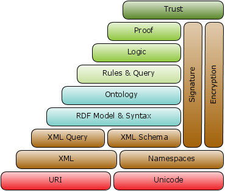

## Bio-Ontologies

::: {.callout-note appearance="simple"}
In this part of the course we will review ontologies and algorithms and we will present the Human Phenotype Ontology (HPO), which has been developed by our group since 2007.
:::

:::: {.columns}

::: {.column width="60%"}
::: {.smaller}
* You will not need a book for this course
* But if you would like to learn more:

> **Introduction to Bio-Ontologies** > (Chapman & Hall/CRC Mathematical & Computational Biology)  
> Peter N. Robinson and Sebastian Bauer  
> 2011
:::
:::

::: {.column width="40%"}
{width="80%"}
:::

::::

---

## Bio-Ontologies

::: {.callout-note appearance="simple"}
**Gameplan:**
:::

* Introduction to ontologies: OBO, RDF, RDFS, and OWL (today)
* Gene Ontology and Overrepresentation Analysis (lecture #2)
* Model-based Gene Set Analysis (lecture #3)
* Human Phenotype Ontology (HPO), semantic similarity, and Phenomizer (lecture #4)

---

# OBO: Open Bio-Ontologies

## OBO

:::: {.columns}

::: {.column width="75%"}
* Open Bio-Ontology (OBO)
* The OBO Foundry is a collective of ontology developers committed to collaboration and adherence to shared principles.
* Develop a family of interoperable ontologies that are both logically well-formed and scientifically accurate.
* Open use, collaborative development, non-overlapping content, and common syntax based on models like the Gene Ontology (GO).
:::

::: {.column width="25%"}
{width="100%"}
:::

::::

[http://www.obofoundry.org/](http://www.obofoundry.org/){.tiny}

---

## OBO Format

::: {.callout-note appearance="simple"}
Gene Ontology and OBO foundry members have developed a simple ontology language called OBO.
:::

* Models a subset of the semantics available in OWL 2.
* Human-readable flat file format.
* Most current software also supports JSON, but we will stick with OBO for a moment to introduce the basics!
* Begins with a header:

```text
format-version: 1.2
date: 29:07:2010 12:36
auto-generated-by: OBO-Edit 2.0
subsetdef: goslim_candida "Candida GO slim"
subsetdef: goslim_generic "Generic GO slim"
default-namespace: gene_ontology
```

# OBO Stanzas
::: {.callout-note appearance="simple"}
OBO stanzas can refer to universal types [Term], type definitions [Typedef], or instances [Instances].
:::

```text
[Term]
id: GO:0000031
name: mannosylphosphate transferase activity
namespace: molecular_function
def: "Catalysis of the transfer of a mannosylphosphate group from one compound to another." [GOC:jl]
is_a: GO:0016740 ! transferase activity
```

# OBO Stanzas (Identifiers)
The stanza begins with the id, which is a unique identifier comparable to an accession number.

```text
id: GO:0000031
```

Each term also has a name (concise human-readable description):

```text
name: mannosylphosphate transferase activity
```

All other tag:value items are optional.

# OBO Stanzas (Semantic Links)
::: {.callout-note appearance="simple"}
The is_a keyword indicates subclass links.
:::

Example: mannosylphosphate transferase activity is a subclass of GO:0016740.

```text
is_a: GO:0016740 ! transferase activity
```

Note: Text following an ! is a comment.

# OBO subclass and other relations
Terms may have any number of is_a relations.

For all other relations, the keyword relationship (or specific relation type) is used.

::: {.callout-note appearance="simple"}
The relation type name must be defined in a [Typedef] stanza.
:::

```text
[Typedef]
id: part_of
name: part_of
xref: OBO_REL:part_of
is_transitive: true
```

If A part_of B and B part_of C, then A part_of C.

# RDF / RDFS
OWL and the Semantic Web

::: {.callout-note appearance="simple"}
OWL was developed by the W3C to enable richer integration and interoperability of data on the Web.
:::

* Part of the Semantic Web effort.
* Designed to connect websites at the level of data rather than presentation (HTML).
* Enables computational inference.

# Resource Description Framework (RDF)
OWL is built upon RDF and RDFS.

* RDF expresses propositions using formal vocabularies.
* Basic building block: The Triple (Subject, Predicate, Object).

```text
[http://www.example.org/](http://www.example.org/)  hasCreator  John Smith
```

# RDF: Serialization (XML)
RDF is an abstract model, but often serialized as RDF/XML.

```xml
<rdf:RDF xmlns="[http://purl.uniprot.org/core/](http://purl.uniprot.org/core/)" 
         xmlns:rdf="[http://www.w3.org/1999/02/22-rdf-syntax-ns#](http://www.w3.org/1999/02/22-rdf-syntax-ns#)">

  <rdf:Description rdf:about="[http://purl.uniprot.org/enzyme/1.14.11.2](http://purl.uniprot.org/enzyme/1.14.11.2)">
    <rdf:type rdf:resource="[http://purl.uniprot.org/core/Enzyme](http://purl.uniprot.org/core/Enzyme)"/>
    <name>Procollagen-proline dioxygenase</name>
    <activity>L-proline-[procollagen] + 2-oxoglutarate + O(2) = ...</activity>
    <cofactor>Iron</cofactor>
  </rdf:Description>
</rdf:RDF>
```

## RDF

::: {.callout-note appearance="simple"}
RDF is designed to make computer-processable statements in the context of the Semantic Web.
:::

* Requires a system of machine-processable identifiers for identifying resources that are **unique** across the entire Web.
* Requires a computer language for representing and processing these statements.
* The existing Web architecture provides **URLs** (Uniform Resource Locators) as one form of identifier.
    * Example: For `http://www.example.org`, the **location** is `www.example.org` and the **protocol** is `http`.

---

## RDF: URLs, URIs, and URNs

::: {.callout-note appearance="simple"}
URLs are one of two specific classes of **Uniform Resource Identifier (URI)**.
:::

* The other class is the **Uniform Resource Name (URN)**.
* A URN represents a name for a resource that is unique and global throughout the Web.
* **Example:** `urn:isbn:0691141339` (ISBN for a specific book).
* **Key Difference:** While this URI is unique, it cannot be used to retrieve the book from the Web directly.

---

## RDF: Serialization

::: {.callout-note appearance="simple"}
RDF is an abstract data model. The process of representing it as a computer file is called **serialization**.
:::

* Many RDF files are written in **RDF/XML**.
* The following example is modified from an RDF file created by the Uniprot consortium.

---

## RDF: Serialization 

```xml
1. <?xml version='1.0' encoding='UTF-8'?>
2. <rdf:RDF xmlns="[http://purl.uniprot.org/core/](http://purl.uniprot.org/core/)" 
3.          xmlns:rdf="[http://www.w3.org/1999/02/22-rdf-syntax-ns#](http://www.w3.org/1999/02/22-rdf-syntax-ns#)" 
4. >
5. 
6.   <rdf:Description 
7.        rdf:about="[http://purl.uniprot.org/enzyme/1.14.11.2](http://purl.uniprot.org/enzyme/1.14.11.2)">
8.     <rdf:type rdf:resource="[http://purl.uniprot.org/core/Enzyme](http://purl.uniprot.org/core/Enzyme)"/>
9.     <name>Procollagen-proline dioxygenase</name>
10.    <name>Procollagen-proline 4-dioxygenase</name>
11.    <name>Prolyl 4-hydroxylase</name>
12.    <activity>L-proline-[procollagen] + 2-oxoglutarate + O(2)
13.              = trans-4-hydroxy-L-proline-[procollagen] + 
14.                succinate + CO(2).
15.    </activity>
16.    <cofactor>Iron</cofactor>
17.    <cofactor>L-ascorbic acid</cofactor>
18.   </rdf:Description>
19. </rdf:RDF>
``` 

* Line 1: The XML declaration,
* Line 2:  Opens an \texttt{rdf:RDF}
  element, which indicates that the XML content from line 2 up to the
  closing tag at line 19 represents RDF. 
* Line 2: The default name space  for this file is <tt>http://purl.uniprot.org/core/</tt>
* Line 3: The namespace declaration (<tt>xmlns</tt>) states that the prefix
  \textit{rdf} is equivalent to the namespace URI
  \texttt{http://www.w3.org/1999/02/22-rdf-syntax-ns\#}, and allows the
  prefix \texttt{rdf} to be used in place of the complete URL in the remainder of
  the RDF file. 
* Lines 6-18: Contain the specific information of the RDF file.


## RDF: rdf:about

```{.xml code-line-numbers="6"}

```

*  RDF statements are descriptions of resources
* __rdf:about__ is a fundamental attribute used to identify the __Subject__ of a description.
* Line 6: Indicates that
  the *subject* of the RDF statements contained within the
  <tt>Description</tt> element is
  [http://purl.uniprot.org/enzyme/1.14.11.2](http://purl.uniprot.org/enzyme/1.14.11.2).
* We will abbreviate the subject as `:1.14.11.2` in the following slides
  

## RDF: rdf:type

```{.xml code-line-numbers="7"}

```

* Line 7 contains the first of several triplets contained in the
  <tt>Description</tt> element. 
    *  For each triplet, the subject is <tt>1.14.11.2</tt>.
    * The predicate `rdf:type` means that the subject of the triple
  is an `instance of` the class represented by the object of the
  triple.
 *  Thus, `:1.14.11.2` is an instance of `Enzyme`
  
## RDF: structural metadata (what something is) vs descriptive data (what something is called or does).

```{.xml code-line-numbers="7-8"}

```

* Line 7 contains an `rdf:type` predicate stating that `:1.14.11.2` is an instance of `Enzyme`
* Line 8 contains a __user-defined__ predicate stating that a `name` of `:1.14.11.2` is Procollagen-proline dioxygenase

## RDF: Serialization {background-color="#f8f9fa"}

::: {.smaller}

| Subject | Predicate | Object |
|:---|:---|:---|
| `:1.14.11.2` | `rdf:type` | `:Enzyme` |
| `:1.14.11.2` | `:name` | Procollagen-proline dioxygenase |
| `:1.14.11.2` | `:name` | Procollagen-proline 4-dioxygenase |
| `:1.14.11.2` | `:name` | Prolyl 4-hydroxylase |
| `:1.14.11.2` | `:activity` | L-proline-[procollagen] + 2-oxoglutarate + O(2) = trans-4-hydroxy-L-proline-[procollagen] + succinate + CO(2). |
| `:1.14.11.2` | `:cofactor` | Iron |
| `:1.14.11.2` | `:cofactor` | L-ascorbic acid |

: **RDF triples for procollagen-proline dioxygenase**. 


Each of the predicates indicates a different property of the enzyme 1.14.11.2. The triples with the predicate `:name` should be read as ":1.14.11.2 has the name Procollagen-proline dioxygenase" etc., and the triples with the predicate `:cofactor` should be read as ":1.14.11.2 has the cofactor Iron" etc.
:::

## RDF: Model

::: {.callout-note appearance="simple"}
RDF models statements as nodes and edges in a graph. For any given triple, there is a node for the subject, a node for the object, and an edge for the predicate, which is directed from the subject node to the object node.
:::

For instance, the triple `:1.14.11.2 rdf:type :Enzyme` can be represented as shown here:

{#fig-rdf-triple width="90%" fig-align="center"}

#  RDF: Model

::: {.callout-note appearance="simple"}

This entire collection of RDF statements correspond to a labeled directed graph.
:::

{#fig-rdf-triple width="90%" fig-align="center"}

## RDF: bnodes

::: {.callout-note appearance="simple"}
RDF provides several syntactic constructs for expressing more complex statements that go beyond what can be expressed by the simple subject/predicate/object form of the triples presented up to now.
:::

* Suppose we want to represent something that does not have a URI.
* This can be done using an RDF construct called a *blank node* (*bnode* for short).
* Let us say we want to express the statement *Someone called Douglas wrote a book entitled "Hitchhiker's Guide to the Galaxy."* Clearly, it is impossible to provide a URI for the concept *Someone called Douglas*.
* Instead, we use a bnode to express the statement about this "someone."

```text
[ :firstname "Douglas"]
``` 


## RDF: bnodes (Continued)

::: {.callout-note appearance="simple"}
The statement in the previous slide means $X$, such that there exists some $X$ (i.e., somebody) such that $X$ has a first name Douglas.
:::

* It is convention to leave a space after the opening square bracket as if to indicate the presence of the "blank" subject of these triples.
* We can now use this statement as an `rdf:subject`.

```text
[ :firstname "Douglas"] dc:wrote 
         [ dc:title "Hitchhiker's Guide to the Galaxy"] .
```

## RDF: reification

::: {.callout-note appearance="simple"}
::: {.smaller}
Let's say we then do a search in our favorite Web search engine and find a Wikipedia article saying that Douglas Adams wrote a book entitled "Hitchhiker's Guide to the Galaxy." Furthermore, let's say we are skeptical about this statement and want to use RDF to express the fact that Wikipedia *claims* that Douglas Adams wrote a book entitled "Hitchhiker's Guide to the Galaxy."
:::
:::

RDF represents a reified statement as four statements using RDF properties and objects: the triplet (S, P, O), reified by resource R, is represented by:

* `R` `rdf:type` `rdf:Statement`
* `R` `rdf:subject` `S`
* `R` `rdf:predicate` `P`
* `R` `rdf:object` `O`

Essentially, RDF "reifies" (makes) a triple into a "thing" about which other RDF statements can be made. The triple is assigned an identifier and treated as a resource.

## RDF: reification (Example)

Assuming that the appropriate qname prefixes have been defined, we can express our statement about Wikipedia's claim as follows:

```text
@prefix rdf: [http://www.w3.org/1999/02/22-rdf-syntax-ns#](http://www.w3.org/1999/02/22-rdf-syntax-ns#) .

_:x rdf:type rdf:Statement .
_:x rdf:subject :"Douglas Adams" .
_:x rdf:predicate :wrote .
_:x rdf:object :"Hitchhiker's Guide to the Galaxy" .

web:wikipedia q:says _:x
```


## RDFS

::: {.callout-note appearance="simple"}
A schema is a formal definition of the syntax of a language, and a schema language is a language for expressing that definition. In SQL, the schema is the structure of the database that defines the objects in the database.
:::

* RDF Schema (RDFS) is intended as a framework for interpreting the meaning of data expressed in RDF. 
* RDFS provides additional specifications and keywords that allow many kinds of *inference* to be performed.

## RDFS: *is a* ain't always *is a*

::: {.callout-note appearance="simple"}
Probably the most important concept for inference in RDFS is that of the class. Classes provide an abstraction mechanism for grouping resources with similar characteristics.
:::

It is important to distinguish between two different usages of the phrase "is a" in the English language:

* **Mickey is a mouse**: This means a particular individual called *Mickey* is an **instance of** the class Mouse.
* **A mouse is a rodent**: This means the class "mouse" **is a subclass of** the class "rodent," implying that every being that is a mouse is also a rodent.

As we shall see, RDFS has a different syntax for expressing each relation.

## RDFS: is a

::: {.callout-note appearance="simple"}
Imagine we have defined an ontology and have provided definitions at `http://www.my-example.org`, which we assign to the qname prefix `x`.
:::

* It is already possible in RDF to express the statement *Mickey is a mouse*:

```text
x:Mickey rdf:type x:Mouse .
```


## RDFS: is a (Subclasses)

::: {.callout-note appearance="simple"}
However, there is no mechanism built into RDF with which we could express the statement that *mouse* is a subclass of *rodent*.
:::

* The RDFS keywords `rdfs:Class` and `rdfs:subClassOf` can be used for this purpose.
* We first declare that `x:Mouse` and `x:Rodent` are RDFS classes, and then state that `x:Mouse` is a subclass of `x:Rodent`.

```text
@prefix x: [http://www.my-example.org](http://www.my-example.org) .

x:Mouse rdf:type rdfs:Class .
x:Rodent rdf:type rdfs:Class .
x:Mouse rdfs:subClassOf x:Rodent .
```

## RDFS: is a (Inference Rule 1)

One of the RDFS inference rules states that if there are asserted triples of the form:

```text
X rdfs:subClassOf Y .
b rdf:type X .
```


## RDFS: is a (Inference Rule 2)

Another inference rule states that the subclass relation is **transitive**. 

That is, if there are asserted triples about classes $X$, $Y$, and $Z$:

```text
X rdfs:subClassOf Y .
Y rdfs:subClassOf Z .
```


## RDFS: is a (Transitivity Example)

Thus, if we assert the following triples:

```text
x:Mouse rdf:type rdfs:Class .
x:Rodent rdf:type rdfs:Class .
x:Mammal rdf:type rdfs:Class .

x:Mouse rdfs:subClassOf x:Rodent .
x:Rodent rdfs:subClassOf x:Mammal .
```


## RDFS: Properties and Inference

Similar inference rules apply to properties. For instance, we can define a simple hierarchy of biochemical regulation with the following RDF statements:

```text
@prefix r: [http://www.regulation.org](http://www.regulation.org) .

r:regulates rdf:type rdfs:Property .
r:positively_regulates rdf:type rdfs:Property .
r:negatively_regulates rdf:type rdfs:Property .

r:positively_regulates rdfs:subPropertyOf r:regulates .
r:negatively_regulates rdfs:subPropertyOf r:regulates .
```


If proteins A and B have been defined in a namespace pro, we can state that A positively regulates B by asserting the following triple:

```{.turtle}
pro:A  r:positively_regulates pro:B .
```

## RDFS: Properties and Inference

There is an inference rule for RDFS properties stating that if the following triples are asserted:

```{.turtle}
P rdfs:subPropertyOf Q .
X P Y .
```

Then the following triple can be inferred:


```{.turtle}
X Q Y .
```

Example:
Using our regulation hierarchy, we can infer that Protein A regulates Protein B:

```{.turtle}
pro:A  r:regulates pro:B .
```

::: {.callout-tip}
Similarly to the situation with classes, the subproperty relation is transitive.
:::

## RDFS: Property Domains

::: {.callout-note appearance="simple"}
RDFS provides a syntax for specifying the range and domain of properties. Recall that the *domain* of a function is the set of values for which a function is defined. The *range* is the set of all values the function takes for the values in the domain.
:::

* RDFS' use of domain and range enables inference.
* The statement `P rdfs:domain D` means that the subject of any triple using predicate `P` must be an instance of class `D`.

If the following two triples are asserted:

```{.turtle}
P rdfs:domain D .
X P Y .
```

hen the following triple is inferred:

```{.turtle}
X rdf:type D .
```

## RDFS: Property Ranges

Similarly, the RDFS statement `P rdfs:range R` for an `rdf:Property P` and an `rdf:Class R` means that the resource denoted by the **object** of a triple whose predicate is `P` is an instance of the class `R`.

If the following two triples are asserted:

```{.turtle}
P rdfs:range R .
X P Y .
```

Then the following triple can be inferred:

```{.turtle}
Y rdf:type R .
```

## RDFS: Property Domains and Ranges (Example)

::: {.callout-note appearance="simple"}
The following highly simplified example was adapted from the National Cancer Institute (NCI) thesaurus.
:::

```{.turtle}
:drug_affects_protein rdf:type rdfs:Property .
:Drug rdf:type rdfs:Class .
:Protein rdf:type rdfs:Class .

:drug_affects_protein rdfs:domain :Drug .
:drug_affects_protein rdfs:range :Protein .
```

If we now additionally assert the following triple:

```{.turtle}
:Nilotinib  :drug_affects_protein :BCR-ABL .
```

Then we can infer the following two triples:

```{.turtle}
:Nilotinib rdf:type :Drug .
:BCR-ABL rdf:type :Protein .
```

::: {.smaller}
In fact, Nilotinib is a selective Bcr-Abl tyrosine kinase inhibitor that is used in the treatment of chronic myeloid leukemia.
:::

## RDFS: Property Domains and Ranges (Graph)

The figure below displays the graph corresponding to these triples. The inferred triples are shown using dashed lines.

{#fig-rdfs-inference width="90%" fig-align="center"}

## RDFS: Intersections and Unions

::: {.callout-note appearance="simple"}
Yet other forms of inference in RDFS resemble to a certain extent conclusions about set intersections and set unions.
:::

* If $Z$ is a subclass of both class $X$ and class $Y$, and $b$ is defined as an instance of $Z$, then $b$ can be inferred to be an instance of both $X$ and $Y$.

If the following triples are asserted:

```{.turtle}
Z rdfs:subClassOf X .
Z rdfs:subClassOf Y .
b rdf:type Z .
```

Then these two triples can be inferred:

```{.turtle}
b rdf:type X .
b rdf:type Y .
```


## RDFS: Intersections and Unions (Continued)

For instance, if we state that:

```{.turtle}
:Pig rdfs:subClassOf :Mammal .
:Pig rdfs:subClassOf :FarmAnimal .
```

Then we can conclude that a particular pig is both a mammal and a farm animal. The class :Pig can be considered to occupy the intersection between those two classes.On the other hand, asserting that:

```{.turtle}
Cow rdfs:subClassOf :Mammal .
:Cow rdfs:subClassOf :FarmAnimal .
```

Does not imply that a cow is a pig!

::: {.callout-warning}

Limits of RDFSRDFS constructs are not designed to express an exact mathematical equality between sets, such as $A = B \cap C$. It only expresses "is a" relationships, not "is only and exactly" relationships.

:::

## RDFS: Intersections and Unions (Union)

::: {.callout-note appearance="simple"}
It is also possible to express something similar to set union in RDFS.
:::

If we assert the following triples:

```{.turtle}
X rdfs:subClassOf Z .
Y rdfs:subClassOf Z .
``` 

Then, if either b rdf:type X . or b rdf:type Y . is asserted, it can be inferred that:

```{.turtle}
b rdf:type Z .
```

# RDFS: Intersections and Unions

* For instance, if we assert the triples
  
```{.turtle}
:HairBearingAnimal rdfs:subClassOf :Mammal .
 :AnimalWithMammaryGlands rdfs:subClassOf :Mammal .
``` 

* then we can infer that any animal with hair is a mammal, and we can
  also infer that any animal with mammary glands is a mammal.


# The Web Ontology Language OWL

## OWL

The acronym OWL stands for **W**eb **O**ntology **L**anguage. While the most natural acronym would have been "WOL," **OWL** was chosen because it is easier to pronounce.^[The claim that the choice of the acronym OWL had something to do with the character Owl from *Winnie the Pooh*, who spelled his name WOL, is apocryphal.] 

In essence, OWL is an ontology language that builds upon RDF and RDFS but provides more powerful inference rules and built-in constructs. 

* OWL can be understood as an extension of RDFS that allows more powerful inference to be performed. 
* To a first approximation, we can say that OWL extends the inference capabilities already present in RDFS by the addition of new constructs and new rules.


{width="25%"}


## Defining Classes in OWL

::: {.callout-note appearance="simple"}
An important aspect of OWL is its ability to define classes with considerably more expressivity than RDFS.  
:::

OWL classes can be defined in two primary ways:

* **Enumerated Collections:** Classes representing a specific, closed collection of individuals (e.g., *Paul*, *John*, and *Mary*).
* **Conceptual Definitions:** Classes representing concepts that can have an indeterminate number of instances (e.g., *Mitochondrion*).

## Defining Classes in OWL

OWL provides six different mechanisms for defining classes:

1. **Named Classes**: Indicated by a URI.
2. **Enumerations**: A list of all specific individuals in the class.
3. **Property Restrictions**: Defining a class by how its members relate to other things.
4. **Intersection**: The overlap of two or more class descriptions.
5. **Union**: The combination of two or more class descriptions.
6. **Complement**: Everything that does *not* belong to a specific class.

Aside from the first type, each of these mechanisms defines classes by placing **restrictions** on the things that belong to the class.


## Classes in OWL: Enumeration

::: {.callout-note appearance="simple"}
Perhaps the easiest to understand is the enumeration type, which essentially just provides a list of all individuals that belong to the class.
:::

For instance, the following class definition expressed using **RDF/XML** syntax creates a class containing exactly the four Beatles:

```{.xml}
<owl:Class>
  <owl:oneOf rdf:parseType="Collection">
    <owl:Thing rdf:about="#John"/>
    <owl:Thing rdf:about="#Paul"/>
    <owl:Thing rdf:about="#George"/>
    <owl:Thing rdf:about="#Ringo"/>
  </owl:oneOf>
</owl:Class>
```

## Classes in OWL: Property Restriction

::: {.callout-note appearance="simple"}
An *A-Microtubule* can be defined as "A complete cylindrical microtubule that is part of a microtubule doublet in cilia."
:::

```{.xml}
<owl:Class rdf:about="#A-Microtubule">
  <rdfs:label>A-Microtubule</rdfs:label>
  <rdfs:subClassOf rdf:resource="#Cilium Microtubule"/>
  
  <rdfs:subClassOf>
    <owl:Restriction>
      <owl:onProperty rdf:resource="#is Physical Part of"/>
      <owl:someValuesFrom rdf:resource="#Cytoskeleton"/>
    </owl:Restriction>
  </rdfs:subClassOf>

  <rdfs:subClassOf>
    <owl:Restriction>
      <owl:onProperty rdf:resource="#is Physical Part of"/>
      <owl:someValuesFrom rdf:resource="#Cilium"/>
    </owl:Restriction>
  </rdfs:subClassOf>
</owl:Class>
```

## Classes in OWL: Property Restriction (Logic)

::: {.callout-note appearance="simple"}
A property restriction is a special kind of class description that describes an **anonymous class**—specifically, the class of all individuals that satisfy the restriction.
:::

* The previous RDF/XML code states that the class *A-Microtubule* is a subclass of an anonymous class defined by being a physical part of some *cytoskeleton*.
* It is also a subclass of another anonymous class defined by being a physical part of some *cilium*.

> **In plain English:** Every A-microtubule is part of a cilium and simultaneously part of a cytoskeleton.

## Classes in OWL: Property Restriction (Value Constraints)

OWL distinguishes two kinds of property restrictions: **Value Constraints** and **Cardinality Constraints**. A value restriction on some property $P$ has the following general form:

```{.xml}
<rdfs:subClassOf>
  <owl:Restriction>
    <owl:onProperty rdf:resource="P" />
    <owl:allValuesFrom rdf:resource="#V"/>
  </owl:Restriction>
</rdfs:subClassOf>
```

## Classes in OWL: Property Restriction (Universal)

::: {.callout-important appearance="simple"}
`owl:allValuesFrom` states that for each instance of the class being described, **every** value for $P$ must fulfill the constraint. 
:::

* **Confusing Caveat:** `owl:allValuesFrom` does **not** necessarily mean that an instance of the class *must* have the property $P$. It merely states that **if** an instance does have $P$, then the value must be from class $V$.
* **The Universal Quantifier:** This is analogous to the logic of $\forall$ in predicate calculus.
* **Formal Logic:** Recall that the formula $(\forall x) P(x)$ essentially means "for all $x$, if $x$ exists in this context, then it must satisfy $P$."


## Classes in OWL: Negation

::: {.callout-note appearance="simple"}
Classes can be defined by stating what they are **not**.
:::

* For instance, the Ontology for Biomedical Investigations (OBI) describes a class of cells that **do not express** the CD8 receptor using the `owl:complementOf` keyword.
* This is achieved by defining the intersection of the class "Cell" and the **complement** of the class of things that "have part CD8 receptor."

```{.xml}
<owl:intersectionOf rdf:parseType="Collection">
  <owl:Class rdf:about="CL:cell"/>
  
  <owl:Class>
    <owl:complementOf>
      <owl:Restriction>
        <owl:onProperty>
          <owl:TransitiveProperty rdf:about="#has_part"/>
        </owl:onProperty>
        <owl:someValuesFrom>
          <owl:Class rdf:about="#CD8 receptor"/>
        </owl:someValuesFrom>
      </owl:Restriction>
    </owl:complementOf>
  </owl:Class>
</owl:intersectionOf>
```

## Classes in OWL: Negation (The Pitfalls)

::: {.callout-warning}
### The "Kitchen Sink" Problem
Unexpected results can be obtained from the naive use of `owl:complementOf`.
:::

* **The Logic:** While one might be tempted to think that the complement of *Man* is *Woman*, the formal meaning of `owl:complementOf` *Man* is **everything in the universe that is not a Man**.
    * This includes the kitchen sink, the planet Neptune, and the Pacific Ocean.
* **The Solution:** `owl:complementOf` is almost always combined with other restrictions (intersections) to narrow the scope.

> **Example:** To define *Woman*, you would use the **Intersection** of *Human Being* and the **Complement** of *Man*.

## Classes in OWL: Union

::: {.callout-note appearance="simple"}
OWL provides a union operator that is analogous to the set union operator ($A \cup B$).
:::

* For instance, we can define the class **Human** as the union of the classes **Man** and **Woman**:

```{.xml}
<owl:Class rdf:ID="Human">
  <owl:unionOf rdf:parseType="Collection">
    <owl:Class rdf:about="#Man" />
    <owl:Class rdf:about="#Woman" />
  </owl:unionOf>
</owl:Class>
```

## Classes in OWL: Union (The Subclass Trap)

Contrast the `owl:unionOf` construct to the following **incorrect** attempt to define *Human* as a subclass of *Man* and *Woman*:

```{.xml}
<owl:Class rdf:ID="Human">
  <rdfs:subClassOf rdf:resource="#Man" />
  <rdfs:subClassOf rdf:resource="#Woman" />
</owl:Class>
```

Why this fails:

* The "And" vs. "Or" Logic: By using rdfs:subClassOf twice, you are stating that every Human must be a Man AND simultaneously a Woman.
* Unsatisfiability: If Man and Woman are defined as disjoint (meaning they cannot overlap), this class becomes unsatisfiable.
* The Empty Set: An unsatisfiable class is one that cannot contain any possible individuals. 

In formal logic, this is equivalent to the empty set ($\emptyset$).

::: {.callout-important}

The formula $A = \{ C \cap \neg C \}$ is unsatisfiable because it implies a direct contradiction.

:::

## Individuals in OWL

In OWL, `rdf:type` is the property that connects an individual to a class of which it is a member.

If we have a class of cities:

```{.xml}
<owl:Class rdf:ID="City"/>
```

We can declare individual cities to be members of this class. The following two syntactical forms have identical meanings:

- Option 1: Direct Class Tag

This uses the class name as the XML element tag.

```{.xml}
<City rdf:ID="Berlin"/>
```

- Option 2: Explicit Typing

This uses owl:Thing (the root class of everything) and explicitly states the type.

```{.xml}
<owl:Thing rdf:ID="Berlin"/>

<owl:Thing rdf:about="#Berlin">
  <rdf:type rdf:resource="#City"/>
</owl:Thing>
```

## OWL: Conclusion and Next Steps

* **The Tip of the Iceberg:** We have barely scratched the surface of OWL's logical capabilities in this lecture.
* **Hands-on Learning:** You will create your own ontology in the upcoming **Exercise**, where you will have the chance to explore these constructs (and more) in a practical setting.
* **Official Resources:** The [W3C Website](https://www.w3.org/OWL/) provides comprehensive documentation and technical specifications for the OWL family of languages.


{width="40%"}

