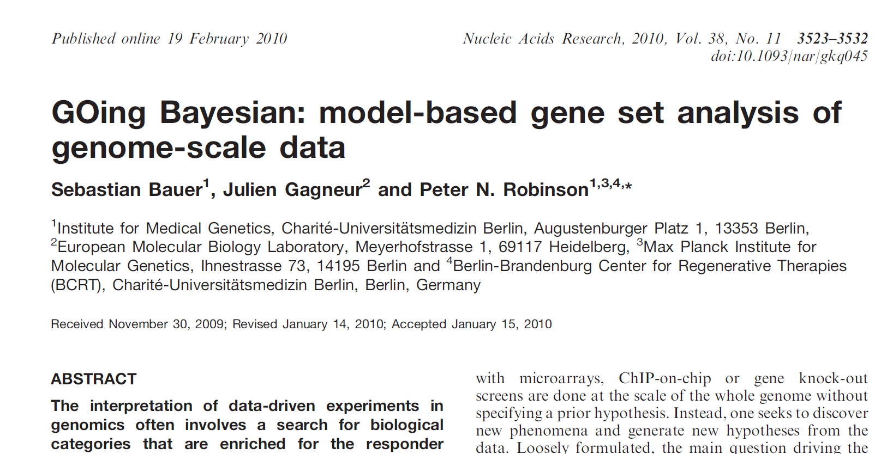
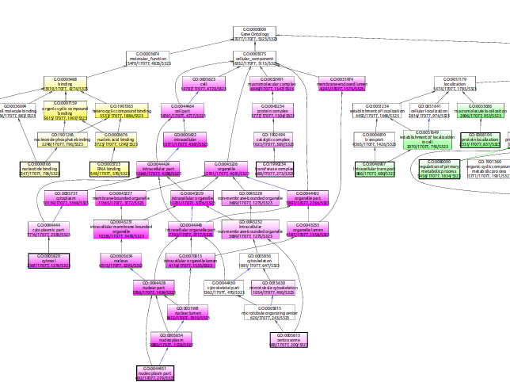
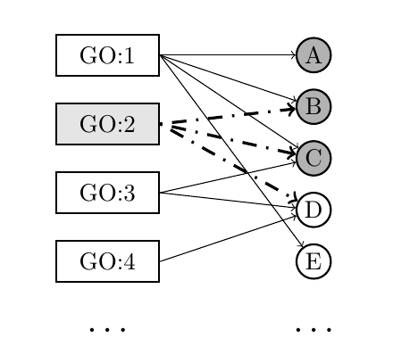
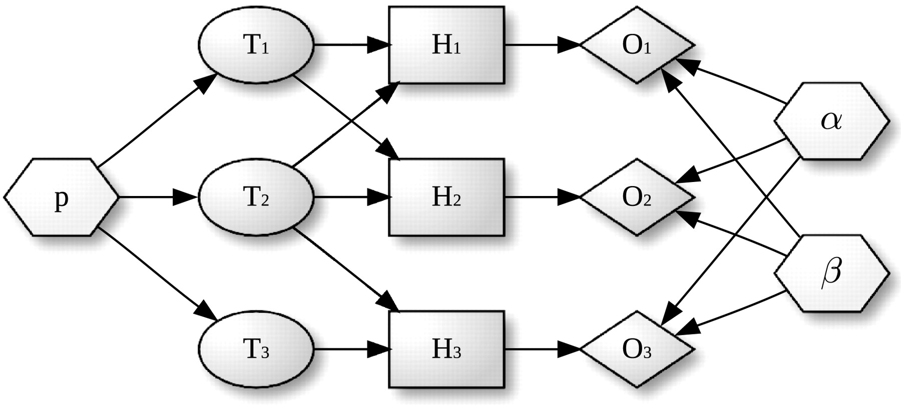
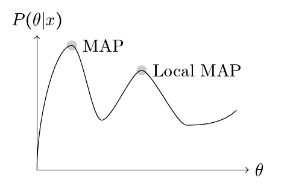
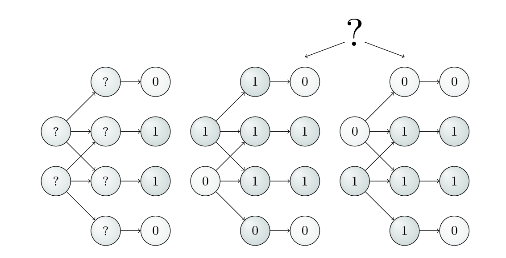
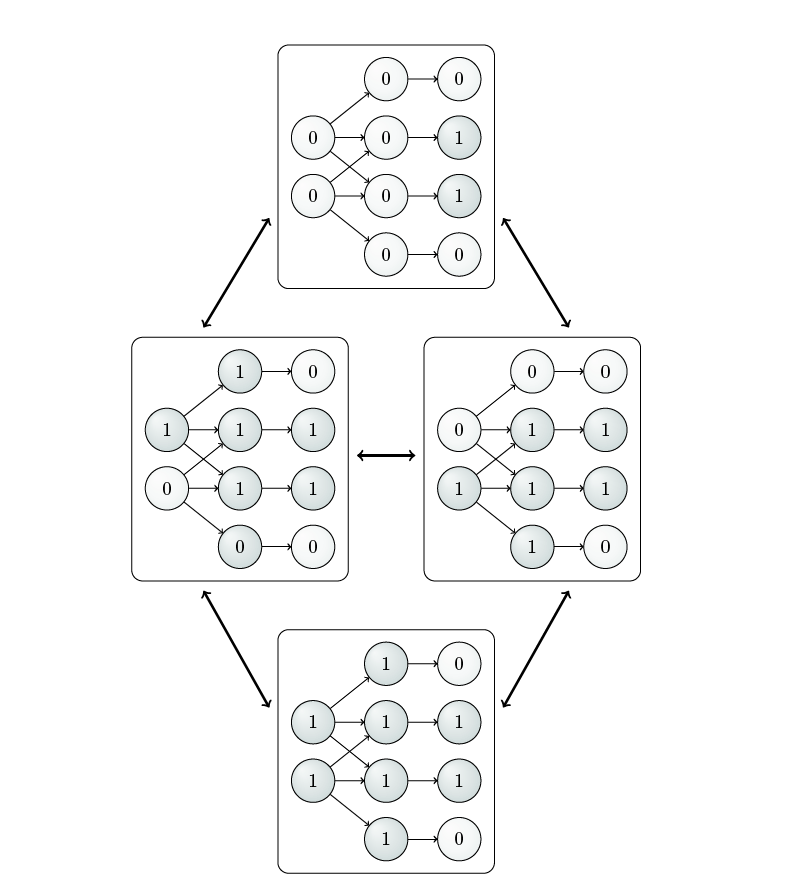

::: {.hidden}
$$
\newcommand{\argmax}{\mathop{\mathrm{arg\,max}\;}\limits}
$$
:::

## Model based gene-set analysis

::: {.callout-note appearance="simple"}
Today I will present a Bayesian algorithm for GO analysis that improves upon the "term-for-term" approach we saw last week.
:::

{fig-align="center" width="40%"}

## Problems with the term-for-term approach

::: {.callout-important appearance="simple"}
We have seen in the previous chapter that a major difficulty of the standard approach to GO overrepresentation analysis is that each term is analyzed in isolation.
:::

* Because of the statistical dependencies between terms that are close to one another in the ontology graph, if one term is called significant then commonly one or more related terms are also called significant.


## Problems with the term-for-term approach

{fig-align="center" width="60%"}

* Note how there seems to be a dependency between parent and child terms.
* The distribution of significant terms is not uniform across all 44,797 GO terms.

---

## Model based gene-set analysis (MGSA)

::: {.callout-tip appearance="simple"}
MGSA is a completely different approach to GO analysis that seeks to find the best combination of terms that correspond to an experimental result.
:::

* The problem reduces to an **optimization problem**:
    * The choice of active GO terms (and optionally other parameters) are iteratively varied.
    * The goal is to maximize a single score or a probability.
* **No statistical tests** (like Fisher's exact test) are performed for individual terms in isolation.
* Instead, there is a **single score** to be optimized for the entire set of GO terms simultaneously.


---

## GenGO: A Generative Model for GO

::: {.callout-note appearance="simple"}
The core idea is to fit a model on all terms **simultaneously**, rather than testing each term in isolation.
:::

::: {.columns}

::: {.column width="40%"}
{#fig-gengo fig-alt="GenGO Model Diagram" width="100%"}
:::

::: {.column width="60%"}
### The Logic
* **Nodes:** GO terms are modeled as *active* (gray) or *inactive* (white).
* **Connections:** Terms connect to their annotated genes.
* **Objective:** Maximize a score by selecting GO terms that cover as many **ON** (active) genes as possible while avoiding **OFF** (inactive) genes.

[^1]: [Lu Y et al. (2008). *Nucleic Acids Res*; 36:e109.](https://doi.org/10.1093/nar/gkn434)

:::
:::


## GenGO (2)

::: {.columns}
::: {.column width="75%"}

The GenGO algorithm can be explained with the use of several
categories.

* $A_g$: `ON` gene node that is connected to at least one
  `active` GO term (e.g., genes B and C in
  @fig-gengo.
* $A_n$: `ON` gene node that is *not* connected to any
  `active` GO term (e.g., gene A).
* $I$: `OFF` gene node (e.g., genes D and E).
* $S_g$: edge connecting  an `active` GO term with a node
  in $I$ (e.g., edge from `GO:2` to gene D).
* $S_n$: edge connecting  an `inactive` GO term with a node
  in $I$ (e.g., edge from `GO:4` to gene D).

::: 
::: {.column width="25%"}


{fig-align="center" width="100%"}

:::
:::


##  GenGO (3)

*  According to the model of genGO, an `active` GO term does not
activate all of the genes it annotated; rather, because of noise or
other errors, annotated genes are observed to be `OFF` with a
probability of $1-a$. 
* Similarly, genes that are not annotated by any
`active` GO term are observed to be `ON` with a
probability of $b$. 
* The actual values of $a$ and $b$ can be chosen by
the user or optimized by the genGO algorithm itself, but
representative values are $a=0.9$ and $b=0.01$.

One can then define a scoring function that is to be maximized,
whereby $C$ is the set of `active` GO terms in the current
iteration.
$$
\mathcal{L}(C|p,q,G) = |A_g|\log a + |A_n|\log b   + \; |S_g|\log (1-a)
+ |S_n| \log (1-b) - \alpha |C|
$$ {#eq-gengo}


# GenGO (4)

The first four terms of @eq-gengo are equivalent to the logarithm of the following equation

$$
a^{|A_g|}b^{|A_n|}(1-a)^{|S_g|}(1-b)^{|S_n|}
$$ {#eq-genGO-no-log}


It can be seen that the value of Equation @eq-genGO-no-log is
maximized if $|A_g|>|S_g|$ (because  $a>1-a$) and if $|S_n|>|A_n|$
(because $1-b>b$). Thus, maximization of
@eq-genGO-no-log would tend to identify sets of
`active` GO terms
that more often than not annotate the `ON` genes ($|A_g|>|S_g|$). On the other hand, the `inactive` GO terms would more often than not annotate `OFF` genes
($|S_n|>|A_n|$).

## GenGO (5)
 
 The final term in @eq-gengo, $- \alpha |C|$ reduces the
score linearly in the number of `active` GO terms. The authors
of genGO state that a value of $\alpha=3$ tends to produce good
results. The genGO algorithm seeks to optimize the score for the
current set of `active` GO terms $C$. 
 
## GenGO (6)

::: {.callout-note appearance="simple"}

GenGO performs iterations where all
 possible one-step changes of $C$ are considered, both changes that add
 a term $t_M$ to the current configuration as well as changes that
 remove a term $t_L$. In each iteration, the single-step change
 with the highest improvement of the score is chosen until no further
 improvement is possible. 

:::


```pseudocode
#| html-indent-size: "1.2em"
#| html-comment-delimiter: "//"
#| html-line-number: true
#| html-line-number-punc: ":"
#| html-no-end: false
#| pdf-placement: "htb!"
#| pdf-line-number: true
#| pdf-comment-delimiter: "//"

\begin{algorithm}
\begin{algorithmic}
\Require study set $\mathcal{S}$, population set $\mathcal{P}$, Gene Ontology $\mathcal{G}$, annotations $\mathcal{A}$
\State $C \gets \emptyset$
\Repeat
    \Forall{$t \in \mathcal{G}$}
        \State $t_L = \text{argmax}_{t \in C} \mathcal{L}(C \setminus \{t\})$
        \State $t_M = \text{argmax}_{t \in \mathcal{G} \setminus C} \mathcal{L}(C \cup \{t\})$
        \If{$\mathcal{L}(C_L) > \mathcal{L}(C_M)$}
            \State $C \gets C \setminus \{t\}$
        \Else
            \State $C \gets C \cup \{t\}$
        \EndIf
    \EndFor
\Until{No further improvement of score $\mathcal{L}(C)$}
\Return $C$
\end{algorithmic}
\end{algorithm}
```

 
## GenGO (7)

::: {.callout-note appearance="simple"}

The idea behind GenGO appears particularly attractive because it represents a novel way
of avoiding the statistical dependency problems associated with the
overrepresentation methods described in the previous chapter.  

:::


* However, the score and the optimization algorithm are heuristics without much statistical 
rigour
* It seemed possible to improve upon this result using Bayesian methodologies


## MGSA (1)

*  Model-based gene set analysis (MGSA) is similar to GenGO in that it seeks to identify an optimal combination of GO terms to ``explain'' the results of microarray or other high-throughput
experiments. 
*  MGSA differs from genGO in that it embeds the GO terms and
the genes they annotate into a Bayesian network and uses probabilistic
methods to search for the optimal combination. 

## MGSA (2)

* Similar to genGO, MGSA assumes that the experiment attempts to detect genes that have a particular `state` (such as differential expression),
which can be `ON` or `OFF`. The true state of any gene is hidden. 
* The experiment and its associated analysis provide observations of the gene states
that are associated with unknown  false positive ($\alpha$) and  false negative rates
($\beta$), which we will assume to be identical and independent for all genes.
* For instance, in the setting of a microarray experiment, the `ON` state
would correspond to differential expression, and the `OFF` state would
correspond to a lack of differential expression of a gene. Our model hence
assumes that differential expression is the consequence of the
annotation to some terms that are `active`.

## MGSA (3)
 An additional parameter $p$ represents the prior probability of a term being
in the `active` state. The probability $p$ is typically low (less
than 0.5), which has the effect of introducing a penalization for
increasing the number of active terms. This favors results that
identify a relatively low number of `active` terms.


## Structure of the MGSA Network

  Gene
categories, or terms ($T_i$) that constitute the first layer can be either
`active` or `inactive`. Terms that are `active` activate the hidden state
($H_j$) of all genes annotated to them, with the other genes remaining `OFF`. The
observed states ($O_j$) of the genes are noisy observations of
their true hidden state. The parameters of the model (dashed nodes) are the
prior probability of each term to be `active`, $p$, the false positive rate, $\alpha$,
and the false negative rate, $\beta$.

{fig-align="center" width="100%"}


## Structure of the MGSA Network}

::: {.callout-note appearance="simple"}
  More formally, the model can be described using a Bayesian network with three
layers that is augmented with a set of parameters.

:::

* A *term layer* $T=\{T_1,\ldots,T_m\}$ that consists of Boolean nodes
 corresponding to $m$ terms of the ontology. 
 * There is a Boolean variable
 associated with each node that can have the state values `active` (1) or `inactive` 
(0). 

## Structure of the MGSA Network


::: {.callout-note appearance="simple"}
  More formally, the model can be described using a Bayesian network with three
layers that is augmented with a set of parameters.
:::


* \textcolor{gray}{A \emph{term layer}  }
* A \emph{hidden layer} $H=\{H_1,\ldots,H_n\}$ that contains Boolean nodes
 representing the $n$ annotated genes. There are edges
 from the terms to the genes they annotate.
* For instance, if gene $H_1$ is annotated to terms $T_1$ and $T_2$ then there is an edge between 
$T_1$ and $H_1$
 and another edge between $T_2$ and $H_1$. The state of the nodes reflects the
 true activation pattern of the genes. Each node can have the state
values `ON` (1), or `OFF` (0). 

## Structure of the MGSA Network}


::: {.callout-note appearance="simple"}
  More formally, the model can be described using a Bayesian network with three
layers that is augmented with a set of parameters.
:::

* \textcolor{gray}{A \emph{term layer}  }
* \textcolor{gray}{A \emph{hidden layer}}
* An \emph{observed layer} $O=\{O_1,\ldots,O_n\}$ that contains Boolean
 nodes reflecting the state of all observed genes. The observed gene state nodes are
 directly connected to the corresponding hidden gene state nodes in a
 one-to-one fashion.


## Structure of the MGSA Network

::: {.callout-note appearance="simple"}
  More formally, the model can be described using a Bayesian network with three
layers that is augmented with a set of parameters.
:::

* \textcolor{gray}{A \emph{term layer}  }
* \textcolor{gray}{A \emph{hidden layer}}
* \textcolor{gray}{An \emph{observed layer} }
* A \emph{parameter set} that contains continuous nodes with values in
 $[0,1]$ corresponding to the parameters of the model $\alpha$, $\beta$ and
 $p$. These parameterize the distributions of the observed and the term layer
 as detailed below.
 
##  The MGSA model


::: {.callout-note appearance="simple"}
   For didactic purposes, we will initially explain a simplified version
of MGSA in which the parameters $\alpha$, $\beta$ and $p$ are considered to
have known, fixed values.
:::


The state propagation of the nodes can be modeled using various __local
probability distributions__ (LPDs), denoted by $P$. The joint probability
distribution for this Bayesian network can be written as

$$
  P(T,H,O) \; = \; P(T)P(H|T)P(O|H)\;  = P(T)\prod_{i=1}^n
  P(H_i|T) P(O_i|H_i).
$$ {#eq-joint-general}

## T: The Term layer

* The state of each term $T_j\in T$ is modeled according to a Bernoulli
distribution with hyperparameter $p$, i.e, $P(T_j=1)=p$. 
* Denoting by
$m_{x|T}$ the number of terms that have state $x$ for a given $T$,
i.e., $m_{x|T}=|\{j|T_j=x\}|$. 

then

$$
 P(T) = p^{m_{1|T}}(1-p)^{m_{0|T}}.
$$ {#eq-prior}

* Thus, $p$ is the probability that a given term is `on`.

## H: The hidden layer
 In the following, $T(H_i) \subseteq T$ is used to denote the set of
terms to which gene $H_i$ is annotated, i.e., the parents of $H_i$ in
the Bayesian network. For
the $T \rightarrow H$ links, any node $H_i \in H$ is `ON`
($H_i=1$) if at least one of its parents is `active`. Otherwise it
is `OFF`:

$$
P(H_i=1|T) = \begin{cases}1, & \text{if } \exists \; T_j \in T(H_i): T_j=1 \\ 0, &
\text{otherwise.} \end{cases}
%P(H_i|\emph{Pa}(H_i)) = \bigvee_{T\in\emph{Pa}(H_i)}T
\label{eqn:lpd.hidden.given.t}
$$ {#eq-lpd-hidden-given-t}

Note that this transition is deterministic.

*  The hidden nodes correspond to genes that are annotated by GO terms. If a GO term is `ON`, 
then in the MGSA model any annotated gene is (truly) `ON`.

## O: The observed layer

 For the $H \rightarrow O$
connection, the following two Bernoulli distributions are used:

$$
P(O_i=1|H_i=0) = \alpha
\label{eq:mgsa-bernoulli-alpha}
$$

and

$$
P(O_i=0|H_i=1) = \beta.
\label{eq:mgsa-bernoulli-beta}
$$

* The observed nodes correspond to the genes whose expression is observed by microarray 
analysis of RNA-seq etc. According to our model, they may be `OFF`, although the hidden node is 
`ON` (false negative) etc. 
* Note that this model is not intended to provide an accurate view of 
biology, but seems to work well for the task at hand

## Fully specified MGSA Network

{fig-align="center" width="100%"}


## MGSA

* Denote by $n_{xy|T} = |\left\{ i|O_{i}=x \wedge
  H_{i}=y\right\} |$ the number of genes having observed activation
$x$ and true activation $y$ according to the states of $T$. 
* For
instance, $n_{01|T}$ corresponds to the number of genes
observed to be not differentially expressed but whose true activation
state is `ON`. 
* Then, by considering the LPDs of nodes, one gets
the following product of Bernoulli distributions for $P(O|T)=
\prod_{i=1}^n P(H_i|T) P(O_i|H_i)$:

  
$$
P(O|T) = \alpha^{n_{10|T}} (1 - \alpha)^{n_{00|T}}
(1-\beta)^{n_{11|T}} \beta^{n_{01|T}}.
$$

## MGSA

$$
P(O|T) = \alpha^{n_{10|T}} (1 - \alpha)^{n_{00|T}}
(1-\beta)^{n_{11|T}} \beta^{n_{01|T}}.
$$ {#eq-alpha-beta-score}


* Hence, @eq-alpha-beta-score calculates the product
over $i=0,1$ of the probability of the observed states of the genes
given the hidden states of the terms. 
* For instance, for $i=1$, we need
only consider hidden nodes whose parents include `active`
terms, because otherwise their probability is zero according to @eq-lpd-hidden-given-t.
* Using @eq-prior
with $p=\beta$, we obtain that $P(H_1|T) P(O_1|H_1)=1\times P(O_1|H_1) =
(1-\beta)^{n_{11|T}}
\beta^{n_{01|T}}$. 
* Similar considerations for $i=0$ lead
to the final expression for @eq-alpha-beta-score.


## MAP: Maximum a postgeriori

::: {.callout-note appearance="simple"}
   In Bayesian statistics, maximum a posteriori (MAP) estimation is often
used to generate an estimate of the maximum value of a probability
distribution. 
:::

That is, if $x$ is used to refer to the data ($x$ can be
an arbitrary expression), and $\theta$ is used to refer to the
parameters of a model, then Bayes' law states that:

$$
P(\theta | x) = \dfrac{P(x|\theta )P(\theta )}{P(x)}
\label{eq:bayes-law-for-map}
$$

## MAP: Maximum a posteriori

* The term $P(\theta | x)$ is referred to as the posterior probability,
and specifies the probability of the parameters $\theta$ given the
observed data $x$. 
* The denominator on the right-hand side can be
regarded as a normalizing constant that does not depend on $\theta$,
and so it can be disregarded for the maximization of $\theta$. 
* The MAP
estimate of $\theta$ is defined as:
 
$$
 \argmax_{\theta} P(\theta | x) = \argmax_{\theta} P(x|\theta )(P(\theta )
\label{eq:map}
$$

## MAP: Maximum a posteriori

*  In the case of MGSA, the parameters comprised by $\theta$ would
include the set of `active` terms as well as values for
$\alpha,\beta$, and $p$. 
* Although MAP estimation procedures are often relatively simple to
implement, they tend to have the disadvantage that they ``get stuck'' in
local maxima  without being
able to offer a guarantee of finding the global maximum.
 
{fig-align="center" width="50%"}
 
## MAP: Shortcomings?
 
*  In
complicated networks such as that of MGSA, it is \textbf{rare to have a single
solution} that is substantially better than all alternative
solutions. 
* Rather, the posterior probability is usually spread over a
number of alternative network configurations. This implies that the
posterior probability is not adequately represented by a single
configuration $\theta^{MAP}$
* It is more appropriate to
sample networks from the posterior probability, leading to a
__collection of networks with high posterior probability__, each of
which offers a good explanation of the data. 


::: {.callout-note appearance="simple"}
These considerations motivate the
use of the MCMC algorithm to sample from the posterior distribution.
:::


## MAP: Shortcomings?

 {fig-align="center" width="80%"}


*  the optimization problem addressed by
  genGO and MGSA is known to be NP-complete. 
*  We observe that
  gene 2 and 3 are in the `ON` state (e.g., differentially
  expressed).
*  If $T_1$ were the only `active` term, then the observation
  could be explained by risking an error of one false-negative. The
  same can be noticed if $T_2$ is the only `active` term.
* thus there is no
  single optimum solution. A single MAP solution does not account for
  this.

## Monte Carlo Markov Chain Algorithm

* A different approach is to calculate the marginal probabilities for
each term being in the `active` state. 
* In general, if a joint
probability is defined over two random variables $X$ and $Y$ as
$P(X,Y)=P(X|Y)P(Y)$, then the marginal
probability for $X=x'$ is calculated by summing or integrating over all
possible values of $Y$:

$$
 P(X=x')=\sum_{i} P(X=x',Y=y_i)
$$

  or

$$
P(X=x')=\int_Y P(X=x',Y) \mathrm{d}Y
$$ 

## MCMC

* It is often difficult or
impossible to derive marginal probabilities for complicated
probability distributions because there are simply too many possible
configurations of the variables to be able to calculate each one, as
would be required for an analytical solution. 
* For this reason, a
number of estimation algorithms have been developed that in essence
sample from the distribution of the posterior probability and take the
proportion of samples in which $X$ takes on some specific value
$x'$ as an estimate of the posterior probability of $x'$  

::: {.callout-note icon=false, title="MCMC"}

 One of the best known and most effective algorithms for this purpose
is the Metropolis-Hasting algorithm, which is a Markov chain Monte
Carlo (MCMC) method. The
MCMC algorithm performs a random walk over the term and parameter
configurations, which asymptotically provides a random sampler
according to the target distribution $P(T|O)$.

:::

## MCMC

 Given the current configuration of the terms denoted by $T^t$, the algorithm
proposes a neighbor state $T^p$ in accordance to a proposal density function
$Q_T(\cdot|T^t)$. A value $r$ is sampled uniformly from the range (0,1). Then,
if

$$
 r < P_{\text{accept}}(T^t,T^p) = 
 \frac{P(T^{p}|O)Q_T(T^{t}|T^{p})}{P(T^{t}|O)Q_T(T^{p}|T^t)}
 \label{eqn:acceptance}
$$

the proposal is accepted, i.e., $T^{t+1} = T^p$, otherwise it is rejected,
i.e., $T^{t+1} = T^t$.


## MCMC
 
 Using Bayes' law, we have

$$
 P(T^{p}|O) = \dfrac{P(O|T^{p})P(T^{p})}{P(O)}
 \label{eqn:cond.prob}
$$

and similarly for $T^{t}$. Substituting these expressions for $P(T^{p}|O)$ and
$P(T^{t}|O)$ cancels out the normalization constant $P(O)$. The acceptance
probability is then:

$$
 P_{\text{accept}}(T^t,T^p) = 
 \frac{P(O|T^{p})P(T^{p})Q_T(T^{t}|T^{p})}{P(O|T^{t})P(T^{t})Q_T(T^{p}|T^t)}.
\label{eqn:accept.prop.2}
$$ {#eq-accept-prop-b}


*  We have $P(O|T)$ and $P(T)$ from the statement of the MGSA network

## MCMC
@eq-accept-prop-b is used iteratively to define a
random walk through the space of configurations.  A __burn-in
  period__ consisting of a certain number of iterations is used to
initialize the MCMC chain (in our implementation of the MGSA algorithm
in the Ontologizer, the default is 20,000
iterations). 

* Following this, $l$ further iterations (by default,
$10^6$) are performed.  Let $C(T_i)$ be the number of samples in which
term $T_i$ was `active`. Then

$$
P(T_i|O)\approx \frac{C(T_i)}{l}.
\label{eqn:mgsa-marginal}
$$

## MCMC

::: {.callout-note appearance="simple"}
 In order to finish the description of the algorithm, one needs to define
classes of operations of which a proposal is chosen, that is, we need to
specify $Q_T(T^p|T^t)$.
:::


  Denote by $T^p \leftrightarrow_T T^t$ the binary
relation that  states  that $T^p$   be constructed from $T^t$ by either

* toggling the `active`/`inactive` state of a single term, or by
* exchanging the state of a pair of terms that contains a single
    `active` term and a single `inactive` term.

## MCMC

 Denote by $N(T)$ the __neighborhood__ of a given configuration for
$T$, that is, the number of different operations that can be applied
once to $T$ in order to get a new configuration. At first, there are
$m$ terms in total, each of which can be toggled. In addition, there
are $m_{0|T}m_{1|T}$ possibilities to combine
terms that are `active` with terms that are `inactive`.
Thus, there are a total of $N(T)=m+m_{0|T}m_{1|T}$
valid state transitions. We would like to sample the valid proposals
with equal probability; therefore, the proposal distribution $Q_T$ is
determined by


$$
 Q_T(T^p|T^t)=\begin{cases}
                  \frac{1}{N(T^t)}, & \text{if } T^p \leftrightarrow_T
                  T^t\\ 0, & \text{otherwise.}
               \end{cases},
$$

which we can use to rewrite @eq-accept-prop-b to:

\newcommand{\acceptratio}{\frac{P(O|T^{p})P(T^{p})N(T^t)}{P(O|T^{t})P(T^{t})N(T^p)}}

$$
 P_{\text{accept}}(T^t,T^p) = 
 \acceptratio.
\label{eqn:accept.prop.3}
$$

## MCMC State transitions for MGSA

{fig-align="center" width="80%"}


## MGSA

```pseudocode
#| html-indent-size: "1.2em"
#| html-comment-delimiter: "//"
#| html-line-number: true
#| html-line-number-punc: ":"
#| html-no-end: false
#| pdf-placement: "htb!"
#| pdf-line-number: true
#| pdf-comment-delimiter: "//"

\begin{algorithm}
\begin{algorithmic}
\REQUIRE $O$, $l$ (number of steps)
\STATE $T^t \gets (0,\ldots,0)$
\FOR{$t \gets 1$ \TO $l$}
    \STATE $T^p \sim Q_T(\cdot|T^t)$, i.e., choose a neighbor by:
    \STATE - Toggling a term
    \STATE - Exchanging an active term with an inactive one
    \STATE $a \gets \text{AcceptanceRatio}$
    \STATE $r \sim U(0,1)$
    \IF{$r < a$}
        \STATE $T^t \gets T^p$
    \ENDIF
\ENDFOR
\RETURN $P(T_1=1|O),\ldots,P(T_m=1|O)$
\end{algorithmic}
\end{algorithm}
```

## Homework

describe what we will do here briefly