## Semantic Similarity: The Resnik Method

In 1995, Resnik introduced a method for evaluating the semantic similarity between two concepts in an ontology with `is_a` relations.^[Resnik P (1995) Using Information Content to Evaluate Semantic Similarity in a Taxonomy. arXiv cmp-lg/9511007]

* **Core Idea:** Associate probabilities with the concepts of an ontology.
* **Definitions:**
    * Let $\mathcal{C}=\left\{c_1,c_2,\ldots,c_n\right\}$ be the set of concepts in the ontology (permits multiple inheritance).
    * Define a function $p:\mathcal{C}\longrightarrow \left[ 0,1\right]$.
    * $p(c_i)$ is the probability of encountering an instance of class $c_i \in \mathcal{C}$.

---

## Ontology Probabilities & Information Content

:::: {.columns}

::: {.column width="40%"}
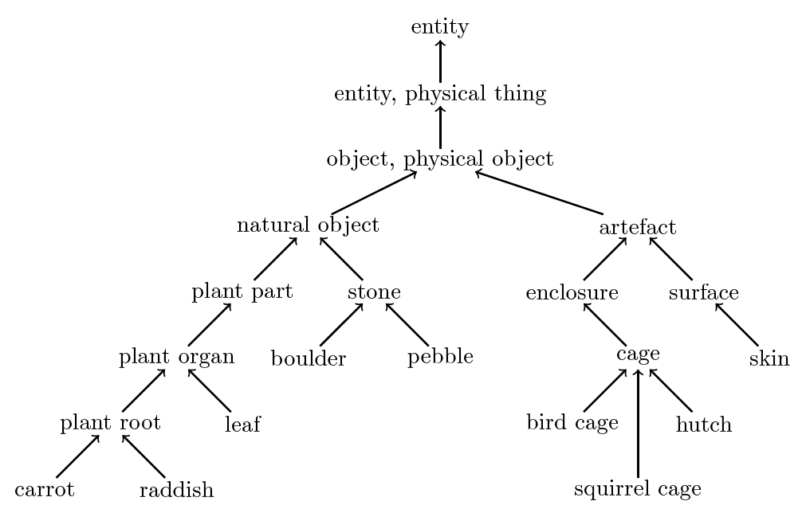{fig-align="center"}
:::

::: {.column width="60%"}
### Example: WordNet Excerpt

* **Hierarchy:** Every `pebble` is a `stone`, and every `stone` is a `natural object`.
* **The Root:** Every concept is a descendent of `entity`.
    * $p(\text{entity}) = 1$
    * Information Content: $\log 1 = 0$
:::

::::

::: {.callout-note appearance="simple"}
Knowing a random term is a descendent of **entity** provides no added information. Conversely, the probability of a specific term like **pebble** is much lower, meaning its **Information Content** is correspondingly higher.
:::

## Information Content (IC)

::: {.callout-important}
## Logic of Inheritance
Recall that:  
$x$ `instance_of` $A$  AND $A$ `is_a` $B$ $\implies$ $x$ `instance_of` $B$.
:::

* **Monotonicity**: $p$ is a monotonically increasing function as we move up the hierarchy. 
    * If $c_i$ `is_a` $c_j$, then $p(c_i) \leq p(c_j)$.
* **Root Probability**: If the ontology has a unique root node $r$, then $p(r)=1$.

### Resnik's Definition
The **Information Content (IC)** of a concept is the negative log likelihood of its probability:

$$\text{IC}(t) = -\log p(t)$$

---

## Intuition Behind IC

As the probability of a concept increases, its information content decreases. This mirrors information theory:

* **Common vs. Rare**: We gain less new information from an observation of a common event than from a rare one.
* **The Root Term**: Since the root subsumes all concepts:
    * $p(\text{root}) = 1$
    * $\text{IC}(\text{root}) = -\log(1) = 0$
    

::: {.callout-tip}
## Summary
The more specific a term is (lower probability), the higher its Information Content. The more general it is (higher probability), the lower its Information Content.
:::

## Basic Properties of Information Content (IC)

::: {.callout-note}
## Mathematical Foundation
Information Content relies heavily on the properties of logarithms. These identities are essential for calculating IC across different branches of an ontology.
:::

The following logarithmic identities are fundamental to the behavior of $IC(t) = -\log p(t)$:

$$
\begin{aligned}
\log 1 &= 0 \\
\log xy &= \log x + \log y \\
\log x^r &= r \log x \\
\log \frac{1}{x} &= - \log x \\
\log_a x &= \frac{\log x}{\log a}
\end{aligned}
$$

::: {.callout-note title="relevance for IC"}

* **$\log 1 = 0$**: Explains why the Root node ($p=1$) always has an Information Content of $0$.
* **$\log \frac{1}{x} = -\log x$**: This is the identity that allows us to write $IC(t) = \log \frac{1}{p(t)}$ as $IC(t) = -\log p(t)$.
* **$\log xy = \log x + \log y $**: Useful when calculating the joint probability of independent concepts.
:::

## Entropy

* Let us assume we are
analyzing a random variable $X$, which can take on one of a finite
number of specific values
$\left\{x_1,x_2,\ldots,x_n\right\}$ with a probability
$\left\{p_1,p_2,\ldots,p_n\right\}$, where the probability of the
outcome $x_i$ is $p_i$ and $\sum_{i=1}^n p_i=1$. 
* We will use the
notation $p(X=x)$ or simply $p(x)$ to denote the probability that the
random variable $X$ takes on some specific value $x$, where $x\in
\left\{x_1,x_2,\ldots,x_n\right\}$. 
* We will refer to each of the
specific values that $X$ can take on as \textit{outcomes}.

Shannon defined the information content of an outcome $x$ as

$$
h(x) = \log_2 \dfrac{1}{p(x)}
$$ {#eq-appdx-IC}

## Entropy (2)
 
Note that because of the properties of logarithms, 
$ \log_2\frac{1}{p(x)} = -\log_2 p(x)$, which is the definition of
information content. The
\textit{entropy} of the random variable $X$, written as $H(X)$, was defined by Shannon as
the average information content of all of the possible outcomes of
$X$.

$$
H(X) = \sum_{i=1}^n p(x_i)\log_2\dfrac{1}{p(x_i)}
$$ {#eq-appdx-entropy}

-  Note that by convention $p(x')\log_2 p(x')=0$ for $p(x')=0$. This is
necessary because $\log 0$ is undefined, and reasonable because
$\lim_{x\rightarrow 0} x\log x = 0$.

## Entropy (3)
 
 Entropy and information content are measured in units called
`bits` (not to be confused with the definition of a bit as a
zero or one in computer science). 

* The entropy of a random variable $X$
can be interpreted as the *uncertainty* of the random
variable. For instance, if $X$ has only one outcome (i.e., $p(x')=1$
for some $x'$), then the entropy of $X$ is zero.

$$
H(X) = p(x')\log_2\dfrac{1}{p(x')} = 1\times (-1)\times\log_2 1 = 0
$$

## Entropy (4)

 It can easily be shown that the entropy of $X$ is maximized if there
is maximal uncertainty about the outcome -- this is the case if no
outcome is more likely than the others, or stated differently, if
$X$ follows a uniform distribution.

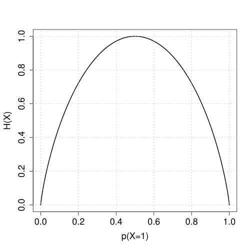{fig-align="center" width="50%"}

__Entropy__. The figure shows the entropy of a
 random variable $X=\left\{\mathtt{0, 1}\right\}$ representing
 Bernoulli process such as a coin toss for different values of
 $p(X=1)$. Maximum entropy is achieved if $p(\mathtt{0}) =
 p(\mathtt{1}) = 0.5$, i.e., for a uniform distribution. The minimum
 entropy of zero occurs if the probability of one of the two outcomes
 is 1.

 ## Entropy
 The function $IC(x) = -\log p(x)$ is a natural one for measuring information
content, for several reasons. 

*  If there is no uncertainty, i.e., if
$p(x=1)$, then $IC(x)= \log 1 = 0$. 
* On the other hand, the information
content can be arbitrarily large as the probability of an outcome goes
to arbitrary small quantities: $\lim_{x\rightarrow 0}\log x = \infty$.
* Say we have two random variables,
$X$ and $Y$, that are independent from one another. It is reasonable
to assume that the information content of the outcomes $x$ and $y$
must be additive. This is a natural consequence of the logarithm,
because

$$
IC(x,y) = -\log_2 (xy) = -\log_2 x - \log_2 y = IC(x) + IC(y)
$$

 

## Shannon's Entropy: The Uniqueness Theorem

Claude Shannon's definition of entropy is not arbitrary; it is the **only** function that satisfies three fundamental postulates.

::: {.callout-note icon=false}
## Theorem: Uniqueness of Entropy
Let $P = \{p_1, p_2, \dots, p_n\}$ be the probabilities of outcomes $\{x_1, x_2, \dots, x_n\}$, where $p_i \geq 0$ and $\sum p_i = 1$. A continuous function $H(P)$ satisfies the following:

1.  **Maximality**: $H$ is maximized when $p_i = \frac{1}{n}$ for all $i$ (uncertainty is highest when all outcomes are equally likely).
2.  **Additivity**: $H(AB) = H(A) + H_A(B)$. If $A$ and $B$ are independent, $H(AB) = H(A) + H(B)$.
3.  **Expandability**: $H(p_1, \dots, p_n) = H(p_1, \dots, p_n, 0)$ (adding an impossible event does not change entropy).

**Then $H$ must take the form:**
$$H(p_1, p_2, \dots, p_n) = \lambda \sum_{i=1}^n - p_i \log p_i$$
where $\lambda$ is a positive constant (usually $\lambda=1$).
:::

## Entropy

A proof of this theorem can be found in Khinchin's book^[Khinchin - Mathematical Foundations of Information Theory-Dover Publications (1957)]. It can also be shown that $\lambda=1$ if
$\log_2$ is used.

::: {.callout-note icon=false}
  Thus, we conclude that Equation~(\ref{eqn:appdx:IC})
provides a definition of information content that
satisfies several important intuitions about the properties that a
mathematical definition of information content should have.
:::

## Information Content in Gene Ontology (GO)

In the setting of GO, the probability of a term $t$ is the probability that a **randomly chosen protein** is annotated to that term.

* **The Root Term**: Assuming all genes are annotated to the root (the most general term):
    * $p(\text{root}) = 1$
    * $\text{IC}(\text{root}) = -\log_2(1) = 0$
* **General vs. Specific**: 
    * Terms used for many genes have **low** IC.
    * Terms used for very few genes have **high** IC.

::: {.callout-note}
This reflects "surprise": discovering a gene is annotated to the root is expected, while discovering a rare, specific annotation provides significant information.
:::

## IC: Numerical Examples

Assume we have a set of **256 annotated genes**:

| Genes Annotated to Term | Probability $p(t)$ | IC calculation ($-\log_2 p(t)$) | IC Value |
|:---|:---|:---|:---|
| 256 (All) | $256/256 = 1$ | $-\log_2(1)$ | **0** |
| 4 | $4/256$ | $-\log_2(4/256) = 8 - 2$ | **6** |
| 2 | $2/256$ | $-\log_2(2/256) = 8 - 1$ | **7** |
| 1 (Unique) | $1/256$ | $-\log_2(1/256)$ | **8** |

## Semantic Similarity ($t_1 \leftrightarrow t_2$)

Resnik defined similarity between two terms based on the **Information Content of their Most Specific Ancestor (MSA)**.

$$\text{IC}(t) = -\log p(t)$$

::: {.columns}

::: {.column width="50%"}
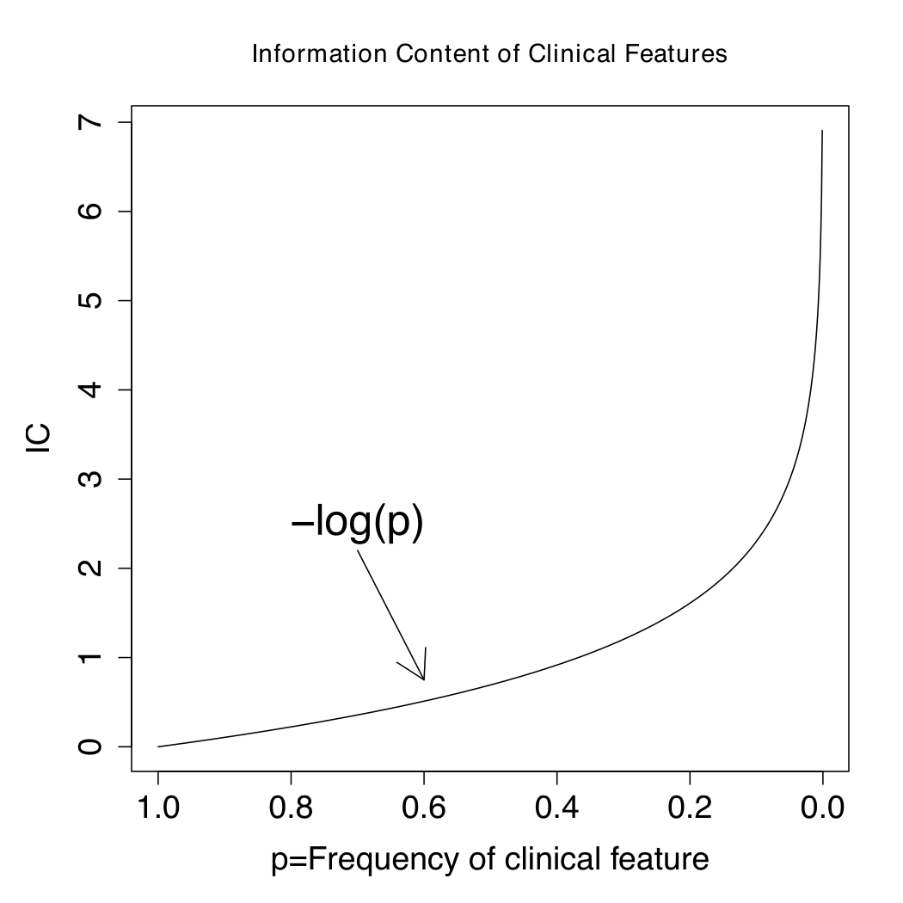{fig-align="center" width="90%"}
:::

::: {.column width="50%"}
### Resnik Similarity
The similarity is the IC of the most specific ancestor $a$ in the set of common ancestors $\mathcal{A}(t_1, t_2)$:

$$\mathrm{sim}(t_1, t_2) = \max_{a \in \mathcal{A}(t_1, t_2)} [-\log p(a)]$$

We refer to this as the **IC of the Most Specific Ancestor**: $\text{IC}(a')$.
:::

::::

## Semantic similarity: An example

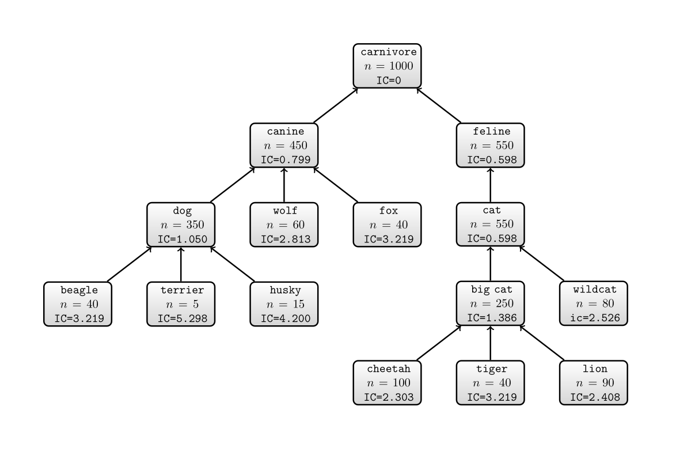{fig-align="center" width="90%"}

*  An ontology with annotated items

# Semantic similarity

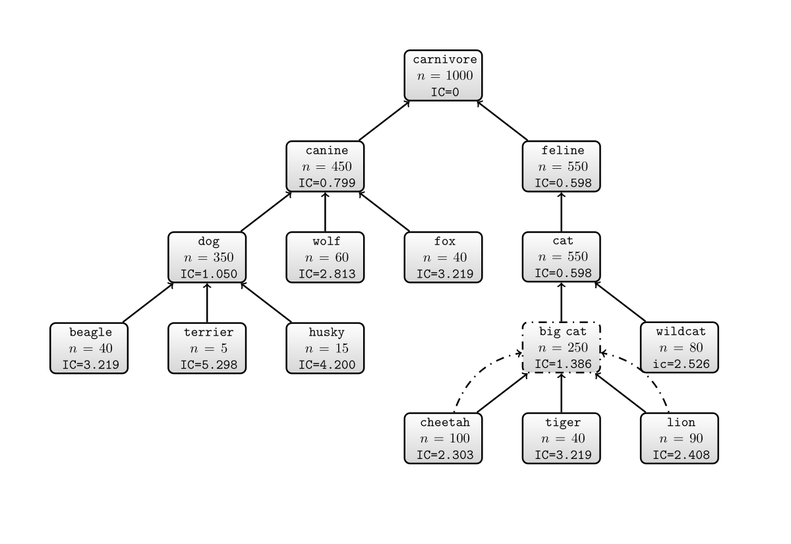{fig-align="center" width="90%"}

* `lion` and `cheetah` are similar

# Semantic similarity

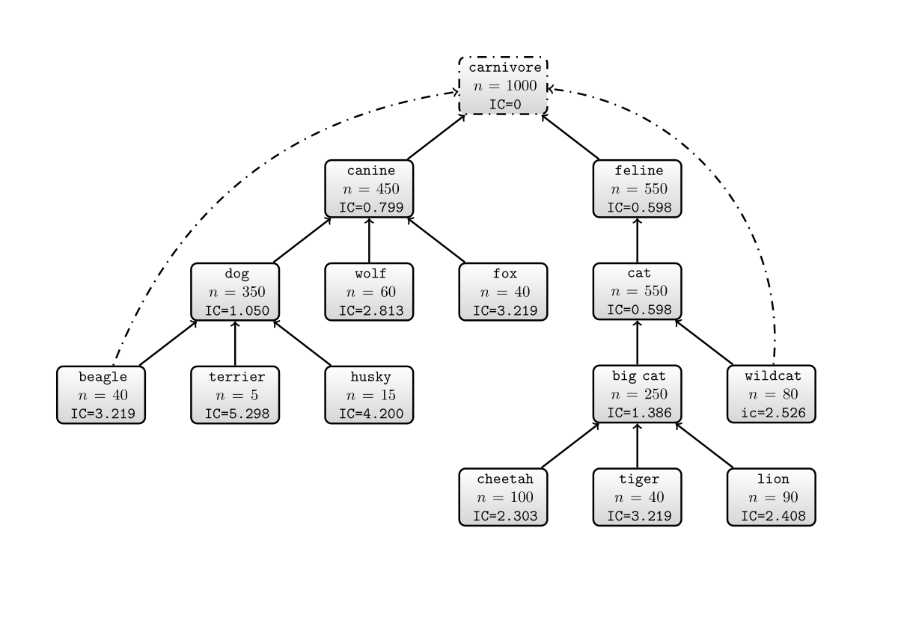{fig-align="center" width="90%"}

* `beagle` and `wildcat`  are not $\ldots$

# Semantic similarity between genes or diseases

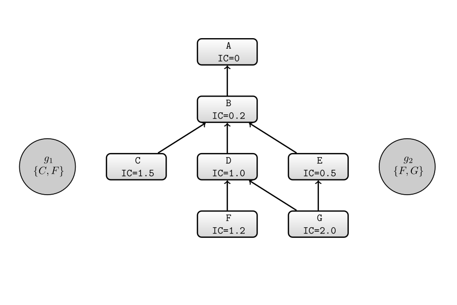{fig-align="center" width="90%"}

* similarity between gene $g_1$, which is  annotated to terms $C$ and $F$, and gene $g_2$, which is annotated
   to terms $F$ and $G$.

$$
\begin{eqnarray*}
\mathrm{sim}(g_1,g_2)& =&
 \displaystyle\frac{1}{|I_1|} \sum_{t_1\in I_1} \max_{t_2 \in I_2}
 \textnormal{sim}(t_1,t_2) \\
&=& \dfrac{1}{2} \left[ \mathrm{IC}(B) + \mathrm{IC}(F) \right] = 0.7
 \label{eqn:resnik.avg.max}
\end{eqnarray*}
$$

# Bioinformatics

*  Since the beginnings of the field of Bioinformatics in the 1960s, a central theme has been 
the development of algorithms that calculate similarity scores between biological entities and use 
them to rank lists

::: {.columns}
::: {.column width="50%"}

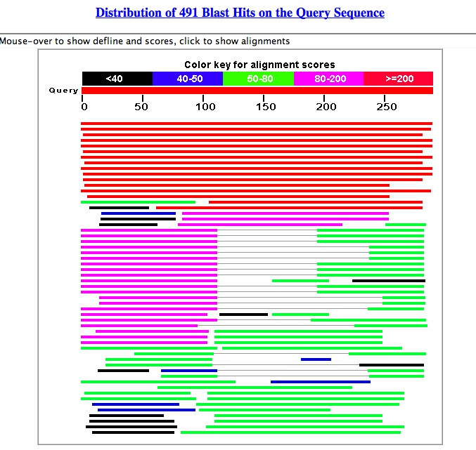{fig-align="center" width=80%"}

* BLAST: Find and rank homologous sequences

:::
::: {.column width="50%"}

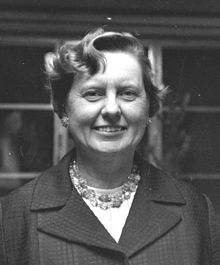{fig-align="center" width="70%"}

* Margaret Dayhoff, originator of PAM matrices

:::
:::

## Bioinformatics for Medicine?

* How exactly do we calculate the similarity between diseases, symptoms, patients, and more?

::: {layout="[[1,1], [1,1]]"}
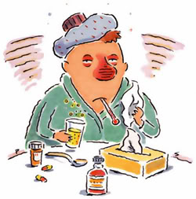{width="50%"}

{width="50%"}

{width="50%"}

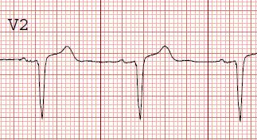{width="50%"}
:::

# What's The Problem?

*  Phenotypic descriptions that are very evocative for humans:
  - myopathic electromyography
  - still walking 25 years after onset
* The following descriptions mean the same thing to you: `generalized amyotrophy`, 
`generalized muscle atrophy`, `muscular atrophy, generalized`,
(etc)
* Many publications have little^[or none at all] information about the actual phenotypic features seen in patients with particular diseases and variants
* Databases cannot talk to one another about phenotypes

# A tale of two footballs
$$
\begin{equation*}
\mbox{American Football} = \mbox{Football} \neq
\mbox{Football} = \mbox{European Football} = \mbox{Soccer}
\end{equation*}
$$

::: {.columns}
::: {.column width="50%"}

{width="30%"}

A football $\ldots$^[When you see ``football'', your computer sees: 
0100011001101111011011110111010001100010011000010110110001101100]

::: 
::: {.column width="50%"}

{width="30%"}

A football $\ldots$
::: 
::: 

# A tale of two fibrillations
$$
\begin{equation*}
\mbox{muscle fibrillation} = \mbox{fibrillation} \neq
\mbox{fibrillation} = \mbox{ventricular fibrillation}
\end{equation*}
$$

::: {.columns}
::: {.column width="50%"}

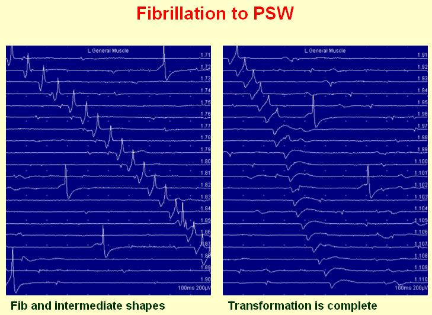{width="30%"}

fibrillation $\ldots$

::: 
::: {.column width="50%"}

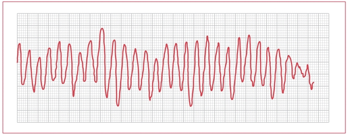{width="30%"}

fibrillation $\ldots$
:::
:::

When you see  ``fibrillation'', your computer sees: 
011001100110100101100010011100100110100101101100011011000110000101110100011010010110111101101110

## What is an Ontology?

:::: {layout="[30, 5, 30, 5, 30]"}

### Philosophy
{width="2.8cm"}

# $\rightarrow$
 

### Artificial Intelligence
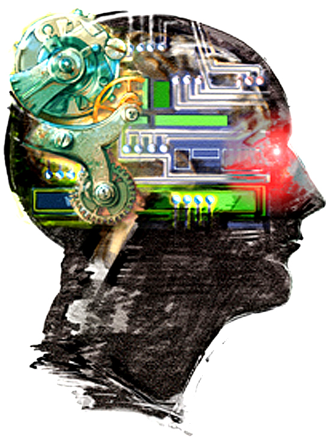{width="2.8cm"}

# $\rightarrow$
 

### Biomedical Research
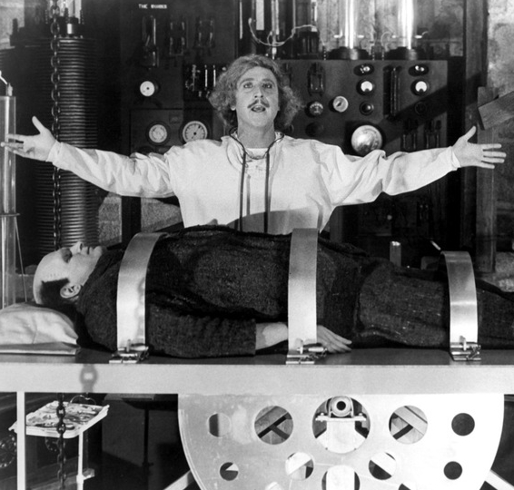{width="3cm"}

::::

## What is an Ontology?

::: {style="text-align: right; font-size: 0.7em;"}
"An ontology is a specification of a conceptualization."  
**Tom Gruber, 1993**
:::

### The Ontology Spectrum

To understand what an ontology is, we can view it as a progression of increasing semantic complexity:

| | | | | | | | | |
|:-:|:-:|:-:|:-:|:-:|:-:|:-:|:-:|:-:|
| Catalog | | Thesaurus | | Instances | | Value Restrictions | | Formal Relations |
| $\uparrow$ | | $\uparrow$ | | $\uparrow$ | | $\uparrow$ | | $\uparrow$ |
| ● | —— | ● | —— | ● | —— | ● | —— | ● $\rightarrow$ |
| | $\downarrow$ | | $\downarrow$ | | $\downarrow$ | | $\downarrow$ | |
| | Glossary | | Subclassing | | Properties | | Logical Constraints | |

::: {.callout-tip}
## Evolution of Complexity
As we move from left to right, we move from simple **lists of terms** (Catalog/Glossary) to **hierarchical relationships** (Thesaurus/Subclassing) and finally to **formal logic** (Restrictions/Constraints).
:::

## What is a phenotype ontology?

::: {.callout-note appearance="simple"}
### Core Purpose
Precise language (and thinking), interoperability, and improved database models to reliably capture and interpret phenotype information.
:::

* A **medical** phenotype ontology describes the individual manifestations of diseases:

    1. Signs
    2. Symptoms
    3. Laboratory findings
    4. Imaging studies
    5. *etc.*

::: {style="font-size: 0.45em; margin-top: 50px;"}
Robinson PN, Webber C (2014) Phenotype ontologies and cross-species analysis for translational research. *PLoS Genet* **10**:e1004268.
:::

# Deep Phenotyping
The precise and comprehensive analysis of phenotypic abnormalities.

- Individual components of the phenotype are observed and described using a controlled vocabulary.
- Deep phenotyping information is critical for:
- Computational differential diagnostic tools.
- Genotype-phenotype correlation.
- Scientific examination of human disease.

::: {style="font-size: 0.45em; margin-top: 50px;"}
PN Robinson (2012) Deep phenotyping for precision medicine. *Hum Mutat* __33__: 777–780. Special Issue of Human Mutation on Deep Phenotyping
:::

# Ontologies for Medical Bioinformatics

::: {.callout-note appearance="simple"}
### Core Purpose
 Ontologies have two major (interrelated) __use cases__
:::

- Interoperability between databases
- Foundation for algorithms and computational tools

# Ontologies: Interoperability
 
::: {.columns}
::: {.column width="50%"}

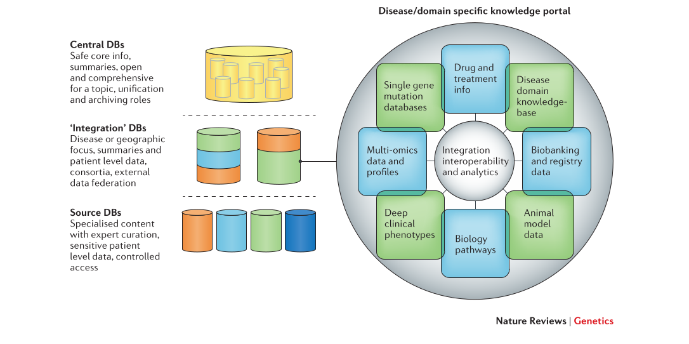
                

:::
::: {.column width="50%"}

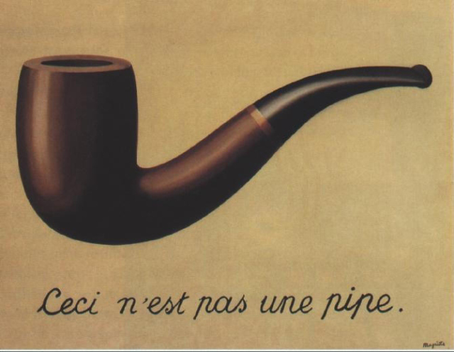{width="50%"}

:::
:::

* Human genetics is becoming a data-driven science
* Global Alliance for Genomics and Health (GA4GH) and other groups are
defining standards to exchange and integrate information between databases
across the globe
** This is particularly difficult for __clinical data__!^[Brookes and Robinson (2015) Human genotype-phenotype databases: aims,
challenges and
opportunities, *Nature Reviews Genetics* __16__:702-15]

# Interoperability: What's the problem?

- Phenotypic descriptions that are very evocative for
humans^[Unfortunately computers, being significantly dumber than humans, don't quite ``get'' it...]:
    - myopathic electromyography
    - still walking 25 years after onset
\end{itemize}
* The following descriptions mean the same thing to you: `generalized amyotrophy`, 
`generalized muscle atrophy`, `muscular atrophy, generalized`,
(etc)
* Many publications have little^[or none at all] information about the actual phenotypic features seen in patients with particular diseases and variants
* Databases cannot talk to one another about phenotypes

- [Todo: Mainly duplicated from above)]{.neon-todo}

{width="50%"}

## Ontologies: Interoperability

::: {.callout-note appearance="simple"}
An ontology provides a **standardised "Term"** for each entity in its domain that can be used for data exchange.
:::

| Field | Description |
|:---|:---|
| **ID** | HP:0000256 |
| **Name** | Macrocephaly |
| **Definition** | Occipitofrontal (head) circumference greater than 97th centile compared to appropriate, age matched, sex-matched normal standards. Alternatively, an apparently increased size of the cranium. |
| **Synonyms** | Large head, big head, large cranium, large calvaria, Increased head circumference, ... |
| **Xrefs** | MeSH:D058627, UMLS:C0221355, SNOMED CT:19410003, ICHPT:T0028, EoM:1d53660e657259f0, ... |
| **Translations** | 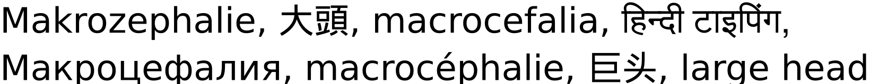{width="60%"} |

## Ontologies as Computational Tools

::: {.callout-note appearance="simple"}
Ontologies are used for myriad applications in biomedical research and translational applications. The greatest common denominator is: **Compute over human knowledge!**
:::

:::: {.columns}

::: {.column width="60%"}
### Applications
::: {.small}
* Functional profiling in high-throughput experiments
* Network biology
* Model, reason and manage complex data systems (e.g., IBM Watson)
* Natural Language Processing
* *et cetera*
:::
:::

::: {.column width="40%"}
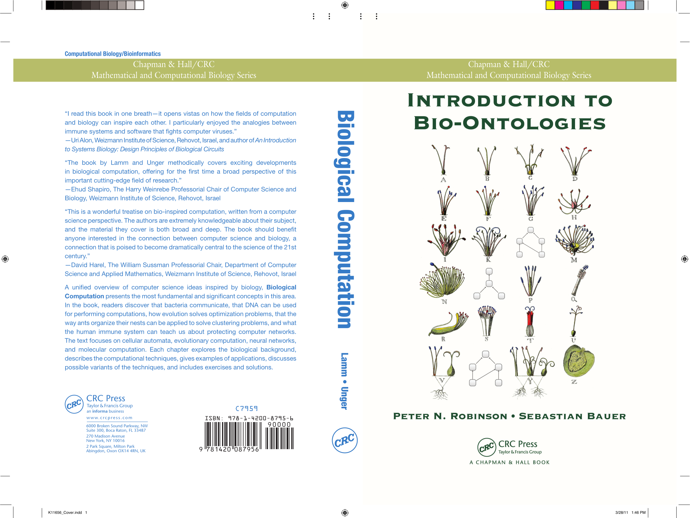{fig-align="center" width="80%"}
:::

::::

**Today**: I will present some of the methods we have developed to use HPO to empower genomic diagnostics.

## Ontology-Driven Representation of Biomedical Data

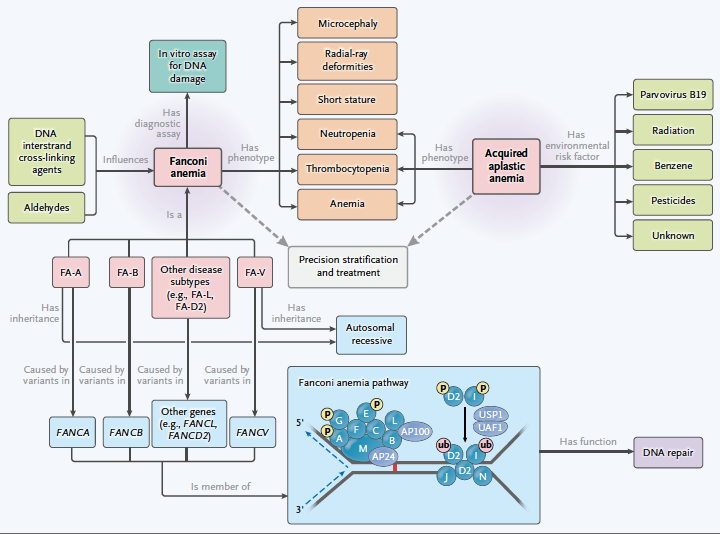{fig-align="center" width="75%"}

::: {style="font-size: 0.4em; line-height: 0.9; margin-top: 20px;"}
Haendel, Chute, Robinson (2018) Classification, Ontology, and Precision Medicine.  
*N Eng J Med* **379**:1452-1462
:::

## The Human Phenotype Ontology

:::: {.columns}

::: {.column width="60%"}
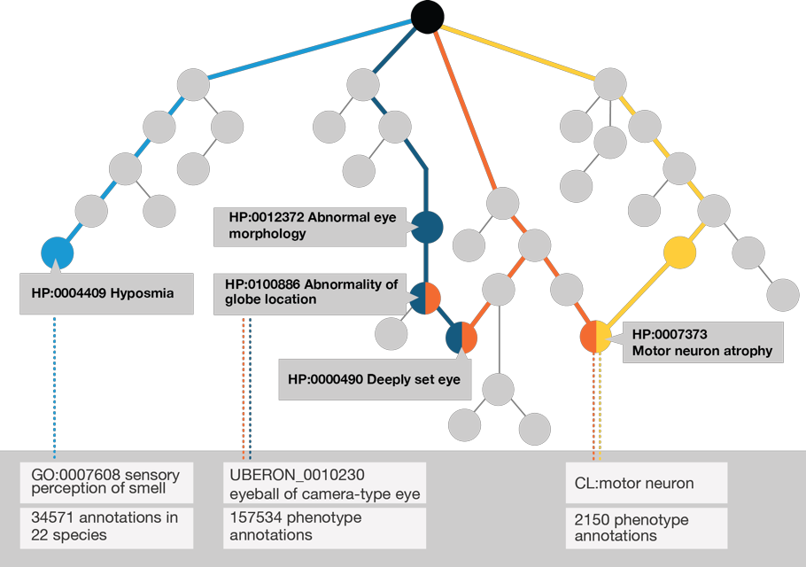{fig-align="center" width="100%" style="background-color: white; border: 1px solid #ddd;"}
:::

::: {.column width="40%"}
::: {style="font-size: 0.35em; line-height: 0.9;"}
Robinson Am J Hum Genet 2008  
Köhler Am J Hum Genet 2009  
Robinson Clin Genet. 2010  
Schulz BMC Bioinformatics. 2011  
Köhler Hum Mutat. 2012  
Bauer Bioinformatics 2012  
Köhler Nucleic Acids Res 2014  
Köhler J Med Genet 2014  
Zemojtel Sci Transl Med. 2014  
Robinson PLoS Genet. 2014  
Robinson Genome Res. 2014  
Groza Am J Hum Genet 2015  
Groza Database (Oxford). 2015  
Smedley Nat Protoc 2015  
Smedley Genome Med. 2015  
Smedley Am J Hum Genet. 2016  
Köhler Nucleic Acids Res 2017  
Vasilevsky Nat Genet 2018  
Köhler Nucleic Acids Res 2019  
Köhler Curr Protoc Hum Genet. 2019  
Carmody Orphanet J Rare Dis. 2020  
Köhler Nucleic Acids Res 2021  
Dhombres Am J Med Genet C 2022  
Gargano Nucleic Acids Res 2024
:::
:::

::::

::: {.small style="margin-top: -10px;"}
* **16,908 terms**
* 244,440 annotations for **8,223 monogenic or chromosomal diseases**
* 132,006 annotations for **~3,145 common diseases**
* [http://www.human-phenotype-ontology.org](http://www.human-phenotype-ontology.org)
:::

## Phenotypic Similarity Algorithms

::: {.callout-note appearance="simple"}
**Goal**: Calculate a similarity between a set of query terms and computational disease models.
:::

:::: {.columns}

::: {.column width="33%"}
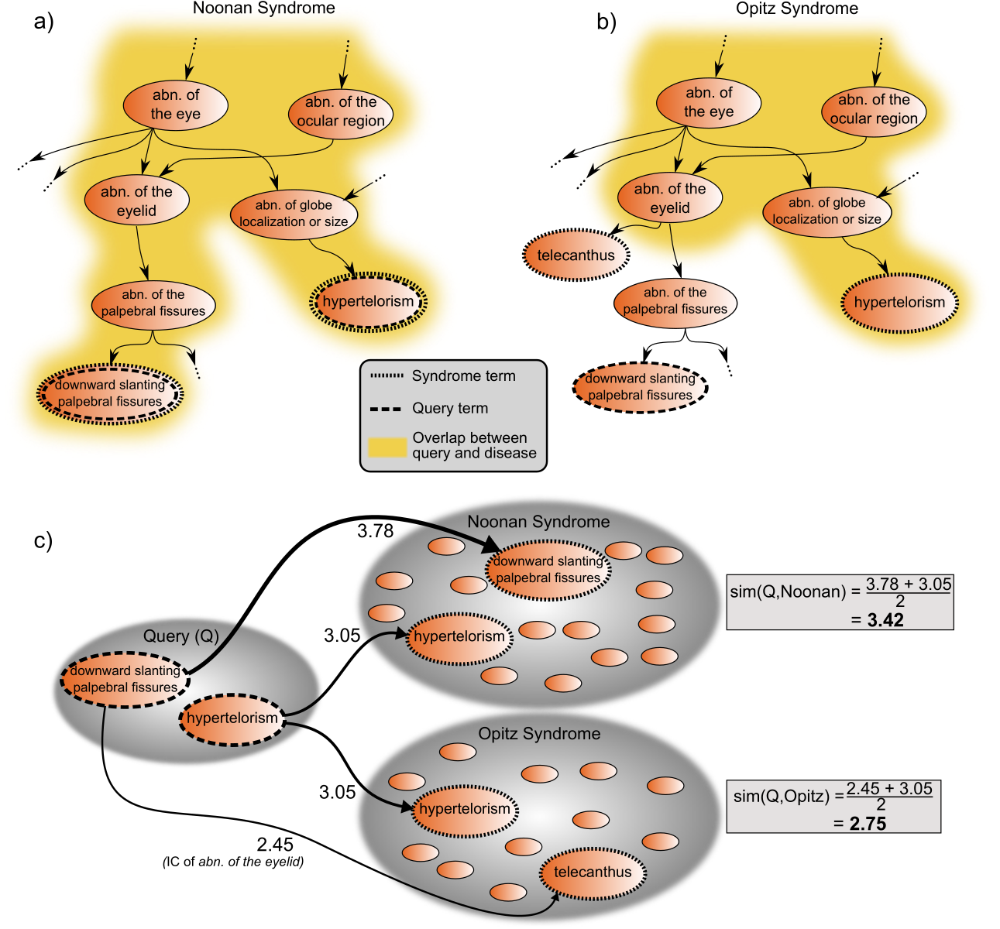{width="100%"}
**Phenomizer** ::: {style="font-size: 0.35em;"}
Köhler et al. (2009)  
*Am J Hum Genet* **85**:457-64
:::
:::

::: {.column width="33%"}
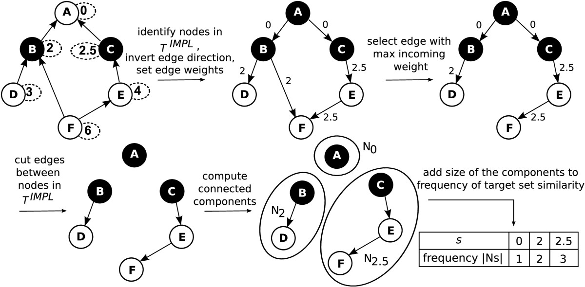{width="100%"}
**Exact Score Distribution** ::: {style="font-size: 0.35em;"}
Schulz MH et al (2011)  
*BMC Bioinformatics* **12**:441
:::
:::

::: {.column width="33%"}
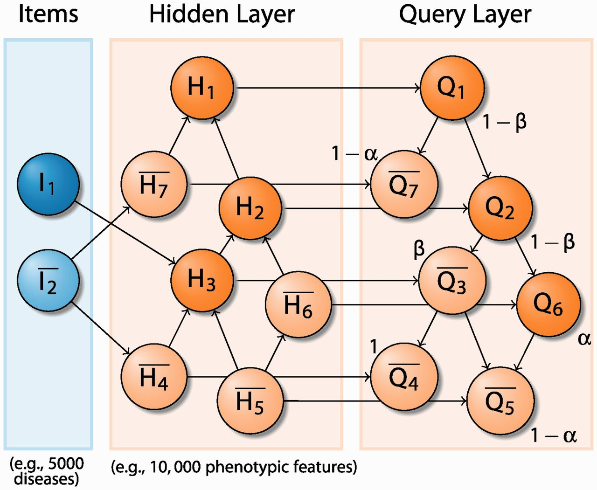{width="100%"}
**BOQA** ::: {style="font-size: 0.35em;"}
Bauer et al. (2012)  
*Bioinformatics* **28**:2502-8
:::
:::

::::

::: {.small}
* I will not go into detail on the computational methods today.
* Instead, I will explain the intuition behind the Phenomizer and then show how to use these algorithms for translational genomics.
:::

---

## Ontological Diagnostics

{fig-align="center" width="50%"}

$$\text{sim}(\color{orange}{Q} \rightarrow \color{blue}{d}) = \text{avg} \left[ \sum_{s \in \color{orange}{Q}} \max_{t \in \color{blue}{d}} \text{sim}(s,t) \right]$$

::: {layout-ncol=2}
::: {.card}
[$\color{orange}{Q}$: Query terms]{style="border: 1px solid #ccc; padding: 10px;"}
:::

::: {.card}
[$\color{blue}{d}$: Disease terms]{style="border: 1px solid #ccc; padding: 10px;"}
:::
:::

---

## Semantic Matching

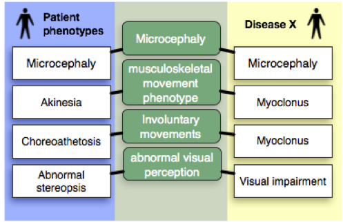{fig-align="center" height="60%"}

* Basic idea of ontological search: **Do not need exact match!**
* **Semantically similar** diseases score well by traversing the ontology structure.

---

## The Phenomizer

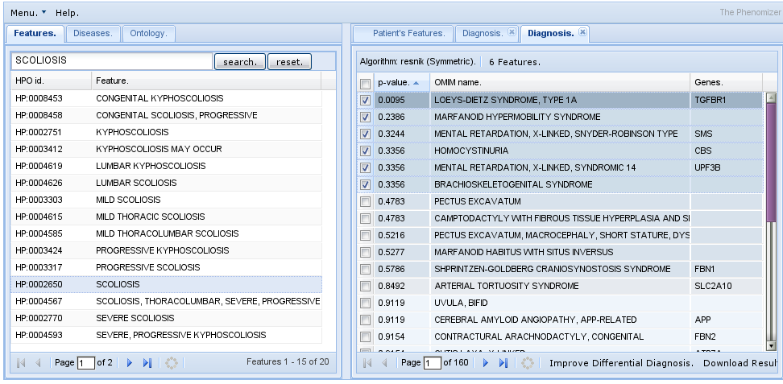{fig-align="center" height="60%"}

::: {style="font-size: 0.45em;"}
* Sebastian Köhler et al. (2009) Clinical Diagnostics with Semantic Similarity Searches in Ontologies. *Am J Hum Genet*, **85**:457--64.
:::

[**http://compbio.charite.de/Phenomizer**](http://compbio.charite.de/Phenomizer)

## TODO

- [Todo: add more recent slides about Exomiser, LIRICAL etc. Also Phenopackets, GPSEA]{.neon-todo}