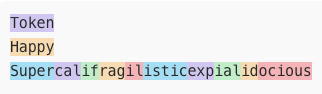

## Definition
Tokenization refers to the process of converting a sequence of text into smaller parts, known as tokens. These tokens can be as small as characters or as long as words. 

- Word tokenization:  breaks text down into individual words
- Character tokenization:  breaks text down into individual characters
- Subword tokenization: breaks text into units that might be larger than a single character but smaller than a full word. 

## Example

```{python}
#| label: fig-polar
#| fig-cap: "coding tokens as embeddings"
#| fig-height: 2
import matplotlib.pyplot as plt
import matplotlib.patches as patches

# Data Setup
input_text = ["[CLS]", "I", "love", "to", "code", ".", "[SEP]"]
token_ids = [101, 2023, 2003, 1037, 7953, 1012, 102]
# Simulated embedding vectors (first 3 dimensions)
embeddings = [
    [0.03, -0.01, -0.02], [0.05, 0.01, 0.00], [-0.04, -0.02, -0.02],
    [0.01, -0.00, -0.04], [0.00, 0.00, -0.33], [0.01, -0.42, -0.71], [-0.07, 0.02, -0.03]
]

fig, ax = plt.subplots(figsize=(12, 6))
ax.set_xlim(0, 10)
ax.set_ylim(0, 10)
ax.axis('off')

# 1. Draw Tokenization Row
ax.text(0.5, 10, "I love to code.", fontsize=16, fontweight='bold')
ax.text(0.5, 8.1, "Tokenization", fontsize=16, fontweight='bold')
for i, (txt, tid) in enumerate(zip(input_text, token_ids)):
    x_pos = 1 + i*1.2
    # Text box
    ax.add_patch(patches.FancyBboxPatch((x_pos, 7), 1, 0.8, boxstyle="round,pad=0.1", fc="#fbe5c6", ec="gray"))
    ax.text(x_pos+0.5, 7.4, txt, ha='center', fontsize=11)
    # ID box
    ax.add_patch(patches.Rectangle((x_pos, 6.2), 1, 0.8, fc="#fff2cc", ec="gray"))
    ax.text(x_pos+0.5, 6.6, str(tid), ha='center', fontsize=11)

# 2. Draw Transition Arrow
ax.annotate('', xy=(5, 4.5), xytext=(5, 6), arrowprops=dict(facecolor='black', shrink=0.05, width=2))

# 3. Draw Embeddings Row
ax.text(0.5, 3.7, "Embeddings", fontsize=16, fontweight='bold')
for i, vec in enumerate(embeddings):
    x_pos = 1 + i*1.2
    ax.add_patch(patches.Rectangle((x_pos, 1), 1, 2.5, fc="#fbe5c6", ec="gray"))
    for j, val in enumerate(vec):
        ax.text(x_pos+0.5, 3 - j*0.6, f"{val:.4f}", ha='center', fontsize=9)
    ax.text(x_pos+0.5, 1.2, "...", ha='center')

plt.tight_layout()
plt.show()

import numpy as np
import matplotlib.pyplot as plt

r = np.arange(0, 2, 0.01)
theta = 2 * np.pi * r
fig, ax = plt.subplots(
  subplot_kw = {'projection': 'polar'} 
)
ax.plot(theta, r)
ax.set_rticks([0.5, 1, 1.5, 2])
ax.grid(True)
plt.show()
```


## The Embedding Mapping

The embedding process transforms discrete tokens into a continuous vector space $\mathcal{V} \to \mathbb{R}^d$.

\begin{equation}
\mathbf{e}_i = \text{embed}(w_i) = \mathbf{x}_i^\top \mathbf{W}_e
\end{equation}

Where:

:::: {.columns}

::: {.column width="60%"}
- **One-hot vector**: $\mathbf{x}_i \in \{0,1\}^V$, where $V$ is the vocabulary size.
- **Weight Matrix**: $\mathbf{W}_e \in \mathbb{R}^{V \times d}$ contains the learnable parameters.
* **Projection**: The result $\mathbf{e}_i$ is the $i$-th row of the matrix $\mathbf{W}_e$.
:::
::: {.column width="40%"}
$$
\mathbf{W}_e = \begin{bmatrix} 
\leftarrow & \mathbf{e}_0 & \rightarrow \\
\leftarrow & \mathbf{e}_1 & \rightarrow \\
 & \vdots & \\
\leftarrow & \mathbf{e}_{V-1} & \rightarrow 
\end{bmatrix}
$$
:::
::::


## Embeddings {.nonincremental}


- $\mathbf{x}_i^\top \mathbf{W}_e$ just picks out the $i^{th}$ row of $\mathbf{W}_e$.

The dimension of the embeddings is adjustable. For instance, SBERT has embeddings with a dimension of 768.

## Tokens

{#fig-tokens width=80% fig-align="center"}

