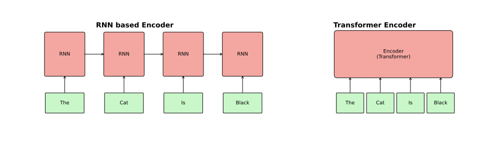

## Overview: Lecture 1

::: {.callout-note}
## Game plan
This lecture is the first of ??? about the transformer algorithm and selected applications. We will start with a top-level overview to provide some context and will then explain the mathematics of each section in detail. The practical sessions will involve the coding of a "toy" LLM.
:::

::: {.columns}

::: {.column width="33%"}
### Lecture 1
**Foundations**

* Top-level overview
* Embeddings
* Positional encodings
:::

::: {.column .dimmed width="33%"}
### Lecture 2
**Architecture**

* Multi-Head Attention
* Residual Connections
* Layer Norm
:::

::: {.column .dimmed width="33%"}
### Lecture 3
**Applications**

* Training & Data
* Fine-tuning
* Toy LLM Coding
:::

:::

---

## Section 1: Tokenization and Embeddings {visibility="uncounted"}

::: {.columns}

::: {.column width="45%"}
::: {.hl-container}
{width="100%"}

::: {.hl-box style="top: 81%; left: 10%; width: 35%; height: 4.5%;"}
:::
:::
:::

::: {.column width="55%"}
::: {.toc-list style="margin-top: 50px;"}

::: {.toc-item .toc-active}
1. Tokenization and Embeddings
:::

::: {.toc-item}
2. Positional Encodings
:::

::: {.toc-item}
3. Multi-head attention
   <br><span style="font-size: 0.6em; font-weight: normal; color: #666;">
   • Todo<br>
   • Todo (ReLU/GELU)
   </span>
:::


:::
:::

:::

---

## Tokenization 

::: {.callout-note}
## Definition
 the process of converting a sequence of text into smaller parts, known as tokens. These tokens can be as small as characters or as long as words. 
:::


::: {.token-table}

| Tokenization Method | Example | Granularity | Pros | Cons |
|:---|:---|:---|:---|:---|
| **Word** | Full words | ["Machine", "learning"] | High semantic clarity | Massive vocabulary; fails on "unknown" words |
| **Subword** | Meaningful chunks | ["ma", "chine", "learn", "ing"] | Handles new words well | Slightly more complex to implement |
| **Character** | Individual letters | ["m", "a", "c", "h", "i", "n", "e", "l", "r", "g"] |  Tiny vocabulary; no "unknown" words | Loses semantic meaning; very long sequences |

:::
## Tokens

Tokenization by Open-AI 

{#fig-tokens width=80% fig-align="center"}

## Tokens are then converted to embeddings

```{python}
#| label: fig-polar
#| fig-cap: "coding tokens as embeddings"
#| fig-height: 2
import matplotlib.pyplot as plt
import matplotlib.patches as patches

# Data Setup
input_text = ["[CLS]", "I", "love", "to", "code", ".", "[SEP]"]
token_ids = [101, 2023, 2003, 1037, 7953, 1012, 102]
# Simulated embedding vectors (first 3 dimensions)
embeddings = [
    [0.03, -0.01, -0.02], [0.05, 0.01, 0.00], [-0.04, -0.02, -0.02],
    [0.01, -0.00, -0.04], [0.00, 0.00, -0.33], [0.01, -0.42, -0.71], [-0.07, 0.02, -0.03]
]

fig, ax = plt.subplots(figsize=(12, 6))
ax.set_xlim(0, 10)
ax.set_ylim(0, 10)
ax.axis('off')

# 1. Draw Tokenization Row
ax.text(0.5, 10, "I love to code.", fontsize=16, fontweight='bold')
ax.text(0.5, 8.1, "Tokenization", fontsize=16, fontweight='bold')
for i, (txt, tid) in enumerate(zip(input_text, token_ids)):
    x_pos = 1 + i*1.2
    # Text box
    ax.add_patch(patches.FancyBboxPatch((x_pos, 7), 1, 0.8, boxstyle="round,pad=0.1", fc="#fbe5c6", ec="gray"))
    ax.text(x_pos+0.5, 7.4, txt, ha='center', fontsize=11)
    # ID box
    ax.add_patch(patches.Rectangle((x_pos, 6.2), 1, 0.8, fc="#fff2cc", ec="gray"))
    ax.text(x_pos+0.5, 6.6, str(tid), ha='center', fontsize=11)

# 2. Draw Transition Arrow
ax.annotate('', xy=(5, 4.5), xytext=(5, 6), arrowprops=dict(facecolor='black', shrink=0.05, width=2))

# 3. Draw Embeddings Row
ax.text(0.5, 3.7, "Embeddings", fontsize=16, fontweight='bold')
for i, vec in enumerate(embeddings):
    x_pos = 1 + i*1.2
    ax.add_patch(patches.Rectangle((x_pos, 1), 1, 2.5, fc="#fbe5c6", ec="gray"))
    for j, val in enumerate(vec):
        ax.text(x_pos+0.5, 3 - j*0.6, f"{val:.4f}", ha='center', fontsize=9)
    ax.text(x_pos+0.5, 1.2, "...", ha='center')

plt.tight_layout()
plt.show()

import numpy as np
import matplotlib.pyplot as plt

r = np.arange(0, 2, 0.01)
theta = 2 * np.pi * r
fig, ax = plt.subplots(
  subplot_kw = {'projection': 'polar'} 
)
ax.plot(theta, r)
ax.set_rticks([0.5, 1, 1.5, 2])
ax.grid(True)
plt.show()
```


## The Embedding Mapping

The embedding process transforms discrete tokens into a continuous vector space $\mathcal{V} \to \mathbb{R}^d$.

\begin{equation}
\mathbf{e}_i = \text{embed}(w_i) = \mathbf{x}_i^\top \mathbf{W}_e
\end{equation}

Where:

:::: {.columns}

::: {.column width="60%"}
- **One-hot vector**: $\mathbf{x}_i \in \{0,1\}^V$, where $V$ is the vocabulary size.
- **Weight Matrix**: $\mathbf{W}_e \in \mathbb{R}^{V \times d}$ contains the learnable parameters.
* **Projection**: The result $\mathbf{e}_i$ is the $i$-th row of the matrix $\mathbf{W}_e$.
:::
::: {.column width="40%"}
$$
\mathbf{W}_e = \begin{bmatrix} 
\leftarrow & \mathbf{e}_0 & \rightarrow \\
\leftarrow & \mathbf{e}_1 & \rightarrow \\
 & \vdots & \\
\leftarrow & \mathbf{e}_{V-1} & \rightarrow 
\end{bmatrix}
$$
:::
::::


## Embeddings {.nonincremental}


- $\mathbf{x}_i^\top \mathbf{W}_e$ just picks out the $i^{th}$ row of $\mathbf{W}_e$.

- The dimension of the embeddings is adjustable. For instance, SBERT has embeddings with a dimension of 768.

- The embedding matrix is initialized to random values and learned during training by back-propagation

- [Todo: explain learning procedure (or refer to previous slides)]{.neon-todo}


---

## Section 2: Positional Encodings {visibility="uncounted"}

::: {.columns}

::: {.column width="45%"}
::: {.hl-container}
{width="100%"}

::: {.hl-box style="top: 72.5%; left: -2%; width: 23%; height: 7.5%;"}
:::
:::
:::

::: {.column width="55%"}
::: {.toc-list style="margin-top: 50px;"}

::: {.toc-item }
1. Tokenization and Embeddings
:::

::: {.toc-item .toc-active}
2. Positional Encodings
:::

::: {.toc-item}
3. Multi-head attention
   <br><span style="font-size: 0.6em; font-weight: normal; color: #666;">
   • Todo<br>
   • Todo (ReLU/GELU)
   </span>
:::


:::
:::

:::

## RNNs vs Encoders


- Recurrent neural networks process one token at a time (serial), which transformer-based encoders process an entire sequence of tokens at once (parallel).
- Positional encodings are needed for the encoder to keep track of the relative and absolute positions of tokens
- [Todo: explain RNNs/exploding gradients in previous lecture]{.neon-todo}

{#fig-rnn-vs-transform width=80% fig-align="center"}

## Positional information
- Transformers process entire sequence in parallel
- They lack inherent information about the positions of tokens
- Positional encodings are added to embeddings to provide position information
- Example for sentence, "I am an automaton" we have four embedding vectors: $\left[E_{\mathrm{I}}, E_{\mathrm{am}}, E_{\mathrm{an}}, E_{\mathrm{automaton}}\right]$
- We calculate four position encodings $\left[P_0,P_1,P_2,P_3\right]$
- These are then combined by elementwise addition:

$$
\left[E_{\mathrm{I}}+P_0, E_{\mathrm{am}}+P_1,E_{\mathrm{an}}+P_2, E_{\mathrm{automaton}}+P_3\right]
$$

## Calculating positional encodings (PEs)

For even indices (e.g., $i=0,2,4,\ldots$):

$$
\mathrm{PE}(pos,2i) = \sin\left(\dfrac{pos}{100^{\frac{2i}{d}}}\right)
$$

and for odd indices (e.g., $i=1,3,5,\ldots$):

$$
\mathrm{PE}(pos,2i+1) = \cos\left(\dfrac{pos}{100^{\frac{2i}{d}}}\right)
$$
Note that the $i$ in these equations is separate for even and odd...

## Understanding the PE Matrix (1)

A positional encoding has the same dimension as an embedding, and calculates a value for each dimension using the sine and cosine formulas.

::: {.small-table}
```{python}
#| echo: false
import pandas as pd
import numpy as np

tokens = ["I", "am", "an", "automaton"]
d_model = 4
n = 100
rows = []

for k in range(len(tokens)):
    row = [tokens[k], k]
    for j in range(d_model // 2):
        denom_val = n**(2 * j / d_model)
        denom_str = f"{int(denom_val)}" if denom_val == int(denom_val) else f"{denom_val:.0f}"
        sin_expr = f"sin({k}/{denom_str})"
        cos_expr = f"cos({k}/{denom_str})"
        sin_val = np.sin(k / denom_val)
        cos_val = np.cos(k / denom_val)

        row.append(f"{sin_expr} = <span style='color: #a52a2a;'><b>{sin_val:.2f}</b></span>")
        row.append(f"{cos_expr} = <span style='color: #a52a2a;'><b>{cos_val:.2f}</b></span>")
    rows.append(row)

headers = ["Sequence", "Index (k)"]
for j in range(d_model // 2):
    headers.extend([f"i={j} (sine)", f"i={j} (cosine)"])

df = pd.DataFrame(rows, columns=headers)

styled_df = df.style.set_properties(**{
    'text-align': 'left',
    'padding': '2px',
    'font-size': '0.5',
    'border': '1px solid #ddd',
    'line-height': '1.1'
}).set_table_styles([
    {'selector': 'th', 'props': [('background-color', '#f2f2f2'), ('font-weight', 'bold')]},
    {'selector': 'td:nth-child(1)', 'props': [('background-color', 'white'), ('font-weight', '500')]},
    {'selector': 'td:nth-child(2)', 'props': [('background-color', '#f9f9f9')]}
]).hide(axis="index")

styled_df
``` 
:::
::: {.slide-footer}
Note: $n=100$ is used for visualization; standard models typically use $n=10,000$.
:::

- dimension ($d$): 4 in this example, generally much larger (e.g., 768 for BERT)
- example: first word (position -- $k=0$)
  - $k=0, i=0 (\mathrm{even})$; $\mathrm{PE}(k,2i) = \sin\left(\frac{k}{100^{\frac{2i}{d}}}\right) = \sin\left(\frac{0}{100^{\frac{0}{4}}}\right) = \sin(0)=0$
  - $k=0, i=0 (\mathrm{odd})$; $\mathrm{PE}(k,2i+1) = \cos\left(\frac{k}{100^{\frac{2i}{d}}}\right) = \cos\left(\frac{0}{100^{\frac{0}{4}}}\right) = \cos(0)= 1$
  - $k=0, i=1 (\mathrm{even})$; $\mathrm{PE}(k,2i) = \sin\left(\frac{k}{100^{\frac{2i}{d}}}\right) = \sin\left(\frac{0}{100^{\frac{2}{4}}}\right) =\sin(0)=0$
  - $k=0, i=1 (\mathrm{odd})$; $\mathrm{PE}(k,2i+1) = \cos\left(\frac{k}{100^{\frac{2i}{d}}}\right) = \cos\left(\frac{0}{100^{\frac{2}{4}}}\right) = \cos(0)= 1$

## Understanding the PE Matrix (2)

A positional encoding has the same dimension as an embedding, and calculates a value for each dimension using the sine and cosine formulas.

::: {.small-table}
```{python}
#| echo: false
import pandas as pd
import numpy as np

tokens = ["I", "am", "an", "automaton"]
d_model = 4
n = 100
rows = []

for k in range(len(tokens)):
    row = [tokens[k], k]
    for j in range(d_model // 2):
        denom_val = n**(2 * j / d_model)
        denom_str = f"{int(denom_val)}" if denom_val == int(denom_val) else f"{denom_val:.0f}"
        sin_expr = f"sin({k}/{denom_str})"
        cos_expr = f"cos({k}/{denom_str})"
        sin_val = np.sin(k / denom_val)
        cos_val = np.cos(k / denom_val)

        row.append(f"{sin_expr} = <span style='color: #a52a2a;'><b>{sin_val:.2f}</b></span>")
        row.append(f"{cos_expr} = <span style='color: #a52a2a;'><b>{cos_val:.2f}</b></span>")
    rows.append(row)

headers = ["Sequence", "Index (k)"]
for j in range(d_model // 2):
    headers.extend([f"i={j} (sine)", f"i={j} (cosine)"])

df = pd.DataFrame(rows, columns=headers)

styled_df = df.style.set_properties(**{
    'text-align': 'left',
    'padding': '2px',
    'font-size': '0.5',
    'border': '1px solid #ddd',
    'line-height': '1.1'
}).set_table_styles([
    {'selector': 'th', 'props': [('background-color', '#f2f2f2'), ('font-weight', 'bold')]},
    {'selector': 'td:nth-child(1)', 'props': [('background-color', 'white'), ('font-weight', '500')]},
    {'selector': 'td:nth-child(2)', 'props': [('background-color', '#f9f9f9')]}
]).hide(axis="index")

styled_df
``` 
:::

- dimension ($d$): 4 in this example, generally much larger (e.g., 768 for BERT)
- example: second word (position -- $k=1$)
  - $k=1, i=0 (\mathrm{even})$; $\mathrm{PE}(k,2i) = \sin\left(\frac{k}{100^{\frac{2i}{d}}}\right) = \sin\left(\frac{1}{100^{\frac{0}{4}}}\right) = \sin(1)=0.8415$
  - $k=1, i=0 (\mathrm{odd})$; $\mathrm{PE}(k,2i+1) = \cos\left(\frac{k}{100^{\frac{2i}{d}}}\right) = \cos\left(\frac{1}{100^{\frac{0}{4}}}\right) = \cos(1)= 0.5403$
  - $k=1, i=1 (\mathrm{even})$; $\mathrm{PE}(k,2i) = \sin\left(\frac{k}{100^{\frac{2i}{d}}}\right) = \sin\left(\frac{1}{100^{\frac{2}{4}}}\right) =\sin(1/10)=0.0998$
  - $k=1, i=1 (\mathrm{odd})$; $\mathrm{PE}(k,2i+1) = \cos\left(\frac{k}{100^{\frac{2i}{d}}}\right) = \cos\left(\frac{1}{100^{\frac{2}{4}}}\right) = \cos(1/10)= 0.9950$

## Understanding the PE Matrix (3)

The denominator of the formula contains the "magic number" 10,000:
$$
\mathrm{PE}(k,2i) = \sin\left(\frac{k}{100^{\frac{2i}{d}}}\right) 
$$

- A heuristic choice made by the authors of the original "Attention Is All You Need" paper.^[Vaswani et al. (2017) 31st Conference on Neural Information Processing Systems (NIPS)]
- creates a geometric progression of "frequencies."
- At $i=0$ (Smallest wavelength): The denominator is $10000^0 = 1$. The wave oscillates very quickly.
- At $i = d_{model}/2$ (Largest wavelength): The denominator is $10000^1 = 10000$. The wave oscillates very slowly.


## Understanding the PE Matrix (4)
::: {.columns}
::: {.column width="60%"}
```{python}
#| echo: false
#| out-width: "70%"
#| fig-align: "center"
import matplotlib.pyplot as plt
import numpy as np

# Setup
n = 100
d_model = 8  # Supporting i=0, 1, 2, 3 (each i has sin/cos)
i_values = [0, 1, 2, 3]
colors = ['#1f77b4', '#a52a2a', '#2ca02c', '#9467bd']
pos = np.linspace(0, 10, 500) # Smooth line

fig, ax = plt.subplots(figsize=(10, 5), dpi=120)

for idx, i in enumerate(i_values):
    denom = n**(2 * i / d_model)
    y_sin = np.sin(pos / denom)
    
    # Plot Sin as solid, Cos as dashed
    ax.plot(pos, y_sin, color=colors[idx], lw=2, 
            label=f"i={i} (λ={denom:.1f})")
    # Optional: uncomment below if you want to show the cosine pairs too
    # ax.plot(pos, np.cos(pos / denom), color=colors[idx], lw=1.5, ls='--', alpha=0.4)

# Formatting
ax.set_title(f"Positional Encoding Frequencies (n={n}, d=8)", fontsize=14, pad=15)
ax.set_xlabel("Position Index (k)", fontsize=12)
ax.set_ylabel("Encoding Value", fontsize=12)
ax.set_ylim(-1.1, 1.1)
ax.grid(True, linestyle=':', alpha=0.6)
ax.axhline(0, color='black', lw=1, alpha=0.3)

# Add vertical markers for the first few integer positions (tokens)
for k in range(5):
    ax.axvline(x=k, color='gray', lw=1, ls='-', alpha=0.1)
    ax.text(k, -1.05, f"k={k}", ha='center', fontsize=9, color='gray')

ax.legend(title="Dimension Index", bbox_to_anchor=(1.05, 1), loc='upper left')
plt.tight_layout()
plt.show()
```
:::
::: {.column width="40%"}


- If the constant $n$ were too small (e.g., 50), the sine waves would repeat their cycles every 50 tokens. The model wouldn't be able to tell the difference between position 5 and position 55 because their encoding vectors would look identical.
- $n=10000$ ensures that for any sequence length a Transformer is likely to see (e.g., 512 to 8,192 tokens), every single position has a unique combination of high-frequency and low-frequency signals.
:::
:::

## Properties of the Positional Encoding (1)

::: {.callout-note icon=false}
## The Linearity Property (Relative Positioning)

For any fixed offset $\Delta k$, the encoding at a shifted position can be represented as a linear transformation of the original:

$$PE_{pos + \Delta k} = \mathbf{M}_{\Delta k} \cdot PE_{pos}$$

:::

To prove this, recall the  Angle Addition Formulas that specify how to compute trig functions of sums or differences of angles.

- $sin(\alpha + \beta) = \sin(\alpha)\cos(\beta)+\cos(\alpha)\sin(\beta)$
- $cos(\alpha + \beta) = \cos(\alpha)\cos(\beta)-\cos(\alpha)\cos(\beta)$

To prove that $PE_{pos+k}$ is a linear transformation of $PE_{pos}$, we need to show that there exists a fixed matrix $M_k$ (that only depends on the offset $k$, not the position $pos$) such that:
$$PE_{pos+k} = M_k \cdot PE_{pos}$$

## Properties of the Positional Encoding (2)

For any dimension $i$, the positional encoding is a pair of $(\sin, \cos)$ values. Let's define $\omega_i = \frac{1}{10000^{2i/d_{model}}}$ to simplify the notation.The encoding at position $pos$ is:
$$\begin{bmatrix} \sin(\omega_i \cdot pos) \\ \cos(\omega_i \cdot pos) \end{bmatrix}$$

We want to find the encoding at $pos + k$:
$$\sin(\omega_i(pos + k)) = \sin(\omega_i \cdot pos + \omega_i \cdot k)$$$$\cos(\omega_i(pos + k)) = \cos(\omega_i \cdot pos + \omega_i \cdot k)$$

Plugging into the Angle Addition Formulas:

$$\sin(\omega_i \cdot pos + \omega_i \cdot k) = \sin(\omega_i \cdot pos)\cos(\omega_i \cdot k) + \cos(\omega_i \cdot pos)\sin(\omega_i \cdot k)$$$$\cos(\omega_i \cdot pos + \omega_i \cdot k) = \cos(\omega_i \cdot pos)\cos(\omega_i \cdot k) - \sin(\omega_i \cdot pos)\sin(\omega_i \cdot k)$$


## Properties of the Positional Encoding (3)

Notice that the terms $\cos(\omega_i \cdot k)$ and $\sin(\omega_i \cdot k)$ are constants once we pick a fixed distance $k$. We can rewrite the equations above as a matrix multiplication:$$\begin{bmatrix} \sin(\omega_i(pos+k)) \\ \cos(\omega_i(pos+k)) \end{bmatrix} = \begin{bmatrix} \cos(\omega_i k) & \sin(\omega_i k) \\ -\sin(\omega_i k) & \cos(\omega_i k) \end{bmatrix} \begin{bmatrix} \sin(\omega_i pos) \\ \cos(\omega_i pos) \end{bmatrix}$$

The matrix $M_k=\begin{bmatrix} \sin(\omega_i(pos+k)) \\ \cos(\omega_i(pos+k)) \end{bmatrix}$ is a __rotation matrix__.

- The "rotation" required to move from position 2 to position 5 is the exact same rotation required to move from position 100 to 103.
- The neural network's attention layers can easily "learn" this rotation. It can learn to say: "To find the noun that usually appears 3 words after this adjective, I just need to apply the '3-step' rotation to my current query vector."

## Distance (1)


- In the Attention mechanism, the model calculates the similarity between tokens using a __dot product__. 
- Because of the way these waves overlap, the dot product between the encodings of two tokens decays as the distance between them increases
- When we add the positional vector ($P$) to the word embedding ($E$), the resulting vector is $X = E + P$.
- When the attention mechanism calculates the dot product between a Query ($Q$) and a Key ($K$) a combination of semantics (word embeddings) and location (positional encodings) is taken into account.
- To gain intuition, let's ignore the weight matrices $W_Q$ and $W_K$ for now.

## Distance (2)


- The dot product between two tokens at positions $i$ and $j$ looks like this:

$$X_i\cdot X_j = (E_i + P_i) \cdot (E_j + P_j)$$

This results in four distinct terms

1. $E_i \cdot E_j$ (Content-Content): How much the meaning of word $i$ relates to the meaning of word $j$.
2. $E_i \cdot P_j$ (Content-Position): Does word $i$ tend to look at position $j$? (e.g., "The" looking for a noun in the next slot).
3. $P_i \cdot E_j$ (Position-Content): Does position $i$ look for specific types of words?
4. $P_i \cdot P_j$ (Position-Position): Pure distance component.


## How the Model Separates "Meaning" from "Distance"?

- __High Dimensionality__: In a 512 or 1024-dimensional space, there is a lot of "room." The model can learn to use certain dimensions primarily for semantic meaning and other dimensions primarily for positional signal.^[Wang et al. (2018), "On the Dimensionality of Word Embeddings, (NeurIPS 2018)]

- __Learned Projections__: The weight matrices ($W_Q, W_K, W_V$) act as filters.^[We will look closely at these matrices later on] Through training, the model learns to project the "summed" vector into a subspace where the positional information is amplified when it needs to know distance, and the semantic information is amplified when it needs to know meaning. 

- The cross-terms (like $E_{v} \cdot P_v$) tend to be very close to zero because "meaning" vectors and "position" vectors are nearly orthogonal in high-dimensional space

- Let $v$ be the token at position $P_v$ and $w$ be the token at position $P_w$. Then in most cases we have

$$(E_{v} + P_v) \cdot (E_{w} + P_w) \approx \underbrace{(E_{v} \cdot E_{w})}_{\text{Do these words relate?}} + \underbrace{(P_v \cdot P_w)}_{\text{Are they close together?}}$$

## Rotary Position Embedding
::: {.columns}
::: {.column width="40%"}
- Rotary Positional Embeddings (RoPE)
- Instead of adding a "position vector" to it, RoPE applies a rotation matrix.    
  - Token at Position 0: No rotation.
  - Token at Position 1: Rotate by $1\theta$.
  - Token at Position 2: Rotate by $2\theta$.
  - $\ldots$
- We will not discuss this further here.
- Approach adopted by many major LLMs including Llama (Meta), PaLM (Google), and Mistral.^[Su (2024) RoFormer: : Enhanced transformer with Rotary Position Embedding. Neurocomput]
:::
::: {.column width="60%"}
::: {style="text-align: center;"}
{#fig-rnn-vs-transform width=80% fig-align="center"}
:::
:::
:::


# Section 3: Still completely todo

::: {.columns}

::: {.column width="45%"}
::: {.hl-container}
{width="100%"}

::: {.hl-box style="top: 28%; left: 10%; width: 35%; height: 15%;"}
:::
:::
:::

::: {.column width="55%"}
::: {.toc-list style="margin-top: 50px;"}

::: {.toc-item}
1. Embeddings
:::

::: {.toc-item}
2. Positional Encodings
:::

::: {.toc-item .toc-active}
3. Multi-head attention
   <br><span style="font-size: 0.6em; font-weight: normal; color: #666;">
   • todo<br>
   • todo
   </span>
:::


:::
:::

:::
---

## Multi-head attention

- Explain single-head attention and wave hands